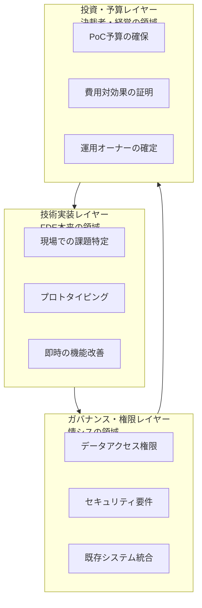

*この記事の全体像。以下、順に解説します。*

## この記事の対象と、読み終えて得られるもの

AI導入プロジェクトに **FDE（Forward Deployed Engineer）** を置いたのに、PoCから先へ進まない。この状況を、担当者の力量ではなく組織構造の問題として読み解きます。

- **対象読者**: AI導入を発注・決裁する側（事業責任者、PdM、情シス責任者）と、現場に入る立場のエンジニア
- **得られるもの**: 海外型FDE論がそのまま効かない理由を3つの前提に分解した見取り図と、FDEを孤立させずに壁を越えるための役割分担の型

結論を先に置きます。**日本企業でFDEを機能させる鍵は、FDE個人の万能化ではなく、稟議・情シス・予算の壁を肩代わりする「防波堤」役を組織側に置くことです。**

## FDEとは何を前提にした職種か

FDEは、Palantirなどで確立された「エンジニアが顧客の現場に常駐し、その場で動くものを作って即座にフィードバックを回す」職種です。売りは **ミッション・ベロシティ**、すなわち課題特定からプロトタイプ提示までの回転速度そのものにあります。

この型が成立するには、暗黙の前提があります。

- 現場の担当者が、実データに触れる判断を自分で下せる
- 小規模な投資判断が、事後承認でも通る
- 業務フロー自体を変えることが、プロジェクトの選択肢に入っている

つまり海外型FDEは、**技術実装レイヤーに専念すれば成果が出る環境**を前提として設計されています。日本企業でつまずくのは、この前提が崩れる点です。

## 海外型導入論を崩す3つの現場前提

### 前提1: 現場の熱量と稟議のリードタイムが分断される

現場担当者がプロトタイプを高く評価しても、次の一歩には稟議が必要です。稟議には数週間から数か月かかります。

問題は待ち時間そのものではなく、**熱量の減衰**です。FDEの強みは短い反復にありますが、反復の間に決裁の待機が挟まると、以下が同時に起きます。

- 評価してくれた現場担当者の関心が、日常業務へ戻る
- 待機中のFDEが手持ち無沙汰になり、要件の作り込みへ逃げる
- 決裁が下りる頃には、当初の課題認識が古くなっている

**「速く作れること」は、「速く決められること」とセットでなければ価値になりません。**

### 前提2: 事業部門の合意だけでは実データに触れられない

AIの検証は、実データがなければ意味のある精度評価になりません。しかし日本の大企業では、データアクセスの権限が情報システム部門に集中しています。

事業部門の「使っていいですよ」は、多くの場合、権限としての承認ではありません。ここを踏み外すと2つの失敗に分かれます。

| 進め方 | 起きること |
|---|---|
| 情シスを飛ばしてダミーデータで進める | 精度が実データで再現せず、本番化の判断材料にならない |
| 情シスを飛ばして実データを持ち出す | セキュリティインシデント扱いとなり、プロジェクトが強制停止 |

**情シスは最後に承認をもらう相手ではなく、初期から要件を一緒に決める相手です。**

### 前提3: PoC予算と本番予算は別の稟議である

PoCが成功しても、その勢いで本番化へ進めるわけではありません。多くの企業で、PoC予算と本番運用予算は別の決裁ラインに乗ります。

本番稟議で問われるのは、精度の数字だけではありません。

- 費用対効果（誰のどの工数が、いくら減るのか）
- 運用体制（障害時に誰が一次対応するのか）
- リスク対策（誤出力が業務に流れたとき、どこで止まるのか）

これらはPoCが終わってから集め始めると間に合いません。**本番稟議の要件から逆算して、PoCと並行して材料を作る必要があります。**

## 3つのレイヤーの衝突として整理する

3つの前提は、それぞれ独立した困りごとではありません。**FDEが1つのレイヤーしか担当しないのに、通過しなければならない関門が3つある**という構造の問題です。

海外型FDEは、レイヤー2と3が現場へ委譲されているか、事後承認で進む前提に立っています。日本企業では、レイヤー1を進めるためにレイヤー2と3を先に突破しなければなりません。**このとき「誰が突破するのか」を決めていないと、暗黙のうちにFDEへ寄せられます。**

## 選択肢の比較: 3つのアプローチ

日本企業でPoC死を防ぐFDEの在り方として、3つのアプローチが考えられます。

### アプローチ1: 海外型FDEの徹底（ゲリラ的PoC）

調整を省き、現場で圧倒的に動くプロトタイプを作り、事後承認で情シスと決裁者を巻き込みます。

- **効く条件**: セキュリティ基準が緩く、事後承認の文化がある組織
- **崩れ方**: 基準の厳しい大企業ではインシデント扱いとなり、プロジェクトごと強制停止される

### アプローチ2: 日本型FDEへの再定義（孤軍奮闘モデル）

FDE自身が、技術実装に加えて情シス折衝、稟議書作成、本番を見据えた業務設計まで一手に担います。

- **効く条件**: 短期・小規模で、担当者が1人で全体を見渡せる案件
- **崩れ方**: 調整業務が実装時間を侵食し、FDEの唯一の強みである速度が失われる。さらに調整そのものが目的化し、優秀な人材のバーンアウトや離職を招く

**「日本の事情に合わせる＝FDEに全部やらせる」は、最も選ばれやすく、最も破綻しやすい選択です。**

### アプローチ3: 防波堤モデル（推奨）

FDEは現場の技術実装と反復に専念し、PdMや推進担当の役員スポンサーが防波堤となって、情シス調整と稟議対応を肩代わりします。

- **効く条件**: ビジネス側にAIの前提を理解した調整役を置ける組織
- **崩れ方**: 防波堤役がAIを理解していない場合、伝言ゲームになり調整が空回りする

| 観点 | 海外型徹底 | 孤軍奮闘 | 防波堤モデル |
|---|---|---|---|
| 実装速度 | 高い | 低い | 高い |
| ガバナンス突破 | 事後承認頼み | 可能だが遅い | 組織として可能 |
| 人材の持続性 | 中 | 低い | 高い |
| 組織側の要求水準 | 低い | 低い | 高い |

## なぜ「日本型FDE」ではなく「防波堤モデル」なのか

当初は、日本の環境に合わせてFDE自身が稟議・情シス・予算の壁を突破すべき、という仮説が有力でした。しかし調査の反証過程で、2つのリスクが浮かびました。

1. **手段の目的化**: 初期から過度に関係者を巻き込むと、調整の完遂そのものが目的になり、アジャイルな導入を阻害する
2. **アナログ業務の上乗せ**: 業務フローが未整理のまま運用所有者を先に決めると、既存の非効率な手順にAIを足すだけで終わる

いずれも、FDE個人に負担を集中させた結果として現れます。**FDEを万能化する方向は、速度と人材の両方を失います。** ゆえに、負担を組織側の役割へ配分する防波堤モデルが残ります。

## 実務での配置: 3つの推奨アクション

### 1. 「防波堤」となるPdM・スポンサーを、FDEとセットで置く

稟議書の作成や情シスとの交渉をFDEへ丸投げしないことが出発点です。プロジェクト立ち上げ時に、次の役割を明示してアサインします。

- **PdM**: 情シスとのデータ要件調整、業務側の合意形成、本番稟議の材料整理
- **役員スポンサー**: 部門をまたぐ決裁の押し込み、優先度の宣言

判断基準は単純です。**FDEが「実装以外の理由」で手を止めた時間を、防波堤役の未整備として扱えているか。** ここを個人の調整力の問題にした時点で、モデルは機能していません。

### 2. 本番化稟議から逆算し、PoCと並行して材料を作る

PoCが成功してから本番の議論を始めるのでは遅すぎます。PoC開始と同時に、ビジネス側が次を並行で用意します。

- 費用対効果の試算（対象業務、削減工数、算定根拠）
- リスク対策（誤出力の検知点、人による確認の位置）
- 運用体制の素案（一次対応、モデル更新、問い合わせ窓口）

**PoCの成果物は「動くもの」だけではなく、「本番稟議を通す材料」まで含めて定義します。**

### 3. 業務プロセスの再設計権限を、限定的にでも付与する

既存の非効率なフローにシステムを合わせると、AIの恩恵は打ち消されます。FDE（または連携するPdM）に対し、範囲を区切ったうえで業務フロー自体を変更する権限を与えます。

あわせて、運用所有者を初期に固めすぎないことも重要です。プロトタイプを触りながら、最適な業務フローと担当者を再定義していく順序を取ります。

## 実装前に確認したいチェックリスト

FDEを置く前に、次の問いへ答えられるかを確認します。答えられない項目が、そのままPoC死の予測地点になります。

- プロトタイプが評価されてから次の決裁までのリードタイムは何日か
- 実データへのアクセス可否を判断できるのは、どの部署の誰か
- 情シスは、いつプロジェクトに参加するのか
- 本番稟議で問われる項目は何か。誰がその材料を集めるのか
- 業務フローの変更は、誰の承認で可能か
- FDEが実装以外に費やしている時間は、週あたり何割か

## まとめ

- 海外型FDEは、**技術実装に専念すれば成果が出る環境**を前提としています
- 日本企業では、**稟議のリードタイム／情シスへの権限集中／PoCと本番の予算分断**という3つの前提が異なります
- この差を「FDE個人が全部やる」で埋めると、速度と人材の両方を失います
- 有効なのは、**PdMと役員スポンサーが調整を肩代わりする防波堤モデル**です
- 実務では、①防波堤役のセット配置、②本番稟議からの逆算、③業務フロー変更権限の付与、の3点から着手します

FDEという職種を輸入する前に、**その職種が前提としている環境まで輸入できているか**を確認する。ここが、PoC止まりと定着を分ける分岐点です。

この記事が少しでも参考になった、あるいは改善点などがあれば、ぜひリアクションやコメント、SNSでのシェアをいただけると励みになります！

## 参考リンク

- [日本企業のFDE、海外型導入論を崩す3つの現場前提](https://zenn.dev/ohmiyamizuki/articles/fde-japan-3-gaps)
