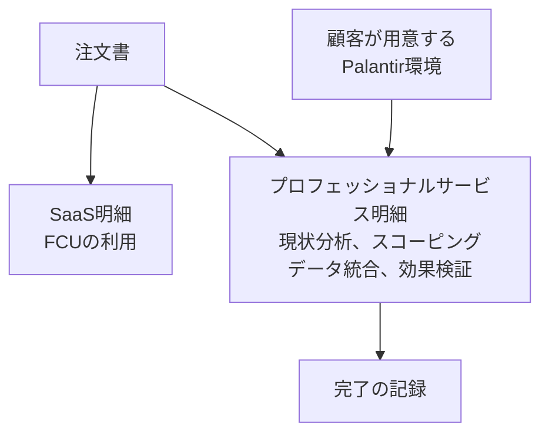

発注側が、富士通のFDE（Forward Deployed Engineer）を受けるときに、利用料と作業費をどの行に分け、受け入れを誰が判定するかを決められます。日経クロステックの有料本文は未確認で、2026年9月28日の公開リードと、富士通が公開している発表、IR資料、サービス仕様書を材料にしています。

*この記事の全体像。以下、順に解説します。*

## 富士通のFDEとは

富士通は2026年9月10日、PalantirのGlobal FDE Partnerとして、Palantir AIPとPalantir Foundryの販売・提供に加え、顧客課題の特定、ユースケース設計、業務実装を担うと発表しました。FDEは、その発表では現場で成果までつなぐ役割です。日経クロステックの公開リードは、相手を事業部門にし、対価を利用料にすると伝えています。発注側が見る公開仕様は、Fujitsu Data Intelligence Premiumにあります。利用の単位はFoundry Compute Unit（FCU）で、現状分析とスコーピングは別型番のプロフェッショナルサービスです。

### 協業の範囲と提供の段

2026年9月10日の協業範囲は、次の4つです。協業の起点は2020年です。

- 製品の販売・提供
- 課題の特定
- ユースケース設計
- 業務への実装

2026年9月16日のIR Dayでは、提供の段が Consulting、FDE、Application / Agent、AI / Sovereign Platform に分かれています。FDEの説明は「AI実装から成果創出まで伴走」です。

### サービス仕様が分ける利用と作業

公開仕様書 GC0052-EN001（Fujitsu Data Intelligence Premium）は、SaaSとプロフェッショナルサービスを分けています。

| 区分 | 型番 | 名称 |
|---|---|---|
| SaaS | SVS920203 | Data Mesh Prepaid |
| SaaS | SVS920204 | Exceed |
| プロフェッショナルサービス | SVS920206 | Integration Service |

SaaSの利用単位は、Palantirが定義するFCUです。期間内のFCUを超えた分は、月末締めの超過数に単価を掛けた利用料になります。

Integration ServiceのStatement of Workに列挙されている作業は、現状分析、スコーピング、データ閲覧、データ整備とクレンジング、データ統合、効果検証、問い合わせ対応です。

プロフェッショナルサービス利用規約（2025年4月15日）は、注文書の明細ごとに個別契約とします。実施の保証は、重要な点で仕様書に合致することと、善管注意義務です。同じ規約は、ワンオフまたは従量のプロフェッショナルサービスを、顧客の検収書面（記名押印）または所定のメールで完了とします。サービス仕様書に検収条件があれば、そちらが規約より優先します。注文書はさらに優先します。

Data Intelligence Premiumの仕様書10条は、富士通が渡す完了報告書をもって、そのプロフェッショナルサービスの完了の証明とします。仕様書9条は、富士通が新規に作ったプログラムと文書の著作権を富士通に残します。所定のコード置き場にあるプログラムを顧客が改変した場合、その改変の著作権は無償で富士通に帰属する、と書いています。

仕様書3.8は、プロフェッショナルサービスを使う顧客が、自己の費用でPalantirのプラットフォームを用意する、と書いています。仕様書4.1は、富士通がPalantir機能を使うためのライセンスをFCUで提供する、と書いています。

### 注文書の明細と完了の記録

公開仕様の1件は、注文書の明細が別契約になります。利用料の明細と、探索・統合の明細は、別の行として並びます。

完了の記録は、引用する文書で置き場所が変わります。

| 優先 | 文書 | 完了の置き場所 |
|---|---|---|
| 1 | 注文書 | 明細に書いた条件 |
| 2 | 受託条件明細 | 明細に書いた条件 |
| 3 | サービス仕様書 GC0052-EN001 の10条 | 富士通の完了報告書 |
| 4 | プロフェッショナルサービス利用規約 2.1(b) | 顧客の検収書面または所定メール |

IR Day（2026年9月16日、大西CRO資料）の価格部品は、構想立案・初期検証の月額固定、AIユースケースの実装費、プロジェクト費、利用料、成功報酬です。物流の例のラベルは「プロジェクト費＋利用料」です。

## 注意点

日経クロステックの公開リードと、富士通の一次文書は、同じ文を書いていません。有料本文は読んでいません。リードの文言を、契約がすでに置き換わった事実として扱うと、見積もりの行が先に消えます。

| リードの記述 | 一次文書で確認できたこと | 扱い |
|---|---|---|
| IT部門ではなく事業部門と向き合う | 2026年9月10日の発表は「顧客」「顧客現場」「経営課題」。契約当事者を事業部門に変える、とは書いていない | 二次情報。日経クロステック公開リード（2026年9月28日） |
| 対価は人月ではなく利用料 | 2026年5月28日、時田CEOはUvance収益の約7割が人月、価値創造（データ量・ワークロード課金）は約3割、と説明。プロフェッショナルサービスはラストワンマイルにまだ要る、とも説明。2026年9月16日の価格例はプロジェクト費と利用料の併記 | 利用料への全面置換は、この時点の一次では確認できない |
| 2カ月でオントロジーからAIエージェント | 2026年9月10日の日英リリースと、2026年9月16日のIR Dayテキストには、この期間は無かった | 二次情報。日経クロステック公開リード。一次の標準期間としては未確認 |
| 2030年度に売上約1,500億円 | IR Day高橋資料のスライドに「約1,500億円」「FY2030売上試算」「FDEを起点としたビジネス創出」とある。同じスライドに「調査会社各社のデータをもとに富士通にて推計」の脚注がある。Uvanceの計画値として同じ資料にあるのは1.7兆円超。2026年4月28日の磯部CFOの「少なくとも1.5兆円」はUvanceの話で、1,500億円ではない | 1,500億円はスライド上の試算。プレスリリースの確定目標としては未確認。脚注が試算市場と社内計画のどちらに係るかは、文字だけでは確定できない |

英語版リリース（2026年9月10日）は、社名のない日本の大手メーカーについて、サプライヤ3,000超、工場18、1年で1,000万ドル超のコスト削減、業務生産性2倍、と書いています。日本語版の公開本文には、この段落はありません。顧客名つきの第三者資料は、公開範囲では確認できていません。計測条件はリリースにありません。

IR Dayの米国不動産の事例は、業務効率45％向上、本番導入まで4週間、とスライドが書いています。自己申告であり、オントロジー起点の標準期間ではありません。

Palantirの2026年6月30日終了四半期のForm 10-Qは、収益をPalantir Cloud、On-Premises Software、Professional Servicesの3本に分けています。Professional Servicesには、継続的なオントロジーとデータモデリングの支援が含まれます。この契約は、サブスクリプションと同じ期間でも、別の期間でもよい、と書いています。オントロジー支援が利用料の履行義務に自動で入る、とは書いていません。

次の点は、公開文書だけでは決まりません。

- 日経クロステックの有料本文が、利用料の対象範囲を契約条項として書いているか。
- スライドの約1,500億円が、FDE起点の社内売上試算か、調査会社ベースの市場推計か。
- GC0052-EN001が、2026年9月以降のFDE案件の注文書が引用する仕様書か。制定日は、参照した仕様書の範囲では確認できない。
- 英語リリースの無名メーカーが、過去の登壇事例と同一か。同一とは扱っていません。
- 事業部門を契約当事者にしたとき、顧客の調達規程と情報セキュリティ規程がどう通るか。監督官庁の条文で、事業部門の署名だから規程を外せる、と示したものは確認できていません。

英国G-Cloud 14のPalantir価格表は、実装エンジニアリングを人・四半期の別単価にしています。日本の富士通契約ではありません。一部の実装がライセンスに含まれる、という留保も同じ枠にあります。日本案件の定価表としては未確認です。

## 見積もりは4行に分ける

FDEへ実装を寄せる場合でも、見積もりは次の4行に分けます。各行に、対象業務、上限（期間、回数、FCU）、含まない作業、完了条件を書きます。

| 行 | 一次文書上の置き場所 | 要件が固まる前の探索 | 完了の見方 |
|---|---|---|---|
| プラットフォーム利用 | SaaS、FCU、超過利用料 | 入っていない。FCUは機能の利用量 | 契約期間とFCU残量 |
| 探索 | Integration Serviceの「現状分析」「スコーピング」。IRの「構想立案・初期検証の月額固定」 | 費用の置き場所。利用料の行へ含めたいときは、SOWに「含む」と上限を書く | スプリント回数か期間。成果物の完成保証ではない（規約6.1は善管注意） |
| 業務実装 | Integration Serviceの「データ統合」「効果検証」。IRの「AIユースケース実装費」「プロジェクト費」 | 探索で優先が変わったら、仕様書13.1は変更合意の前に作業を始めない、と書いている | 注文書が無言なら、仕様書10条の完了報告書まで上がる |
| 成功報酬 | IRのHybrid課金、Business-Impact Success Fees | 探索の費用ではない。成果KPIが動いた後の別料金 | KPIの定義、計測者、基準時点を別紙にする |

仕様書3.8と4.1は、Palantir環境の費用を顧客が持つか、富士通がFCUライセンスとして出すか、を両方書いています。見積もりでは、FCUの請求者が富士通かPalantirかを1行で書きます。

探索を誰が払うかは、2行目を空欄にしないことで決まります。空欄のまま利用料だけを結ぶと、探索は「含まれていた」とも「別途だった」とも読めます。

個別の注文書が、探索をFCU明細へ一括で入れている可能性は残ります。公開仕様は、その一括を標準にはしていません。提案を受けるときは、公開仕様の4行が注文書の明細に対応しているかを見ます。

## 受け入れは注文書に二つ書く

実装の作業者をFDEにしても、判定者は自動では移りません。残す判定は、注文書に二つ書きます。

事業部門に残す判定は、業務手順と事業KPIです。IPAのアジャイル開発版モデル契約（2020年3月31日）は、プロダクトの方向性と内容の責任を、ユーザ企業が選任するプロダクトオーナーに置いています。富士通の約款そのものではありません。発注側が同じ役割分担を使うときの参照です。

IT部門に残す判定は、既存システムへの接続、認証、データ所在、セキュリティ対策です。仕様書8.2は、顧客環境のセキュリティを顧客の責任と費用にしています。

ベンダー側で終わり得る判定は、仕様書10条の完了報告書です。規約2.1(b)は、検収が終わると富士通の債務は履行済みとみなす、と書いています。事業部門のKPI判定を残すなら、注文書に「完了報告書は作業完了の通知であり、業務受け入れは事業部門の判定で成立する」と書きます。注文書が最優先です。

民法第648条の2は、成果に報酬を約し、引渡しを要するときは、報酬を引渡しと同時としています。期間で報酬を定める委任は、第648条第2項が別の請求タイミングを用意しています。利用料（期間と利用量）と、成果完成（引渡し）と、期間報酬（月額の探索）は、同じ条項には乗りません。請求のタイミングを1つにまとめた条文へ寄せると、どの行の完了で払うのかが読めなくなります。

## 著作権と障害は明細ごとに見る

仕様書9条のまま署名すると、実装の過程でできたプログラムの著作権は富士通に残り、顧客の改変の一部は無償で富士通へ移ります。業務手順、オントロジーに載せた自社データ、効果検証の数値を、顧客側に残す範囲は別紙にします。

別紙に書く最小セットは、次の3つです。

- 業務手順と、オントロジーに載せた自社データの帰属
- 効果検証の数値と、その計測定義の帰属
- 顧客が改変したプログラムのうち、富士通へ無償で移る範囲と、移らない範囲

仕様書13.3は、富士通がPalantir Foundryの提供・内容・機能を保証しない、と書いています。FCU明細の障害と、FDE明細の作業不良は、請求先が分かれ得ます。障害票には、FCUの利用不能か、作業の不良かを先に書きます。

## 指示の出し方は利用料の名前と別である

請求の名前を利用料にしても、現場の指示の出し方は別問題です。

昭和61年労働省告示第37号は、請負の形式でも、業務の遂行方法の指示と評価、労働時間の管理を自ら行わない事業主を、労働者派遣事業を行う事業主とします。判断は契約の名前ではなく実態です。事業部門がFDEの作業手順を日次で指示する形は、この境界に触れます。作業指示をベンダー側の管理者が出す、と契約に書きます。事業部門の関与は、優先順位と受け入れに限る、と書きます。

取適法の情報成果物作成委託（法第2条第3項）は、プログラムを情報成果物に含みます（法第2条第7項第1号）。公正取引委員会のQ29は、販売目的ソフトウェアのコーディングを、特定成果物ではなく常駐の業務委任と呼んでも、情報成果物作成委託に当たる、と答えています。給付内容を「システム開発支援業務」と書いても、受領と支払期日の規律は残ります。Q4は、指揮命令下の労働者派遣は取適法の委託には当たらない、と答えています。

どちらの側に倒れても、利用料というラベルが両方を消す、とは読めません。富士通本体を受託者にする取引が、署名部署を事業部門に変えただけで中小受託取引になる、という定めは確認できていません。再委託先が中小なら、再委託の側で別の適用があり得ます。

## 一次文書が支持する範囲

確認できた対価の構造は、FCUの利用料と、探索・実装のプロフェッショナルサービスに分かれています。探索を利用料に含める条項は、確認した文書にはありません。受け入れを事業部門に残すなら、注文書で書きます。

この読みを支える事実は、次のとおりです。

- 仕様書が型番とSOWの作業リストを分けている。
- 利用規約が明細ごとの個別契約と、善管注意と、顧客検収を書いている。
- IR Dayがプロジェクト費、利用料、実装費、初期検証の月額、成功報酬を並べている。
- 2026年5月28日の質疑が、Uvanceの約7割はまだ人月だと説明している。
- Palantirの10-Qが、オントロジー支援をProfessional Servicesとして、サブスクリプションと別期間にし得ると書いている。

読みを狭める事実は、次のとおりです。

- 日経の公開リードは、相手と対価の置き換えを完了した話として読めます。一次文書はそこまで書いていません。リードを棄却する材料は「未記載」であり、有料本文の反対証拠ではありません。
- 約1,500億円はIRスライドに実在します。存在しない数字ではありません。確定した売上計画でもありません。
- 個別の注文書が、探索をFCU明細へ一括で入れている可能性は残ります。公開仕様は、その一括を標準にはしていません。

## まとめ

見積もりは、FCUの利用、探索、業務実装、成功報酬の4行で受けます。探索の行には期間か回数の上限を書き、利用料の行には「現状分析とスコーピングを含まない」か「この上限まで含む」のどちらかを書きます。

受け入れは二つ書きます。事業部門は業務KPIと業務手順を判定します。IT部門は接続、認証、データ所在、セキュリティを判定します。ベンダーの完了報告書は作業完了の通知にとどめ、債務の終了とKPI判定を同じ日にしません。

著作権は仕様書9条を読み、業務データとオントロジーの帰属を別紙にします。現場の作業指示はベンダー側管理者が出す、と書き、事業部門の関与は優先順位と受け入れに限ります。

この4行が空欄の提案は、人月から利用料へ移った提案としては受け取れません。移ったのは、確認できた範囲では、利用量の行が増えたことまでです。

この記事が少しでも参考になった、あるいは改善点などがあれば、ぜひリアクションやコメント、SNSでのシェアをいただけると励みになります！

## 参考リンク

- [富士通・Palantir共同発表（日本語、2026年9月10日）](https://global.fujitsu/ja-JP/pr/news/2026/09/10-01)
- [富士通・Palantir共同発表（英語、2026年9月10日）](https://global.fujitsu/en-global/pr/news/2026/09/10-01)
- [EE Times Japan（2026年9月10日）](https://eetimes.itmedia.co.jp/ee/articles/2609/10/news096.html)
- [日経クロステック公開リード（2026年9月28日。有料本文は未読）](https://xtech.nikkei.com/atcl/nxt/column/18/03744/091700004/)
- [中長期経営ビジョン2035 質疑（2026年5月28日）](https://global.fujitsu/-/media/Project/Fujitsu/Fujitsu-HQ/ir/documents/plan/FY2026/ManagementVision2035qa-ja.pdf)
- [2025年度決算質疑（2026年4月28日）](https://global.fujitsu/-/media/Project/Fujitsu/Fujitsu-HQ/ir/documents/Financial_Results/FY2025/FY/2025FY-Questions-and-Answers-ja.pdf)
- [IR Day 2026 高橋COO資料](https://resources.global.fujitsu/prir/2026/09/2026-IRDay-04-ja.pdf)
- [IR Day 2026 大西CRO資料](https://resources.global.fujitsu/prir/2026/09/2026-IRDay-03-ja.pdf)
- [Fujitsu Data Intelligence Premium サービス仕様書 GC0052-EN001](https://global.fujitsu/-/media/Project/Fujitsu/Fujitsu-HQ/documents/terms-and-conditions/ss-fujitsu-data-intelligence-premium/v1/ss-fujitsu-data-intelligence-premium-en001.pdf)
- [富士通プロフェッショナルサービス利用規約（2025年4月15日）](https://global.fujitsu/-/media/Project/Fujitsu/Fujitsu-HQ/documents/terms-and-conditions/gtc/v2/general-terms-and-conditions-for-professional-services-v2-ja.pdf)
- [Palantir Form 10-Q（四半期は2026年6月30日終了）](https://investors.palantir.com/files/2026%20Q2%20PLTR%2010-Q.pdf)
- [IPA 情報システム・モデル取引・契約書（アジャイル開発版）](https://www.ipa.go.jp/digital/model/agile20200331.html)
- [民法（e-Gov、第648条、第648条の2）](https://laws.e-gov.go.jp/law/129AC0000000089)
- [公正取引委員会 取適法の運用基準](https://www.jftc.go.jp/toriteki/legislation/unyou.html)
- [公正取引委員会 取適法Q&A（Q4、Q29）](https://www.jftc.go.jp/toriteki/toriteki_qa.html)
- [労働省告示第37号](https://www.mhlw.go.jp/web/t_doc?dataId=75024000&dataType=0&pageNo=1)
