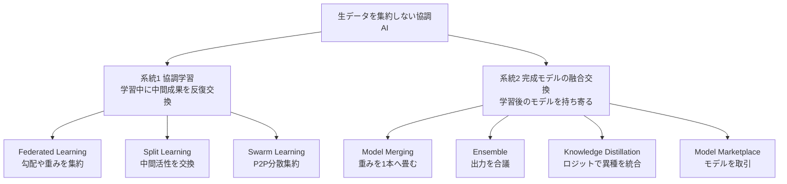
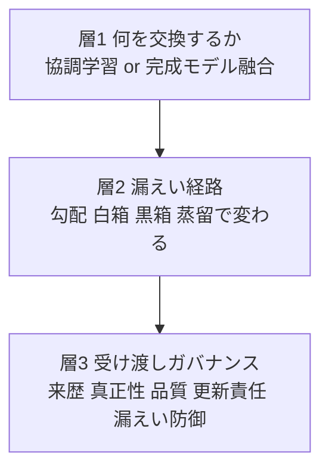

## この記事の問い

製造現場のデータには、4つの制約が同時にかかります。

| 制約 | 内容 |
|---|---|
| 秘匿性 | 欠陥画像・稼働データが機密で、クラウドに送れない |
| 現場差 | 欠陥が稀で多様、1拠点ではデータが偏り不足する |
| 大容量 | 全量をクラウドへ送るのは通信・保管コストが重い |
| 競争機微 | 生データ全量の集約は競争上の機微を晒す |

この4重苦のため、「クラウドに生データを集めて1つの大きなAIを育てる」という定石が通りません。そこで浮上したのが **「データを動かさず、モデルを動かす」** という発想です。各現場が手元のデータで育てたモデルだけを持ち寄って統合します。オムロンは非集中学習技術 **Decentralized X（DcX）** として、これを製造・社会システム・ヘルスケアへ広げようとしています。

判断支援者として本記事が問うのは1点だけです。

> **「生データを渡さない」は、本当に安全の担保になるのか。**

結論を先に述べます。**「生データを渡さない」は境界設計の必要条件であって、十分条件ではありません。** モデルは学習データの派生物です。渡す成果物（勾配・重み・蒸留出力・API）ごとに情報が漏れる経路があります。しかも「蒸留すれば漏れない」という直感は、一次研究で否定されています。したがって、モデルを持ち寄る運用は「データ共有契約」と地続きの **モデル共有契約** として設計する必要があります。そしてその防御手段は、現状どれも精度・普及・法制度の壁を抱え、万能ではありません。

## 特徴1: 「モデルを持ち寄る」には2系統ある

「data stays, model moves」は一枚岩ではありません。何を・いつ交換するかで、大きく2系統に分かれます。

| 要素 | 説明 |
|---|---|
| 系統1 協調学習 | 学習の途中に中間成果を反復交換し、1本を共同で育てる方式 |
| 系統2 完成モデルの融合交換 | 別々に育ったモデルを後から束ねる・取引する方式 |
| Federated Learning | 勾配や重みを中央で集約する代表方式（FedAvg） |
| Split Learning | ネットワークを分割し中間活性のみ交換する方式 |
| Swarm Learning | 中央集約者を置かず P2P で重みを持ち回る方式 |
| Model Merging | 学習後の重みを1本へ畳み込む方式（one-shot） |
| Ensemble | 複数モデルを並存させ推論時に出力を合議する方式 |
| Knowledge Distillation | 教師のロジットを生徒へ転写し異種モデルを1本化する方式 |
| Model Marketplace | モデルを取引財として売買・交換する方式 |

オムロンDcXは「学習済みモデルのみを統合・蒸留する」と説明されています。字義どおりなら、FedAvg 型の密な反復集約ではなく、系統2（蒸留による融合）に位置づきます。両者は連続体ですが、「持ち寄って交換」という言葉のニュアンス（独立に育つ・低頻度・統合や取引）は系統2寄りです。

重み平均（FedAvg）が効くのは、全モデルが同一構造のときだけです。構造やサイズが違う現場モデルを1本化するなら、蒸留が必要になります。DcXが蒸留を選ぶのは、この「異種統合」の要請と整合します。

## 特徴2: 「何を渡すか」でリスクが決まる

生データを渡さない担保は、結局「生データ以外の何か（勾配・重み・活性・ロジット・完成モデル）だけを出す」ことに帰着します。そして **出すものごとに、成立する攻撃が変わります**。ここが「モデルを渡せば安全」が成立しない核心です。

| 渡す成果物 | 最も効く漏えい | 生データ非開示でも成立する根拠 |
|---|---|---|
| 重み全体（白箱） | model inversion / property inference / membership inference / 記憶抽出 | 重みが決定境界・特徴統計・場合により生サンプルを内包 |
| 勾配・モデル更新（FL / split） | gradient inversion / smashed data 逆再構成 | 単一サンプルの完全勾配が入力復元に足る情報を符号化 |
| 蒸留student・soft label | 蒸留 membership inference（teacher と student 両方） | student が teacher 同等以上に漏らすケースの存在 |
| 予測API出力のみ（黒箱） | model extraction から二次白箱攻撃へ連鎖 | 出力（特に confidence）から関数複製・メンバー判定 |
| 中間表現・embedding | split learning 逆再構成 | 中間活性から生入力を再構成可能 |

### 誇大と過小の両方を補正する相場観

勾配からの画像復元は、条件依存です。**バッチサイズ30未満・解像度64×64未満・early training・少ローカル更新に強く依存**し、128×128や多ステップSGD・大バッチでは劣化・失敗します（SoK: Gradient Leakage in FL、一次HTML確認）。「性能最適化された実運用モデルは、視覚的に意味ある復元に一貫して耐える」という一次主張もあります。

ただし、これは **「サーバが正直（honest-but-curious＝プロトコルには従うが盗み見はする集約者）」前提に限られます**。悪性サーバがモデルを改変すれば、**secure aggregation 下・数百クライアントでも** 個別データを分離復元できます（LOKI、IEEE S&P 2024。CIFAR-100で6400枚中5290枚=82.66%リークと報告 [二次:abstract]）。他社・他拠点とモデルを持ち寄る運用では、「基盤運営者を信頼できるか」が条件になります。

防御は脅威ごとに効き方が違います。特に **property inference（データ構成比・製造条件など集団統計＝営業秘密の漏えい）は、record-level の差分プライバシーでは原理的に守れません**。個人特定ではないため見落とされがちですが、事業機密として要注意です。

## 概念構造: 3層の掛け算で設計する

「生データを渡さずモデルを持ち寄る」運用は、3層の掛け算で捉えると意思決定に落ちます。

| 要素 | 説明 |
|---|---|
| 層1 何を交換するか | 協調学習か完成モデル融合か、頻度・構造・統合形態で決める技術類型 |
| 層2 漏えい経路 | 渡す成果物ごとに変わる model inversion・membership inference 等の経路 |
| 層3 受け渡しガバナンス | 来歴・真正性・品質保証・更新責任・漏えい防御の契約と技術 |

### 層1: 何を交換するかを3軸で決める

| 判断軸 | 問い | 帰結 |
|---|---|---|
| 持ち寄り頻度 | 反復同期か、低頻度か1回か | 反復なら FL、低頻度なら merging・蒸留・市場 |
| モデル構造の同一性 | 現場モデルは同構造か | 同構造なら FedAvg・merging、異種なら蒸留・ensemble |
| 統合形態 | 1本化か、並存か、取引か | merging・蒸留は1本、ensemble は並存、marketplace は取引 |

### 層2: 渡す成果物と漏えい経路の対応

層2は特徴2の表がそのまま設計材料になります。渡す粒度が上がるほど攻撃面が広がる、という前提でリスクを評価します。白箱の重みが最も攻撃面が広く、黒箱APIでも model extraction から白箱攻撃への連鎖が残ります。

### 層3: 受け渡し条件チェックリスト

生データを渡さなくてもモデル経由でデータが漏れる以上、モデルを持ち寄る運用は **データ共有契約と同等の統制** を要します。現場別モデルを交換・持ち寄る運用で、契約と技術の両面から要求する項目を整理します。

**来歴 Provenance**

- Model Card（intended use / metrics / eval・training data / limitations）の添付
- 学習データの Datasheet（collection / uses / maintenance）の添付
- 機械可読 BOM（CycloneDX ML-BOM または SPDX 3.0 の AI + Dataset Profile）の添付
- version / lineage / 親モデル / ライセンスの記録

**真正性 Integrity**

- Sigstore・OMS 署名と透明性ログ（Rekor）の inclusion proof 検証
- 改ざん検知ハッシュの付与

**品質保証 Fitness**

- intended use / out-of-scope の明示
- 評価データセット（分布記述）の同梱または参照、性能保証の範囲限定
- 受領側の受け入れ試験（自ドメイン再評価、劣化しきい値のゲート化）
- non-IID・ドメイン分布差の警告

**更新責任 Lifecycle**

- ドリフト監視の所在（誰が・どの指標か）、retrain・patch の権限とSLA
- 不具合責任の分界（来歴虚偽は提供側、intended use 内の運用劣化は受領側）
- rollback 可能な version 識別、EOL 通知

**漏えい・法規 Risk/Compliance**

- アクセス形態（白箱・黒箱）の選択と逆推定リスク評価
- model inversion・membership inference 防御（差分プライバシーとε開示、confidence 制限、過学習抑制）
- 再配布・派生モデルの可否と条件
- AS-IS 免責と補償、ただし来歴虚偽・既知欠陥不開示は免責外
- EU AI Act 対応（Art.13 使用説明書 / Art.11+Annex IV 技術文書 / Art.12 ログ記録）

来歴・使用目的制約・逆推定リスクの3点で、生データ共有契約と地続きになります。データ主権フレームワーク（International Data Spaces の usage control、Catena-X の EDC）は、「生データの主権」を「モデル・派生物の流通」へ転用できる余地があります。ただし、モデル流通向けに標準化された usage policy 語彙は、本調査時点で確認できていません。

EU AI Act の Art.13「使用説明書」は、事実上 Model Card に近い内容です。Art.11 と Art.12 が、交換モデルの traceability を制度的に裏打ちします。条文は非公式の再現サイト経由で参照しており、正本 Regulation (EU) 2024/1689 での確認が必要です。高リスク義務の適用開始は 2026-08-02 とされます [要再検証]。

## 反証と限界: 「設計すれば運用できる」への複合反証

本記事の結論で最も脆いのは、「ガバナンスで潰せば有効に運用できる」の部分です。反証を対等に置きます。

### 反証1: 持ち寄りの精度前提が崩れうる

FedAvg は non-IID 環境で精度が **最大およそ55%低下** します。その改善策が「全端末に少量のグローバル共有データを配る（CIFAR-10で5%共有→精度+30%）」であり、**生データ非集約という境界の後退に回帰** します [数値は二次経由・一次論文あり]。近年評価でも、中央集約との精度ギャップは **最大29%** 残ります [二次]。さらに現場差が大きいほど、**negative transfer（統合モデルが各現場の単独学習に劣る現象）** が起きやすくなります。**持ち寄りの動機（現場差）と失敗条件（現場差）が同一** という諸刃の剣です。

### 反証2: 蒸留は「漏れない」を保証しない

DcXの売り文句「学習済みモデルのみを統合・蒸留するので情報漏洩リスクはない」[二次] は、**student が teacher 同等以上にメンバーシップを漏らす** という一次研究（Students Parrot Their Teachers、NeurIPS 2023）と正面衝突します。「蒸留すれば安全」は categorical には成立しません。

### 反証3: 差分プライバシーは「保護か実用か」の二択になりうる

実用精度を保つεでは、membership inference や逆推定を実質防げません。防げるεでは、製造検査に使えない精度になる恐れがあります（ε≈10で臨床許容、ε≈1で大幅精度低下）[二次]。「安全かつ実用」の動作点が、製造用途で確保できるとは限りません。

### 反証4: ガバナンス標準は実務で形骸化しがち

Hugging Face 32,111枚の実測で、**Model Card 保有は44.2%** にとどまります。しかも本記事が重視する「limitations / evaluation」欄が、最も空白でした [数値は二次経由・一次論文あり]。モデル署名（真正性）も、MLサプライチェーンで未普及・初期段階です。

### 反証5: 更新責任は契約で移せない

EU AI Act では、**規制責任を契約で放棄できません**。受領側がモデルを再学習・蒸留・改変すると substantial modification とみなされ、**受領側自身が「provider」に転化** して重い義務を負う可能性があります [二次:法律事務所解説複数]。「更新責任を受け渡し条件に含めれば」という発想は、規制責任の非譲渡性という壁にぶつかります。

### 反証6: DcXの公表数値は独立検証されていない

「開発期間75%短縮（MONOistの見出しは7割=70%とブレ）・約50%コスト削減」は、**単一ベンダー自己申告・査読や第三者再現なし・ベースライン不明** です [二次]。宣伝値として扱うべき数字です。オムロン公式ドメインは本文取得ができず（HTTP 403）、DcXの仕組み・数値・「FedAvg はパラメータ平均、DcX は蒸留統合」という差分定義は、二次媒体の裏取りに依存しています [一次未確認]。

### 頑健な側

「モデルを渡せば安全ではない」という中核認識は覆りません。勾配反転が実運用で誇大という反証（honest-but-curious 限定）を踏まえても、悪性サーバ・蒸留漏えい・property inference により、リスクの存在自体は残ります。

## 未解決の問い

- 製造の non-IID・希少データで、持ち寄り（蒸留統合）が各現場の単独学習を実際に上回る条件は何か。上回らない現場をどう事前に見分けるか。
- 「安全かつ実用」の差分プライバシー動作点は、製造外観検査で確保できるのか。できないなら、TEE・出力最小化・受け渡し粒度制限で代替できるか。
- International Data Spaces・EDC の usage control を「モデル・派生物」に適用する標準語彙は整備されるか。
- 蒸留統合で「漏れない」を実際に担保するには、DP蒸留・記憶抽出テストなど何を追加すべきか。
- 受領側が provider に転化する境界（substantial modification）を、モデル持ち寄り運用でどう線引きするか。

## 判断支援者としての推奨

| 推奨 | 要点 |
|---|---|
| 「生データを渡さない」を結論にしない | 渡す成果物（勾配・白箱重み・蒸留・黒箱API）の選択を最初の設計判断に据え、粒度が上がるほど攻撃面が広がる前提で評価 |
| 脅威モデルを明示する | 「基盤運営者を信頼できるか」を先に決め、信頼できないなら TEE・改ざん検証・DP併用を要求 |
| 「モデル共有契約」として設計する | 来歴・真正性・品質保証・更新責任・漏えい防御を条件化、ただし標準の形骸化・署名未普及・規制責任非譲渡を織り込む |
| ベンダーの「漏れない」「N%削減」を鵜呑みにしない | 蒸留=安全は一次研究で否定、効果数値は自己申告。PoC で自ドメインの精度・漏えい・negative transfer を実測 |
| 持ち寄りが逆効果になる現場を想定する | 現場差が大きいほど negative transfer のリスク増。全現場一律でなく、受け入れ試験で「持ち寄る・単独で残す」を選別 |

## まとめ

生データを渡さずモデルを持ち寄る運用は、製造データの4重苦に対する現実的な境界設計です。ただし「生データを渡さない」は安全の必要条件にすぎず、モデルは学習データの派生物として渡す成果物ごとに漏えい経路を持ち、蒸留も例外ではありません。採否は、脅威モデルの明示と受領側の再評価を前提にした「モデル共有契約」として、条件付きで判断すべきです。

この記事が少しでも参考になった、あるいは改善点などがあれば、ぜひリアクションやコメント、SNSでのシェアをいただけると励みになります！

## 参考リンク

- 公式ドキュメント・標準
  - [Model Cards for Model Reporting (arXiv:1810.03993)](https://arxiv.org/abs/1810.03993)
  - [Datasheets for Datasets (arXiv:1803.09010)](https://arxiv.org/pdf/1803.09010)
  - [CycloneDX ML-BOM / ECMA-424](https://ecma-tc54.github.io/ECMA-424/)
  - [SPDX 3.0 AI Profile](https://spdx.github.io/spdx-spec/v3.0.1/model/AI/AI/)
  - [EU AI Act (Regulation (EU) 2024/1689, EUR-Lex)](https://eur-lex.europa.eu/eli/reg/2024/1689/oj)
  - [International Data Spaces Association](https://internationaldataspaces.org/)
- GitHub
  - [Sigstore model-transparency](https://github.com/sigstore/model-transparency)
  - [Stealing ML Models via Prediction APIs (steal-ml)](https://github.com/ftramer/steal-ml)
- 論文・記事
  - [Advances and Open Problems in Federated Learning (arXiv:1912.04977)](https://arxiv.org/pdf/1912.04977)
  - [Communication-Efficient Learning / FedAvg (AISTATS 2017)](https://proceedings.mlr.press/v54/mcmahan17a.html)
  - [Ensemble Distillation for Robust Model Fusion in FL (arXiv:2006.07242)](https://arxiv.org/abs/2006.07242)
  - [Deep Leakage from Gradients (arXiv:1906.08935)](https://arxiv.org/abs/1906.08935)
  - [Inverting Gradients (arXiv:2003.14053)](https://arxiv.org/abs/2003.14053)
  - [SoK: Gradient Leakage in Federated Learning (arXiv:2404.05403)](https://arxiv.org/html/2404.05403v1)
  - [LOKI: Data Reconstruction via Model Manipulation (arXiv:2303.12233)](https://arxiv.org/abs/2303.12233)
  - [Model Inversion Attacks that Exploit Confidence Information (CCS 2015)](https://dl.acm.org/doi/10.1145/2810103.2813677)
  - [Membership Inference Attacks Against ML Models (S&P 2017)](https://dblp.org/rec/conf/sp/ShokriSSS17.html)
  - [Property Inference Attacks on FCNN (CCS 2018)](https://dl.acm.org/doi/10.1145/3243734.3243834)
  - [Students Parrot Their Teachers: 蒸留 MIA (arXiv:2303.03446)](https://arxiv.org/abs/2303.03446)
  - [Extracting Training Data from LLMs (arXiv:2012.07805)](https://arxiv.org/abs/2012.07805)
  - [Practical Feasibility of Gradient Inversion Attacks (arXiv:2508.19819)](https://arxiv.org/abs/2508.19819)
  - [Deep Learning with Differential Privacy / DP-SGD (arXiv:1607.00133)](https://arxiv.org/abs/1607.00133)
  - [Practical Secure Aggregation for FL (arXiv:1611.04482)](https://arxiv.org/abs/1611.04482)
  - [What's documented in AI? Analysis of 32K Model Cards (arXiv:2402.05160)](https://arxiv.org/abs/2402.05160)
  - [ML Models Have a Supply Chain Problem (arXiv:2505.22778)](https://arxiv.org/abs/2505.22778)
  - [Federated Learning with Non-IID Data (arXiv:1806.00582)](https://arxiv.org/abs/1806.00582)
  - [A Thorough Assessment of the Non-IID Data Impact in FL (arXiv:2503.17070)](https://arxiv.org/html/2503.17070v1)
  - [オムロン Decentralized X ブランドページ](https://www.omron.com/jp/ja/technology/information/brand/dcx/)
  - [automation-news: オムロン サイニックエックス DcX](https://www.automation-news.jp/2026/06/105598/)
  - [MONOist: AIの学校で開発期間を7割削減 蒸留するオムロンのDcX](https://monoist.itmedia.co.jp/mn/articles/2606/16/news043.html)
