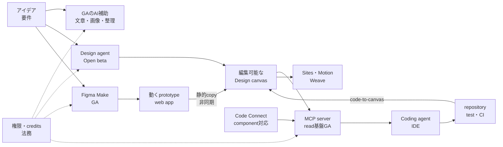

> この記事は2026年7月17日時点の公開情報を基にしています。FigmaのAI機能は更新が速いため、導入時には公式のリリースノートとHelp Centerも確認してください。

## 概要

FigmaのAI対応は、アイデア生成から編集可能なデザイン、動くプロトタイプ、デザイン文脈を使ったコード生成、コードのキャンバスへの取り込みまで広がっています。

ただし、すべての機能が同じ成熟度ではありません。個別AIツール、Figma Make、MCP server基盤は一般提供（GA）です。一方、Design agent、MCPのキャンバス書き込み、Figma Sites、Motion、Weave tools、code layersにはbetaが残っています。

そのため、Figma AI全体を一括して「実用段階」または「まだbeta」と評価すると実態を見誤ります。現時点では、**機密データを使わないGA機能とread-only MCPから始める段階導入**が妥当です。

Figmaの強みは、生成モデル単体の品質だけではありません。既存のデザイン資産、共同レビュー、variables、components、Dev Mode、Code Connect、MCPを同じワークフローへ接続できる点にあります。

ただし、この強みには前提条件があります。Code Connect、npm package、詳細なguidelines、整ったFigma file、検証pipelineがなければ、接続コストが便益を上回る場合があります。

## 特徴

Figma AIには、異なる成熟度の機能が共存しています。

| 特徴 | 内容 |
|---|---|
| 複数の成熟度レイヤー | GAの補助ツール、GAのprompt-to-app、Open betaのDesign agent、Open betaのキャンバス書き込み |
| 編集可能な出力 | Figma layerを生成・編集するDesign agent、live UIをeditable designへ取り込むcode-to-canvas |
| 複数の開発接続 | design contextを渡すMCP、Figma componentとproduction componentを対応づけるCode Connect |
| プロトタイプ生成 | promptや既存designから動くUIを生成するFigma Make |
| Enterprise統制 | AI access、usage API、localized file hosting、Governance+ add-on |

Design agentはFigma layerを生成・編集できます。code-to-canvasはlive UIをeditable designへ取り込みます。レビュー後のframeをcoding agentへ渡す流れも作れます。

MCPはdesign contextをagentへ渡します。Code ConnectはFigma componentとproduction componentの対応情報を追加します。ただし、どちらも最終コードの正しさを保証する仕組みではありません。

Figma Makeは動くUIやweb appを素早く生成します。一方、production化にはbackend、test、security、observability、accessibilityの設計が必要です。

EnterpriseではAIの継続的なworkspace制御、usage API、localized file hostingを利用できます。EnterpriseとGovernmentはadd-onとしてGovernance+を選べます。ただし、file residencyはAI chatや処理中データ、公開サイトのregion固定を意味しません。

## 概念構造

| 要素名 | 説明 |
|---|---|
| GAのAI補助 | 機密データを扱わない検索、文章、画像、整理などの比較的低リスクな機能 |
| Design agent | Design canvas上の生成・編集を担うOpen beta機能 |
| Figma Make | 動くprototypeやweb appを生成するGA製品 |
| Design canvas | 人がレビューし、編集できるデザインの正本 |
| MCP server | Figmaのdesign contextをcoding agentへ渡す接続層 |
| Code Connect | Figma componentとproduction codeの対応情報 |
| Coding agent・IDE | repository規約に沿って最終コードへ翻訳する実装環境 |
| repository・test・CI | 品質、security、accessibilityを検証するproduction gate |
| 権限・credits・法務 | すべての経路に適用する管理条件 |

図中の矢印は、すべて自動同期を表すわけではありません。GAのMakeからDesignへコピーすると、interactive appは維持されません。Design側の編集もMakeへ自動で戻りません。

downloadしたzipの外部変更もMakeへ自動反映されません。[通常のGitHub連携](https://help.figma.com/hc/en-us/articles/35463818346647-Push-from-Figma-Make-to-GitHub)は、MakeからGitHubへの一方向pushです。GitHub側の変更はMakeへ戻りません。次回Makeからpushすると、GitHub側の変更が上書きされるため注意が必要です。

2026年5月28日に発表されたlocal codebase連携は、この非対称を改善します。現行の公式beta一覧では**Closed beta**です。Professional、Organization、Enterprise、Mac版Figma Beta desktop app、Git repositoryが条件で、accepted participantsへ段階展開されています。発表記事では限定提供という意味でlimited betaとも表現されていました。

## 対応状況マップ

| 領域 | 2026年7月17日の状態 | 主な用途 | 実務上の扱い |
|---|---|---|---|
| Design・FigJam・Slidesの個別AI | GA | 検索、文章更新、翻訳、要約、画像編集、layer rename | 機密データを扱わない用途の導入起点 |
| Figma Make本体 | GA | prototype・web app生成、code edit、download、publish | production品質は別gate |
| Design agent | Open beta | layer生成・編集、批評、一括作業、外部context利用 | 対象plan・seatの確認、beta中無料 |
| MCP server基盤 | GA | Design context、variables、screenshot、Code Connect mappingの提供 | remote MCP、read-onlyからの開始 |
| MCP write-to-canvas | Open beta | coding agentからnative canvasへの書き込み | paid planのFull・Dev seat。draft外へのwriteはFull seat |
| Make on local codebase | Closed beta | local repoの視覚編集、commit、PR | 対象plan・Mac Beta app・Git repositoryが条件 |
| Figma Sites | Open beta | responsive site、CMS、code layer、公開 | 全plan。編集・公開はFull seat、live domain公開はpaid plan |
| Figma Buzz | Open beta | brand asset、画像・文章の量産 | marketing制作向け |
| Figma Motion | Open beta | keyframe animation、agent生成 | 一部機能に有料Full seat条件 |
| Weave tools | Open beta | 生成画像workflow | 対象planとedit accessの確認 |
| Code layers | Closed beta・段階展開 | codeとeditable design layerの往復 | 標準化前の検証対象 |
| FigJam・Slides agent | Closed beta・early-access signup | 会話型編集 | 開始日と個別plan・seat条件は未確認 |

Figma Make本体は2025年7月24日に[GAへ移行](https://www.figma.com/blog/figma-make-general-availability/)しました。MCP server基盤は2025年10月28日に[GAへ移行](https://www.figma.com/blog/schema-2025-design-systems-recap/)しています。

Design agentは2026年6月24日時点で[Open beta](https://www.figma.com/blog/agent-custom-tools-context-skills/)です。Professional、Organization、Enterpriseが対象です。Full seatはDesign fileで利用できます。View、Dev、Collab seatはdraftで試せます。

Figma Sites、Buzz、Motion、Weave toolsもOpen betaです。利用できるplan、seat、公開・export条件は製品ごとに異なります。

## 成熟度評価

| 評価軸 | 評価 | 判断理由 |
|---|---|---|
| 機能の広さ | 高 | 探索、生成、編集、prototype、web公開、design-to-code、code-to-designを網羅 |
| GA機能の即時利用性 | 中〜高 | 個別AI、Make、MCP基盤のGA |
| agentic編集の安定性 | 中以下 | Design agent、MCP write、Sites、code layersのbeta状態 |
| デザインシステム準拠 | 中・条件付き | componentsとtokensのcontext、Make kitsの実component適用制約 |
| production code readiness | 中以下 | MCPの中間contextという位置づけ、人間レビューとtestの必要性 |
| ガバナンス | Enterpriseは中〜高 | 広い管理機能、AI processingとfile residencyの分離 |
| コスト予測性 | 中以下 | 明確なincluded credits、変動するagentic Makeの消費量 |

Make kitsはnpm package、Figma libraryのvariables・styles、guidelinesをまとめてMakeへ渡します。一方、Figma Community Supportの回答では、実component sets、variants、tokensの安定適用に制約が示されています。この点は二次情報として扱い、pilotでcomponent reuse率を測る必要があります。

Figma AI Termsは、出力の正確性、完全性、信頼性を保証していません。用途適合性と権利の確認は顧客の責任です。

Figmaは2026年7月1日に[ISO/IEC 42001認証](https://www.figma.com/blog/figma-is-now-iso-42001-certified/)を発表しました。38 controlsと9 control objectivesが監査対象です。この認証はAI管理体制を示します。ただし、個々の生成物の品質や適法性を保証するものではありません。

## 開発連携の実態

### MCPは最終コードではなく文脈を運ぶ

Figmaが推奨するremote MCP endpointは`https://mcp.figma.com/mcp`です。OAuthで接続し、desktop appなしで広いtool setを利用できます。

desktop MCPはactive fileとselectionを利用できます。一方、remoteよりtool setが狭いため、通常はremote MCPが導入起点です。

MCPから取得したdesign contextは、coding agentがrepository規約と利用中のframeworkへ翻訳します。Code Connectを使うと、production componentの対応情報も渡せます。

Code ConnectのUI版は、property mappingやdynamic exampleを扱いません。完全なproduction snippetにはCLIが必要です。

### MCPのrate limitとcontext制約

2026年7月17日時点の[read limit](https://developers.figma.com/docs/figma-mcp-server/rate-limits-access/)は次の通りです。

| seat | Starter | Professional | Organization | Enterprise |
|---|---:|---:|---:|---:|
| View・Collab | 月6 calls | 月6 calls | 月6 calls | 月6 calls |
| Dev・Full | 月6 calls | 日200・分10 | 日200・分15 | 日600・分20 |

表の値は最大値です。Figmaはlimitを変更する権利を留保しています。一部のwrite toolとutility toolはread limitの対象外です。read-heavyな自動化では、seatとplanが実用性を左右します。

大きく深いframeはcontext windowを圧迫します。その結果、遅延、不完全応答、silent failureが起きる場合があります。

[公式のclient issue](https://developers.figma.com/docs/figma-mcp-server/mcp-clients-issues/)には、351,378 tokensの応答がClaude Codeの25,000 token上限を超えた例があります。この数値は単一の事例です。典型値として一般化せず、context分割の必要性を示す例として扱います。

実務では、`get_metadata`でoutlineを取得します。次に、小さいnodeへ分割して`get_design_context`を呼びます。最後にscreenshotとvisual regressionで結果を検証します。

### MCP writeとMakeにproduction gateを置く

MCP write-to-canvasの`use_figma`には、1 call当たり20KBのoutput response limitがあります。imageやvideoを含むcomponent import、GIF、未uploadのcustom fontにも[制約](https://help.figma.com/hc/en-us/articles/39252411778583-Figma-MCP-server-FAQs)があります。

Figmaは、duplicate libraryやdraftでの試行を推奨しています。backup、manual review、cleanupも必要です。

MakeのSupabase連携では、auth、secret、state、Postgresを利用できます。ただし、Figmaが自動設定するのはbasic key-value storeです。full SQL schemaを自動構築する機能ではありません。

production backendでは、migration、backup、monitoring、権限、secret管理を別途設計します。

## 料金とAI credits

2026年7月17日時点の[included credits](https://help.figma.com/hc/en-us/articles/33459875669015-How-AI-credits-work)は次の通りです。

| plan | Full seat・月 | Dev・Collab・View・月 | 月次creditと併用する日次上限 |
|---|---:|---:|---:|
| Starter | 500 | 500 | Starter userは150・日 |
| Professional | 3,000 | 500 | Viewは150・日 |
| Organization | 3,500 | 500 | Viewは150・日 |
| Enterprise | 4,250 | 500 | Viewは150・日 |

seat creditsは個人に割り当てられ、毎月resetされます。繰越、共有、譲渡はできません。

消費順は、seat credits、AI Credits Subscription、PAYGです。PAYGは基準日時点で`$0.03 / credit`です。

Design agentとMCP write-to-canvasはbeta中無料です。GA後の単価と開始日は未公表です。

agentic Makeの消費量は、model、task complexity、context量、context sizeで変わります。実行前に正確なcredit数を確認できません。

組織導入では、生成回数だけでなく成功率、やり直し、human cleanup時間までtask単位で測ります。

## データ・法務・管理者統制

### 学習設定とAI accessを分ける

StarterとProfessionalのContent Trainingは既定でオンです。adminはオフへ変更できます。

OrganizationとEnterpriseは既定でオフです。現行仕様ではオンへ変更できません。

Content Trainingは、Figma自身のmodel trainingに関する設定です。AI機能を利用できるかどうかは別の設定です。

第三者AI providerは、Figmaの顧客dataを自社model trainingへ利用できません。

継続的にorganizationやworkspace単位でAI accessを制御できるのは、主にEnterpriseです。機密用途では、学習設定だけでなくfeature access、seat、connector、web publishingも個別に制御します。

### File residencyとAI processingを分ける

Enterpriseの[localized file hosting](https://help.figma.com/hc/en-us/articles/15643274574871-Enable-localized-file-hosting)は、US、EU、Australia、Indiaのat-rest file dataを対象にします。

AI chat、comments、metadata、in-transit processing、公開済みsiteとappは対象外です。

Figma AIのAI service providersは、US所在として掲載されています。latencyとreliabilityのため、global data centerへrouteされる場合があります。

latencyとreliabilityを目的としてglobal data centerへrouteされた場合、active requestはvolatile memoryで処理され、cacheは2時間以内に削除されます。この条件は、通常のprovider保持期間全般を2時間へ限定するものではありません。Figma本体のAI chatやpromptの保持期間とも別です。

EnterpriseのGovernance+では、AI hosting controlsにより対象AI trafficをFigma所有のmulti-tenant AWS accountへrouteできます。Figma for Governmentでは、同controlはGovernance+機能として提供されません。Government環境のrouting境界は公開資料だけでは確定できないため、契約資料で確認します。

Figma本体がAI chatとpromptを保持する正確な期間も、公開資料では確認できませんでした。

### 利用規約と権利を確認する

Figmaの[AUP](https://www.figma.com/legal/aup/)は、Figma AIだけでなくSaaS、websites、APIを含むServices全体に適用されます。規制・保護対象のsensitive information、医療・健康情報、カード情報を含むfinancial information、社会保障番号などの政府識別子、法令で保護される未成年者データについて、Servicesへのuploadとpublish、およびServicesを使ったdistributeとcreateを禁止しています。

セキュリティ認証やEnterprise契約は、この用途制限を自動的に解除しません。

OrganizationとEnterpriseは、AI-generated output向けcopyright protectionの拡張を追加費用なしで申請できます。自動付帯ではないため、salesまたはsupportへの依頼が必要です。適用範囲と除外は契約条項で確認します。

## 反証と制約

| 制約 | 実務への影響 | 対応 |
|---|---|---|
| Design System接続の不確実性 | 実component・variant・tokenの再利用率低下 | component reuse率の計測、Code Connect、guidelines |
| MCPの大規模context | rate limit、token overflow、asset欠落 | 小さいnodeへの分割、cache、screenshot検証 |
| 非対称なround trip | Make・Design・repository間の手動同期 | 正本の明示、差分review、beta機能の分離 |
| 変動するcredit | off-track生成と再作業による費用増加 | task単位の予算上限、成功率と修正時間の計測 |
| Web公開機能の制約 | CMS・domain・公開後運用の不足 | 専用Web platformとの比較、production checklist |
| model provider依存 | provider障害によるMake・Agent停止 | fallback model、export経路、障害時手順 |

Figma SitesはOpen betaです。beta中のCMSは[1 collection当たり200 items](https://help.figma.com/hc/en-us/articles/36165345510551-Create-a-CMS-collection)です。[CMS listのfilterとsort](https://help.figma.com/hc/en-us/articles/36165334984855-Create-a-CMS-list)は未対応です。[custom domain](https://help.figma.com/hc/en-us/articles/31414274019863-Manage-a-custom-domain-for-your-site)は1 siteにつき同時に1つです。wildcardとdomain pathも扱いません。plan全体のdomain上限と2026年時点の料金は、公開資料だけでは確定できません。

2026年6月には、Anthropic model利用時のMake・Agent障害が[Figma Status](https://status.figma.com/history)に記録されました。同じ月に、Gemini 3.1 Pro利用時のMake障害も記録されています。

2024年のMake Designsでは、underlying design systemのassetによりApple Weatherに似た出力が発生しました。Figmaは機能を一時停止し、後に仕組みを改修しました。[公式retrospective](https://www.figma.com/blog/inside-figma-a-retrospective-on-make-designs/)で経緯を説明しています。

この事例を現在のagentへ直接一般化はできません。一方、参照assetと生成結果を検証する重要性は変わりません。

Design agentのdesign-system準拠率、Make codeのproduction合格率、human cleanup時間を比較した独立benchmarkは、今回確認した公開資料では見つかりませんでした。導入組織はpilotで測る必要があります。

## 競合との位置づけ

| 製品 | AIの主戦場 | Figmaとの違い |
|---|---|---|
| Canva | 多媒体brand制作、agentic design、Canva Code | marketing assetの種類と配布面の広さ |
| Adobe Express | 生成素材、会話型編集 | Adobe生成基盤との接続 |
| Framer | AI agent、CMS、code component、analytics、publish | Web制作から公開後運用までの一貫性 |
| Webflow | AI site builder、CMS、production web | 新規siteまたはAI builderで作成済みsiteへの適用 |
| Figma | product design asset、multiplayer、Designとcodeのcontext | 既存design systemと開発review loopの接続 |

Canva AI 2.0はresearch previewとして始まり、GAを段階展開すると発表されています。基準日時点で、全対象への展開完了は確認できませんでした。[Canva Code 2.0](https://www.canva.com/newsroom/news/Canva-Code/)はall users向けです。

Adobe Express AI Assistantは2026年7月16日時点でbetaです。個人のFreeとPremiumが対象です。Teams、Enterprise、Educationは対象外です。

FramerのAI agentは、CMS、code component、analytics、publishまで直接扱います。正式なGA・beta区分は公開資料では確認できませんでした。

Webflow AI site builderは、新規siteまたはAI builderで作成済みのsiteが対象です。非AI生成の既存siteには適用できません。Free Starter planは最大2 static pagesです。正式なGA・beta区分は公開資料では確認できませんでした。

Figmaを選ぶ理由は、最も美しい生成物を出すためだけではありません。既存のproduct design資産とreviewを保ちながら、AIとcoding agentを接続するためです。

多媒体marketing、生成素材、CMS、SEO、analyticsを重視する場合は、Canva、Adobe、Framer、Webflowも比較対象になります。

## 推奨導入パターン

### 1. 基準設定を先に固定する

| 項目 | 実施内容 |
|---|---|
| 学習 | Content Trainingの既定値と変更権限の決定 |
| access | AI機能、seat、connector、web publishingの責任者設定 |
| data | AUP対象データ、顧客情報、secret、API keyの除外 |
| legal | AI copyright protection、DPA、Order Form、Trust Centerの確認 |

### 2. 機密データを使わないGA用途から始める

対象はsearch、rename、summarize、rewrite、translate、背景除去などです。作業時間、採用率、修正時間、brand逸脱件数を測ります。

### 3. Read-only MCPを小さい範囲で試す

remote MCP、DevまたはFull seat、小さいcomponentやsectionから始めます。variables、Code Connect、repository rulesを整えます。

generated codeは既存のtest、lint、visual regressionへ通します。token量、component reuse率、asset欠落、human修正時間を計測します。

### 4. Agent・write・Make・Sitesをsandbox化する

duplicate file、branch、backup、version restoreを用意します。write toolはAsk設定から始めます。

1 task当たりのcredit、成功率、redo回数、cleanup時間に上限を設けます。security、privacy、accessibility、performance、SEO、observability、browser testをproduction gateにします。

### 5. Gateを通った用途だけ拡張する

標準化の最低条件を事前に定義します。

| 指標 | 判定例 |
|---|---|
| component reuse率 | 既存componentの再利用率が基準以上 |
| visual・a11y regression | 重大な差分と違反が基準以下 |
| code review合格率 | 初回または少ない修正での合格 |
| ROI | creditと人時間を含む総コストの改善 |
| rollback | version restoreとrepository revertの成功 |
| data・legal | AUP、residency、契約条件の承認 |

## 推奨が逆転する条件

次の条件では、導入範囲を探索用途へ狭めます。条件によってはAIを無効化します。

| 条件 | 判断 |
|---|---|
| AUP対象データ | Figma Servicesへ投入せず、契約上許可されたFigma外の環境へ分離 |
| 特定sovereign regionへの処理固定 | 契約回答を得るまで保留 |
| 生成前の厳密な原価確定 | agentic Makeの標準化見送り |
| deterministic outputの必須化 | 人手工程または別toolの採用 |
| 完全なDesign・code同期の必須化 | 現行GA経路の採用見送り |
| 数値SLA・保持期間・model pinningの固定 | Order FormとTrust Center確認後の判断 |
| pilot指標の悪化 | GA補助機能とread-only MCPへの限定 |

Reactやnpmのdesign system、Code Connect、variables、整ったlibrary、visual regression、CI、明確なagent rulesがある組織では、Figmaの接続価値が高まります。この条件を満たす組織では、betaを限定的に早期採用する選択肢も現実的です。

## 未解決事項

| 未解決事項 | 確認先 |
|---|---|
| Figma本体のAI chat・prompt保持期間 | Trust Center、Security questionnaire、sales |
| Governance+のsovereign AWS region固定 | Governance+契約資料、sales |
| Design agent・MCP writeのGA日と単価 | Release notes、AI credits Help |
| Sites・Makeのcustom-domain料金と上限 | admin画面、sales |
| 製品別の数値uptime SLA | Order Form、Enterprise契約 |
| Content Training停止前の学習dataの扱い | AI Terms、legal回答 |
| Design agent・Makeの独立benchmark | pilot実測、第三者検証 |

公開資料から判断できない項目は、推測で埋めない方が安全です。pilot実測、Figma sales、support、Trust Center、Security questionnaire、Order Formで確認します。

## まとめ

FigmaのAI対応は広く、GA機能だけでも日常作業とdesign-to-codeの接続を改善できます。一方、agentic編集、キャンバス書き込み、Web公開、完全なround tripにはbetaや運用上の制約が残ります。機密データを扱わないGA機能とread-only MCPから段階的に広げる方法が現実的です。

この記事が少しでも参考になった、あるいは改善点などがあれば、ぜひリアクションやコメント、SNSでのシェアをいただけると励みになります！

## 参考リンク

- Figma公式ドキュメント
  - [Figma AI全体像](https://help.figma.com/hc/en-us/articles/24039793359767-Get-started-with-Figma-AI)
  - [Figmaのbeta機能一覧](https://help.figma.com/hc/en-us/articles/4406787442711-What-Figma-features-are-in-beta)
  - [Figma AIとMakeの一般提供](https://www.figma.com/blog/figma-make-general-availability/)
  - [Design agentのopen beta拡張](https://www.figma.com/blog/agent-custom-tools-context-skills/)
  - [Figma Make FAQ](https://help.figma.com/hc/en-us/articles/31722591905559-Figma-Make-FAQs)
  - [Figma MCP server tools](https://developers.figma.com/docs/figma-mcp-server/tools-and-prompts/)
  - [MCP rate limits and access](https://developers.figma.com/docs/figma-mcp-server/rate-limits-access/)
  - [Code Connect](https://help.figma.com/hc/en-us/articles/23920389749655-Code-Connect)
  - [AI credits](https://help.figma.com/hc/en-us/articles/33459875669015-How-AI-credits-work)
  - [AI settings and Content Training](https://help.figma.com/hc/en-us/articles/17725942479127-Manage-AI-settings-and-content-training-for-your-team-or-organization)
  - [Localized file hosting](https://help.figma.com/hc/en-us/articles/15643274574871-Enable-localized-file-hosting)
  - [Figma Sites CMS collection](https://help.figma.com/hc/en-us/articles/36165345510551-Create-a-CMS-collection)
  - [Figma Sites CMS list](https://help.figma.com/hc/en-us/articles/36165334984855-Create-a-CMS-list)
  - [Figma Sites custom domain](https://help.figma.com/hc/en-us/articles/31414274019863-Manage-a-custom-domain-for-your-site)
  - [Figma release notes](https://www.figma.com/release-notes/)
  - [Figma Status](https://status.figma.com/history)
- Figma公式の法務・ガバナンス資料
  - [AI Terms](https://www.figma.com/legal/ai-terms/)
  - [Acceptable Use Policy](https://www.figma.com/legal/aup/)
  - [Sub-processors](https://www.figma.com/sub-processors/)
  - [Governance+](https://help.figma.com/hc/en-us/articles/31825370509591-Governance-for-Figma-Enterprise)
  - [AI copyright protection](https://help.figma.com/hc/en-us/articles/33558931634199-Request-AI-copyright-protection-for-your-organization)
- 競合の公式資料
  - [Canva AI 2.0](https://www.canva.com/en_in/newsroom/news/canva-create-2026-ai/)
  - [Canva Code](https://www.canva.com/newsroom/news/Canva-Code/)
  - [Adobe Express AI Assistant](https://helpx.adobe.com/express/web/ai-assistant/adobe-express-ai-assistant-overview.html)
  - [Framer AI](https://www.framer.com/ai/)
  - [Webflow AI site builder](https://help.webflow.com/hc/en-us/articles/38840145286035-Build-a-site-with-Webflow-s-AI-site-builder)
- 二次情報
  - [Figma Community SupportによるMake kitsの制約説明](https://forum.figma.com/ask-the-community-7/make-kits-not-pulling-components-from-published-library-54337)
