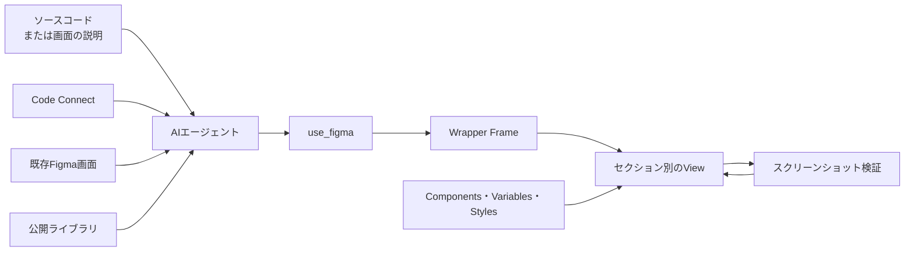
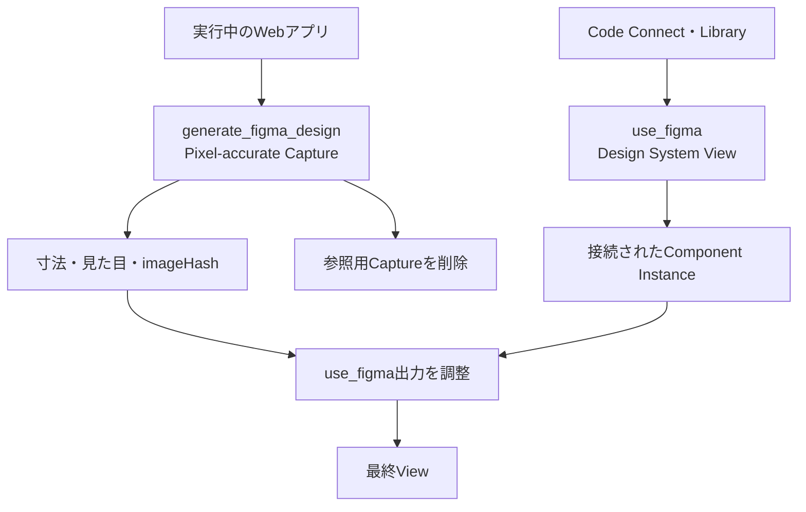

`figma-generate-design`は、コードや画面の説明をもとに、Figma上へページ、モーダル、ダイアログ、ドロワー、サイドバー、パネルなどを組み立てる公式エージェントスキルです。

重要なのは、四角形やテキストをハードコードして見た目だけを再現するスキルではないことです。Code Connect、既存画面、ライブラリ検索からコンポーネント、Variables、テキストスタイル、エフェクトスタイルを発見し、公開済みデザインシステムのインスタンスとして画面を作ります。

この記事では、現行の公式スキルを基準に、対象範囲、探索の優先順位、6段階の構築手順、Webアプリを取り込む並列ワークフロー、運用上の注意点を解説します。

Figma関連の3スキルは役割が異なります。再利用資産そのものを構築する流れは[figma-generate-library](https://zenn.dev/suwash/articles/figma-generate-library_20260804)、Figmaからアプリケーションコードへ変換する逆方向は[figma-design-to-code](https://zenn.dev/suwash/articles/figma-implement-design_20260805)で扱っています。

これらのワークフローで扱うCanvas、Node、Component、Instance、Variables、Styles、Code Connectの概念関係は、[Figmaの構造とデータモデル](https://zenn.dev/suwash/articles/figma_20260805)で説明しています。


*この記事の全体像。以下、順に解説します。*

## figma-generate-designの役割

成果物は、複数セクションで構成されたFigma上のViewです。新規作成だけでなく、既存画面の一部更新にも使います。

| 依頼 | 担当 |
| --- | --- |
| ページ、モーダル、パネルなどをFigmaへ構築・更新 | `figma-generate-design` |
| 新しい再利用コンポーネントやバリアントを作成 | `figma-use` + `figma-generate-library` |
| Code Connectのマッピングを作成 | `figma-code-connect` |
| Figmaから実装コードへ変換 | `figma-design-to-code` |

`figma-generate-design`を使うときは、`figma-use`も必ず読み込みます。`figma-use`はPlugin APIの実行規約、`figma-generate-library`は再利用資産を構築するワークフローを担当します。

キャンバス操作は`use_figma`で行い、通常は`skillNames: "figma-use,figma-generate-design"`を指定します。両方をMCPリソースとして読み込んだ場合は`skillNames: "resource:figma-use,resource:figma-generate-design"`とします。この値は利用状況を追跡するログ用で、実行結果は変えません。

## First Draftとは別の仕組み

Figma AIのFirst Draftは、自然言語から編集可能な初期デザインを生成するFigma製品内の機能です。一方、本稿の`figma-generate-design`は、MCPクライアント上のAIエージェントへ作業手順を与えるスキルです。

| 観点 | First Draft | `figma-generate-design` |
| --- | --- | --- |
| 実行場所 | Figma製品のAI機能 | MCP対応のAIエージェント |
| 主な入力 | 自然言語のアイデア | コードまたは画面の説明 |
| 既存資産の扱い | 製品機能の生成フローに依存 | Code Connect、既存画面、チームライブラリを明示的に探索 |
| 操作方法 | Figma UI | `use_figma`によるPlugin API操作 |
| 主な目的 | 初期案の生成 | 既存デザインシステムに接続された画面の構築・更新 |

両者を同一視すると、公式スキルが要求するコンポーネント探索、Variablesのバインド、セクション単位の検証を見落とします。

## 全体構造

画面生成は、ソースとFigmaのデザインシステムをAIエージェントが対応付ける処理です。



最低限、接続済みのFigma MCP Server、既存の`fileKey`、ソースコードまたは画面説明に加え、対象ファイルに公開済みデザインシステムがあるか、利用可能なチームライブラリへアクセスできることが必要です。対象ファイルがなければ、先に`/figma-create-new-file`または`create_new_file`で作成し、その`fileKey`を再利用します。

## 6段階の構築ワークフロー

### 1. 成果物を分解する

Figmaを操作する前に、コードと要件を読みます。

- Header、Hero、Content、Footerなどの主要セクション
- Button、Input、Card、Navigationなどの必要部品
- 実際に使われているフォントファミリー
- 画像、背景画像、アバター、外部アイコンの有無
- 新規作成か、既存画面の更新か

フォントを確認せずInterへ置き換えると、処理が成功しても見た目は一致しません。CSS変数、コンポーネント、フォント設定から製品の書体を先に特定します。

### 2. コンポーネント、Variables、Stylesを収集する

キャンバスを書き換える前に、各セクションで使う資産を表へまとめます。公式スキルには、探索順序を飛ばさないためのHard Gateがあります。

コンポーネントは次の順番で探します。

1. 必要な部品に対応するCode Connectファイル
2. 対象ファイルにある既存画面のInstance
3. 未解決の部品だけを`search_design_system`で検索

Code Connectファイルでは、Figma URLからFile KeyとNode IDを取得します。URLの`node-id=609-35535`は、Plugin APIでは`609:35535`へ変換します。ライブラリファイル上でKeyとNode Typeを解決し、`COMPONENT_SET`なら`importComponentSetByKeyAsync()`、単一の`COMPONENT`なら`importComponentByKeyAsync()`で取り込みます。Keyだけを見て一律にComponent SetとしてimportするとPromiseがrejectされます。

`search_design_system`を使う前に`get_libraries`で利用可能なライブラリを確認し、必要に応じて`includeLibraryKeys`で検索範囲を絞ります。組織ライブラリはページングされます。`libraries_available_to_add_next_offset`が非nullなら、その値を次回の`get_libraries`の`offset`へ渡します。

Variablesでは、ローカルと公開ライブラリの違いに注意が必要です。

| 方法 | 見える範囲 |
| --- | --- |
| `getLocalVariableCollectionsAsync()` | 現在のファイルで定義されたローカルVariablesのみ |
| `search_design_system`の`includeVariables` | 接続された公開・リモートライブラリを含むVariables |

ローカルVariablesが空でも、デザインシステムにVariablesがないとは限りません。色、余白、角丸をハードコードする前に、公開ライブラリ側も検索します。TypographyやShadowは`includeStyles`で探し、Text StyleとEffect Styleとして適用します。

### 3. Wrapper Frameを最初に作る

セクションをページ直下に作り、後から別の呼び出しで親へ移動すると、`appendChild()`が意図どおりに動かず孤立したFrameを残すことがあります。先にView全体のWrapperを1回の`use_figma`で作り、IDを返します。

```js
const wrapper = figma.createAutoLayout("VERTICAL");
wrapper.name = "Settings";
wrapper.resize(1440, 100);
wrapper.layoutSizingHorizontal = "FIXED";
return { success: true, wrapperId: wrapper.id };
```

ページなら1440px、モーダルなら640pxなど、幅はソースの実寸に合わせます。既存コンテンツと重ならない位置へ配置し、以降の呼び出しでは返却したIDを使います。

### 4. セクションごとに組み立てる

Header、Form、Action Barなどを1セクションずつ、別々の`use_figma`呼び出しでWrapper内へ作ります。一度に画面全体を生成しません。

手作りするのはWrapper、セクションコンテナ、行や列などのレイアウトです。Button、Card、InputなどはデザインシステムからInstanceとして取り込みます。色、余白、角丸はVariablesをバインドし、文字とShadowにはStyleを適用します。

| 手作りするもの | デザインシステムから取り込むもの |
| --- | --- |
| Wrapper Frame | Components |
| セクションのContainer | Color・Spacing・Radius Variables |
| 行・列・Grid | Text Styles |
| 不足するレイアウト構造 | Effect Styles |

Instanceの表示文字列は、探索時に確認したTEXTプロパティを`setProperties()`で上書きします。子Text Nodeの`characters`を直接変更するより、Componentとの接続を維持しやすい方法です。

繰り返し要素がデザインシステムに存在しない場合も、同じFrameを複製しません。ローカルComponentを1つ作り、そのInstanceを配置します。Component化は後工程ではなく、初回構築の完了条件です。

アイコンは、既存のIcon ComponentがあればInstanceを使います。なければコードベースのSVGを`createNodeFromSvg()`で取り込みます。線や四角形を回転して手描きすると形が崩れるため避けます。SVGには`viewBox`と明示的な`width`、`height`を含め、`currentColor`は取り込み後にVariableへバインドします。

### 5. セクションと画面全体を検証する

各セクションの作成直後に`get_screenshot`で確認します。最後にWrapper全体も確認します。

- 文字の上下が切れていないか
- 要素が重なっていないか
- PlaceholderのTitleやButtonが残っていないか
- Component Variantが正しいか
- 製品のフォントファミリーを使っているか
- 画像が空白になっていないか

全体を縮小したスクリーンショットだけでは、文字切れや誤ったVariantを見落とします。個別セクションのNode IDでも撮影し、問題のある箇所だけを`use_figma`で修正します。

### 6. 既存Viewは差分だけ更新する

更新タスクでは、`get_metadata`で既存構造を確認し、変更が必要なセクションだけを特定します。Componentの差し替え、TEXTやVariantプロパティの更新、廃止セクションの削除、新規セクションの追加を小さな呼び出しで実行します。

エラーが起きた場合は、同じスクリプトを即座に再試行しません。メッセージと現在のメタデータ、スクリーンショットを確認し、失敗したセクションのスクリプトを修正します。`use_figma`の失敗したスクリプトはatomicに扱われるため、成功済みの前セクションは維持されます。

## Webアプリでは2つの生成経路を併用する

ブラウザで表示できるWebアプリでは、同じ`fileKey`へ2つの生成を並行して行います。



`generate_figma_design`は実行中の画面を高い視覚精度で取り込みます。一方、`use_figma`側はデザインシステムへ接続されたComponent Instanceを作ります。前者を見本に後者を調整し、確認後は参照用Captureを削除します。

Webアプリに画像が含まれる場合、この並列経路は必須です。一般のFigma Plugin APIには`createImageAsync()`がありますが、現行の`use_figma`実行環境では外部画像URLを取得できません。CaptureされたNodeの画像Fillから`imageHash`を取り出し、最終Viewの対応するFrameへ設定します。

```js
targetFrame.fills = [{
  type: "IMAGE",
  imageHash: "hash_from_capture",
  scaleMode: "FILL"
}];
```

画像転送後はCaptureを残しません。最終成果物は、見た目だけを写したNodeではなく、更新可能なデザインシステムのInstanceで構成します。

## 依頼に含める情報

少なくとも、次の情報を渡します。

- 対象FigmaファイルのURLまたはFile Key
- 画面のソースコード、またはセクションが分かる説明
- 利用するデザインシステムやチームライブラリ
- 新規作成か既存Viewの更新か
- 対象デバイスと画面幅
- 画像を含むWebアプリの場合は実行可能なURL

```text
figma-useとfigma-generate-designを使い、
このリポジトリの設定画面をFigmaへ構築してください。

対象ファイル: <Figma URL または fileKey>
ソース: src/pages/settings/
幅: 1440px
既存のButton、Input、Card、Variables、Stylesを優先して再利用してください。
各セクションのスクリーンショットを確認してから次へ進んでください。
```

## 3つのFigmaスキルを使い分ける

| スキル | 入力 | 出力 | 主な用途 |
| --- | --- | --- | --- |
| [`figma-generate-library`](https://zenn.dev/suwash/articles/figma-generate-library_20260804) | コード、トークン、既存Figma資産 | Variables、Styles、Components | 再利用資産の構築・更新 |
| `figma-generate-design` | コードまたは画面説明 | Figma上のページ・モーダル・パネル | デザインシステムを使ったView構築 |
| [`figma-design-to-code`](https://zenn.dev/suwash/articles/figma-implement-design_20260805) | Figmaノード、Context、Screenshot | リポジトリ内の実装コード | Figmaからコードへの変換 |

まずLibraryで部品とトークンを整え、その資産を使ってDesignで画面を組み立てます。Figmaで確定した画面を実装へ反映するときはDesign-to-Codeを使います。3つを分離すると、再利用資産、画面構成、実装コードの責務が混ざりません。

## まとめ

`figma-generate-design`は、コードや説明からFigmaへ画面を作る作業を、既存デザインシステムの再利用と段階的な検証を備えたワークフローへ変えるスキルです。

重要なのは、Code Connect、既存画面、ライブラリ検索の順で資産を探すこと、Wrapperを先に作ること、各セクションを直接その中へ追加すること、VariablesとStylesをハードコードより優先することです。画像を含むWebアプリでは`generate_figma_design`のCaptureも併用し、最終成果物を更新可能なComponent Instanceへ仕上げます。

この記事が少しでも参考になった、あるいは改善点などがあれば、ぜひリアクションやコメント、SNSでのシェアをいただけると励みになります！

## 参考リンク

- [Figma MCP Server Guide](https://github.com/figma/mcp-server-guide)
- [figma-generate-design SKILL.md](https://github.com/figma/mcp-server-guide/blob/main/skills/figma-generate-design/SKILL.md)
- [figma-use SKILL.md](https://github.com/figma/mcp-server-guide/blob/main/skills/figma-use/SKILL.md)
- [figma-generate-library SKILL.md](https://github.com/figma/mcp-server-guide/blob/main/skills/figma-generate-library/SKILL.md)
- [figma-design-to-code SKILL.md](https://github.com/figma/mcp-server-guide/blob/main/skills/figma-design-to-code/SKILL.md)
- [Use First Draft with Figma AI](https://help.figma.com/hc/en-us/articles/23901901007639-Use-First-Draft-with-Figma-AI)
