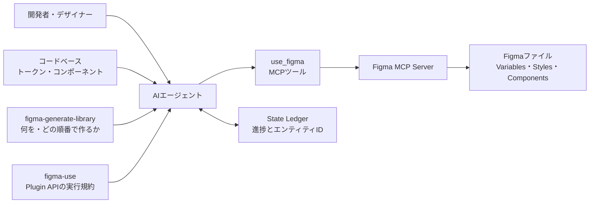

`figma-generate-library`は、コードベースをもとにFigmaのVariables、スタイル、コンポーネントライブラリを構築・更新するためのエージェントスキルです。

このスキルの本質は、Figmaを操作する新しいAPIではありません。Figma Plugin APIを実行する`use_figma`ツールと、その呼び出し規約を提供する`figma-use`スキルを組み合わせ、何をどの順番で作り、どこで検証するかを定めるオーケストレーション層です。

この記事では、`figma-generate-library`の構造、5段階のワークフロー、状態管理、導入時の注意点を解説します。コードとFigmaのデザインシステムを同期したい開発者やデザイナーが、スキルの役割と安全な使い方を把握できる内容です。

なお、Figma公式リポジトリでは関連スキルをBeta機能として案内しています。仕様や利用条件は変わる可能性があるため、導入時は公式リポジトリの最新版も確認してください。

この記事に登場するCanvas、Node、Component、Instance、Variables、Styles、Code Connectの関係は、[Figmaの構造とデータモデル](https://zenn.dev/suwash/articles/figma_20260805)で体系的に説明しています。


*この記事の全体像。以下、順に解説します。*

## figma-generate-libraryの役割

`figma-generate-library`は、次のような作業を対象にしています。

- コード側のトークンからFigma Variablesを作成
- Light/Darkなどのモードとセマンティック変数を構築
- コンポーネントとバリアントセットを作成
- Variablesを塗り、線、余白、角丸などへバインド
- Figmaとコードの差分を調査して解消
- Code Connectによるコンポーネントと実装の関連付け

個別コンポーネントを1つ作る場合も対象です。再利用可能なコンポーネントには、Variables、状態、バリアント、コードとの対応関係が必要になるためです。

一方、画面やモーダルを既存のデザインシステムから組み立てる用途は[figma-generate-design](https://zenn.dev/suwash/articles/figma-generate-design_20260805)、Figmaのデザインから実装コードを作る用途は[figma-design-to-code](https://zenn.dev/suwash/articles/figma-implement-design_20260805)が担当します。後者は調査時の`figma-implement-design`から改称されています。

## 2つのスキルが分担する構造

`figma-generate-library`だけではFigmaを操作しません。実行時は`figma-use`も読み込み、AIエージェントが`use_figma`ツールを呼び出します。書き込みはリモートFigma MCP Server経由で行います。



役割分担は次のとおりです。

| 要素 | 主な責務 |
| --- | --- |
| `figma-generate-library` | フェーズ、設計原則、チェックリスト、終了条件の定義 |
| `figma-use` | Plugin APIの構文、ページ切り替え、戻り値、フォント、色などの実行規約 |
| `use_figma` | JavaScriptをFigmaファイルのコンテキストで実行するMCPツール |
| Figma MCP Server | エージェントとFigmaファイルの接続、ツールの提供 |
| State Ledger | 作成済みオブジェクトのID、進捗、未検証項目の保持 |
| コードベース | トークン、コンポーネントAPI、命名規則の参照元 |

公式スキルは、デザインシステム構築に20〜100回以上の`use_figma`呼び出しが必要になり得ると説明しています。一括生成ではなく、小さく作成して都度検証する設計です。

## 5段階の構築ワークフロー

ワークフローはPhase 0からPhase 4までを順番に実行します。前段の終了条件を満たさないまま次へ進みません。

### Phase 0: Discovery

最初にコードとFigmaの現状を読み取り、作成対象を確定します。この段階ではFigmaへ書き込みません。

- コードからトークン、コンポーネント、命名規則を抽出
- Figmaのページ、Variables、コンポーネント、スタイルを調査
- 利用可能なライブラリを検索
- v1で作るトークンとコンポーネントを固定
- コードとFigmaの差分・衝突を一覧化

たとえば、コードの背景色が`#FFFFFF`、Figma側が`#FAFAFA`なら、どちらを正とするかを勝手に決めません。根拠と選択肢を提示し、判断が必要な分岐として扱います。

### Phase 1: Foundations

コンポーネントより先にVariablesとスタイルを整備します。中心となるのが「Variables BEFORE components」の原則です。

標準的な構成では、値を保持するPrimitivesと、用途を表すSemanticsを分けます。

```text
Primitives
  blue/500 = #3B82F6
  gray/900 = #111827

Color: Light / Dark
  color/bg/primary   -> Primitivesの色を参照
  color/text/primary -> Primitivesの色を参照

Spacing
  spacing/xs = 4
  spacing/sm = 8
  spacing/md = 16
```

セマンティック変数は生の値を複製せず、PrimitivesへのAliasとして定義します。また、すべてのVariablesへ用途に合うScopeとCode Syntaxを設定します。

Web向けのCode Syntaxは、実際のCSS変数に合わせて`var(--color-bg-primary)`のように`var()`を含めます。用途を限定しない`ALL_SCOPES`は使用しません。

### Phase 2: File Structure

次に、Figmaファイルを閲覧しやすい構造へ整えます。

```text
Cover
Getting Started
Foundations
---
Components
---
Utilities
```

色見本、タイポグラフィ、余白などのFoundationページを作り、各ページをスクリーンショットで検証します。コンポーネントを増やす前に、土台が目視できる状態を作るフェーズです。

### Phase 3: Components

コンポーネントは依存関係の小さいものから1つずつ作ります。複数のコンポーネントをまとめて生成しません。

1. 専用ページを作成
2. Auto LayoutとVariablesのバインドを含むベースコンポーネントを作成
3. バリアントを作成してComponent Setへ統合
4. `TEXT`、`BOOLEAN`、`INSTANCE_SWAP`などのプロパティを追加
5. 子ノードへプロパティを接続
6. 説明と利用方法を記載
7. メタデータとスクリーンショットで検証
8. 公開済みコンポーネントなら、必要に応じてCode Connectを設定

アイコンごとにバリアントを増やすのではなく、アイコンは`INSTANCE_SWAP`で差し替えます。`Size × Style × State`が30通りを超える場合は、バリアント爆発を避けるためコンポーネントを分割します。

### Phase 4: Integration + QA

最後にライブラリ全体を横断して確認します。

- Code Connectマッピングの最終化
- コントラスト、タッチターゲット、フォーカス表示の確認
- 重複名や無名ノードの確認
- ハードコードされた塗りや線、未解決のバインドの確認
- 全ページの最終スクリーンショット確認

Code Connectの対象は公開済みのComponentまたはComponent Setです。新規ライブラリでは、コンポーネントをライブラリとして公開した後、Phase 4でマッピングと検証を行います。

作成できたことではなく、コードとの対応と視覚品質を検証できたことが完了条件になります。

## State Ledgerで中断と再開に備える

デザインシステム構築は長時間になりやすく、会話コンテキストだけで進捗を管理するとNodeやVariableなどのID、未検証項目を失うおそれがあります。そのため、スキルはState Ledgerをディスクへ保存します。

```json
{
  "runId": "ds-build-2024-001",
  "phase": "phase3",
  "step": "component-button",
  "entities": {
    "collections": { "primitives": "id:..." },
    "variables": { "color/bg/primary": "id:..." },
    "pages": { "Button": "id:..." },
    "components": { "Button": "id:..." }
  },
  "pendingValidations": ["Button:screenshot"],
  "completedSteps": ["phase0", "phase1", "phase2"]
}
```

作成や変更を行う`use_figma`呼び出しでは、影響したNode IDを返します。Variablesを操作した場合は、Variable Collection、Variable、ModeなどのエンティティIDを構造化して返し、直後にLedgerへ記録します。再開時はFigmaを読み取り専用でスキャンし、LedgerのIDと実体を照合してから続きを実行します。

この仕組みにより、名前だけを頼りに重複作成したり、推測したNode IDで削除したりする事故を避けられます。

## 導入と依頼のしかた

利用前に、対応するMCPクライアントへリモートFigma MCP Server（`https://mcp.figma.com/mcp`）を接続し、`figma-use`と`figma-generate-library`を利用可能にします。キャンバスへの書き込みはリモートサーバー限定です。接続方法はクライアントごとに異なるため、公式READMEの手順を使ってください。

読み取りツールにはプランとseatに応じたレート制限があります。Discoveryと検証を含む長いワークフローを始める前に、利用中のプランに適用される最新の制限を公式READMEで確認してください。

依頼には、少なくとも次の情報を含めます。

- 対象のFigmaファイルまたはFile Key
- 解析対象のコードベース
- 初回スコープに含めたいトークンとコンポーネント
- コードとFigmaのどちらを優先するか判断する担当者

たとえば、次のように依頼できます。

```text
figma-useとfigma-generate-libraryを使い、
このリポジトリのデザイントークンからFigmaのVariablesを構築してください。
初回スコープはColor、Spacing、Buttonです。
Phase 0の差分と判断が必要な項目を提示してから進めてください。
対象Figmaファイル: <Figma URL>
```

Phase 0の完了後と、コードとFigmaの間に本当の判断分岐がある場合は、ユーザーの確認が必要です。Phase 1〜4は、各Phaseの要約と成果物を示しながら自動で継続するのが既定です。

## 運用で注意したいポイント

### API呼び出しを並列化しない

Figmaの状態変更は直列に実行します。同時に複数の`use_figma`を走らせると、ページコンテキストや作成順序が崩れる可能性があります。

### 1回の呼び出しを小さく保つ

各呼び出しでは対象ページを1つに絞り、Node操作では作成・変更したNode IDを返します。Variables操作では、対象となったVariable Collection、Variable、ModeのIDを返します。作成後はメタデータ、コンポーネント完成後はスクリーンショットも確認します。

### フォントとページを明示的に扱う

テキストを書き換える前にフォントを読み込みます。ページを扱う呼び出しでは`await figma.setCurrentPageAsync(page)`を使い、1回の呼び出し内でページを何度も切り替えません。

### 既存資産を調べてから作る

Phase 0と各コンポーネントの作成前に、ローカルの既存コンポーネント、購読済みライブラリ、利用可能なUI Kitを検索します。優先順は、ローカル資産、ライブラリからの再利用、必要に応じたラップ、新規作成です。

### 失敗の原因を理解してから再試行する

フォント、プロパティ、VariablesのScopeなどにエラーがある場合、同じスクリプトをそのまま再試行しません。エラーを特定し、LedgerとFigmaの実体を確認してから修正版を実行します。

## まとめ

`figma-generate-library`は、コードからFigmaのデザインシステムを構築する作業を、順序と検証を備えた反復可能なプロセスへ変えるスキルです。`figma-use`がPlugin APIの安全な呼び出し規約を担い、`use_figma`ツールがJavaScriptを実行します。`figma-generate-library`はDiscovery、Foundations、File Structure、Components、Integration + QAの流れを担います。

特に重要なのは、Variablesを先に作ること、既存資産を調査してから作ること、NodeやVariablesのIDと進捗をState Ledgerへ保存すること、作成ごとに検証することです。大規模な一括生成ではなく、小さな直列処理の積み重ねとして運用すると、コードとFigmaの対応を保ちやすくなります。

この記事が少しでも参考になった、あるいは改善点などがあれば、ぜひリアクションやコメント、SNSでのシェアをいただけると励みになります！

## 参考リンク

- [Figma MCP Server Guide](https://github.com/figma/mcp-server-guide)
- [figma-generate-library SKILL.md](https://github.com/figma/mcp-server-guide/blob/main/skills/figma-generate-library/SKILL.md)
- [figma-use SKILL.md](https://github.com/figma/mcp-server-guide/blob/main/skills/figma-use/SKILL.md)
- [Code Connect Setup Reference](https://github.com/figma/mcp-server-guide/blob/main/skills/figma-generate-library/references/code-connect-setup.md)
