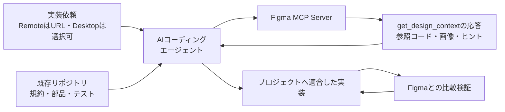

`figma-design-to-code`は、Figmaのデザインを本番向けコードへ変換するための公式エージェントスキルです。2026年8月5日の調査開始時に使われていた`figma-implement-design`は、現在の公式リポジトリではこの名称へ移行しています。本稿は現行の`figma-design-to-code`を基準に解説します。

このスキルのポイントは、Figma MCP Serverが返す参照コードをそのまま貼り付けないことです。Figmaをデザイン上の正解、既存コードベースを実装上の制約として扱い、両者を段階的にすり合わせます。この記事では、現行ワークフロー、応答に含まれる情報の優先順位、アセットの永続化、失敗しやすい点を解説します。

逆方向となる「コードからFigmaへデザインシステムを構築する」流れは、先に公開準備した[コードからFigmaのデザインシステムを構築する - figma-generate-library](https://zenn.dev/suwash/articles/figma-generate-library_20260804)で扱っています。

本稿の検証対象は、公式スキルの現行契約と旧称からの変更点です。公開可能なFigmaノードが入力に含まれないため、実際のMCP応答や生成コードを装った例は掲載しません。Figma MCPと既存デザインシステムを組み合わせる一般的な設計は、既存記事の[デザインシステムを理解するAIコード生成](https://suwa-sh.github.io/zenn-contents/articles/design-system-aware-ai-codegen_20260717/)で扱っています。

Node、Component、Instance、Variables、Styles、Code Connectなど、Figma側の概念関係は[Figmaの構造とデータモデル](https://zenn.dev/suwash/articles/figma_20260805)を参照してください。


*この記事の全体像。以下、順に解説します。*

## figma-design-to-codeの役割

`figma-design-to-code`はMCPツールそのものではなく、`get_design_context`を呼ぶ前に読み込む必須の指示書です。成果物はFigmaキャンバスではなく、ユーザーのリポジトリ内に作るアプリケーションコードです。

用途の境界は次のように整理できます。

| やりたいこと | 担当するスキル |
| --- | --- |
| Figmaのデザインを既存プロジェクトへ実装 | `figma-design-to-code` |
| Figmaキャンバス上のノードを作成・編集 | `figma-use` |
| コードや説明からFigmaに画面を作成 | `figma-generate-design` |
| Code Connectのマッピングだけを作成 | `figma-code-connect` |
| コードからFigmaライブラリを構築 | `figma-generate-library` |

実行には、接続済みのFigma MCP Serverと対象ノードが必要です。File KeyやNode IDの抽出方法、`format`や`query`などの引数、応答形式は、利用中の`get_design_context`ツール記述を正本とします。ファイルだけのURLからNode IDを推測してはいけません。

### 調査開始時の前提から変わった点

公式リポジトリの現行版と照合すると、名称以外にも重要な変更がありました。本稿が単に旧スキルを言い換えた記事にならないよう、差分を明示します。

| 調査開始時の前提 | 現行の公式契約 |
| --- | --- |
| スキル名は`figma-implement-design` | `figma-design-to-code` |
| ContextとScreenshotを別々に必須取得 | `get_design_context`の1回の応答に参照コード、スクリーンショット、ヒントを含む |
| `skillNames`の説明なし | `figma-design-to-code`を必ず指定 |
| アセットURLをそのまま利用 | Remote URLは約7日で失効するため、commit時は実体を永続化 |
| 既存部品を一般的に探索 | Code Connect、文書、注釈、トークンの順で応答ヒントを適用 |

以下の解説は、この差分を反映した2026年8月5日時点の内容です。

## デザインからコードまでの全体構造

現行の`get_design_context`は、1回の呼び出しで参照コード、スクリーンショット、コンテキストヒントを返します。参照コードは実装の材料、スクリーンショットは見た目の基準、ヒントは既存コードやデザイン意図への導線です。



Figma MCPが返すReactとTailwind形式の参照コードは、デザインと振る舞いを伝える中間表現として扱います。最終コードの言語、フレームワーク、スタイル方式は、対象プロジェクトの規約へ合わせます。

## 現行の実装ワークフロー

### 1. 最初にget_design_contextを呼ぶ

対象ノードに対して、コードを書く前に`get_design_context`を呼びます。呼び出しでは`skillNames`に`figma-design-to-code`を必ず含めます。MCPリソース経由でスキルを読み込んだ場合は`resource:figma-design-to-code`とします。

```text
get_design_context(
  fileKey="<actual-file-key>",
  nodeId="42:15",
  skillNames="figma-design-to-code"
)
```

Figma URLの`node-id=42-15`は、MCP引数では`42:15`へ変換します。`<actual-file-key>`はURLの`/design/`直後にある実際のFile Keyへ置き換えます。`skillNames`は利用状況を追跡するログ用パラメータで、実行結果を変えるものではありません。その他の引数は、利用中のツール記述に従います。

`get_metadata`や`get_screenshot`を、`get_design_context`の代わりにしてはいけません。前者は対象ノードを選ぶための方向確認、後者は追加の視覚検証に使います。

### 2. 応答を完成コードではなく参照として読む

応答に含まれるReactとTailwindのコードを、そのまま対象リポジトリへ貼り付けません。レイアウト、コンポーネント構造、トークン、画像、デザイン意図を読み取り、プロジェクトの実装方式へ翻訳します。

### 3. 既存の部品とトークンを再利用する

実装前にリポジトリを調べ、既存のUIコンポーネント、レイアウトパターン、デザイントークンを探します。Figma上の部品と一致する実装があれば再利用し、同等品を新しく生成しません。

ここでは2種類の優先順位を分けて考えます。

応答内のヒントは、公式スキルが指定する次の順番で適用します。

1. Code Connectのスニペット
2. コンポーネントのドキュメントリンク
3. デザイン注釈
4. CSS変数として示されるデザイントークン
5. 生の16進カラーや絶対配置

そのうえで、実装は対象リポジトリの既存コンポーネント、トークン、命名、配置、型、状態管理へ適合させます。Code Connectで対応する部品が示された場合は、そのコードベース上の部品を直接使うのが最優先です。

### 4. 画像とアイコンを忠実に永続化する

Remote MCPでは、画像やアイコンが`https://.../api/mcp/asset/...`形式のURLとして返ります。このURLはすぐに`src`へ指定して確認できますが、約7日で失効します。commitするコードでは、次のいずれかへ移行します。

- URLから実バイトをダウンロードし、プロジェクトのアセットとしてcommit
- 動的コンテンツなら、既存のAPI、CDN、propsなど本来のデータソースへ接続

アイコンを手書きのSVGや独自のパスで再現してはいけません。既存のアイコンコンポーネントは、名前だけでなくグリフが明確に一致する場合だけ再利用します。固定サイズのコンテナと画像の幅・高さを明示し、intrinsic sizeによる拡大も防ぎます。

### 5. スクリーンショットと照合する

応答に含まれるスクリーンショットを見た目の基準として、レイアウト、余白、寸法、文字、色、画像、状態を比較します。必要に応じて`get_screenshot`を追加で呼び、実装後の画面と並べて検証します。

Figmaの生の値とプロジェクトのトークンが競合する場合は、デザインの意図をスクリーンショットで確認しつつ、既存デザインシステムとの一貫性を優先します。アクセシビリティや技術的制約のために差異を残す場合は、その理由を記録します。

## 取得データをどう使い分けるか

`figma-design-to-code`では、次の情報源が異なる役割を持ちます。

| 情報源 | 主な役割 | 注意点 |
| --- | --- | --- |
| `get_design_context` | 参照コード、スクリーンショット、文脈ヒント | 最初に呼び、完成コードとして貼り付けない |
| `get_metadata` | 対象ノードを選ぶための方向確認 | Context取得の代用にしない |
| `get_screenshot` | 追加の視覚検証 | Context取得の代用にしない |
| Code Connect・文書・注釈 | 既存部品とデザイン意図の特定 | 公式指定の優先順位を守る |
| Remote MCPのアセットURL | 画像、アイコン、SVGの一時取得 | 約7日で失効するため永続化する |
| 既存コードベース | 実装規約、再利用部品、トークン | Figmaだけを見て重複実装しない |

応答形式や引数はMCPツール側で更新され得ます。スキルがワークフローを、`get_design_context`のツール記述が引数とレスポンスの契約を担うため、実行時のツール記述を確認します。

## 実装依頼の書き方

依頼には、対象ノードだけでなく、実装先と検証条件も含めます。

```text
figma-design-to-codeを使い、次のFigmaコンポーネントを実装してください。

Figma: https://figma.com/design/<fileKey>/<name>?node-id=42-15
実装先: src/components/ui/
既存部品: src/components/ui/Button.tsxを優先して再利用
スタイル: プロジェクトのデザイントークンとCSS Modulesを使用
検証: 既存テスト、アクセシビリティ、Figmaスクリーンショットとの視覚比較
```

ファイルだけのURLではなく、`node-id`を含む対象ノードのURLを渡します。大きなノードでタイムアウトした場合は、対象を小さなノードや選択範囲へ分けます。

## 運用で注意したいポイント

### スクリーンショットだけで実装しない

スクリーンショットは見た目の正解ですが、Code Connect、コンポーネント文書、注釈、トークンの優先順位までは表しません。必ず`get_design_context`を先に呼び、応答全体から実装します。

### MCP出力を完成コードとみなさない

出力がReactやTailwindに見えても、プロジェクトの最終コード規約と一致するとは限りません。デザインの表現として読み取り、既存アーキテクチャへ翻訳します。

### エラーを読んでから対象を分割する

`get_design_context`が失敗したら、同じ呼び出しを機械的に繰り返さずエラーメッセージを確認します。Remote MCPでは`node-id`付きURLでより小さな子ノードを指定し、Desktop MCPでは選択ノードを小さくして再試行します。Contextを取得できる状態なのに、スクリーンショットだけから画面を手書きしてはいけません。

### 既存部品を先に探す

Code Connectや既存コンポーネントがある場合、それを再利用することでデザインとコードの対応を保てます。局所的なピクセル一致のために共通部品を複製すると、長期的な整合性を失います。

### 視覚差を検証可能にする

「だいたい同じ」で終えず、取得したスクリーンショットと実装画面を比較します。差異をレイアウト、文字、色、状態、アセットへ分解すると修正しやすくなります。

## figma-generate-libraryとの関係

2つのスキルは、同じデザインシステムを反対方向から扱います。

| スキル | 入力 | 出力 | 主な目的 |
| --- | --- | --- | --- |
| `figma-generate-library` | コード、トークン、既存のFigma資産 | Figma Variables、スタイル、コンポーネント | コードをもとにFigmaライブラリを構築・更新 |
| `figma-design-to-code` | Figmaノード、参照コード、スクリーンショット、ヒント | リポジトリ内のアプリケーションコード | Figmaのデザインを既存実装へ統合 |

コードとFigmaの両方を継続的に扱うチームでは、どちらを正として変更するかをタスクごとに明示する必要があります。ライブラリの構築方法と状態管理は[figma-generate-library解説](https://zenn.dev/suwash/articles/figma-generate-library_20260804)、そのライブラリを使ったFigma画面の組み立ては[figma-generate-design解説](https://zenn.dev/suwash/articles/figma-generate-design_20260805)を参照してください。

## まとめ

`figma-design-to-code`は、Figmaからコードを一括生成するだけの機能ではありません。`get_design_context`から参照コード、スクリーンショット、ヒントを取得し、既存コード規約へ翻訳して比較検証するワークフローです。

特に重要なのは、Figma MCPの出力を中間表現として扱うこと、既存コンポーネントを優先すること、構造データとスクリーンショットの両方で検証することです。この3点を守ると、単発のコード生成ではなく、デザインシステムへ統合可能な実装へ近づけられます。

この記事が少しでも参考になった、あるいは改善点などがあれば、ぜひリアクションやコメント、SNSでのシェアをいただけると励みになります！

## 参考リンク

- [Figma MCP Server Documentation](https://developers.figma.com/docs/figma-mcp-server/)
- [Figma MCP Server Tools and Prompts](https://developers.figma.com/docs/figma-mcp-server/tools-and-prompts/)
- [Guide to Variables in Figma](https://help.figma.com/hc/en-us/articles/15339657135383-Guide-to-variables-in-Figma)
- [Figma MCP Server Guide](https://github.com/figma/mcp-server-guide)
- [figma-design-to-code SKILL.md](https://github.com/figma/mcp-server-guide/blob/main/skills/figma-design-to-code/SKILL.md)
- [コードからFigmaのデザインシステムを構築する - figma-generate-library](https://zenn.dev/suwash/articles/figma-generate-library_20260804)
- [デザインシステムからFigma画面を組み立てる - figma-generate-design](https://zenn.dev/suwash/articles/figma-generate-design_20260805)
- [Figmaの構造とデータモデル](https://zenn.dev/suwash/articles/figma_20260805)
