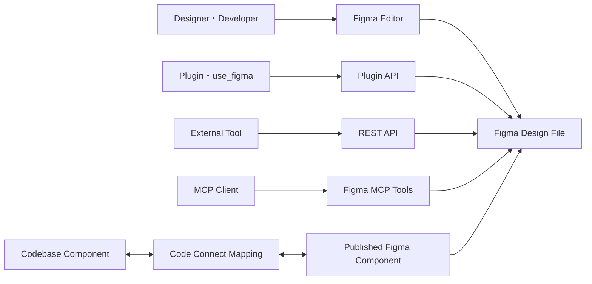
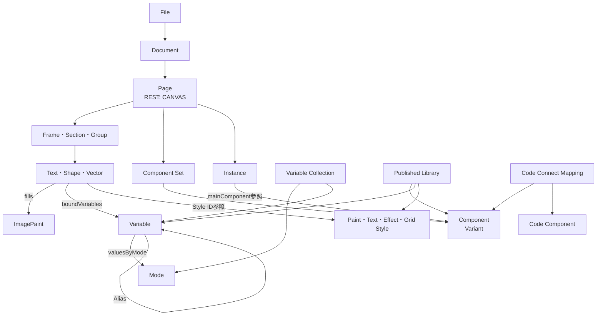
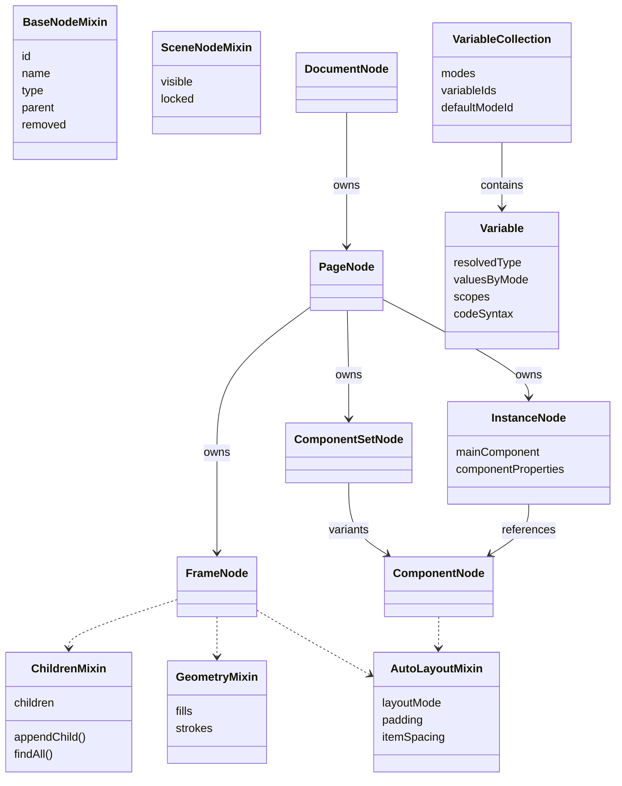
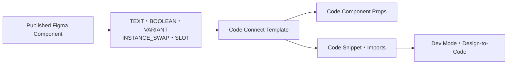

FigmaをAPIやAIエージェントから操作すると、`PageNode`、`SceneNode`、`ComponentSet`、`Instance`、`VariableCollection`、`Code Connect`など、多くの概念が一度に登場します。これらは単なる用語集ではなく、Figmaがデザインを「ツリー」「参照」「トークン」「外部マッピング」として扱うデータモデルの一部です。

この記事では、Figmaの公開REST API、Plugin APIの型定義、Code Connectの公式ワークフローをもとに、システム構造、概念モデル、情報モデル、APIごとの見え方を整理します。Figmaの非公開サーバー実装を推測するのではなく、外部から検証できる境界に焦点を当てます。

このモデルは、次の3記事で登場する内部用語を理解するための土台です。

- [コードからFigmaのデザインシステムを構築する - figma-generate-library](https://zenn.dev/suwash/articles/figma-generate-library_20260804)
- [デザインシステムからFigma画面を組み立てる - figma-generate-design](https://zenn.dev/suwash/articles/figma-generate-design_20260805)
- [figma-implement-designからfigma-design-to-codeへ - 現行契約を読む](https://zenn.dev/suwash/articles/figma-implement-design_20260805)


*この記事の全体像。以下、順に解説します。*

## Figmaをデータ構造として見る

Figma Designの中心は、描画要素を親子関係で保持するドキュメントツリーです。RectangleやTextだけでなく、Page、Frame、Component、InstanceもNodeとして扱われます。

ただし、すべての概念がツリー内のNodeではありません。

- VariablesとVariable Collections: 値、Mode、Aliasを管理するトークンモデル
- Styles: Paint、Text、Effect、Gridの再利用可能な設定
- Libraries: Components、Variables、Stylesを公開・importする境界
- Code Connect: Figma Componentとコード上のComponentを結ぶ外部マッピング
- File KeyやNode ID、公開Key: APIやLibraryをまたいで対象を識別する値

この区別を意識すると、「Variableを子Nodeとして探す」「Code ConnectをFigmaファイル内のレイヤーとして扱う」といった誤解を避けられます。

## 構造

### システムコンテキスト

Figmaの公開境界を、Editor、API、コードベースの関係として表すと次のようになります。



Plugin APIは、実行中のFigmaファイルをNodeオブジェクトとして読み書きします。REST APIは、ファイルやNodeをJSONとして外部から取得します。MCPツールはAIエージェントがこれらの操作を利用するための境界です。

Code Connectは、FigmaファイルのNodeツリーに新しいNodeを追加する機能ではありません。公開済みFigma Componentと、リポジトリ内のコードComponentおよび利用例を対応付けます。

### APIごとに見える世界

| 境界 | 主な対象 | 主な用途 |
| --- | --- | --- |
| Figma Editor | Page、Layer、Component、Variables、Styles | 人によるデザイン作成と編集 |
| Plugin API | `DocumentNode`、`PageNode`、`SceneNode`、Variables、Styles | 現在のファイルをプログラムから読み書き |
| REST API | File metadata、`DOCUMENT`、`CANVAS`、各NodeのJSON | 外部サービスからファイル構造を取得 |
| MCP Tools | Design Context、Screenshot、Plugin API操作など | AIエージェントからFigmaを利用 |
| Code Connect | Figma ComponentとコードComponentの対応 | Dev Modeや生成コードへ実装例を提供 |

REST APIとPlugin APIは同じデザインを扱いますが、型名と利用目的が完全に同じではありません。たとえばREST APIの`CANVAS`はFigmaのPageに対応し、Plugin APIでは`PageNode`として表現されます。

## データ

### 概念モデル

Figmaの主要概念は、所有関係、参照関係、値のバインド、外部マッピングに分けて考えられます。



実線の親子関係だけでなく、InstanceからComponent、NodeからVariable、Code ConnectからComponentとコードへの参照が重要です。Figmaのデザインシステムは、単純なレイヤーツリーではなく複数種類の参照を含むグラフとして読む必要があります。

### 情報モデル

Plugin APIの公開型を、理解に必要な背骨へ絞ると次のようになります。実際の`plugin-api.d.ts`には、より多くのNodeとMixinがあります。



Mixinは、Nodeが持つ能力を組み合わせるための公開型です。すべてのNodeが同じプロパティを持つわけではありません。子を持てるNodeには`ChildrenMixin`、塗りや線を持つNodeにはGeometry系Mixin、Auto Layoutを持つFrame系Nodeには`AutoLayoutMixin`が含まれます。

### File、Document、Page、Canvas

Figma UIで「キャンバス」と呼ぶ対象と、API上の型名を区別します。

| 概念 | Plugin API | REST API | 説明 |
| --- | --- | --- | --- |
| File | 対応する`FileNode`はない。`figma.root`は`DocumentNode` | `GET /v1/files/:key`のトップレベルレスポンス | URLやRESTリクエストのFile Keyで識別する共有単位 |
| Document | `DocumentNode` | `DOCUMENT` Node | Pageを保持するツリーのRoot |
| Page | `PageNode` | `CANVAS` Node | Editor左側のPagesに並ぶ単位 |
| Canvas | 一般にはPage上の作業空間を指す | Node Typeとしては`CANVAS` | UI上の呼び方とAPI型を文脈で判断 |

`DocumentNode`は直接描画するSceneではありません。PageがScene Nodeの配置境界になります。Plugin APIで`figma.currentPage`を使うのは、このPageを現在の操作対象としているためです。

通常のPluginはFile Keyを取得できません。`figma.root.name`で現在のファイル名は読めますが、`figma.root`をFileオブジェクトとして扱ってはいけません。REST APIではFile Keyを`GET /v1/files/:key`のパス引数として渡します。

### NodeとScene Node

すべてのNodeは`id`、`name`、`type`、`parent`などの基本情報を持ちます。Node IDは`1:3`のような形式です。Figma URLでは`node-id=1-3`とハイフンで表現されるため、APIへ渡すときはコロンへ変換します。

Plugin APIの`SceneNode`は、Frame、Text、Rectangle、Vector、Component、Instanceなど、Page上に配置できる型のUnionです。単一の万能Classではなく、「Sceneに置けるNode群」を表すTypeScript型として扱うと理解しやすくなります。

Figmaに`ImageNode`はありません。画像はRectangleなど、Fillを持つNodeへ`ImagePaint`として設定されます。このため、画像をNode Typeとして検索するのではなく、Nodeの`fills`にあるPaint Typeを確認します。

代表的なContainerは次のとおりです。

| Node | 役割 | 子Node |
| --- | --- | --- |
| `FrameNode` | レイアウト、Clip、背景、Auto LayoutのContainer | 持てる |
| `GroupNode` | 複数Nodeをまとめる軽量なGrouping | 持てる |
| `SectionNode` | キャンバス上の領域やFlowを整理 | 持てる |
| `ComponentNode` | 再利用可能なMain Component | 持てる |
| `InstanceNode` | Componentを参照する配置物 | 内部構造とOverrideを持つ |

### FrameとAuto Layout

Frameは単なる四角形ではなく、子Nodeの配置規則を持てるContainerです。`layoutMode`には`NONE`、`HORIZONTAL`、`VERTICAL`、`GRID`があります。

Auto Layoutでは、親と子の両側に設定があります。

- 親: 方向、主軸・交差軸の整列、Padding、Gap、Wrap、Grid
- 子: Fixed、Hug、Fillに対応するSizing、最小・最大寸法、Layout Align
- 配置: 通常FlowかAbsolute Positionか
- 値: 数値を直接設定するほか、Spacing Variableをバインド可能

`layoutMode`を一度有効化してから`NONE`へ戻しても、子Nodeの位置が元通りになるとは限りません。Auto Layoutは表示上のオプションではなく、Node配置へ影響する状態です。

### Component、Component Set、Variant、Instance

Componentモデルは、定義と利用を分けます。

- `ComponentNode`: 再利用可能なMain Component
- `ComponentSetNode`: Variantとなる複数Componentをまとめる集合
- Variant: Size、State、Typeなどの組み合わせで選ばれるComponent
- `InstanceNode`: Main Componentを参照する実際の配置
- Component Properties: TEXT、BOOLEAN、VARIANT、INSTANCE_SWAP、SLOTなどの設定入口
- Overrides: Instance側で変更された文字、表示、交換対象など

Instanceの`mainComponent`は、常に同じファイルの親子ツリーに存在するとは限りません。Team LibraryからimportしたRemote Componentや、削除状態のComponentを参照する場合があります。`documentAccess: "dynamic-page"`では、同期プロパティより`getMainComponentAsync()`などの非同期APIを使う必要があります。

ComponentとComponent Setの公開Keyはimport方法が異なります。

```text
COMPONENT     -> importComponentByKeyAsync(key)
COMPONENT_SET -> importComponentSetByKeyAsync(key)
```

Node Typeを確認せず同じimport関数へ渡すと失敗します。

### Variables、Collections、Modes、Aliases

VariableはNodeではなく、`VariableCollection`に所属するトークンです。

`VariableCollection`は次を保持します。

- `modes`: Light、Dark、DesktopなどのModeとMode ID
- `variableIds`: Collectionに属するVariable ID
- `defaultModeId`: 既定Mode
- `key`: 公開Libraryから参照するときのKey

`Variable`は`resolvedType`、`valuesByMode`、`scopes`、プラットフォーム別`codeSyntax`を持ちます。Modeごとの値は、色や数値などの直接値だけでなく、別VariableへのAliasにもできます。

最終値はVariable単体で決まらない場合があります。消費するScene Nodeに選択・継承されたModeとAlias Chainを解決して決まるためです。Plugin APIには`resolveForConsumer(sceneNode)`が用意されています。

Node側では`boundVariables`などを通じて、Fillの色、Padding、Gap、Radius、幅などのプロパティへVariableをバインドします。これによりMode切り替えやLibrary更新を反映できます。

### StylesとPaint

StylesもNodeツリー外の再利用資産です。

| Style | 主な対象 |
| --- | --- |
| `PaintStyle` | FillやStrokeのPaint |
| `TextStyle` | Font、Size、Line Height、Letter Spacingなど |
| `EffectStyle` | ShadowやBlur |
| `GridStyle` | Layout Grid |

Nodeは`fillStyleId`、`textStyleId`、`effectStyleId`などでStyleを参照します。一方、`fills`や`strokes`へPaint配列を直接持つこともできます。さらにPaintのColorへVariableをバインドできるため、「直接値」「Style参照」「Variable Binding」は別の仕組みです。

### Library、ID、Key、Remote

Figma Libraryは、Component、Variable、Styleを他ファイルから利用できるよう公開する境界です。

| 識別子 | 例 | 主なスコープ |
| --- | --- | --- |
| File Key | URL内の英数字 | Figmaファイル |
| Node ID | `1:3` | ファイル内のNode |
| Variable ID | APIが返すID | ファイル内のVariable |
| Style ID | APIが返すID | ファイル内のStyle |
| Published Key | 公開資産のKey | Libraryをまたぐimport |
| Code Connect ID | Template側の識別子 | コードMapping |

公開KeyはLocal Componentにも存在しますが、`importComponentByKeyAsync()`などでimportできるのは公開済み資産です。Remote ComponentやStyleは参照元Libraryに属し、利用側ファイルから直接編集できません。

### Code Connect

Code Connectは、公開済みFigma Componentとコード上の実装を対応付けます。現在はUIとCLI／Template Filesで提供する情報の粒度が異なります。

| ワークフロー | 主な対応情報 | 表示・利用 |
| --- | --- | --- |
| Code Connect UI | コードのPath、Component名、カスタム指示 | 実装の所在とContextを示す。InspectにSnippet自体は表示しない |
| Code Connect CLI／Template Files | Component PropertiesとProps、`example`、`imports`、Template ID | Property値に応じたコード例を生成 |



CLI／Template Filesが扱う主な関係は次のとおりです。

- Figma Component URLのFile KeyとNode ID
- Component PropertyとコードPropsの変換
- FigmaのVariant値とコード上のEnum値
- Instance SwapやSlotと、ネストしたコード表現
- 実装Componentのimport先とSnippet

Mappingの前提は公開済みComponentです。Code ConnectはComponentをLibraryへ公開する機能でも、Instanceをキャンバスへ作る機能でもありません。UIまたはCLIの方式に応じて、デザインと実装の所在・利用Context・コード表現を対応付ける層です。

## 構築・利用方法

### 目的に応じてAPI境界を選ぶ

| やりたいこと | 適した境界 |
| --- | --- |
| 外部システムからFileやNodeを取得 | REST API |
| 開いているFigmaファイルのNodeを作成・変更 | Plugin API／`use_figma` |
| AIエージェントから構造やScreenshotを取得 | Figma MCP Tools |
| Figma Componentを実装Componentへ対応付け | Code Connect |

Plugin APIの`createRectangle()`などの作成関数は、既定で新しいNodeを`figma.currentPage`の子として作ります。別Containerへ移す場合は、そのContainerの`appendChild()`を使います。作成後に必ずPageへappendしなければ表示されない、というモデルではありません。

`documentAccess: "dynamic-page"`を使うPluginでは、Pageを必要に応じて読み込み、`getNodeByIdAsync()`、`getStyleByIdAsync()`、`getMainComponentAsync()`などの非同期APIを使います。

```ts
const node = await figma.getNodeByIdAsync("1:3");
if (!node || node.removed) {
  return;
}

if (node.type === "INSTANCE") {
  const main = await node.getMainComponentAsync();
  console.log(main?.name);
}
```

長時間動くPluginでは、ユーザー操作によりNodeが削除される可能性があります。保存したオブジェクト参照を過信せず、操作直前の存在確認が必要です。

## 運用と注意点

### 大規模ツリーを無条件に走査しない

Node数が多いファイルで`findAll()`を多用すると、不要なNodeまで展開します。対象Typeが分かる場合は`findAllWithCriteria()`を使います。非表示のInstance内部を扱わないPluginでは、`figma.skipInvisibleInstanceChildren = true`により走査を大幅に減らせます。

ただし、この設定後は非表示Instance内部のNodeを`getNodeByIdAsync()`で取得できない場合があります。処理対象を理解してから有効化します。

### LocalとRemoteを区別する

`getLocalVariableCollectionsAsync()`が空でも、Team LibraryにVariablesがないとは限りません。このAPIが返すのは現在のファイルで定義されたLocal Collectionです。Remote Libraryは検索・importの別経路で確認します。

Component、Style、Variableの`remote`と`key`を確認すると、現在のファイルで編集できる資産か、公開Libraryから取り込んだ参照かを判断できます。

### 型のUnionとMixed値を扱う

TextのFontやFillなど、複数範囲に異なる値があるプロパティは`figma.mixed`を返すことがあります。単一値と決めつけず、型を絞り込んでから操作します。

Scene NodeもUnion Typeです。`node.type`を確認してから、そのNode固有のプロパティやメソッドへアクセスします。

## 4記事の関係

| 記事 | 主な対象 |
| --- | --- |
| 本記事 | Figmaの公開構造、Node、Component、Variables、Styles、Code Connect |
| [figma-generate-library](https://zenn.dev/suwash/articles/figma-generate-library_20260804) | コードから再利用可能なLibrary資産を構築 |
| [figma-generate-design](https://zenn.dev/suwash/articles/figma-generate-design_20260805) | Library資産を使ってFigma Viewを組み立て |
| [figma-design-to-code](https://zenn.dev/suwash/articles/figma-implement-design_20260805) | FigmaのContextを実装コードへ変換 |

本記事のデータモデルを土台にすると、ほかの3記事に登場するNode ID、Component Key、Instance、Variable Binding、Code Connectなどが、どの層の概念かを判断できます。

## まとめ

Figmaのデザインデータは、DocumentからPage、Scene Nodeへ続く所有ツリーを背骨に、InstanceからComponentへの参照、NodeからVariablesやStylesへの参照、Code ConnectからコードComponentへの外部マッピングを組み合わせたモデルです。

CanvasはREST APIではPageに対応する`CANVAS`、Plugin APIでは`PageNode`として見えます。Component SetはVariantの集合、InstanceはComponentの利用、VariablesはModeとAliasを持つNode外のトークン、Stylesは再利用設定、Libraryは公開・importの境界です。APIごとの表現差を意識すると、Figma MCPやPlugin APIを使う記事も読み解きやすくなります。

この記事が少しでも参考になった、あるいは改善点などがあれば、ぜひリアクションやコメント、SNSでのシェアをいただけると励みになります！

## 参考リンク

- [Figma Plugin API Documentation](https://developers.figma.com/docs/plugins/)
- [Figma Plugin API Node Types](https://developers.figma.com/docs/plugins/api/nodes/)
- [Figma Plugin API Node Properties](https://developers.figma.com/docs/plugins/api/node-properties/)
- [Figma REST API Documentation](https://developers.figma.com/docs/rest-api/)
- [Figma Variables Guide](https://help.figma.com/hc/en-us/articles/15339657135383-Guide-to-variables-in-Figma)
- [Figma Plugin Typings](https://github.com/figma/plugin-typings/blob/master/plugin-api.d.ts)
- [Figma Code Connect](https://github.com/figma/code-connect)
- [Code Connect UI Setup](https://developers.figma.com/docs/code-connect/code-connect-ui-setup/)
- [Code Connect Template Files](https://developers.figma.com/docs/code-connect/template-files/)
- [How Figma's multiplayer technology works](https://www.figma.com/blog/how-figmas-multiplayer-technology-works/)
- [Building a professional design tool on the web](https://madebyevan.com/figma/building-a-professional-design-tool-on-the-web/)
- [コードからFigmaのデザインシステムを構築する - figma-generate-library](https://zenn.dev/suwash/articles/figma-generate-library_20260804)
- [デザインシステムからFigma画面を組み立てる - figma-generate-design](https://zenn.dev/suwash/articles/figma-generate-design_20260805)
- [figma-implement-designからfigma-design-to-codeへ](https://zenn.dev/suwash/articles/figma-implement-design_20260805)
