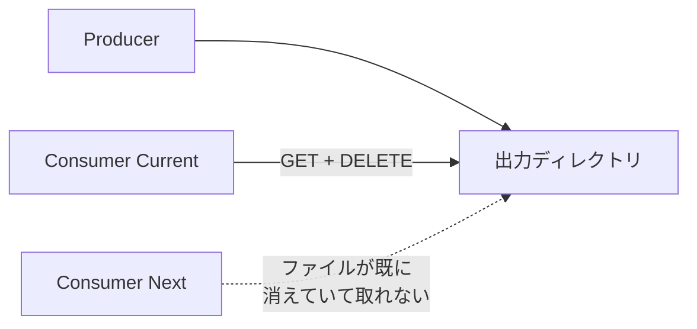
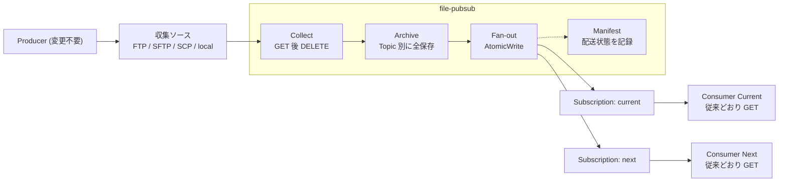
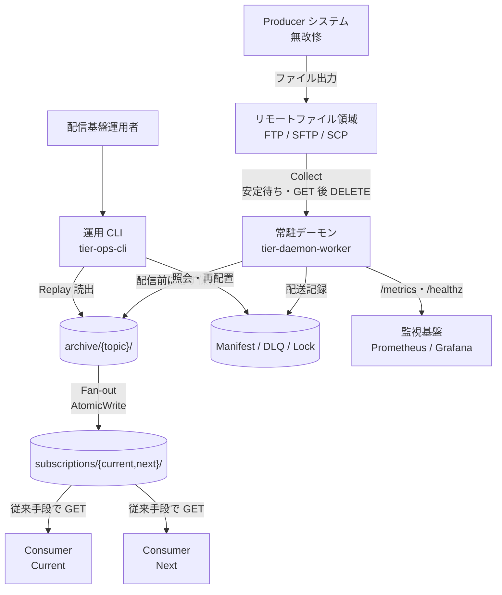
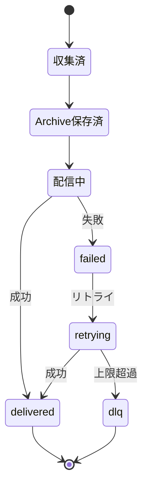
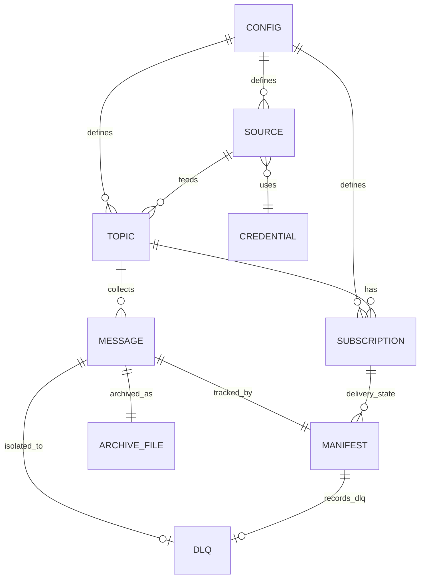

> 公開日: 2026-06-13 / リポジトリ: https://github.com/suwa-sh/file-pubsub (v0.1.0, MIT)

システム更改の現場で何度も踏む地雷があります。**Producer がニアリアルタイムにファイルを出力し、Consumer が FTP で GET してから DELETE する**——この昔ながらのファイル連携は、Consumer を 2 つ並べた瞬間に壊れます。先に取った側がファイルを消すので、もう一方が取り損ねるからです。

新旧システムを並行稼働させたい、DWH や BI に同じファイルを流したい。そう思って Consumer を 1 つ増やすだけで、データの取り合いが始まる。Producer は無数の外部システムや古いパッケージで、おいそれと改修できない。

この「GET+DELETE 型 IF は並行稼働できない」を、**Producer も Consumer も無改修のまま**解くために作ったのが [file-pubsub](https://github.com/suwa-sh/file-pubsub) です。本記事では、課題の構造・解決アプローチ・アーキテクチャ・使い方を、実装と照らしながら紹介します。

## 概要

file-pubsub は、**FTP GET/DELETE 型のレガシーファイル IF を Pub/Sub 風の配信モデルへ変換する軽量ブリッジ**です。収集ソースと Consumer の間に 1 プロセスだけ挟み、`Collect → Archive → Fan-out` で同じファイルを全 Consumer へ独立に配信します。

| 項目 | 内容 |
|---|---|
| 言語 / 配布 | Go シングルバイナリ (Linux 主対象 + macOS)、Docker イメージ (ghcr.io) |
| 改修要否 | **Producer・Consumer とも無改修**(Consumer は従来どおり自分のディレクトリから GET) |
| 収集ソース | local / FTP / SFTP / SCP |
| ライセンス | MIT |
| 外部依存 | なし(外部 DB を持たず、ローカルファイルシステムのみ) |

Web UI も HTTP API もなく、単一バイナリのサブコマンド(`serve` / `status` / `replay` / `config validate`)として動きます。観測用に Prometheus 形式の `/metrics` と `/healthz` だけを公開します。

## なぜ並行稼働できないのか

FTP GET/DELETE 型では、Consumer が「取得したら消す」ことでファイルの**重複取得を防いでいます**。1 Consumer なら正しく動きますが、これは裏を返すと「最初に取った 1 人だけが受け取れる」モデルです。



更改で新旧を並べたい、Consumer を増やしたい——いずれも「同じファイルを複数の受け手へ」が必要ですが、DELETE がそれを構造的に潰します。Producer 側で出力を多重化できれば早いのですが、その Producer こそが改修できない古いシステムであることがほとんどです。

## 解決アプローチ — Collect → Archive → Fan-out

file-pubsub は収集ソースと Consumer の間に入り、**「消す役」を一手に引き受けます**。Producer の出力を file-pubsub が GET（必要なら DELETE）し、まず Archive に必ず保存してから、Consumer ごとのディレクトリへ独立に複製します。



ポイントは 3 つです。

- **Producer は無改修**。出力先も方法も変えない。file-pubsub が代わりに回収する
- **Consumer も無改修**。自分専用の Subscription ディレクトリから、従来どおり GET+DELETE するだけ。一方が消しても他方には影響しない
- **Archive に必ず残る**。再送・監査・障害復旧・差分比較の土台になる

つまり Consumer を増やすことが「Subscription を 1 行足す」だけの操作になります。

## 基本モデル

5 つの概念で構成されます。Kafka / RabbitMQ / Google Pub/Sub を触ったことがあれば、ほぼそのまま読み替えられます。

| 概念 | 説明 |
|---|---|
| **Topic** | Producer が出力する論理的なファイル種別 (orders / customers / invoices 等)。Topic ごとに収集ソースを設定する |
| **Subscription** | Consumer ごとの配送先ディレクトリ (current / next / dwh 等)。配送は Subscription ごとに独立し、一方の取り込み・削除が他方に影響しない |
| **Archive** | 収集した全ファイルを Topic 別に必ず保存する。再送 (Replay)・監査・障害復旧・差分比較の基盤 |
| **Fan-out** | Archive から各 Subscription ディレクトリへ複製する。一時名で書き込んでから rename し、Consumer が途中状態を読まないようにする |
| **Manifest** | メッセージ (収集ファイル) ごとの message_id / topic / Subscription 別配送状態 (delivered / failed / dlq) の履歴。配送状態の正は常に Manifest |

`message_id` は「収集時刻 + Topic + 元ファイル名」から採番します。同名ファイルが再出力されても別メッセージとして扱い、履歴を失いません。

配信は **at-least-once** です。クラッシュ後の再開などで同一ファイルが Subscription へ再配置されることがあるため、Consumer 側は同名ファイルの再取得を許容してください——これは従来の FTP 再送と同じ前提です。順序保証はしません（取り込み順序は Consumer の責任。これも従来どおり）。

## 構造

### システム構成

収集ソースから監視基盤まで、データと操作の流れは次のとおりです。



実体は **2 ティア**です。

- **常駐デーモン (`serve`)** — ポーリングで `Collect → Archive 保存 → Fan-out → リトライ/DLQ → retention 削除` を周期実行し、`/metrics`・`/healthz` を公開する。Lock で二重起動を防ぎ（stale lock からは自動回復）、SIGTERM で graceful shutdown する
- **運用 CLI (`status` / `replay` / `config validate`)** — デーモンと同一バイナリで、usecase 層のコードを共有する

デーモン内部は **4 層**(runtime / usecase / domain / gateway)で、I/O を持たない domain 層に「状態遷移・message_id 採番・安定判定・冪等判定」といった純粋ロジックを集約しています。収集コネクタ (local/FTP/SFTP/SCP) だけはインターフェースで差し替え可能にし、後段の Archive/Fan-out/Manifest をソース種別に依存させていません。

### 配送状態の遷移

メッセージは収集から決着まで次のように遷移します。冪等再開はこの状態を Manifest で参照して実現します。



## データ

設定を起点に、収集ソース・Topic・Subscription・メッセージ・Manifest が関連します。



主要なエンティティは次のとおりです。

| エンティティ | 役割 |
|---|---|
| 設定 (CONFIG) | 単一 YAML。Topic / 収集ソース / Subscription / ポーリング間隔 / retention / リトライ / メトリクスポート / 認証情報参照をまとめて定義する |
| Topic | 収集ソースを 1 つ持つファイル種別。別システム・別サーバの IF を 1 デーモンに束ねられる |
| Subscription | 配送先ディレクトリ。Topic 内で独立して配送される |
| メッセージ (MESSAGE) | 収集された 1 ファイル。message_id で一意 |
| Archive ファイル | Topic 別に保存された収集ファイルの実体。Replay の読み出し元 |
| Manifest | message_id × Subscription の配送状態履歴。配送管理の単一の真実 (single source of truth) |
| DLQ | リトライ上限を超えて隔離されたメッセージ。隔離理由・失敗回数を持つ |

永続化は全てローカルファイルシステム上のディレクトリ (`archive/` `subscriptions/` `manifest/` `dlq/` `lock/` `processed/`) で、外部 DB を必要としません。

## 使い方

### Quick Start

設定は単一 YAML です。文字列値の中の `${ENV_VAR}` は起動時に環境変数で展開されます。

```yaml
polling_interval: 60     # 秒
archive_retention: 90    # 日
retry_max_count: 5
metrics_port: 9090

topics:
  - name: orders
    source:
      type: sftp
      host: legacy-host01
      directory: /out/orders
      auth:
        username: producer
        password: ${SFTP_PASSWORD}   # 環境変数参照を推奨
      stability_check:
        interval: 10                 # 秒 (書き込み完了の安定待ち)
      exclude_patterns:
        - "*.tmp"
    subscriptions:
      - name: current
        directory: /data/subscriptions/orders/current
      - name: next
        directory: /data/subscriptions/orders/next
```

検証して起動します。

```bash
./file-pubsub config validate --config config.yaml
./file-pubsub serve --config config.yaml
```

手元で試すなら docker compose の動作確認環境が用意してあります（収集元 SFTP/FTP サーバ込み、Windows の Docker Desktop でも確認済み）。

```bash
cd examples/docker-compose
docker compose up -d --build
echo "id,qty" > sources/sftp/orders_20260613.csv   # producer 役: ファイル投入
ls data/subscriptions/orders/current                # 15 秒ほどで複製される
```

### ユースケース 1: システム更改 (Current/Next 並行稼働)

同じ Topic に current / next の Subscription を並べ、新旧 Consumer を同時稼働して切替リスクを下げます。

```yaml
    subscriptions:
      - { name: current, directory: /data/subscriptions/orders/current }  # 現行システム
      - { name: next,    directory: /data/subscriptions/orders/next }     # 更改後システム
```

切替完了後は `next` を `current` に読み替え、旧側の Subscription を設定から削除するだけ。Producer は一切変更しません。

### ユースケース 2: Consumer 追加 (DWH / BI / AI への展開)

新しい取り込み先は Subscription を 1 行足すだけです。

```yaml
    subscriptions:
      - { name: current, directory: /data/subscriptions/orders/current }
      - { name: dwh,     directory: /data/subscriptions/orders/dwh }      # 追加
```

追加した Subscription には**追加以降に収集されたメッセージ**が配信されます。過去分が必要なら、次の Replay で Archive から流し込みます。

### ユースケース 3: 再送 (Replay)

「先月分を再投入したい」「DLQ に落ちた 1 件をやり直したい」を Archive から行います。

```bash
# 期間指定: 先月分を current へ再投入
./file-pubsub replay --config config.yaml --topic orders \
  --from 2026-05-01 --to 2026-05-31 --subscription current

# メッセージ指定: DLQ 隔離分を確認してから 1 件だけ再送
./file-pubsub status --config config.yaml --status dlq
./file-pubsub replay --config config.yaml --topic orders \
  --message-id 20260601T091500_orders_orders_20260601.csv --subscription current
```

`replay` は Manifest へ書き込むため、**`serve` 停止中に実行します**（後述の single-writer 化）。再送も Manifest に記録され、`status` で追跡できます。

## 設計上の判断

レガシー現場で「データを失わない・取りこぼさない・二重に困らせない」を満たすため、いくつか強めの制約を置いています。

- **Archive 保存を配信に先行させる**。`collect → archive → fanout` の順序を固定し、Archive 保存の完了を確認してから Fan-out を始める。配信途中で落ちても、収集したファイルは必ず残る
- **冪等再開 (at-least-once)**。再起動・中断後の再開では Manifest を参照し、未配信の Subscription にだけ配信する。配信済みへは重複配置しない
- **AtomicWrite**。Subscription への配置・Manifest 更新は一時名で書いてから rename する。Consumer が不完全なファイルを掴まない
- **DLQ 隔離**。配信失敗はリトライし、上限を超えたら `dlq/` へ隔離して Manifest に記録する。恒久障害を滞留させず、運用者の再送/破棄判断に委ねる
- **retention は決着分だけ消す**。保持期間を超えても、削除するのは配送が決着 (delivered / dlq) したメッセージの Archive のみ。未決着 (failed / delivering / retrying) 分は消さず、スキップをログに残す
- **Replay は single-writer**。`serve` と同じ Lock を取得し、デーモン稼働中の `replay` はエラー (終了コード 3)。Manifest への二重書き込みを防ぐ

これらのうち「retention の安全化」と「replay の single-writer 化」は、公開前の Codex レビューでデータ整合上のリスク（未決着分の消失・Manifest の競合書き込み）を指摘されて入れたものです。全修正に回帰テストを添えています。

## 仕様駆動で作った

副産物として、この OSS は要件整理から実装まで [distillery](https://github.com/suwa-sh) の仕様駆動フローで通しました。仕様案メモを入力に、USDM（要求分解）→ RDRA（要件定義）→ NFR（非機能要求）→ アーキテクチャ → 機能仕様 を生成し、**トレーサビリティ 100%（仕様 117 / 117）** を確認してから Go 実装に入っています。テストは 101 本以上が PASS し、docker compose の E2E で sftp/ftp/local の 3 Topic × current/next 配信を実機確認しています。

設計成果物はすべてリポジトリの [docs/](https://github.com/suwa-sh/file-pubsub/tree/main/docs) に置いてあります（USDM / RDRA / NFR / Arch / Specs）。「実案件起点の要件を、生成 AI でどこまで仕様に落とし切れるか」の実戦検証としても回した記録です。

## まとめ

FTP GET/DELETE 型のレガシーファイル連携は、それ自体が悪いわけではありません。ただ「並行稼働」「Consumer 追加」「再送」が必要になった瞬間に、DELETE の前提が足かせになります。

file-pubsub は、Producer も Consumer も無改修のまま、その間に `Collect → Archive → Fan-out` を挟むだけで、ファイルベースのまま Pub/Sub 的な運用語彙（Topic / Subscription / Replay / DLQ）を組織に持ち込めるようにします。将来 Kafka や Cloud Pub/Sub へ移行するときも、運用の手順を先にファイルで定着させておける橋渡しになります。

- リポジトリ: https://github.com/suwa-sh/file-pubsub
- リリース: https://github.com/suwa-sh/file-pubsub/releases (v0.1.0, linux/darwin × amd64/arm64 + ghcr.io イメージ)
- 設計ドキュメント: https://github.com/suwa-sh/file-pubsub/tree/main/docs

レガシー更改で同じ地雷を踏んでいる方の役に立てば幸いです。
