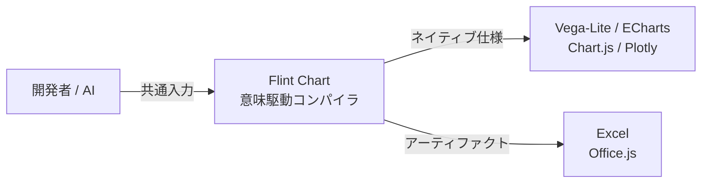
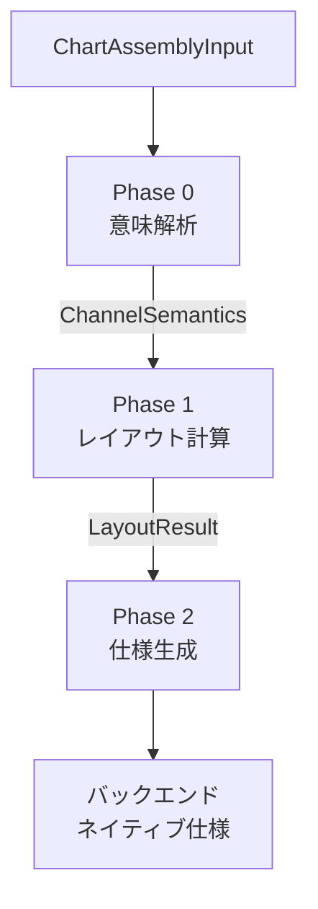

Flint Chartは、データの意味と作りたいチャートを簡潔に指定し、複数の描画ライブラリ向け仕様へ変換する可視化コンパイラです。人間が使うTypeScript APIに加え、AIエージェントが検証・コンパイル・レンダリングを実行できるMCPサーバーも提供しています。

本記事では、Flintの構造とデータモデル、導入方法、実装例、運用上の制約を、2026年8月11日時点の公式リポジトリに沿って解説します。


*この記事の全体像。以下、順に解説します。*

## 概要

従来の可視化ライブラリでは、軸、スケール、凡例、余白、ラベルなどを細かく指定します。表現力が高い一方、LLMが設定全体を生成すると、データ件数やラベルの長さによって表示が崩れやすくなります。

Flintは「どのように描くか」よりも「データが何を意味するか」を入力の中心に置きます。利用者は行データ、セマンティックタイプ、チャート種別、視覚チャネルを指定します。コンパイラが意味解析とレイアウト調整を行い、描画バックエンドのネイティブ仕様へ変換します。


Flint自体はCanvasやSVGへ直接描画するライブラリではありません。現行のTypeScript APIでは、同じ入力から次の出力を生成できます。

- Vega-Lite JSON spec
- Apache ECharts option
- Chart.js configuration
- Plotly.js figure
- Excelネイティブチャート用アーティファクト



既存ライブラリを置き換えるというより、その前段へバックエンド非依存の意味層を追加する位置づけです。

## 特徴

### セマンティックタイプ

`Rank`、`Temperature`、`Price`、`Amount`などのセマンティックタイプで、保存形式だけでは分からないフィールドの意味を宣言できます。意味情報は、数値書式、集約、ゼロ基準、並び順、色の判断に使われます。

たとえば`Price`は単価のような非加算的な金額、`Amount`は売上高のような加算可能な金額です。どちらも数値だからと同じ型にせず、集計時の意味に合わせて選びます。

### 自動レイアウト

データのカーディナリティと利用可能なサイズから、チャート寸法、ラベル、ステップ幅、ファセット配置などを計算します。離散値が多すぎる場合は、テンプレートの戦略に従って値を絞り、Web系バックエンドでは警告を結果へ付加します。

### 視覚テーマ

Economist、Swiss、Popなどの組み込みプリセットを利用できます。`ThemeSpec`ではプリセットを継承し、色、余白、タイポグラフィなどを上書きできます。ただし、公式READMEで現行のテーマ適用先として明示されているのはVega-Liteです。他のバックエンドでも同じ見た目になるとは限りません。

### マルチバックエンド

入力形式を変えずにアセンブラ関数だけを切り替えられます。ただし、すべてのチャート種別が全バックエンドで利用できるわけではありません。テンプレートレジストリで対応状況を確認する必要があります。

### AIエージェント向けMCPサーバー

`flint-chart-mcp`は、入力検証、ネイティブ仕様へのコンパイル、PNG/SVGレンダリング、チャート種別の列挙をMCPツールとして公開します。MCP Apps対応ホストでは、対話的なチャート調整画面も表示できます。

## 構造

Flintのリポジトリは、コンパイラ本体、MCPサーバー、Pythonプレビュー、ドキュメントサイトから構成されます。

| コンテナ | 役割 | 状態・制約 |
|---|---|---|
| `packages/flint-js` | TypeScriptコンパイラと各アセンブラ | npmパッケージ`flint-chart` |
| `packages/flint-mcp` | MCPサーバーとMCP App | npmパッケージ`flint-chart-mcp` |
| `packages/flint-py` | Pythonポート | ソースプレビュー。公開パッケージ前提では使わない |
| `site` | ギャラリー、エディタ、ドキュメント | ViteとReactで構築 |

### Web系バックエンドのパイプライン

Vega-Lite、ECharts、Chart.js、Plotlyのアセンブラは、意味解析とレイアウト計算を共有します。



Phase 0では、`semantic_types`、実データ、エンコーディングを組み合わせ、チャネルごとの意味を解決します。Phase 1では、目標サイズとデータ密度から寸法やオーバーフロー方針を決定します。Phase 2では、バックエンド別の`ChartTemplateDef`を使ってネイティブ仕様を組み立てます。

### Excelの例外

Excelは共通の意味解析を再利用しますが、Web系4バックエンドと同じ`computeLayout()`経路ではありません。Office.js向けの独自プランニングを行い、シリアライズ可能なアーティファクトを生成します。

この差は、サイズ制約や警告の扱いにも表れます。共通入力を受け取るからといって、内部処理や戻り値の細部まで同じとは限りません。

## データ

Flintの公開APIでは、`ChartAssemblyInput`がルートオブジェクトです。

| フィールド | 必須 | 役割 |
|---|---:|---|
| `data` | 必須 | `{ values: rows[] }`または型定義上の`{ url }` |
| `semantic_types` | 任意 | フィールド名から意味型または注釈への対応 |
| `chart_spec` | 必須 | チャート種別、チャネル、サイズ、タイトル |
| `theme_spec` | 任意 | プリセット名またはカスタムテーマ |
| `options` | 任意 | 伸長率、最小ステップ、色数上限など |
| `field_display_names` | 任意 | 軸や凡例に使う表示名 |

### セマンティック注釈

単純な文字列に加え、単位、固有範囲、並び順を指定できます。

```typescript
const semanticTypes = {
  quarter: "Quarter",
  revenue: { semanticType: "Amount", unit: "JPY" },
  region: { semanticType: "Region", sortOrder: ["東", "西"] },
};
```

同じデータセットから複数チャートを作る場合、意味定義は共有し、`chart_spec`だけを差し替えると一貫性を保ちやすくなります。

### `data.url`の扱い

型定義上は`data.url`を表現できますが、TypeScriptのコアアセンブラはURLを取得しません。意味解析とレイアウト計算が必要なホストでは、事前にデータを取得し、`data.values`へ展開して渡します。

MCPサーバーはローカルJSON、CSV、TSVファイルを独自に解決できます。TypeScript APIとMCPサーバーの責務を混同しないことが重要です。

### チャート仕様とサイズ

`chart_spec`には、テンプレートの正式名とチャネルを指定します。たとえば棒グラフの公開名は`"Bar Chart"`です。

Web系バックエンドでは、`baseSize`は目標サイズ、`canvasSize`は超えてはいけない上限として扱われます。`canvasSize`を省略した場合は、既定で`baseSize`から一定範囲まで伸長できます。現行のExcel実装は出力寸法へ`canvasSize`を反映しないため、Excelでは`baseSize`自体を必要な上限内に設定します。

## 構築方法

### npmパッケージを導入する

現行パッケージはNode.js 18以上を要求します。Vega-Lite仕様への変換だけなら`flint-chart`のみで動作します。生成した仕様をVega/Vega-Liteで実際にレンダリングする場合は、利用するレンダラーも追加します。

```bash
npm install flint-chart
npm install vega vega-lite
```

MCPサーバーは`npx`で起動できます。

```bash
npx -y flint-chart-mcp
```

### ソースからビルドする

Flintはnpm workspacesのモノレポです。

```bash
git clone https://github.com/microsoft/flint-chart.git
cd flint-chart
npm install
npm run build
npm run typecheck
npm test
```

ドキュメントサイトとエディタは、ルートから次のコマンドで起動できます。

```bash
npm run site
```

### バックエンドを拡張する

新しいWeb系バックエンドを追加する場合は、コアの意味解析を再利用し、バックエンド固有のテンプレートレジストリ、`assemble`処理、ネイティブ仕様の組み立てを実装します。

内部型は更新される可能性があるため、記事中の簡略サンプルをそのまま雛形にせず、公式の「Extending backends」と現行ソースを基準にしてください。

## 利用方法

### Vega-Lite仕様へ変換する

四半期売上の棒グラフを作る例です。売上高は加算可能な金額なので`Amount`を使います。

```typescript
import { assembleVegaLite } from "flint-chart";

const input = {
  data: {
    values: [
      { quarter: "Q1", revenue: 1200 },
      { quarter: "Q2", revenue: 1450 },
      { quarter: "Q3", revenue: 980 },
      { quarter: "Q4", revenue: 1800 },
    ],
  },
  semantic_types: {
    quarter: "Quarter",
    revenue: "Amount",
  },
  chart_spec: {
    chartType: "Bar Chart",
    title: "四半期ごとの売上",
    subtitle: "2026年度、単位: 千円",
    encodings: {
      x: { field: "quarter" },
      y: { field: "revenue" },
    },
    baseSize: { width: 480, height: 320 },
    canvasSize: { width: 720, height: 480 },
  },
};

const vegaLiteSpec = assembleVegaLite(input);
```

戻り値は描画済み画像ではなく、Vega-Liteへ渡せるJSON仕様です。


### バックエンドを切り替える

入力形は共通で、アセンブラ関数を切り替えます。

```typescript
import {
  assembleChartjs,
  assembleECharts,
  assembleExcel,
  assemblePlotly,
} from "flint-chart";

const echartsOption = assembleECharts(input);
const chartjsConfig = assembleChartjs(input);
const plotlyFigure = assemblePlotly(input);
const excelArtifact = assembleExcel(input);
```

未対応の`chartType`を指定すると、アセンブラは描画前に例外を投げます。`vlGetTemplateDef()`、`ecGetTemplateDef()`、`cjsGetTemplateDef()`などで事前確認できます。

### テーマを指定する

Vega-Liteでは、組み込みテーマ名またはカスタム`ThemeSpec`を指定できます。

```typescript
const themedSpec = assembleVegaLite({
  ...input,
  theme_spec: "economist",
});
```

### Excelアーティファクトを扱う

`assembleExcel()`はOffice.jsを直接実行しません。アーティファクトをExcelホスト内で描画するか、Office.jsソースへ変換します。

```typescript
import { assembleExcel, generateOfficeJs } from "flint-chart";

const artifact = assembleExcel(input);
const { code, meta } = generateOfficeJs(artifact, {
  scale: 3,
  cleanWorksheet: true,
  functionName: "renderFlintChart",
});
```

### MCPサーバーから使う

最小のクライアント設定は次のとおりです。

```json
{
  "mcpServers": {
    "flint": {
      "command": "npx",
      "args": ["-y", "flint-chart-mcp"]
    }
  }
}
```

現行MCPサーバーが`compile_chart`、`validate_chart`、`render_chart`で扱うバックエンドはVega-Lite、ECharts、Chart.jsです。PlotlyとExcelはTypeScript API側で利用します。

| MCPツール | 役割 | 論理的な結果内容 |
|---|---|---|
| `list_chart_types` | 対応チャートとチャネルの確認 | チャート種別一覧 |
| `list_themes` | 組み込みテーマの確認 | テーマ一覧とスタイル情報 |
| `validate_chart` | 入力仕様の検証 | `valid`、`warnings`、`errors`、`computedSize` |
| `compile_chart` | ネイティブ仕様への変換 | 仕様JSONと警告 |
| `render_chart` | 静的画像の生成 | PNGまたはSVG。Chart.jsはPNGのみ |
| `create_chart_view` | 対話的な調整 | MCP Apps対応ホストのUI |

MCPプロトコル上、`validate_chart`と`compile_chart`のJSONはトップレベルへ直接展開されず、`content[0].text`内のJSON文字列として返ります。`render_chart`はPNGの場合に`ImageContent`、SVGの場合にSVG文字列を含む`TextContent`を返します。クライアント実装では、表の論理結果と実際のContent Block構造を区別してください。

## 運用

### テーマを一元管理する

プリセットを継承し、ブランド固有の差分だけを上書きします。

```typescript
const theme_spec = {
  extends: "economist",
  id: "our-brand",
  ink: {
    series: { single: "#6b3fa0" },
  },
};
```

### サイズ上限を設定する

Web系バックエンドでは`baseSize`と`canvasSize`を分離し、目標サイズとハード上限を明示します。Excelでは前述の例外があるため、`baseSize`自体を管理します。

### 集約を前段へ寄せる

`aggregate`で`sum`、`count`、`average`を指定できますが、複雑な集計はSQLや分析基盤で済ませるほうが再現性を保ちやすくなります。Flintへは、可視化に必要な粒度へ整えたデータを渡します。

### 警告を監視する

Vega-Lite、ECharts、Chart.js、Plotlyでは、オーバーフローなどの情報を`_warnings`で確認します。

```typescript
if (vegaLiteSpec._warnings?.length) {
  console.warn("Flint warnings:", vegaLiteSpec._warnings);
}
```

Excelアーティファクトの公開キーは`warnings`です。ただし現行実装では、棒グラフ系のオーバーフローで値を絞っても警告が伝播しない場合があります。入力件数と生成アーティファクト内のデータ行も照合してください。

### MCPのファイル参照を制御する

stdio transportでは、ローカルJSON、CSV、TSVの参照が既定で有効です。未信頼のエージェントへ公開する場合は、ローカルファイル参照を無効にし、インラインデータだけを受け付けます。

```bash
npx -y flint-chart-mcp --disable-file-reference
```

HTTP transportでは、明示的に上書きしない限りファイル参照は既定で無効です。旧`--data-root`と`--data-roots`は現行CLIでは非推奨かつ無視されるため、ディレクトリ制限として機能する前提で使わないでください。

## ベストプラクティス

### 意味定義を共通化する

`semantic_types`をデータセット単位で管理し、チャートごとに再定義しないようにします。意味と表示名を分離し、軸ラベルだけを変える場合は`field_display_names`を使います。

### 前処理と描画の責務を分ける

結合、複雑な集計、欠損補完、トップN抽出は前段で行います。Flintには、意味が明確で、生成された仕様を検証できるデータを渡します。

### 目標サイズと制約を分ける

Web系バックエンドでは、`baseSize`を読みやすい目標、`canvasSize`を配置領域の上限として設定します。長いラベル、多数カテゴリ、ファセットを含む実データで確認します。

### タイトルとサブタイトルへ文脈を入れる

`title`には何を示すチャートか、`subtitle`には対象、期間、単位を記述します。軸タイトルを省略するテーマでも、チャート単体で意味を理解しやすくなります。

### MCPへ巨大データを直書きしない

大量の行を`data.values`として会話コンテキストへ埋め込むと、トークンと転送量を消費します。信頼できるローカル実行ではファイル参照を検討し、未信頼環境では前処理済みの小さなインラインデータへ制限します。

### 生成仕様をテストする

画像差分だけでなく、`chartType`、チャネル、計算サイズ、警告、生成されたネイティブ仕様の要点をスナップショット化します。バックエンドの更新で見た目が変わっても、意味的な契約を検証できます。

## トラブルシューティング

| 症状 | 主な原因 | 対処 |
|---|---|---|
| 未対応チャートの例外 | `chartType`の名前またはバックエンド対応 | `list_chart_types`や`*GetTemplateDef()`で確認 |
| 一部の値が表示されない | レイアウト予算を超えたオーバーフロー | 警告確認、事前集計、サイズ上限の見直し |
| 軸や書式が意図と違う | セマンティックタイプの不一致 | 型、`unit`、チャネル割り当てを見直す |
| テーマが適用されない | Vega-Lite以外を利用 | バックエンドごとの適用範囲を確認 |
| ラベルが重なる | 表示名が長い、配置領域が小さい | `field_display_names`、サイズ、前処理を見直す |
| TypeScript APIでURLデータが空になる | コアアセンブラがURLを取得しない | ホストで取得し`data.values`へ展開 |
| MCPでローカルファイルを読めない | transportまたは無効化設定 | 信頼境界を確認し、必要ならインライン化 |
| Excelで警告なしに値が減る | オーバーフロー警告が伝播しない経路 | 入力件数とアーティファクト行を照合 |

問題が起きたときは、入力検証、ネイティブ仕様、実レンダリングを分けて確認します。MCPでは`validate_chart`→`compile_chart`→`render_chart`の順に進めると、入力、コンパイル、描画のどこで問題が起きたか切り分けやすくなります。

## まとめ

Flint Chartは、データの意味を共通入力として保持し、複数の描画バックエンドへ変換する可視化コンパイラです。AIエージェントに小さな仕様面を提供しつつ、意味解析、レイアウト調整、検証、レンダリングを分離できます。

導入時は、バックエンドごとの対応チャート、テーマ適用範囲、サイズと警告のExcel例外を確認してください。MCP運用では、transportごとのファイル参照既定値とホスト側の権限管理も重要です。まずは実データで小さく試し、生成仕様と警告を含めて評価するのがよいでしょう。

この記事が少しでも参考になった、あるいは改善点などがあれば、ぜひリアクションやコメント、SNSでのシェアをいただけると励みになります！

## 参考リンク

- [Flint Project Site](https://microsoft.github.io/flint-chart/)
- [microsoft/flint-chart](https://github.com/microsoft/flint-chart)
- [Flint API Reference](https://github.com/microsoft/flint-chart/blob/main/docs/api-reference.md)
- [Flint Architecture](https://github.com/microsoft/flint-chart/blob/main/docs/architecture.md)
- [flint-chart package metadata](https://github.com/microsoft/flint-chart/blob/main/packages/flint-js/package.json)
- [Flint MCP Server README](https://github.com/microsoft/flint-chart/blob/main/packages/flint-mcp/README.md)
- [Model Context Protocol](https://modelcontextprotocol.io/)
