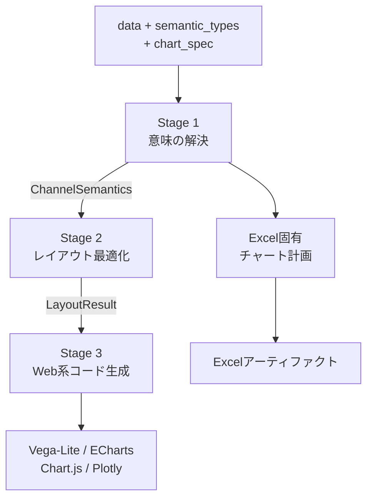

Flint Chartは、Microsoft Researchと中国人民大学のIDEAS Labが開発する、データ可視化のための中間言語です。Vega-LiteやEChartsを直接操作する代わりに、データの意味と作りたいチャートを簡潔に伝えると、コンパイラがレイアウトを調整して各バックエンドのネイティブ仕様へ変換します。

特に興味深いのは、人間だけでなくLLMやAIエージェントがチャートを作ることを設計の中心に置いている点です。本記事では、Flintの構造、TypeScript API、MCPサーバーの導入方法、運用時の注意点を、2026年8月11日時点の公式リポジトリに沿って解説します。


*この記事の全体像。以下、順に解説します。*

## Flint Chartとは

一般的な可視化ライブラリでは、軸、スケール、凡例、余白、ラベルなど、多くの設定を直接記述します。細部を制御できる一方、LLMが設定一式を生成すると、データの件数やラベルの長さによって表示が崩れやすくなります。

Flintは、次の3要素を入力として受け取ります。

| 入力 | 役割 | 例 |
|---|---|---|
| `data` | 行データ。MCPではローカルファイル参照も解決可能 | 売上、月、地域 |
| `semantic_types` | 各フィールドの意味 | `Price`、`YearMonth`、`Country` |
| `chart_spec` | チャート種別とチャネル割り当て | 棒グラフ、x軸、y軸 |

利用者は「何を表すか」を中心に記述します。軸の型、数値書式、ゼロ基準、色、レイアウトなどは、セマンティックタイプとデータをもとにFlintが判断します。

型定義上は`data.url`も表現できますが、TypeScriptのコアアセンブラはURLを取得しません。意味解析とレイアウト計算が必要なホストでは、URLを解決して`data.values`へ展開してから渡します。後述するMCPサーバーは、ローカルJSON、CSV、TSVを独自に読み込めます。

Flint自体は描画ライブラリではありません。共通入力を次のバックエンド向け仕様へ変換するコンパイラです。

- Vega-Lite
- Apache ECharts
- Chart.js
- Plotly.js
- Excelネイティブチャート用アーティファクト

この分離により、同じ意味情報とチャート仕様を保ちながら、出力先を切り替えられます。


## 宣言型ライブラリとの違い

FlintとVega-Lite、ECharts、Chart.jsは競合するだけの関係ではありません。Flintの出力先に、これらのライブラリが含まれます。

| 観点 | Flint | 一般的な描画ライブラリ |
|---|---|---|
| 主な責務 | 意味解析、レイアウト最適化、ネイティブ仕様生成 | ネイティブ仕様の解釈と描画 |
| 入力の中心 | データの意味、チャート種別、チャネル | 軸、スケール、マークなどの詳細設定 |
| 出力 | バックエンド固有の仕様 | Canvas、SVG、DOMなどへの描画 |
| AIエージェントとの相性 | 小さな入力面と検証用MCPツール | 詳細な設定全体を生成する必要がある |

既存の描画ライブラリを置き換えるというより、その前段に意味駆動のコンパイル層を追加するイメージです。アプリケーションが特定ライブラリの全機能を直接使いたい場合は、そのライブラリを直接操作するほうが適しています。一方、エージェントが多様なデータから安定したチャートを作る用途では、Flintの小さな入力面が効いてきます。

## 3段階のコンパイルパイプライン

Vega-Lite、ECharts、Chart.js、Plotlyの各アセンブラは、同じフロントエンドとオプティマイザを共有します。Excelは共通の意味解析を再利用しますが、Office.js向けの独自プランニング経路を持ちます。



### Stage 1: コンパイラフロントエンド

フロントエンドは、`semantic_types`、実データ、エンコーディングを組み合わせ、チャネルごとの`ChannelSemantics`を生成します。

同じ`YearMonth`でも、折れ線グラフのx軸では時間として扱い、色分けではカテゴリとして扱うことがあります。Flintは保存時の型だけでなく、チャート内での役割を考慮して意味を解決します。数値書式、集計、ゼロ基準、発散色の判断にも、この意味情報が使われます。

### Stage 2: オプティマイザ

オプティマイザは、目標サイズの`baseSize`と、必要に応じて指定する上限`canvasSize`から`LayoutResult`を計算します。

- 棒やヒートマップなどの離散軸: 読める最小幅を守りながら圧縮または拡張
- 散布図や折れ線などの連続軸: マーク密度に応じた拡張
- ファセット: 行列数、アスペクト比、サブプロット寸法の調整
- 要素数が多すぎる場合: データを絞り込み、警告を結果へ付加

Web系4バックエンドでは、`baseSize`は目標サイズ、`canvasSize`は超えてはいけない上限です。`canvasSize`を省略した場合は、既定で`baseSize`の1.5倍まで伸長できます。現行のExcel実装は、生成アーティファクトの寸法へ`canvasSize`を反映しないため、`baseSize`自体を必要な上限内に設定してください。

### Stage 3: コードジェネレータ

最後に、バックエンド別のテンプレートが最適化済みのコンテキストを受け取り、ネイティブ仕様を生成します。新しいバックエンドを追加する場合も、意味解析とレイアウト最適化は再利用できます。

Excelは実行環境だけでなく、最適化経路も異なります。`assembleExcel()`は共通の意味解析と一部のオーバーフロー処理を利用しつつ、Office.js向けの独自アーティファクトを組み立てます。Office.jsを直接実行せず、まずシリアライズ可能なチャートアーティファクトを返し、それをExcelホスト内で`renderExcelChart()`へ渡すか、`generateOfficeJs()`でOffice.jsソースへ変換します。

## TypeScriptで使う

### 前提とインストール

公式パッケージの現行要件はNode.js 18以上です。まずコアパッケージと、利用する描画バックエンドのpeer dependencyを導入します。次はVega-Liteを使う例です。

```bash
npm install flint-chart
npm install vega vega-lite
```

FlintのPython版はリポジトリ内にありますが、現時点ではソースプレビューです。PyPIパッケージとして公開されている前提では導入しないでください。

### 最小の棒グラフ

次の例では、四半期を`Quarter`、加算可能な売上高を`Amount`として宣言します。`Price`は単価のような非加算的な金額に使います。`chartType`にはテンプレートレジストリにある公開名を指定します。たとえば棒グラフは`"Bar Chart"`であり、`"bar"`ではありません。

```typescript
import { assembleVegaLite } from "flint-chart";

const input = {
  data: {
    values: [
      { quarter: "Q1", revenue: 1200 },
      { quarter: "Q2", revenue: 1450 },
      { quarter: "Q3", revenue: 980 },
      { quarter: "Q4", revenue: 1800 },
    ],
  },
  semantic_types: {
    quarter: "Quarter",
    revenue: "Amount",
  },
  chart_spec: {
    chartType: "Bar Chart",
    title: "四半期ごとの売上",
    encodings: {
      x: { field: "quarter" },
      y: { field: "revenue" },
    },
    baseSize: { width: 480, height: 320 },
    canvasSize: { width: 720, height: 480 },
  },
};

const vegaLiteSpec = assembleVegaLite(input);
```

戻り値は描画済み画像ではなく、Vega-Liteへ渡せるJSON仕様です。バックエンドを変える場合も、入力の形は共通です。

```typescript
import {
  assembleChartjs,
  assembleECharts,
  assembleExcel,
  assemblePlotly,
} from "flint-chart";

const echartsOption = assembleECharts(input);
const chartjsConfig = assembleChartjs(input);
const plotlyFigure = assemblePlotly(input);
const excelArtifact = assembleExcel(input);
```

すべてのチャート種別を、すべてのバックエンドが実装しているわけではありません。実行前に`vlGetTemplateDef()`、`ecGetTemplateDef()`、`cjsGetTemplateDef()`などで対応を確認できます。未対応の`chartType`を指定すると、アセンブラは描画前に例外を投げます。

### セマンティックタイプを再利用する

同じデータセットで複数のチャートを試す場合、`semantic_types`は一度定義し、`chart_spec`だけを差し替えます。

```typescript
const semantic_types = {
  recordedAt: "DateTime",
  temperature: { semanticType: "Temperature", unit: "°C" },
  region: "Region",
};
```

`SemanticAnnotation`では、`semanticType`に加えて`intrinsicDomain`、`unit`、`sortOrder`を指定できます。表示名だけを変えたい場合は`field_display_names`を使い、エンコーディングは元のフィールド名へ結び付けたままにします。

### オーバーフロー警告を扱う

離散値がレイアウト上限を超えると、Flintはテンプレートの戦略に従って値を絞り、結果へ警告を付けます。これは「例外が起きなければ全データが表示された」という意味ではありません。

Vega-Lite、ECharts、Chart.js、Plotlyの組み込み先では`_warnings`を確認し、ユーザーへ省略を知らせる、事前集計する、`canvasSize`を見直す、といった処理が必要です。チャートの見た目だけをスナップショットするより、生成仕様と警告を合わせてテストするほうが安全です。

Excelアーティファクトの公開キーは`warnings`です。ただし、現行実装では棒グラフ系のオーバーフローでデータを絞っても、その警告が結果へ伝播しない場合があります。Excel出力では警告だけに依存せず、入力件数と生成アーティファクト内のデータ行も照合してください。

## MCPサーバーでAIエージェントから使う

Flintは`flint-chart-mcp`を提供しています。MCP対応クライアントから、チャートの検証、コンパイル、レンダリングを呼び出せます。MCP Apps対応クライアントでは、インタラクティブ表示も利用できます。非対応クライアントでは`render_chart`による静的画像を使います。

TypeScript APIが5バックエンドを持つのに対し、現行MCPサーバーが`compile_chart`、`validate_chart`、`render_chart`で扱うのはVega-Lite、ECharts、Chart.jsの3種類です。PlotlyとExcelはTypeScript API側で利用します。

### 起動とクライアント設定

インストールせずに試す場合は、`npx`で起動できます。

```bash
npx -y flint-chart-mcp
```

クライアント設定の最小例は次のとおりです。

```json
{
  "mcpServers": {
    "flint": {
      "command": "npx",
      "args": ["-y", "flint-chart-mcp"]
    }
  }
}
```

主なMCPツールは次のとおりです。

| ツール | 用途 | 主な出力 |
|---|---|---|
| `validate_chart` | 入力仕様の妥当性確認 | `valid`、`warnings`、`errors`、`computedSize` |
| `compile_chart` | バックエンド仕様への変換 | ネイティブ仕様JSONとwarnings |
| `render_chart` | 静的画像の生成 | PNGまたはSVG。Chart.jsはPNGのみ |
| `list_chart_types` | 利用可能なチャートの確認 | 種別とチャネル |
| `list_themes` | 組み込みテーマの確認 | テーマ一覧とガイダンス |
| `create_chart_view` | 対話的な調整画面の表示 | MCP Apps対応ホストで表示するUI |

エージェントには、いきなり`render_chart`だけを呼ばせるより、`list_chart_types`で候補を確認し、`validate_chart`、`compile_chart`、`render_chart`の順で進ませると問題を切り分けやすくなります。

### ローカルファイル参照の安全性

前述のstdio設定では、`data.url`によるローカルJSON、CSV、TSVファイルの参照が既定で有効です。HTTP transportでは、明示的に上書きしない限り既定で無効になります。トランスポートによって初期値が異なるため、ここは運用上の重要な注意点です。

未信頼のユーザーやエージェントへMCPサーバーを公開する場合は、ローカルファイル参照を無効にし、`data.values`のインラインデータだけを受け付けます。HTTP公開時も、`FLINT_MCP_DISABLE_FILE_REFERENCE`などで安全側の既定値を上書きしていないか確認してください。

```bash
npx -y flint-chart-mcp --disable-file-reference
```

旧オプションの`--data-root`と`--data-roots`は、現行CLIでは非推奨かつ無視されます。ディレクトリ制限として機能する前提で使うと危険です。

公開するバックエンドも環境変数で絞れます。

```bash
FLINT_MCP_BACKENDS=vegalite,echarts npx -y flint-chart-mcp
```

さらに、MCPプロセス自体を最小権限のユーザー、コンテナ、読み取り制限済みの作業ディレクトリで動かしてください。FlintのCLIオプションだけで、ホスト全体のサンドボックスを代替することはできません。

## テーマとバックエンド差を理解する

FlintにはEconomist、Swiss、Popなどの組み込みテーマがあります。テーマは`chart_spec`と分離した`theme_spec`で指定します。

```typescript
const themedSpec = assembleVegaLite({
  ...input,
  theme_spec: "economist",
});
```

独自テーマでは、プリセットを継承し、ブランド固有の決定だけを上書きできます。ただし、公式READMEでは現時点の`ThemeSpec`はVega-Lite出力に影響すると明記されています。バックエンドを切り替えても同じ見た目になる、と仮定しないでください。

また、Flintの共通入力はバックエンド間の完全な機能同一性を保証するものではありません。対応するチャート種別、警告、フォント、レンダリング結果は、出力先の制約を受けます。バックエンドごとのリファレンスと実出力の確認が必要です。

## 導入判断のポイント

Flintが向いているのは、次のようなケースです。

- AIエージェントに、多様なデータからチャートを生成させたい
- データの意味を一度定義し、複数のチャートやバックエンドで再利用したい
- レイアウト調整や値のあふれをコンパイラ側で扱いたい
- MCP経由で検証、コンパイル、レンダリングを一連のツールとして提供したい

一方、次の条件では慎重な評価が必要です。

- 特定の描画ライブラリ固有機能を細部まで直接制御したい
- 対象のチャート種別が選んだバックエンドで未対応
- Pythonの公開パッケージが必要
- バックエンドを変えても完全に同じ見た目が必要

導入前には、実データを使った小さな検証をおすすめします。特に、ラベルが長いデータ、カテゴリ数が多いデータ、欠損値を含むデータで、生成仕様と`_warnings`を確認してください。

## トラブルシューティング

| 症状 | 確認する点 | 対処 |
|---|---|---|
| 未対応チャートの例外 | `chartType`の公開名とバックエンド対応 | `list_chart_types`または`*GetTemplateDef()`で確認 |
| 意図しない軸・書式 | `semantic_types`とチャネル割り当て | 意味型、`unit`、明示的な`type`を見直す |
| 一部の値が表示されない | 戻り値の`_warnings` | 事前集計、キャンバス上限、ソート指定を見直す |
| MCPからファイルを読めない | `--disable-file-reference`の有無 | 信頼境界を確認し、必要ならインラインデータを使う |
| バックエンド間で見た目が違う | 対応テンプレートとテーマ適用範囲 | 各バックエンドの生成仕様を個別に検証 |
| Pythonでインストールできない | 公開パッケージの有無 | 現状はソースプレビューとして評価 |

## まとめ

Flint Chartは、データの意味、レイアウト最適化、バックエンド別コード生成を分離し、AIエージェントが扱いやすい可視化コンパイラとして設計されています。TypeScript APIでは同じ入力から5種類のバックエンドへ変換でき、MCPサーバーでは検証から対話的な表示までをエージェントへ提供できます。

導入時は、`chartType`の正式名、バックエンドごとの対応差、オーバーフロー警告を確認してください。MCP運用では、stdioとHTTPでローカルファイル参照の既定値が異なり、旧`--data-roots`が制限として機能しない点にも注意が必要です。意味駆動の共通層が自分たちのデータと出力先に合うか、実データで小さく検証するのがよいでしょう。

この記事が少しでも参考になった、あるいは改善点などがあれば、ぜひリアクションやコメント、SNSでのシェアをいただけると励みになります！

## 参考リンク

- [Flint公式サイト](https://microsoft.github.io/flint-chart/)
- [microsoft/flint-chartリポジトリ](https://github.com/microsoft/flint-chart)
- [Flint API Reference](https://github.com/microsoft/flint-chart/blob/main/docs/api-reference.md)
- [Flint Architecture](https://github.com/microsoft/flint-chart/blob/main/docs/architecture.md)
- [flint-chartパッケージ](https://github.com/microsoft/flint-chart/blob/main/packages/flint-js/package.json)
- [Flint MCP Server README](https://github.com/microsoft/flint-chart/blob/main/packages/flint-mcp/README.md)
- [Model Context Protocol](https://modelcontextprotocol.io/)
