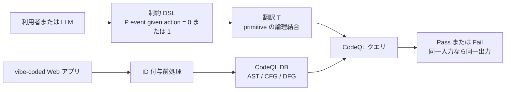
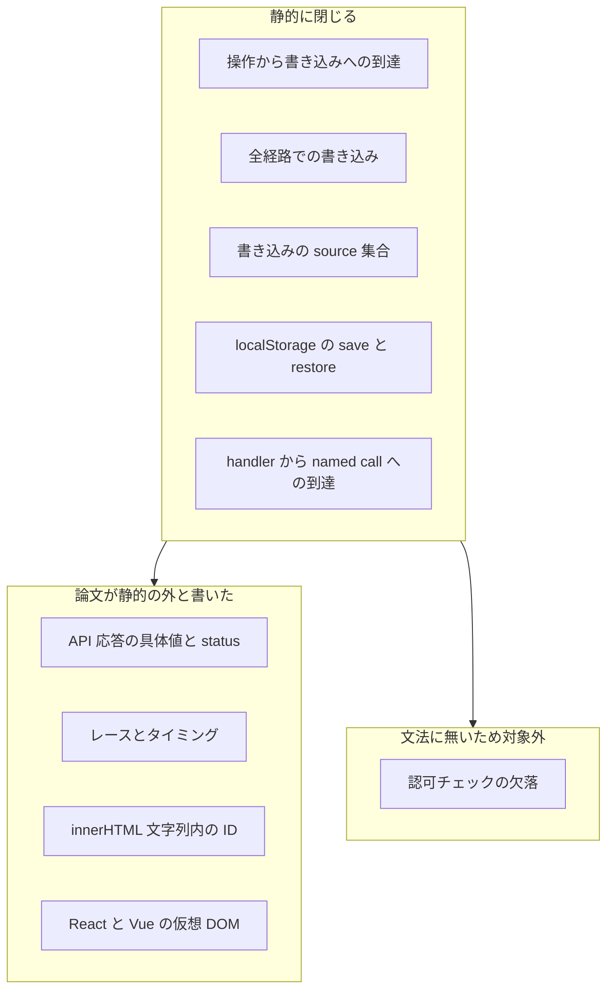

生成した Web 画面は動きます。
成功メッセージも出ます。
それでも入力が、期待した表示や永続化へ届かないことがあります。

この種のずれは、画面を目視しても、モデルに「正しそうか」と聞いても、再現しにくいです。
Columbia DAPLab の Reya Vir、Lydia Chilton、Zhuo Zhang、Eugene Wu による [FlowCheck](https://arxiv.org/abs/2608.28880) は、利用者が UI 上で「この操作のあと、この要素が更新される」と制約を指し、それを [CodeQL](https://codeql.github.com/docs/codeql-language-guides/analyzing-data-flow-in-javascript-and-typescript/) クエリへ翻訳します。
同一コードと同一制約なら、同じ判定を返す設計です。

この記事では、次の判断材料をまとめます。

- 生成 UI の受入で、構造フローだけを決定論的な検査にできるか
- 30/30 検出と 0 FP を、どの評価集合の話として読むか
- 認可、API の実値、非同期レースへ同じ DSL を伸ばしてよいか

対象読者は、コーディングエージェントで画面を量産したあとの受入基準を設計する立場の方です。
実装の道具紹介ではなく、どこまでを自動 fail にしてよいかの境界を扱います。


*この記事の全体像。以下、順に解説します。*

## 画面は動くのに値が届かない失敗

FlowCheck が対象にするのは、クラッシュではなく**サイレントな行動失敗**です。
形成的研究（Claude Opus 4.7、DeepSeek V3、Lovable。プレーン JS。4 アプリを 4 反復）では、23 件の失敗を 5 類に分けています。

- 表面は正しいが効果が無い
- 反復の途中で制約が落ちる
- 暗示された機能がつながっていない
- 改修後に別経路が切れる
- 永続化が不完全

共通構造は、「操作と観測可能な効果の関係が無い、または違う」ことです。
著者は、この 23 件のうち 11 件（48%）だけが静的制約で完全に検査できる、と数えます。
列挙した制約ケース 34 のうち、完全検査は 21、構造のみは 8、残りは実行が要ります（論文 §5.4）。

導入例はプロモコードです。
`promo-msg` に「Discount applied!」と書く一方、割引後 total を表示にも `localStorage` にも流しません。
制約は次の形です。

```text
P(w(total, r(promoInput)) | A(applyPromoBtn)) = 1
```

これは「Apply を押したすべての経路で、promo 入力を由来とする値が total へ書き込まれる」という意味です。
メッセージだけ更新する経路が、反例になります。

## 制約は確率ではなく到達の 0 か 1

制約の形は `P(event | action) = 0` または `1` です。
Trigger-Action で、全経路で起きる（P=1）か、到達禁止（P=0）かを決めます。

原子は次に閉じます。

| 原子 | 意味 |
|---|---|
| `w()` | 要素への書き込み |
| `A()` | 操作（クリック等） |
| `call()` | 名前付き API 呼び出し |
| `persist()` | 永続化 |

値は計算しません。
由来の source 集合だけを見ます。
`r(a)+r(b)` は算術結果ではなく `{a,b}` という集合になります。
「何が計算されたか」ではなく、「どこから来たか」の検査です（§5.5）。

`P=1` はイベント側を全経路検査します。
`P=0` は到達可能性の否定です。
`persist` は、handler 側の save と、page-load 側の getItem の両方です。

検査は実行しません。
前処理後の JavaScript データベースに対し、CodeQL の primitive（到達、全経路書き込み、source 集合、persist の save と restore）へコンパイルします。
実装は ANTLR4、意味解析、`.ql` テンプレ置換です。
欠落 ID には `cv_nnnn` を HTML（BeautifulSoup）と JS（正規表現）へ入れます。
評価アプリは、あらかじめ ID を保証しています。



決定論は「制約が正しい」ことを前提にします。
誤った制約は、同じ入力に対して同じ誤判定を返します。

## 静的に閉じる層と、論文が切っている層

検査できる層は、操作から書き込みへの到達、全経路での書き込み、書き込みの source 集合、localStorage の save と page-load restore、handler から named call への到達です。

論文自身が静的の外と書いている層は、API 応答の具体値と status、レースとタイミング、innerHTML 文字列内の ID、React と Vue の仮想 DOM です。
DSL の文法に principal、role、session が無いため、認可チェックの欠落も同じ枠では表現できません。



公式 CodeQL の JavaScript 解析は、local / global data flow と taint の ConfigSig を提供します。
FlowCheck の primitive はこの上に載ります。
ただし公式文書は、「Strings are not source nodes」「global data flow may report spurious flows」と書いています。
決定論は、健全かつ完全を意味しません。

[github/codeql#21257](https://github.com/github/codeql/issues/21257)（open、2026-02-03）は、`fetch().json()` から `insertAdjacentHTML` への DOM XSS を javascript-security-extended が報告しない、という再現報告です。
メンテナ確認はまだありません。
非同期応答から DOM への経路を、公式スイートが常に拾うとは限りません。

CodeQL 2.26.3（[2026-08-19 の changelog](https://github.blog/changelog/2026-08-19-codeql-2-26-3-improves-github-actions-queries-and-javascript-modeling/)）は、Vue Composition API と promise-wrapped client response のモデルを足しています。
論文投稿（2026-08-28）直前まで、フレームワークと非同期応答のモデルは増補中でした。
公式サポート表の Vue 対応はセキュリティ taint 用であり、FlowCheck が前提にする要素 ID 対応を救う根拠にはなりません。

## 30/30 と 0 FP の読み方

論文 abstract と §9 は、注入違反 30 件を全検出し、false positive 無し、と書きます。
LLM 最良ベースラインは Claude Opus 4.7 の詳細プロンプトで 26/30 です。
単一 run です。
落としやすい類型の中心は、全経路量化とクロス handler です（§7.2.2）。

GitHub の `eval_results.md`（表は 65 行。見出しは 66 と食い違う）は、次の内訳です。

| アプリ | PASS 期待 | FAIL 期待（注入） | 合計 |
|---|---|---|---|
| amazon-modified | 7 | 7 | 14 |
| twitter-modified | 7 | 8 | 15 |
| airbnb-modified | 8 | 7 | 15 |
| slack-modified | 13 | 8 | 21 |
| 合計 | 35 | 30 | 65 |

65/65 が Expected と一致します。
0 FP は、壊していない 35 制約が modified コードでも PASSED だった、という意味です。
未改変アプリ単独の FP 表はリポジトリにありません。

評価アプリはプレーン JS、ID 付き、localStorage です。
規模は HTML+JS でおおよそ 300 から 900 行です。
action 要素は 16-26、handler は 17-23、localStorage 操作は 5-11 です。
題材は Amazon、Twitter、Airbnb、Slack 風です。

この数字を「生成 UI 全体の保証」と読むと、円環になります。
評価対象は、著者が書いた制約、著者が注入した違反、静的解析が通るよう切った vanilla JS です。
形成的研究の 23 件のうち fully checkable は 48% であり、サイレント失敗全体の検出器ではありません。

README は `python3 eval.py` と書きますが、2026-09-02 時点の main に `eval.py` はありません。
65/65 を独立再実行する公式入口が欠けます。
[reyavir/flowcheck](https://github.com/reyavir/flowcheck) は同日時点で star 0、ライセンスメタデータ無し、最終 push は 2026-07-11 です。

## LLM に制約を書かせると入口が確率的になる

LLM 比較は、モデルとプロンプトあたり 1 run です。
分散は未測定です。
詳細プロンプトでも、モデルはデッドコードや製品固有コメントを理由に、注入バグを「意図」と合理化することがあります（Appendix A.3）。

エージェントに文法を渡して Amazon の制約を書かせた実験（3 run）では、valid 率が Claude 34-44%、DeepSeek 41-65%、Gemini 45-100% です。
下限は 34% です。
失敗の中心は、幻覚 ID、ハイフンとアンダースコア、`call` と `A` の取り違えです。

同じ設定で制約を生成させた実験では、Amazon の gold 7 件に対する検出が Claude 5→6、DeepSeek 3→5、Gemini 3→4 へ増えます。
既製の gold 制約を配布した実験ではありません。
論文自身が conclusive ではないと書きます。
DeepSeek は run あたり 2-3 の FP を出します。

入口が確率的なら、パイプライン全体は決定論ではありません。
残してよいのは、制約の起草を LLM にやらせ、人が overlay で ID と論理を直す工程です。
エンドユーザスタディは「計画」であり、非技術者が制約を正しく指せることは未検証です。

## 実行仕様や LLM 判定との分担

構造フローの静的検査は、実行可能な受入テストや LLM-as-judge と役割が違います。

| 基準 | FlowCheck | LLM-as-judge | Quickstrom | ATDD / ブラウザ E2E |
|---|---|---|---|---|
| 決定性 | 同一コードと同一制約なら同一判定 | 本論文は model と prompt あたり 1 run。分散は未測定 | トレースと探索に依存 | 実行手順が同じなら再実行可能 |
| 仕様の置き場 | UI 要素 ID に結合した DSL | プロンプト | Specstrom / LTL | 実行可能な受入テスト |
| フレームワーク | 評価は vanilla。React / Vue は論文が fully check できないと書く | 実装非依存に見えるが oracle が弱い | 実装言語非依存（TodoMVC 複数実装） | 実装非依存 |
| 認可 | 文法に principal が無い | たまに拾うが再現しない | 仕様に書けば実行で見える | 仕様に書けば実行で見える |
| API 実値 | 由来（taint）まで。値は runtime へ | 推測 | 実行で観測 | 実行で観測 |
| 非技術者 | クリック overlay が売り。ユーザスタディは未実施 | 自然言語のまま残る | Web プログラマ向け、と FlowCheck 論文が対比 | シナリオ文は書けるが保守が要る |

[Quickstrom](https://arxiv.org/abs/2203.11532)（PLDI 2022）は、ユーザ可視振る舞いだけを見るので実装言語に依存しません。
[quickstrom/quickstrom](https://github.com/quickstrom/quickstrom) は 2026-09-02 時点で star 約 434、最終 push は 2024-08-18、archived ではありません。
FlowCheck 論文 §2.3 自身が、runtime かつプログラマ向け LTL として挙げます。

Mitchell と Shaaban の LMPL’25 ポジション論文（[arXiv:2511.00202](https://arxiv.org/abs/2511.00202)）は、vibe coding に形式検証サイドカーを置けと主張します。
自動形式化、検証、LLM へのフィードバック、開発者による仕様介入です。
FlowCheck はそれを UI フローに特化し、表現力を意図的に落とした実装と読めます。

論文 HTML と所属ラボの [publications](https://daplab.cs.columbia.edu/publications.html) は、LMPL ’26（SPLASH/ISSTA 2026、Oakland）への採録を主張します。
ACM DOI `10.1145/3843750.3843844` は 2026-09-02 時点で DOI System に無く、[ワークショップ公式](https://conf.researchr.org/home/splash-issta-2026/lmpl-2026) の accepted papers 一覧にも未掲載です。
採録事実としてはまだ確定していません。

## 認可、外部 API、非同期へ伸ばさない

同じ DSL を認可、外部 API の実値、非同期レースへ伸ばす計画は採りません。
論文が否定で答えています。

| 拡張先 | 同じ DSL で足りるか | 根拠 |
|---|---|---|
| 認可 | 足りない | 文法に principal / role / session が無い。`guarded_write` は UI 要素を読む if の構造だけ。欠落型バグは taint の存在検査と逆向き |
| 外部 API | 呼び出し到達と応答 taint まで | `call_reaches` / `api_result_taint`。値と status は §8.2 が runtime へ送る。外部ライブラリは公式も `isAdditionalFlowStep` が要ると書く |
| 非同期 | 足りない | race は §5.1 で out of scope。`all_paths_write` は handler CFG。`fetch().then` の write を同一経路とみなす primitive は Table 2 に無い |

認可バグは「危険パターンの存在」ではなく「チェックの欠落」であることが多いです。
NVD で確認できる [CVE-2025-29927](https://nvd.nist.gov/vuln/detail/CVE-2025-29927)（Next.js middleware、`x-middleware-subrequest`）と [CVE-2025-68941](https://nvd.nist.gov/vuln/detail/CVE-2025-68941)（Gitea 1.22.3 未満、CWE-863）がその型です。
FlowCheck の path_exists は書き込みの有無であり、認可チェックの有無ではありません。

取るべき分割はハイブリッドです。

- 静的は「届く経路があるか」
- 実行は「届いた値が正しいか、順序が壊れていないか」
- 認可は別仕様（テスト、サーバ側政策、または専用解析）

## 生成 UI の受入に置く位置

残してはいけないのは、「動いて見える」という受入です。
自然言語の Done 定義を、画面要素間のフロー制約へ落としたうえで、検査器を決定論にします。
自然言語を残さないことではありません。

実務への最小セットは次です。

1. 画面の重要な操作ごとに、更新される表示、storage キー、呼ぶ API 名を制約として残す
2. 生成ループの中で CodeQL（または同等の静的フロー）を回し、P=1 / P=0 の構造違反だけを自動 fail にする
3. 値、権限、非同期、フレームワーク画面は、既存の ATDD かブラウザシナリオで受ける。FlowCheck の成功を「受入完了」にしない

実装を `reyavir/flowcheck` に依存する必要はありません。
star 0、ライセンス不明、eval 入口欠落、名称衝突（MCP の intent 判定、財務キャッシュフロー、英国流量計測）があります。
文法と primitive 表を仕様の参考にし、自前の静的検査か ATDD に落とします。

逆転条件は、フレームワーク上で、有機バグ集合に対し、著者以外が書いた制約で、未改変コードの FP が測られ、かつ認可欠落を表現する原子が文法に入ったときです。
そのときは、主 oracle 化を再検討します。

第一著者の先行メモ [9 Critical Failure Patterns of Coding Agents](https://daplab.cs.columbia.edu/general/2026/01/08/9-critical-failure-patterns-of-coding-agents.html)（2026-01-08）は、エージェントが実行を優先しエラーを隠す、と書いています。
動機は揃います。
動機の一致を、適用範囲の拡張と取り違えないことが判断です。

## まとめ

構造フロー（操作が書き込み、永続化、呼び出しに届くか。全経路か。由来は何か）に限れば、制約を静的検査可能な oracle にできます。
生成 UI の受入を「動いて見える」から一段下ろす設計としては、この層だけ採用する価値があります。

30/30 と 0 FP は、著者が切った vanilla JS と注入集合の中の話です。
生成 UI 全体の保証ではありません。
認可、API 実値、非同期レース、React / Vue へ同じ翻訳器を伸ばす根拠は、論文自身が切っています。

受入仕様には画面フロー制約を必須列として足し、自動ゲートは構造層だけに閉じます。
値と権限と順序は、実行仕様側に残します。

この記事が少しでも参考になった、あるいは改善点などがあれば、ぜひリアクションやコメント、SNSでのシェアをいただけると励みになります！

## 参考リンク

- Vir, R., Chilton, L., Zhang, Z., Wu, E. FlowCheck: Helping End-Users Specify and Verify Intent in Vibe-Coded Web Apps. arXiv:2608.28880v1, 2026-08-28. https://arxiv.org/abs/2608.28880 / HTML: https://arxiv.org/html/2608.28880v1
- コードと評価表: https://github.com/reyavir/flowcheck （`eval_results.md`、取得 2026-09-02）
- LMPL 2026: https://conf.researchr.org/home/splash-issta-2026/lmpl-2026
- DAPLab publications: https://daplab.cs.columbia.edu/publications.html
- ACM DOI（2026-09-02 時点で未解決）: https://doi.org/10.1145/3843750.3843844
- CodeQL JS data flow: https://codeql.github.com/docs/codeql-language-guides/analyzing-data-flow-in-javascript-and-typescript/
- CodeQL 2.26.3 changelog（2026-08-19）: https://github.blog/changelog/2026-08-19-codeql-2-26-3-improves-github-actions-queries-and-javascript-modeling/
- github/codeql#21257: https://github.com/github/codeql/issues/21257
- O’Connor, L., Wickström, O. Quickstrom. arXiv:2203.11532. https://arxiv.org/abs/2203.11532 / リポ: https://github.com/quickstrom/quickstrom
- Mitchell, J., Shaaban, Y. Position: Vibe Coding Needs Vibe Reasoning. arXiv:2511.00202. https://arxiv.org/abs/2511.00202
- Vir, R. 9 Critical Failure Patterns of Coding Agents. DAPLab, 2026-01-08. https://daplab.cs.columbia.edu/general/2026/01/08/9-critical-failure-patterns-of-coding-agents.html
- CVE-2025-29927: https://nvd.nist.gov/vuln/detail/CVE-2025-29927
- CVE-2025-68941: https://nvd.nist.gov/vuln/detail/CVE-2025-68941
