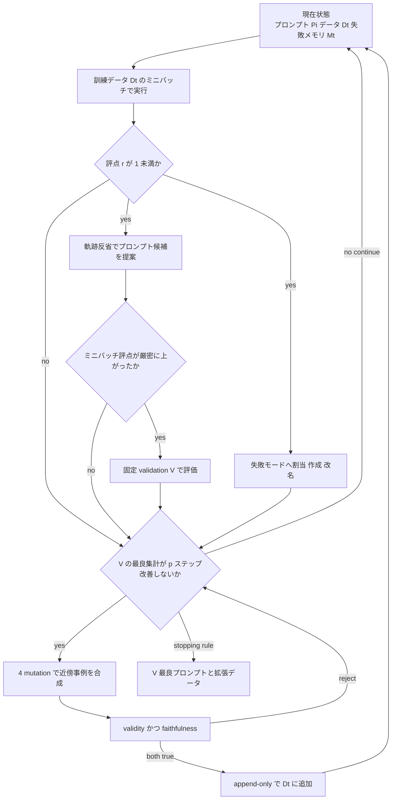

言語モデルプログラムの自動プロンプト最適化（APO）は、多くの場合、訓練データを固定したまま指示だけを改訂します。南京大学の Tianyu Yuan と Zhuzhong Qian（責任著者）は、各失敗実行を二重信号とみなし、プロンプト改訂と不足している訓練証拠の合成を同時に進める枠組み Forge を提案します。論文は [arXiv:2609.15209v1](https://arxiv.org/abs/2609.15209)（投稿 2026-09-14）です。本稿は arXiv v1 初稿を正本にします。会議採録は確認していません。

この記事では次を整理します。

- Forge が誰に何を渡し、何を渡さないか
- 公開数値をどこまで読んでよいか
- 障害対応を「指示 1 行」で閉じるか、失敗モードと判定セット分離まで進めるか

対象読者は、プロンプト最適化の品質ループを業務の回帰セットへ写すかを判断する発注側です。

*この記事の全体像。以下、順に解説します。*

## Forgeとは

Forge は、プロンプト付きの検索・ツール・中間計算を含む言語モデルプログラムに対する APO の枠組みです。一般的な APO は訓練データを固定したまま指示を改訂します。Forge は失敗実行を再利用可能な失敗モードへ抽象し、positive / negative / boundary / stress の 4 種の mutation で近傍事例を作ります。別エージェントの verifier が validity と faithfulness の両方を満たした事例だけを訓練集合へ追加します。本文表記は Forge です。

特徴は次です。

- 訓練データを APO の可変状態として扱います。追加は append-only で、既存事例は削除・改変しません
- 最終プロンプトの選択目的は固定の validation 集合です。test は報告専用です
- 失敗メモリは実体名を捨て、メカニズム記述と支持実行を対にします。例として AppWorld の Spotify と Venmo を *incomplete paginated search* にまとめます
- 4 mutation は「同じ技能の別実体」「適用してはいけない対比」「条件 1 つの反転」「妨害下での維持」を分担します
- プロンプト探索のバックボーンは GEPA 風の軌跡反省と Pareto 親選択です
- 合成は validation の最良 aggregate が p ステップ（既定 15）改善しないときに起動します
- Generator / verifier / failure assigner は、論文の主実験では GPT-5.5 を使います

役割の境界は次です。プロンプト枝はモデル重みと validation / test の事例を動かしません。失敗メモリは既存訓練事例の中身を書き換えません。Generator は最終判定用の V / T を使いません。Verifier は親プロンプトの採否を決めません。

| 要素 | 入力 | 出すもの | 動かさないもの |
|---|---|---|---|
| Prompt branch | 不完全実行の trace / feedback | 改訂プロンプト候補 | モデル重み、V と T の事例 |
| Failure memory | 同じ不完全実行 | モード記述 + 支持実行 | 既存訓練事例の中身 |
| Generator | モード + 支持実行 + mutation intent | 合成候補 | 最終判定用の V / T |
| Verifier | 候補 + タスク signature | validity と faithfulness の真偽 | 親プロンプトの採否 |

探索と合成の流れは次です。ミニバッチ実行で評点が 1 未満なら、軌跡反省でプロンプト候補を出し、同時に失敗モードへ割り当てます。候補のミニバッチ評点が厳密に上がったときだけ、固定の validation V で評価します。V の最良集計が p ステップ改善しないときに合成が起動します。

## 注意点

出典は 2026-09-14 の arXiv v1 です。abs に Journal-ref / 会議名はなく、DataCite DOI は arXiv 発行（pending registration）です。査読済み成果としては扱いません。

「8 ベンチで Baseline を 16.52 ポイント上回る」は Table 1 の 8 指標の単純平均です。各ベンチ % の unweighted mean で、Forge 72.18、Baseline 55.66 です。標準誤差・複数 seed は主表にありません。

「評価した全 APO ベースラインを上回る」は aggregate の話です。ベンチ単位では 8 中 6 勝です。IFBench は Ace 61.63 対 Forge 54.52 です。MMLU-Pro は MiproV2 / Gepa 90.00 対 Forge 89.00 です。

「4.92 から 8.82 ポイント」は Qwen3.5-35B-A3B で Ace（67.26）と MiproV2（63.36）との aggregate 差です。

合成 admission 73% から 98% は「品質が高い」ではなく、Figure 3 の admitted / attempts です。AppWorld は 39/40 です。Appendix C.3 は掲載カードを独立した人間 correctness audit ではないと書きます。

Generator と verifier と failure assigner はいずれも GPT-5.5 です（Appendix B.3）。ツール無しの AIME / MMLU-Pro は外部 lookup を持ちません。AppWorld の verification は独立 read-only ではありません（Appendix B.2）。

探索予算の揃え方は task-program evaluation の天井です（Appendix B.4）。論文が挙げる不一致は、GEPA の iteration 境界での超過、MIPROv2 の提案段階呼び出しが見積から除外されること、ACE の native 規則による早期停止です。生成・検証は optimizer 側エージェントなので、この天井の定義には入りません。

HotPotQA の test は公式 fullwiki training の先頭 40% から 100 件です。MMLU-Pro の train/test は公式 test から相互排他サンプルです（Appendix B.1 Table 5）。公式 held-out の見本にはなっていません。

同名の別論文があります。エージェント記憶 FORGE（[arXiv:2605.16233](https://arxiv.org/abs/2605.16233)）、分子 FORGE、勾配 FORGE です。本稿は 2609.15209 のみを指します。論文本文・abs に公式コード URL はありません。2026-09-16 の GitHub 検索でも著者実装は見つかりませんでした。後出しの可能性は残ります。

## 固定データAPOはどこで偏るか

論文の定式化は次のとおりです。

1. APO は minibatch を \(D_0\) から引き、失敗した実行だけを言語フィードバックにします
2. プロンプトが変わっても \(D_t = D_0\) なら、近くて未観測の失敗条件は出てこない
3. スコアが頭打ちになったとき、「指示の改訂が尽きた」のか「データが失敗を出さなくなった」のかを区別できません

Forge の答えは、失敗モードを合成の単位にし、検証済み事例を探索用データへ戻すことです。validation 目的 \(J_V\) は変えません。合成源に V を使わない、というのが論文内の分離規則です。

現場への写像は、障害 1 件に対して指示を 1 行足すのではなく、同じメカニズムが別入力で再現するケースと、そのヒューリスティックが適用されてはいけないケースをセットで残すことです。

主比較のタスクモデルは Qwen3.5-35B-A3B、追加比較は Qwen3-8B です。optimizer は GPT-5.5（medium reasoning）です。比較相手は未最適化 Baseline、MiproV2、Ace、Gepa です。8 ベンチは HotPotQA、IFBench、HoVer、FiNER-139、LawBench、AIME-2025、MMLU-Pro、AppWorld です。合成事例の転移実験は HotPotQA / FiNER-139 / LawBench で、他 APO 3 手法と GRPO に同じ予算で渡します。

## 公開数値をどこまで読んでよいか

Table 1 は Qwen3.5-35B-A3B の test % です。Forge の aggregate は 72.18 で Baseline から +16.52 です。最強競合 Ace の 67.26 からは +4.92 です。勝ちは 8 中 6 です。IFBench と MMLU-Pro では他手法が上です。

| Method | HotPotQA | IFBench | HoVer | FiNER-139 | LawBench | AIME-2025 | MMLU-Pro | AppWorld | Aggregate | Δ vs Baseline |
|---|---|---|---|---|---|---|---|---|---|---|
| Baseline | 52.00 | 31.29 | 45.00 | 56.00 | 34.00 | 73.33 | 87.00 | 66.64 | 55.66 | - |
| MiproV2 | 68.00 | 48.64 | 52.00 | 67.00 | 38.00 | 75.56 | **90.00** | 67.67 | 63.36 | +7.70 |
| Ace | 70.00 | **61.63** | 55.00 | 69.00 | 54.00 | 71.11 | 83.00 | 74.33 | 67.26 | +11.60 |
| Gepa | 66.00 | 48.64 | 51.00 | 68.00 | 50.00 | 77.78 | **90.00** | 71.21 | 65.33 | +9.67 |
| Forge | **76.00** | 54.52 | **60.00** | **74.00** | **57.00** | **82.22** | 89.00 | **84.69** | **72.18** | **+16.52** |

Table 2 は累積 ablation の 8 ベンチ平均です。ランダム合成はプロンプト探索単独より悪化します。失敗メモリと mutation を足すと 72.18 まで戻ります。Δ は条件付き寄与であり、独立主効果ではありません。

| Variant | Score | Δ vs 前行 |
|---|---|---|
| Baseline | 55.66 | - |
| + Prompt search | 64.17 | +8.51 |
| + Random synthesis | 62.38 | −1.79 |
| + Failure memory | 68.24 | +5.86 |
| + Mutation guidance | 72.18 | +3.94 |

Table 3 の Qwen3-8B では、Forge aggregate は 50.97 です。Baseline 36.88 から +14.10、最強競合 Gepa 45.59 から +5.38 です。8 中 6 勝です。負けは IFBench（Ace 38.39 対 Forge 35.81）と LawBench（Ace 37.00 対 Forge 35.00）です。

Table 4 は合成データの転移です。同一予算の test % で、APO 9 対はすべて +2〜9 です。GRPO は step 100 で +8 / +4 / +8 です。合成件数は FiNER 93、HotPotQA 80、LawBench 88（Appendix B.5）です。データ量増加と分布変化は未分離で、結論が future work とします。

| Dataset | Training data | MiproV2 | Ace | Gepa | GRPO |
|---|---|---|---|---|---|
| HotPotQA | Original | 68 | 70 | 66 | 57 |
| HotPotQA | + Forge data | **73** | **73** | **75** | **65** |
| FiNER-139 | Original | 67 | 69 | 68 | 69 |
| FiNER-139 | + Forge data | **70** | **71** | **74** | **73** |
| LawBench | Original | 38 | 54 | 50 | 43 |
| LawBench | + Forge data | **47** | **57** | **55** | **51** |

合成会計（Figure 3）は次です。Admit は AIME 22/30、AppWorld 39/40、HotPotQA 80/100、FiNER-139 93/100 です。Generation 失敗は 10 件で、HotPotQA の無出力 9 と AIME の invalid JSON escape 1 です。malformed は計 11 です。品質拒否は 25 件で、validity only 9、faithfulness only 7、both 9 です。

optimizer を GPT-5.5 以外にしたときの Table 7 は 6 ベンチのみです。平均絶対差 1.66、最大 3.93 です。HTML では行名が欠落しますが、PDF Table 7 に行名があり、GPT-5.5 列は Table 1 の Forge 列と一致します。

## 関連手法との差は何か

Forge のプロンプト枝の祖先は GEPA です。GEPA は軌跡反省と Pareto でプロンプトを動かしますが、データ枝はありません。MiproV2 は instruction と成功トレース由来デモを動かしますが、失敗近傍の新規訓練例は作りません。ACE は evolving playbook / memory で文脈を厚くしますが、データ集合は可変状態にしません。

| 手法 | 動かすもの | 固定するもの | Forge との差 |
|---|---|---|---|
| GEPA | プロンプト（軌跡反省 + Pareto） | 重みと訓練集合 | Forge のプロンプト枝の祖先。データ枝なし |
| MiproV2 | instruction と成功トレース由来デモ | 重みと与えられた trainset | 失敗近傍の新規訓練例は作らない |
| ACE | evolving playbook / memory | 重み | 文脈を厚くする。データ集合は可変状態にしない |
| PromptWizard | instruction と ICL 例 | 重み | 合成例はプロンプトに載る |
| SIPDO | 難易度付き合成例でプロンプトを攻める | 重み | 失敗モード抽象と 4 mutation とツール検証は持たない |
| Lee and Kahng 2026 | 生きたテスト集合 + 人が直すプロンプト | 重み | HITL。判定用データの成長であり、訓練合成ではない |
| LLM2LLM / ReverseGen / CoEvolve | 失敗駆動の訓練データまたは重み | プロンプト（典型） | 行き先が重み。離散プロンプト探索との共同ではない |

失敗をモード化し、検証済み近傍事例を探索用データへ戻す設計は、論文内では一貫しています。固定データ APO の頭打ちを「指示不足」と「証拠不足」に分ける問題設定は、現場の品質ループに写せます。ただし本番採用の再現物としては未成熟で、一律の優位は 8 ベンチでは成り立ちません。

支持側の材料は次です。

- 問題定式化が validation を合成源にしません
- 4 mutation が「言い換え増殖」ではなく適用範囲の境界を取る、と論文が例示しています（HotPotQA の alias）
- Table 2 でランダム合成は害、失敗メモリと mutation は条件付きで効きます
- Table 4 で合成事例が Forge 以外の探索にも効きます（少なくとも 3 ベンチ、論文内）
- Appendix D.2 は val/test との意味的同値マッチを Codex + 10% 人手で見つからなかったと報告します

反証側の材料は次です。

- 未査読です。公式実装 URL はありません。2026-09-16 時点の公開検索では独立再現・批評を確認できませんでした
- 8 中 6 勝です。命令追従（IFBench）では Ace が上です
- ランダム合成は害です。assigner が外れると本番は Table 2 の悪化条件に近づきます
- verifier は独立監査ではありません。同一 GPT-5.5 です。AppWorld は authoring service を生成と検証の両方に渡します
- HotPotQA / MMLU-Pro の split は公式 held-out の見本になっていません
- transfer は 3 ベンチです。サイズ効果は未分離です
- D.2 の人手は 10% サンプルです。match 定義は意味的同値であり、メカニズム類似は除外します

未解決の問いは次です。

- 会議採録の有無（一次の proceedings 未確認）
- 公式コードとハイパーパラメータ一式の公開時期
- 複数 seed / 信頼区間
- 人間による合成ラベルの全数監査
- verifier を別モデル・別ツールパスにしたときの admission と最終スコア
- 公式テストセット上での再測定（特に HotPotQA と MMLU-Pro）
- 合成件数を揃えたサイズ対照
- 業務タスクで失敗モードが安定してクラスタできるか

## 現場で今やってよいこと

意思決定の文脈は次です。本番の品質判定から改善を続けると、既知失敗に評価が偏ります。指示追記だけでよいか、合成近傍と判定データの分離が要るか、が分岐です。

今やってよいことは次です。

1. **障害対応の記録単位を「指示 1 行」から「失敗モード」に変える。** 同じ原因が別入力で起きるケースと、その修正を適用してはいけないケースを 1 セットにします。positive と negative に相当します
2. **改善用コーパスと最終判定用セットを物理的に分ける。** 判定セットには合成例を入れません。論文の \(V\) が合成源にならない規則を、業務の回帰セットへ写します
3. **合成ラベルは人間または独立ツールで確認してから探索へ戻す。** 論文の verifier をそのまま信頼しません。C.3 と B.2 が理由です

今やらないことは次です。

- Forge を査読済み・再現可能な標準 APO として本番の単一最適化器に据える
- 失敗類型なしの合成増強（Table 2 の random synthesis）
- ニュース稿の「FORGE」を、別 arXiv の同名手法と同一視する

逆転条件は次です。

- 公式コードが出て、独立再現が Table 1 の方向を支持しない
- 対象タスクが IFBench 型の制約充足で、Ace 系の playbook の方が安定する
- 合成の gold を独立確認できない（ツール無し、環境の書き込み検証が閉じられない）
- 判定セットが改善ループに混入している

採用するなら、測った範囲に合わせて次を固定します。指示追記だけで閉じず、失敗モード単位で近傍事例を残す。判定セットは合成源にしない。合成ラベルは独立確認してから探索へ戻す。Forge 本体は、公式実装と独立再現が出るまで単一最適化器にはしません。

## まとめ

Forge は、失敗実行を失敗モードへ抽象し、プロンプト改訂と検証済み近傍事例の append-only 追加を同時に進める APO です。Qwen3.5-35B-A3B の 8 ベンチ平均では Baseline から +16.52、Ace から +4.92 です。ベンチ単位では 8 中 6 勝で、IFBench では Ace が上です。ランダム合成は害で、失敗メモリと mutation を外すと悪化します。verifier は同一 GPT-5.5 であり、独立監査ではありません。公式コードは 2026-09-16 時点で確認できません。

現場で写せる核は、指示 1 行の追記ではなく失敗モード単位の記録と、改善用コーパスと最終判定セットの分離です。合成ラベルは人間または独立ツールで確認してから探索へ戻します。Forge を査読済みの標準最適化器として据える判断は、公式実装と独立再現を待つのが妥当です。

この記事が少しでも参考になった、あるいは改善点などがあれば、ぜひリアクションやコメント、SNSでのシェアをいただけると励みになります！

## 参考リンク

1. Yuan, T.; Qian, Z. Failure-Guided Co-Evolution of Prompts and Training Data. arXiv:2609.15209v1, 2026-09-14. https://arxiv.org/abs/2609.15209
2. HTML. https://arxiv.org/html/2609.15209v1
3. PDF. https://arxiv.org/pdf/2609.15209
4. DOI 10.48550/arXiv.2609.15209. https://doi.org/10.48550/arXiv.2609.15209
5. GEPA. OpenReview. https://openreview.net/forum?id=RQm2KQTM5r
6. MIPROv2. EMNLP 2024. https://aclanthology.org/2024.emnlp-main.525/
7. Data-Prompt Co-Evolution. CHI 2026. https://doi.org/10.1145/3772318.3791222
8. ReverseGen. OpenReview. https://openreview.net/forum?id=yitH9xAHQs
9. 同名別論文 FORGE（エージェント記憶）. arXiv:2605.16233. https://arxiv.org/abs/2605.16233
