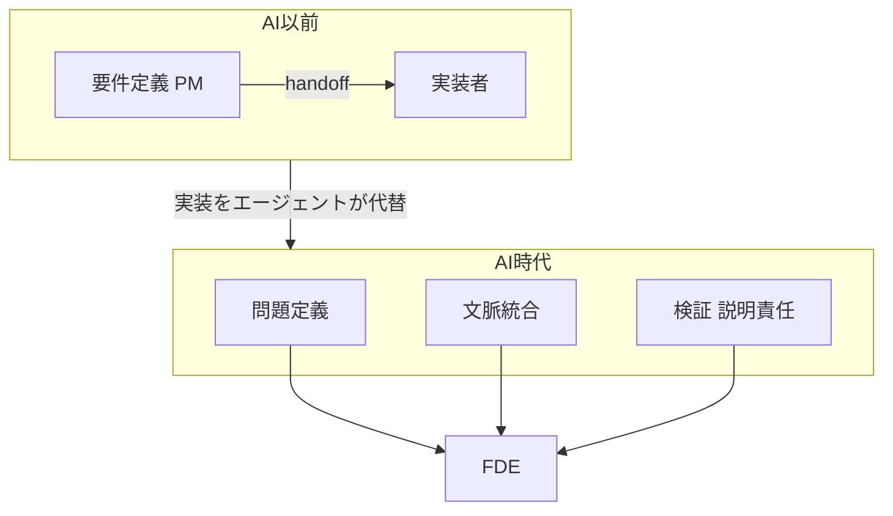

## 概要

Forward Deployed Engineer（FDE）は、顧客の業務・組織・社内システムに深く入り込み、課題発見から要件定義・実装・本番稼働までを一気通貫で担う実装者ロールです。起点となった日経クロステックの記事（2026年6月22日）は、FDE を「顧客の業務や組織、社内システムを深く理解して課題を明確にし、解決するためのシステムを実装するエンジニア」と定義しています。

このロール自体に新しさはありません。Palantir が2010年代初頭に内部名「Delta」として確立したものです（公式エンジニアリングブログ、2020年11月2日）。2025年から2026年にかけて再注目されている背景には、ある構造変化があります。生成AI（コーディングエージェント）が実装作業をコモディティ化した結果、希少資源が「コードを書く力」から次の3つへ移りました。

1. 何を作るかという問題定義
2. 顧客文脈の統合
3. 検証と説明責任の保持

FDE は、この移動した重心を顧客の現場で一身に背負う「人格化された最小単位」として語られています。

ただし本記事は FDE を礼賛しません。後半の反証で示すとおり、「要件定義者と実装者の分離が弱まる」「少数の実装責任者で組織が回る」という主張には有力な反証があります。確からしいのは「顧客文脈と問題定義と検証を兼ねる人材の価値が上がる」までで、その先の組織論は条件付きです。

## FDE を分かつ5つの特徴

FDE を従来の実装者・コンサル・ソリューションアーキテクト（SA）から分かつ本質的な特徴は、次の5点に集約されます。

| 特徴 | 説明 |
|---|---|
| 顧客業務文脈への embed | 定義の中核が顧客への直接の embed。25〜50%の現地 travel と顧客本番環境での実装。Palantir 由来の対比では「多機能×1顧客」の最適化 |
| プロダクトへの還元 | コンサルが提言を納品して離脱するのに対し、FDE は本番稼働まで残り、デプロイの摩擦や機能ギャップを Product や Research へフィードバックしてロードマップを動かす |
| 現場の曖昧さの吸収 | 顧客がスコープで述べる内容と現場のデータやシステムの実態の食い違いを引き受ける。匿名化データでオフラインに MVP を作る SA と区別される |
| end-to-end オーナーシップ | discovery から technical scoping、system design、build、production rollout までを一人または小チームで所有する |
| AI時代特有のスキル | prompt engineering や agent development、evaluation frameworks に加え、MCP servers・sub-agents・agent skills を本番ワークフロー向けに作る能力 |

「多機能×1顧客」は Palantir 公式ブログ由来の対比です。従来のソフトウェアエンジニア（Dev）が「1機能×多顧客」に集中するのに対し、FDE は「多機能×1顧客」に振ります。

### 各社の運用

名称は分岐しますが、本質は同一です。

| 企業 | 名称 | 特記事項 |
|---|---|---|
| Palantir | Forward Deployed (Software) Engineer / Delta | 起源。2016年頃には FDE 数が通常のエンジニア数を上回る[二次情報] |
| OpenAI | Forward Deployed Engineer | チーム発足は2024年後半。discovery から rollout を所有、travel 約50%（公式文言） |
| Anthropic | Forward Deployed Engineer, Applied AI | 求人原文で base 20万〜30万ドル、travel 25〜50%、成果物に MCP・sub-agents・skills を明記（一次） |
| Google | FDE（DeepMind / Cloud GenAI） | I・II・IV のラダー化。Cloud は顧客環境で bespoke な agentic solutions を ship（公式文言の媒体引用） |

なお openai.com と Google Careers の求人本文は Cloudflare や JS でブロックされ、直接取得できませんでした。OpenAI は公式スニペットと公式文言を引用した媒体記事から、Google は媒体引用から復元しています。Anthropic のみ Greenhouse フィード経由で全文取得でき、実質一次です。

## 概念構造

### 価値の重心移動

| 要素名 | 説明 |
|---|---|
| 要件定義 PM | AI以前に仕様を書く役割 |
| 実装者 | AI以前にコードを書く役割。両者は handoff で分断 |
| 問題定義 | AI時代に希少化する上流。何を作るかの判断 |
| 文脈統合 | 顧客業務や現場データの統合 |
| 検証 説明責任 | 出力の妥当性確認と、人に残る責任 |
| FDE | 移動した重心を顧客現場で一身に背負う最小単位 |

価値シフトの論拠は、複数の独立ソースで一致します。

- a16z の Joe Schmidt（2025年6月4日、一次）は「Software is no longer aiding the worker — software **is** the worker」と述べます。ソフトが労働者になると、価値の焦点は実装速度ではなく問題解決とデータ所有へ移ります。
- Addy Osmani（2026年1月28日、一次）は「成功する開発者は時間の70%を問題定義と検証戦略に、30%を実行に使う」と報告します。
- Picnic の Tech Lead である Alex Sasnouskikh（2026年6月5日）は「コーディングはボトルネックだったことがない。ボトルネックは『何をするか』であって『どうやるか』ではない」と語ります。

### 仕様の受け渡しをめぐる主張

FDE 推進側の核心主張は、一人が問題を深く理解し同時に実装することで、仕様の受け渡し（handoff）を消す点にあります（PostHog の Jina Yoon、2026年2月11日）。従来の「PM が仕様を書き、実装者が作る」handoff には、翻訳ロスと、現場の曖昧さの押し付け合いが内在します。AI が実装を担うと、ボトルネックは正確な意図の articulation へ移ります。それは顧客現場の文脈を背負う人が一体で担うのが効率的だ、という論理です。

ただし、この主張は本記事で最も争点が多い部分です（後述の反証1・3・4を参照）。Spec-Driven Development（SDD）の潮流が示すのは、「分離が消える」ではなく「仕様という真実の源を握る側に価値が集約し、その人がそのまま実装（エージェント指揮）も担う」という再編です。検証や承認の分離まで消えるわけではありません。

### 少数の実装責任者とエージェント群

組織構造論の核心は、レバレッジが人数ではなく判断力に比例するという命題です。

- Karim Fanous（2026年6月4日、一次）は「エージェントは全員を等しく生産的にしない。どこに向けるか分かる人を不均等に利する」と述べます。現状の「アンカーエンジニア1人＝1スクワッド」が、agentic org では「1人＝3スクワッド」になりうると説きます。同時に「Context still has gravity」と、無限のレバレッジは否定します。
- Sam Altman（一次）は、AIエージェントを「比較的ジュニアな従業員のチーム」のように扱い、人の仕事は「エージェント群に仕事を割り当て、品質を見て、どう噛み合うか考え、フィードバックする」ことになると語ります。

FDE は、この組織モデルの最小単位として位置づけられます。一人で顧客文脈を背負い、エージェント群を指揮する実装責任者という像です。

### 日本の文脈での語り口

日本語圏では、FDE が客先常駐（SES）との対比で語られるのが特徴です。日経が半年で3本 FDE を扱い、2025年末から2026年前半が日本メディアでのバズ立ち上がり期にあたります。

| 観点 | FDE | 従来型 SES（客先常駐） |
|---|---|---|
| 工程 | 上流（課題定義）に強み | 下流（実装・テスト） |
| ビジネスモデル | 知識集約・少数精鋭・成果を売る | 労働集約・人月を売る |
| 軸足 | 自社プロダクトを軸に顧客へ張り付く | 顧客要件を軸にする |
| フィードバックループ | 社内プロダクトへ還元する | 持たない |

日本企業も実際に FDE 職を新設し始めています（LayerX・Loglass・ソフトバンク・AI Shift など）。AI Shift は DX白書2025 の「思考と実行を高いレベルで繰り返せる人材が不足」という課題を設立背景に引用し、KPI を Time-to-first outcome（顧客が最初に価値を感じるまでの時間）に置きます。日本語の固定訳は未定着で、多くの先行企業は「Forward Deployed Engineer / FDE」を英語のまま職種名に採用しています。

## 反証 — どこまで信じてよいか

暫定結論「FDE の価値が上がり、分離が弱まり、少数の実装責任者とエージェント群が現実的になる」を構成要素ごとに検証すると、後半2つは反証が強くなります。

### 反証1: 実装はそもそもボトルネックではない（最有力）

Agoda の観測（InfoQ、2026年3月、本文取得済み）では、AI 導入の velocity gain は「驚くほど控えめ。コーディングは元々ボトルネックではなかったから」とされます。ボトルネックは仕様と検証という、人の判断を要する上流へ移りました。テレメトリの逆説として、高 AI 採用チームは PR を98%多くマージした一方で、レビュー時間が91%増えました。「少数の実装者とエージェント」だけでは検証が詰まります。この反証は「実装作業の価値が下がる」を示すため、結論のうち「実装者の価値が上がる」部分が最も脆くなります。ただし FDE を「顧客文脈と判断を兼ねる人」と定義すれば judgment 重視と整合し、価値上昇は否定されません。

### 反証2: 採用難・高アトリション・属人化でスケールしない

production コードを書け、かつ組織政治を捌ける人材は希少で、訓練も困難です。productization gate と handoff 規律がないと、「3人の機能が、出荷したものすべての保守に縛られ、新規案件を取れなくなる」trapped function に陥ります[二次情報、Perspective AI playbook]。「価値が上がる」と「スケールする」は別物です。なお FDE の離職率や在籍年数の一次定量データは見つからず、バーンアウトの言及は二次の定性に留まります。

### 反証3: 職務分掌（SoD）は AI 時代も規制で強制される

「1人が定義・実装・承認・本番反映まで end-to-end」は、SOX 等の規制業種では職務分掌違反になります。変更を要求する人と承認する人は分離が要求されます。AI が key-person 依存を「工業化」するほど、bus factor 1 の単一障害点リスクはむしろ増幅します。少なくとも規制業種や大規模組織では分離が残り、検証の重要度が上がる反証1とも整合します。

### 反証4: コンサルのリブランドにすぎないという批判

「embedding technical staff onsite is nothing new — it's essentially consultant DNA rebranded」（Tom Tan、本文取得済み）という指摘があります。Palantir は2011年に solutions engineer や integration engineer に新しい肩書きを与え、採用上の moat を作ったという title arbitrage 説もあります。Hacker News では「Solutions Architect の名前を変えただけ」と辛辣です。日本でも「成果コミット対労働力提供」の differentiation が成立するのはプロダクトを持つ企業に限るため、受託の大半では FDE 化が名前だけになり、構造変化は起きません。

### 反証5: Palantir モデルは margin を毀損し他社で再現困難

追い風とされる a16z 論考自体が、題名どおり「Margin を Moat と交換する」ことを認めています。ServiceNow（IPO 時の gross margin 63.2%）や Workday（54.1%）を例に、初期はカスタマイズで粗利が下がり、burn rate が上がると明言します。バーンレート上昇を許容できない企業や市場局面では、FDE 偏重が経営的に不合理になりえます。

### 反証の総括

| 結論の構成要素 | 反証の効き | 主な根拠 |
|---|---|---|
| FDE 型人材の価値が上がる | 中 | 価値は raw coding でなく上流 judgment へ移る |
| 要件定義者と実装者の分離が弱まる | 強 | 検証が新ボトルネック、SoD は規制で強制、リブランド批判 |
| 少数の実装責任者で回る | 強 | 採用難・属人化・bus factor 1・margin 毀損 |

最も粘る主張は「FDE 型人材の価値そのものは上がる」です。最も脆いのは「分離が弱まる」と「少数の実装責任者でスケールする」です。productization gate と handoff 規律の有無が、FDE モデルを「複利の効くプロダクト」と「スケールしない受託」に分ける分水嶺になります。

## 自分の役割設計への示唆

実装エンジニアや PM が、自分の役割設計に落とし込むときの指針です。

1. コードを書く力より、何を作るか・現場の曖昧さを構造化する力・検証する力に投資する。AI が実装を担うほど、ここが差別化要因になる
2. handoff を消す方向に動く。仕様を書く側と作る側を分けず、顧客文脈を背負ったまま実装まで一気通貫で持つ。ただし検証と承認は意図的に分離して残す
3. 属人化を warning sign として扱う。「出荷物すべての保守に縛られて新規に動けない」状態は trapped function のサイン。productization と handoff 規律をセットで設計する
4. エージェントをジュニア従業員チームとして扱う運用に慣れる。MCP servers・sub-agents・agent skills を本番ワークフロー向けの成果物として作れることが、AI時代 FDE の具体スキルになる

## 未解決の問い

- FDE の離職率や平均在籍年数の一次データ（バーンアウト仮説の定量的裏付け）
- 「仕様を握る実装責任者とエージェント」モデルが、規制業種の職務分掌とどう両立するか
- 日本の受託や SES 業界が、人月モデルを脱して FDE 的な成果売りへ移行する現実的な組織設計

## まとめ

FDE は新しい流行職ではなく、生成AIが実装をコモディティ化した結果、希少資源が「コードを書く力」から「問題定義・顧客文脈の統合・検証」へ移ったことの人格化です。確からしいのは「この3つを兼ねる人材の価値が上がる」までで、「分離が消える」「少数で回る」には強い反証があります。

この記事が少しでも参考になった、あるいは改善点などがあれば、ぜひリアクションやコメント、SNSでのシェアをいただけると励みになります！

## 参考リンク

- 公式ドキュメント・本人発信
  - [A Day in the Life of a Palantir Forward Deployed Software Engineer](https://blog.palantir.com/a-day-in-the-life-of-a-palantir-forward-deployed-software-engineer-45ef2de257b1)
  - [Forward Deployed Engineer, Applied AI（Anthropic 求人）](https://job-boards.greenhouse.io/anthropic/jobs/4985877008)
  - [OpenAI Careers（FDE 検索）](https://openai.com/careers/search/?q=forward+deployed+engineer)
  - [Trading Margin for Moat（a16z, Joe Schmidt）](https://a16z.com/services-led-growth/)
  - [The 80% Problem in Agentic Coding（Addy Osmani）](https://addyo.substack.com/p/the-80-problem-in-agentic-coding)
  - [Software's AI leverage: Small teams, strong anchors（Karim Fanous）](https://www.cummulative.io/p/softwares-ai-leverage-small-teams)
  - [Reflections on Palantir（Nabeel Qureshi）](https://nabeelqu.substack.com/p/reflections-on-palantir)
- 記事・解説
  - [FDE（フォワード・デプロイド・エンジニア）（日経クロステック）](https://xtech.nikkei.com/atcl/nxt/mag/nc/18/020600009/061200225/)
  - [Forward Deployed Engineers（The Pragmatic Engineer）](https://newsletter.pragmaticengineer.com/p/forward-deployed-engineers)
  - [WTF is a forward deployed engineer?（PostHog）](https://posthog.com/blog/forward-deployed-engineer)
  - [What is a Forward Deployed Engineer（MarkTechPost）](https://www.marktechpost.com/2026/05/20/what-is-a-forward-deployed-engineer-the-ai-role-openai-anthropic-and-google-are-hiring-in-2026/)
  - [Forward Deployed Engineer（FDE）職はじめました（AI Shift）](https://www.ai-shift.co.jp/techblog/6585)
  - [SIerの日本型FDE の最適なあり方を考えてみる（佐々木真）](https://note.com/shin_sasaki/n/n859daecafd76)
  - [AI Agent の時代になぜ Forward Deployed Engineer が注目されるのか（Zenn）](https://zenn.dev/haruki1999/articles/5f74affbf0f12e)
- 反証・批判
  - [coding was never the real bottleneck（InfoQ / Agoda）](https://www.infoq.com/news/2026/03/agoda-ai-code-bottleneck/)
  - [FDE in AI Era: A Rebranding of the Old Consulting Trope（Tom Tan）](https://medium.com/@taotan/fde-in-ai-era-a-rebranding-of-the-old-consulting-trope-ce87ccb1d042)
  - [Hacker News: Forward Deployed Engineers の議論](https://news.ycombinator.com/item?id=47951082)
  - [The FDE Playbook（Perspective AI）](https://getperspective.ai/blog/the-forward-deployed-engineer-playbook-how-to-structure-run-and-scale-an-fde-function-in-2026)
  - [Separation of duties（Wikipedia）](https://en.wikipedia.org/wiki/Separation_of_duties)
