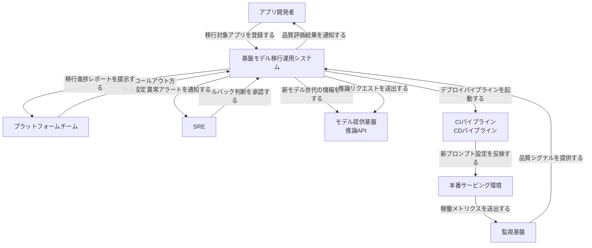
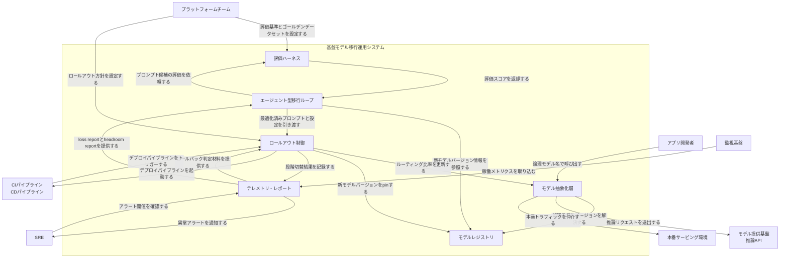
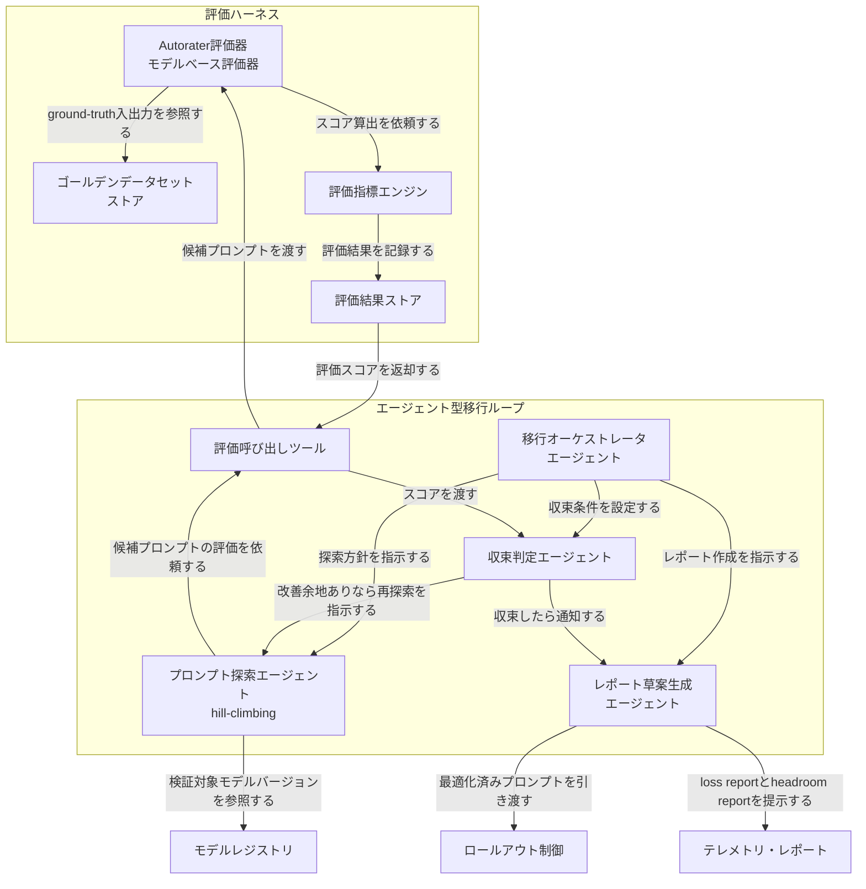
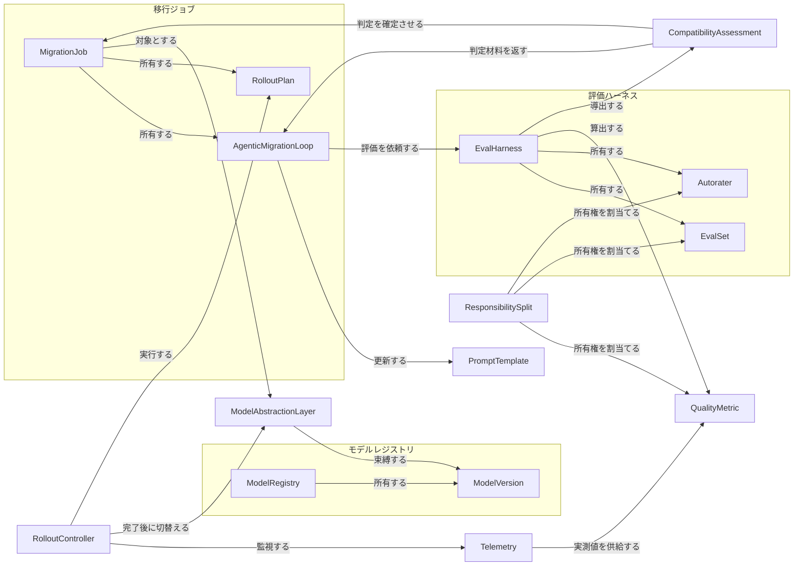
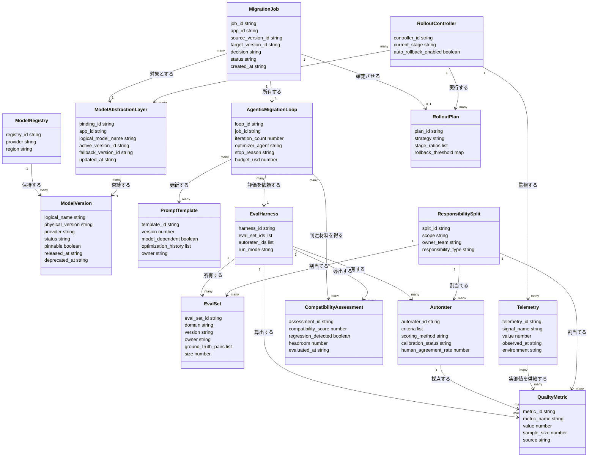
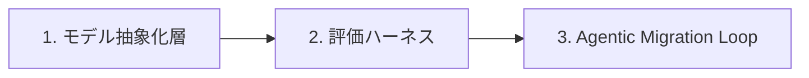
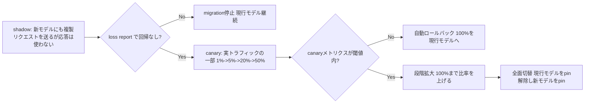

基盤モデル（LLM / foundation model）が頻繁に更新される環境で、既存アプリケーションを新モデルへ継続的に移行し続けるための**運用方法論**を、構造・データ・構築・利用・運用の観点で整理します。起点は Google Cloud のブログ "Lessons in accelerating foundation model upgrades" です。同ブログは Autorater（モデルベース評価）・エージェント型プロンプト最適化ループ・オーケストレーション自動化を核に据えています。特定製品の解説ではなく、一般的な LLMOps（eval-driven development、LLM-as-a-judge、プロンプトバージョニング、モデル抽象化、canary/shadow デプロイ、ロールバック）で補完した移行運用モデルとして扱います。

> **本ドキュメントの性質（Pattern B: 方法論）**: 起点ブログは方法論を述べるのみで実装コードを示していません。以下のコード例・データモデル・ロールアウト詳細は公式ドキュメント（Vertex AI Gen AI Evaluation Service、Agent Development Kit、Vertex AI モデルバージョニング）と一般的ベストプラクティスから補完した**実装案**です。各所で「ブログの主張」と「補完」を区別して注記します。

## 概要

### 解く課題

基盤モデル（LLM）は更新頻度が上がり続けています。起点ブログによると、Google は 2023 年以降だけで 6 回の主要なモデル世代交代を発表し、現行は Gemini 3.5 です。

> "since 2023, we've announced six major model evolutions, bringing us to Gemini 3.5 today."

モデル更新のたびに、既存アプリケーションは新モデルでの品質再検証が必要です。従来はこの再検証が人手の手作業でした。

> "For most engineering teams, upgrading to a new model checkpoint means months of manual toil to verify performance."

つまり、案件ごとに人手でテスト・品質証明・レスポンス評価を繰り返す構造が、リリース速度と品質確保の共通ボトルネックになっています。Google Cloud Applied ML チームは、これをエージェント型ワークフローで「月単位から時間単位」へ短縮したと述べています。

> "our team built an agentic workflow that completes model upgrades in hours instead of months."

「基盤モデル更新の継続運用・移行運用モデル」は、この個別の職人芸的な再検証を、評価とプロンプト最適化を仕組み化した継続運用プロセスへ置き換えるアプローチです。

### 位置づけ

これは特定の製品ではなく、モデル更新が頻発する環境で既存アプリケーションを新モデルへ継続的に移行し続けるための運用方法論です。起点は Google Cloud Applied ML チームの実践知ですが、内容は特定ベンダーに閉じず、一般的な LLMOps とも整合します。

### 起点ブログの 3 つの教訓

Google Cloud Applied ML チームは、モデル移行を高速化するツールを 3 段階で作り直しています。

| 段階 | 教訓 | 内容 |
|---|---|---|
| 1 | ハンズオンな発見から始める | エンジニアが実際のプロダクトチームと個別の移行案件に密着し、複雑な要件を洗い出してプロンプト最適化の初期ガイドラインを作った |
| 2 | 従来型の硬直的な自動化の罠 | ガイドラインを標準化された自動ワークフローにした。初期の成果は出たが、データ形式やエッジケースの多様性に対して硬直的すぎることが判明した |
| 3 | 柔軟なエージェント型アーキテクチャへの転換 | 固定プロセスを強制する代わりに、エージェントがプロジェクトごとの事情に適応し、データ分析とプロンプトテストを動的に行う構成に作り替えた。ここで初めて本質的な進捗が出た |

この 3 段階は、「硬直的な自動化」と「柔軟なエージェント型自動化」が対立概念であることを示しています。段階を飛ばして最初からエージェント型に着手するのではなく、ハンズオンの発見を土台にした点が実務上のポイントです。

### 類似アプローチとの比較

モデル移行の運用は、大きく 3 つのアプローチに分かれます。

| 比較項目 | 手動レビュー中心の移行 | 硬直的な定型自動化 | エージェント型の柔軟な移行運用モデル |
|---|---|---|---|
| データ形式・エッジケースへの適応 | 人間が都度判断するため適応できるが遅い | 想定外の形式・エッジケースに弱い（起点ブログが明示） | エージェントが動的にデータを分析し適応する |
| 再検証コスト | 高い（案件ごとに人手でレビュー） | 中程度（定型処理は速いが例外対応で人手が戻る） | 低い（Autorater 評価 + 自動プロンプト最適化） |
| リリース速度 | 遅い（月単位） | 速いが例外時に停滞 | 速い（起点ブログでは「月単位」から「時間単位」への短縮を主張） |
| スケール性 | 低い（レビュアー人数に律速） | 中程度（定型ケースのみスケール） | 高い（評価・最適化ループ自体が自動化） |
| 必要な人的関与 | 全工程で高い | 初期設計時に高く、例外対応で再び高くなる | 初期ガイドライン策定・ground-truth 整備・最終承認に限定 |

## 特徴

- **Autorater によるスケール評価**: 人間のレビューをモデルベースの自動評価器（Autorater）に置き換え、新チェックポイントの品質を大規模かつ短時間で評価します。起点ブログは "Deploy Autoraters: Pivot from manual human review to model-based Autoraters to evaluate the quality of a new checkpoint at scale and in a fraction of the time" と表現しています。一般的な LLMOps 用語では LLM-as-a-judge に相当します。
- **agentic loop によるプロンプト自動最適化（hill-climbing）**: ground-truth データセットとベースラインプロンプトをエージェントに与えると、エージェントがプロンプト品質を自律的に「hill-climb」（段階的に登り詰めるように改善）します。
- **モデル名を直接埋め込まない抽象化**: アプリのロジックやプロンプトにモデル名・モデル固有の呼び出し形式を直接書き込まず、モデルとプロンプトの組を交換可能な独立した単位として扱います。一般的な LLMOps ではこの単位を "prompted model component" と呼びます。
- **互換性評価・段階切替・ロールバックの標準移行路**: 新モデルの出力品質を評価してから段階的に切り替え、問題があれば前バージョンへ戻す流れを標準化します（canary リリース・自動ロールバック判定をモデル移行に適用した一般的ベストプラクティス）。
- **モデル固有テストと業務成果テストの分離**: 「新モデルが技術的に動くか」の検証と、「業務上求められる成果を満たすか」の検証を分けて扱います。起点ブログの動画翻訳・吹き替えサービスの実例は、この分離が効いた事例です。
- **評価資産（ground-truth データセット・プロンプト資産）の再利用**: 一度整備した評価データセットや baseline プロンプトを、次のモデル更新でも再利用できる資産として蓄積します。
- **プロンプトのみでのファインチューニング済みモデル代替**: 起点ブログの実例では、動画翻訳・吹き替えサービスが従来ファインチューニング済みモデルを必須としていました（翻訳後テキストを意味を変えず元動画の発話尺に一致させる厳密な制約があったため）。これを最新の汎用基盤モデルへ、プロンプトエンジニアリングのみで移行しました。
  > "Their goal was to migrate to the latest out-of-the-box foundation model, guided purely by prompt engineering. Using this agentic framework, the team provided their ground-truth dataset and baseline prompt. The system autonomously hill-climbed the prompt quality, migrating the service away from the custom stack."

### 起点ブログの主張と補完の区別

| 記述内容 | 区分 |
|---|---|
| Autorater によるモデルベース評価、agentic loop による hill-climbing、3 段階の教訓、動画翻訳・吹き替えサービスの実例、月単位→時間単位の短縮 | 起点ブログ（Google Cloud Applied ML チーム）固有の主張・実例 |
| プロンプトバージョニング、モデル抽象化（prompted model component）、canary/shadow デプロイ、ロールバック戦略、責任分担 | 一般的な LLMOps ベストプラクティスによる補完 |
| LLM-as-a-judge / Autorater という評価手法そのものの一般化された説明 | Vertex AI の judge model ドキュメント等による補完 |

## 構造

基盤モデル更新の継続移行運用を「単一の運用モデル」として扱い、役割と責務の論理構造を C4 の 3 段階で示します。特定企業の実装名ではなく、次の 6 構成要素の語彙に統一します。

| 構成要素 | 役割 |
|---|---|
| モデル抽象化層 | アプリがモデル名を直接埋め込まず、論理モデル名から物理モデルバージョンを解決するゲートウェイ |
| 評価ハーネス | Autorater と ゴールデンデータセットで移行候補の品質を評価する仕組み |
| エージェント型移行ループ | プロンプトを自動最適化するエージェント群 |
| ロールアウト制御 | shadow/canary/段階切替とロールバック判定 |
| テレメトリ・レポート | 品質メトリクスと loss report / headroom report の収集・提示 |
| モデルレジストリ | モデルバージョンの版管理と pin |

### システムコンテキスト図

アプリ開発者・プラットフォームチーム・SRE の 3 アクターが「基盤モデル移行運用システム」を介して、モデル提供基盤・CI/CD・本番サービング・監視基盤という 4 つの外部システムとやり取りする構造です。



| 要素名 | 説明 |
|---|---|
| アプリ開発者 | 基盤モデルを利用するアプリを実装し、移行対象として登録する役割 |
| プラットフォームチーム | 評価基準・ロールアウト方針など移行運用の全社ポリシーを設計する役割 |
| SRE | 本番影響のあるロールアウト・ロールバックの最終承認を行う役割 |
| 基盤モデル移行運用システム | 本調査の対象。モデル更新のたびに評価・最適化・段階切替を自走させる運用システム |
| モデル提供基盤 | 新しい基盤モデルのバージョンと推論APIを提供する外部基盤 |
| CIパイプライン | 最適化済みプロンプトや設定をビルド・検証する外部パイプライン |
| CDパイプライン | 検証済み成果物を本番サービング環境へ配布する外部パイプライン |
| 本番サービング環境 | アプリからの推論リクエストを実際に処理する本番環境 |
| 監視基盤 | 本番サービング環境の稼働状況を収集し外部に提供する基盤 |

### コンテナ図

「基盤モデル移行運用システム」を 6 つの構成要素にドリルダウンします。



#### 基盤モデル移行運用システム 内の構成要素

| 要素名 | 説明 |
|---|---|
| モデル抽象化層 | アプリからの呼び出しを論理モデル名で受け、物理モデルバージョンへ解決して仲介するゲートウェイ |
| 評価ハーネス | Autorater・ゴールデンデータセット・評価指標で移行候補の品質を評価する仕組み |
| エージェント型移行ループ | プロンプトを自動生成・評価・改善するhill-climbing型のエージェント群 |
| ロールアウト制御 | shadow/canary/段階切替を制御し、ロールバックを判定する仕組み |
| テレメトリ・レポート | 品質メトリクス・稼働メトリクスを集約し、loss report/headroom reportとして提示する仕組み |
| モデルレジストリ | 基盤モデルのバージョンを版管理し、稼働バージョンをpinする台帳 |

#### 外部システム / アクター

| 要素名 | 説明 |
|---|---|
| アプリ開発者 | モデル抽象化層を通じてアプリを実装する役割 |
| プラットフォームチーム | 評価基準・ロールアウト方針を設定する役割 |
| SRE | アラートを監視しロールバック承認を行う役割 |
| モデル提供基盤 | 新モデル世代と推論APIを提供する外部基盤 |
| CIパイプライン | 移行成果物をビルド・検証する外部パイプライン |
| CDパイプライン | 検証済み成果物を配布する外部パイプライン |
| 本番サービング環境 | 実際の推論トラフィックを処理する環境 |
| 監視基盤 | 本番の稼働メトリクスを収集する外部基盤 |

### コンポーネント図

評価ハーネスとエージェント型移行ループを内部ドリルダウンします。ここでは ADK・Autorater・ゴールデンデータセットなど具体例を用います。



#### 評価ハーネス 内のコンポーネント

| 要素名 | 説明 |
|---|---|
| Autorater評価器 | モデルベースの評価器。手動レビューに代わり大量の候補を高速に採点する |
| ゴールデンデータセットストア | ground-truth入出力ペアを保持し、評価の基準を提供する |
| 評価指標エンジン | Autoraterの出力を集計し、品質スコア・閾値判定を行う |
| 評価結果ストア | 評価履歴を保持し、移行ループやレポートに結果を提供する |

#### エージェント型移行ループ 内のコンポーネント

| 要素名 | 説明 |
|---|---|
| 移行オーケストレータエージェント | ADKベースでループ全体を制御する親エージェント |
| プロンプト探索エージェント | hill-climbingでプロンプト候補のバリエーションを生成する |
| 評価呼び出しツール | 評価ハーネスを呼び出し評価結果を取得するツール |
| 収束判定エージェント | スコア改善が頭打ちになったことを検知しループ終了を判断する |
| レポート草案生成エージェント | loss report・headroom reportの草案と移行済み設定を出力する |

#### 参照する外部コンテナ

| 要素名 | 説明 |
|---|---|
| モデルレジストリ | プロンプト探索エージェントが検証対象とする新モデルバージョンの参照元 |
| ロールアウト制御 | 収束済みの最適化プロンプトの引き渡し先 |
| テレメトリ・レポート | loss report/headroom reportの提示先 |

## データ

基盤モデルアップグレード運用は「モデルの版管理」「プロンプトの自動最適化」「品質の自動判定」「段階的な本番反映」の 4 つのデータ領域が連動します。起点ブログでは Autorater・エージェント型プロンプト最適化ループ・オーケストレーション自動化の 3 要素のみが具体的に語られており、モデルレジストリの版管理・ロールアウト制御・責任分担・テレメトリの詳細は明記されていません。これらは一般的ベストプラクティス（Vertex AI の Gemini モデルバージョン管理機構 = pinned version / auto-updated alias / latest alias、"Model versions and lifecycle" 相当、および Vertex AI Gen AI Evaluation Service の LLM-as-judge 較正手法）から補完し、各要素の説明に注記します。なお、本ドキュメントの抽象概念「ModelRegistry」は Gemini のバージョン識別子体系を指し、custom / AutoML / BQML / imported モデルを管理する製品「Vertex AI Model Registry」とは別物です。エンティティ語彙は構造・構築の各セクションと共通です。

### 概念モデル



| 要素名 | 説明 |
|---|---|
| ModelRegistry | 論理モデル名と物理バージョンの対応表を保持する台帳。ModelVersion を所有する。Vertex AI の Gemini モデルバージョン管理機構（pinned version / auto-updated alias / latest alias、"Model versions and lifecycle"）に相当する抽象概念（補完）。製品「Vertex AI Model Registry」とは別物。 |
| ModelVersion | レジストリに登録された 1 つのモデル実体。candidate/active/deprecated のステータスと pin 可否を持つ。 |
| ModelAbstractionLayer | アプリが呼び出す論理モデル名と、実際に紐づく ModelVersion を分離する束縛層。アプリコードを変えずにモデルを切り替え可能にする。ロールアウト完了時に RolloutController が束縛を更新する。 |
| MigrationJob | 特定アプリの元モデル→先モデル移行を表す作業単位。ModelAbstractionLayer を対象に AgenticMigrationLoop と RolloutPlan を所有し、CompatibilityAssessment を受けて migrate/review/pin を判定する。 |
| AgenticMigrationLoop | エージェントが ground-truth データと baseline prompt を起点に、自律的に prompt を hill-climb させる最適化ループ。ブログの中核要素。 |
| PromptTemplate | AgenticMigrationLoop が生成・更新するプロンプトの版。モデル依存フラグと最適化履歴を持つ。 |
| EvalHarness | EvalSet と Autorater を所有し、モデル/プロンプトの組を評価して QualityMetric・CompatibilityAssessment を導出する評価基盤（呼称自体は補完）。 |
| EvalSet | ground-truth 入出力を束ねたデータセット（GoldenDataset）。ドメイン・バージョン・所有者を持つ。ブログの「ground-truth dataset」に相当。owner は 2 系統がありうる（platform team 所有の汎用 golden dataset = モデル固有テスト・再利用資産 / app team 所有の業務固有 golden dataset = 業務成果テスト用）。 |
| Autorater | 人手レビューを置き換える model-based の自動評価者。ブログで明示される中核要素。評価観点・LLM-as-judge のスコアリング方式・較正状態を持つ（較正手順は補完）。 |
| CompatibilityAssessment | EvalHarness が算出した QualityMetric を集約した互換性判定。リグレッション有無と headroom を持つ。 |
| QualityMetric | Autorater や本番 Telemetry から得られる個別の品質指標値。指標名・値・母数 N を持つ。 |
| RolloutPlan | MigrationJob が確定させる段階反映計画。shadow/canary の比率とロールバック閾値を持つ（補完）。 |
| RolloutController | RolloutPlan を実行し Telemetry を監視して、閾値超過時にロールバックし、完了時に ModelAbstractionLayer の束縛を切り替える実行主体（補完）。 |
| Telemetry | 本番環境で観測される実測シグナル。QualityMetric に実測値を供給し RolloutController の判断材料になる（補完）。 |
| ResponsibilitySplit | モデル固有テスト（EvalSet/Autorater は platform team 所有）と業務成果テスト（QualityMetric は app team 所有）の責任分担。ブログの役割分担に対応。 |

### 情報モデル



| 要素名 | 主な属性 |
|---|---|
| ModelRegistry | registry_id・provider・region。ModelVersion を 1:many で保持する。 |
| ModelVersion | logical_name・physical_version・provider・status（candidate/active/deprecated）・pinnable・released_at・deprecated_at。 |
| ModelAbstractionLayer | binding_id・app_id・logical_model_name・active_version_id・fallback_version_id・updated_at。ModelVersion を many:1 で束縛する。 |
| MigrationJob | job_id・app_id・source_version_id・target_version_id・decision（migrate/review/pin）・status・created_at。 |
| AgenticMigrationLoop | loop_id・job_id・iteration_count・optimizer_agent・stop_reason・budget_usd。 |
| PromptTemplate | template_id・version・model_dependent・optimization_history・owner。 |
| EvalHarness | harness_id・eval_set_ids・autorater_ids・run_mode。 |
| EvalSet | eval_set_id・domain・version・owner・ground_truth_pairs・size。 |
| Autorater | autorater_id・criteria・scoring_method（LLM-as-judge 等）・calibration_status・human_agreement_rate。 |
| CompatibilityAssessment | assessment_id・compatibility_score・regression_detected・headroom・evaluated_at。 |
| QualityMetric | metric_id・metric_name・value・sample_size（母数 N）・source（Autorater/Telemetry のいずれ由来か）。 |
| RolloutPlan | plan_id・strategy（shadow/canary）・stage_ratios・rollback_threshold。 |
| RolloutController | controller_id・current_stage・auto_rollback_enabled。 |
| Telemetry | telemetry_id・signal_name・value・observed_at・environment。 |
| ResponsibilitySplit | split_id・scope・owner_team（platform team/app team）・responsibility_type（モデル固有テスト/業務成果テスト）。 |

## 構築方法

移行運用基盤を初めて立ち上げるときに必要な 3 つの土台を、依存順に構築します。本セクションはモデル抽象化層・評価ハーネス・エージェント型移行ループの 3 つを構築対象とします。モデルレジストリは Vertex AI の Gemini バージョン識別子体系など既存の仕組みを利用し、ロールアウト制御・テレメトリは「利用」「運用」でモデル抽象化層・評価ハーネスの応用として扱うため、独立した構築ステップを設けません。



- モデル抽象化層がないと、評価ハーネスは「どの物理バージョンを評価対象にするか」を安定して指せません。
- 評価ハーネスがないと、Agentic Migration Loop は「改善したかどうか」を判定できません。
- したがってこの順で構築します。

### モデル抽象化層（モデルゲートウェイ）の導入

アプリからの呼び出しを**論理モデル名**で受け、**物理モデルバージョン**へ解決して仲介するゲートウェイです。ブログはこの層の実装方法を述べていないため、以下は**実装案**です。土台となる公式の一次情報は Vertex AI の「モデルバージョンとライフサイクル」で、Gemini モデルには次の指し方があります。

- **pinned version**（例: `gemini-2.5-flash-001`）: 特定バージョンに固定。本番はこれを既定にする。
- **auto-updated alias**: 最新の stable を自動追従する。
- **latest alias**: stable/preview/experimental を問わず最新に自動追従する。

本番の再現性を保つため、公式ドキュメントは「本番は pinned version を使う」ことを推奨しています。ゲートウェイ自体の実装パターンは OSS の LiteLLM Proxy（`config.yaml` でモデルエイリアス→実プロバイダのモデル名をマップする方式）が先行事例として参考になります。

```yaml
# 実装案: モデル抽象化層の設定ファイル (config/model-gateway.yaml)
# 論理モデル名 → 物理モデルバージョン(Vertex AIのpinned version)の解決テーブル。
# アプリコードは "chat-default" のような論理名しか知らず、
# 移行時はこのファイルの pinned_version / rollout だけを書き換える。
models:
  chat-default:
    provider: vertex_ai
    pinned_version: gemini-2.5-flash-001   # 現行の本番バージョン
    candidate_version: gemini-3.5-flash  # 移行候補 (CompatibilityAssessment の評価対象、例示的な版名)
    rollout:
      strategy: canary        # none | shadow | canary
      candidate_traffic_pct: 0  # RolloutPlan.stage_ratios の現在値
  chat-heavy:
    provider: vertex_ai
    pinned_version: gemini-2.5-pro-001
    candidate_version: null
    rollout:
      strategy: none
      candidate_traffic_pct: 0
```

```python
# 実装案: アプリはこの関数経由でのみモデル名を取得し、物理バージョン名を直書きしない。
import yaml

def resolve_model(logical_name: str, config_path: str = "config/model-gateway.yaml") -> str:
    with open(config_path) as f:
        config = yaml.safe_load(f)
    return config["models"][logical_name]["pinned_version"]
```

### 評価ハーネスの構築

Vertex AI Gen AI Evaluation Service が公式手段としてこの役割を提供します。以下は公式ドキュメント・codelab に基づく実コードです。

1. **ゴールデンデータセット（EvalSet）を整備する。** 入力プロンプト・参照出力（reference）・（必要なら）人手評価の列を持つ表形式データを用意します。
2. **Autorater を PointwiseMetric として定義する。** `criteria`（評価観点）・`rating_rubric`（採点基準）・`input_variables`（評価に渡す追加列）が骨子です。
3. **AutoraterConfig で採点の安定性を上げる。** `sampling_count` は judge モデルを何回呼ぶかで、多いほど安定するが遅延・コストが増えます。

```python
# 出典: Google Cloud codelab "Evaluating Single LLM Outputs With Vertex AI Evaluation" を
# ベースにした構築例 (公式コード)。
import pandas as pd
from vertexai.evaluation import EvalTask, PointwiseMetric, PointwiseMetricPromptTemplate
# 注: vertexai.generative_models は 2026-06-24 で削除済み。EvalTask.evaluate() の
# model= には Gemini モデル ID を文字列で渡す (新 SDK は google-genai の Client)。

# 1. ゴールデンデータセット (EvalSet) の読み込み
golden_dataset = pd.read_json("golden_v3.jsonl", lines=True)  # 列: prompt, reference

# 2. Autorater を PointwiseMetric として定義
compat_metric = PointwiseMetric(
    metric="compat_assessment",
    metric_prompt_template=PointwiseMetricPromptTemplate(
        criteria={
            "Task Success": "元モデルと同じ意図をこの応答でも達成できているか",
            "No Regression": "元モデルの応答にあった重要情報が失われていないか",
        },
        rating_rubric={
            "5": "完全に同等かそれ以上の品質",
            "3": "主要機能は維持しているが軽微な劣化あり",
            "1": "重大なリグレッションがある",
        },
        input_variables=["reference"],
    ),
)

# 3. EvalTask にデータセットと Autorater を渡して評価
eval_task = EvalTask(dataset=golden_dataset, metrics=[compat_metric])
result = eval_task.evaluate(
    model="gemini-3.5-flash",
    prompt_template="{prompt}",
)
print(result.summary_metrics["compat_assessment/mean"])
```

- `sampling_count`（judge モデルを何回呼ぶか）・response flipping（judge のバイアス抑制）・チューニング済み LLM を judge にする指定は `AutoraterConfig` で調整します。公式リファレンスは `vertexai.evaluation.AutoraterConfig` ですが、コンストラクタへの正確な引数の渡し方は今回の調査で一次情報から確証を得られなかったため、実装時は公式リファレンスで最新の渡し方を確認してください。

### Agentic Migration Loop の構築（ADK）

「エージェント型移行ループ」を Agent Development Kit（ADK）で組みます。パッケージ名は **`google-adk`**（Antigravity や Gemini Enterprise Agent Platform とは別物）です。

```bash
# 実装案: ADK公式クイックスタートに基づくセットアップ
pip install google-adk
adk create migration_orchestrator   # agent.py / __init__.py / .env を生成
```

ADK には `LoopAgent`（反復）・`SequentialAgent`（順次実行）・`LlmAgent`（単体エージェント）があります。公式サンプル（`adk-docs` リポジトリの `loop_agent_doc_improv_agent.py`）は「Critic が完了フレーズを返すまで Refiner が改善を続け、完了したら `exit_loop` ツールで抜ける」パターンを示しており、hill-climbing 型のプロンプト最適化に転用できます。以下は、そのパターンを移行ドメインに当てはめた**実装案**です。

```python
# 実装案: ADK公式の LoopAgent + exit_loop パターン (adk-docs/loop_agent_doc_improv_agent.py) を
# 移行ドメインに適用したもの。ブログのコードではない。
from google.adk.agents import LlmAgent, LoopAgent, SequentialAgent
from google.adk.agents.callback_context import CallbackContext
from google.adk.tools.tool_context import ToolContext
from vertexai.evaluation import EvalTask, PointwiseMetric, PointwiseMetricPromptTemplate
import pandas as pd

GATEWAY_MODEL = resolve_model("chat-default")  # モデル抽象化層から解決した物理バージョン
BASELINE_PROMPT = "現行の pinned_version で使っているプロンプト本文"  # MigrationJob が引き継ぐ baseline prompt

def seed_baseline_prompt(callback_context: CallbackContext):
    """ADK公式サンプルの update_initial_topic_state と同じ idiom で、
    ループ開始前に baseline prompt を current_prompt として state に投入する。"""
    callback_context.state["current_prompt"] = callback_context.state.get(
        "current_prompt", BASELINE_PROMPT
    )
    callback_context.state["assessment_result"] = callback_context.state.get(
        "assessment_result", {"compatibility_score": None, "regression_detected": True}
    )

compat_metric = PointwiseMetric(  # 前節で定義した Autorater を再利用
    metric="compat_assessment",
    metric_prompt_template=PointwiseMetricPromptTemplate(
        criteria={"Task Success": "元モデルと同じ意図を達成できているか"},
        rating_rubric={"5": "同等以上", "3": "軽微な劣化", "1": "重大な劣化"},
        input_variables=["reference"],
    ),
)

def run_compat_assessment(prompt_template: str) -> dict:
    """評価呼び出しツール: 評価ハーネスを呼び CompatibilityAssessment を返す"""
    golden_dataset = pd.read_json("golden_v3.jsonl", lines=True)
    # EvalTask.evaluate() の model= には Gemini モデル ID を文字列で渡せる
    # (または dataset に response 列が必要)。GATEWAY_MODEL は評価対象の物理バージョン。
    result = EvalTask(dataset=golden_dataset, metrics=[compat_metric]).evaluate(
        model=GATEWAY_MODEL,
        prompt_template=prompt_template,
    )
    score = result.summary_metrics["compat_assessment/mean"]
    return {"compatibility_score": score, "regression_detected": score < 3.0}

def exit_loop(tool_context: ToolContext):
    """収束判定エージェントが、改善が頭打ち or 予算超過を検知したときだけ呼ぶ"""
    tool_context.actions.escalate = True
    return {}

# --- プロンプト探索エージェント (hill-climbing) ---
prompt_explorer = LlmAgent(
    name="PromptExplorer",
    model=GATEWAY_MODEL,
    instruction="""
直前の critique ({assessment_result}) を踏まえ、現在の prompt_template
({current_prompt}) を1箇所だけ改善してください。出力はプロンプト本文のみ。
""",
    output_key="current_prompt",
)

# --- 評価呼び出しエージェント ---
eval_invoker = LlmAgent(
    name="EvalInvoker",
    model=GATEWAY_MODEL,
    instruction="current_prompt を引数に run_compat_assessment を呼び、結果をそのまま出力してください。",
    tools=[run_compat_assessment],
    output_key="assessment_result",
)

# --- 収束判定エージェント ---
convergence_judge = LlmAgent(
    name="ConvergenceJudge",
    model=GATEWAY_MODEL,
    instruction="""
assessment_result ({assessment_result}) を確認してください。
compatibility_score が前回より改善しない場合は exit_loop を呼んでください。
改善余地があれば「継続」とだけ出力してください。
""",
    tools=[exit_loop],
)

# --- 収束するまで反復するループ ---
agentic_migration_loop = LoopAgent(
    name="AgenticMigrationLoop",
    sub_agents=[prompt_explorer, eval_invoker, convergence_judge],
    max_iterations=20,  # AgenticMigrationLoop.iteration_count の安全上限
)

# --- レポート草案生成エージェント ---
report_drafter = LlmAgent(
    name="ReportDrafter",
    model=GATEWAY_MODEL,
    instruction="収束した current_prompt と assessment_result から loss report / headroom report の草案を作成してください。",
)

# --- 全体を束ねる移行オーケストレータ ---
root_agent = SequentialAgent(
    name="MigrationOrchestrator",
    sub_agents=[agentic_migration_loop, report_drafter],
    before_agent_callback=seed_baseline_prompt,  # baseline prompt をループ起点として投入
)
```

- ブログは「Antigravity を使ってこのループのコーディングとエージェントのオーケストレーションを自動化し、loss report / headroom report のような機能を追加する」と述べています。Antigravity は Google の agent-first 開発プラットフォームで、上記の ADK コードそのものを書かせて回す自動化レイヤーに位置づけられます（Antigravity 自体の詳細機能は本調査で一次情報による検証未了で、この位置づけはブログ引用からの解釈です）。ADK コード自体の設計は Antigravity の有無に依存しません。

## 利用方法

移行を 1 件回す基本操作です。継続的なスケール運用・障害対応・監視は「運用」セクションの担当です。

### 必須パラメータ

| パラメータ | 対応データ要素 | 説明 | 例 |
|---|---|---|---|
| `logical_model_name` | ModelAbstractionLayer | ゲートウェイが解決する論理モデル名 | `chat-default` |
| `golden_dataset_path` | EvalSet | ground-truth 入出力ペアの実体 | `golden_v3.jsonl` |
| `sampling_count` | Autorater | AutoraterConfig の多重サンプリング回数 | `4` |
| `compatibility_threshold` | CompatibilityAssessment | migrate 可否を分ける `compatibility_score` の閾値 | `4.0` |
| `max_iterations` | AgenticMigrationLoop | hill-climbing 反復回数の上限 | `20` |
| `budget_usd` | AgenticMigrationLoop | ループの評価コスト予算上限 | `50` |
| `canary_traffic_pct` | RolloutPlan.stage_ratios | 段階投入の初期トラフィック比率 | `5` |
| `rollback_threshold` | RolloutPlan.rollback_threshold | RolloutController が監視する品質低下許容幅 | `-3%` |

### 新モデル候補を評価にかける（Compat Assessment）

移行を検討するたびに、まず新モデル候補と現行モデルを同一の golden dataset・同一プロンプトで比較し、`CompatibilityAssessment` を得ます。

1. `golden_dataset_path` を読み込む。
2. 現行モデル（`pinned_version`）を `baseline_model` に指定した `PairwiseMetric` で、候補モデル（`candidate_version`）と比較する。
3. `compatibility_score` が `compatibility_threshold` 以上か、`regression_detected` が立っていないかを確認する。

```python
# 出典: Google Cloud codelab の PairwiseMetric 使用例をベースにした利用例。
# EvalTask.evaluate() / baseline_model には Gemini モデル ID を文字列で渡せる。
from vertexai.evaluation import EvalTask, PairwiseMetric, MetricPromptTemplateExamples

baseline_model_id = "gemini-2.5-flash-001"   # config の pinned_version
candidate_model_id = "gemini-3.5-flash"      # config の candidate_version

pairwise_result = EvalTask(
    dataset=golden_dataset,
    metrics=[
        PairwiseMetric(
            metric="pairwise_summarization_quality",
            metric_prompt_template=MetricPromptTemplateExamples.get_prompt_template(
                "pairwise_summarization_quality"
            ),
            baseline_model=baseline_model_id,
        )
    ],
).evaluate(model=candidate_model_id, prompt_template="{prompt}")

print(pairwise_result.summary_metrics)  # candidate の win rate 等
```

- `compatibility_score` が閾値未満、または `regression_detected` が真の場合は、そのままプロンプト自動最適化（次項）に進みます。閾値を満たしていれば最適化を経ずに `RolloutPlan` 作成に進めます。

### プロンプト自動最適化（hill-climbing）を回す

Compat Assessment でリグレッションが検出された場合、構築済みの `AgenticMigrationLoop` を起動し、`compatibility_score` が改善しなくなるまでプロンプトを自動改善します。

```bash
# 実装案: ADK公式CLIでの起動 (対話確認しながら回す場合)
adk run migration_orchestrator

# 開発中はWeb UIでトレースを見ながら回せる
adk web --port 8000
```

- ループの停止条件は 2 つです。`ConvergenceJudge` が `compatibility_score` の頭打ちを検知して `exit_loop` を呼ぶか、`max_iterations`（安全上限）に達するかのいずれかです。`budget_usd` を使う場合は `EvalInvoker` の呼び出し回数からコストを積算し、超過時に `exit_loop` させる形で組み込みます（ADK 標準機能ではなく実装案）。
- ループ終了後、`ReportDrafter` が収束後のプロンプトと最終 `compatibility_score` を loss report / headroom report の草案としてまとめます。

### shadow/canary で段階投入する

最適化済みプロンプトが `compatibility_threshold` を満たしたら、`RolloutPlan` を作成してモデル抽象化層の `rollout` 設定を段階的に書き換えます。

- Vertex AI にはカスタム学習済みモデルを Endpoint にデプロイする場合の「トラフィック分割（traffic split）」という公式機能がありますが、これは Gemini のような foundation model の API 呼び出しには直接適用できません。したがって以下は、モデル抽象化層（ゲートウェイ）側でリクエスト単位のルーティングを行う**実装案**です。Vertex AI Endpoint のトラフィック分割は、この考え方の公式な参照モデルとして扱います。

```python
# 実装案: RolloutPlan.strategy (shadow|canary) と stage_ratios を
# モデル抽象化層のルーティングに反映する。
import random

def resolve_model_for_request(logical_name: str, config: dict) -> tuple[str, bool]:
    """戻り値: (実際に応答を返すモデルバージョン, shadow呼び出しかどうか)"""
    entry = config["models"][logical_name]
    rollout = entry["rollout"]

    if rollout["strategy"] == "shadow":
        # 本番応答は pinned_version。candidate_version は非同期に複製実行し、
        # 応答は使わず Autorater 経由で offline 採点してログにだけ残す。
        return entry["pinned_version"], True

    if rollout["strategy"] == "canary":
        if random.random() * 100 < rollout["candidate_traffic_pct"]:
            return entry["candidate_version"], False
        return entry["pinned_version"], False

    return entry["pinned_version"], False
```

- 典型的な段階の踏み方は次のとおりです。
  1. `strategy: shadow` で候補モデルの応答を本番に出さずログだけ取り、Autorater でオフライン採点する。
  2. 問題なければ `strategy: canary` に切り替え、`candidate_traffic_pct` を `5 → 25 → 100` のように段階的に上げる。
  3. 各段階で `rollback_threshold` を超える品質低下が観測されたら `candidate_traffic_pct` を `0` に戻す。
- 各段階での継続監視・自動ロールバックの実行主体（RolloutController）や、稼働後のアラート運用は「運用」セクションの範囲です。

## 運用

このセクションは稼働後の運用に集中します。インストール・初期構築は「構築方法」の範囲です。

### 継続的な再評価と回帰検知

モデル更新は一度きりのイベントではありません。新しいチェックポイントが出るたびに、既存の評価が有効かどうかを問い直す必要があります。起点ブログは、このスケール評価を Autorater に担わせます。

> "Deploy Autoraters: Pivot from manual human review to model-based Autoraters to evaluate the quality of a new checkpoint at scale and in a fraction of the time"

継続運用として組むべき流れは次のとおりです。

```
1. 新チェックポイント公開を検知する（プロバイダの release note / model catalog を監視）
2. Autorater をゴールデンデータセットに対して自動実行する
3. 現行バージョンのスコアと比較し、差分を loss report / headroom report に出力する
4. 差分が閾値内なら shadow へ、閾値外なら人間レビューへ回す
```

一般的な LLMOps の実務では、この自動再評価を CI/CD のリグレッションテストと同じ扱いにします。

- 評価対象は「モデル本体」だけでなく「モデル + プロンプト + 設定」の組
- ベースラインは本番と同じデータを使う（新機能を要する変更でない限り）
- 評価はモデル提供元の自動アップグレードを待たず、こちら側の意思で起動する

### loss report / headroom report の運用

起点ブログはオーケストレーション自動化の一部として loss reporting と headroom reports に言及していますが、記事本文はこの 2 語の定義や算出方法を明記していません。そのため、ここでは一般的な評価運用の語彙に沿って機能的に解釈します。

| レポート | 見るもの | 使う場面 |
|---|---|---|
| loss report | 新モデルで現行モデルより品質が落ちた項目（回帰） | 切替可否の一次判定。回帰があれば移行を止める |
| headroom report | 現行モデルではまだ引き出せていない、新モデルの伸びしろ | プロンプト最適化ループの次の改善対象を選ぶ |

- 2 つのレポートを 1 つのダッシュボードにまとめず、判断の種類ごとに分ける
- 両方ともゴールデンデータセット単位・ユースケース単位で集計する（全社平均のスコアは切替可否の判断には使わない）
- レポートの入力データが古い/薄いユースケースは、スコアをそのまま信じず「レビュー行き」フラグを立てる

### shadow → canary → 段階拡大 → 全面切替 の運用手順

段階的ロールアウトは、モデル移行を「一発の切替」ではなく「観測しながら拡大する手順」として設計します。



- **shadow**: 新モデルの応答をユーザーには返さず、裏側でだけ実行してスコアリングする。ユーザー影響ゼロで「想定外の壊れ方をしないか」を確認する段階
- **canary**: 新モデルの応答を実際に一部のユーザーへ返す。ユーザー影響がある前提で「実運用の分布でも現行モデル以上か」を確認する段階
- shadow と canary は問う質問が違うため、どちらか一方を省略すると別種の障害を見逃す

段階拡大の比率の目安は 1% → 5% → 20% → 50% → 100% です。ユーザー単位でのアサインを一貫させる点が重要です。

- 同一ユーザーの複数リクエストが shadow/canary と現行モデルの間で行き来しないようにする（セッション内で一貫させる）
- リクエスト単位でランダムに割り振ると、同じ会話の中で挙動が変わりユーザー体験が壊れる

ロールバック発火条件は、事前に数値で明文化し自動化します。

| 指標 | 例 |
|---|---|
| p99 レイテンシ | 現行比 +40% 超で自動ロールバック |
| refusal rate（拒否応答率） | +5pt 超で自動ロールバック |
| コスト/リクエスト | 予算超過で自動ロールバック |
| loss report 上の回帰項目 | 重大度が閾値を超えたら自動ロールバック |

- ロールバックは深夜でも人間の承認を待たずに自動発火させる
- 「様子を見る」判断を人間に残すのは、閾値内での微妙な劣化など、自動判定できない領域だけにする

### 実行中/長期ジョブの版移行判定（migrate / review / pin）

エージェントの実行やバッチジョブは、人間の承認待ちや長時間の調査で数時間〜数週間かかることがあります。このため「モデルを切り替えた瞬間に実行中のジョブをどう扱うか」を設計しておく必要があります。長時間実行エージェントの版管理を扱う実務記事（Restate ブログ）は、この課題を次のように整理しています。

> "If in the meantime a new version of the agent was deployed, then this leads to incompatibility... you can move ongoing invocations to new deployments, or cancel and restart them. These are deliberate, auditable operations."

実行中/長期ジョブは新モデル公開時に次の 3 分類で判定します。

| 分類 | 適用条件 | 挙動 |
|---|---|---|
| migrate | ジョブが状態を持たない、または途中経過が新モデルでも再現可能 | 次回実行から新モデルへ切替。実行中のものはそのまま完走 |
| review | 途中経過の解釈がモデルのバージョンに依存する（会話履歴、途中生成物の前提など） | 自動判定せず人間レビューに回す |
| pin | 実行中ジョブが旧モデル前提で進行中、かつ打ち切ると損失が大きい | 完走まで旧モデルに固定する。新規ジョブのみ新モデルへ |

- 「移動するか、キャンセルして再実行するか」は、意図的で監査可能な操作として扱う。デプロイの副作用で無自覚に切り替わる状態にしない
- pin は恒久措置ではない。完走後は旧モデルの提供終了（deprecation）スケジュールに合わせて閉じる

### モデル抽象化層の版切替と pin 運用

モデル・プロンプト・設定は「テスト済みの組」として一体で管理し、個別に差し替えないようにします。Azure Architecture Center はこの原則を次のように明文化しています。

> "Ensure that tested combinations are pinned together in production, which means that they remain tightly linked when deployed. A/B testing, load balancing, and blue-green deployments must not mix components to avoid exposing users to untested combinations."

抽象化層の実装パターンは主に 2 種類です。

| パターン | 役割 | 版切替の単位 |
|---|---|---|
| ルーター | オーケストレータの複数デプロイへトラフィックを振り分ける（blue-green、A/Bテスト用） | デプロイ単位でプロンプト・設定・モデルを一体に固定 |
| ゲートウェイ | モデルへのアクセスを一元プロキシする（負荷分散・フェイルオーバー・認証・監視） | HTTPヘッダ等でモデル名・バージョンを明示指定して転送 |

- モデル提供元の「自動アップグレード」機能は使わない。明示的なバージョン指定 + 手動アップグレードを既定にする
- 観測基盤（ログ・トレース）は、挙動を「どのプロンプト・どの設定・どのモデルバージョン・どのデータ取得ロジック」と相関づけられるメタデータを必ず記録する
- pin の解除（deprecation 対応）は、提供元の廃止スケジュールを起点に事前にカレンダー化する

## ベストプラクティス

### モデル名を直接埋め込まない

アプリケーションコードやプロンプト文字列の中に、特定のモデル名や特定モデル固有の呼び出し形式を直接書き込まないようにします。

- モデルとプロンプトの組を「交換可能な独立した単位」として扱う（prompted model component）
- 外部設定ストア（External Configuration Store パターン）にプロンプト・設定を出し、モデルのデプロイと連動して更新できるようにする
- オーケストレーション/エージェントのロジックに変更が要らない範囲の更新は、設定差し替えだけで完結させる

### モデル固有テストと業務成果テストの分離と所有者分担

「新モデルが技術的に動くか」の検証と「業務上求められる成果を満たすか」の検証は、目的も所有者も分けます。

| テスト種別 | 検証する内容 | 想定オーナー |
|---|---|---|
| モデル固有テスト | フォーマット遵守、関数呼び出し互換性、レイテンシ、拒否率など、モデルの技術的挙動 | platform team（モデル抽象化層・評価基盤を横断所有） |
| 業務成果テスト | そのユースケースで実際に求められる成果（起点ブログの実例では「翻訳の意味を変えずに発話尺に一致させる」）を満たすか | app team（個別ユースケースのオーナー） |

- platform team は「一名がモデル本番挙動の是非に責任を持つ」体制にする。評価を無所属の責任にしない
- app team は業務固有のゴールデンデータセットと合格基準を持つ。platform team の汎用評価だけでは業務要件の充足は確認できない
- 起点ブログの動画翻訳・吹き替えサービスの事例は、この分離が機能した例です

### 評価資産（ゴールデンデータセット/Autorater）の共通基盤所有・再利用

一度整備したゴールデンデータセットと Autorater は、次のモデル更新でも使う資産として platform team 側に蓄積します。

- モデル更新のたびにゼロから評価環境を作らない。資産の再利用が移行速度を決める
- ゴールデンデータセットは固定物ではなく、本番で見つかった新しいエッジケースを継続的に追加していく（"Golden datasets are starting points, not finish lines"）
- Autorater（LLM-as-a-judge）自体の較正も継続作業として扱う。人間評価との一致度は時間とともに劣化しうる

### 互換性評価→段階切替→ロールバックを「標準移行路」として持つ

モデル移行のたびに手順を都度設計するのではなく、毎回同じ標準移行路を通します。

```
互換性評価(shadow) -> 段階切替(canary→拡大) -> 全面切替 or 自動ロールバック
```

- 標準移行路を持つことで、移行そのものの意思決定コストを下げる
- 例外（緊急のセキュリティ修正モデルへの切替など）であっても、経路そのものは変えず、各段階の滞留時間を短縮する運用にする

### テレメトリ不足を安全判定に丸めず「不確実性としてレビューへ送る」

観測データが薄い/古いユースケースで「問題なさそう」と安全側に丸めるのは避けます。

- スコアの元になったサンプル数・鮮度が基準未満なら、自動判定の対象から外し人間レビューへ回す
- 「データがない = 問題なし」ではなく「データがない = 不確実」として扱う
- レビュー待ちのキューが溜まる場合は、その滞留自体を運用上の異常 signal として扱う

### CI/CD 連携、プロンプトバージョニング

プロンプトはコードと同様にバージョン管理し、CI で自動評価します。

- プロンプトのバージョニングは SemVer 的に扱う: 出力フォーマットが変わる破壊的変更は MAJOR、指示追加は MINOR、文言修正は PATCH
- CI パイプラインで、変更後のプロンプトをゴールデンデータセットに対して実行し、現行プロンプトのスコアと比較する
- スコアが閾値を下回ったらビルドを失敗させる（品質ゲート）。レイテンシ・コストの閾値超過もビルド失敗条件に含める
- 「モデルバージョン + プロンプトバージョン + 設定バージョン」の組をタグ付けし、本番にはこの組単位でしかデプロイしない（pin 運用と対応）

## トラブルシューティング

| 症状 | 原因 | 対処 |
|---|---|---|
| Autorater のスコアとヒト評価が乖離する | 較正不足。Autorater が本番分布からずれたまま較正されていない | ゴールデンデータセットに人間のレビューを再度サンプリングして反映し、Autorater を再較正する。較正は定点観測にする |
| 硬直的な定型自動化が特定案件のエッジケースで失敗する | ワークフローがデータ形式・要件の多様性を想定した設計になっていない（起点ブログが明示的に体験した失敗） | 固定ワークフローをエージェント型に切替え、データを動的に分析してプロンプトを調整できる構成にする |
| canary 段階で品質・コスト・レイテンシが悪化する | 新モデルが実トラフィックの分布で想定外の挙動を示している | 事前に定義した閾値で自動ロールバックを発火させる。人間の判断待ちにしない |
| shadow では問題ないのに canary で問題が出る | shadow はユーザー影響なしの分布のみ検証しており、実際のユーザー行動を反映していない | shadow と canary を両方実施する運用を徹底する。どちらか一方の省略は既知の障害パターン |
| 実行中の長期ジョブが新モデル切替後に不整合を起こす | 途中経過が旧モデル前提で、新モデルとの互換性がないままジョブが継続した | migrate/review/pin の 3 分類で事前判定し、pin 対象は完走まで旧モデルに固定する |
| モデル更新のたびにプロンプトも設定も評価環境もゼロから作り直している | 評価資産を使い捨てにしている | platform team 側で評価資産を共通基盤として保有し、app team が再利用する体制にする |
| 「データが少ないから問題なさそう」と判断して切替えたら本番で回帰した | テレメトリ不足を安全側に丸めていた | サンプル数・鮮度が基準未満のユースケースは自動判定対象から外し、人間レビューへ送る |
| プロンプト変更のたびに手動でしか品質確認できない | プロンプトがコードのようにバージョン管理・CI 評価されていない | プロンプトを SemVer 管理し、CI でゴールデンデータセットに対する回帰評価をゲート化する |
| A/Bテストやロードバランサ経由で未検証の組み合わせがユーザーに露出する | モデル・プロンプト・設定を個別に差し替えており、テスト済みの組として pin していない | テスト済みの組を pin し、デプロイ単位（ルーター）またはバージョンヘッダ（ゲートウェイ）で一体管理する |
| プロンプト最適化ループが `budget_usd` 超過で未収束のまま打ち切られた | hill-climbing が収束前にコスト上限へ到達した | 未収束の `compatibility_score` を合否判定に使わず review キューへ送る。閾値未達なら移行を保留し、golden dataset の見直しか budget 増額を判断する |
| 同一アプリの移行を複数ジョブが同時に走らせ、ゲートウェイ設定が壊れる | 複数 MigrationJob が同一 ModelAbstractionLayer の config を並行して書き換えている | job 単位でロックし、同一 `logical_model_name` に対する移行は直列化する。config 書き換えは楽観ロック（version 比較）で保護する |

## まとめ

基盤モデルの更新が頻発する時代では、移行を「毎回の職人芸」から「互換性評価・段階切替・ロールバックを仕組み化した標準移行路」へ引き上げることが、リリース速度と品質を両立する鍵になります。本記事では Google Cloud の教訓を起点に、モデル抽象化層・評価ハーネス・エージェント型移行ループ・ロールアウト制御という運用モデルの構造とデータ、そして実装案までを整理しました。モデル名を直接埋め込まず、評価資産を共通基盤で再利用し、モデル固有テストと業務成果テストの所有者を分けることが、更新に振り回されない設計の要点です。

この記事が少しでも参考になった、あるいは改善点などがあれば、ぜひリアクションやコメント、SNSでのシェアをいただけると励みになります！

## 参考リンク

- 起点・概要

  - [Lessons in accelerating foundation model upgrades (Google Cloud Blog)](https://cloud.google.com/blog/products/compute/lessons-in-accelerating-foundation-model-upgrades/)
  - [Deploy and operate generative AI applications | Cloud Architecture Center](https://docs.cloud.google.com/architecture/deploy-operate-generative-ai-applications)
  - [Introducing Gemini Enterprise Agent Platform (Google Cloud Blog)](https://cloud.google.com/blog/products/ai-machine-learning/introducing-gemini-enterprise-agent-platform)

- 構造・ツール

  - [Agent Development Kit | Gemini Enterprise Agent Platform](https://docs.cloud.google.com/gemini-enterprise-agent-platform/build/adk)
  - [Agent Development Kit (ADK) 公式サイト](https://adk.dev/)
  - [Loop workflow - Agent Development Kit (ADK)](https://adk.dev/agents/workflow-agents/loop-agents/)
  - [loop_agent_doc_improv_agent.py - google/adk-docs (GitHub)](https://github.com/google/adk-docs/blob/main/examples/python/snippets/agents/workflow-agents/loop_agent_doc_improv_agent.py)
  - [google-adk · PyPI](https://pypi.org/project/google-adk/)
  - [Google Antigravity](https://antigravity.google/)
  - [Build with Google Antigravity, our new agentic development platform (Google Developers Blog)](https://developers.googleblog.com/build-with-google-antigravity-our-new-agentic-development-platform/)
  - [Model Router vs Model Gateway: Key Differences Explained (Atlan)](https://atlan.com/know/llm/model-router-vs-model-gateway/)

- データ・評価

  - [Model versions and lifecycle | Generative AI on Vertex AI](https://docs.cloud.google.com/vertex-ai/generative-ai/docs/learn/model-versions)
  - [Vertex AI Model Registry (Google Cloud Blog)](https://cloud.google.com/blog/products/ai-machine-learning/vertex-ai-model-registry)
  - [Configure a judge model | Generative AI on Vertex AI](https://docs.cloud.google.com/vertex-ai/generative-ai/docs/models/configure-judge-model)
  - [Evaluate a judge model | Generative AI on Vertex AI](https://docs.cloud.google.com/vertex-ai/generative-ai/docs/models/evaluate-judge-model)
  - [Evaluating Single LLM Outputs With Vertex AI Evaluation (Google Codelabs)](https://codelabs.developers.google.com/codelabs/production-ready-ai-with-gc/6-ai-evaluation/evaluating-single-llm-outputs-with-vertex-ai-evaluation)
  - [Class PointwiseMetric | Generative AI on Vertex AI](https://cloud.google.com/vertex-ai/generative-ai/docs/reference/python/1.71.0/vertexai.evaluation.PointwiseMetric)
  - [How to evaluate your gen AI at every stage (Google Cloud Blog)](https://cloud.google.com/blog/products/ai-machine-learning/how-to-evaluate-your-gen-ai-at-every-stage)

- 構築・利用（補完元）

  - [Google ADK with LiteLLM | LiteLLM Docs](https://docs.litellm.ai/docs/tutorials/google_adk)
  - [LiteLLM Proxy Config File Reference | LiteLLM Docs](https://docs.litellm.ai/docs/proxy/configs)
  - [External Configuration Store pattern (Azure Architecture Center)](https://learn.microsoft.com/en-us/azure/architecture/patterns/external-configuration-store)
  - [Models - Agent Development Kit (ADK)](https://adk.dev/agents/models/)
  - [Installation - Agent Development Kit (ADK)](https://google.github.io/adk-docs/get-started/installation/)

- 運用・ベストプラクティス（補完元）

  - [Design to Support Foundation Model Life Cycles (Azure Architecture Center)](https://learn.microsoft.com/en-us/azure/architecture/ai-ml/guide/manage-foundation-models-lifecycle)
  - [Releasing AI Features Without Breaking Production: Shadow Mode, Canary, A/B Testing for LLMs (TianPan.co)](https://tianpan.co/blog/2026-04-09-llm-gradual-rollout-shadow-canary-ab-testing)
  - [The Model Migration Playbook: Swap Foundation Models Without a Feature Freeze (TianPan.co)](https://tianpan.co/blog/2026-04-10-model-migration-playbook-swap-llm-production)
  - [LLM Eval with Shadow Traffic and Canary Deployment in 2026 (FutureAGI)](https://futureagi.com/blog/llm-eval-shadow-traffic-canary-2026/)
  - [Updating AI Agents safely in production (Restate)](https://www.restate.dev/blog/dealing-with-versioning-in-long-running-agents)
  - [How to Calibrate Your LLM Judge With Human Annotations (Galileo)](https://galileo.ai/blog/calibrate-llm-judge-human-annotations)
  - [Automated Prompt Regression Testing with LLM-as-a-Judge and CI/CD (Traceloop)](https://www.traceloop.com/blog/automated-prompt-regression-testing-with-llm-as-a-judge-and-ci-cd)
  - [CI/CD for LLM Prompts: How to Build a Prompt Deployment Pipeline (Agenta)](https://agenta.ai/blog/cicd-for-llm-prompts)
  - [Create a Generative AI Gateway for foundation models (AWS Machine Learning Blog)](https://aws.amazon.com/blogs/machine-learning/create-a-generative-ai-gateway-to-allow-secure-and-compliant-consumption-of-foundation-models/)
  - [How to Use Model Versioning and Rollback Strategies in Vertex AI Model Registry (oneuptime)](https://oneuptime.com/blog/post/2026-02-17-how-to-implement-model-versioning-and-rollback-strategies-in-vertex-ai-model-registry/view)
