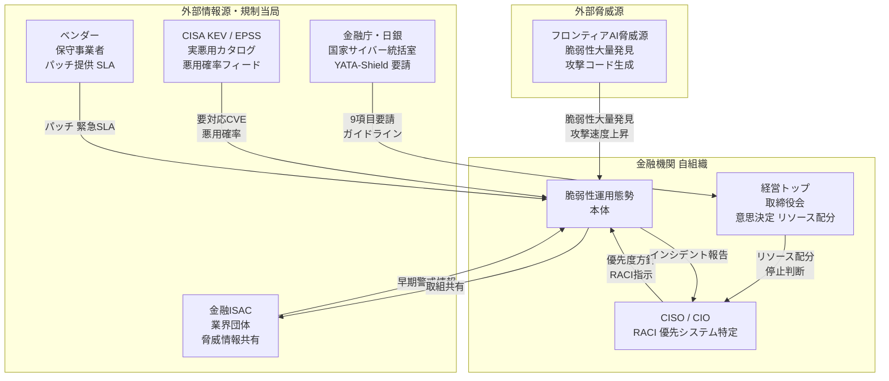
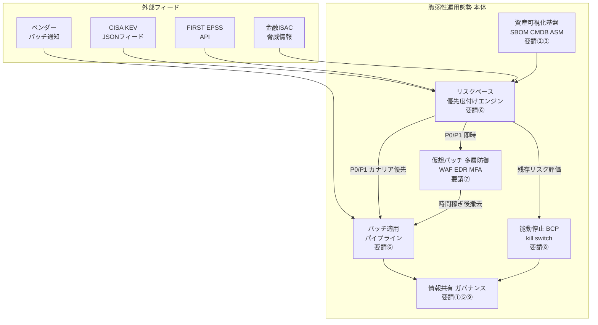
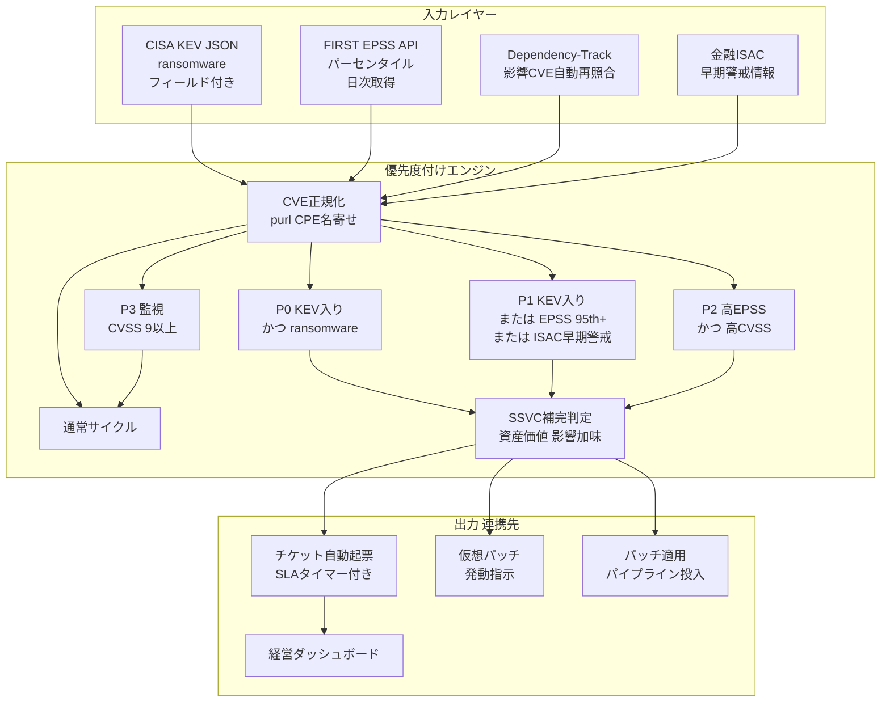
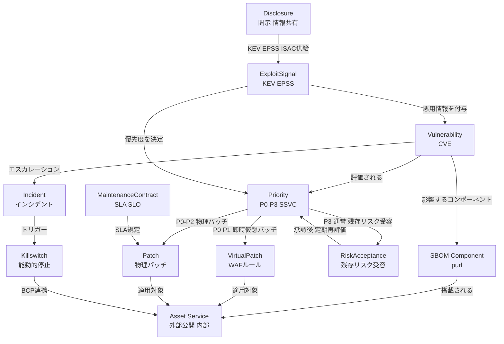
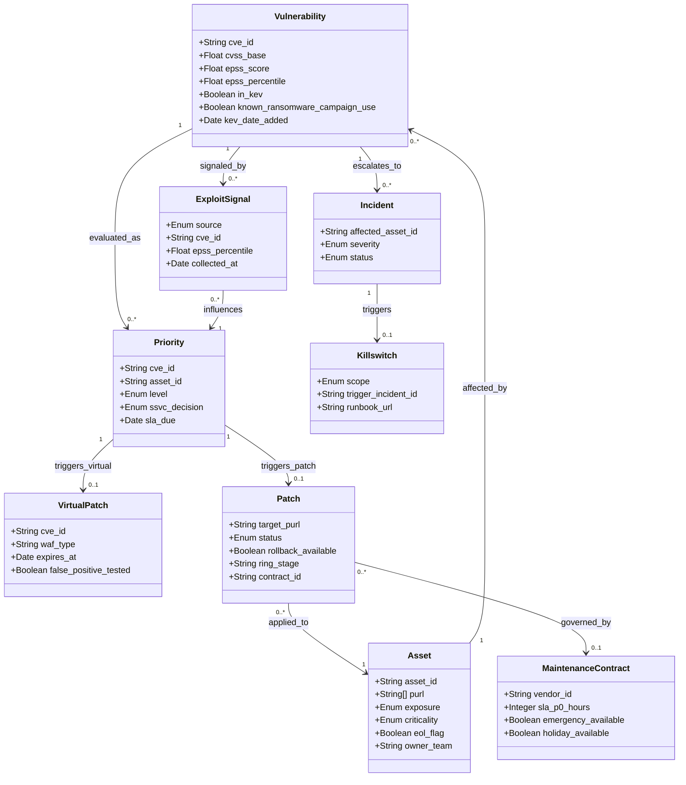

> 検証日: 2026-05-26 / 対象: 金融庁・日本銀行「フロンティアAIによる脅威変化を踏まえた金融機関等の短期的な対応」に係る要請（2026-05-22 発出）

2026年5月22日、金融庁と日本銀行が連名で「フロンティアAIによる脅威変化を踏まえた金融機関等の短期的な対応」に係る要請を発出しました。行政文書としては珍しく踏み込んだ内容で、要約すると「フロンティアAIによって脆弱性が短期間に大量発見される事態に備え、概ね1ヶ月程度を目途に脆弱性管理・パッチ運用の態勢を点検・強化せよ」というものです。

この記事では、この要請を金融機関に限らず一般の実装エンジニア・SRE・セキュリティ担当が回せる「脆弱性運用設計」として読み替えます。要請の9項目を「資産の可視化 → リスクベース優先度付け → 時間稼ぎ → パッチ自動化 → 能動的停止の備え」という運用の型に翻訳し、具体的なコマンド・スクリプト・データモデルに落とします。同時に、根拠とされる科学的評価の留保や過去の障害事例も併記し、過信も過小評価もしない読み方を示します。

## 概要

要請の発信者は金融庁（総合政策局長 堀本善雄、企画市場局長 井上俊剛、監督局長 石田晋也、総括審議官 柳瀬護）および日本銀行理事 神山一成の連名です。文書番号は金総政第3245号・金企市第498号・金監督第1384号で、対象は金融機関等。経営トップを含む経営層の直接関与の下、別添脚注に「概ね1ヶ月程度を目途に対応を進めることが期待される」と明記されています。

要請が発出された直接の契機は、フロンティアAIモデルによるサイバーセキュリティ能力の急速な向上です。要請別添の「背景」は、2026年4月7日にAnthropicが公表した Claude Mythos Preview を例示として挙げ、英国AIセーフティ・インスティテュート（AISI）の評価を根拠に「AIが脆弱性の発見や高度な攻撃コード生成に優れ、従来は発見が困難だった脆弱性が短期間に大量に発見され得る」という認識を示しています。

ここで重要なのは、AISIの評価が条件付きの留保を置いている点です。AISIはサイバーレンジで多段攻撃の自律完遂を確認した一方で、「Mythos Preview が十分に防御されたシステムを攻撃できるかどうかは断言できない（cannot say for sure whether Mythos Preview would be able to attack well-defended systems）」と明言しています。「AIが即座に実環境を制圧する」という断定ではない、という点は押さえておきたいところです。

この認識のもとで要請が強調するのが、ソフトウェアセキュリティのボトルネック転換です。Anthropic の Project Glasswing の初期報告（2026-05-22）は、「ソフトウェアセキュリティの制約は、かつては『どれだけ速く脆弱性を見つけられるか』にあったが、今や『どれだけ速く検証・開示・修正できるか』へ移った」と述べています。**脆弱性を発見するコストが急落した結果、ボトルネックは発見から修正へ移ったのです。**

この構図は実数でも裏付けられます。Glasswing は1ヶ月でパートナー全体の high/critical 脆弱性を10,000件超発見したと報告しており（一次ソース間で内訳の数値に不一致があるため、ここでは総数のみを引用します）、Verizon DBIR 2026 は悪用までの窓が分単位に縮まる一方で高・重大CVEの平均修正期間は74日と報告しています。要請はこの非対称を「脆弱性管理・パッチ運用の逼迫」として金融機関に翻訳し、9項目の短期対応を求めました。

## この要請の特徴

- **新規規制ではなく既存ガイドラインの「加速」要請です。** 要請別添の背景は「金融庁『金融分野におけるサイバーセキュリティに関するガイドライン』（2024年10月4日策定）に基づく基本的な対策をより迅速かつ着実に実行していくことが引き続き重要」と明記しています。求められているのは新しい枠組みではなく、サイバーハイジーン（IT資産管理・パッチ適用などの基礎）の徹底と加速です。
- **経営課題として明示しています。** CIO・CISOにとどまらず、経営トップの直接関与、全社横断連携、リソース配分の意思決定を要求します。9項目の①が「フロンティアAIへの対応を経営課題として扱う」であることが象徴的です。
- **政府全体パッケージ「Project YATA-Shield」と連動しています。** 2026年5月18日に国家サイバー統括室が14省庁連名で公表したパッケージは、金融分野を先行モデルに位置づけており、今回の要請はその先行実施の一部です。
- **「応急措置」と明言した上で中長期方針を示しています。** 9項目を応急的措置と位置づけ、「中長期的には脆弱性対応の自動化等への移行が必要」と明記しています。
- **副作用のトレードオフを率直に開示しています。** テスト縮小（項目⑥）がシステム障害リスクを高め得ることを要請文自身が経営トップへの注意事項として記載し、能動的なサービス停止（項目⑧）を経営の選択肢として提示します。
- **実務者作業部会で官民の知見を集約しています。** 2026年5月14日開催の実務者作業部会には、メガバンク・ネット銀行・取引所、クラウド・ITベンダー、業界団体、AIセーフティ・インスティテュート・国家サイバー統括室等が参加しました（作業部会の詳細は非公表）。

### 要請9項目の早見表

| # | 要請（別添見出し） | 実装・運用への翻訳 |
|---|---|---|
| ① | フロンティアAIへの対応を経営課題として扱う | リソース配分とリスク受容の意思決定を経営層に上げる経路を作る。RACI明文化 |
| ② | 優先的に対応すべきサービス／ITシステムを特定する | インターネットバンキング等の外部公開システムを最優先。共同運営は責任分担を明確化 |
| ③ | 特定した資産の技術負債を解消しておく | 構成再確認、不要ポート閉塞、特権ID削除、未対応パッチ適用、EOL製品の更新 |
| ④ | パッチ適用に係る人的リソースを追加する | 自社・ベンダー双方のリソース確保。優先度判断体制も拡充 |
| ⑤ | ベンダーとの維持保守契約の内容を確認する | パッチ適用が契約範囲か、夜間休日対応、SLA／SLO、ベンダー逼迫時の優先順位 |
| ⑥ | パッチ適用プロセスをリスクベースにする | CVSS依存をやめ、攻撃成立の蓋然性で優先度付け。テスト縮小の合理的判断 |
| ⑦ | パッチ適用以外の対策も強化する | クラウド型WAFによる仮想パッチ、ネットワーク分離、特権IDのMFA、EDR、多層防御 |
| ⑧ | 優先サービス／ITシステムの停止に備える | 能動的停止を経営の選択肢に。BCP有効性・判断基準・手順を点検 |
| ⑨ | 外部との連携を維持・強化する | 金融ISAC・業界団体・当局からの情報収集と自組織の取組共有 |

## 全体像 - 脆弱性運用態勢の論理構造

要請が想定する脅威シナリオと、それを受ける運用態勢の全体像を3段階の図で整理します。

### システムコンテキスト

外部の脅威源・情報源・規制当局と、金融機関内の3層のアクター（経営層／CISO・CIO／IT実務）の関係です。



| 要素 | カテゴリ | 役割 | 要請項目 |
|---|---|---|---|
| フロンティアAI脅威源 | 外部脅威 | 脆弱性の大量発見・攻撃コード生成 | 背景・前提 |
| CISA KEV / EPSS | 外部情報源 | 実悪用確認CVEと悪用確率を日次提供 | ⑥ |
| 金融庁・日銀・国家サイバー統括室 | 規制当局 | YATA-Shield・9項目要請・ガイドライン | ①〜⑨ |
| 金融ISAC・業界団体 | 外部連携 | 会員間の脅威・脆弱性情報を共有 | ⑨ |
| ベンダー・保守事業者 | 外部連携 | パッチ提供・緊急SLA・夜間休日対応 | ⑤ |
| 経営トップ・取締役会 | 内部アクター | リソース配分・能動停止の最終意思決定 | ①⑧ |
| CISO / CIO | 内部アクター | RACI策定・優先システム特定 | ②④ |
| IT・セキュリティ部門 | 内部実務 | 脆弱性運用態勢の実行主体 | ③⑥⑦⑧⑨ |

### コンテナ - 運用態勢の主要構成要素

態勢本体を6つの構成要素に分解します。



| コンテナ | 役割 | 要請項目 |
|---|---|---|
| 資産可視化基盤（SBOM／CMDB／ASM） | purl付きSBOMでCVE自動照合・即時影響範囲特定。CMDBとASMの差分でシャドーITを可視化 | ②③ |
| リスクベース優先度付けエンジン | KEV／EPSS／SSVCを統合し「P0/P1を今日、残りはサイクル」に大量CVEを圧縮 | ⑥ |
| 仮想パッチ・多層防御 | クラウドWAFで分単位対応。EDR・マイクロセグメント・MFAで単一脆弱性の全環境侵害を防止 | ⑦ |
| パッチ適用パイプライン | カナリア・リング展開で自動ロールバック。テスト縮小を安全網付きで許容 | ⑥ |
| 能動停止・BCP | 段階的kill switchのrunbook化と攻撃シナリオ別BCP演習 | ⑧ |
| 情報共有・ガバナンス | 経営ダッシュボード・金融ISAC連携・ベンダーSLA管理 | ①⑤⑨ |

### コンポーネント - リスクベース優先度付けエンジン

態勢の中核である優先度付けエンジンをドリルダウンします。



| コンポーネント | ツール例 | 役割 |
|---|---|---|
| CISA KEV JSONフィード | CISA公式 JSON | 実悪用確認CVEを取得。ランサム作戦使用フラグでP0/P1を分離 |
| FIRST EPSS API | api.first.org | 30日以内の悪用確率を日次提供。95パーセンタイルで高脅威を抽出 |
| Dependency-Track | OWASP Dependency-Track | SBOM受信・新CVE公開時の自動再照合・影響一覧出力 |
| 金融ISAC早期警戒 | 会員API/メール | KEV収録前の先行情報をP1昇格トリガーに |
| 優先度分類ロジック | Python / SOAR | KEV+EPSS+CVSSを統合し大量CVEを5ランクに圧縮 |
| SSVC補完判定 | CISA SSVC Decision Tree | 資産価値・影響・悪用状態からAct/Attend等を出力 |
| チケット自動起票 | Jira / ServiceNow | 優先度別SLAタイマー付きチケットを自動発行 |
| 仮想パッチ発動 | クラウド型WAF | P0/P1にWAFルールを分単位適用 |
| 経営ダッシュボード | Grafana / Splunk | 未対応件数・SLA遵守率を経営可視化 |

## データモデル

### 概念モデル

脆弱性運用で扱う主要概念とその関係です。



| エンティティ | 意味 | 主要属性 | 出典 |
|---|---|---|---|
| Vulnerability | 公開脆弱性。CVE-IDで一意識別 | cvss_base, epss_score, in_kev, known_ransomware | FIRST, CISA KEV |
| Asset/Service | 保有システム・サービス | purl[], exposure, criticality | NIST SP 800-40 Rev.4 |
| SBOM Component | SBOM上のコンポーネント | purl, version, supplier | NTIA, CycloneDX |
| ExploitSignal | 実悪用シグナル | source, epss_percentile, kev_date | CISA KEV, FIRST EPSS |
| Priority | 対応優先度 | level, ssvc_decision, sla_due | 要請⑥, SSVC |
| VirtualPatch | 一時的遮断ルール | waf_type, deployed_at, expires_at | OWASP |
| Patch | 物理パッチ | target_purl, status, rollback_available | NIST SP 800-40 Rev.4 |
| RiskAcceptance | 残存リスク受容記録 | approver, review_date | 要請⑥ |
| MaintenanceContract | 保守契約・SLA/SLO | sla_p0_hours, emergency_available | 要請⑤ |
| Incident | 攻撃成立・侵害検知 | severity, status | 要請⑧ |
| Killswitch | 能動的停止の実行記録 | scope, executed_by | 要請⑧ |
| Disclosure | 情報共有受信 | source, cve_ids[] | 要請⑨ |

### 情報モデル

主要エンティティの属性と関連です。要請に明記のない属性は実装案・既存標準からの補完です。



#### 列挙型の定義

| 列挙型 | 値 | 出典 |
|---|---|---|
| Priority.level | P0（KEV+ランサム）／ P1（KEV または EPSS 95th+）／ P2（高EPSS×高CVSS）／ P3（CVSS 9+監視）／ Normal | 要請⑥ |
| Priority.ssvc_decision | Act ／ Attend ／ Track* ／ Track | SSVC |
| Asset.exposure | public ／ internal | 要請②（外部公開が最優先） |
| Patch.status | pending ／ staged ／ canary ／ ring_early ／ ring_prod ／ applied ／ rolled_back | NIST SP 800-40 Rev.4（補完） |
| Patch.ring_stage | pilot ／ early_adopter ／ production ／ critical | 要請⑥（補完） |
| Killswitch.scope | function ／ external ／ full | 要請⑧ |

## 平時の作り込み

要請の9項目は、運用の時間軸で並べ替えると「平時に作り込み、有事は手順を実行するだけ」の状態づくりに収束します。まずは平時の準備です。

### SBOM生成とDependency-Track取り込み

脆弱性が出た瞬間に「うちのどこに影響するか」を秒で答えるには、purl（Package URL）付きの機械可読SBOMが前提です。コンポーネントが名前だけでpurlを持たないと、CVEデータベースと自動照合できません。

```bash
# syft でコンテナイメージを CycloneDX JSON 形式で出力（実装例）
# 補完元: anchore/syft https://github.com/anchore/syft
syft nginx:1.25.3 -o cyclonedx-json=sbom-nginx-1.25.3.json --quiet
```

```bash
# ソースから cdxgen で生成（Node/Java/Python/Go 等）
cdxgen -t python -o sbom-app.json .
```

```bash
# OWASP Dependency-Track へアップロード（実装例）
DEPENDENCY_TRACK_URL="https://dependencytrack.example.com"
API_KEY="your-api-key"
PROJECT_UUID="xxxxxxxx-xxxx-xxxx-xxxx-xxxxxxxxxxxx"

curl -s -X POST "${DEPENDENCY_TRACK_URL}/api/v1/bom" \
  -H "X-Api-Key: ${API_KEY}" \
  -H "Content-Type: multipart/form-data" \
  -F "project=${PROJECT_UUID}" \
  -F "bom=@sbom.json" | jq '.token'
```

Dependency-Track は新CVEが公開されるたびに既存の全プロジェクトへ自動再照合します。「作って終わり」ではなく、継続的に再照合する基盤に流し込むのが要請②③の肝です。

```bash
# SBOM品質チェック: purl が付いているか確認（purl なし = 自動照合不可）
jq '[.components[] | select(.purl != null)] | length' sbom.json
jq '[.components[] | select(.purl == null)] | .name' sbom.json
```

### EPSSとKEVの取り込み

要請⑥の核心は「CVSSスコアが高くない脆弱性であっても実際の攻撃に利用されている実態がある」という指摘です。FIRST自身も「CVSS基本値を単独でリスク評価に使うべきではない」と明言しています。そこで実悪用情報（KEV）と悪用確率（EPSS）を組み合わせます。

```bash
# CISA KEV 公式 JSON フィードの取得と jq 抽出（実装例）
curl -s https://www.cisa.gov/sites/default/files/feeds/known_exploited_vulnerabilities.json -o kev.json

# ランサムウェアキャンペーン使用のCVEのみ抽出
jq '[.vulnerabilities[] | select(.knownRansomwareCampaignUse == "Known") | .cveID]' kev.json

# 直近30日以内に追加された CVE
jq --arg cutoff "$(date -v-30d +%Y-%m-%d)" \
  '[.vulnerabilities[] | select(.dateAdded >= $cutoff) | {cve: .cveID, vendor: .vendorProject, product: .product}]' kev.json
```

```bash
# EPSS API による CVE スコア取得（実装例）
# 単一CVE
curl -s "https://api.first.org/data/v1/epss?cve=CVE-2024-1234" | jq '.'

# パーセンタイル95以上（高リスク）のみ
curl -s "https://api.first.org/data/v1/epss?percentile-gt=0.95&limit=100" \
  | jq '.data[] | {cve: .cve, epss: (.epss | tonumber), percentile: (.percentile | tonumber)}'
```

EPSSの生スコアは大半が0.01未満です。「0.1」は公式の閾値ではないため、実務ではパーセンタイルで切るほうが扱いやすくなります（95パーセンタイル以上を高リスクとする等）。

```bash
#!/usr/bin/env bash
# KEV + EPSS をローカルに蓄積する日次 cron 例（実装例）
set -euo pipefail
WORKDIR="/opt/vuln-ops/data"
mkdir -p "${WORKDIR}"
curl -sf https://www.cisa.gov/sites/default/files/feeds/known_exploited_vulnerabilities.json -o "${WORKDIR}/kev.json"
curl -sf "https://api.first.org/data/v1/epss?percentile-gt=0.70&limit=2000" -o "${WORKDIR}/epss_high.json"
echo "[$(date)] feeds synced."
```

### 資産棚卸しとベンダー契約のチェックリスト

CMDB は「保有資産の権威ソース」、ASM（Attack Surface Management）は「外から見える資産の権威ソース」です。両者の差分がシャドーIT、つまり攻撃面になります。

```
# CMDB（保有資産の権威ソース）
[ ] 全サーバ・コンテナ・クラウドリソースが登録されているか
[ ] 各エントリに OS/ミドルウェア/アプリのバージョン情報があるか
[ ] CMDB → SBOM の紐付け（資産ID ↔ プロジェクトUUID）が取れるか
[ ] CVE が出た際に「影響資産一覧」を5分以内に出力できるか

# ASM（外部公開資産の権威ソース）
[ ] 外部からスキャン可能なIP・ドメイン一覧が最新か
[ ] ASMスキャンを定期実行（週次以上）し CMDB差分をアラート化しているか
[ ] インターネットバンキング等の優先システム（要請②）が明示的に識別されているか
```

ベンダー保守契約（要請⑤）も平時に点検します。大量脆弱性が同時発生すると、ベンダー側のパッチ提供・対応リソースが逼迫し、自社だけ早く動けない構造的リスクがあります。

```
【パッチ提供SLA】
[ ] Critical（P0/KEV相当）の緊急パッチは何時間以内に提供されるか
[ ] SLA違反時のペナルティ・エスカレーション先が明記されているか
【人的リソース】
[ ] 夜間・休日・長期休暇時の緊急対応窓口と担当者名が最新か
[ ] 大量脆弱性同時発生時に自組織が後回しにされない優先順位の保証があるか
【責任分担（RACI）】
[ ] 検知/通知/パッチ提供/適用/検証の各ステップの責任者が明確か
[ ] 再委託先（サブベンダー）への要求が契約に反映されているか
```

## 有事の運用

### リスクベース優先度付けのロジック

KEV・EPSS・CVSSを統合し、大量のCVEを「P0/P1を今日、残りはサイクル」に圧縮します。KEV入り脆弱性は悪用が実証済みなので、CVSSの高低に関わらず最優先とするのがポイントです。

```python
#!/usr/bin/env python3
"""vuln_prioritize.py — KEV + EPSS + CVSS によるリスクベース優先度付け（実装例）
補完元: CISA KEV / FIRST EPSS / CISA SSVC"""
import json
import requests
from dataclasses import dataclass
from enum import Enum


class Priority(Enum):
    P0 = "P0"  # 緊急: KEV + ランサムウェア使用確認 → 本日中
    P1 = "P1"  # 高  : KEV入り / EPSS 95th+ → 24-48時間以内
    P2 = "P2"  # 中  : 高EPSS × 高CVSS → 7日以内
    P3 = "P3"  # 監視: CVSS 9+（悪用未確認）→ 定例サイクルで追跡
    NORMAL = "通常サイクル"


@dataclass
class VulnContext:
    cve_id: str
    cvss_base: float
    epss_score: float
    epss_percentile: float
    in_kev: bool
    kev_ransomware: bool


def load_kev(kev_path: str) -> dict:
    """KEV JSONから {cve_id: ransomware:bool} を返す"""
    with open(kev_path) as f:
        data = json.load(f)
    return {
        v["cveID"]: v["knownRansomwareCampaignUse"] == "Known"
        for v in data["vulnerabilities"]
    }


def fetch_epss(cve_ids: list[str]) -> dict:
    """EPSS API から {cve_id: {epss, percentile}} を返す"""
    result = {}
    for i in range(0, len(cve_ids), 100):
        chunk = ",".join(cve_ids[i:i + 100])
        resp = requests.get(f"https://api.first.org/data/v1/epss?cve={chunk}", timeout=30)
        resp.raise_for_status()
        for item in resp.json().get("data", []):
            result[item["cve"]] = {
                "epss": float(item["epss"]),
                "percentile": float(item["percentile"]),
            }
    return result


def prioritize(vuln: VulnContext) -> Priority:
    if vuln.in_kev and vuln.kev_ransomware:
        return Priority.P0
    if vuln.in_kev or vuln.epss_percentile >= 0.95:
        return Priority.P1
    if vuln.epss_score >= 0.10 and vuln.cvss_base >= 7.0:
        return Priority.P2
    if vuln.cvss_base >= 9.0:
        return Priority.P3
    return Priority.NORMAL
```

さらに CISA/CMU SEI の SSVC（Act ／ Attend ／ Track* ／ Track の決定木）で、資産価値やミッション影響を加味した行動決定に深めることもできます。

### 仮想パッチで時間を稼ぐ

物理パッチが間に合わない、あるいはパッチ適用そのものが困難なとき、要請⑦はクラウド型WAFによる仮想パッチでの時間稼ぎを求めます。OWASPの仮想パッチベストプラクティスに沿った6段階で運用します。

1. **Preparation（平時）**: クラウドWAFを事前導入します。有事に新規ソフト導入の承認を取る時間はありません。
2. **Identification**: Dependency-TrackのアラートでCVE影響資産を特定し、P0/P1該当を優先度ロジックで判定します。
3. **Analysis**: 誤検知（正常トランザクション遮断）のリスクを評価します。
4. **Creation**: WAF/ModSecurityルールを作成し、Detection-only → Block の順で段階適用します。
5. **Implementation & Testing**: ステージングで誤検知テスト後に本番適用し、SIEMでルール発火ログを監視します。
6. **Recovery**: 物理パッチ完了後にWAFルールを撤去します（残存はルール肥大化を招きます）。

```nginx
# ModSecurity ルール例 — CVE-XXXX-YYYY 用仮想パッチ（実装例）
# 補完元: OWASP ModSecurity CRS https://coreruleset.org/
SecRule REQUEST_URI "@beginsWith /api/v1/target-endpoint" \
    "id:9000001,phase:1,deny,status:403,log,\
    msg:'Virtual Patch: CVE-XXXX-YYYY — malicious payload detected',\
    tag:'virtual-patch/CVE-XXXX-YYYY'"
```

仮想パッチ単体では不十分です。EDR（端末の悪用挙動・C2検知）、マイクロセグメンテーション（lateral movement の遮断）、特権IDのMFA＋PAM、ボット対策を組み合わせ、単一脆弱性が全環境を侵すのを防ぎます。

### パッチ適用パイプラインとテスト縮小

要請⑥は「テスト不足によるシステム障害リスクと、パッチ未適用によるサイバー攻撃リスクを総合的に勘案し、テスト実施内容の合理的な縮小等を検討」せよと述べます。これは諸刃の剣です。安全に行うには、必ず**ロールバック可能性**とセットにします。

```yaml
# .github/workflows/patch-ring-deploy.yml（実装例）
name: Patch Ring Deploy
on:
  workflow_dispatch:
    inputs:
      patch_version:
        description: 'パッチバージョン'
        required: true
      priority:
        description: '優先度 (P0/P1/P2/P3/NORMAL)'
        required: true
        default: 'NORMAL'
jobs:
  staging:
    name: ステージング適用・自動テスト
    runs-on: ubuntu-latest
    steps:
      - uses: actions/checkout@v4
      - name: スナップショット取得（ロールバック用）
        run: echo "Tagging current staging image as rollback snapshot"
      - name: ステージング適用と自動テスト
        run: echo "Deploy ${{ inputs.patch_version }} & run smoke/regression tests"
  canary:
    name: カナリア適用（本番5%）
    needs: staging
    runs-on: ubuntu-latest
    environment: production-canary
    steps:
      - name: カナリアへパッチ適用
        run: echo "Deploying ${{ inputs.patch_version }} to canary"
      - name: ヘルスチェック待機（P0/P1 は短縮）
        run: |
          WAIT=300
          if [[ "${{ inputs.priority }}" == "P0" || "${{ inputs.priority }}" == "P1" ]]; then
            WAIT=60
          fi
          echo "Waiting ${WAIT}s for health metrics..."
          sleep "${WAIT}"
      - name: ヘルスチェック判定
        run: |
          ERROR_RATE=$(curl -sf "https://monitoring.example.com/api/error-rate?env=canary" | jq '.rate')
          # 小数比較は bc 依存を避け python3 で（Alpine 等で bc 未導入のため）
          if ! python3 -c "import sys; sys.exit(0 if float('${ERROR_RATE}') <= 0.01 else 1)"; then
            echo "::error::Canary error rate ${ERROR_RATE} exceeds threshold. Auto-rollback."
            exit 1
          fi
  ring1:
    name: Ring 1 (Early Adopter)
    needs: canary
    runs-on: ubuntu-latest
    steps:
      - name: Ring 1 適用
        run: echo "Deploy to Ring 1" && sleep 120
  ring2-production:
    name: Ring 2 (Production)
    needs: ring1
    runs-on: ubuntu-latest
    steps:
      - name: 本番全体適用と適用検証
        run: echo "Deploy to production; grype <image> --fail-on high"
```

テスト縮小の判断は次の流れで行います。P0/P1（KEV・EPSS 95th+）かつロールバック可能なら、スモークテストのみに縮小し、カナリアと自動ロールバックを安全網にします。ロールバックが困難なら通常テストを実施するか、仮想パッチで時間を稼いでからテストします。P2以下は通常テストサイクルを維持し、縮小しません。

### 能動的サービス停止とBCP

要請⑧は、各種対策を徹底しても防御できない前提で、優先サービスを能動的に停止する選択肢を経営トップがあらかじめ検討すべきと述べます。金融機関の文書としては踏み込んだ表現です。一発全停止ではなく、段階的なkill switchにします。

| ステップ | 操作 | 意思決定者 |
|---|---|---|
| ① 機能遮断 | 該当サービス・APIエンドポイントのみ停止／読み取り専用へ切替 | CISO権限で即時 |
| ② 外部接続遮断 | インターネット向けルート／DNS を遮断。内部業務は継続 | CISO+CTO合議 |
| ③ サービス全停止 | 全サービス停止・フェイルオーバー先へ切替 | 経営役員決裁 |

- 各ステップの**トリガー条件を平時に文書化**します（データ破壊／窃取が進行中の確証、横展開が制御不能、決済系の完全性を保証できない等）。誰がどの証跡で判断するかをRACIに明記します。
- 停止コマンド・DNS切替・メンテナンス画面切替・フェイルオーバー先をrunbook化し、夜間休日でも実行できる状態を維持します。
- 机上演習だけでなく、攻撃シナリオ別（ランサムウェア／DDoS／サプライチェーン侵害）に実際に停止・復旧を回し、RTO/RPOの実測値が目標を満たすか検証します。

### 情報共有を優先度付けに接続する

要請⑨の「外部連携」は、情報を収集するだけでなく、収集した情報を優先度付けに自動接続するところまで設計します。金融ISACで「他の金融機関で既に悪用が確認された」情報が流れたら、KEV掲載前でも即座にP1相当へ昇格させるルールを持ちます。EPSSは毎日更新されるので、前日比でスコアが急騰したCVE（例: 24時間以内に0.3以上増加）をダッシュボードのアラートに組み込み、優先度を再採点します。

## 鵜呑みにしない - 反証と留保

この要請は緊急性が高いものですが、前提を過信すると逆に事故を招きます。誠実に反証も併記します。

### 「AIが即座に実環境を制圧する」は過信

要請が引用する英国AISIの評価は、Mythos Preview が脆弱なレンジでは多段攻撃を完遂した一方で、「十分に防御されたシステムを攻撃できるかどうかは断言できない」と明言しています。レンジにはアクティブな防御者も防御ツールもなく、アラートを発報させる行動を取ってもペナルティがありません。実環境の防御済みシステムへの実効性は**未検証**です。元英NCSC長官の Ciaran Martin は「ゴールキーパー不在のチーム相手なら得点を量産するフォワードのようなもので、強固な守備に対しては未検証」と表現しました。「即制圧」も「防御済みなら安全」も、どちらも正確ではありません。

### テスト縮小は障害リスクと裏表

2024年のCrowdStrike障害は、検証不足のアップデートでWindows約850万台が停止し、推定54億ドルの被害を出しました。教訓は「ステージング検証なしに本番展開してはならない」「カナリア／段階展開が必須」です。要請の「1ヶ月集中＋テスト縮小」はこの教訓と緊張関係にあり、要請文自身がシステム障害増の可能性を経営トップに注意喚起しています。速度と安全のトレードオフは経営が判断する構造です。

### 「大量発見＝脅威増大」ではない

「AIが脆弱性を大量発見」の裏で、curlは2026年1月末にAI生成スロップ報告の氾濫を理由にHackerOneバグバウンティを終了しました。提出の約20%がAI生成で、真の脆弱性は約5%だったと報告されています。量がそのまま脅威になるわけではなく、検証コストとノイズの問題が立ちはだかります。だからこそ、EPSS＋KEVによる機械的フィルタリングで「本物」を先に浮かび上がらせる運用が要になります。

### ベンダー利益相反には割引が必要

フロンティアAIの危険性を喧伝することには、モデル提供者のマーケティング動機が混じり得るという批判もあります（Sam Altman の発言など）。ただし、この批判の発信源にも逆方向の利益相反があるため、そのまま受け取ることにも割引が必要です。一次ソースはAISI・金融庁・DBIR等の中立機関に依拠し、モデル提供者の発表は参考情報として扱うのが穏当です。

### ただし「攻撃側優位」は頑健

一方で、「攻撃側が時間軸で優位」という結論は反証が乏しく頑健です。Verizon DBIR 2026 は悪用までの窓が分単位に縮む一方、高・重大CVEの平均修正期間は74日と報告し、Palo Alto は「3〜5ヶ月の狭い窓」での先行対応を促しています。「基本対策をしっかりやっていれば大丈夫」ではなく、「**基本対策を74日より速く回す**」が現実的な答えです。

## トラブルシューティング

- **ベンダーリソース逼迫（複数組織が同時対応）**: 契約で先手を打ち（緊急パッチSLA・夜間休日対応・優先順位保証を平時に明文化）、P0専用の緊急連絡先を更新し、仮想パッチで対応待ちの時間を作ります。特定ベンダー依存は中長期でマルチベンダー化を検討します。
- **パッチ起因障害**: カナリア／リング展開を導入していれば影響リングを特定して即時ロールバックします。スナップショットがあれば分単位で復旧できます。テスト環境と本番の構成差分（ミドルウェアバージョン・設定）を照合し、ヘルスチェック項目が不足していれば追加します。
- **仮想パッチの誤検知（正常トランザクション遮断）**: 本番適用前に必ずDetect-onlyで誤検知率を測定し、段階展開します。攻撃が観測されていないのに高頻度で誤検知するなら、一時的にDetect-onlyへ戻す判断も選択肢です。機能不全に陥ったら該当CVEの物理パッチを繰り上げます。
- **KEV未掲載だが既に悪用されているCVE**: KEVは掲載まで遅延があります。金融ISAC等から「他組織で悪用確認」の情報が来たらKEV入り前でもP1へ昇格します。EPSSの前日比急騰アラートと、商用Threat Intelの観測も組織独自のKEVに取り込みます。
- **「1ヶ月以内」が物理的に困難**: 完了より着手・可視化を優先します。P0/P1に集中し、残りは「リスク受容済み（仮想パッチで補完）」として文書化します。共同運営システムは責任分担とスケジュールの合意を最優先タスクにします。遅れる部分は「なぜ／いつまでに」を当局に説明できる状態にすること自体が最大のリスク低減です。

## まとめ

金融庁・日銀の要請は、新しい規制ではなく既存のサイバーセキュリティ基本対策を「発見＞修正」時代に合わせて加速せよというメッセージです。資産の可視化（SBOM／CMDB）、KEV／EPSSによるリスクベース優先度付け、仮想パッチでの時間稼ぎ、カナリア／リング展開を安全網にしたパッチ自動化、そして能動的停止の備え——この型を平時に作り込んでおくことが、金融機関に限らずあらゆる組織の現実的な備えになります。同時に、根拠となるAISIの評価は条件付きの留保を置いており、テスト縮小には障害リスクが伴います。過信も過小評価もせず、定量的な運用判断に落とすことが肝心です。

この記事が少しでも参考になった、あるいは改善点などがあれば、ぜひリアクションやコメント、SNSでのシェアをいただけると励みになります！

## 参考リンク

### 行政文書（一次ソース）

- [金融庁・日本銀行「フロンティアAIによる脅威変化を踏まえた金融機関等の短期的な対応」に係る要請について](https://www.fsa.go.jp/news/r7/sonota/20260522-5/20260522.html)
- [要請文 本体PDF](https://www.fsa.go.jp/news/r7/sonota/20260522-5/01.pdf)
- [日本銀行 要請文](https://www.boj.or.jp/finsys/release/frel260522a.htm)
- [金融庁 実務者作業部会（第1回, 2026-05-14）](https://www.fsa.go.jp/news/r7/sonota/20260514/20260514.html)
- [国家サイバー統括室 Project YATA-Shield（2026-05-18）](https://www.cyber.go.jp/pdf/press/20260518_AI_CS_Package.pdf)
- [金融庁 金融分野におけるサイバーセキュリティに関するガイドライン](https://www.fsa.go.jp/common/law/cybersecurity_guideline.pdf)

### 科学的根拠（一次ソース）

- [英国 AISI: Our evaluation of Claude Mythos Preview's cyber capabilities](https://www.aisi.gov.uk/blog/our-evaluation-of-claude-mythos-previews-cyber-capabilities)
- [Anthropic: Project Glasswing initial update](https://www.anthropic.com/research/glasswing-initial-update)

### 標準・ツール

- [CISA Known Exploited Vulnerabilities Catalog](https://www.cisa.gov/known-exploited-vulnerabilities-catalog)
- [CISA KEV JSON フィード](https://www.cisa.gov/sites/default/files/feeds/known_exploited_vulnerabilities.json)
- [CISA SSVC](https://www.cisa.gov/stakeholder-specific-vulnerability-categorization-ssvc)
- [CISA BOD 22-01](https://www.cisa.gov/news-events/directives/bod-22-01-reducing-significant-risk-known-exploited-vulnerabilities)
- [FIRST EPSS ユーザーガイド](https://www.first.org/epss/user-guide)
- [FIRST EPSS API](https://api.first.org/data/v1/epss)
- [FIRST CVSS](https://www.first.org/cvss/)
- [NIST SP 800-40 Rev.4 (Enterprise Patch Management)](https://csrc.nist.gov/pubs/sp/800/40/r4/final)
- [NTIA SBOM 最小要素](https://www.ntia.gov/files/ntia/publications/sbom_minimum_elements_report.pdf)
- [OWASP Virtual Patching Best Practices](https://owasp.org/www-community/Virtual_Patching_Best_Practices)
- [OWASP Dependency-Track](https://docs.dependencytrack.org/)
- [anchore/syft](https://github.com/anchore/syft)
- [OWASP ModSecurity Core Rule Set](https://coreruleset.org/)

### 反証・留保

- [Verizon DBIR 2026（悪用窓の短縮・修正期間74日, SecureWorld 経由の二次情報）](https://www.secureworld.io/industry-news/verizon-dbir-attackers-moving-faster-than-remediation)
- [CrowdStrike障害の教訓（テスト縮小リスクの先例）](https://www.upguard.com/blog/crowdstrike-incident)
- [curl がAIスロップ報告でバグバウンティを終了](https://www.bleepingcomputer.com/news/security/curl-ending-bug-bounty-program-after-flood-of-ai-slop-reports/)
- [Palo Alto Defender's Guide (2026-05)](https://www.paloaltonetworks.com/blog/2026/05/defenders-guide-frontier-ai-impact-cybersecurity-may-2026-update/)
