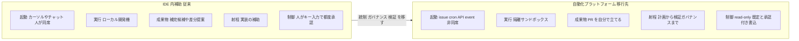
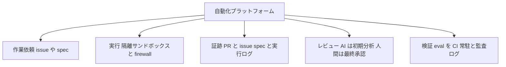

## 概要

2026年5月、Gartnerは「エンタープライズAIコーディング・エージェント市場は拡大と競争再編の新たな段階に突入した」と発表しました。その中で、次の予測（Strategic Planning Assumption）を示しています。

> 2027年までに、エージェント型コーディング（agentic coding）を利用するエンジニアリング・チームの65%超が、統合開発環境（IDE）を必須とは見なさなくなり、コントロール・ガバナンス・検証（control / governance / validation）を自動化プラットフォームへ移す。

本記事は、この予測を次の4ステップで検証します。

1. 一次情報で予測の正確な内容を確認する
2. GitHub・Vercel・Anthropicの具体実装で「方向性が裏付くか」を検証する
3. Gartner自身の逆方向の予測を含む反証を突き合わせる
4. 開発組織が実際に決め直すべき設計5点に落とす

先に結論を述べます。予測の「方向」（統制・ガバナンス・検証が個人のIDEから組織の自動化基盤へ移る）は、複数ベンダーの一次実装で裏付けられます。一方で「65%」「IDEが不要になる」という「度合い」は鵜呑みにできません。IDEは依然として開発の中心であり、Gartner自身が「agentic AIプロジェクトの40%超が中止される」と予測しているからです。

実務的に意味があるのは「IDEを捨てる」ことではありません。移行先として名指しされた3要素（control / governance / validation）を、IDEの外側の自動化レイヤとして先に設計しておくことです。

## 特徴

この予測と周辺動向には、次の特徴があります。

- 移行先は3要素に限定される。原文が「自動化プラットフォームへ移す」と名指すのは control / governance / validation の3点のみ
- 競争軸が「モデル中立」から「ハーネス中立」へ移る。どのモデルかではなく、どの実行ハーネス（スキル・権限・サンドボックス・セッション・サブエージェント）かが争点
- 起動点が「カーソル」から「event / cron / issue」へ移る。人が同席する補完から、非同期の自走実行へ
- ガバナンス付き隔離実行が必須要素化する。read-only既定と承認付き書込、Firecracker microVM、hooksやpermissionsが各社で標準装備
- 採用がガバナンスを追い越している。実装は進むが、監査・権限・承認の成熟度が追いついていない

なお「計画・レビュー」は移行先の構成要素ではありません。原文では「agentic な開発はSDLCを planning → creating → reviewing にまたがる」というカバー範囲の説明として登場します。移行先の3要素（control / governance / validation）と混同しやすいため注意が必要です。

## 概念構造

「IDE内補助」と「自動化プラットフォーム」の対比を、起動点・実行環境・成果物・工程の射程・制御の5軸で示します。

| 要素名 | 説明 |
|---|---|
| IDE 内補助 | 従来の開発スタイル。人がエディタに同席し、補完候補を都度適用する |
| 自動化プラットフォーム | 予測の移行先。非同席で起動し、隔離環境でPRまで運ぶ |
| 起動 | IDEはカーソルやチャット、プラットフォームはissue・cron・API・event |
| 実行 | IDEはローカル開発機、プラットフォームは隔離サンドボックス |
| 成果物 | IDEは補完候補、プラットフォームはエージェントが立てるPR |
| 制御 | IDEは都度承認、プラットフォームはread-only既定と承認付き書込 |

移行先で必須化する「ガバナンス付き自動化」の構成要素を分解します。

| 要素名 | 説明 |
|---|---|
| 作業依頼 | 起動点をissueやspecへ。受け入れ条件と仕様の質が成果を決める |
| 実行 | 隔離サンドボックスとagent firewallで権限を最小化する |
| 証跡 | PRをissue・spec・実行ログに紐づけ、provenanceを残す |
| レビュー | AIは初期分析、人間が上層で最終承認する |
| 検証 | evalをCIに常駐させ、監査ログと異常検知を備える |

## 予測の一次情報と正確な内容

### 一次ソース

| 項目 | 内容 |
|---|---|
| タイトル | Gartner Says the Market for Enterprise AI Coding Agents Is Entering a New Phase of Expansion and Competitive Realignment |
| 発表 | STAMFORD, Conn., 2026-05-20（日本語版 2026-05-27、同一リリースの現地公開日差） |
| アナリスト | Philip Walsh（Sr Director Analyst） |
| 連動レポート | Gartner の Magic Quadrant for Enterprise AI Coding Agents（2026-05-20） |

予測（Strategic Planning Assumption）の原文は次のとおりです。

> by 2027, over 65% of engineering teams using agentic coding will treat integrated development environments (IDEs) as optional, shifting control, governance, and validation to automated platforms.

- 対象年は2027年、数値は65%超、母集団はagentic codingを利用するエンジニアリング・チーム
- 数値・年・母集団はPublickey二次報道とも一致し、一次プレスリリースで確認済み

### 何を競う段階に入ったか

Walsh氏は次のように述べています。

> 最も「魔法のような」開発体験を競うレースが、運用の卓越性・商用成熟度・エンタープライズ対応（operational excellence / commercial maturity / enterprise readiness）を競う段階へ進化している。

つまり、個人のIDE体験ではなく、組織としての統制・ガバナンス・検証を担う基盤が主戦場になる、という構図です。

なお、関連で流通するGartner数値（2028年までに非同期エージェントが生産性を30-50%向上、市場規模 $9.8-11.0B 等）は、今回のPR本文では確認できず一次未確認です。本記事のテーマの裏付けには使いません。

## 方向性を裏付ける実装

予測が言う「IDE補助から、ガバナンスを含む自動化プラットフォームへ」という流れは、抽象論ではなく主要ベンダーの一次実装として進行しています。

### GitHub 補完エンジンから自動化基盤へ

GitHubは本テーマの最も明快な実例です。

- Agentic Workflows（github.blog, 2026-02-13）。プレーンMarkdownで意図を書き、GitHub Actions上でcoding agentが実行する自動化です。「Workflows run with read-only permissions by default. Write operations require explicit approval through safe outputs」とあり、Copilot CLI・Claude Code・OpenAI Codexを設定で差し替えられます。既存CI/CDを「置き換えでなく拡張」するContinuous AIとして、計画から実装・レビュー・ガバナンスまでをCI/CDの文法に載せます
- Copilot app（github.blog, 2026-06-02）。「agent-native desktop experience」です。各セッションが独自のgit worktreeで隔離され、複数エージェントを並列管理します。GitHub自身が核心を言語化しています

> Agents that can only suggest code leave you do a lot of the work. ... agents need to run code, inspect results, test changes, and iterate, without touching production.

これは「補完だけの補助」と「実行・検証まで担うプラットフォーム」の対比そのものです。

- Copilot CLI委譲制御（github.blog, 2026-06-12）。サブエージェントへの過剰委譲を抑えるよう学習させた本番A/Bの結果です

| メトリクス | 改善 |
|---|---|
| セッションあたりツール失敗 | 23%減 |
| Search ツール失敗 | 27%減 |
| Edit ツール失敗 | 18%減 |
| P95 のユーザー待ち時間 | 5%低下 |

CLIがマルチエージェント・オーケストレータ化し、「補完の精度」ではなく「自動化の信頼性」を本番メトリクスで磨くフェーズに入った証拠です。

### Vercel エージェント実行系の契約化

Vercelは「アプリを書くIDE補助」ではなく、エージェントを動かす実行基盤としてプラットフォーム化を進めています。

- AI SDK 7 の HarnessAgent（vercel.com/changelog, 2026-06-12, experimental）。「Claude Code, Codex, and Pi」を単一APIで動かす抽象です。「AI SDK has always let you switch models without rewriting your agent. Now you can switch the harness the same way.」とあり、skills・sandboxes・sessions・permission flows・compaction・sub-agentsを横断して正規化します
- Vercel Sandbox（docs）。「信頼できない・ユーザー生成コード」を安全に動かす計算プリミティブです。各サンドボックスはFirecracker microVMで隔離され、エージェント出力を本番に触れさせず実行・検証します

### Anthropic IDE補助とプラットフォームを公式に分離

Claude Agent SDKの公式比較表は、用途を明示的に分けています。

| 形態 | 主な用途 |
|---|---|
| CLI | 対話的開発、単発タスク |
| SDK | CI/CDパイプライン、本番自動化、カスタムアプリ |
| Managed Agents | sandboxとsessionをAnthropicがホスト |

「Many teams use both: CLI for daily development, SDK for production.」とあります。hooks（`PreToolUse` や `PostToolUse` など）とpermissionsで「validate, log, block, or transform agent behavior」を実装します。

まとめると、複数harnessを差し替える「中立プラットフォーム」化（GitHub Agentic Workflows、Vercel HarnessAgent）と、ガバナンス付き隔離実行（read-only既定、Firecracker microVM、hooksとpermissions）が、予測の言う「検証・ガバナンスを含む自動化プラットフォーム」を実装として具体化しています。方向性は裏付けられます。

## 反証と留保

方向性は裏付きますが、予測の「度合い」には強い反証があります。最も重いのは、Gartner自身の内部矛盾です。

- Gartner自身が逆方向を予測している。同じGartnerが2025-06-25のプレスリリースで「2027年末までにagentic AIプロジェクトの40%超が中止される」（コスト高騰・不明確なビジネス価値・不十分なリスク統制が理由）とし、「agent washing（既存チャットボットやRPAをagenticと再ブランドするだけ）」を批判しています。本物のベンダーは数千社中およそ130社と推定しています。「移行を急げ」という読み方は、Gartner自身の予測と整合しません
- SPAは実証予測ではない。Strategic Planning Assumptionは的中より議題設定を目的とする道具で、過去に桁違いのovershootがあります（例として「2011年までにソフトの4分の1がSaaS」が実績は約4%）[二次情報: Brightwork Research]。「65%」の母集団・手法・定義は非公開です
- IDEは依然中心で、エージェントもIDE内で使われる。Stack Overflow 2025開発者調査ではVS Codeが75.9%で首位を維持し[一次: Stack Overflow 2025]、CursorやClaude CodeはIDEの代替でなく併用されています[二次: Visual Studio Magazine]。GitHubもCopilot CLI agentをJetBrains IDEに統合する方向で、「自動化をIDEに内包する」流れも同時に存在します
- 自律エージェントの実成功率は低い。Answer.AIの実地評価（2025-01, Devin 1.0）では、実タスク20件中14失敗・3成功（成功率 約15%）でした[一次: Answer.AI]。「どのタスクが成功するか予測できない」「失敗の救済に時間を浪費する」が問題点です。現行版の精度は別途確認が必要です
- 自動化を増やすほど逆効果になりうる。AIエージェントはGitHubで月 約1,700万PRを生成し「10本に1本しか正当でない」との現場証言があります。低品質AI PR対策としてPRを制限・無効化する機能も報じられています[二次情報: danilchenko.dev、GitHub公式一次では未確認]。Copilot CLIの委譲抑制も「自動化は増やすほど良いわけではない」ことの裏返しです
- ガバナンスが採用に追いついていない。81%のチームが計画段階を越える一方、フルのセキュリティ承認は14.4%のみ、45.6%がエージェント間認証で共有APIキーに依存しています[二次情報: Gravitee State of AI Agent Security 2026]。「AI出力の正確性を信頼しない」開発者は31%（2024）から46%（2025）に増えました[一次: Stack Overflow 2025]

含意は次のとおりです。「control / governance / validation を自動化プラットフォームへ移す」という方向は正しいものの、移す前提となるガバナンス・監査・権限設計はまだ未成熟です。だからこそ、IDEを捨てる話としてではなく、移行先3要素を先に設計しておく実務課題として読むのが妥当です。

## 開発組織が決め直す5点

予測を所与とせず、現場で先取りすべき設計判断を5点に整理します。各点は既存の一次実装・標準に紐づきます。打ち手の核は「IDE移行を急ぐのではなく、移行先3要素（統制・ガバナンス・検証）をIDEの外側の自動化レイヤとして先に設計しておく」ことです。

### 1. 作業依頼の単位 カーソルからissueやspecへ

- GitHub coding agentは、issueをCopilotに割り当てると起動し、計画・PR作成・テスト・レビュー依頼まで非同期で運びます。入口が「カーソル位置」から「issueや受け入れ条件の質」に移ります
- spec-kitのSpec-Driven Developmentでは、Spec（何を・なぜ）・Plan（技術設計）・Tasks（実行列）に加え、`constitution`（不変原則。「実装前にテストを書き、ユーザー承認のうえ失敗を確認するまで実装コードを書かない」を明文化）とhuman review gatesを備えます。作業単位が「コード編集」から「spec authoring」へ移ります
- AGENTS.mdは、Linux Foundation傘下のAgentic AI Foundationがstewardするオープン標準です（20以上のツール・6万以上のOSSが採用と公称）。共有規約はAGENTS.md、ツール固有はnativeファイル（CLAUDE.md等）の二層持ちが実務的です

### 2. 変更単位と証跡 PRのprovenance

変更単位は、エージェントが立てる1PRになります。そのPRが、どのissueやspecから、どのエージェントが、どの実行（モデル版・seed・参照ファイル）で生んだかを構造的に辿れるようにします。versioned specと生成物コミットで「どの指示で何を変えたか」が残ります。

### 3. レビュー責任 AIは補助で人間が最終承認

- GitHub公式が明言しています。「Copilot is not guaranteed to spot all problems ... Always validate Copilot's feedback carefully. Supplement Copilot's feedback with a human review.」。AIレビューは初期分析であり、最終責任は人間に残します
- 日本語の実務知見も厚い領域です。レビューを多層防御にして「人間は最終層のみ」とする設計（Zenn「事後検査から事前統治へ」）や、6段階分業（Format・LintはAIが100%、Architectureは人間が担当、AI 60%のLogic層が油断を生み最も危険）があります

### 4. 承認権限 実行と権限拡張の分離

- sandbox（read-only・隔離）とagent firewall（既定ON・allowlist・MDM強制）を組み合わせます。エージェントの既定権限は最小に倒し、ネットワーク・ファイルシステム・外部APIはallowlistで開けます。「実行する人」と「権限を広げる人（org adminやMDM）」を権限分離します
- ただしfirewallは「どのプロセスが何のAPIを叩き何を入れたか」までは見せません[二次: StepSecurity]。Harden-Runner等の補完監視が必要です

### 5. 検証とガバナンス evalをCI常駐し足す前に測る

- evalをCIに組み込み、モデルやプロンプト更新時の回帰を検出します。model version pinningとper-run seed loggingが目安です[二次: Promptfoo]
- 監査は「出力レビュー」ではなく behavior control design へ移します。最小権限検証・行動境界・実行ログ・高リスク取引の承認ゲート・異常検知の常設です。エージェントは人間が「ループの外に出る」ため、不可逆性・カスケード誤り・過剰権限・意思決定の不可視が固有リスクになります
- 自動化を足す前に詰まりを測ります。AIでコーディングが加速しても、リリースはそれほど速くなりません。AIは制約を解消でなく再配置し、新ボトルネックは上流（MVP定義）とレビューやQAに移ります。Four KeysやDevExで工程別の滞留を測り、詰まり（多くは上流やレビュー）に自動化を配分します

### 日本固有の論点 契約形態と組織境界

SES（準委任）は成果物の完成責任を負わず、受託（請負）は負います[二次情報]。エージェント生成コードの「最終責任の所在」をどちらが持つかが、新たな論点になります。多重下請け構造では、承認権限・証跡が組織境界をまたぐため、自動化プラットフォームのガバナンス（誰がallowlistやポリシーを変更でき、誰がPRを承認するか）を契約・組織境界に沿って権限分離する設計が、日本では特に難しくなります。

## 未解決の問い

- 「65%」の母集団と操作的定義。「IDEを必須とみなさない」をGartnerがどう測ったか。一次本文（403）で未確認
- IDE不要化を支持する実証データ。反証探索ではIDE離れを示す開発者調査は見つからず、逆方向（VS Code首位）しか出ませんでした。予測を支持する実証は現時点で薄いです
- 移行の成否判定が時期尚早。Vercel HarnessAgentやAnthropic Managed Agentsは新しく、個別の実運用退行・撤回事例がまだ少ないです。方向の正しさは裏付くものの、「うまくいくか」の判定は早すぎます
- ガバナンス成熟のタイムライン。フルのセキュリティ承認14.4%という現状から、予測の前提が満たされるまでにどれだけ要するか

## まとめ

Gartner予測は「IDEを捨てよ」という指示ではなく、統制・ガバナンス・検証の重心が個人のIDEから組織の自動化基盤へ移るという重心移動の予告として読むべきです。重心移動そのものはGitHub・Vercel・Anthropicの一次実装で裏付けられますが、「65%」「IDE不要」という度合いは、Gartner自身の「40%中止」予測・IDE首位継続・自律エージェントの低成功率・ガバナンス未成熟という反証に照らして割り引く必要があります。現場の打ち手は、移行先3要素を5点の設計（issueやspec単位・PR provenance・人間最終レビュー・権限分離・CI evalと計測）として今のうちに先取りすることです。

この記事が少しでも参考になった、あるいは改善点などがあれば、ぜひリアクションやコメント、SNSでのシェアをいただけると励みになります！

## 参考リンク

- 公式ドキュメント・プレスリリース
  - [Gartner Says the Market for Enterprise AI Coding Agents Is Entering a New Phase of Expansion and Competitive Realignment](https://www.gartner.com/en/newsroom/press-releases/2026-05-20-gartner-says-the-market-for-enterprise-ai-coding-agents-is-entering-a-new-phase-of-expansion-and-competitive-realignment)
  - [Gartner、エンタプライズAIコーディング・エージェント市場は拡大と競争再編の新たな段階に突入したと発表](https://www.gartner.co.jp/ja/newsroom/press-releases/pr-20260527-ai-coding-agent)
  - [Gartner Predicts Over 40% of Agentic AI Projects Will Be Canceled by End of 2027](https://www.gartner.com/en/newsroom/press-releases/2025-06-25-gartner-predicts-over-40-percent-of-agentic-ai-projects-will-be-canceled-by-end-of-2027)
  - [GitHub Copilot code review ドキュメント](https://docs.github.com/en/copilot/concepts/agents/code-review)
  - [Vercel Sandbox ドキュメント](https://vercel.com/docs/sandbox)
  - [Claude Agent SDK overview](https://code.claude.com/docs/en/agent-sdk/overview)
  - [AGENTS.md](https://agents.md/)
- GitHub
  - [How we made GitHub Copilot CLI more selective about delegation](https://github.blog/ai-and-ml/how-we-made-github-copilot-cli-more-selective-about-delegation/)
  - [Automate repository tasks with GitHub Agentic Workflows](https://github.blog/ai-and-ml/automate-repository-tasks-with-github-agentic-workflows/)
  - [GitHub Copilot app: the agent-native desktop experience](https://github.blog/news-insights/product-news/github-copilot-app-the-agent-native-desktop-experience/)
  - [Assigning and completing issues with coding agent in GitHub Copilot](https://github.blog/ai-and-ml/github-copilot/assigning-and-completing-issues-with-coding-agent-in-github-copilot/)
  - [github/spec-kit](https://github.com/github/spec-kit)
  - [Program agent harnesses with the AI SDK](https://vercel.com/changelog/program-agent-harnesses-with-ai-sdk)
- 記事・調査
  - [AIコーディングでIDE中心から自動化基盤への移行をGartnerが予測（Publickey）](https://www.publickey1.jp/blog/26/2027ai65ide.html)
  - [Stack Overflow 2025 Developer Survey](https://stackoverflow.co/company/press/archive/stack-overflow-2025-developer-survey/)
  - [Stack Overflow Dev Survey: Visual Studio, VS Code hold off AI IDEs](https://visualstudiomagazine.com/articles/2025/08/01/stack-overflow-dev-survey-visual-studio-vs-code-hold-of-ai-ides-to-remain-on-top.aspx)
  - [State of AI Agent Security 2026（Gravitee）](https://www.gravitee.io/blog/state-of-ai-agent-security-2026-report-when-adoption-outpaces-control)
  - [GitHub, AI agents, and 17 million pull requests（danilchenko.dev）](https://www.danilchenko.dev/posts/2026-04-11-github-ai-agents-pull-requests/)
  - [Thoughts On A Month With Devin（Answer.AI）](https://www.answer.ai/posts/2025-01-08-devin.html)
  - [なぜAIコードのレビューは崩壊するのか（Zenn）](https://zenn.dev/yun_bow/articles/2c06479d3ff590)
  - [コードレビューを6段階にしたら、AIと人間の分業が見えた（Zenn）](https://zenn.dev/kenimo49/articles/code-review-6-stages-ai-human-boundary)
  - [AIでコーディングが加速した後、ボトルネックはどこへ行ったのか（Zenn）](https://zenn.dev/mento_techblog/articles/2025-07-ai-driven-dev-insight)
  - [Evaluate coding agents（Promptfoo）](https://www.promptfoo.dev/docs/guides/evaluate-coding-agents/)
