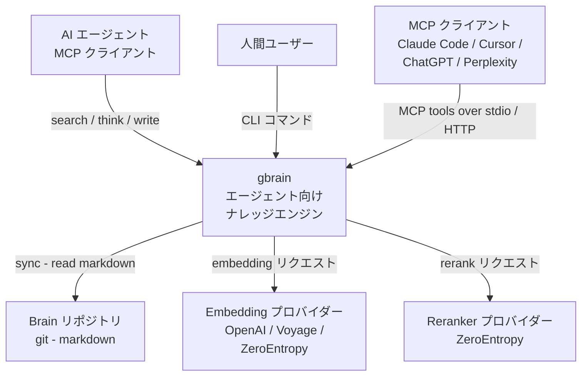
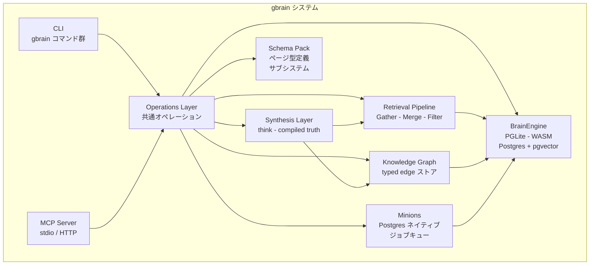
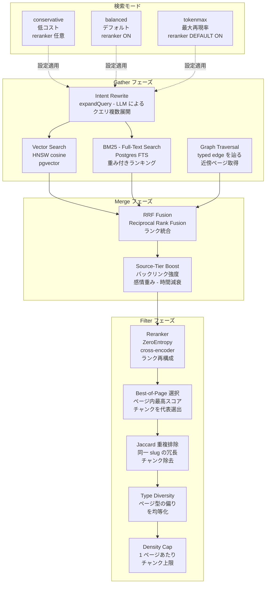
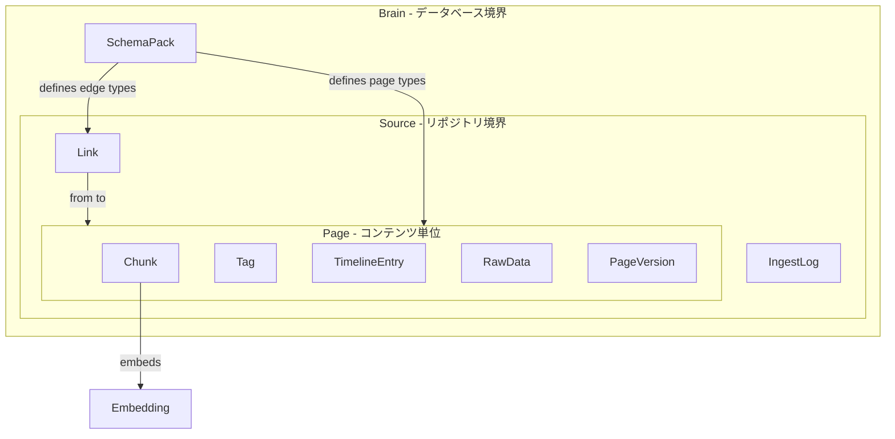
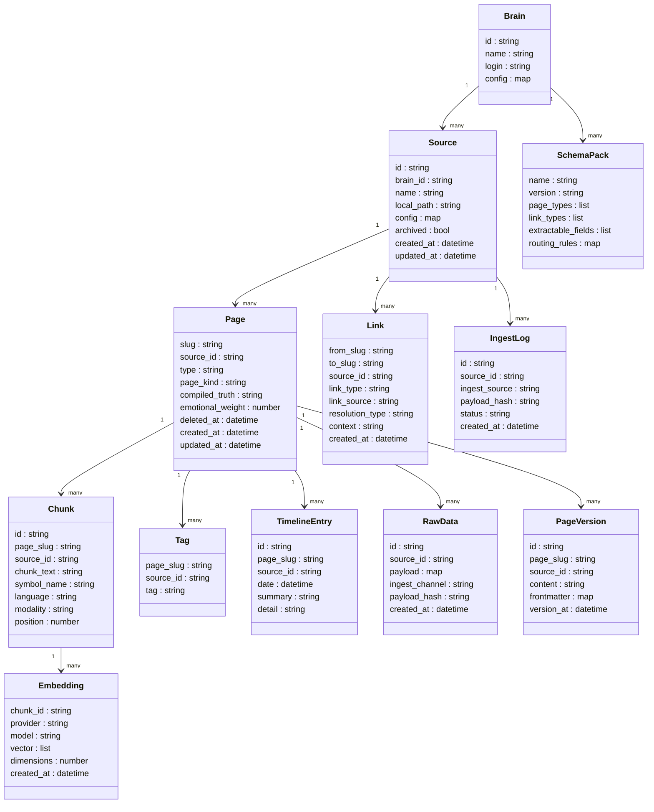

> 本記事は 2026-05-27 時点の公開情報（gbrain v0.41.x 系・master ブランチ）をもとにした技術調査です。

gbrain は、AI エージェント向けの永続メモリ・検索（retrieval）層として設計されたナレッジ合成エンジンです。従来の検索ツールが「生のドキュメント一覧」を返すのに対し、gbrain は「引用付きの合成回答」を生成します。公式の説明は次のとおりです。

> "Search gives you raw pages. GBrain gives you the answer."

## 概要

### 作者と背景

作者は Y Combinator の President/CEO である Garry Tan です。自身の AI エージェントインフラ（OpenClaw / Hermes）用として開発され、MIT ライセンスで公開されています。

### 本番実績

| 指標 | 数値 |
|---|---|
| インデックス済みページ数 | 146,646 |
| 人物エンティティ数 | 24,585 |
| 企業エンティティ数 | 5,339 |
| 自律 cron ジョブ数 | 66 |

検索精度のベンチマーク（240 ページコーパス）では、P@5 49.1% / R@5 97.9% を達成します。グラフ無効時と比較して、P@5 で +31.4 ポイントの改善を示します。

### 設計思想

gbrain は次の 3 原則に基づいて設計されています。

1. Thin harness, fat skills — コアエンジンを最小限に保ち、能力はバンドルスキルに集約する
2. Markdown as recipes — 設定・拡張はすべて可読な Markdown ファイルで管理する
3. Hardware/database/keys ownership — データはローカルまたは自社インフラ上で完結させる

ナレッジの実体は git リポジトリ上の Markdown ファイルとして管理します（system of record）。バックエンドは Postgres（または PGLite）であり、Postgres はその Markdown を検索用にインデックスする役割を担います。git 上のファイルが常に権威コピーです。

## 特徴

### 自己配線ナレッジグラフ

- ページ書き込み時に、LLM 呼び出しなしでエンティティ抽出とリンク生成を実行
- 型付きエッジ（`attended` / `works_at` / `invested_in` / `founded` / `advises` など）で関係を表現
- マルチホップトラバーサルにより、ベクトル検索単体では到達できない関係を辿る

### ハイブリッド検索（RRF）

- ベクトル検索（HNSW on pgvector）、BM25 キーワード検索、Reciprocal Rank Fusion（RRF）、ソースティアブースト、クエリ意図リライトを組み合わせる
- 3 つの検索モード（`conservative` / `balanced` / `tokenmax`）でコスト・品質のトレードオフを選択
- デフォルトは `balanced` + ZeroEntropy Reranker

### 合成回答（synthesis / think）

- `gbrain search` が生のリトリーバル結果を返すのに対し、`gbrain think` は引用付きの合成回答を生成
- ギャップ分析により、ブレインが知らない情報を明示
- すべての主張にソースを付与

### Minions ジョブキュー

- BullMQ 形状の Postgres ネイティブキュー
- クラッシュリカバリー（二相永続化）、シェルジョブ実行、子ジョブのカスケードタイムアウト、外部 API レートリースをサポート
- S3/Supabase ストレージへのアタッチメントに対応

### スキーマパック（schema pack）

- エージェントがページ型構造を進化させる仕組み
- 組み込みパック: `gbrain-base`（people / companies / concepts / meetings / deal など）と `gbrain-recommended`（追加ディレクトリ群）
- `gbrain schema detect → suggest → review-candidates` のフローでカスタムパックを生成
- アクティブパックはすべての読み書きパスに適用

### MCP 統合

- stdio および HTTP（OAuth 2.1）の両トランスポートに対応
- Claude Code / Claude Desktop / Cursor / Windsurf / ChatGPT / Perplexity から接続
- クライアントごとの設定が `docs/mcp/` ディレクトリに用意

### 二エンジン構成（PGLite / Postgres）

- PGLiteEngine — WebAssembly 版 Postgres（17.x）。ゼロコンフィグで約 2 秒で起動。個人用途向け（`docs/INSTALL.md` は約 1,000 Markdown ファイル超で Postgres/Supabase 移行を推奨、README は最大約 50K ページまで対応と記載）。データは `~/.gbrain/brain.db` に保存（変更可）
- PostgresEngine — Supabase 互換のフルマネージド Postgres。大規模・チーム・マルチマシン展開に使用
- 両エンジンは `BrainEngine` インタフェース（約 47 操作）を共通実装

### 類似ツールとの比較

| 比較項目 | vector-only RAG | 一般的な agent memory | gbrain |
|---|---|---|---|
| 検索方式 | ベクトル検索のみ | ベクトル or キーワード | ベクトル(HNSW) + BM25 + RRF + Reranker |
| グラフ層 | なし | なし | 自己配線ナレッジグラフ（LLM コスト 0） |
| LLM 依存 | 埋め込みのみ | 埋め込み + 検索 | 合成回答（think）時のみ任意 LLM を使用 |
| デプロイ | 外部サービス依存が多い | 多様 | PGLite（ゼロコンフィグ）または Postgres 自己ホスト |
| 合成回答の有無 | なし | なし | あり（`gbrain think` で引用付き回答を生成） |

使いどころは次のように整理できます。

- 人物・組織・取引のように「関係性」を辿りたい知識ベースには、ナレッジグラフを持つ gbrain が向きます
- 単発のドキュメント検索で十分なら、vector-only RAG のほうが構成は軽量です
- ローカル完結を優先するなら PGLite、チーム共有や大規模運用なら Postgres+pgvector を選びます

## 構造

### システムコンテキスト図



| 要素名 | 説明 |
|---|---|
| AI エージェント - MCP クライアント | gbrain を記憶層として利用する自律エージェント |
| 人間ユーザー | CLI 経由で直接操作するオペレーター |
| gbrain | マークダウンを Postgres に同期し、ハイブリッド検索と知識合成を提供するエンジン |
| Brain リポジトリ - git - markdown | ユーザーの知識ソース。通常の git リポジトリとして管理される |
| Embedding プロバイダー | テキストをベクトルに変換する外部 API |
| Reranker プロバイダー | 検索結果を意味的に再順位付けする外部 API |
| MCP クライアント - Claude Code 等 | MCP プロトコル経由でツールを呼び出すクライアント群 |

### コンテナ図



#### コンテナ：CLI / MCP Server / Operations Layer

| 要素名 | 説明 |
|---|---|
| CLI | gbrain search / think / sync / embed 等のコマンドを提供するインターフェース |
| MCP Server | stdio および HTTP モードで MCP ツールを公開するサーバー |
| Operations Layer | CLI と MCP の共通実装。約 47 オペレーションを OperationContext で保護する |

#### コンテナ：BrainEngine

| 要素名 | 説明 |
|---|---|
| BrainEngine | PGLite（WASM、ゼロ設定、個人用）と Postgres+pgvector（大規模・共有用）を同一インターフェースで抽象化するストレージ層 |

`BrainEngine` の代表的なメソッド（一部抜粋）は次のとおりです。両エンジンがこの契約を実装するため、CLI / MCP は contract-first で移植可能です。

| 分類 | メソッド例 |
|---|---|
| Pages CRUD | `getPage(slug)` / `putPage(slug, page)` / `deletePage(slug)` / `listPages(filters)` |
| Search | `searchKeyword(query, opts)` / `searchVector(embedding, opts)` |
| Chunks | `upsertChunks(slug, chunks)` / `getChunks(slug)` |
| Links（グラフ） | `addLink(from, to, context, linkType)` / `getLinks(slug)` / `getBacklinks(slug)` / `traverseGraph(slug, depth)` |
| Versions | `createVersion(slug)` / `getVersions(slug)` / `revertToVersion(slug, versionId)` |
| Lifecycle | `connect(config)` / `initSchema()` / `transaction(fn)` / `runMigration(sql)` |

#### コンテナ：Retrieval Pipeline

| 要素名 | 説明 |
|---|---|
| Retrieval Pipeline | ベクトル検索・BM25・RRF 融合・重複排除を束ねるクエリ実行基盤 |

#### コンテナ：Knowledge Graph

| 要素名 | 説明 |
|---|---|
| Knowledge Graph | ページ書き込み時に LLM 呼び出しゼロで typed edge を抽出・蓄積するグラフストア |

#### コンテナ：Synthesis Layer

| 要素名 | 説明 |
|---|---|
| Synthesis Layer | 検索結果を compiled truth + timeline パターンで合成し、引用とギャップ分析を付加する層 |

#### コンテナ：Minions

| 要素名 | 説明 |
|---|---|
| Minions | 二相コミット方式でクラッシュ耐性を持つ Postgres ネイティブのジョブキュー |

#### コンテナ：Schema Pack

| 要素名 | 説明 |
|---|---|
| Schema Pack | ページ型（people / companies / meetings 等）を定義するサブシステム。gbrain-base と gbrain-recommended を同梱 |

### コンポーネント図

Retrieval Pipeline のドリルダウンを示します。



#### コンポーネント：Gather フェーズ

| 要素名 | 説明 |
|---|---|
| Intent Rewrite - expandQuery | LLM がクエリを複数バリアントに展開し、意図に沿った取得範囲を広げる |
| Vector Search - HNSW | pgvector の HNSW インデックスを使ったコサイン類似度検索 |
| BM25 - Full-Text Search | Postgres 全文検索エンジンによる語彙一致検索 |
| Graph Traversal | Knowledge Graph の typed edge を辿り関連ページを隣接取得する |

#### コンポーネント：Merge フェーズ

| 要素名 | 説明 |
|---|---|
| RRF Fusion | 複数ソースのランクリストを RRF スコアで統合する |
| Source-Tier Boost | バックリンク強度・感情的重み・時間減衰を RRF スコアに乗算する |

#### コンポーネント：Filter フェーズ

reranker は graph augment の後・token-budget enforcement の前に挿入され、その後に deduplication が続きます。

| 要素名 | 説明 |
|---|---|
| Reranker - ZeroEntropy | cross-encoder モデル（zerank-2）でランキングを再構成する（約 $0.025/M tokens、p50 +150ms） |
| Best-of-Page 選択 | 同一ページの複数チャンクから最高スコアのものだけを代表として残す |
| Jaccard 重複排除 | 同一 slug の冗長なチャンクを Jaccard 類似度に基づき除去する |
| Type Diversity | ページ型の過剰集中を防ぎ結果の多様性を確保する |
| Density Cap | 1 ページあたりのチャンク出力数に上限を設けて密度を制御する |

#### コンポーネント：検索モード

| 要素名 | 説明 |
|---|---|
| conservative | 低コスト・高速。明確なクエリに最適 |
| balanced | デフォルトモード。ZeroEntropy reranker を使用 |
| tokenmax | 最大再現率。LLM ガイドクエリ展開と reranker をデフォルト ON |

## データ

### 概念モデル

gbrain のデータ構造を所有・利用関係で示します。



| 要素名 | 説明 |
|---|---|
| Brain | データベース境界。個人またはチームスコープ。マルチテナント分離を実施 |
| Source | Brain 内のリポジトリ（Wiki・エッセイ集・ナレッジベース等）。source_id で全テーブルをスコープ |
| Page | Markdown ドキュメント 1 件。slug で一意識別。Source に所属 |
| Chunk | Page を分割した検索単位。ベクトル埋め込みの対象 |
| Tag | Page に付与するカテゴリラベル |
| TimelineEntry | Page の時系列イベント（作成・更新・鮮度追跡） |
| RawData | 抽出・埋め込み前の取り込み層レコード |
| PageVersion | 変更履歴。監査・矛盾検出に利用 |
| Link | Page 間の型付きエッジ（ナレッジグラフ） |
| IngestLog | シグナル取り込みと Webhook 受信の監査証跡 |
| SchemaPack | ページ型・リンク型・抽出フィールドを定義するパック |
| Embedding | Chunk のベクトル表現。複数プロバイダ対応 |

### 情報モデル

主要エンティティの属性を示します。



| 要素名 | 説明 |
|---|---|
| Brain | データベース全体の境界。ログイン単位でアクセス制御 |
| Source | `.gbrain-source` ドットファイルで識別。複数ティアの優先度解決 |
| Page | slug が主キー。type は SchemaPack のパスプレフィックスから推論 |
| Chunk | 多段チャンキング（再帰・意味・LLM 誘導）で生成。tree-sitter でコード対応 |
| Embedding | 複数プロバイダレシピ対応。HNSW インデックスでコサイン類似度検索 |
| Link | ゼロ LLM で Wikilink 構文から自動抽出。typed edge 例: attended / works_at / invested_in / founded / advises / mentions |
| Tag | ページと取得ランキングのブーストシグナルに利用 |
| TimelineEntry | 情報鮮度ギャップ分析に利用 |
| RawData | Webhook・キャプチャ・インポート経路の取り込み前レコード |
| PageVersion | 版管理レコード。疑わしい矛盾のサンプリングに利用 |
| IngestLog | 取り込み監査証跡。source・timestamp・payload_hash を記録 |
| SchemaPack | ページ型・リンク型・抽出フィールド・ルーティングルールを定義 |

### スキーマパック構造

gbrain は 2 種類の組み込みパックと自作パックをサポートします。

#### gbrain-base（デフォルト）

ゼロ設定で動作します。Garry Tan 本人のプロダクション Brain トポロジーと一致します。

| ディレクトリ | 扱うエンティティ |
|---|---|
| people/ | 個人 |
| companies/ | 組織・企業 |
| concepts/ | メンタルモデル・フレームワーク |
| meetings/ | 会議記録 |
| deal/ | 投資・取引 |
| daily/ | 日次ログ |
| originals/ | 一次資料 |
| writing/ | エッセイ・ドラフト |

#### gbrain-recommended（拡張パック）

gbrain-base に複数ディレクトリを追加します。`gbrain schema use gbrain-recommended` で有効化します。

| ディレクトリ | 扱うエンティティ |
|---|---|
| source/ | 生インポート・スナップショット |
| place/ | 場所情報 |
| trip/ | 旅程・移動記録 |
| conversation/ | 会話ログ |
| personal/ | 健康・内省 |
| civic/ | 政策・法律・選挙 |
| project/ | アクティブな作業プロジェクト |
| ideas/ | 未実行アイデア |
| programs/ | 長期ライフワークストリーム |
| org/ | 組織戦略・内部プロセス |
| media/ | コンテンツ運用・SNS |
| household/ | 不動産・家庭管理 |
| hiring/ | 採用パイプライン・評価 |

各ディレクトリは `README.md` リゾルバを持ちます。リゾルバは「何が属するか」と「隣接ディレクトリとの曖昧さ解消ルール」を定義します。

## 構築方法

### 前提条件

| 項目 | 内容 |
|---|---|
| ランタイム（必須） | Bun（主）/ Node 18+ |
| DB（ローカル） | PGLite（バンドル済み、約 1,000 Markdown ファイル超で Postgres 移行を推奨。データは `~/.gbrain/brain.db`） |
| DB（スケール） | Postgres 14+ + pgvector / Supabase Session Pooler |
| API キー | `ZEROENTROPY_API_KEY`（推奨）または `OPENAI_API_KEY` |

### インストール手段 A: agent-driven（推奨）

AI エージェント（Claude Code / Codex / Cursor 等）に以下を貼り付けて委任します。所要時間は約 30 分です。

```bash
# エージェントへのプロンプト
Retrieve and follow the instructions at:
https://raw.githubusercontent.com/garrytan/gbrain/master/INSTALL_FOR_AGENTS.md
```

対応プラットフォーム: OpenClaw（Render）、Hermes（Railway）、既存エージェント（Codex / Claude Code / Cursor）。

### インストール手段 B: CLI スタンドアロン

```bash
# 1. Bun インストール
curl -fsSL https://bun.sh/install | bash
export PATH="$HOME/.bun/bin:$PATH"

# 2. gbrain グローバルインストール
bun install -g github:garrytan/gbrain
gbrain --version

# 3. API キー設定
export ZEROENTROPY_API_KEY=ze-...    # 推奨
export OPENAI_API_KEY=sk-...         # フォールバック
export ANTHROPIC_API_KEY=sk-ant-...  # クエリ展開（任意）

# 4. ブレイン初期化（PGLite、約 2 秒）
gbrain init --pglite

# 5. ヘルスチェック
gbrain doctor

# 6. マークダウンの取り込み
gbrain import ~/notes/

# 7. 動作確認
gbrain search "テスト検索"
```

グローバルインストールが失敗した場合のリカバリ:

```bash
git clone https://github.com/garrytan/gbrain.git ~/gbrain
cd ~/gbrain && bun install && bun link
```

Postgres バックエンドを使う場合は、初期化前に `pgvector` 拡張を有効化します。

```bash
# pgvector 拡張の有効化（DBA 権限で 1 回だけ実行）
psql "$DATABASE_URL" -c "CREATE EXTENSION IF NOT EXISTS vector;"

# Postgres で初期化
gbrain init --url "$DATABASE_URL"
```

### `gbrain init` オプション

| フラグ | 意味 |
|---|---|
| `--pglite` | ローカル DB を `~/.gbrain/brain.db` に作成 |
| `--mcp-only` | ローカル DB なしの thin-client モード |
| `--url <URI>` | Postgres 接続文字列を直接指定 |
| `--no-embedding` | CI/Docker 環境で embedding 設定を後回し |
| `--embedding-model <provider>:<model>` | プロバイダを明示指定 |

### MCP 統合

#### Claude Code（ローカル、推奨）

```bash
claude mcp add gbrain -- gbrain serve
```

または MCP 設定ファイルに手動追記します（macOS は `~/Library/Application Support/Claude/`、Linux は `~/.config/claude/`）。

```json
{
  "mcpServers": {
    "gbrain": { "command": "gbrain", "args": ["serve"] }
  }
}
```

#### Cursor / Windsurf（stdio MCP クライアント）

MCP 設定ファイルに追加します。

```json
{ "command": "gbrain", "args": ["serve"] }
```

#### Claude Desktop / リモートクライアント（HTTP + OAuth 2.1）

```bash
gbrain serve --http   # HTTP MCP サーバー起動 + /admin ダッシュボード
```

ngrok トンネル経由での接続例:

```bash
claude mcp add gbrain -t http https://your-brain.ngrok.app/mcp \
  -H "Authorization: Bearer YOUR_GBRAIN_TOKEN"
```

### embedding / reranker プロバイダ設定

複数のレシピが利用可能です。詳細は `docs/integrations/` を参照してください。

| 種別 | プロバイダ |
|---|---|
| ホスト型 | ZeroEntropy（デフォルト推奨）/ OpenAI / Voyage / Google Gemini / Azure OpenAI / OpenRouter / MiniMax 等 |
| ローカル型 | Ollama / llama.cpp llama-server / LiteLLM proxy |
| reranker | ZeroEntropy `zerank-2`（tokenmax モードのデフォルト）/ llama-server-reranker |

設定コマンド:

```bash
# ZeroEntropy reranker を有効化
export ZEROENTROPY_API_KEY=ze-...
gbrain config set search.reranker.enabled true

# embedding モデルを明示変更
gbrain config set embedding-model "openai:text-embedding-3-small"

# 設定確認
gbrain config get embedding-model
gbrain models doctor
```

## 利用方法

### 必須パラメータ早見表

| コマンド | 必須引数 | 主なオプション |
|---|---|---|
| `gbrain capture` | `"テキスト"` または `--file` / `--stdin` | `--quiet` |
| `gbrain search` | `"クエリ"` | `--explain` |
| `gbrain think` | `"クエリ"` | — |
| `gbrain graph-query` | `<slug>` | `--type`, `--depth`, `--direction` |
| `gbrain schema use` | `<pack-name>` | — |
| `gbrain config set` | `<key> <value>` | — |

### データ取り込み: `gbrain capture`

```bash
# テキスト直接入力
gbrain capture "覚えておきたい内容"

# ファイルから取り込み
gbrain capture --file ./notes/today.md

# パイプから取り込み
echo "パイプからの入力" | gbrain capture --stdin

# スラッグのみ返す（スクリプト組み込み用）
SLUG=$(gbrain capture "メモ" --quiet)

# Webhook 経由
curl -X POST https://your-brain/ingest \
  -H "Authorization: Bearer $TOKEN" \
  -H "Content-Type: text/markdown" \
  -d "# 内容"
```

### 検索: `gbrain search` vs `gbrain think`

| コマンド | 特徴 | LLM コスト |
|---|---|---|
| `gbrain search` | ハイブリッド検索でページをスコア順に返す（高速） | なし |
| `gbrain think` | 検索 + LLM 合成 + 引用 + ギャップ指摘 | あり |

```bash
# 生の検索（LLM コストなし）
gbrain search "ポートフォリオ企業の AI 担当者は？"

# 検索スコアの内訳を表示
gbrain search "クエリ" --explain

# LLM 合成・引用付き回答
gbrain think "戦略的な質問"
```

検索モード（コスト/品質のトレードオフ）:

```bash
gbrain config set search.mode conservative   # 低コスト
gbrain config set search.mode balanced       # デフォルト推奨
gbrain config set search.mode tokenmax       # 最大再現率・高コスト
```

### ナレッジグラフ検索: `gbrain graph-query`

```bash
# マルチホップ探索
gbrain graph-query <slug>

# オプション付き例
gbrain graph-query people/<slug> --type attended --depth 2
gbrain graph-query companies/<slug> --type works_at --direction in
```

| オプション | 意味 |
|---|---|
| `--type` | エッジ種別（attended / works_at / invested_in / founded / advises 等） |
| `--depth N` | グラフ探索の深さ |
| `--direction in\|out\|both` | エッジ方向 |

エッジはページ書き込み時にゼロ LLM で自動抽出されます。

### schema 管理: `gbrain schema`

```bash
gbrain schema active              # 現在のパックとティアを表示
gbrain schema detect              # ファイルシステムからタイプ候補を提案
gbrain schema suggest             # LLM による候補の精製
gbrain schema review-candidates   # 候補を人間がレビュー
gbrain schema review-candidates --apply  # 確認済み候補を適用
gbrain schema use my-pack         # カスタムパックを有効化
```

### 設定解決チェーン（7 ティア）

設定は以下の順で解決されます（上位が優先）。

| 優先度 | ティア | 説明 |
|---|---|---|
| 1（最高）| per-call flag | `--embedding-model` 等の CLI フラグ |
| 2 | 環境変数 | `OPENAI_API_KEY` 等 |
| 3 | per-source DB key | ソースごとの DB 設定 |
| 4 | brain-wide DB key | ブレイン全体の DB 設定 |
| 5 | `gbrain.yml` | プロジェクト設定ファイル |
| 6 | `~/.gbrain/config.json` | ユーザーグローバル設定 |
| 7（最低）| gbrain-base デフォルト | スキーマパックのデフォルト値 |

`gbrain.yml` の設定例:

```yaml
embedding:
  model: openai:text-embedding-3-small
search:
  mode: balanced
  reranker:
    enabled: true
doctor:
  autoHeal:
    enabled: true
    minInterval: "6h"
    skip: [image_assets, multi_source_drift]
```

設定操作コマンド:

```bash
gbrain config set search.mode balanced
gbrain config get search.mode
gbrain config set search.reranker.enabled true
```

`.gbrain-source` ファイルはディレクトリごとのスキーマパック/ソースルーティングを定義します。

## 運用

### sync 運用

通常の同期はリポジトリ更新後に埋め込みを補完する 2 ステップで行います。

```bash
gbrain sync --repo /data/brain && gbrain embed --stale
```

cron 推奨スケジュール（15 分ごと）:

```cron
*/15 * * * * gbrain sync --repo /data/brain && gbrain embed --stale
0 2  * * * gbrain dream      # 毎晩メンテナンス
0 3  * * 0 gbrain doctor --json && gbrain embed --stale  # 週次
```

OpenClaw / Hermes のエージェント cron でも同じコマンドを使います。

### federated multi-source sync（v0.41.13.0+）

複数ソースを持つ federated brain では、1 ソースのタイムアウトが全体をブロックしないよう per-source ループ + OS `timeout` を使います。

```bash
# wedged ロックを先に解除
gbrain sync --break-lock --all --max-age 1800

# per-source ループ
for src in $(gbrain sources list --json | jq -r '.[].id'); do
  timeout 600 gbrain sync --source "$src" --timeout 540 || true
done
```

- `--timeout` で停止した場合、`partial` ステータスで終了し `last_commit` は進みません
- 次回実行時に `content_hash` の短絡判定で再開地点を自動検出します
- `--max-age 1800` は取得タイムスタンプ基準でロックを自己修復します

### 状態確認・ヘルスチェック

```bash
# 総合ヘルスチェック（JSON 出力）
gbrain doctor --json

# ブロッキング・ロックの検出
gbrain doctor --locks

# ページ数・同期ステータス確認
gbrain stats

# 検索ステージごとの集計
gbrain search stats

# 最終 sync タイムスタンプ確認
gbrain config get sync.last_run

# 未埋め込みチャンクを補完
gbrain embed --stale

# CLI アップデート確認
gbrain check-update --json

# JSONB 二重エンコード修復（Postgres 専用、v0.12.2+）
gbrain repair-jsonb --dry-run --json
```

`gbrain models doctor` は設定済みモデルに 1 トークンのプローブを送り、サイレント障害を検出します。

### doctor auto-heal

```yaml
doctor:
  autoHeal:
    enabled: true
    minInterval: "6h"
    skip: [image_assets, multi_source_drift]
```

- `enabled: true` で診断後に修復コマンドを自動実行します
- `minInterval` で実行間隔を下限設定し過剰修復を防ぎます
- `skip` で特定チェックを除外します

### dream cycle（cron enrichment）

`gbrain dream` は全メンテナンスフェーズをブロッキングで 1 回実行します。cron との組み合わせに最適です。

```bash
gbrain dream
```

主要フェーズが順番に実行されます。

| フェーズ | 内容 |
|---|---|
| lint | ページ構造検証・ファイルシステム修復 |
| backlinks | 双方向リンク整合 |
| sync | Git 差分 → DB 同期 |
| synthesize | 会話ログ → ブレインページ変換 |
| extract | エンティティ抽出・メタデータ付与 |
| patterns | クロスセッションテーマ検出 |
| recompute_emotional_weight | サリエンス（重要度）スコア更新 |
| embed | ベクトル埋め込み生成 |
| orphans | インバウンドリンクゼロページの検出 |

dream サイクルが自動処理する enrichment: 重複排除・引用修正・サリエンス採点・矛盾検出。

### autopilot デーモン

`gbrain autopilot` は dream サイクルをインターバルで自動スケジュールする常駐サービスです。

```bash
gbrain autopilot
```

- Postgres 環境では `autopilot-cycle` ジョブを Minions キューに投入します
- PGLite / `--inline` では同一プロセス内でサイクルを実行します
- PID ファイルと DB ロックの二重ロックで多重起動を防止します

### Minions ジョブキュー（Postgres-native, BullMQ インスパイア）

Postgres ネイティブのジョブキューで、BullMQ の設計思想を踏襲しながらクラッシュ耐性を持ちます。

```bash
# ワーカー起動（自動再起動ラッパー）
gbrain jobs supervisor

# ジョブクレームを実行
gbrain jobs work
```

主要な機能:

- durable subagent: すべての LLM ターンを `subagent_messages` / `subagent_tool_executions` に永続化。クラッシュ後も `pending` ツールのみ再実行して再開
- shell job（v0.14.0+）: 決定論的タスク（API フェッチ・トークンリフレッシュ・スクレイプ）を LLM ゲートウェイからオフロード。有効化に `GBRAIN_ALLOW_SHELL_JOBS=1` が必要
- child job cascading timeout: 親ジョブが `waiting-children` 状態でブロックし、全子ジョブの終了後に集約。`timeout_ms` で子タイムアウトを設定
- rate leasing: `subagent_rate_leases` テーブルで Anthropic API の同時呼び出し上限を管理（`GBRAIN_ANTHROPIC_MAX_INFLIGHT` で変更可）
- S3 / Supabase storage: `gbrain files mirror` でファイルをストレージバックエンドにアップロード。`gbrain files redirect` でローカルファイルをメタデータポインタに置換

ジョブ状態ライフサイクル: `waiting` → `active` → `completed` / `failed`（BullMQ 形状の状態名）。子ジョブ待ちでは `waiting-children` 状態を取ります。

## ベストプラクティス

### 検索モード選択

3 つのバンドル設定プロファイルから用途に応じて選択します。

| モード | 特性 | 用途 |
|---|---|---|
| conservative | 低トークン・低コスト | 高精度。明確なクエリに最適 |
| balanced | 中庸。reranker ON | デフォルト。一般的なクエリ |
| tokenmax | 最大再現率・高コスト | LLM ガイドクエリ展開。広範な質問に使用 |

デフォルトは `balanced` + ZeroEntropy reranker です。

### reranker 有効化

conservative / balanced では明示的に有効化します。tokenmax では `ZEROENTROPY_API_KEY` があればデフォルト ON です。

```bash
export ZEROENTROPY_API_KEY=<your_key>
gbrain config set search.reranker.enabled true
gbrain models doctor   # プロバイダー疎通確認
```

- reranker は graph augment（typed-edge traversal）の後・token-budget enforcement の前に挿入されます。その後に deduplication が続きます
- コスト/レイテンシ: 約 `$0.025/M tokens`、p50 で約 +150ms（`docs/architecture/RETRIEVAL.md`）
- Floor Ratio Gate（v0.35.6.0+）がメタデータブーストによる弱候補の通過を防止します

### source-tier boost とスコアリング

ハイブリッド検索の多層スコアリング構成は次のとおりです。

- Backlink Boost: ページ接続数に比例したスコア乗数
- Salience Boost: 感情強度・出現頻度に基づく重み付け
- Recency Boost: ページ年齢に基づく減衰係数
- RRF（Reciprocal Rank Fusion）: キーワード検索とベクトル検索のランクリストを統合

検索ステージごとのスコア・ブースト・失敗内訳は `gbrain search stats` で確認します。クエリに `--explain` フラグを付けると各ステージの内訳を表示します。

### skillpack 運用

スキルパックは tool-agnostic なマークダウンファイルとして提供されます。

```bash
gbrain skillpack init my-pack
gbrain skillpack doctor my-pack --fix --yes
gbrain skillpack pack my-pack          # 決定論的 tarball + SHA-256
gbrain skillpack search <query>
gbrain skillpack info <name>
gbrain skillpack scaffold <source>
```

### contradiction detection と eval/replay

```bash
# 矛盾ペアのサンプリングと LLM 判定
gbrain eval suspected-contradictions

# LongMemEval ベンチマーク（ハイブリッド検索性能）
gbrain eval longmemeval
```

`gbrain eval suspected-contradictions` は取得ペアに日付プレフィルタを適用し、クエリ条件付き LLM ジャッジで事実矛盾を検出します。判定結果は永続キャッシュに保存されます。

### cron 運用全体像

複数の cron ジョブを quiet hours（オフライン時間帯）とタイムゾーン考慮で組み合わせます。

- 決定論的タスクは Minions shell job でオフロードし、LLM ゲートウェイを節約します
- dream サイクルをオフライン時間に走らせることで、エージェント起動時には最新の知識グラフが利用可能になります
- `gbrain jobs supervisor` でワーカーの自動再起動を保証します
- brain-first ルール: 外部 API 呼び出し前にまずブレインを検索します

## トラブルシューティング

| 症状 | 原因 | 対処 |
|---|---|---|
| embedding 生成失敗・検索結果ゼロ | embedding dimension mismatch（モデル切替後など） | `gbrain doctor --json` を実行。修復コマンドが paste-ready で出力されるので貼り付けて実行 |
| `.begin() is not a function` エラー | `DATABASE_URL` が Transaction mode pooler（Supabase port 6543）を指している | Session mode pooler（port 5432）または直接接続 URL に切り替える。Transaction mode では `prepare=false` を追加 |
| Supabase bulk write 失敗（wiki リンク消失） | pooler の一時的な接続断（pooler blips） | v0.41.19.0+ の自動リトライが適用される。環境変数でチューニング: `GBRAIN_BULK_MAX_RETRIES`（デフォルト 3）/ `GBRAIN_BULK_RETRY_BASE_MS` / `GBRAIN_BULK_RETRY_MAX_MS` |
| 未埋め込みチャンクが残る | sync 後の embed 未実行、またはプロバイダーキー未設定 | `gbrain embed --stale` を実行。embedding プロバイダーは `OPENAI_API_KEY` / `ZEROENTROPY_API_KEY` / `VOYAGE_API_KEY` から自動検出 |
| federated sync がタイムアウトで止まる | 1 ソースのタイムアウトが全体をブロック | per-source ループ + `timeout 600` パターンを使用（v0.41.13.0+）。`--max-age 1800` で wedged ロックを自己修復 |
| sync が進まない（`blocked_by_failures`） | インポートエラーでチェックポイントが更新されない | `gbrain sync --skip-failed` で失敗ファイルをスキップ。後で `--retry-failed` で再試行 |
| モデルへの接続が取れない・サイレント障害 | AI プロバイダーのエンドポイント障害 | `gbrain models doctor` で 1 トークンプローブを実行。障害モデルの特定後、バックアップモデルに切り替え |
| マルチインスタンスで autopilot が競合 | PID ファイルまたは DB ロックの重複 | `gbrain doctor --locks` でブロッキングバックエンドを特定。`gbrain sync --break-lock` でロックを解除 |
| JSONB パースエラー（Postgres）| JSONB 二重エンコード | `gbrain repair-jsonb --dry-run --json` で影響範囲を確認後、`--dry-run` なしで実行（v0.12.2+、Postgres 専用） |

## まとめ

gbrain は、git 上の Markdown を system of record としつつ、Postgres にインデックスして「自己配線ナレッジグラフ + ハイブリッド検索（RRF）+ 引用付き合成回答」を提供する AI エージェント向けメモリ層です。PGLite によるゼロコンフィグ起動から Postgres+pgvector の大規模運用まで、同一の `BrainEngine` インタフェースと MCP 統合で一貫して扱える点が特徴です。

この記事が少しでも参考になった、あるいは改善点などがあれば、ぜひリアクションやコメント、SNSでのシェアをいただけると励みになります！

## 参考リンク

- 公式ドキュメント・リポジトリ
  - [GBrain GitHub リポジトリ](https://github.com/garrytan/gbrain)
  - [GBrain README](https://raw.githubusercontent.com/garrytan/gbrain/master/README.md)
  - [GBrain Skillpack ドキュメント](https://github.com/garrytan/gbrain/blob/master/docs/GBRAIN_SKILLPACK.md)
  - [GBrain Recommended Schema](https://raw.githubusercontent.com/garrytan/gbrain/master/docs/GBRAIN_RECOMMENDED_SCHEMA.md)
  - [INSTALL_FOR_AGENTS.md](https://raw.githubusercontent.com/garrytan/gbrain/master/INSTALL_FOR_AGENTS.md)
  - [docs/integrations ディレクトリ](https://github.com/garrytan/gbrain/tree/master/docs/integrations)
  - [docs/mcp ディレクトリ](https://github.com/garrytan/gbrain/tree/master/docs/mcp)
- 解説・リファレンス（deepwiki）
  - [GBrain deepwiki](https://deepwiki.com/garrytan/gbrain)
  - [Search and Retrieval](https://deepwiki.com/garrytan/gbrain/4-search-and-retrieval)
  - [Database Schema and Migrations](https://deepwiki.com/garrytan/gbrain/2.2-database-schema-and-migrations)
  - [Brain and Source Management](https://deepwiki.com/garrytan/gbrain/2.1-brain-and-source-management)
  - [Getting Started and Installation](https://deepwiki.com/garrytan/gbrain/1.1-getting-started-and-installation)
  - [System and Infrastructure Commands](https://deepwiki.com/garrytan/gbrain/5.2-system-and-infrastructure-commands)
  - [Autopilot, Dream and Maintenance Cycle](https://deepwiki.com/garrytan/gbrain/5.3-autopilot-dream-and-maintenance-cycle)
  - [Durable Agent Runtime](https://deepwiki.com/garrytan/gbrain/6.3-durable-agent-runtime)
  - [Minions Job Queue](https://deepwiki.com/garrytan/gbrain/7-minions-job-queue)
  - [Git Sync and Multi-Source Brains](https://deepwiki.com/garrytan/gbrain/3.4-git-sync-and-multi-source-brains)
  - [Configuration and Deployment](https://deepwiki.com/garrytan/gbrain/11-configuration-and-deployment)
- 外部依存・ベンチマーク
  - [ZeroEntropy（reranker / embedding プロバイダー）](https://www.zeroentropy.dev/)
  - [LongMemEval（長期記憶ベンチマーク）](https://github.com/xiaowu0162/LongMemEval)
