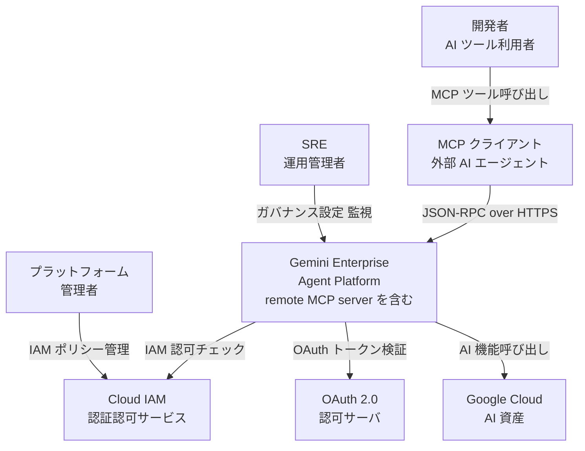
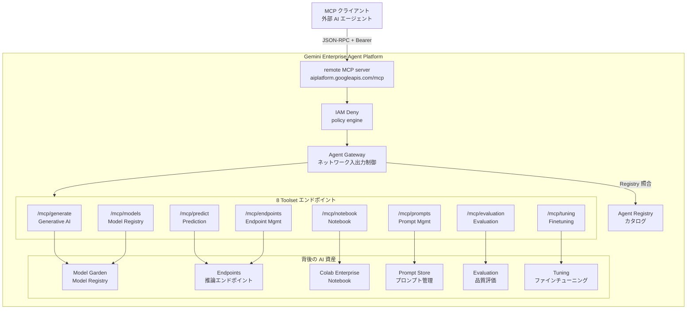
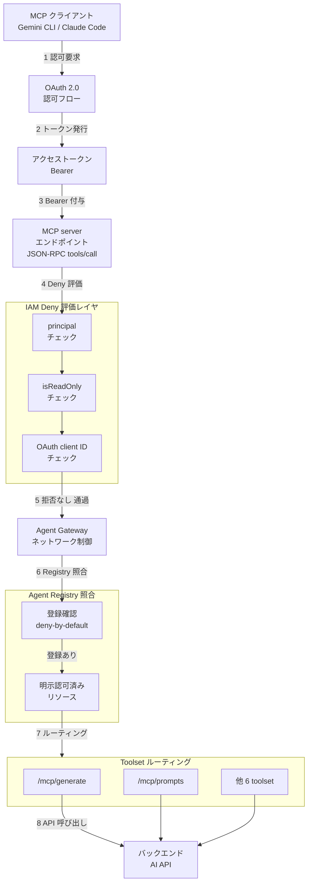
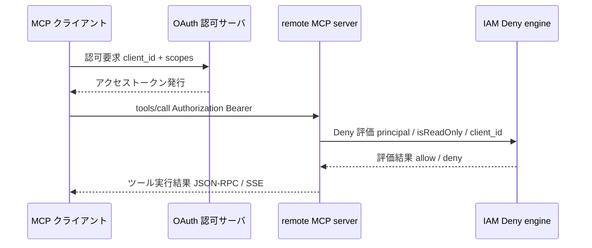
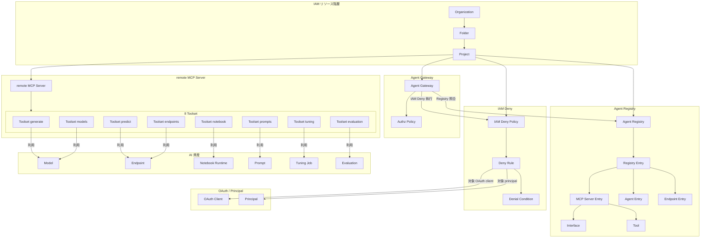
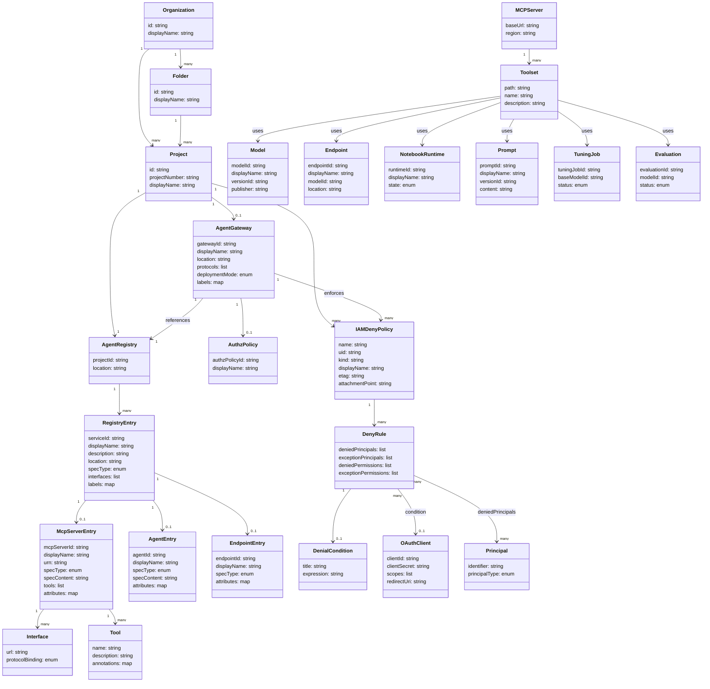

Google Cloud が提供するフルマネージドの remote MCP (Model Context Protocol) server を調査します。外部 AI エージェント (Claude Code / Gemini CLI / Antigravity CLI / ChatGPT / カスタムアプリ) を Google Cloud 内の AI 資産へ MCP 標準で接続する「接続面」を、構造・データ・構築・利用・運用の観点で整理します。起点は Google Cloud Blog の発表記事 (2026-07-01 公開) です。

## 概要

### 何を解決するか

企業の AI 活用が進むにつれ、外部 AI エージェントが Google Cloud 内の AI 資産にアクセスする場面が増えています。これまでは各クライアントから個別に認証・統合コードを書く必要があり、IT 部門によるガバナンス適用も困難でした。

Gemini Enterprise Agent Platform remote MCP server は、この課題を「ツール追加」ではなく「接続面とガバナンスの設計」として解決します。外部エージェントが触れる Google Cloud AI 資産への入口を 1 か所に集約し、MCP 標準プロトコル経由で標準化された接続を提供します。開発チームは統合コードを書かずに既存の IDE やエージェントから Google Cloud 資産を利用でき、IT チームは IAM Deny ポリシーで主体・OAuth クライアント・read-only 区分の単位で利用制御を後から一元的に適用できます。

### 旧 Vertex AI との関係

本基盤は「Vertex AI」のブランドを引き継ぐ形で「Gemini Enterprise Agent Platform」として提供されています。モデルトレーニング・AutoML・Model Registry・Endpoints・Pipelines など既存の Vertex AI 機能は、引き続きプラットフォームのサブ機能として利用できます。API エンドポイントは従来どおり `aiplatform.googleapis.com` を使用します。エージェント基盤としての位置づけを前面に出した名称になっています。

### 中核となる 4 コンポーネント

remote MCP server 単体は「接続口」に過ぎません。実際のガバナンスは次の 4 コンポーネントが協調して担います。

| コンポーネント | 役割 |
|---|---|
| remote MCP server | 外部エージェントが Google Cloud AI 資産に接続する MCP 標準の入口。8 toolset を公開する |
| Agent Registry | MCP server / ツール / エージェントの中央カタログ。登録・検索・ガバナンスの一元ハブ |
| Agent Gateway | ネットワーク層の egress 統制点。エージェント identity を IAP で検証し、Agent Registry 未登録ホストへの接続をデフォルトでブロックする (deny-by-default) |
| IAM Deny | Google マネージド MCP server の呼び出し権限 `mcp.googleapis.com/tools.call` を、principal・read-only 区分・OAuth クライアント ID・サービス単位で拒否するポリシー |

IAM Deny と Agent Gateway は別系統の制御です。IAM Deny は Google マネージド MCP server の tool call を IAM 権限レベルで拒否します。Agent Gateway は egress 経路で Agent Registry への登録を必須化し、IAP の明示 allow を強制します。両者を別レイヤーとして組み合わせることで「deny-by-default + 明示認可」を実現します。

## 特徴

- **MCP 標準準拠でベンダーロックインを回避** — open MCP spec (JSON-RPC 2.0 over HTTP/SSE) に準拠します。Claude Code / Gemini CLI / Antigravity CLI / ChatGPT など任意の MCP クライアントが接続できます。
- **8 toolset を即時利用可能** — 生成 AI・推論・Colab Enterprise Notebook・エンドポイント管理・モデル管理・ファインチューニング・品質評価・プロンプト管理の 8 領域をカバーします。
- **IAM Deny で粒度制御** — read-only / read-write 区分・主体 (ユーザー / サービスアカウント)・OAuth クライアント ID・サービスの組み合わせで呼び出しをブロックできます。org / folder / project の各レベルで適用します。個別のツール名や toolset パス単位の判定属性は提供されないため、ツール種別の制御は read-only 区分や OAuth クライアント ID で表現します。
- **Agent Registry による中央カタログ** — MCP server・ツール・エージェントをキーワード / プレフィックス検索で発見でき、接続先のメタデータを一元管理します。
- **deny-by-default** — Agent Gateway が存在する場合、Agent Registry に未登録の MCP server・エージェント・ツールへのアクセスをデフォルトでブロックします。明示的な認可のみを許可します。
- **マネージドでセットアップ最小** — Gemini Enterprise Agent Platform API を有効化するだけで remote MCP server が利用可能になり、インフラ構築・運用は不要です。
- **リージョン選択に対応** — グローバル・リージョナル・マルチリージョン (EU / US) の各エンドポイントを選べます。データレジデンシー要件に合わせて使い分けます。
- **可観測性** — Cloud Logging / Cloud Trace と連携し、ツール呼び出しの監査証跡を取得できます。

## 構造

C4 model の 3 段階で内部構造を図解します。各図の直後に要素名と説明のテーブルを配置します。

### システムコンテキスト図



| 要素名 | 説明 |
|---|---|
| 開発者 | AI ツールを介して Agent Platform の MCP ツールを呼び出す利用者 |
| SRE | Agent Platform の運用監視・ガバナンス設定を担う運用管理者 |
| プラットフォーム管理者 | IAM ポリシーを設定し MCP ツールへのアクセス権を統制する管理者 |
| MCP クライアント | MCP 標準に準拠した外部 AI エージェント・IDE・CLI ツール |
| Cloud IAM | Google Cloud 全体の認証認可サービス。Deny ポリシーを評価する |
| OAuth 2.0 認可サーバ | MCP クライアントのアクセストークンを発行・検証する認可サーバ |
| Gemini Enterprise Agent Platform | remote MCP server / Agent Gateway / Agent Registry / toolset を包含するマネージド基盤 |
| Google Cloud AI 資産 | Model Garden・Model Registry・Endpoints・Notebooks など MCP ツールが背後で操作する AI リソース |

### コンテナ図



#### Agent Platform コア

| 要素名 | 説明 |
|---|---|
| remote MCP server | `aiplatform.googleapis.com/mcp/*` を束ねるマネージド MCP エンドポイント。API 有効化で自動的に利用可能になる |
| IAM Deny policy engine | MCP ツール呼び出し権限に対し Deny ポリシーを評価するエンジン。principal / read-only 属性 / OAuth client ID の 3 軸で制御する |
| Agent Gateway | クライアント間の通信を保護するネットワーク制御コンポーネント。deny-by-default で未登録リソースをブロックする |
| Agent Registry | MCP server / tool / agent のメタデータを一元管理するカタログ。Agent Gateway がポリシー適用前に参照する |

#### 8 Toolset エンドポイント

| 要素名 | 説明 |
|---|---|
| /mcp/generate | 生成 AI ツール群。コンテンツ生成・トークンカウントを提供する |
| /mcp/predict | モデル推論ツール群。raw レベルの prediction を提供する |
| /mcp/notebook | Colab Enterprise Notebook のランタイム・実行管理ツール群 |
| /mcp/endpoints | AI 推論エンドポイントのライフサイクル管理ツール群 |
| /mcp/models | Model Registry へのモデル登録・デプロイ管理ツール群 |
| /mcp/tuning | ファインチューニングジョブの管理ツール群 |
| /mcp/evaluation | モデル品質・インスタンス評価ツール群 |
| /mcp/prompts | プロンプトのエンジニアリング・バージョン管理ツール群 |

#### 背後の AI 資産

| 要素名 | 説明 |
|---|---|
| Model Garden / Model Registry | 公開モデル・登録モデルを保管する AI 資産 |
| Endpoints | デプロイ済み推論エンドポイントを管理する AI 資産 |
| Colab Enterprise Notebook | マネージド Jupyter 実行環境 |
| Prompt Store | プロンプトテンプレートを格納・バージョン管理する資産 |
| Evaluation | モデル品質評価を実行するサービス |
| Tuning | ファインチューニングジョブを実行するサービス |

### コンポーネント図

MCP リクエスト 1 本が通る経路をドリルダウンします。



| 要素名 | 説明 |
|---|---|
| MCP クライアント | 設定ファイルでサービス URL と OAuth 設定を保持する外部クライアント |
| OAuth 2.0 認可フロー | クライアントが client_id / scopes を提示してアクセストークンを取得するステップ |
| アクセストークン | Bearer トークン。リクエストヘッダ `Authorization: Bearer` に付与する |
| MCP server エンドポイント | `method: "tools/call"` を受け取る JSON-RPC 2.0 エントリポイント。`Accept: application/json, text/event-stream` で SSE にも対応する |
| principal チェック | IAM Deny ポリシーで呼び出し元 identity を評価するステップ |
| isReadOnly チェック | ツールが read-only か否かを属性で判定するステップ。read-write ツールを一括ブロックするポリシーに使う |
| OAuth client ID チェック | `request.auth.oauth.client_id` でクライアントアプリ単位にアクセスを制御するステップ |
| Agent Gateway | 通信を保護し、エージェント identity を検証するコンポーネント |
| Agent Registry 照合 | 未登録の MCP server / tool へのアクセスをデフォルトでブロックし、登録済みリソースのみ通過させる照合ステップ |
| 明示認可済みリソース | Agent Registry に登録され IAM で許可されたリソース。このステップを通過したリクエストだけが toolset へ進む |
| Toolset ルーティング | `params.name` で指定されたツール名を対応する toolset エンドポイントへ振り分けるルーター |
| バックエンド AI API | toolset が最終的に呼び出す Generative AI / Prediction / Notebook 等のマネージドサービス |

### OAuth 認証フロー (補助図)



| 要素名 | 説明 |
|---|---|
| MCP クライアント | 設定ファイルに認証情報を保持し OAuth フローを起動するクライアント |
| OAuth 認可サーバ | client_id と要求 scopes を検証してアクセストークンを発行する |
| remote MCP server | Bearer トークンを受け取り、IAM Deny engine にポリシー評価を委譲するエントリポイント |
| IAM Deny engine | MCP ツール呼び出し権限に対し Deny ポリシーを評価し allow / deny を返す判定コンポーネント |

## データ

### 概念モデル

登場するエンティティを所有関係 (subgraph の入れ子) と参照・利用関係 (矢印) で表します。



| エンティティ | 役割の要約 |
|---|---|
| Organization / Folder / Project | IAM Deny policy と Agent Registry のスコープを定める階層ノード |
| Agent Registry | MCP server / agent / endpoint を一元管理する中央カタログ |
| Registry Entry | Agent Registry への登録単位。type によって MCP Server / Agent / Endpoint のいずれかの spec を持つ |
| MCP Server Entry | Registry Entry のうち type が mcpServer のもの。Interface と Tool の一覧を保持する |
| Agent Entry | Registry Entry のうち type が agent のもの。A2A AgentCard spec を保持する |
| Endpoint Entry | Registry Entry のうち type が endpoint のもの。raw エンドポイント接続情報を保持する |
| Interface | Registry Entry の接続先 URL と protocol binding を保持する |
| Tool | MCP Server が公開する個別ツール。名前・説明・アノテーションを持つ |
| Agent Gateway | MCP クライアントからの通信を制御するコンポーネント。Registry 照合と IAM Deny 執行を行う |
| Authz Policy | Agent Gateway に紐付く認可ポリシー |
| remote MCP Server | `aiplatform.googleapis.com/mcp/*` を束ねるマネージド MCP エンドポイント |
| Toolset | remote MCP server を 8 機能領域に分割したエンドポイント単位 |
| IAM Deny Policy | org / folder / project スコープで Deny Rule を束ねるポリシーオブジェクト |
| Deny Rule | 拒否する principal・permission・condition の 1 セット |
| Denial Condition | isReadOnly / resource.service / OAuth client ID の論理式 |
| OAuth Client | MCP クライアントアプリを識別する OAuth 2.0 クライアント |
| Principal | 呼び出し元の identity (ユーザー / サービスアカウント / グループ等) |
| Model | Model Garden または Model Registry が管理する AI モデル |
| Endpoint | デプロイ済みの推論エンドポイント |
| Notebook Runtime | Colab Enterprise が管理する実行環境 |
| Prompt | バージョン管理されたプロンプトテンプレート |
| Tuning Job | ファインチューニング実行単位 |
| Evaluation | モデル品質評価の実行単位 |

### 情報モデル

主要エンティティの属性を示します。概念モデルと同じエンティティ名を使います。



#### 主要属性の補足

| エンティティ | 属性 | 値の例 / 補足 |
|---|---|---|
| RegistryEntry.specType | enum | `NO_SPEC` / `TOOL_SPEC` (mcpServer 時) / `A2A_AGENT_CARD` (agent 時) |
| Interface.protocolBinding | enum | MCP の JSON-RPC など。toolset path と対応する |
| IAMDenyPolicy.attachmentPoint | string | `organizations/ORG_ID` / `folders/FOLDER_ID` / `projects/PROJECT_ID` |
| IAMDenyPolicy.kind | string | `denypolicies` |
| DenyRule.deniedPermissions | list | MCP ツール呼び出し権限を `SERVICE_FQDN/RESOURCE.ACTION` 形式で指定する |
| DenialCondition.expression | string | CEL 式。`api.getAttribute('mcp.googleapis.com/tool.isReadOnly', false)` / `resource.service` / `request.auth.oauth.client_id` を参照する |
| Principal.principalType | enum | `user` / `serviceAccount` / `group` / `principalSet` 等 |
| AgentGateway.deploymentMode | enum | マネージド / セルフマネージドの別を示す |
| AgentGateway.protocols | list | 既定値は MCP |

## 構築方法

### 前提条件

- GCP プロジェクトが作成済みで課金が有効であること。
- Google Cloud CLI (`gcloud`) がインストール済みで、`gcloud init` による初期化が完了していること。
- 必要な IAM ロールがセットアップ対象のプリンシパルに付与されていること。

| ロール | 用途 |
|---|---|
| `roles/mcp.toolUser` | MCP ツール呼び出し権限 `mcp.tools.call` を含む必須ロール |
| `roles/aiplatform.user` | 背後の Agent Platform / Vertex AI 資産へのアクセス (利用 toolset 依存) |
| `roles/agentregistry.viewer` | Agent Registry の参照 (棚卸し担当) |
| IAP / OAuth 管理ロール | OAuth クライアント・IAP ポリシー管理 (管理者のみ) |
| `roles/resourcemanager.projectIamAdmin` | IAM バインディング管理 (管理者のみ) |

> MCP ツール呼び出しに必須のロールは `roles/mcp.toolUser` です。IAM ロールに含まれる権限は `mcp.tools.call` と表記され、deny policy の `deniedPermissions` に書く値は `mcp.googleapis.com/tools.call` です (同じ権限の異なる表記)。生成・モデル管理など背後 API を操作するツールは、対象 toolset に応じて追加ロール (`roles/aiplatform.user` 等) を必要とします。ロール名の正確な定義は公式ドキュメントを確認してください。

### ステップ 1: API 有効化

Gemini Enterprise Agent Platform API を有効化すると、remote MCP server が自動的に有効になります。

```bash
gcloud services enable aiplatform.googleapis.com --project=PROJECT_ID
```

IAM ロール付与例:

```bash
export PROJECT_ID=$(gcloud config get-value project)
export USER_EMAIL=$(gcloud config get-value account)

# MCP ツール呼び出しに必須
gcloud projects add-iam-policy-binding $PROJECT_ID \
  --member="user:$USER_EMAIL" \
  --role="roles/mcp.toolUser"

# 背後 API を操作するツールを使う場合に追加
gcloud projects add-iam-policy-binding $PROJECT_ID \
  --member="user:$USER_EMAIL" \
  --role="roles/aiplatform.user"
```

### ステップ 2: クライアント設定

外部 AI アプリケーションを remote MCP server に向けて設定します。対応クライアントは Gemini CLI / Claude Code / Antigravity CLI / ChatGPT / MCP 準拠カスタムアプリです。認証は OAuth 2.0 (IAM 統合) が基本で、アクセストークンの直接指定もサポートします。

#### Gemini CLI

Google マネージドの remote MCP server を Gemini CLI に接続する場合、拡張機能の設定ファイル `~/.gemini/extensions/EXT_NAME/gemini-extension.json` を使います。認証は Application Default Credentials (ADC) を使う `authProviderType: "google_credentials"` が基本です。事前に ADC を取得します。

```bash
gcloud auth application-default login
```

`~/.gemini/extensions/EXT_NAME/gemini-extension.json` の記述例:

```json
{
  "name": "EXT_NAME",
  "version": "1.0.0",
  "mcpServers": {
    "agent-platform-prompts": {
      "httpUrl": "https://aiplatform.googleapis.com/mcp/prompts",
      "authProviderType": "google_credentials",
      "oauth": {
        "scopes": ["https://www.googleapis.com/auth/cloud-platform"]
      },
      "timeout": 30000,
      "headers": {
        "x-goog-user-project": "YOUR_PROJECT_ID"
      }
    }
  }
}
```

複数 toolset を使う場合は `mcpServers` に toolset ごとのエントリを追加し、`httpUrl` に各 toolset のエンドポイントを指定します。既定スコープ以外が必要なら `--scopes` フラグまたは `oauth.scopes` で追加します。

> `enabled` / `clientId` / `clientSecret` / `redirectUri` を含む `oauth` ブロックと `~/.gemini/settings.json` を使う形式は、Cloud Run などに**自前デプロイした MCP server** を OAuth クライアントで保護する別ケースの設定です。Google マネージド server では `authProviderType: "google_credentials"` を使います。

Gemini CLI 内で MCP サーバーの状態を確認するコマンド:

```text
/mcp
```

#### Claude Code

Claude Code では `claude mcp add --transport http` コマンドでリモート MCP サーバーを追加します。Google マネージド server は OAuth クライアント (client ID / secret) を前提とするため、`--client-id` / `--client-secret` / `--callback-port` を渡し、追加後に `claude mcp login` で認可を完了します。Google Cloud Console で OAuth 2.0 クライアント ID (ウェブアプリケーション) を作成しておきます。

```bash
# OAuth クライアントを指定して追加する
claude mcp add --transport http agent-platform-prompts \
  https://aiplatform.googleapis.com/mcp/prompts \
  --client-id "YOUR_OAUTH_CLIENT_ID" \
  --client-secret \
  --callback-port 7777

# 追加後に認可フローを実行する
claude mcp login agent-platform-prompts
```

短期検証では、OAuth クライアントの代わりに Bearer トークンを直接ヘッダで渡す方法もあります。

```bash
claude mcp add --transport http agent-platform-prompts \
  https://aiplatform.googleapis.com/mcp/prompts \
  --header "Authorization: Bearer $(gcloud auth print-access-token)"
```

`--scope` は既定で `local` (カレントプロジェクト専用) です。全プロジェクトで共有する場合は `--scope user`、チームのリポジトリで共有する場合は `--scope project` を指定します。

> `claude mcp add` の構文とフラグは Claude Code 公式ドキュメントに基づきます (参考リンク参照)。Google Cloud 側のクライアント手順は OAuth クライアント ID / シークレットを使う custom connector 構成を案内しています。

### ステップ 3: Toolset Endpoint の利用開始

8 つの toolset エンドポイントが利用可能になります。次節「利用方法」を参照して `tools/list` でツール一覧を確認し、`tools/call` でツールを呼び出します。

### リージョン別 base URL

| スコープ | base URL |
|---|---|
| グローバル | `https://aiplatform.googleapis.com/mcp` |
| リージョナル (例: us-west4) | `https://us-west4-aiplatform.googleapis.com/mcp` |
| マルチリージョン EU | `https://aiplatform.eu.rep.googleapis.com/mcp` |
| マルチリージョン US | `https://aiplatform.us.rep.googleapis.com/mcp` |

toolset パスはすべての base URL に同様に追記します (例: `https://us-west4-aiplatform.googleapis.com/mcp/prompts`)。

## 利用方法

### 共通パラメータ / ヘッダ

公式 curl サンプルに準拠した MCP リクエストの共通要素をまとめます。`tools/list` によるツール発見は認証なしで呼べる場合があります。実際のツール実行 (`tools/call`) では `Authorization` と `x-goog-user-project` を付けます。

| 項目 | 値 | 備考 |
|---|---|---|
| HTTP メソッド | `POST` | |
| `Content-Type` ヘッダ | `application/json` | |
| `Accept` ヘッダ | `application/json, text/event-stream` | 公式サンプル準拠。SSE 応答を受ける |
| 認証ヘッダ | `Authorization: Bearer ACCESS_TOKEN` | `tools/call` で付与 |
| プロジェクト指定ヘッダ | `x-goog-user-project: PROJECT_ID` | クライアント設定・課金資格に依存 |
| JSON-RPC バージョン | `"jsonrpc": "2.0"` | 必須 |
| `method` フィールド | `"tools/list"` または `"tools/call"` | |
| `id` フィールド | 任意の整数 (例: `1`) | |
| `params.name` (tools/call 時) | 呼び出すツール名 | |
| `params.arguments` (tools/call 時) | ツールへの引数オブジェクト | |

アクセストークンの取得:

```bash
ACCESS_TOKEN=$(gcloud auth print-access-token)
```

### 8 toolset エンドポイント一覧

| パス | toolset 名 | 代表ツール (docs 参照) |
|---|---|---|
| `/mcp/generate` | Generative AI tools | コンテンツ生成・トークンカウント関連 |
| `/mcp/predict` | Prediction tools | モデル推論・raw inference 関連 |
| `/mcp/notebook` | Colab Enterprise Notebook tools | ノートブックランタイム管理関連 |
| `/mcp/endpoints` | Endpoint Management tools | エンドポイントライフサイクル管理関連 |
| `/mcp/models` | Model Registry tools | モデルアップロード・レジストリ・デプロイ関連 |
| `/mcp/tuning` | Model Finetuning tools | ファインチューニングジョブ管理関連 |
| `/mcp/evaluation` | Quality Evaluation tools | モデル品質評価・インスタンス評価関連 |
| `/mcp/prompts` | Prompt Management tools | プロンプトエンジニアリング・バージョニング関連 |

各 toolset の全ツール名は `tools/list` リクエストで動的に取得するか、公式 MCP ツールリファレンス (参考リンク参照) で確認します。

### `tools/list` によるツール列挙

利用可能なツールとそのスキーマを確認します。

```bash
curl -X POST \
  -H "Content-Type: application/json" \
  -H "Accept: application/json, text/event-stream" \
  -H "Authorization: Bearer $(gcloud auth print-access-token)" \
  -H "x-goog-user-project: YOUR_PROJECT_ID" \
  -d '{"jsonrpc": "2.0", "method": "tools/list", "id": 1}' \
  "https://aiplatform.googleapis.com/mcp/prompts"
```

レスポンスにはツール名・説明・入力 JSON スキーマが含まれます。

### `tools/call` によるツール呼び出し

Prompt Management toolset の `create_prompt` ツールを `/mcp/prompts` に呼び出す例です。

> 2026-07-01 時点で公式 docs 間に不整合があります。toolset 一覧は `create_prompt` を `/mcp/prompts` に載せていますが、ツール個別ページの curl 例は `/mcp/generate` を使っています。実際の所属エンドポイントは `tools/list` か実機テストで確認してください。

```bash
curl --location "https://aiplatform.googleapis.com/mcp/prompts" \
  --header "Content-Type: application/json" \
  --header "Accept: application/json, text/event-stream" \
  --header "Authorization: Bearer $(gcloud auth print-access-token)" \
  --header "x-goog-user-project: YOUR_PROJECT_ID" \
  --data '{
    "jsonrpc": "2.0",
    "method": "tools/call",
    "params": {
      "name": "create_prompt",
      "arguments": {}
    },
    "id": 1
  }'
```

`arguments` に渡すパラメータ名と型は `tools/list` で取得したスキーマに従います。リージョナルエンドポイントを使う場合は base URL を `https://REGION-aiplatform.googleapis.com/mcp/TOOLSET` に置き換えます。

### MCP Inspector を使った OAuth トークン取得

OAuth フローを手動で確認・テストする場合は MCP Inspector を使います。

```bash
npx @modelcontextprotocol/inspector
```

Inspector 上で Streamable HTTP を選択し、MCP エンドポイント URL を入力します。OAuth フローを完了するとアクセストークンを取得できます。

## 運用

### IAM Deny policy の適用・更新

すべての MCP ツール呼び出しは権限 `mcp.googleapis.com/tools.call` 1 つで制御されます。IAM Deny policy でこの権限を対象にすることで、principal / read-only 区分 / OAuth client ID / service 単位の粒度制御が可能になります。8 toolset は同一サービス `aiplatform.googleapis.com` 配下のため、`resource.service` では toolset 間 (例: `/mcp/prompts` と `/mcp/generate`) を分離できません。toolset 単位で接続先を分けたい場合は、Agent Gateway と Agent Registry の登録単位で接続面を分離します。

deny policy の `denialCondition` で利用できる属性は次のとおりです。参照方法が 2 系統に分かれる点に注意します。

| 属性 | CEL での参照方法 | 説明 / 注意 |
|---|---|---|
| `mcp.googleapis.com/tool.isReadOnly` | `api.getAttribute('mcp.googleapis.com/tool.isReadOnly', false)` | ツールが読み取り専用か否か。`!=` 演算子は使用不可 |
| `request.auth.oauth.client_id` | CEL 変数として直接記述 | 呼び出し元の OAuth クライアント ID。deny policy 専用 |
| `resource.service` | CEL 変数として直接記述 | 対象サービス名 (例: `bigquery.googleapis.com`)。deny policy 専用で Console 未対応 (CLI 必須) |

#### deny policy JSON 例

全ユーザーの MCP tool 呼び出しをブロックする deny-all の例です。

```json
{
  "displayName": "Deny access to MCP tools for all users",
  "rules": [
    {
      "denyRule": {
        "deniedPrincipals": ["principalSet://goog/public:all"],
        "deniedPermissions": ["mcp.googleapis.com/tools.call"]
      }
    }
  ]
}
```

read-write ツールのみをブロックして read-only を既定化する例です。

```json
{
  "rules": [
    {
      "denyRule": {
        "deniedPrincipals": ["principalSet://goog/public:all"],
        "deniedPermissions": ["mcp.googleapis.com/tools.call"],
        "denialCondition": {
          "title": "Deny read-write tools",
          "expression": "api.getAttribute('mcp.googleapis.com/tool.isReadOnly', false) == false"
        }
      }
    }
  ]
}
```

特定 OAuth client ID のみを許可する例です。

```json
{
  "rules": [
    {
      "denyRule": {
        "deniedPrincipals": ["principalSet://goog/public:all"],
        "deniedPermissions": ["mcp.googleapis.com/tools.call"],
        "denialCondition": {
          "title": "Allow MCP tool use by the following client ID only",
          "expression": "!(request.auth.oauth.client_id == 'CLIENT_ID')"
        }
      }
    }
  ]
}
```

#### deny policy の作成・更新コマンド

```bash
# 作成 (policy.json に上記 JSON を保存しておく)
gcloud iam policies create mcp-deny-policy \
  --attachment-point=cloudresourcemanager.googleapis.com/projects/PROJECT_ID \
  --kind=denypolicies \
  --policy-file=policy.json

# 一覧確認
gcloud iam policies list \
  --attachment-point=cloudresourcemanager.googleapis.com/projects/PROJECT_ID \
  --kind=denypolicies \
  --format=json

# 更新 (etag を含む policy.json で楽観的ロック。先に get で最新 etag を取得する)
gcloud iam policies update mcp-deny-policy \
  --attachment-point=cloudresourcemanager.googleapis.com/projects/PROJECT_ID \
  --kind=denypolicies \
  --policy-file=updated-policy.json
```

- `--attachment-point` には organization / folder / project を指定でき、上位から継承されます。組織全体の read-write 禁止は org に、CI/CD SA への書き込み例外は project の `exceptionPrincipals` に置くと、影響範囲を段階的に管理できます。
- policy の変更は伝搬に数分かかります。
- `exceptionPrincipals` に break-glass 用の管理者 SA を入れておくと緊急時の迂回が可能になります。

### Agent Registry / Agent Gateway での登録・棚卸し

Google Cloud 公式 MCP server (例: `aiplatform.googleapis.com/mcp/*`) は、対応 API を有効化した時点で利用可能になります。外部・カスタム MCP server は手動登録が必要です。

```bash
# 登録済み MCP server の一覧 (discovery)
gcloud agent-registry mcp-servers list \
  --project=PROJECT_ID \
  --location=REGION

# 特定 MCP server の詳細
gcloud agent-registry mcp-servers describe SERVER_NAME \
  --project=PROJECT_ID \
  --location=REGION
```

> Agent Registry は閲覧用と書き込み用でリソースが分かれます。discovery (一覧・参照) は `McpServer` リソース (`gcloud agent-registry mcp-servers ...`)、登録・ツール定義の更新は書き込み用の `Service` リソース (`gcloud agent-registry services create / update ...`) を使います。

Agent Gateway + Registry を運用するオペレーター向けの最小権限 role の例です。

```bash
gcloud alpha iam roles create AGENT_GATEWAY_ROLE_NAME \
  --project=PROJECT_ID \
  --permissions="agentregistry.agents.list,agentregistry.agents.search,agentregistry.agents.get,agentregistry.mcpServers.list,agentregistry.mcpServers.search,agentregistry.mcpServers.get,networkservices.agentGateways.list,networkservices.agentGateways.get,networkservices.agentGateways.use"
```

閲覧専用 (棚卸し担当) には事前定義 role `roles/agentregistry.viewer` を使います。Agent Gateway は未登録のリソースへのアクセスをデフォルトでブロックし、Registry に登録されたリソースのみを通過させます。

### モデルアクセス org policy

`constraints/vertexai.allowedModels` はリスト型 org policy で、Vertex AI API 経由で使用できるモデルと機能を制限します。値の形式は `"publishers/PUBLISHER/models/MODEL_ID:FEATURE"` です。

```yaml
name: projects/PROJECT_ID/policies/vertexai.allowedModels
spec:
  rules:
    - values:
        deniedValues:
          - "publishers/meta/models/llama3:deploy"
          - "publishers/google/models/gemini-2.0-flash-001:tune"
```

YAML を適用するコマンド:

```bash
gcloud org-policies set-policy policy.yaml --project=PROJECT_ID
```

### 監査: Cloud Audit Logs での追跡

Data Access 監査ログはデフォルトで無効のため、`aiplatform.googleapis.com` の DATA_READ / DATA_WRITE を明示的に有効化します。

```json
{
  "auditConfigs": [
    {
      "service": "aiplatform.googleapis.com",
      "auditLogConfigs": [
        { "logType": "DATA_READ" },
        { "logType": "DATA_WRITE" }
      ]
    }
  ]
}
```

Logs Explorer での MCP tool 呼び出しフィルタ例:

```text
protoPayload.serviceName="aiplatform.googleapis.com"
protoPayload.authenticationInfo.principalEmail="user@example.com"
```

## ベストプラクティス

### 接続面の設計: Registry・IAM・Gateway の役割分担

| レイヤー | 担当コンポーネント | 責務 |
|---|---|---|
| カタログ (What) | Agent Registry | どの MCP server / tool が存在するかを管理する。自動 + 手動登録で棚卸し台帳を維持する |
| 権限制御 (Who) | IAM Deny policy | 誰がどの権限を持てないかを強制する。org / folder / project 階層で継承する |
| 接続統制 (Where) | Agent Gateway | 未登録リソースへの接続をネットワーク層でブロックする。identity を検証する |

この 3 レイヤーを独立して設計し、それぞれ異なるオーナーが管理することで、変更影響を局所化できます。

### 最小権限 / deny-by-default / read-only 既定

- Agent Gateway は deny-by-default で動作します。明示的に IAM で許可したリソースのみが通過します。
- 新しいエージェントには最初に read-only ツールへのアクセスのみを付与し、write 権限は申請・承認フローを経て昇格させます。
- エージェントごとに identity を分離し、最小権限のロールを個別に付与します。

### 評価基盤とプロンプト基盤の所有者分離

| Toolset | 推奨オーナー | 理由 |
|---|---|---|
| `/mcp/evaluation` | ML エンジニア / QA チーム | モデル品質評価は開発サイクルに直結し、頻繁な更新が発生する |
| `/mcp/prompts` | プロダクトオーナー / プロンプトエンジニア | ビジネスルールを含むプロンプトは変更承認が必要 |

- write 権限は CI/CD のサービスアカウントに限定し、人間は read のみで確認・レビューする構成が安全です。
- IAM Deny は toolset パス単位では分離できないため、人間ユーザーには read-only 区分の deny (`api.getAttribute('mcp.googleapis.com/tool.isReadOnly', false) == false`) を適用し、書き込みは特定 OAuth クライアント ID (CI/CD) のみ許可するパターンが有効です。toolset ごとに所有者を厳密に分けたい場合は、Agent Registry の登録と Agent Gateway の接続統制で接続面を分離します。

### リージョン選択 / マルチ env 分離

- EU データレジデンシーが要件の場合は `aiplatform.eu.rep.googleapis.com/mcp/` エンドポイントを使います。
- dev / staging / prod は別プロジェクトで分離し、org policy と deny policy をプロジェクト単位で管理します。同一プロジェクトに混在させると、deny policy の `exceptionPrincipals` 管理が複雑になります。

## トラブルシューティング

| 症状 | 原因 | 対処 |
|---|---|---|
| tool call で `403 Permission Denied` | IAM Deny policy が MCP ツール呼び出し権限を拒否している | `gcloud iam policies list` で適用中の deny policy を確認し、`denialCondition` の CEL 式・`deniedPrincipals` を検証する |
| Agent Gateway から `403` | エージェント identity に IAP アクセスロールが付与されていない | 必要な IAP ロールを付与する。エージェント再デプロイ後は IAM バインドが消えることがあるため毎回確認する |
| MCP server が未登録扱いで `403` | Agent Registry に対象 MCP server が登録されていない (deny-by-default) | `gcloud alpha agent-registry mcp-servers list` で登録状況を確認し、未登録なら登録する |
| OAuth 認可失敗 (`invalid_client` / `redirect_uri_mismatch`) | `settings.json` の client_id / client_secret / redirect_uri が OAuth クライアント設定と不一致 | Google Cloud Console の認証情報で OAuth クライアントの設定を確認し、設定ファイルを修正する |
| toolset エンドポイント `404 Not Found` | リージョン指定誤り、またはエンドポイントパス誤り | base URL を確認する。グローバルは `aiplatform.googleapis.com/mcp/TOOLSET`、リージョナルは `REGION-aiplatform.googleapis.com/mcp/TOOLSET` |
| SSE ストリーム不通 / レスポンスが返らない | `Accept` ヘッダに `text/event-stream` が含まれていない | リクエストヘッダに `Accept: application/json, text/event-stream` を明示する |
| Gemini CLI で `400 Bad Request` | MCP server 名が長すぎる、または使用不可文字を含む | 設定ファイルの `name` フィールドを許可された文字種・長さに修正する |
| deny 評価が機能しない | deny policy の permission 名の誤記 | permission 名を公式ドキュメント記載の正確な FQDN で記述する |

## まとめ

Gemini Enterprise Agent Platform remote MCP server は、外部 AI エージェントを Google Cloud の AI 資産へつなぐ「接続面」を、8 つの toolset と Agent Registry / Agent Gateway / IAM Deny によるガバナンスで標準化します。MCP 導入の論点は、ツールを増やすことではなく、スキル管理・権限制御・接続統制をどこで分けるかという設計に移っています。

この記事が少しでも参考になった、あるいは改善点などがあれば、ぜひリアクションやコメント、SNSでのシェアをいただけると励みになります！

## 参考リンク

- 概要 / 発表
  - [Gemini Enterprise Agent Platform remote MCP server ブログ (2026-07-01)](https://cloud.google.com/blog/products/ai-machine-learning/gemini-enterprise-agent-platform-remote-mcp-server/)
  - [Platform overview](https://docs.cloud.google.com/gemini-enterprise-agent-platform/overview)
  - [MCP specification](https://modelcontextprotocol.io)
- 構造 / データ
  - [Use the Agent Platform remote MCP server (公式 docs)](https://docs.cloud.google.com/gemini-enterprise-agent-platform/reference/use-agent-platform-mcp)
  - [MCP toolset reference](https://docs.cloud.google.com/gemini-enterprise-agent-platform/reference/mcp)
  - [Agent Gateway overview](https://docs.cloud.google.com/gemini-enterprise-agent-platform/govern/gateways/agent-gateway-overview)
  - [Agent Registry overview](https://docs.cloud.google.com/agent-registry/overview)
  - [IAM deny overview](https://docs.cloud.google.com/iam/docs/deny-overview)
  - [terraform-google-agent-registry](https://github.com/GoogleCloudPlatform/terraform-google-agent-registry)
  - [terraform-google-agent-gateway](https://github.com/GoogleCloudPlatform/terraform-google-agent-gateway)
- 構築 / 利用
  - [Configure MCP for AI applications (Gemini CLI / Claude Code / ChatGPT 設定の主参照)](https://docs.cloud.google.com/mcp/configure-mcp-ai-application)
  - [Configure IAM policies / assign identity (自前 Cloud Run server の OAuth 設定)](https://docs.cloud.google.com/gemini-enterprise-agent-platform/govern/policies/configure-iam-policies)
  - [Getting started with Google MCP servers (codelab)](https://codelabs.developers.google.com/getting-started-google-mcp-servers)
  - [Claude Code MCP docs](https://code.claude.com/docs/en/mcp)
  - [MCP authorization spec](https://modelcontextprotocol.io/specification/2025-11-25/basic/authorization)
- 運用 / ガバナンス
  - [Control MCP use with IAM](https://docs.cloud.google.com/mcp/control-mcp-use-iam)
  - [Set up Agent Gateway](https://docs.cloud.google.com/gemini-enterprise-agent-platform/govern/gateways/set-up-agent-gateway)
  - [Register MCP servers](https://docs.cloud.google.com/agent-registry/register-mcp-servers)
  - [Manage MCP tools](https://docs.cloud.google.com/agent-registry/manage-mcp-tools)
  - [MCP known issues](https://docs.cloud.google.com/mcp/known-issues)
  - [Agent Gateway codelab](https://codelabs.developers.google.com/cloudnet-agent-gateway)
