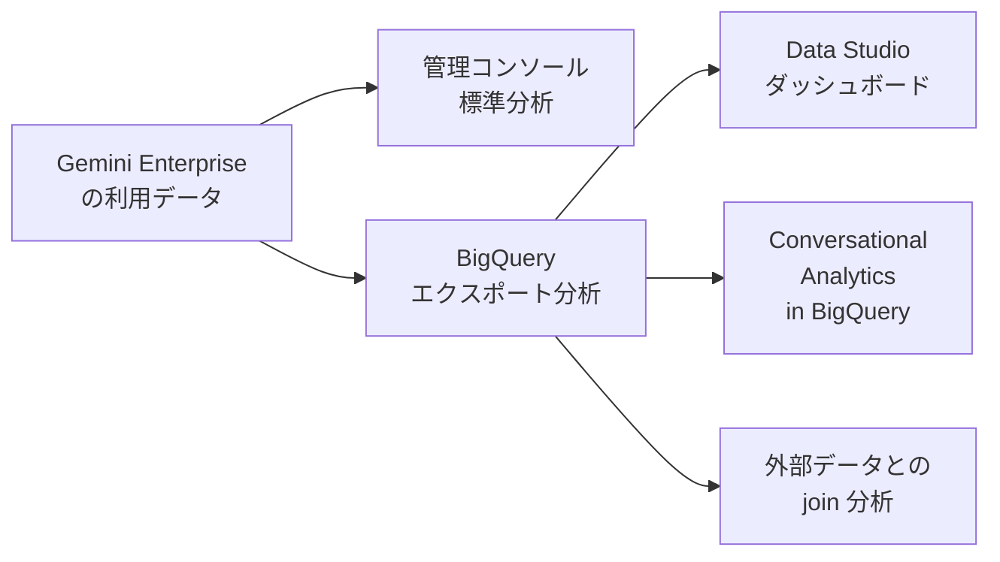
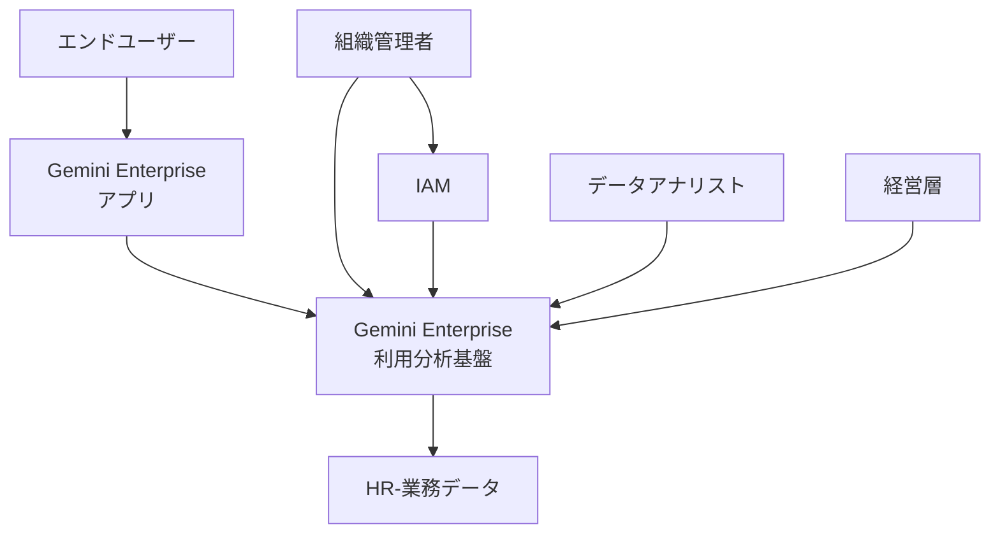
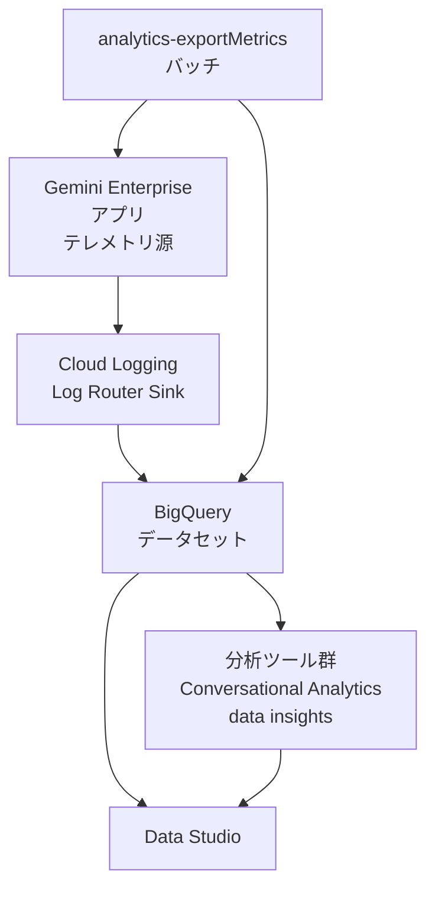
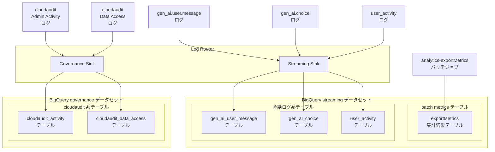
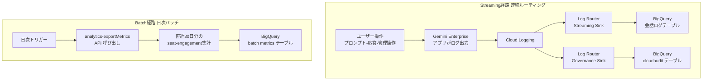
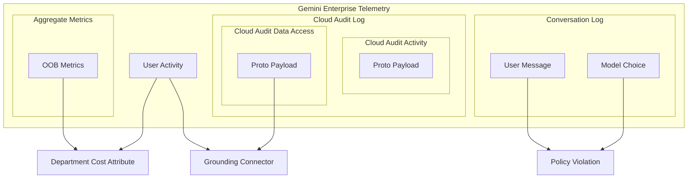
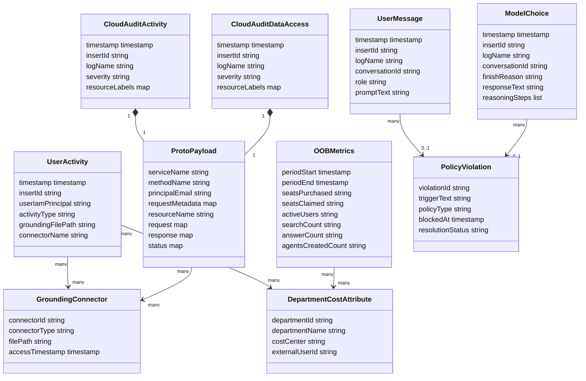

Google Cloud が公開した「Analyze and govern Gemini Enterprise at scale with BigQuery」を起点に、Gemini Enterprise の会話ログ・監査ログ・集計メトリクスを BigQuery へ集約して分析・統制する運用手法を、構造・データ・構築・運用の観点で調査します。

> 2026-07-16 時点の Google Cloud 公式ドキュメントと起点ブログ「Analyze and govern Gemini Enterprise at scale with BigQuery」に基づく調査です。

## 概要

- Gemini Enterprise は、組織向けの AI アシスタント / エンタープライズ検索・エージェント基盤です。
- 導入企業の規模が拡大すると、標準の管理コンソール分析だけでは組織固有の統制・監査要件を満たせなくなります。
- この運用手法は、Gemini Enterprise の会話ログ・監査ログ・集計メトリクスを BigQuery に集約します。
- 集約により、標準ダッシュボードを超えた組織独自の分析・統制・監査を可能にします。
- 位置づけは、管理コンソールが提供する「製品中心の可視化」に対し、「組織中心のカスタム分析基盤」を追加する運用です。
- 主な利用者は IT / データ / セキュリティ部門です。採用状況の深掘り調査、コンプライアンス監査、業務データとの掛け合わせによる組織価値の定量化などに使います。

以下は、3 つの分析経路の位置づけを示す図です。



| 要素名 | 説明 |
|---|---|
| Gemini Enterprise の利用データ | 会話ログ・監査ログ・集計メトリクスの総称 |
| 管理コンソール標準分析 | Gemini Enterprise 管理コンソールのプリセットダッシュボード |
| BigQuery エクスポート分析 | 会話ログ原文・監査ログ・集計メトリクスを BigQuery に取り込んだカスタム分析基盤 |
| Data Studio ダッシュボード | BigQuery 上のデータを可視化する組織独自ダッシュボード |
| Conversational Analytics in BigQuery | 自然言語での質問から SQL を自動生成し分析する機能 |
| 外部データとの join 分析 | HR データ・業務データ等と結合する分析 |

## 特徴

### 関連技術との関係

- **管理コンソール標準分析**: Gemini Enterprise 管理コンソールに搭載されたプリセットダッシュボードです。集計指標を閲覧する用途に特化しています。カスタムクエリや他データとの結合はできません。
- **BigQuery エクスポート分析**: 同じテレメトリの元データ (会話ログ原文・監査ログ・集計メトリクス) を BigQuery に取り込みます。SQL や自然言語 (Conversational Analytics in BigQuery) で自由に分析できます。外部データとの join、長期保持、フォレンジック調査が可能になります。
- **Workspace 版 Gemini audit logs との違い**: Google Workspace の Gemini (Docs / Gmail / Chat 等の生成 AI 機能) は別製品です。その利用ログは Workspace 管理コンソールの Reporting API 経由で提供されます。一方 Gemini Enterprise (Discovery Engine 基盤のエンタープライズ検索・エージェント基盤) の監査ログは、Cloud Logging / Cloud Audit Logs 経由で取得します。対象アプリも取得経路も異なるため、混同しないよう注意が必要です。

### 分析経路の比較

| 観点 | 管理コンソール標準分析 | BigQuery エクスポート分析 | Data Studio ダッシュボード |
|---|---|---|---|
| 取得できる粒度 | 集計指標 (採用・使用品質・エージェント・価値・ユーザーレベルの各タブ)。個別 ID 粒度はユーザーレベルタブのみ、かつ許可ユーザー限定 | 行単位の会話ログ原文 (プロンプト・応答・finish reason・推論ステップ)、監査ログ、集計メトリクス | BigQuery 上のデータに依存し、集計〜行単位まで柔軟に選択可能 |
| カスタム分析の可否 | 不可 (プリセット項目の閲覧のみ) | 可 (SQL、および Conversational Analytics in BigQuery による自然言語分析) | 可 (自由なグラフ・フィルタ構成) |
| 保持期間 | ダッシュボードは継続表示 (表示期間は製品仕様に依存) | exportMetrics は当日を含む直近 30 日を取得。Log Router 経路は継続取得。長期保持は BigQuery テーブルの保持ポリシー次第 (例: 12〜24 か月。実際の期間は規制・契約・社内ポリシーに依存) | BigQuery 側のデータ保持に依存 |
| コスト | Gemini Enterprise ライセンスに含まれ、追加課金なし | BigQuery のストレージ・クエリ料金が発生。Log Router 自体に追加料金はないが、宛先 (BigQuery) 側の料金は発生 | Data Studio の標準エディションは無償 (Data Studio Pro は有償)。参照する BigQuery クエリの課金は発生 |
| 外部データとの join 可否 | 不可 | 可 (HR データ・業務データ等と結合し、組織価値を定量化) | 可 (BigQuery 側で join 済みのデータを可視化) |

### 主要な特徴

- **2 経路パイプライン**: 会話ログは Cloud Logging の Log Router Sink でストリーミングします。集計メトリクスは `analytics:exportMetrics` API で日次バッチ取得します。
- **会話ログ原文の保持**: ユーザーが入力したプロンプトと、モデル応答の逐語的な原文を BigQuery テーブルに保持します。
- **Conversational Analytics in BigQuery (以下、BQ CA) による自然言語分析**: ネストされた JSON スキーマの複雑さを吸収し、自然言語の質問から SQL を自動生成・実行します。感情分析や採用トレンド予測にも使えます。
- **ガバナンス監査**: 管理系の設定変更 (Admin Activity) と、データ面の操作・検索クエリ (Data Access) を分けて監査ログ化します。Model Armor ブロックの発火追跡や、情報漏洩防止調査に使えます。
- **他データとの join**: 会話ログを HR データ・業務データと結合し、部門別の採用状況や削減工数など組織価値を定量化できます。

## 構造

Gemini Enterprise 利用分析基盤の論理アーキテクチャを、C4 モデルの 3 段階 (システムコンテキスト / コンテナ / コンポーネント) と データフロー図で示します。

起点ブログが示す取り込みパイプラインの全体像は次のとおりです。


### システムコンテキスト図

本システム (Gemini Enterprise 利用分析基盤) を中心に、関わるアクターと外部システムの関係を示します。



| 要素名 | 説明 |
|---|---|
| 組織管理者 | ログ有効化・IAM 権限付与・保持ポリシー等、統制の設定責任者 |
| データアナリスト | 会話ログ・監査ログを SQL / 自然言語で分析する担当者 |
| 経営層 | 集計指標・ダッシュボードで組織価値を確認する意思決定者 |
| エンドユーザー | Gemini Enterprise アプリを実際に利用し、プロンプトを入力する社員 |
| Gemini Enterprise 利用分析基盤 | 本システム。テレメトリを集約し分析・統制を可能にする |
| Gemini Enterprise アプリ | 外部システム。プロンプト・応答・管理操作のテレメトリ発生源 |
| IAM | 外部システム。ログ有効化・閲覧に必要な権限を管理する |
| HR-業務データ | 外部システム。会話ログと突合し組織価値を定量化するための業務データ |

### コンテナ図

本システムを構成する主要コンポーネントとその間のデータの流れを示します。



| 要素名 | 説明 |
|---|---|
| Gemini Enterprise アプリ | プロンプト・応答・grounding・管理操作のログをテレメトリとして出力する |
| Cloud Logging Log Router Sink | inclusion filter に一致するログを継続的に BigQuery へルーティングする |
| analytics-exportMetrics バッチ | 日次で Gemini Enterprise アプリの集計 API を呼び出し、直近 30 日の seat / engagement メトリクスを取得する |
| BigQuery データセット | 会話ログ・監査ログ・集計メトリクスを統合格納する分析基盤の中核 |
| 分析ツール群 | 自然言語クエリ生成・スキーマ自動文書化・join path 提案でデータ探索を支援する |
| Data Studio | 格納データや分析結果をダッシュボードとして可視化する |

### コンポーネント図

BigQuery データセット内のテーブル群と、Log Router の 2 つの Sink をドリルダウンします。



各テーブルの正式名は BigQuery 上では次のとおりです (Cloud Logging の BigQuery エクスポート命名規則)。

| 要素名 | BigQuery テーブル正式名 / 説明 |
|---|---|
| gen_ai.user.message ログ | `discoveryengine_googleapis_com_gen_ai_user_message`。ユーザーが入力したプロンプト原文 |
| gen_ai.choice ログ | `discoveryengine_googleapis_com_gen_ai_choice`。モデル応答原文・finish reason・推論ステップ |
| user_activity ログ | `discoveryengine_googleapis_com_gemini_enterprise_user_activity`。企業 ID (IAM email)・grounding ファイルアクセスパス |
| cloudaudit Admin Activity ログ | `cloudaudit_googleapis_com_activity`。管理系 (設定変更) の監査ログ。既定 ON |
| cloudaudit Data Access ログ | `cloudaudit_googleapis_com_data_access`。データ面操作・検索クエリの監査ログ。既定 OFF、明示的な有効化が必要 |
| Streaming Sink | discoveryengine のログ名に一致する会話ログを BigQuery へルーティングする |
| Governance Sink | cloudaudit かつ discoveryengine サービスに一致する監査ログを BigQuery へルーティングする |
| exportMetrics 集計結果テーブル | 直近 30 日の seat / engagement 集計値を格納するテーブル (バッチ書き出し先) |

### データフロー図

Streaming 経路 (会話ログ・監査ログの連続ルーティング) と Batch 経路 (集計メトリクスの日次取得) の 2 系統を示します。



| 要素名 | 説明 |
|---|---|
| ユーザー操作 | エンドユーザーによるプロンプト入力・応答閲覧・管理者による設定変更 |
| Gemini Enterprise アプリがログ出力 | 操作の発生と同時に Cloud Logging へログイベントを送出する |
| Cloud Logging | 全ログイベントの一次受け口。Log Router へ引き渡す |
| Log Router Streaming Sink | 会話ログ系の inclusion filter に一致したログを行単位で連続配信する |
| Log Router Governance Sink | 監査ログ系の inclusion filter に一致したログを行単位で連続配信する |
| BigQuery 会話ログテーブル | Streaming Sink から書き込まれる会話ログの格納先 |
| BigQuery cloudaudit テーブル | Governance Sink から書き込まれる監査ログの格納先 |
| 日次トリガー | Batch 経路を 1 日 1 回起動するスケジュール |
| analytics-exportMetrics API呼び出し | Gemini Enterprise アプリの集計 API を呼び出す非同期処理 |
| 直近30日分の seat-engagement集計 | API から取得する事前集計済みの seat 数・engagement 指標 |
| BigQuery batch metricsテーブル | Batch 経路で日次に取得する集計メトリクスの格納先 |

## データ

Gemini Enterprise のテレメトリは BigQuery 上で 3 系統のエンティティ群に集約されます。

- 会話ログ系: ユーザー入力・モデル応答・企業内活動を行単位で記録する Streaming テーブル群
- 監査ログ系: 管理操作とデータアクセスを記録する Cloud Audit Logs (protoPayload 構造)
- 集計メトリクス系: seat / engagement の日次バッチ集計 (exportMetrics)

これらに加えて、分析ユースケース上で意味を持つ派生エンティティ (Grounding Connector / Policy Violation / Department Cost Attribute) を定義します。派生エンティティは BigQuery に確定テーブルとして存在せず、既存ログの再構成または外部データ結合で得られる概念です。

### 概念モデル



| 要素名 | 説明 |
|---|---|
| Conversation Log | User Message (プロンプト原文) と Model Choice (応答原文) の対。両方とも Streaming 経路 (Log Router Sink) で連続到達する |
| User Activity | IAM email 単位の企業内活動記録。Grounding Connector 利用や Department Cost Attribute との突合の起点になる |
| Cloud Audit Log | Cloud Audit Activity (管理系操作) と Cloud Audit Data Access (データアクセス操作)。いずれも Proto Payload を内包する共通構造を持つ。Data Access 側の Proto Payload が resourceName 経由で Grounding Connector を参照する |
| Aggregate Metrics | OOB Metrics (exportMetrics バッチ) は seat / engagement の集計値。Department Cost Attribute (外部 HR / 業務データ) と結合して価値換算する |
| Grounding Connector | User Activity と Data Access ログから再構成する派生概念。SharePoint / Drive / Gmail 等の接続先 |
| Policy Violation | User Message / Model Choice の内容が Model Armor のポリシーに抵触した場合に現れる派生記録 |
| Department Cost Attribute | 外部 HR / 業務データとの join key を持つ結合専用エンティティ |

### 情報モデル



| エンティティ | 補足 |
|---|---|
| UserMessage / ModelChoice | timestamp・insertId・logName は Log Router 経由の Cloud Logging 共通エンベロープ由来。conversationId で対を突合する。promptText / responseText は Prompt & Response Logging 有効時のみ実体を持つ。ペイロードは BigQuery 上では `jsonPayload` 列にネストされ、フィールド名は Gemini Enterprise 側の内部スキーマ依存 |
| UserActivity | userIamPrincipal (IAM email) が企業内の身元。groundingFilePath / connectorName で Grounding Connector を参照する |
| CloudAuditActivity / CloudAuditDataAccess | LogEntry 共通フィールド (timestamp・insertId・logName・severity・resourceLabels) を持ち、ProtoPayload を 1 対 1 で内包する。ProtoPayload の serviceName は `discoveryengine.googleapis.com` |
| OOBMetrics | exportMetrics API が返す直近 30 日の集計値。ここに挙げた属性名は代表例で、実際のカラム名は取得結果のスキーマで確認する (推測で確定しない)。削減工数・年間価値換算などは、この集計値に外部データを join して算出する派生指標であり、API が直接返す列ではない |
| GroundingConnector / PolicyViolation / DepartmentCostAttribute | BigQuery に確定テーブルとして存在しない派生概念。GroundingConnector は User Activity と Data Access の ProtoPayload (resourceName) から再構成、PolicyViolation は Model Armor ブロック時に会話ログ側に現れる派生記録、DepartmentCostAttribute は外部 HR / 業務データとの join key を持つ結合専用エンティティ |

## 構築方法

### 前提条件

- Gemini Enterprise アプリが既にデプロイ済みであること。
- 実行アカウントに以下の IAM ロールが付与されていること。ロール ID は現行の IAM コンソールで正式名を確認して付与します。

| ロール (表示名) | 主なロール ID | 用途 |
|---|---|---|
| Gemini Enterprise Admin | `roles/discoveryengine.agentspaceAdmin` | 管理コンソールでの Prompt & Response Logging 有効化 |
| Logs Viewer | `roles/logging.viewer` | Cloud Logging (Logs Explorer) での監査ログ閲覧 |
| BigQuery Data Editor | `roles/bigquery.dataEditor` | Log Router Sink の書き込み先データセットへの書き込み許可 (sink のサービスアカウントに付与) |
| BigQuery Job User | `roles/bigquery.jobUser` | BigQuery でのクエリ実行 (batch export・BQ CA 利用者) |
| Discovery Engine Viewer | Discovery Engine のビューア相当ロール | `analytics:exportMetrics` API 呼び出し |

### Step 1: Prompt & Response Logging を有効化

- Gemini Enterprise 管理コンソールの observability 設定で、プロンプト入力・応答出力のロギング (現行 UI: "Enable logging of prompt inputs and response outputs") を ON にします。
- 前提として、先に OpenTelemetry の instrumentation ("Enable instrumentation of OpenTelemetry traces and logs") を有効化しておく必要があります。
- 注意: 監査ログには機密データもフィルタされずそのまま記録されます (公式記載: "Sensitive data isn't filtered out of the audit logs.")。

### Step 2: 監査ログ (Admin Activity / Data Access) を有効化

- **Admin Activity Logs** は既定で ON。設定変更・エージェント作成 / 削除などの操作が自動記録されます。
- **Data Access Logs** は既定 OFF。Discovery Engine API に対して GCP IAM 側で個別に有効化する必要があります。
  1. Google Cloud Console の **IAM と管理 > 監査ログ** ページを開きます。
  2. プロジェクト / フォルダ / 組織を選択します。
  3. Data Access 監査ログの設定テーブルで `discoveryengine.googleapis.com` を検索します。
  4. 記録するログ種別のチェックボックスを選びます。
     - `ADMIN_READ`: メタデータ / 設定を読む操作
     - `DATA_READ`: ユーザー提供データを読む操作 (検索クエリなど)
     - `DATA_WRITE`: ユーザー提供データを書く操作
  5. **保存** をクリックします。
- プログラム経由の場合は `gcloud projects set-iam-policy PROJECT_ID policy.yaml` でポリシーファイルに `auditConfigs` を追記して適用します。

### Step 3: BigQuery データセットを準備

```bash
# streaming pipeline 用データセット
bq mk --dataset --location=[LOCATION] [PROJECT_ID]:[STREAMING_DATASET_ID]

# governance (監査ログ) pipeline 用データセット
bq mk --dataset --location=[LOCATION] [PROJECT_ID]:[GOVERNANCE_DATASET_ID]
```

- Log Router Sink の宛先データセットは書き込み可能 (write-enabled) である必要があります。リンク済み (read-only) データセットは宛先にできません。

### Step 4: Log Router Sink を作成 (streaming pipeline)

会話ログ (ユーザー発話・モデル応答・grounding アクセス) を BigQuery へ連続ルーティングする sink です。

inclusion filter:

```text
logName="projects/[PROJECT_ID]/logs/discoveryengine.googleapis.com%2Fgemini_enterprise_user_activity"
OR logName="projects/[PROJECT_ID]/logs/discoveryengine.googleapis.com%2Fgen_ai.user.message"
OR logName="projects/[PROJECT_ID]/logs/discoveryengine.googleapis.com%2Fgen_ai.choice"
```

gcloud CLI 例:

```bash
gcloud logging sinks create gemini-usage-streaming-sink \
  bigquery.googleapis.com/projects/[PROJECT_ID]/datasets/[STREAMING_DATASET_ID] \
  --project=[PROJECT_ID] \
  --use-partitioned-tables \
  --log-filter='logName="projects/[PROJECT_ID]/logs/discoveryengine.googleapis.com%2Fgemini_enterprise_user_activity" OR logName="projects/[PROJECT_ID]/logs/discoveryengine.googleapis.com%2Fgen_ai.user.message" OR logName="projects/[PROJECT_ID]/logs/discoveryengine.googleapis.com%2Fgen_ai.choice"'
```

- 上記は起点ブログの厳密な 3 ログ列挙です。公式の usage-log ガイドは後段を `gen_ai.*` の正規表現 (`logName=~"...%2Fgen_ai.*"`) で取得する形を案内しており、将来 `gen_ai.*` にログ種別が追加されても取りこぼしません。最新仕様追従を優先する場合は正規表現形を採ります。
- **`--use-partitioned-tables` は必須級**: Cloud Logging の BigQuery エクスポートは、既定で日付シャーディングテーブル (`テーブル名_YYYYMMDD` の複数テーブル) を作成します。このフラグを付けると単一のパーティションテーブルになり、本ドキュメントの SQL 例や `bq update --time_partitioning` によるパーティション有効期限管理 (運用セクション参照) がそのまま適用できます。Console では宛先設定時に「パーティションテーブルを使用する」を選びます。

Console 手順:

1. **Logging > Log Router** を開きます。
2. プロジェクトを選択します。
3. **シンクを作成** をクリックします。
4. シンク名・説明を入力します。
5. **シンクの宛先を選択** で **BigQuery データセット** を選びます。
6. 上記の書き込み可能データセットを選択します。
7. **シンクに含めるログの選択** に上記 inclusion filter を貼り付けます。
8. **シンクを作成** をクリックします。
9. 作成後に表示される **writer identity** (サービスアカウント) を控えます。

### Step 5: Log Router Sink を作成 (governance pipeline)

Admin Activity / Data Access 監査ログを BigQuery へルーティングする sink です。

inclusion filter:

```text
logName:"projects/[PROJECT_ID]/logs/cloudaudit.googleapis.com"
AND protoPayload.serviceName="discoveryengine.googleapis.com"
```

gcloud CLI 例:

```bash
gcloud logging sinks create gemini-usage-governance-sink \
  bigquery.googleapis.com/projects/[PROJECT_ID]/datasets/[GOVERNANCE_DATASET_ID] \
  --project=[PROJECT_ID] \
  --use-partitioned-tables \
  --log-filter='logName:"projects/[PROJECT_ID]/logs/cloudaudit.googleapis.com" AND protoPayload.serviceName="discoveryengine.googleapis.com"'
```

### Step 6: sink サービスアカウントに BigQuery 権限を付与

sink 作成時に `writerIdentity` として発行される Google 管理のサービスアカウントに、宛先データセットへの書き込み権限を付与します。

```bash
# writer identity を確認
gcloud logging sinks describe gemini-usage-streaming-sink --project=[PROJECT_ID]

# BigQuery Data Editor を付与 (プロジェクト単位。簡易例であり本番は非推奨)
gcloud projects add-iam-policy-binding [PROJECT_ID] \
  --member="serviceAccount:[SINK_WRITER_IDENTITY]" \
  --role="roles/bigquery.dataEditor"
```

- 上記はプロジェクト全体の全データセットへの書き込みを許す過剰付与です。最小権限では、**宛先データセットの IAM ポリシー**にのみ `roles/bigquery.dataEditor` を付与します (該当データセットのアクセス設定で writer identity を追加)。
- streaming / governance 両 sink の writer identity それぞれに対して実施します (sink ごとに別サービスアカウントが発行される場合があります)。

### Step 7: batch export (`analytics:exportMetrics`) を設定・実行

過去 30 日分の seat / engagement 集計メトリクスを BigQuery へバッチ書き出しする API です。

必須パラメータ:

| パラメータ | 内容 |
|---|---|
| `ENDPOINT_LOCATION` | `us` / `eu` / `global` のいずれか |
| `LOCATION` | データストアのマルチリージョン |
| `PROJECT_ID` | GCP プロジェクト ID |
| `APP_ID` | Gemini Enterprise アプリ (Engine) ID |
| `analytics` (本文) | 対象 Analytics リソース名 (`projects/.../engines/[APP_ID]`)。リクエスト本文に必須 |
| `outputConfig.bigqueryDestination.datasetId` | 書き出し先データセット ID (事前に作成必須) |
| `outputConfig.bigqueryDestination.tableId` | 書き出し先テーブル ID。エクスポートごとに新しい空テーブルを指定する |

前提: 呼び出しアカウントに Discovery Engine Viewer 相当ロールが必要です。呼び出し回数の上限は **1 プロジェクト当たり 1 日 5 回、1 組織当たり 1 日 25 回** です (公式 view-analytics ドキュメント記載)。取得対象は直近 30 日分のみです。日次バッチ運用はこの上限内に収まります。

```bash
curl -X POST \
  -H "Authorization: Bearer $(gcloud auth print-access-token)" \
  -H "Content-Type: application/json" \
  -H "X-Goog-User-Project: [PROJECT_ID]" \
  -d '{
    "analytics": "projects/[PROJECT_ID]/locations/[LOCATION]/collections/default_collection/engines/[APP_ID]",
    "outputConfig": {
      "bigqueryDestination": {
        "datasetId": "[BIGQUERY_DATASET_ID]",
        "tableId": "[BIGQUERY_TABLE_ID]"
      }
    }
  }' \
  "https://[ENDPOINT_LOCATION]-discoveryengine.googleapis.com/v1alpha/projects/[PROJECT_ID]/locations/[LOCATION]/collections/default_collection/engines/[APP_ID]/analytics:exportMetrics"
```

- レスポンスは長時間実行オペレーション (LRO) 名を返します。完了確認は同オペレーション名への GET で行います。
- 過去のエクスポート結果を保持する場合、公式手順は **エクスポートごとに新しい空テーブルを作り `tableId` を変える**ことを求めます。実運用では「実行ごとに一意の staging テーブルへ書き出し → 履歴テーブルへ `MERGE` / `INSERT` → staging を削除」とします。
- 日次バッチとして Cloud Scheduler 等から定期実行する運用を組みます (直近 30 日を都度取得)。

```bash
# オペレーション状態確認
curl -X GET \
  -H "Authorization: Bearer $(gcloud auth print-access-token)" \
  "https://[ENDPOINT_LOCATION]-discoveryengine.googleapis.com/v1alpha/[OPERATION_NAME]"
```

## 利用方法

### 必須パラメータ早見表

| 操作 | 必須パラメータ |
|---|---|
| `analytics:exportMetrics` | `ENDPOINT_LOCATION`, `PROJECT_ID`, `LOCATION`, `APP_ID`, `outputConfig.bigqueryDestination.datasetId`, `outputConfig.bigqueryDestination.tableId` |
| Log Router Sink 作成 | `SINK_NAME`, 宛先 (`bigquery.googleapis.com/projects/PROJECT_ID/datasets/DATASET_ID`), `--log-filter` |
| BQ CA 会話開始 | 対象データセット / テーブル (Knowledge sources)、質問文 |

### 会話ログテーブルへの基本 SELECT

ユーザー発話 (`gen_ai.user.message`) の直近ログを確認する例です。

```sql
SELECT
  timestamp,
  resource.labels.location,
  jsonPayload
FROM
  `[PROJECT_ID].[STREAMING_DATASET_ID].discoveryengine_googleapis_com_gen_ai_user_message`
ORDER BY
  timestamp DESC
LIMIT 100;
```

モデル応答 (`gen_ai.choice`) を確認する例です。

```sql
SELECT
  timestamp,
  jsonPayload
FROM
  `[PROJECT_ID].[STREAMING_DATASET_ID].discoveryengine_googleapis_com_gen_ai_choice`
ORDER BY
  timestamp DESC
LIMIT 100;
```

- Cloud Logging の BigQuery エクスポート方式では、構造化ログのペイロードは `jsonPayload` 列に **STRUCT (RECORD) 型** として展開されます。JSON 文字列型ではないため、`jsonPayload.<field>` のドットアクセスで参照します (`JSON_VALUE(jsonPayload, '$.field')` は STRUCT には直接使えません)。エクスポート時にフィールド名は小文字へ正規化されるため、まず `SELECT jsonPayload` でスキーマを確認してから、必要なキーを小文字名で展開します (キー名を推測で確定しない)。以降の SQL 例の `jsonPayload.<field>` も、実テーブルのスキーマで実フィールド名を確認して調整します。

### 監査ログ (`protoPayload`) の展開クエリ

Admin Activity / Data Access 監査ログは `protopayload_auditlog` 列にメソッド名・呼び出し者・リソース名が入ります。

```sql
SELECT
  timestamp,
  protopayload_auditlog.methodName AS method_name,
  protopayload_auditlog.authenticationInfo.principalEmail AS principal_email,
  protopayload_auditlog.resourceName AS resource_name,
  protopayload_auditlog.serviceName AS service_name
FROM
  `[PROJECT_ID].[GOVERNANCE_DATASET_ID].cloudaudit_googleapis_com_activity`
WHERE
  protopayload_auditlog.serviceName = "discoveryengine.googleapis.com"
ORDER BY
  timestamp DESC
LIMIT 100;
```

Data Access ログ (検索クエリ・grounding connector 参照など) を対象にする場合は宛先テーブルを `cloudaudit_googleapis_com_data_access` に差し替えます。

- `protopayload_auditlog` は Cloud Logging の BigQuery エクスポートにおける標準の監査ログ列名 (Cloud Audit Logs 共通スキーマ) です。ネスト側のフィールド名は `methodName` / `authenticationInfo.principalEmail` / `resourceName` / `serviceName` のように元の camelCase を保持します。
- `methodName` の実値は完全修飾名です。表示用の短縮名で完全一致すると 0 件になるため、SQL では完全修飾名か `ENDS_WITH(methodName, '.CreateDataStore')` を使います。
  - Admin Activity 側 (`ADMIN_WRITE`) 例: `google.cloud.discoveryengine.v1.DataStoreService.CreateDataStore` / `...DataStoreService.DeleteDataStore` / `...EngineService.CreateEngine`
  - Data Access 側 (`DATA_READ` 等) 例: `google.cloud.discoveryengine.v1.SearchService.Search` / `...CompletionService.CompleteQuery` / `...DocumentService.GetDocument`

### Conversational Analytics in BigQuery (BQ CA) での自然言語クエリ

必要ロール (プロジェクトレベル):

| ロール | 用途 |
|---|---|
| Gemini Data Analytics Data Agent User | データエージェントとの会話の作成・閲覧 |
| Gemini for Google Cloud User | Gemini 機能全般の利用 |
| BigQuery Data Viewer | 対象データセット / テーブルの参照 |
| BigQuery Job User | クエリジョブの実行 |

起動手順:

1. BigQuery Studio を開きます。
2. **エクスプローラ** でプロジェクトを展開し、対象データセットを選択します。
3. **チャット (Chat)** アイコンをクリックします。
4. **ナレッジソース (Knowledge sources)** タブで、streaming / governance / batch export の対象テーブルを選択します。
5. **質問を入力** 欄に自然言語で質問を入力し、モードを選んで送信します。

起点ブログ記載の質問文の例です。

```text
Compare the usage of notebooklm, deep research and custom agents using oob_metrics
```

- BQ CA は質問をスキーマに基づき SQL へ自動変換・実行し、結果をテキスト / テーブル / グラフで返します。テーブル・カラムの説明やビジネス用語集 (business glossary / Knowledge Catalog 連携) を事前に整備すると精度が上がります。
- センチメント分類・採用率予測などの高度な分析も同じ会話インターフェースから依頼できます。

### BigQuery data profiling / data insights の実行

- **data profiling**: Dataplex のデータプロファイルスキャンで、列ごとの統計 (平均値・ユニーク値数・null 率・分布など) を取得します。BigQuery のテーブル詳細画面「データプロファイル」タブ、または Knowledge Catalog から確認します。
- **data insights**: Gemini がテーブル / カラムの説明と、想定される自然言語質問 + 対応 SQL を自動生成します。data profiling とは別機能で、事前に **Gemini in BigQuery** のセットアップが必要です。

```bash
gcloud dataplex datascans create data-profile [DATASCAN_ID] \
  --location=[LOCATION] \
  --data-source-resource=//bigquery.googleapis.com/projects/[PROJECT_ID]/datasets/[STREAMING_DATASET_ID]/tables/discoveryengine_googleapis_com_gen_ai_user_message

gcloud dataplex datascans run [DATASCAN_ID] --location=[LOCATION]
```

- data insights は現時点で Console UI 経由が正式な利用方法です。

Gemini が自動生成するスキーマドキュメントと data insights の表示例は次のとおりです。


## 運用

### ログ保持管理

Gemini Enterprise → BigQuery のパイプラインには、保持の観点で 2 層のデータが存在します。

| レイヤー | 実体 | 既定保持 | 変更可否 |
|---|---|---|---|
| Cloud Logging `_Required` バケット | Admin Activity / System Event / Access Transparency ログ | 400 日固定 | 変更不可 |
| Cloud Logging `_Default` バケット | Data Access ログなど上記以外 | 30 日 | プロジェクトの `_Default` とユーザー定義バケットは 1〜3650 日でカスタム可。組織・フォルダの `_Default` は 30 日固定 |
| BigQuery 宛先テーブル (sink 経由) | `discoveryengine_googleapis_com_*`、`cloudaudit_googleapis_com_*` | 無期限 (テーブル設定に依存) | パーティション有効期限で制御 |

- Log Router Sink は Cloud Logging バケットを経由せず、ログエントリを **直接 BigQuery テーブルに書き込みます**。したがって「監査ログを 12-24 か月保持」という組織要件は、**Cloud Logging バケット側の retention** ではなく **BigQuery 宛先テーブルのパーティション有効期限 (partition expiration)** で満たすのが実務上の主眼になります。
- Cloud Logging 側の `_Default` / `_Required` バケット retention は、Logs Explorer で過去ログを直接検索する用途 (sink 経由でない参照) に効く設定であり、BigQuery 側のテーブル保持とは独立して管理します。

```bash
# 宛先テーブルに 18 か月 (約547日) のパーティション有効期限を設定する例
bq update \
  --time_partitioning_field=timestamp \
  --time_partitioning_type=DAY \
  --time_partitioning_expiration=47260800 \
  PROJECT_ID:DATASET.discoveryengine_googleapis_com_gen_ai_user_message
```

- パーティション有効期限は「即時削除」ではなく、期限超過後にバックグラウンドで非同期削除されます。
- 既存テーブルの有効期限を後から変更すると、既存パーティションにも遡って適用されます。

### コスト管理・監視

Gemini Enterprise 由来のコストは主に 3 系統です。

1. **ストリーミング取り込み (会話ログ)**: Log Router Sink → BigQuery の書き込み。会話量・利用者数の増加に比例してテーブル容量が増えます。
2. **バッチ実行 (exportMetrics)**: `analytics:exportMetrics` には呼び出し回数の上限があります。Cloud Scheduler 等で定期実行する場合は上限内に収めます。
3. **分析クエリ (BQ CA / Data Studio / スケジュールドクエリ)**: on-demand 課金ならスキャンバイト数課金、capacity (スロット) 予約なら slot-hour 課金です。

```sql
-- 直近7日間の Gemini Enterprise 関連データセットに対するクエリコスト上位を確認
SELECT
  user_email,
  query,
  total_bytes_billed,
  total_slot_ms,
  creation_time
FROM `region-us`.INFORMATION_SCHEMA.JOBS_BY_PROJECT
WHERE creation_time >= TIMESTAMP_SUB(CURRENT_TIMESTAMP(), INTERVAL 7 DAY)
  AND referenced_tables[SAFE_OFFSET(0)].dataset_id = 'gemini_enterprise_analytics'
ORDER BY total_bytes_billed DESC
LIMIT 20;
```

- `INFORMATION_SCHEMA.JOBS_BY_PROJECT` はプロジェクト単位で過去 180 日分のジョブ履歴を保持します。
- BQ CA (自然言語→SQL) を業務部門に広く開放する場合、想定外の高頻度クエリでコストが跳ねやすいため、capacity 予約 + ワークロード管理 (reservation assignment) を検討します。

### 分析ダッシュボードの定常運用

- **Data Studio (旧 Looker Studio)**: BigQuery データソースへの直結を維持し、部門別採用状況・grounding トラフィック・Model Armor ブロック件数のダッシュボードを定期更新します。データソースの認証情報 (サービスアカウント推奨) の失効・権限変更に注意します。
- **BQ CA エージェントの共有**: ビジネス用語集や検証済み SQL を Knowledge Catalog に登録し、BQ CA エージェントとして業務部門に共有します。共有範囲は IAM で統制します。
- **スケジュールドクエリ**: 日次の集計テーブル (部門別利用サマリ、Model Armor 違反件数など) をスケジュールドクエリで作成し、Data Studio の参照先を集計テーブルに寄せることで、ダッシュボード閲覧のたびに生ログをフルスキャンしない構成にします。

```sql
-- スケジュールドクエリ例: 日次の部門別・エージェント種別 利用サマリを集計テーブルへ追記
INSERT INTO `PROJECT_ID.gemini_enterprise_analytics.daily_usage_summary`
SELECT
  DATE(timestamp) AS usage_date,
  jsonPayload.department AS department,
  jsonPayload.agent_type AS agent_type,
  COUNT(*) AS interaction_count
FROM `PROJECT_ID.gemini_enterprise_analytics.discoveryengine_googleapis_com_gemini_enterprise_user_activity`
WHERE DATE(timestamp) = CURRENT_DATE() - 1
GROUP BY usage_date, department, agent_type;
-- department / agent_type は実スキーマに応じたネストパスに読み替える (STRUCT 展開)。
```

## ベストプラクティス

### ガバナンス設計

以降の統制策のうち「個人評価への転用禁止」「業務成果データ結合の責任分界」は起点ブログの記載ではなく、会話ログ原文を扱う際の一般的なプライバシー原則 (目的外利用の制限・データ最小化) に基づく本ドキュメント独自の実務提案です。公式の必須要件ではなく、組織の規程に落とす際の設計指針として扱います。

- **IAM 最小権限**: 会話ログ原文 (`gen_ai_user_message` / `gen_ai_choice`) へのアクセスは、通常の分析担当者には開放しません。閲覧に必要な最小ロールは以下です。

| 用途 | ロール |
|---|---|
| ログ閲覧 (一般) | `roles/logging.viewer` |
| 機密ログ閲覧 (Private) | `roles/logging.privateLogViewer` |
| Log View 経由の限定閲覧 | `roles/logging.viewAccessor` |
| BigQuery ポリシータグ管理 | Data Catalog Policy Tag Admin |
| 機密カラムの閲覧 | Data Catalog Fine-Grained Reader |

- **column-level security (列レベルアクセス制御)**: プロンプト原文・応答原文列に Data Catalog のポリシータグ (例: `PII`、`Confidential`) を付与し、タグに対する `Fine-Grained Reader` を持たないユーザーはクエリ自体が失敗する構成にします。ポリシータグとテーブルは同一リージョンである必要があります。

```bash
# 既存テーブルの列にポリシータグを適用 (schema.json 内で該当列に policyTags を指定)
bq update PROJECT_ID:DATASET.discoveryengine_googleapis_com_gen_ai_user_message schema.json
```

- **row-level security (行レベルアクセス制御)**: 部門・拠点単位でしか自部門データを見せたくない場合、行アクセスポリシーを設定します。

```sql
CREATE OR REPLACE ROW ACCESS POLICY dept_filter
ON `PROJECT_ID.gemini_enterprise_analytics.discoveryengine_googleapis_com_gemini_enterprise_user_activity`
GRANT TO ('group:hr-analytics@example.com')
FILTER USING (jsonPayload.department = 'HR');
```

- **個人評価への転用禁止**: 会話ログの本質的リスクは「誰が何を検索・入力したか」が個人単位で特定できる点にあります。利用状況の可視化はチーム / 部門単位の集計に限定し、個人特定できる原文アクセスは HR 評価目的での参照を規程上・技術上の両面で禁止します。技術面では上記の column / row-level security に加え、誰がどのクエリを実行したかを BigQuery 側の Data Access ログで別途記録し、目的外利用の追跡可能性を担保します。
- **業務成果データ結合の責任分界**: 会話ログと HR / 業務成果データ (生産性・評価データ等) を join した分析基盤・ダッシュボードは、データオーナー (通常 HR 部門) と分析基盤運用者 (IT / データ基盤チーム) の責任分界を事前に文書化します。join 済みテーブルは原則、集計後 (個人非特定) の粒度でのみ提供します。
- **匿名化 / 擬似化**: 業務部門への共有用ビュー・集計テーブルでは、ユーザー識別子をハッシュ化 (擬似匿名化) し、原文アクセスが必要な調査 (Model Armor 違反調査、grounding 監査など) のみ、限定ロールで原文テーブルに直接アクセスさせます。

### 保持・コンプラ

- **保持期間ポリシー**: 会話ログ・監査ログの保持は「法令 / 社内規程で定める必要保持期間」と「コスト」のトレードオフです。パーティション有効期限で機械的に失効させることで、ポリシー超過分の保持コストと開示リスクを抑えます。
- **地域制約 (data residency)**: Log Router Sink の宛先 BigQuery データセットのロケーションと、Gemini Enterprise アプリのリージョン、Cloud Logging バケットのロケーションを揃えます。BigQuery のデータセットロケーションは作成後変更できないため、初期設計時点でコンプライアンス要件 (EU データは EU リージョンに留める等) を確定させます。
- **監査証跡の非改竄性**: `_Required` バケット (Admin Activity ログ等) は保持期間変更・削除が不可能なため、改竄耐性の担保として活用できます。BigQuery 側の宛先テーブルは、書き込み専用の sink サービスアカウントのみが `dataEditor` を持ち、閲覧者は読み取り専用ロールに限定する構成にして、事後の改竄経路を狭めます。

### コスト最適化

- **partition / cluster 設計**: 会話ログ・監査ログテーブルは timestamp 列で日次パーティション、加えて部門 / エージェント種別等で cluster すると、部門別集計クエリのスキャン量を抑えられます。
- **集計テーブル化**: Data Studio や BQ CA からの反復クエリは生ログテーブルではなく日次 / 週次の集計テーブルを参照させます。
- **必要ログのみ sink**: Log Router の inclusion filter は、分析要件にない `logName` を含めません。特に `gen_ai.user.message` / `gen_ai.choice` (会話原文) は必要な範囲に絞ることで、ストリーミング量と保存コストの両方を抑制できます。

### 安全性

- **Model Armor 違反の継続監視 (取得経路に注意)**: Model Armor のブロックは、これまで設定した `discoveryengine.googleapis.com` の監査ログには現れません。Model Armor は別サービス `modelarmor.googleapis.com` として動作し、`SanitizeUserPrompt` / `SanitizeModelResponse` メソッドの監査ログを持ちます。ブロック件数を追う経路は 2 つです。
  1. **Model Armor API の Data Access 監査ログを有効化**し、governance sink の inclusion filter に `modelarmor.googleapis.com` を加える (Step 2 / Step 5 の対象サービスを追加する)。
  2. **会話ログ (`gen_ai_choice`) 側のスキップ理由**を見る。ポリシー違反でブロックされた応答は、スキップ理由 (例: `CUSTOMER_POLICY_VIOLATION`) を伴います。フィールド名は自環境の `jsonPayload` スキーマで確認します。
- 可用性低下時の挙動 (Allow / Block) をどちらに倒すかは事前にポリシー決定しておきます。
- **PII を含む会話ログ原文の取扱い**: 原文列には前述の column-level security を必須適用し、原文へのアクセスログ自体 (誰がいつ原文を閲覧したか) も監査対象にします。

```sql
-- Model Armor の検査回数の日次推移 (Model Armor API 監査ログを governance sink に追加取得している前提)
-- 注意: SanitizeUserPrompt / SanitizeModelResponse は「検査呼び出し全体」でありブロックだけではない。
-- ブロック件数を数えるには screening verdict フィールドで block のみを抽出する (実スキーマで確認)。
SELECT
  DATE(timestamp) AS scan_date,
  COUNT(*) AS screening_count
FROM `PROJECT_ID.gemini_enterprise_analytics.cloudaudit_googleapis_com_data_access`
WHERE protopayload_auditlog.serviceName = "modelarmor.googleapis.com"
  AND protopayload_auditlog.methodName IN (
    "google.cloud.modelarmor.v1.ModelArmor.SanitizeUserPrompt",
    "google.cloud.modelarmor.v1.ModelArmor.SanitizeModelResponse"
  )
GROUP BY scan_date
ORDER BY scan_date DESC;
```

- ブロックだけを数える場合は、この検査ログの screening verdict、または会話ログ (`gen_ai_choice`) 側のポリシー違反スキップ理由 (`CUSTOMER_POLICY_VIOLATION`) を条件に加えます。

### 起点の示唆を運用パターンに落とす

利用者数・プロンプト数だけでなく「業務別採用率・継続率・コスト・ポリシー違反」を共通スキーマで追跡するには、部門・エージェント種別・利用者疑似 ID を共通ディメンションに持つ集計テーブルを設計し、以下の指標を同一粒度で並べます。

| 指標カテゴリ | ソーステーブル | 集計粒度 |
|---|---|---|
| 採用率 | `gemini_enterprise_user_activity` | 部門 × 週 |
| 継続率 (リテンション) | `gemini_enterprise_user_activity` | 利用者疑似ID × 週 |
| コスト | `INFORMATION_SCHEMA.JOBS_BY_PROJECT` + ストレージ課金 | プロジェクト × 日 |
| ポリシー違反 | `cloudaudit_googleapis_com_data_access` (Model Armor) | 部門 × 週 |

これらを 1 つの集計テーブル (または `department` / `week` をキーにした複数集計テーブルの join ビュー) にまとめることで、「導入は進んでいるがポリシー違反も増えている部門」のような横断的な意思決定材料を単一ダッシュボードで提供できます。

grounding connector 別 (SharePoint / Drive / Gmail 等) の利用集計は、`user_activity` テーブルの connector 名を使って行います。実キー名は `jsonPayload` スキーマで確認して調整します。

```sql
-- connector 別の週次アクセス件数・ユニークユーザー数
SELECT
  DATE_TRUNC(DATE(timestamp), WEEK) AS usage_week,
  jsonPayload.connectorname AS connector_name,
  COUNT(*) AS access_count,
  COUNT(DISTINCT jsonPayload.useriamprincipal) AS unique_users
FROM `PROJECT_ID.gemini_enterprise_analytics.discoveryengine_googleapis_com_gemini_enterprise_user_activity`
WHERE timestamp >= TIMESTAMP_SUB(CURRENT_TIMESTAMP(), INTERVAL 90 DAY)
GROUP BY usage_week, connector_name
ORDER BY usage_week DESC, access_count DESC;
```

## トラブルシューティング

| 症状 | 原因 | 対処 |
|---|---|---|
| sink 作成後も BigQuery にデータが来ない | Data Access Logs が Discovery Engine API に対して有効化されていない (既定 OFF) | IAM と管理 → 監査ログ設定で `discoveryengine.googleapis.com` の Data Access ログを有効化 |
| sink 作成後も BigQuery にデータが来ない | sink の writer identity に宛先データセットの `roles/bigquery.dataEditor` が未付与 | `gcloud logging sinks describe SINK_NAME` で writer identity を確認し、宛先データセットに dataEditor を付与 |
| sink 作成後も BigQuery にデータが来ない | inclusion filter の指定誤り、または他 sink の exclusion filter に巻き取られている | Logs Explorer で対象フィルタが実際にログをヒットするか単独確認。他 sink の exclusion filter も確認 |
| 会話ログ (`gen_ai_user_message` / `gen_ai_choice`) が空 | 管理コンソールで Prompt & Response Logging が OFF | 管理コンソールでロギングを有効化 (有効化後のやり取りのみ記録され、遡及記録はされない) |
| `exportMetrics` が 30 日超のデータを返さない | API 仕様上、直近 30 日分のみが取得対象 | 30 日超の傾向分析が必要なら、日次で `exportMetrics` を実行し結果を自前の BigQuery テーブルに追記して長期保存する |
| `exportMetrics` 呼び出しでエラー | 呼び出し回数の上限超過 (プロジェクト 1 日 5 回 / 組織 1 日 25 回) | 定期実行の頻度を上限内に収める。組織内の複数チームが同時に叩いていないか確認 |
| `exportMetrics` が "Dataset not found in location" エラー | 出力先データセットのロケーションと API 呼び出し側の想定ロケーションが不一致 | 宛先データセットのロケーションを確認し、リクエストの `outputConfig` を合わせる |
| ログ閲覧・エクスポート設定で権限エラー | 閲覧ロール (Logs Viewer 系) または管理ロール不足 | 用途に応じたロールを IAM で個別に付与 (閲覧のみなら Viewer 系、設定変更なら Admin 系) |
| BigQuery コストが急増 | 会話ログ量の急増、パーティション有効期限未設定、生ログへの高頻度 SELECT | `INFORMATION_SCHEMA.JOBS_BY_PROJECT` で高コストクエリを特定。パーティション有効期限の設定漏れを確認。ダッシュボード参照先を集計テーブルに変更 |
| Model Armor のブロックログが取得できない | Model Armor は別サービス `modelarmor.googleapis.com`。`discoveryengine.googleapis.com` だけを対象にした Step 2 / Step 5 の設定では取得されない | IAM と管理 → 監査ログで `modelarmor.googleapis.com` の Data Read ログを有効化し、governance sink の inclusion filter に同サービスを追加。または会話ログ (`gen_ai_choice`) のスキップ理由で代替検知 |

## まとめ

Gemini Enterprise の会話ログ・監査ログ・集計メトリクスを BigQuery に集約すると、標準ダッシュボードを超えた組織独自の採用分析・ガバナンス監査ができます。導入時は 2 経路パイプラインの前提有効化・ログテーブル構造・IAM とデータ保持の統制設計を最初に固めることが要点です。

この記事が少しでも参考になった、あるいは改善点などがあれば、ぜひリアクションやコメント、SNSでのシェアをいただけると励みになります！

## 参考リンク

- 概要・分析
  - [Analyze and govern Gemini Enterprise at scale with BigQuery (起点ブログ)](https://cloud.google.com/blog/products/data-analytics/analyze-and-govern-gemini-enterprise-at-scale-with-bigquery/)
  - [View and export analytics data | Gemini Enterprise](https://docs.cloud.google.com/gemini/enterprise/docs/view-analytics)
  - [Introducing Conversational Analytics in BigQuery](https://cloud.google.com/blog/products/data-analytics/introducing-conversational-analytics-in-bigquery)
- 構築・ログ設定
  - [Access Gemini Enterprise usage audit logs with Cloud Logging](https://docs.cloud.google.com/gemini/enterprise/docs/set-up-usage-audit-logs)
  - [Access Gemini Enterprise Cloud Audit Logs](https://docs.cloud.google.com/gemini/enterprise/docs/audit-logging)
  - [Log Router overview | Cloud Logging](https://docs.cloud.google.com/logging/docs/routing/overview)
  - [Configure and manage sinks | Cloud Logging](https://docs.cloud.google.com/logging/docs/export/configure_export_v2)
  - [Configure Data Access audit logs](https://docs.cloud.google.com/logging/docs/audit/configure-data-access)
  - [View logs routed to BigQuery](https://docs.cloud.google.com/logging/docs/export/bigquery)
- 利用・分析ツール
  - [Analyze data with a data agent (Conversational Analytics in BigQuery)](https://docs.cloud.google.com/bigquery/docs/create-conversations)
  - [Data profiling (data profile scan)](https://docs.cloud.google.com/bigquery/docs/data-profile-scan)
  - [Generate data insights](https://docs.cloud.google.com/bigquery/docs/data-insights)
- 運用・ガバナンス
  - [Managing partitioned tables](https://docs.cloud.google.com/bigquery/docs/managing-partitioned-tables)
  - [Cloud Logging buckets](https://docs.cloud.google.com/logging/docs/buckets)
  - [Troubleshoot log routing](https://docs.cloud.google.com/logging/docs/export/troubleshoot)
  - [Column-level security introduction](https://docs.cloud.google.com/bigquery/docs/column-level-security-intro)
  - [Best practices for using policy tags](https://docs.cloud.google.com/bigquery/docs/best-practices-policy-tags)
  - [Row-level security introduction](https://docs.cloud.google.com/bigquery/docs/row-level-security-intro)
  - [INFORMATION_SCHEMA JOBS](https://docs.cloud.google.com/bigquery/docs/information-schema-jobs)
  - [Control costs in BigQuery](https://docs.cloud.google.com/bigquery/docs/best-practices-costs)
  - [Enable Model Armor | Gemini Enterprise](https://docs.cloud.google.com/gemini/enterprise/docs/enable-model-armor)
