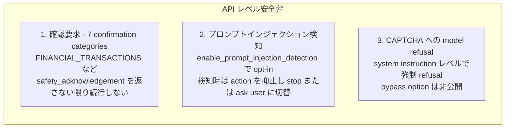
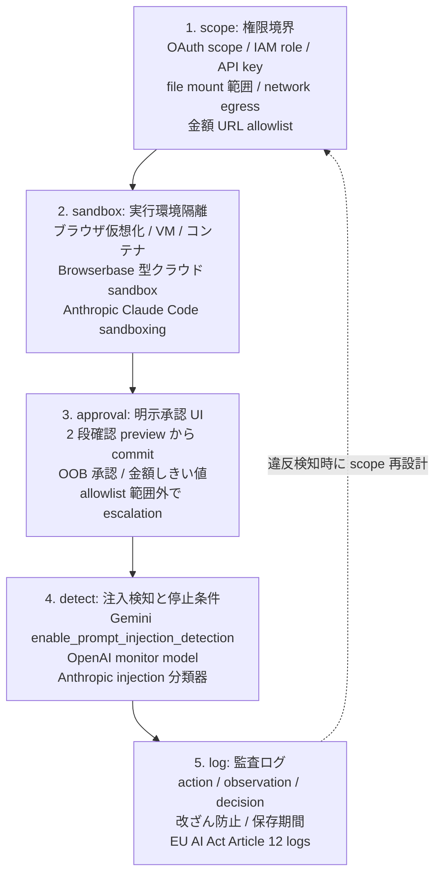

## 概要

Google は 2026-06-24 に Gemini 3.5 Flash を発表し、コンピュータ操作 (Computer Use) を主力モデルに統合しました。従来は別モデル `gemini-2.5-computer-use-preview-10-2025` だった操作機能が、`gemini-3.5-flash` 単一モデルへ `tools: [{type: "computer_use", environment: ...}]` を渡すだけで動く形になっています。ステータスは GA ではなく Public Preview で、changelog (2026-06-24) と API ドキュメント本文の両方が "Preview capability" と明記しています (blog の「built-in tool」は GA 宣言ではなく、組み込み完了の意です)。

「内蔵」の含意は技術的には小さく見えますが、運用統制から見ると大きく違います。これまで「操作モデルを別建てで呼ぶ」設計だったものが、通常チャット系の主力モデルにも操作責任が乗る形に変わり、「Computer Use は別 API だから封じておけば安全」という従来の境界線が崩れます。同時に Google は API レベルの安全弁として、7 カテゴリの組み込み確認要求 (`FINANCIAL_TRANSACTIONS` ほか)、`enable_prompt_injection_detection` の opt-in トグル、CAPTCHA への model refusal を提示しました。導入論点は「操作できるか」から「どこで止めるか・誰が確定するか」へ移っています。

ただし、内蔵安全弁が業務エージェントの「土台」になるかは別問題です。VPI-Bench (arXiv:2506.02456) は CUA で最大 51%、BUA で 100% の攻撃成功率を報告し、AgentDojo のアダプティブ攻撃 (AgentVigil) は 71% に達します。OpenAI Operator の system card 自身が prompt injection monitor の recall 99% / precision 90% を自己申告として開示しており、Simon Willison が「95% 検知 = web セキュリティの failing grade」と評するライン上にあります。

本稿の主張は 3 点です。第一に、業務エージェント設計は「操作能力」より「停止条件」を先に決めること。第二に、停止条件は委任契約 5 層 (scope / sandbox / approval / detect / log) として組み立て、ベンダー安全弁は detect 層の hook として位置づけること。第三に、ベンダー横断の運用標準は安全弁実装のレベルでは引けないこと (Anthropic = confirmation steering / OpenAI = monitor model / Google = enterprise toggle で実装非互換)。横断は GRC 層 (NIST AI RMF / ISO/IEC 42001 / EU AI Act Article 14・26、国内では AI 事業者ガイドライン v1.2) に降りないと引けません。

## 特徴

### Gemini 3.5 Flash Computer Use の中身

主要な技術仕様は次の通りです。

| 項目 | 内容 |
|---|---|
| モデル統合 | `gemini-3.5-flash` に tool 宣言で有効化 (専用モデル廃止) |
| 対応モデル | Flash 限定ではなく `gemini-3-pro-preview` も対応 (2026-01-29 changelog) |
| environment | `browser` / `mobile` (Android、`open_app` 追加) / `desktop` |
| API エンドポイント | `/v1beta/interactions` (新 `interactions` API、`generateContent` ではない) |
| 座標系 | 0-999 正規化整数 (1000×1000 ではない) |
| action 数 | 19 種、全 action に `intent` フィールドを持たせて意図記録を強制 |
| 料金 | 入力 $1.50 / 出力 $9.00 per 1M tokens、Computer Use 専用課金なし |
| Free tier / Batch | Free tier あり、Batch API 50% 割引 |
| スクリーンショット課金 | 通常の画像入力としてトークン課金 (毎ステップ画像消費の構造) |
| 公式リファレンス実装 | `github.com/google-gemini/computer-use-preview` (Playwright / Browserbase backend) |

action の例として、`open_web_browser`、`click_at`、`type_text`、`drag_and_drop`、`navigate`、`key_combination`、`scroll_at`、`wait` などがあります。

### 安全弁の正体 (3 系統)

Gemini Computer Use の API レベル安全弁は、確認・検知・拒否の 3 系統で構成されます。

| 系統 | 説明 |
|---|---|
| 確認要求 | OS の確認ダイアログを API 化したもの。`safety_acknowledgement` を返すまで該当 action は実行しない。`FINANCIAL_TRANSACTIONS` をはじめ計 7 カテゴリ |
| プロンプトインジェクション検知 | opt-in トグル。公式トグル表記からデフォルト値は false 推定 [二次情報: 公式明示なし] |
| CAPTCHA refusal | システム指示レベルで強制。回避用オプションは公開されていない |

### 競合の標準像 (収斂と非互換)

各社の安全弁設計を比較します。

| ベンダー | モデル | 提供 | 安全弁の中核 | OSWorld (自己申告) |
|---|---|---|---|---|
| Anthropic | Claude Computer Use (beta) | 2024-10-22〜 | screenshot 内 prompt injection 分類器による自動 user confirmation。tool バージョン 2 系統 (`computer_20251124` で `zoom` 追加) | 14.9% (screenshot-only) / 22.0% (more steps) |
| OpenAI | Operator / computer-use-preview | 2025-01-23 (Operator) / 2025-03-11 (API) | 並走 monitor model が pause を出す。injection monitor recall 99% / precision 90%、confirmation recall 92%、harmful task refusal 97% | 38.1% |
| Google | Gemini 3.5 Flash Computer Use | 2026-06-24 (Public Preview) | 7 confirmation + `enable_prompt_injection_detection` toggle + CAPTCHA refusal | — |
| Microsoft | Copilot Studio Computer Use | 2026 GA | OpenAI CUA + Claude Sonnet 4.5/4.6 + Opus 4.6 を選択可、Azure Key Vault バインド、Outlook 経由の Human supervision メール | — |

3 社の方向性はモデル内 RL + 外側 classifier + 実行前 HITL の 3 層構成で収斂しています。一方、実装はベンダーごとに非互換です (Anthropic = confirmation steering、OpenAI = monitor model、Google = enterprise toggle)。横断統制は安全弁の実装レベルでは引けません。

## 概念構造 — 委任契約 5 層

業務エージェントの統制は OS のプロセス権限と同じく 5 層で組み立てると、ベンダーごとに異なる安全弁を同じ場所に貼り直せます。

| 層 | 役割 |
|---|---|
| scope | 権限境界。OAuth scope、IAM role、API key、ファイルマウント範囲、ネットワーク egress、金額・URL allowlist を含む |
| sandbox | 実行環境の物理隔離。ブラウザ仮想化、VM、コンテナ、クラウド sandbox を選択 |
| approval | 明示承認 UI。2 段確認、OOB 承認、金額しきい値、escalation を含む |
| detect | 注入検知と停止条件。ベンダー安全弁を貼る場所 |
| log | 監査ログ。action、observation、decision を改ざん防止つきで保存し、scope 再設計にフィードバック |

### 各層の設計指針

#### 1. scope (権限境界)

- agent に与える scope を最初に絞り、後で広げる方が安全です (逆は事故になります)
- OAuth scope を細分化します (Cloudflare の OAuth for All 全顧客開放はこの方向)
- 金額・URL の allowlist を 3 軸 (domain / action / 金額) で保持します
- 「Continue?」モーダルだけで scope を広げる運用は避けます

#### 2. sandbox (実行環境)

- Browserbase、Anthropic Claude Code sandboxing、VM、コンテナの選択肢があります
- ネットワーク egress を allowlist 化します (Palo Alto Unit 42 が AWS Bedrock サンドボックスの egress バイパスを 2025 に公開しているため、単純な network isolation だけで足りないと考えます)
- ファイルシステムマウントを必要最小限にします

#### 3. approval (明示承認 UI)

設計パターンは次の通りです。

| 要素 | 内容 |
|---|---|
| allowlist | domain / action / 金額の 3 軸 |
| 2 段確認 | preview から commit へ |
| OOB 承認 | 別チャネル (Slack / メール) で人間が確定 |
| monitor interrupt | monitor model からの割込みを受け入れる |

アンチパターンは次の通りです。

| アンチパターン | 理由 |
|---|---|
| Continue? のみのモーダル | 何を承認するかの粒度が粗すぎる |
| バッチ一括 Yes | 個別 action の確定にならない |
| agent 自身の要約を提示 | self-confirmed となり監査価値が失われる |

approval fatigue は実報告があり、Rippling T10 や Meta の「blind clicking」自認が二次情報として知られます。粒度を粗くしすぎない設計が必要です。

#### 4. detect (注入検知と停止条件)

- Gemini の `enable_prompt_injection_detection`、OpenAI の monitor model、Anthropic の分類器は detect 層に位置づけます
- detect だけに依存しない設計が前提です (VPI-Bench で CUA ASR 最大 51%、AgentVigil で 71% の数値があるため)
- CaMeL / Dual-LLM の権限分離パターン (arXiv:2503.18813) を scope 層と合わせ技にします

#### 5. log (監査ログ)

| 記録対象 | 内容 |
|---|---|
| action | intent / type / arguments |
| observation | screenshot hash / DOM diff |
| decision | model reasoning / safety hook 発火 |

- 改ざん防止 (WORM、append-only、暗号署名) を組み合わせます
- EU AI Act Article 12 は high-risk AI に自動ログ保持義務を課しています (実保存期間は条文参照)
- 違反検知時に scope を再設計するフィードバックループを設計時に作り込みます

## 詳細

### 安全弁の現実 — 「土台」と書ける根拠は薄い

各社の自己申告数値 (Operator monitor recall 99% / precision 90%) と独立評価 (VPI-Bench 51%、AgentDojo Claude Opus 4.5 1-3% / Gemini 2.5 Pro 8.5%、AgentVigil 71%) の差は大きく開きます。

| 観点 | 内容 |
|---|---|
| ベンチ相関 | 汎用ベンチ (GPQA) と injection 耐性は相関しません |
| システムプロンプト防御 | 効きません (VPI-Bench の結論) |
| 既知事故 | 2026-01 Google Calendar 招待経由の Gemini データ抜き (Miggo 報告、二次情報)、ShadowPrompt (Claude Extension 経由抜け、二次情報) |
| CVE 前例 | CVE-2025-32711 (M365 Copilot AI command injection、Microsoft published 2025-06-11、NVD 実在確認) |
| CVE 前例 | CVE-2025-53773 (GitHub Copilot / Visual Studio command injection、Microsoft published 2025-08-12、NVD 実在確認) |
| 高度な事例 | Anthropic GTG-1002 (2025-11 公表)。国家アクターが Claude 本番安全 hook を通したインシデント |

CVE-2025-32711 と CVE-2025-53773 は Computer Use 自体の脆弱性ではないものの、AI command injection が CVE 級のセキュリティ事象として扱われる時代になっている前例として参照できます。含意は明確で、ベンダー安全弁は「補助」、土台は scope + sandbox + log 側で組みます。

### 国内ガバナンスとの噛み合わせ

| 規格・ガイドライン | 要点 |
|---|---|
| AI 事業者ガイドライン第1.2版 (2026-03-31、総務省・経産省) | AI エージェントを正式定義。「人間の判断介在」「権限設定」「操作履歴確認・報告」を明記。委任契約 5 層と用語の対応が取りやすい (人間の判断介在 = approval、権限設定 = scope、操作履歴 = log) |
| 金融庁 AI ディスカッションペーパー v1.1 (2026-03-03) | AI エージェント対応・事例拡充。技術中立スタンス |
| EU AI Act Article 14 (Human oversight) | 自律エージェントは high-risk 区分、deployer 責任 (Article 26)。2026-08 が高リスク締切のマイルストーン |
| NIST AI 600-1 Generative AI Profile | agentic 拡張は不足。OWASP Top 10 for Agentic Applications 2026 が補完 |
| ISO/IEC 42001:2023 | AI Management System の運用要件 |

国内ベンダー実装は次の通りです。

| ベンダー | 実装 |
|---|---|
| 富士通 Kozuchi | ガードレールに「不可逆動作のシステム遮断」を実装 (ベンダー公式プレス、運用詳細は PwC 解説 / 日経 xTECH 経由の二次情報) |
| NTT データ | 監査可能ログ + 強制遮断パターン |

国内で「Computer Use」自体を本番運用しているプレスは確認できていません (2026-06 時点)。当面は Gemini Enterprise / ChatGPT Enterprise の配備までが公開可能なエビデンスです。

### 設計レシピ (実装エンジニア向け)

操作能力の付与より先に、次の順で固めます。

| ステップ | 内容 |
|---|---|
| 1. scope ファイル | agent が触れる URL allowlist、金額しきい値、IAM role、OAuth scope を YAML 等で版管理。scope を明示せず agent を起動するのは、初期化されていないプロセスをユーザー権限で動かすのと同じ |
| 2. sandbox 選択 | ブラウザ仮想化が最低限。Browserbase 型クラウド sandbox は HIPAA / 監査要件で有利だが、SOC 2 Type 2 ステータスは要確認 |
| 3. approval UI 設計 | action タイプ × 不可逆性 × 影響先で 3 軸マトリクスを切り、「自動」「2 段確認」「OOB 承認」「禁止」を割り付け |
| 4. detect 層 | Gemini の `enable_prompt_injection_detection` を ON。ただしこれに依存しない前提で、外部 classifier (Lakera Guard / Azure Prompt Shields) や CaMeL 型の権限分離も検討 |
| 5. log スキーマ | `action.intent` (Gemini API が全 action に持たせるフィールド) を起点に、observation (screenshot hash + DOM diff) と decision (model reasoning + safety hook 発火) を append-only で保存 |
| 6. 違反フィードバック | 監査ログから scope に戻す経路を設計時に作る。週次 review で allowlist を絞り直す運用 |

### 反証と未解決の問い

#### 反証として残るもの

| 反証 | 内容 |
|---|---|
| 規制律速 | EU AI Act 2026-08 高リスク締切と agentic トークン 5-30x コスト爆発で、短期 PoC は加速、本番は律速される構図 |
| 横断統制の限界 | ベンダー安全弁の実装非互換で、横断統制は GRC 層 (NIST / EU AI Act Art.26 / AI 事業者ガイドライン) に降りないと引けない |
| approval fatigue | Rippling T10 / Meta 自認の「blind clicking」あり (二次情報)。UI 粒度を粗くしすぎると形骸化する |
| 学界の指摘 | 組み込み safety hook は不十分という論調 (CaMeL、firewall-not-enough) |

#### 未解決の項目

| 項目 | 状態 |
|---|---|
| Vertex AI / Enterprise Agent Platform 版の SLA・IAM・リージョン | 未確認 (公式 docs 取得失敗) |
| `enable_prompt_injection_detection` の公式デフォルト値 | 二次情報 (opt-in 表記から false 推定) |
| 国内本番事例での Computer Use 運用プレス | 未確認 |

## まとめ

Gemini 3.5 Flash の Computer Use 内蔵化は、操作能力を主力モデルへ統合したという技術的差分以上に、業務エージェント設計の論点を「何ができるか」から「どこで止めるか」へ動かす意味を持ちます。委任契約 5 層 (scope / sandbox / approval / detect / log) として組み立てることで、ベンダーごとに異なる安全弁を同じ場所に貼り直しつつ、横断統制を GRC 層に降ろせます。

この記事が少しでも参考になった、あるいは改善点などがあれば、ぜひリアクションやコメント、SNS でのシェアをいただけると励みになります。

## 参考リンク

- 公式ドキュメント
  - [Introducing Computer Use in Gemini 3.5 Flash (Google Blog)](https://blog.google/innovation-and-ai/models-and-research/gemini-models/introducing-computer-use-gemini-3-5-flash/)
  - [Gemini API docs Computer Use](https://ai.google.dev/gemini-api/docs/computer-use)
  - [Gemini API changelog](https://ai.google.dev/gemini-api/docs/changelog)
  - [Anthropic Computer Use docs](https://platform.claude.com/docs/en/docs/build-with-claude/computer-use)
  - [Anthropic 3.5 models and computer use (news)](https://www.anthropic.com/news/3-5-models-and-computer-use)
  - [Anthropic How we contain Claude](https://www.anthropic.com/engineering/how-we-contain-claude)
  - [Anthropic Claude Code sandboxing](https://www.anthropic.com/engineering/claude-code-sandboxing)
  - [OpenAI Operator System Card](https://cdn.openai.com/operator_system_card.pdf)
  - [OpenAI computer-use-preview model](https://developers.openai.com/api/docs/models/computer-use-preview)
  - [OpenAI tools-computer-use guide](https://developers.openai.com/api/docs/guides/tools-computer-use)
  - [Microsoft Copilot Studio computer use](https://learn.microsoft.com/en-us/microsoft-copilot-studio/computer-use)
  - [Cloudflare Browser Run for AI agents](https://blog.cloudflare.com/browser-run-for-ai-agents/)
  - [EU AI Act Article 14 (Human oversight)](https://artificialintelligenceact.eu/article/14/)
  - [NIST AI 600-1 Generative AI Profile (PDF)](https://nvlpubs.nist.gov/nistpubs/ai/NIST.AI.600-1.pdf)
  - [ISO/IEC 42001:2023](https://www.iso.org/standard/42001)
  - [OWASP Top 10 for Agentic Applications 2026](https://genai.owasp.org/resource/owasp-top-10-for-agentic-applications-for-2026/)
  - [AI 事業者ガイドライン v1.2 (経産省・総務省)](https://www.meti.go.jp/shingikai/mono_info_service/ai_shakai_jisso/20260331_report.html)
  - [金融庁 AI ディスカッションペーパー v1.1 (PDF)](https://www.fsa.go.jp/news/r7/sonota/20260303/aidp_version1.1.pdf)
  - [AISI レッドチーミングガイド v1.10](https://aisi.go.jp/output/output_framework/guide_to_red_teaming_methodology_on_ai_safety/)
  - [CVE-2025-32711 (NVD)](https://nvd.nist.gov/vuln/detail/CVE-2025-32711)
  - [CVE-2025-53773 (NVD)](https://nvd.nist.gov/vuln/detail/CVE-2025-53773)
- GitHub
  - [google-gemini/computer-use-preview (公式リファレンス実装)](https://github.com/google-gemini/computer-use-preview)
- 記事
  - [VPI-Bench (arXiv:2506.02456)](https://arxiv.org/abs/2506.02456)
  - [CaMeL: Defeating Prompt Injections by Design (arXiv:2503.18813)](https://arxiv.org/pdf/2503.18813)
  - [Firewalls or Stronger Benchmarks (arXiv:2510.05244)](https://arxiv.org/pdf/2510.05244)
  - [AgentDojo](https://agentdojo.spylab.ai/)
  - [Simon Willison: Design Patterns for Securing LLM Agents](https://simonwillison.net/2025/Jun/13/prompt-injection-design-patterns/)
  - [Miggo: Weaponizing Calendar Invites (二次情報)](https://www.miggo.io/post/weaponizing-calendar-invites-a-semantic-attack-on-google-gemini)
  - [The Hacker News: Gemini Calendar invite injection (二次情報)](https://thehackernews.com/2026/01/google-gemini-prompt-injection-flaw.html)
