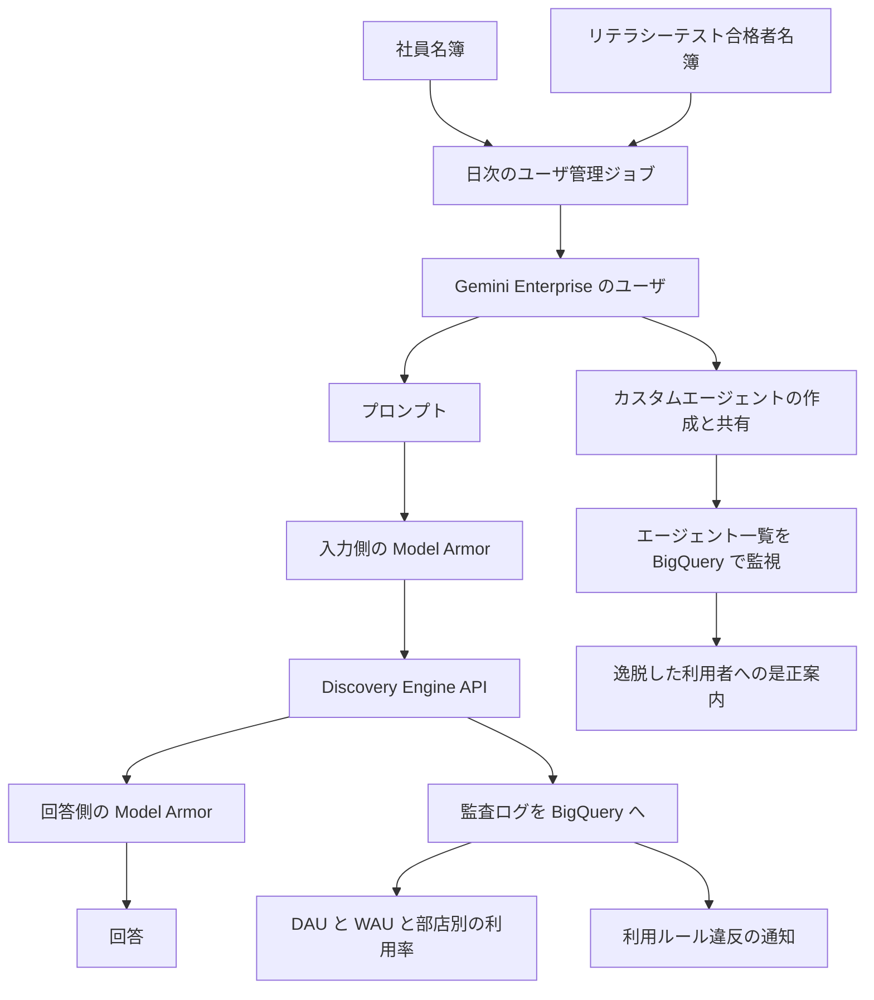

損害保険ジャパンは、2026年1月から全社約2万人を対象に Gemini Enterprise を配り、SOMPOホールディングスの「SOMPO AIエージェント」の主ツールにしています。運用の公開説明は、DX推進部チーフエンジニアの城市由佳理氏が、Google Cloud Next Tokyo 26（2026年7月30日から31日）の技術セッションで示したスライドです。本稿は、ライセンスを配ったあとに発注側が何を数えるかを、そのスライドと会社の公表、製品ドキュメントから整理します。利用率の数字は2026年6月の講演スライドの自己申告で、6月26日と付くのはライセンス割当の21,475名だけです。

*この記事の全体像。以下、順に解説します。*

## 損保ジャパンの Gemini Enterprise 全社展開とは

対象は、損害保険ジャパンが全社に配った Gemini Enterprise と、その登録、入出力、監査、カスタムエージェントの公開された運用です。城市氏はスライドに、導入で一番恐れたこととして、システムが落ちることよりも、社員に使われないことと、不適切な方法で使われることを書いています。

### ユーザー登録

登録は、社員名簿とリテラシーテストの合格者名簿を突き合わせた人に限られます。日次のユーザー管理ジョブが、Gemini Enterprise のユーザーを登録します。ジョブは Cloud Scheduler から Cloud Run を起動します。認定クラウドは VPC Service Controls の内側にあります。Workspace のスプレッドシートは、外部プロキシ経由で読む、とスライドは書いています。

### 入出力のフィルタ

プロンプトと回答は、それぞれ Model Armor のテンプレートを通る、とスライドの図にあります。フィルタの名前は4つです。

- 責任ある AI の安全フィルタ
- プロンプトインジェクションとジェイルブレイク
- 悪意のある URL
- Sensitive Data Protection

### 利用率と通知

利用状況は、Discovery Engine の監査ログを BigQuery に集めます。見る単位は、全体の DAU と WAU、公式ノートブック、公式カスタムエージェント、部店ごとの利用率です。

Cloud Monitoring の通知は3段です。

- ログ上の致命的エラーと利用ルール違反は、即時に通知します。
- 内部エラーは、多発のときだけ通知します。
- Discovery Engine API と Model Armor API の上限逼迫は、予兆として見ます。

### カスタムエージェント

2026年5月に、カスタムエージェントの作成と共有のガバナンスを用意しています。標準機能では作成権と共有権を細かく分けられないため、エージェント一覧を BigQuery で見ます。ルールから外れた利用者には、是正案内を送る、とスライドは書いています。

### 講演スライドが示す2026年6月の現在地

同じスライドの現在地（最新実績は2026年6月）は、次の3つです。

- 対象ユーザーは 21,475名です。括弧には、6月26日のライセンス割当と付いています。
- 平日の日次利用率は 50%超で、約11,900名が毎日活用、と書いてあります。
- 週次利用率は 約80%で、約17,000名が毎週活用、と書いてあります。

スライドの比較表は、AI エージェント運用のリスクに「使われないこと」「不適切な利用」「大規模停止」を並べています。監視の焦点には、「ユーザの利用率、部店ごとの利用率、クォータ、エラー発生傾向」を置いています。

### 公開スライドが描く流れ

公開されたスライドが描く流れは、合格者だけをユーザーにし、アシスタントの入出力を Model Armor に通し、監査ログを利用率とルール違反の通知に分け、カスタムエージェントは事後の是正案内へつなぐ、というものです。

部店別の利用率は、スライドでは先進事例の発見、勉強会の前後、各部店での利用促進に使われています。一次のスライドは、[Google Cloud Next Tokyo 26 の講演 PDF](https://services.google.com/fh/files/events/gcnttky26-d1-aiml-03.pdf) です。

## 注意点

ここからは、スライドの人数、フィルタの文言、製品ドキュメントの範囲が、どこまで揃うかを分けます。

### 公開されている人数

講演スライドは、「2026年1月に全社員2万人へ導入し、高い利用率を伴って軌道に乗せた」と書いています。会社の[ニュースリリース（2025年12月26日）](https://www.sompo-hd.com/-/media/hd/files/news/2025/20251226_1.pdf)は、同じ2026年1月を、国内グループ約30,000人への「SOMPO AIエージェント」本格導入に向けた実証実験の第一弾と呼んでいます。Gemini Enterprise を、その主ツールとしています。損保ジャパン単体の対象は、[社長メッセージ（2026年2月24日）](https://stories.sompo-hd.com/ja/people-culture/sj-people-and-artificial-intelligence/)では全社員約22,000人です。21,475名は2026年6月26日のライセンス割当であり、約22,000人や約30,000人と同じ母数ではありません。

| 数字 | どこに書いてあるか | 読み方 |
|---|---|---|
| 21,475名（6月26日のライセンス割当）。約11,900名、約17,000名、平日 DAU 50%超、WAU 約80%は「最新実績：2026年6月」の枠 | 講演スライド | 登壇資料の自己申告。6月26日は割当人数の括弧にだけ付く。公開されたプレスの範囲では、同じ利用率は出ていない |
| 見出しの「21,000名超」 | 同じスライドの、対象ユーザー数の枠 | 21,475名の概数。毎日の利用者数ではない |
| 約22,000人 | 社長メッセージ 2026-02-24 | 損保ジャパンの対象人数 |
| 約30,000人 | ニュースリリース 2025-12-26 | 国内グループ。注は2025年12月時点の単一グループとしての規模 |
| 配布率 90%（2026年1月）から 99%（2026年6月末） | ITmedia エンタープライズ 2026-09-28 | 講演スライドの本文には無い |
| 公式カスタムエージェント数十件 | キーマンズネット 2026-10-09 | スライドは「公式カスタム Agent」を2026年2月の取り組みに置く。件数は無い |
| 生成内容の最終確認は利用者一人ひとり | ITmedia エンタープライズとキーマンズネットの再構成 | 講演スライドにはその文は無い |
| 部長以上の週次 98%、エージェント1万件超、グループ約34,000人 | この講演スライドには無い | 別登壇の二次報道が伝える数字。2026年6月の現在地には入れない |

約11,900を21,475で割ると約55%です。約17,000を21,475で割ると約79%です。スライドの「50%超」「約80%」と桁は合います。スライドは、率の分母が6月26日の21,475名だとは書いていません。これは同じ画面に並ぶ概数同士の検算であり、新しい測定ではありません。

製品の分析画面では、Daily active users は、サインインして何らかの API を呼んだ人です。ホーム画面を開いた場合を例に含みます（[View and export analytics data](https://docs.cloud.google.com/gemini/enterprise/docs/view-analytics)、Last updated 2026-10-07 UTC）。アシスタントを呼んだ人数は、別の指標です。講演スライドの「毎日活用」が、この定義と同じかは、公開資料からは決まっていません。

### フィルタの文言と製品ドキュメント

スライドは、Sensitive Data Protection を「個人情報や機密性の高い情報を変換、トークン化、削除する」と書いています。[有効化ページ（Last updated 2026-10-07 UTC）](https://docs.cloud.google.com/gemini/enterprise/docs/enable-model-armor)と、[統合ページ（Last updated 2026-10-09 UTC）](https://docs.cloud.google.com/model-armor/model-armor-gemini-enterprise-integration)は、Model Armor が個人情報を除去も改変もせず、去識別の結果を Gemini Enterprise に返さない、と書いています。遮断になるのは、enforcement が Inspect and block（`INSPECT_AND_BLOCK`）のときです。対象は要求と応答です。Inspect only では遮断しません。Agent Gateway の別統合には、違反を block and redact できる、と書くページがあります。そこは、トークン化結果を返す、とは書いていません。損保ジャパンがどの enforcement とどの経路を選んだかは、公開記事とスライドからは決まっていません。

同じ有効化ページは、スクリーニング対象を次に限っています。アシスタント、アプリ内の Workflow Builder で作る employee-made agents、Google 製エージェントです。組織のカスタムエージェント（ADK、A2A、Dialogflow など）との対話は、この統合ではスクリーニングしません。市民開発のエージェントがどちらの実装かは、公開資料からは決まっていません。

Model Armor のシステム上限は、プロンプトと応答で見つかった URL の先頭256件だけをスキャンします（[割り当てとシステム上限](https://docs.cloud.google.com/model-armor/quotas)。英語版の確認は2026年10月11日。検索結果の Published は 2026-10-06）。256件より後は、この上限の対象外です。統合ページには、Gemini Enterprise の画面がこの上限を外すとは書いていません。

### 障害時の通し方

公式の通し方は二つあります。`FAIL_CLOSED` は、Model Armor が止まったとき、正当な対話も止めます。`FAIL_OPEN` は、スクリーニングなしで通します。スライドも公開記事も、損保ジャパンがどちらを選んだかは書いていません。

### クォータの見方

シート課金の機能クォータは、[Quotas and overages（Last updated 2026-10-09 UTC）](https://docs.cloud.google.com/gemini/enterprise/docs/quotas)では、ライセンス数に応じて自動で調整されます。手動の引き上げは不要、とあります。同じページの Discovery Engine レートは、complete query がプロジェクトあたり毎分300です。リージョナル検索は、プロジェクトとロケーションあたり毎分300です（Global、US、EU）。スライドは、上限緩和の申請にリードタイムがあるので、予兆で見る、と書いています。機能クォータの自動調整と、レート上限の予兆監視は、別の枠として並び得ます。どの上限に当たったかは、公開資料からは決まっていません。

### 保存場所と処理場所

[ロケーションのページ（Last updated 2026-10-09 UTC）](https://docs.cloud.google.com/gemini/enterprise/docs/locations)は、保存場所と処理場所を `us`、`eu`、国内リージョンに置くセキュリティ上または規制上の理由がなければ、`global` を勧めています。日本は `asia-northeast1` で、allowlist の GA です。同じページは、国内リージョンの Model Armor について、保存と処理の所在をサポートすると表に書いています。注では、global では Model Armor を使えず、日本などで過去に作ったテンプレートはリージョン外を呼び続ける、と書いています。損保ジャパンの選択は、公開資料からは決まっていません。同じページは、Gemini 2.5 Pro をカナダと日本で2026年10月20日までとし、その後は両リージョンで使えない、と書いています。損保ジャパンがこのモデルを使っているとは、書いていません。

### 公開資料に書かれていないもの

公開したスライド、二つの再構成記事、2025年12月26日のプレスの範囲では、部門ごとの停止条件も、フィルタを緩める例外許可の台帳も、書かれていません。この確認は、東洋経済の本文全文と、動画の字幕と、内部規程を含みません。[セッション動画](https://www.youtube.com/watch?v=kH5EWCJj4EY)の字幕は、本稿の根拠にしていません。「単発例外による過報を防ぎ」は、アラートのノイズを抑える文です。利用の例外許可ではありません。

公式の exclusion rule は、テンプレートに書いた語句を、インジェクション検知と責任ある AI の finding から外す仕組みです。部門許可の手続ではありません。

## 不使用と誤用を別の母数で見る

ライセンスを配り終えたことを、導入完了にはしません。不使用と誤用は、別の会議で見ます。両方の数字が同じ原因で動くときだけ、合同で見ます。

不使用の母数は、会議の見出しに書いた配布対象、または付与済みライセンスです。指標は、平日 DAU、WAU、継続率、部店別です。誤用の母数は、スクリーニングされた対話、または検知イベントです。指標は、Model Armor の判定、利用ルール違反、是正までの時間です。

スライドがこの分け方を支える点は、次のとおりです。

- 城市氏は、一番恐れたことを「社員に使われないこと」と「不適切な方法で使われること」の二つに分けています。比較表の運用リスクにも、使われないことと不適切な利用を置いています。
- 登録、Model Armor、利用率の可視化、事後の是正案内は、スライド上で別の仕掛けです。
- 2026年10月の公式は、プロンプトインジェクションとジェイルブレイクの信頼度を、Gemini Enterprise では High にするよう勧めています。High は、ほぼ確実な違反だけを検知し、偽陽性を下げる側です（Model Armor overview。ページの更新日は 2026-10-09 UTC と記録されています）。損保ジャパンがその信頼度を採用したとは、公開資料は書いていません。
- [金融庁の AI ディスカッションペーパー公表ページ](https://www.fsa.go.jp/news/r6/sonota/20250304/aidp.html)（令和7年3月4日。ページは令和8年3月3日更新で、同日に第1.1版が公表されたと注記しています）は、生成 AI を悪用した犯罪や偽・誤情報の拡散と並べて、「チャレンジしないリスク」を書いています。技術革新に取り残されて、中長期的に良質な金融サービスの提供が困難になる、というリスクです。ページの語句は、従業員の誤用そのものではありません。
- [日本銀行の金融システムレポート別冊の公表ページ](https://www.boj.or.jp/research/brp/fsr/fsrb260806.htm)（2026年8月6日）は、150先への調査のまとめとして、9割強が生成 AI を利用または試行中である、と書いています。情報管理と実務ルールの整備は相応の先で行われ、ガバナンス、サードパーティ、セーフティは「改善の余地がある」または「検討中」が多い、とも書いています。従業員向けチャットの利用率だけでは、このページが挙げる管理項目を覆えません。本文 PDF は本稿では確認しておらず、ここは公表ページの箇条書きです。

分け方の限界は、次のとおりです。

- 偽陽性、クォータ枯渇、`FAIL_OPEN` と `FAIL_CLOSED` は、利用率とブロック件数を同時に動かします。会議を分けただけでは、この結合は見えません。
- スライドの比較表は、監視の焦点を「ユーザの利用率、部店ごとの利用率、クォータ、エラー発生傾向」と一つのマスに置いています。損保ジャパンが二つの会議に分けている、という資料はありません。分けるのは、買う側の指標設計です。
- 城市氏も、基調講演側として報じられる中島正朝氏も、公開肩書は DX推進部に連なります。推進チームとリスク管理部門を分けた組織図は、今回参照した公開資料にはありません。
- 高い DAU は、スクリーニング対象外の経路や、事後是正までの間の利用と並び得ます。
- 合格者だけに権限を付ける設計は、不合格者やライセンス外の従業員が、別の生成 AI を使う余地を残します。その規模は、公開資料にありません。
- 社長メッセージは、効果を削減時間ではなく、AI で質の高い出力を出せる人数で見ると書いています。これは DAU でもブロック件数でもない、第三の母数です。
- プレスは、Copilot Studio の一部検証も予定しています。Gemini Enterprise の利用率は、グループの生成 AI 全体ではありません。
- Model Armor の判定ログには、公式の説明ではクエリ本文が入りません。本文が要るときは、プロンプトと応答のログを別に有効にします。公開記事は、Discovery Engine の監査ログを BigQuery に入れたと書き、本文を残しているとは書いていません。

## 発注側が自分で置く点検

事例が公開しているものと、発注側が自分で定義するものを分けます。

事例が示しているものは、次のとおりです。

- 配布の前に、合格の名簿があります。
- アシスタントの入力と回答に、名前の付いたフィルタがあります。
- 利用率は全体、機能別、部店別で持ちます。部店は、止める条件ではなく、促進に使っています。
- ルール違反は、即時通知の対象に入っています。件数の目標は、発表されていません。
- 作成と共有は、止めずに見て、外れた人に是正案内を送ります。
- クォータの逼迫を、使えなくなる前に見ます。理由は、使えないと定着が落ちるから、とスライドが書いています。

事例が書いていないので、発注側が自分で置くものは、次のとおりです。

- 部門、またはエージェントの種類を止める条件と、その決裁者。
- フィルタを外す、または特定の業務だけ通すときの台帳。誰が足し、いつ外すか。
- ログを人が見る周期と、プロンプト本文を読めるロール。
- 利用率の目標値を、ブロック件数と同じ議案に載せないこと。

推進の会議に置くものです。母数は、見出しに「配布対象」または「付与済みライセンス」と書きます。

| 見るもの | 置かないもの |
|---|---|
| 配布率、平日 DAU、WAU、継続率 | Model Armor のブロック件数 |
| 部店ごとの未利用。先進部店の紹介だけにしない | 利用ルール違反の件数 |
| 勉強会の前後 | 是正案内の件数 |
| 公式ノートブックと、公式エージェントの利用 | フィルタの閾値変更 |

リスクの会議に置くものです。母数は、スクリーニングされた対話、または検知イベントと書きます。

| 見るもの | 置かないもの |
|---|---|
| フィルタ別の判定とブロック | 利用率の目標 |
| `FAIL_OPEN` になっていた時間 | 勉強会の参加人数 |
| 公式が対象外とするカスタムエージェント経路に、自社の市民開発が乗っていないか | 部店の DAU 順位 |
| 逸脱の検知から是正案内までの時間 | |
| Model Armor と Discovery Engine の残クォータ。成功指標ではなく制約 | |
| プロンプト本文を照会できる人の範囲 | |

合同の会議は、次のどれかが動いたときだけ開きます。クォータ枯渇、`FAIL_OPEN` または `FAIL_CLOSED`、偽陽性の上昇、合格ゲートの外での別ツール利用です。ここでは、利用率を下げる判断と、検知を減らす判断を、同じテーブルで扱います。

責任の置き方は、資料の部署名を写しません。推進は、使われていない母集団への介入を持ちます。リスク管理は、閾値、障害時の通し方、ログの閲覧範囲、例外を許すならその台帳、部門またはエージェント種別を止める判断を持ちます。同じ DX 部門が両方を運営してもかまいません。指標の母数は、分けたままにします。出力の質を出せる人数は、社長メッセージが書いた第三の母数です。管理職以上のリーダーシップ研修（プレスが必須と書いたもの）の側で見ます。

逆転する条件は、次のとおりです。見ている画面が利用率だけなら、会議を二つにしても中身は同じです。Model Armor が `FAIL_OPEN` であるか、従業員が使うエージェントがスクリーニング対象外なら、ブロック件数は誤用を小さく見せます。偽陽性が高いとき、利用率の目標はフィルタを緩める圧力になります。その圧力は、合同の会議の議題です。

公開資料がまだ答えない確認項目は、次のとおりです。

- アプリと Model Armor テンプレートのリージョン。処理が日本に留まる構成か。
- `FAIL_OPEN` か `FAIL_CLOSED` か。プロンプト用と回答用でテンプレートを分けているか。信頼度は High か。
- 日本語の氏名、マイナンバー、保険の要配慮情報を、どの infoType で見ているか。
- 市民開発エージェントは、Workflow Builder か、ADK、A2A、Dialogflow か。
- DAU と WAU の定義。利用ルール違反は、Model Armor のブロックと同じイベントか。
- プロンプト本文を残しているか。残すなら、誰が読めるか。
- 2026年1月の実証実験を、社内では終了したと呼んでいるか。
- Copilot Studio の検証範囲。Gemini の数字が、全生成 AI の代理になっていないか。
- VPC Service Controls の内側から、Model Armor のリージョナルエンドポイントへ、Private Service Connect が要るか。公開記事と講演スライドは、スプレッドシートへの外部プロキシを書き、Model Armor の閉域経路は書いていません。

## まとめ

損害保険ジャパンの公開スライドは、Gemini Enterprise を合格者へ配り、入出力を Model Armor に通し、監査ログを利用率とルール違反の通知に分け、カスタムエージェントは事後の是正案内で見ています。2026年6月の 21,475名はライセンス割当であり、約2万人、約22,000人、国内グループ約30,000人と同じ母数ではありません。平日約11,900名と週次約17,000名は、同じスライドの自己申告です。

Sensitive Data Protection のスライド文言と、2026年10月の製品ドキュメントは、個人情報の変換と遮断の範囲が揃っていません。スクリーニング対象、`FAIL_OPEN` と `FAIL_CLOSED`、処理リージョン、DAU の定義は、公開資料からは決まっていません。ブロック件数を、誤用の全体と読まない材料がここにあります。

発注側は、不使用を配布対象または付与済みライセンスの会議で見ます。誤用を、スクリーニングされた対話または検知イベントの会議で見ます。合同にするのは、クォータ、障害時の通し方、偽陽性、合格ゲートの外の別ツールが、両方の数字を同時に動かすときです。出力の質を出せる人数は、第三の母数として、管理職研修の側に置きます。

この記事が少しでも参考になった、あるいは改善点などがあれば、ぜひリアクションやコメント、SNSでのシェアをいただけると励みになります！

## 参考リンク

- [城市由佳理「損害保険ジャパンにおける2万人規模の Gemini Enterprise 安定運用を支える技術的アプローチ」Google Cloud Next Tokyo 26](https://services.google.com/fh/files/events/gcnttky26-d1-aiml-03.pdf)
- [SOMPOホールディングス ニュースリリース、2025年12月26日](https://www.sompo-hd.com/-/media/hd/files/news/2025/20251226_1.pdf)
- [石川耕治、Sompo ストーリーズ、2026年2月24日](https://stories.sompo-hd.com/ja/people-culture/sj-people-and-artificial-intelligence/)
- [ITmedia エンタープライズ、2026年9月28日](https://www.itmedia.co.jp/enterprise/articles/2609/28/news016.html)
- [ITmedia キーマンズネット、2026年10月9日](https://kn.itmedia.co.jp/kn/article/2610/09/2000002145/)
- [Google Cloud Japan、セッション動画、公開表示 2026年10月1日](https://www.youtube.com/watch?v=kH5EWCJj4EY)
- [Enable Model Armor in Gemini Enterprise、Last updated 2026-10-07 UTC](https://docs.cloud.google.com/gemini/enterprise/docs/enable-model-armor)
- [Model Armor と Gemini Enterprise の統合、Last updated 2026-10-09 UTC](https://docs.cloud.google.com/model-armor/model-armor-gemini-enterprise-integration)
- [Quotas and overages、Last updated 2026-10-09 UTC](https://docs.cloud.google.com/gemini/enterprise/docs/quotas)
- [Data residency（locations）、Last updated 2026-10-09 UTC](https://docs.cloud.google.com/gemini/enterprise/docs/locations)
- [View and export analytics data、Last updated 2026-10-07 UTC](https://docs.cloud.google.com/gemini/enterprise/docs/view-analytics)
- [Model Armor の割り当てとシステム上限](https://docs.cloud.google.com/model-armor/quotas)
- [金融庁、AI ディスカッションペーパーの公表について、令和7年3月4日（ページ注: 令和8年3月3日に第1.1版）](https://www.fsa.go.jp/news/r6/sonota/20250304/aidp.html)
- [日本銀行、金融機関における生成 AI の利用状況とリスク管理、2026年8月6日](https://www.boj.or.jp/research/brp/fsr/fsrb260806.htm)
