Google の Gemini API に追加された Managed Agents を、構造・データ・構築・利用・運用の観点で整理します。焦点は、エージェント実装を「同期 HTTP の 1 回処理」から「ジョブ化された非同期実行」に切り替える実行制御の転換です。あわせて、リモート MCP サーバー直結・カスタム関数呼び出し・認証情報の差し替え・隔離クラウドサンドボックスという 4 つの拡張を扱います。起点は Google AI Blog の発表記事（2026-07-07 公開）です。

> **読み始める前に（2 つの「Gemini エージェント基盤」の区別）**: Google には名前が似た基盤が 2 系統あります。混同しやすいため、先に区別を示します。
> - **Gemini API（Developer API、`ai.google.dev`、API キー認証、`generativelanguage.googleapis.com`）** — 本記事の対象。サンドボックス内エージェントが **client** として外部のリモート MCP サーバーへ接続します。
> - **Gemini Enterprise Agent Platform（`docs.cloud.google.com`、ADC/gcloud 認証、`aiplatform.googleapis.com`）** — Google Cloud 自身が **server** としてリモート MCP を公開し、IAM Deny で統制する別製品です。
>
> 両者は MCP という同じプロトコルを使いながら、client と server の立場が逆です。本記事は Gemini API 側の「非同期実行のジョブモデル」「client として MCP へ直結する接続・認証・状態保持」「サンドボックス実行基盤」に焦点を当てます。Interactions API のリクエスト構造（`agent` / `background` / `environment` / `tools` 等）は両系統でほぼ共通です。

## 概要

### 目的・位置づけ

Gemini API Managed Agents は、Gemini Interactions API 上で提供される「サーバー管理型のエージェント実行機能」です。

開発者は単一のエンドポイントを呼び出すだけで、推論・コード実行・パッケージインストール・ファイル管理・Web 情報取得を、Google が管理する隔離クラウドサンドボックス（isolated cloud sandbox）内でまとめて実行できます。

Interactions API は、Gemini の「モデル呼び出し」と「エージェント呼び出し」を単一インターフェースに統合したものです。Managed Agents は、この Interactions API が提供するエージェント種別の 1 つ（Deep Research などと並ぶ）という位置づけです。

2026-07-07 の拡張発表は、Managed Agents を次の 5 方向に強化します。

- 同期呼び出し前提だった実行を、非同期ジョブとして扱えるようにする（background execution）
- サンドボックス内のエージェントが、外部のリモート MCP サーバーに直接つながる（remote MCP integration）
- ビルトインツールに加えて、開発者自身の API・関数を呼び出せる（custom function calling）
- サンドボックスの状態を保ったまま、認証情報だけを差し替えられる（credential refresh）
- 上記すべての実行基盤として、隔離されたクラウドサンドボックスを提供する（isolated cloud sandbox）

### 従来手法との違い

Managed Agents 登場前、開発者がエージェントを構築する方法は主に 2 つでした。

1. `generateContent` を単発で呼び出し、ツール呼び出し結果を自前ループで往復させる方法
2. 上記に加えて、コード実行環境やファイルシステムなどの実行基盤を自前で構築・運用する方法

いずれの方法でも、次の作業は開発者の責任範囲でした。

- サンドボックス（隔離実行環境）のプロビジョニングと破棄
- セッション状態（ファイル・インストール済みパッケージ等）の永続化
- 認証情報のローテーションと注入
- 長時間実行時の HTTP 接続維持、またはポーリング機構の自作

Managed Agents は、これらのインフラ管理を Google 側に委譲します。開発者はエージェントの振る舞いを定義するだけで、実行基盤そのものは意識しません。

### 同期 HTTP 1 回処理から非同期ジョブ実行への転換

従来の `generateContent` は、1 回の HTTP リクエストが 1 回のレスポンスで完結する同期処理でした。

Managed Agents の拡張により、`background: true` を指定すると、リクエストは即座に ID を返して終了します。エージェントはその後もサーバー側で処理を継続し、クライアントは ID を使って状態をポーリングしたり、進捗をストリーミング購読したり、後から再接続したりできます。

この転換により、長時間かかるコーディングタスクやリサーチタスクを、HTTP 接続を張ったまま待つ必要がなくなります。

### 関連手法との比較

| 比較対象 | 実行方式 | 状態保持 | ツール実行の場所 | MCP 接続 | サンドボックス |
|---|---|---|---|---|---|
| Gemini API Managed Agents | 同期 / 非同期（`background: true`）の両対応 | サーバー側の interaction・environment が保持。`environment_id` で再開・認証情報のみ差し替え可能 | 隔離クラウドサンドボックス（Linux）内。ビルトインツールはサーバー側で自動実行 | サンドボックス内のエージェントが **client** として外部のリモート MCP サーバーに直結（`mcp_server` ツール） | あり。コード実行・ファイル管理・Web 閲覧を行う Linux サンドボックス |
| 自前 agent ループ + 関数呼び出し | 同期 `generateContent` の往復を開発者コードでループ | 開発者がプロンプト履歴・DB 等で自前管理 | 開発者インフラ（自社サーバー/コンテナ）。モデルは呼び出し指示を返すのみ | 開発者が MCP クライアントを自前実装する必要あり | 開発者が自前で構築・運用する必要あり |
| OpenAI Assistants / Responses 系 | Responses API は 1 回の呼び出しで複数ツールを内部完結。Assistants API は非同期実行に対応 | Assistants は thread 単位、Responses は response id で継続 | OpenAI 側マネージドツール内で実行 | ツールとして対応（実装方式は Managed Agents の MCP 直結とは別） | code interpreter 等、用途限定のサンドボックス |
| Gemini Enterprise Agent Platform のリモート MCP サーバー | 常時稼働のサーバーとして公開し、クライアントからの接続を待ち受ける | Google Cloud 側で Agent Platform リソースを管理 | Google Cloud のリソースへのアクセスをサーバー側で提供 | Google Cloud が **server** として MCP を公開し、外部エージェントが **client** として接続。IAM Deny で統制 | 該当なし（MCP のゲートウェイであり、コード実行サンドボックスではない） |

**役割が逆である点の補足:**

- Gemini API Managed Agents の remote MCP integration は、Google のサンドボックス内エージェントが **client** となって、開発者側の private database・internal API を公開するリモート MCP サーバーに**つなぎに行く**機能です。
- Gemini Enterprise Agent Platform のリモート MCP サーバーは、Google Cloud 自身が **server** として MCP エンドポイントを公開し、Claude Code や Antigravity CLI などの外部エージェントが **client** として**つなぎに来る**ための機能です。
- 両者は別製品であり、MCP という同じプロトコルを使いながら、クライアントとサーバーの立場が入れ替わっています。

## 特徴

Managed Agents の 2026-07-07 拡張は、次の 5 本柱で構成されます。

- **Background execution（非同期実行）** — `background: true` を指定すると、リクエストは即座に ID を返し、処理はサーバー側で継続します。クライアントは ID を使って、状態のポーリング・進捗のストリーミング・後からの再接続のいずれかを選べます。実行中ジョブのキャンセルにも対応します。長時間の HTTP 接続を張り続ける必要がなくなります。
- **Remote MCP integration（リモート MCP サーバー直結）** — サンドボックス内のエージェントが、カスタムプロキシ middleware なしで外部のリモート MCP サーバーに直接接続できます。`mcp_server` ツールを、Google Search やコード実行と並ぶ 1 つのツールとして interaction 時に指定します。private database や internal API へのアクセスを、サンドボックスの隔離を保ったまま実現します。
- **Custom function calling（カスタム関数呼び出し）** — ビルトインのサンドボックスツールに加えて、開発者独自のツール（関数）を追加できます。API は「ステップマッチング」を行い、ビルトインツールはサーバー側で自動実行される一方、カスタム関数は `requires_action` を返してクライアント側実行に委ねます。サーバー側実行とクライアント側実行が、1 つの interaction の中で混在します。
- **Credential refresh（認証情報の差し替え）** — 既存の `environment_id` に、新しい `network` 設定を渡すことで、アクセストークンの更新や API キーのローテーションができます。サンドボックスのファイルシステム状態・インストール済みパッケージ・クローン済みリポジトリは、差し替え後も保持されます。エージェント定義を書き換えずに、期限切れトークンの更新だけを行えます。
- **Isolated cloud sandbox（隔離クラウドサンドボックス）** — 各 invocation は base environment を fork するため、実行のたびにクリーンな状態から始まります。サンドボックスは他のサンドボックスやホストシステムから隔離されます。ファイルシステムは複数ターンの interaction をまたいで永続化され、bash ターミナルによるコマンド実行・ローカルファイル処理をサポートします。この隔離基盤が、他 4 機能の実行土台になります。

### 実行制御の責任境界

Managed Agents では、実行制御の責任が開発者と Google の間で次のように分かれます。

| 責任範囲 | 担当 |
|---|---|
| エージェントの振る舞い定義（instructions・skills） | 開発者 |
| ビルトインツールの実行（コード実行・Web 閲覧・Google Search） | Google（サンドボックス内で自動実行） |
| カスタム関数の実行 | 開発者（`requires_action` を受けてクライアント側で実行） |
| リモート MCP サーバー自体の運用・可用性 | 開発者（自社の MCP サーバー） |
| サンドボックスのプロビジョニング・隔離・破棄 | Google |
| 認証情報のローテーション判断とタイミング | 開発者（`environment` 更新のトリガー） |

## 構造

Gemini API Managed Agents の内部構造を、C4 model の 3 段階で図解します。焦点は「クライアントアプリ ↔ Interactions API ↔ 隔離クラウドサンドボックス ↔ リモート MCP サーバー / ビルトインツール」の実行制御の責任境界です。

### システムコンテキスト図

Managed Agents は、エージェント設定を作る「開発者」と、Interactions API を呼び出して実行する「クライアントアプリ」の 2 者から利用されます。実行時は、社内 DB・内部 API を公開する「リモート MCP サーバー」と、Google Search 等の「組み込みツール群」という 2 種類の外部システムに接続します。

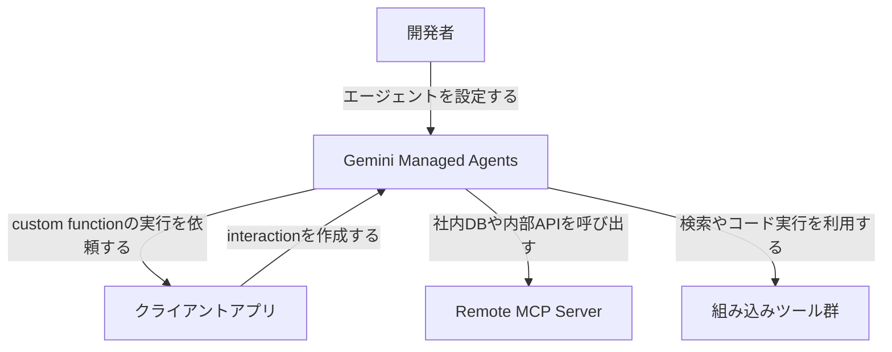

| 要素名 | 説明 |
|---|---|
| 開発者 | エージェントの指示・skill・環境設定を Agents API 経由で登録する担当者です |
| クライアントアプリ | Interactions API を呼び出し、実行結果を受け取るアプリケーションです |
| Gemini Managed Agents | Interactions API を単一窓口として、推論からツール実行までを担うマネージドサービスです |
| Remote MCP Server | 社内 DB や内部 API を MCP プロトコルで公開する、エージェント外部のサーバーです |
| 組み込みツール群 | Google Search・code execution など、エージェントが標準で使う外部ツール群です |

### コンテナ図

Gemini Managed Agents をドリルダウンすると、設定を扱う Agents API（control plane）と実行を扱う Interactions API（data plane）に分かれます。実行系は、非同期ジョブ制御・隔離クラウドサンドボックス・tool 実行制御・MCP client・credential/environment 管理の 5 コンテナで構成されます。tool 実行制御は、ビルトインツールをサンドボックス内で自動実行する一方、カスタム関数は `requires_action` 状態でクライアントアプリに実行を差し戻します。この分岐が、サーバー側実行とクライアント側実行の境界です。

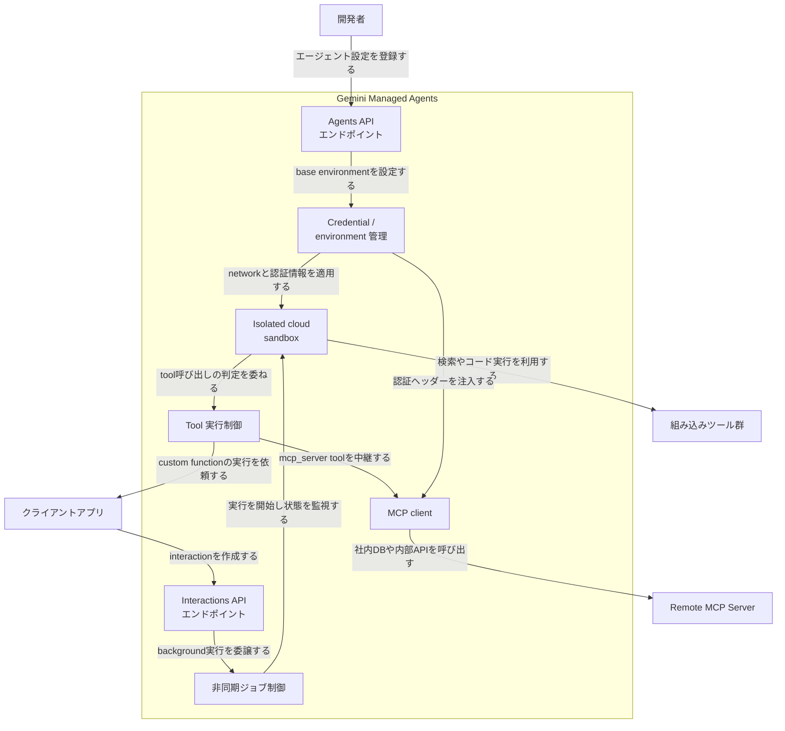

| 要素名 | 説明 |
|---|---|
| Agents API エンドポイント | エージェント設定（base_agent・tools・system_instruction・base_environment）を作成・更新・削除する control plane です |
| Interactions API エンドポイント | interaction の作成・取得・キャンセルを受け付ける data plane です |
| 非同期ジョブ制御 | background 実行の受付、状態遷移の管理、poll・stream・cancel への応答を担います |
| Isolated cloud sandbox | reasoning・code execution・package install・file・web を実行する隔離環境です |
| Tool 実行制御 | ビルトインツールとカスタム関数を判定し、実行主体を振り分けます |
| MCP client | サンドボックス内からリモート MCP サーバーへ接続し、tool 呼び出しを中継します |
| Credential / environment 管理 | environment_id・network allowlist・認証情報の注入とリフレッシュを扱います |

### コンポーネント図

3 つの主要コンテナをさらにドリルダウンします。実行制御の境界は、Tool 実行制御の内部にある「Step 種別判定部」が担います。ビルトインツールは同判定部からサンドボックス内で完結し、カスタム関数は判定部からクライアントアプリへ制御が戻ります。

#### 非同期ジョブ制御

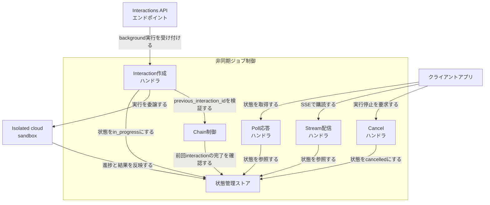

| 要素名 | 説明 |
|---|---|
| Interaction作成ハンドラ | `background: true` の interaction を受け付け、状態を in_progress にしてサンドボックスへ実行を渡します |
| 状態管理ストア | in_progress・requires_action・completed・cancelled・failed 等の状態を保持します |
| Poll応答ハンドラ | 非ブロッキングの GET リクエストに、現在の状態を返します |
| Stream配信ハンドラ | interaction 作成から完了までの SSE イベントを配信し、last_event_id での再接続にも応答します |
| Cancelハンドラ | クライアントアプリからの停止要求を受け、状態を cancelled にします |
| Chain制御 | previous_interaction_id で指定された前段 interaction を引き継ぎ、後続を実行します |

#### Isolated cloud sandbox

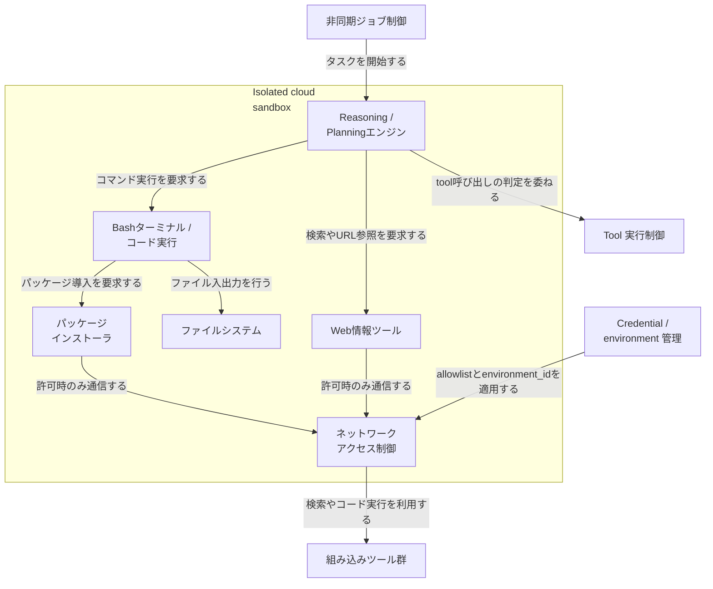

| 要素名 | 説明 |
|---|---|
| Reasoning / Planningエンジン | モデルの推論とワークフローの計画を担い、他コンポーネントへ実行を振り分けます |
| Bashターミナル / コード実行 | シェルコマンドやスクリプトを実行します |
| パッケージインストーラ | ネットワーク許可時に、pip や npm でパッケージを導入します |
| ファイルシステム | `/workspace` を中心に、ファイルと実行状態を複数ターンにわたり永続化します |
| Web情報ツール | Google Search・URL Context など、web 情報の取得を担います |
| ネットワークアクセス制御 | デフォルトで外部通信を遮断し、allowlist に基づいてのみ通信を許可します |

#### Tool 実行制御と実行境界

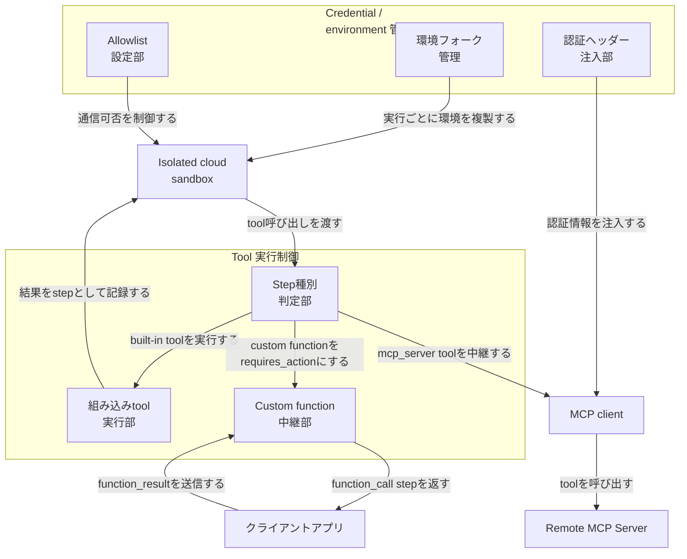

| 要素名 | 説明 |
|---|---|
| Step種別判定部 | tool 呼び出しが built-in か custom function か mcp_server かを判定します |
| 組み込みtool実行部 | code execution・google_search 等をサンドボックス内で自動実行します |
| Custom function中継部 | interaction を `requires_action` にし、function_call step をクライアントアプリへ返します。クライアントアプリが実行した結果は、function_result としてこの中継部が受け取ります |
| MCP client | mcp_server tool の設定に基づき、リモート MCP サーバーへ接続して tool を呼び出します |
| 環境フォーク管理 | interaction ごとに base_environment を複製し、実行環境をクリーンな状態から開始させます |
| Allowlist設定部 | 通信を許可するドメインを environment_id 単位で管理します |
| 認証ヘッダー注入部 | allowlist に登録したドメイン向けのリクエストへ、認証情報を注入・更新します |

## データ

Interactions API が扱う主要エンティティをモデル化します。対象はエンティティの属性です。

### 概念モデル

Interaction は 1 回の会話・実行タスクを表す中心エンティティです。Interaction は複数の Step・1 件の TokenUsage・1 件の InteractionStatus を所有します。Environment は複数の NetworkRule を所有します。Tool は mcp_server 種別のときに 1 件の McpServerConnection を所有します。ManagedAgent・Interaction は、Tool と Environment をそれぞれ参照（利用）します。

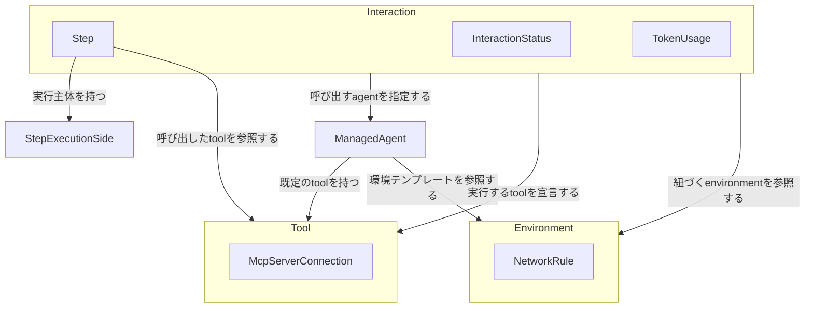

| エンティティ名 | 説明 |
|---|---|
| Interaction | 会話または実行タスクの 1 ターンを表す単位です |
| Step | Interaction 内の 1 実行単位です。モデルのテキスト出力、ビルトインツール呼び出し、カスタム関数の呼び出し/結果のいずれかを表します |
| InteractionStatus | Interaction の実行状態を表す列挙値です |
| TokenUsage | Interaction 1 回あたりのトークン使用量集計です |
| StepExecutionSide | Step の実行主体の区分です。ビルトインツールはサーバー側、カスタム関数はクライアント側で実行します |
| ManagedAgent | Google 管理の組み込み agent（Deep Research 等）、または開発者が Agents API で定義する custom agent の設定です |
| Environment | サンドボックスの状態（ファイルシステム・インストール済みパッケージ・クローン済みリポジトリ）とネットワーク許可設定を保持する実行環境です |
| NetworkRule | Environment 内の通信許可ルール 1 件です。ドメインと認証情報注入設定を持ちます |
| Tool | エージェントが呼び出せる能力の宣言です。built-in tool・custom function・mcp_server のいずれかです |
| McpServerConnection | Tool の種別が mcp_server のときの接続設定です。URL と認証ヘッダーを持ちます |

### 情報モデル

Interaction は previous_interaction_id で自分自身を参照し、複数ターンの会話を連結します。ManagedAgent は組み込み agent と custom agent の両方を包含します。組み込み agent（Deep Research 等）は Agents API での事前作成が不要で、id を Interaction.agent に直接渡して呼び出します。custom agent は base_agent で基盤ランタイムを指定します。

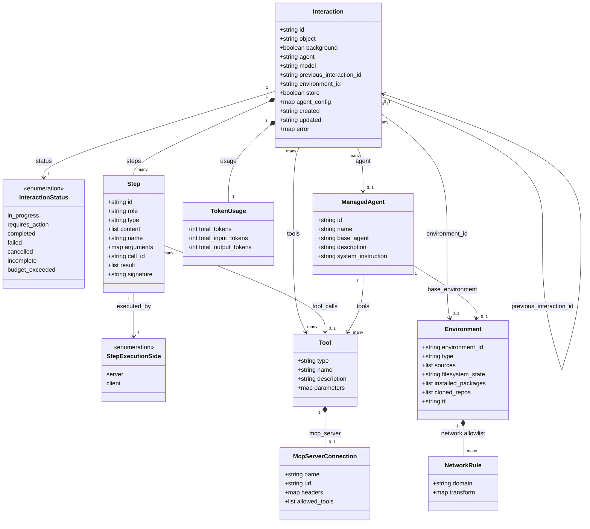

#### InteractionStatus の実値

| 値 | 意味 |
|---|---|
| in_progress | サーバーが実行中です（コード実行や調査など） |
| requires_action | クライアントの入力（function_result 等）を待機中です |
| completed | 正常終了しました。出力が確定しています |
| incomplete | 完了はしたが結果が不完全です（max_tokens 到達など） |
| budget_exceeded | トークン予算の上限に達して停止しました |
| failed | ツール失敗やレート制限などでエラー終了しました |
| cancelled | クライアントの停止要求で終了しました |

`in_progress` / `requires_action` 以外はすべて terminal state です。poll ループはこの 2 値以外を終了条件にします。

#### 公式ドキュメント未確認 / 推測の注記

- interaction のステータスフィールド名は、一次情報の API リファレンス（`ai.google.dev/api/interactions-api`）では一貫して `status` です。`state` という別名は確認できませんでした。本ドキュメントのコード例は `status` を採用しています。
- Step.type が取りうる全値（text / function_call / function_result / thought / google_search_call 等）は、個別の例示のみ確認できました。列挙の網羅性は未確認です。
- StepExecutionSide という区分・フィールド名自体は未確認です。「ビルトインツールはサーバー側、カスタム関数はクライアント側で実行する」という概念は一次情報で確認済みです。
- Environment.filesystem_state / installed_packages / cloned_repos は、個別のフィールド名は未確認です。「サンドボックスの状態（file system state = installed packages, files, repositories）が resume 時に保持される」という仕様は確認済みです。
- Interaction の実フィールドには、本モデルに載せた属性のほか `service_tier`（`flex` / `standard` / `priority`）・`webhook_config`（background 完了の通知手段）が存在します。`Tool` の `mcp_server` には利用可能ツールを絞り込む `allowed_tools` フィールドがあります。
- `NetworkRule.transform` は、environment ガイドではヘッダーの key-value オブジェクト（例: `{"Authorization": "Bearer ..."}`）と説明されています。一方 API リファレンスの allowlist スキーマでは配列表現になっており、一次ソース間で表現に差があります。本ドキュメントのコード例は environment ガイドの key-value 形式に従います。

## 構築方法

### 前提条件

| 項目 | 内容 |
|---|---|
| API キー取得 | [aistudio.google.com/apikey](https://aistudio.google.com/apikey) から発行します |
| Python SDK | `google-genai`（Interactions API 対応版） |
| JS/TS SDK | `@google/genai`（Interactions API 対応版） |
| REST | `curl` 等で直接 HTTPS 呼び出し可能です |
| サンドボックス実行環境 | managed agent 内部は Ubuntu ベースで、Python・Node.js が事前インストール済みです |
| サンドボックスのリソース | 固定割り当てで CPU 4 コア / メモリ 16 GB です |
| 環境の保持期間 | サンドボックス（environment）は最終アクティブから 7 日間保持され、以後は削除されます（`environment_id` で resume 可能） |

> SDK の最新バージョンは PyPI / npm の最新を正とします。SDK パッケージ名・メソッド名は公式 quickstart のコードサンプルで確認してください。

SDK インストールコマンドです。

```bash
# Python
pip install google-genai

# JavaScript / TypeScript
npm install @google/genai
```

### 認証

API キーを環境変数 `GEMINI_API_KEY` に設定します。

```bash
export GEMINI_API_KEY="YOUR_API_KEY"
```

Python / JS の SDK は環境変数を自動で読み込みます。

```python
from google import genai

client = genai.Client()
```

```javascript
import { GoogleGenAI } from "@google/genai";

const client = new GoogleGenAI({});
```

REST（cURL）の場合は、`x-goog-api-key` ヘッダーで API キーを渡します。API のバージョン固定用ヘッダーも付与できます。

```bash
curl -X POST "https://generativelanguage.googleapis.com/v1beta/interactions" \
  -H "x-goog-api-key: $GEMINI_API_KEY" \
  -H "Content-Type: application/json" \
  -d '{"model": "gemini-3.5-flash", "input": "hello"}'
```

### 対応言語

- Python（`google-genai`）
- JavaScript / TypeScript（`@google/genai`）
- cURL（REST、`https://generativelanguage.googleapis.com/v1beta/interactions`）

### managed agent の登録

一度きりの呼び出しでなく、再利用可能な agent 定義を作るときは `agents.create` を使います。`base_agent` に組み込みベースエージェントを指定し、`system_instruction` や `base_environment`（mount するファイル・skill・ネットワーク allowlist）を登録します。

```python
agent = client.agents.create(
    id="data-analyst",
    base_agent="antigravity-preview-05-2026",
    system_instruction="You are a data analyst...",
    base_environment={
        "type": "remote",
        "sources": [
            {
                "type": "inline",
                "target": ".agents/AGENTS.md",
                "content": "..."
            },
            {
                "type": "repository",
                "source": "https://github.com/org/repo",
                "target": "/workspace/templates"
            }
        ]
    }
)
```

`base_environment.sources[].type` は、environment ガイドが `inline`（インラインコンテンツ）/ `repository`（Git）/ `gcs`（Cloud Storage）の 3 種を挙げています。API リファレンス（`ai.google.dev/api/interactions-api`）はこれに加えて `skill_registry` を列挙しています。既存 environment の再利用（fork）は `sources[].type` の値ではなく、`environment` / `base_environment` に既存の `environment_id` 文字列を渡す別メカニズムで実現します（例: `environment=interaction.environment_id`）。

登録済み agent の基本操作（list / get / delete）です。

```python
# 一覧
agents = client.agents.list()

# 取得
agent = client.agents.get(id="data-analyst")

# 削除
client.agents.delete(id="data-analyst")
```

## 利用方法

### API 必須パラメータ

`interactions.create` の主要パラメータです。エンドポイントは単一です。

| Method | Endpoint |
|---|---|
| `POST` | `https://generativelanguage.googleapis.com/v1beta/interactions` |
| `GET` | `https://generativelanguage.googleapis.com/v1beta/interactions/{id}`（poll / stream 再接続） |
| `POST` | `https://generativelanguage.googleapis.com/v1beta/interactions/{id}/cancel`（キャンセル） |

| パラメータ | 型 | 必須 | 説明 |
|---|---|---|---|
| `model` | string | `agent` 未指定時は必須 | 生成に使うモデル名 |
| `agent` | string | `model` 未指定時は必須 | 呼び出す agent 名（組み込み agent ID、または登録済み managed agent の `id`） |
| `input` | string / Content配列 | 必須 | ユーザー入力・タスク内容 |
| `background` | boolean | 任意 | `true` でサーバー側非同期実行にする |
| `stream` | boolean | 任意 | `true` でストリーミング応答にする |
| `store` | boolean | 任意 | interaction を後で取得できるよう保存するか |
| `environment` | string / object | 任意 | 既存 environment_id（文字列）、または `{"type": "remote", ...}` で新規サンドボックス設定 |
| `previous_interaction_id` | string | 任意 | 直前の interaction ID。マルチターンや function_result の返送に使う |
| `tools` | Tool配列 | 任意 | `google_search` / `code_execution` / `mcp_server` / `function` などを混在指定できる |
| `system_instruction` | string | 任意 | agent の挙動を上書きする指示 |

### 基本の interaction 作成

単一エンドポイントへの `interactions.create` 呼び出しが最小単位です。

```python
from google import genai

client = genai.Client()

interaction = client.interactions.create(
    model="gemini-3.5-flash",
    input="Explain serverless computing in one sentence."
)
print(interaction.output_text)
```

```javascript
import { GoogleGenAI } from "@google/genai";

const client = new GoogleGenAI({});

const interaction = await client.interactions.create({
    model: "gemini-3.5-flash",
    input: "Explain serverless computing in one sentence.",
});
console.log(interaction.output_text);
```

```bash
curl -X POST "https://generativelanguage.googleapis.com/v1beta/interactions" \
  -H "x-goog-api-key: $GEMINI_API_KEY" \
  -H "Content-Type: application/json" \
  -d '{
    "model": "gemini-3.5-flash",
    "input": "Explain serverless computing in one sentence."
  }'
```

managed agent（サンドボックス付き）を呼ぶ場合は、`model` の代わりに `agent` と `environment` を指定します。

```python
interaction = client.interactions.create(
    agent="antigravity-preview-05-2026",
    input="Write a Python script that generates the first 20 Fibonacci numbers and saves them to fibonacci.txt. Then read the file and print its contents.",
    environment="remote",
)

print(f"Interaction ID: {interaction.id}")
print(f"Environment ID: {interaction.environment_id}")
print(f"Output: {interaction.output_text}")
```

マルチターンは `previous_interaction_id` と `environment`（前ターンの `environment_id`）を渡してサンドボックスを継続します。

```python
interaction_2 = client.interactions.create(
    agent="antigravity-preview-05-2026",
    previous_interaction_id=interaction.id,
    environment=interaction.environment_id,
    input="Now plot the Fibonacci sequence as a line chart and save it as chart.png.",
)
print(interaction_2.output_text)
```

### background execution（非同期実行）

`background: true` を渡すとサーバー側で非同期実行され、即座に interaction ID が返ります。クライアントは poll / stream / reconnect / cancel のいずれかで結果を取得します。

次は代表的な状態遷移の簡略図です。実際には `requires_action`（カスタム関数の実行待ち）・`incomplete`・`budget_exceeded` も terminal 側の状態として現れます。

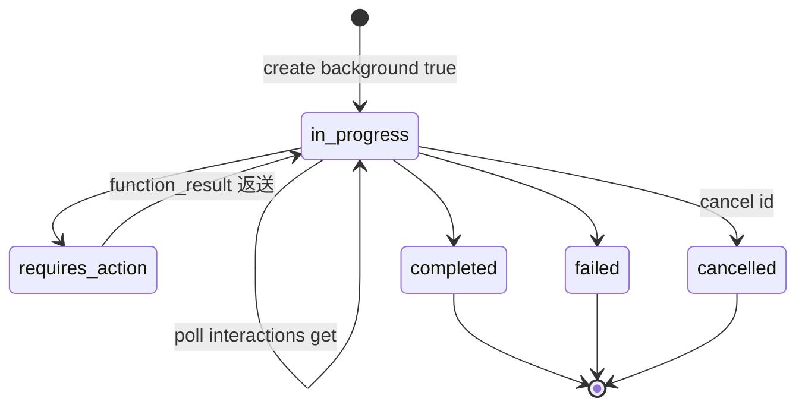

**起動**

```python
interaction = client.interactions.create(
    model="gemini-3.5-flash",
    input="Write a guide on space exploration.",
    background=True,
)
```

```javascript
const interaction = await client.interactions.create({
    model: "gemini-3.5-flash",
    input: "Write a guide on space exploration.",
    background: true,
});
```

```bash
curl -X POST "https://generativelanguage.googleapis.com/v1beta/interactions" \
  -H "x-goog-api-key: $GEMINI_API_KEY" \
  -H "Content-Type: application/json" \
  -d '{"model": "gemini-3.5-flash", "input": "...", "background": true}'
```

**poll（非ブロッキングで状態確認）**

```python
import time

interaction = client.interactions.get(id="YOUR_INTERACTION_ID")
while interaction.status == "in_progress":
    time.sleep(5)
    interaction = client.interactions.get(id=interaction.id)
```

**stream / reconnect（切断後に `last_event_id` から再開）**

```python
stream = client.interactions.get(
    id=interaction_id,
    stream=True,
    last_event_id=last_event_id,
)
```

```javascript
const stream = await client.interactions.get(id, {
    stream: true,
    last_event_id: lastEventId,
});
```

**cancel（実行中ジョブの中断）**

```python
client.interactions.cancel(id="YOUR_INTERACTION_ID")
```

```bash
curl -X POST "https://generativelanguage.googleapis.com/v1beta/interactions/YOUR_INTERACTION_ID/cancel" \
  -H "x-goog-api-key: $GEMINI_API_KEY"
```

### remote MCP server 連携

interaction 作成時（interaction time）に `tools` へ `mcp_server` を渡すと、リモート MCP サーバーに直結できます。ビルトインツール（Google Search・code execution 等）と混在指定が可能です。

```python
interaction = client.interactions.create(
    agent="AGENT_ID",
    input="Analyze our database and summarize recent purchase events.",
    tools=[
        {"type": "google_search"},
        {"type": "code_execution"},
        {
            "type": "mcp_server",
            "url": "MCP_SERVER_URL",
            "name": "MCP_SERVER_NAME",
            "headers": {
                "MCP_HEADER_KEY": "MCP_HEADER_VALUE"
            },
        },
    ],
    stream=True,
    background=True,
    store=True,
)
```

interaction リクエストボディで指定した tools / MCP server は、その interaction ターンに限り agent の事前設定ツールを上書きします。

### custom function calling（ビルトインツールとの併用）

カスタムツール（`type: "function"`）をビルトインツールと同じ `tools` 配列に混在させます。実行時は **step matching** により、ビルトインツールはサーバー（サンドボックス）側で自動実行され、カスタム関数は `requires_action` 状態に遷移してクライアント側実行を要求します。

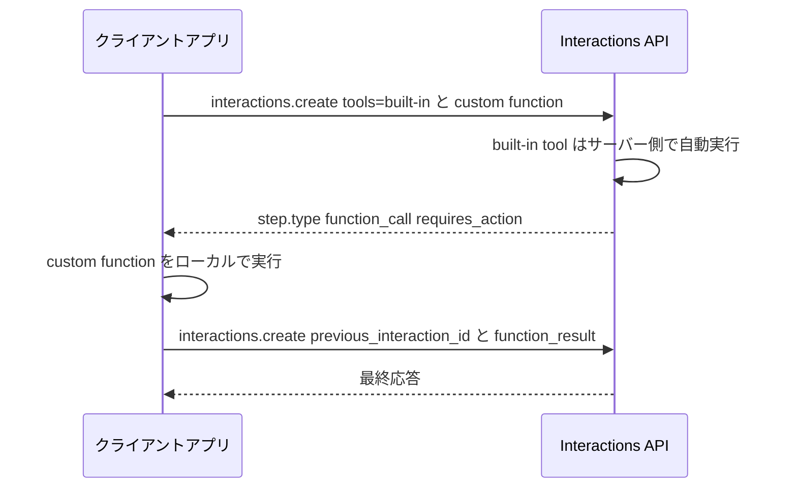

**カスタム関数の定義とビルトインツールとの併用**

```python
from google import genai
import json

client = genai.Client()

get_weather = {
    "type": "function",
    "name": "get_weather",
    "description": "Gets the weather for a requested city.",
    "parameters": {
        "type": "object",
        "properties": {
            "city": {
                "type": "string",
                "description": "The city and state, e.g. Utqiaġvik, Alaska",
            },
        },
        "required": ["city"],
    },
}

tools = [
    {"type": "google_search"},
    get_weather,
]

interaction = client.interactions.create(
    model="gemini-3.5-flash",
    input="What is the northernmost city in the United States? What's the weather like there today?",
    tools=tools,
)
```

**function_call の検出 → ローカル実行 → function_result の返送**

```python
for step in interaction.steps:
    if step.type == "function_call":
        print(f"Function call: {step.name} (ID: {step.id})")
        result = {"response": "Very cold. 22 degrees Fahrenheit."}
        interaction_2 = client.interactions.create(
            model="gemini-3.5-flash",
            previous_interaction_id=interaction.id,
            tools=tools,
            input=[{
                "type": "function_result",
                "name": step.name,
                "call_id": step.id,
                "result": [{"type": "text", "text": json.dumps(result)}],
            }],
        )
```

往復のキーフィールドです。

| フィールド | 用途 |
|---|---|
| `step.type == "function_call"` | カスタム関数呼び出し要求の検出 |
| `step.id` | 返送時に `call_id` として使う呼び出し識別子 |
| `step.name` | 実行対象の関数名 |
| `type: "function_result"` | 実行結果を返送する input ブロックの種別 |
| `previous_interaction_id` | 呼び出し元 interaction への紐付け |

### credential refresh（認証情報の差し替え）

既存の `environment_id` を指定したまま、新しい `network` 設定（credential）を渡すと、サンドボックスのファイルシステム・インストール済みパッケージ・クローン済みリポジトリを保持したまま認証情報だけを差し替えられます。

**agent 登録時の初期 network allowlist（`transform` でヘッダーを注入）**

```python
agent = client.agents.create(
    id="issue-resolver",
    base_agent="antigravity-preview-05-2026",
    base_environment={
        "type": "remote",
        "sources": [],
        "network": {
            "allowlist": [
                {
                    "domain": "api.github.com",
                    "transform": {"Authorization": "Basic TOKEN"}
                },
                {"domain": "pypi.org"}
            ]
        }
    }
)
```

**interaction 時点での credential refresh**

```python
result = client.interactions.create(
    agent="issue-resolver",
    input="Fix issue #42...",
    environment={
        "type": "remote",
        "network": {
            "allowlist": [
                {
                    "domain": "api.github.com",
                    "transform": {"Authorization": "Bearer ghp_REFRESHED_TOKEN"}
                }
            ]
        }
    }
)
```

環境の指定には 2 系統があり、意味が異なる点に注意します。

- **既存サンドボックスの状態を保持したまま refresh**: `environment` に既存の `environment_id`（文字列、または `environment_id` を含む config object）を渡します。ファイルシステム・パッケージ・リポジトリを保持したまま `network` だけを更新できます。
- **base_environment の資格情報 override**: `environment` に `environment_id` を含めず `network` だけを渡す形は、その interaction ターン向けの資格情報上書きです。同一サンドボックスの状態再利用とは別物として扱います。

いずれの場合も、新しい `network` ルールは即座に旧ルールを置き換えます。

### isolated cloud sandbox

managed agent の実行はすべて隔離クラウドサンドボックス内で行われます。

- Ubuntu ベース、Python・Node.js プリインストール
- code execution・package install・ファイル管理が可能
- 同じ `environment_id` を使い続ける限り、ファイル・状態が interaction をまたいで保持される
- オフライン後 7 日間で自動削除（TTL）

サンドボックス内のファイルをローカルへダウンロードする例です。

```python
import requests
import tarfile

response = requests.get(
    f"https://generativelanguage.googleapis.com/v1beta/files/environment-{env_id}:download",
    params={"alt": "media"},
    headers={"x-goog-api-key": api_key},
    allow_redirects=True,
)

with open("snapshot.tar", "wb") as f:
    f.write(response.content)

with tarfile.open("snapshot.tar") as tar:
    tar.extractall(path="extracted_snapshot")
```

### built-in managed agent の呼び出し例

組み込み managed agent は 2 種類確認できます。

| Agent | 用途 | agent ID |
|---|---|---|
| Antigravity | 汎用サンドボックス agent（コード実行・ファイル操作・Web 閲覧） | `antigravity-preview-05-2026` |
| Deep Research | 自律的な多段階リサーチ（市場分析・デューデリジェンス・文献調査） | `deep-research-preview-04-2026`（速度優先）/ `deep-research-max-preview-04-2026`（網羅性優先） |

**Deep Research Agent の呼び出し**

`background=True` の併用が前提です（数分〜最大 60 分かかるタスクのため）。

```python
from google import genai

client = genai.Client()

interaction = client.interactions.create(
    input="Research the history of Google TPUs.",
    agent="deep-research-preview-04-2026",
    background=True,
)

print(f"Research started: {interaction.id}")
```

```javascript
import { GoogleGenAI } from '@google/genai';

const client = new GoogleGenAI({});

const interaction = await client.interactions.create({
    input: 'Research the history of Google TPUs.',
    agent: 'deep-research-preview-04-2026',
    background: true
});

console.log(`Research started: ${interaction.id}`);
```

結果取得は前述の poll パターンと同じです。

```python
import time

while True:
    interaction = client.interactions.get(interaction.id)
    if interaction.status == "completed":
        print(interaction.steps[-1].content[0].text)
        break
    elif interaction.status == "failed":
        print(f"Research failed: {interaction.error}")
        break
    time.sleep(10)
```

Deep Research Agent の制約です。

- カスタム関数呼び出し非対応（代替としてリモート MCP サーバーは利用可能）
- structured output 非対応
- 最大リサーチ時間 60 分

## 運用

### 長時間ジョブの運用（background execution）

- `background: true` を指定すると interaction はサーバー側で非同期実行され、API は即座に interaction ID を返します。
- クライアントは ID を使って poll / stream / reconnect のいずれかで進捗を追跡します。
- background 実行の結果を後から poll / reconnect するには、interaction が保存されている必要があります。`store` は既定で有効で、`store=false` にすると再接続・ポーリング用の状態が保持されません（Deep Research Agent のように `store=true` を明示前提とする組み込み agent もあります）。

**poll / stream / reconnect の使い分け**

| 方式 | 向いているケース | 特徴 |
|---|---|---|
| poll | クライアントが常時接続を維持できない（サーバーレス関数、バッチジョブ） | 実装が単純、5 秒間隔などで GET を繰り返す |
| stream | UI にリアルタイム進捗を出したい、途中経過を逐次処理したい | SSE で逐次受信、接続維持が前提 |
| reconnect | stream 中にネットワーク瞬断が起きた | `last_event_id` で継続、最初から作り直さない |

**reconnect（切断後の再接続）**

```python
stream = client.interactions.get(
    id=interaction_id,
    stream=True,
    last_event_id=last_event_id,
)
```

**cancel の注意**

- cancel は「まだ実行中の background interaction」にのみ有効です（完了済み・失敗済みには効果なし）。

**タイムアウト対策**

- 同期呼び出し（`background` 未指定）は HTTP 接続を張ったまま待つため、長時間ジョブでは接続断のリスクが上がります。目安時間を超えるタスクは同期のままにせず background に切り替える設計が安全です（具体的な閾値は公式ガイド未確認）。
- 504 DEADLINE_EXCEEDED はクライアント側タイムアウト延長で対処します。

### 状態確認（interaction status）

- `in_progress` / `requires_action` 以外はすべて terminal state です（`completed` / `failed` / `cancelled` / `incomplete` / `budget_exceeded`）。poll ループはこの 2 値以外を終了条件にします。
- `in_progress` / `requires_action` の間は、poll または stream で追跡を続けます。`requires_action` はクライアント側の処理（function_result 返送）が必要です。

### requires_action の処理待ち（custom function calling）

ビルトインツール（`code_execution` / `google_search` / `url_context` など）はサーバー側で自動実行されますが、カスタム関数は `requires_action` 状態に遷移し、クライアントが実行して結果を返す必要があります。

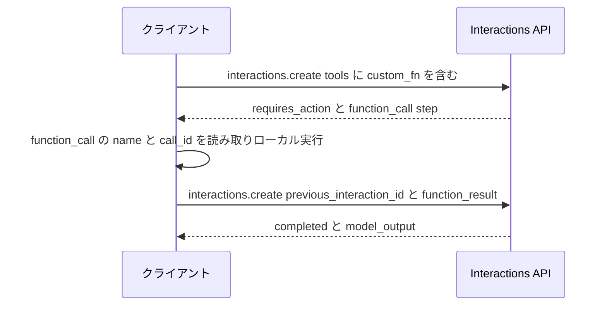

**function_result を送り返すコード例**

```python
final_interaction = client.interactions.create(
    model="gemini-3.5-flash",
    input=[{
        "type": "function_result",
        "name": fc_step.name,
        "call_id": fc_step.id,
        "result": [{"type": "text", "text": json.dumps(result)}],
    }],
    tools=[set_light_values_declaration],
    previous_interaction_id=interaction.id,
)
```

- コンテキスト維持に必要なフィールド:
  - `id`（`function_call` 系ステップに付与、呼び出しと応答の対応付け）
  - `signature`（暗号化されたコンテキスト。ツールの呼び出し履歴をターンをまたいで維持）
- `previous_interaction_id` を使う **stateful モード**では、サーバー側がコンテキストを保持します。stateless モードでは会話履歴を毎回送り直します（`signature` フィールドは API に存在しますが、手動での伝搬運用が必須かどうかは一次ソースで確定できませんでした）。

### credential rotation の運用

既存サンドボックス（`environment_id`）を維持したまま、失効した token / API key だけを差し替えられます。ファイルシステム状態やインストール済みパッケージは維持されます。

```python
result = client.interactions.create(
    agent="antigravity-preview-05-2026",
    input="ダウンロードを再実行",
    environment={
        "type": "remote",
        "environment_id": first.environment_id,
        "network": {
            "allowlist": [
                {
                    "domain": "storage.googleapis.com",
                    "transform": {
                        "Authorization": "Bearer REFRESHED_TOKEN",
                    },
                },
            ],
        },
    },
)
```

- プライベート Git リポジトリの認証は Basic 認証ヘッダを埋め込みます。

```bash
echo -n "x-oauth-basic:ghp_YourPATHere" | base64
```

```python
"transform": {"Authorization": "Basic <上記base64>"}
```

- 運用パターン: token の有効期限を監視 → 失効前に新 token を取得 → 同じ `environment_id` を指定して `network.allowlist` だけ更新 → サンドボックスの作業状態（ファイル、依存パッケージ）は再構築不要。

### environment / sandbox のライフサイクル管理

| 状態 | 条件 | 備考 |
|---|---|---|
| Created | `environment: "remote"` または config object を指定して interaction 作成時 | 毎回 base environment を fork するため実行ごとにクリーンな状態から始まる |
| Active | interaction 実行中 | |
| Idle | 15 分間操作がないと自動でスナップショットして停止 | 後で `environment_id` から再開可能 |
| Offline | 最終アクティブから 7 日間保持 | `environment_id` を渡せば再開可能 |
| Deleted | 保持期間超過後 | それ以降は再開不可、新規作成が必要 |

**環境の指定方式（3 パターン）**

```python
# 1. 新規 sandbox
environment = "remote"

# 2. 既存環境の再利用（credential rotation や継続タスクで使用）
environment = interaction.environment_id

# 3. フル config（sources / network を明示）
environment = {
    "type": "remote",
    "sources": [
        {"type": "repository", "source": "https://github.com/octocat/Spoon-Knife", "target": "/workspace/spoon-knife"},
        {"type": "gcs", "source": "gs://cloud-samples-data/bigquery/us-states/", "target": "/workspace/gcs-data"},
        {"type": "inline", "content": "# Project Notes\n...", "target": "/workspace/notes/readme.md"},
    ],
    "network": {"allowlist": [{"domain": "api.github.com", "transform": {"Authorization": "Bearer ghp_token"}}]},
}
```

**ネットワーク無効化（機密性優先タスク）**

```python
environment = {"type": "remote", "network": "disabled"}
```

## ベストプラクティス

### 同期 → 非同期の設計判断

| 観点 | 同期のままでよい | background に切り替えるべき |
|---|---|---|
| 想定実行時間 | 数秒〜十数秒 | 分単位以上、または見積もりが不確実 |
| クライアントの接続維持能力 | Web リクエストハンドラ内で完結 | サーバーレス関数のタイムアウト制約下、バッチジョブ |
| 中断時の再実行コスト | 低い（再送で十分） | 高い（サンドボックスの状態やコストを保持したい） |
| 監視ニーズ | 呼び出し元で完結 | 進捗を他システム（Slack/Discord 通知など）に流したい |

公式ブログは「非ブロッキングで進捗をポーリング・ストリーミング・再接続できる」ことを background 実行の価値として説明しています。実行時間が読めないタスク（リサーチ・大規模データ処理・複数ツール呼び出しを伴うタスク）は background を既定にする設計が妥当です（閾値の数値化は公式ガイド未確認）。

### remote MCP を「接続・認証更新・状態保持を含む運用モデル」で扱う

リモート MCP サーバーの接続は「一度つなげば終わり」ではなく、次の 3 レイヤーを継続的に運用するものと捉えます。

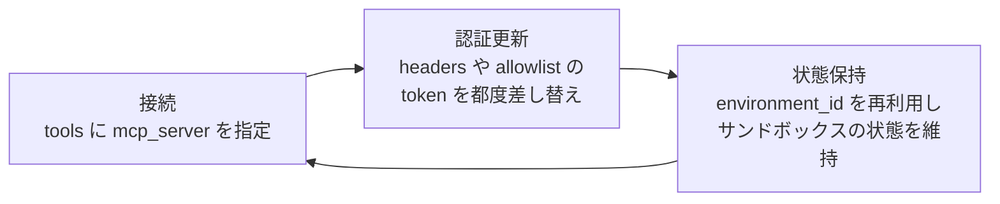

1. **接続**: interaction time に `tools` パラメータで `mcp_server` を渡します。

```python
stream = client.interactions.create(
    agent="antigravity-preview-05-2026",
    input="社内ナレッジベースを検索して",
    tools=[{
        "type": "mcp_server",
        "url": "MCP_SERVER_URL",
        "name": "MCP_SERVER_NAME",
        "headers": {"Authorization": "Bearer <token>"},
    }],
    stream=True,
)
```

2. **認証更新**: `headers` の token が失効したら、同じ MCP サーバー定義を token だけ差し替えて再送します。credential rotation の運用と同じ考え方で扱えます。
3. **状態保持**: 同一タスクの継続実行では `environment_id` を再利用し、MCP 経由で取得したデータやセッション状態をサンドボックス内に維持したまま次の interaction を実行します。

**運用上の注意**:

- リモート MCP サーバーはサンドボックスからアクセスするため、private データベースや社内 API に接続する経路になり得ます。ネットワーク allowlist の設計（ドメイン単位の許可、ワイルドカード `*` の使用可否）をセキュリティレビュー対象にすることを推奨します。

### 責任境界の設計（server 側 built-in tool vs client 側 custom function）

| 実行主体 | 対象 | 特徴 | 設計上の注意 |
|---|---|---|---|
| Server（サンドボックス内で自動実行） | `code_execution` / `google_search` / `url_context` / `mcp_server` | interaction 内で完結、クライアントは結果を待つだけ | サンドボックス内で実行されるため、機密データを渡す場合はネットワーク allowlist・保持期間（7 日オフライン保持）を踏まえて設計する |
| Client（`requires_action` で一時停止し、呼び出し元が実行） | custom function（自社 API・DB 接続など） | モデルは `function_call` を返すだけで、実際のデータアクセスは呼び出し元コードが担う | 機密データや社内認証情報をモデル/サンドボックスに渡さずに済む経路。社内 API 接続はまず custom function（client 側実行）を優先し、サンドボックス経由の remote MCP はサンドボックスのネットワーク到達性が必要な場合に限定する、という切り分けが安全側 |

- 機密データの扱い: サンドボックスは「毎回 base environment を fork してクリーンに始まる」設計です。機密情報をサンドボックス内に永続化させたくない場合は `network: "disabled"` や custom function 経由（client 側実行）を選び、サンドボックスにデータを持ち込まない構成にできます。
- 社内 API 接続時のセキュリティ: network allowlist の `transform` に token を平文で書く運用になるため、token の失効・ローテーション運用（credential rotation）とセットで設計します。ワイルドカード `{"domain": "*"}` は極力避け、必要なドメインのみ許可します。

### コスト観測・レート制限・並列実行の考え方

**コスト観測**

- プレビュー期間中、サンドボックスのコンピュート費（CPU/メモリ/実行）は課金対象外で、トークン費用のみが課金されます（プレビュー期間中の扱い。GA 時の課金は要確認）。

**レート制限**

- Gemini API のレート制限はプロジェクト単位で計算されます。同一プロジェクト配下の複数 API key は同じ quota pool を共有するため、key を増やしても quota は増えません（一般的な Gemini API の挙動。Interactions API 固有の追加制限は公式ガイド未確認）。
- 429 (RESOURCE_EXHAUSTED) は RPM/TPM 等の制限超過時に返却されます。

**並列実行**

- 大量の interaction を並列発行する場合は、クライアント側で rate limiter を挟み、project 全体の quota pool を超えないよう平準化する設計が一般的です（Interactions API 専用の推奨並列数は公式ガイド未確認）。
- background 実行を使えば、1 つの HTTP 接続を張りっぱなしにせず ID ベースで多数のジョブを追跡できるため、並列実行との相性がよい設計です。

## トラブルシューティング

| 症状 | 原因 | 対処 |
|---|---|---|
| 同期呼び出しで長時間タスクを実行すると HTTP 接続が切れる | 長時間の同期待機はネットワーク断・プロキシタイムアウトの影響を受けやすい | `background: true` に切り替え、poll または stream + `last_event_id` reconnect で追跡する |
| stream が途中で切断される | ネットワーク瞬断 | 直前に受信した `last_event_id` を使って `interactions.get(..., stream=True, last_event_id=...)` で再接続する |
| `requires_action` のまま進まない | カスタム関数の結果（`function_result`）を返していない、または `call_id` / `name` が一致していない | `steps` から `function_call` の `id`（call_id）と `name` を取得し、`function_result` として `previous_interaction_id` 付きで送り返す |
| token 失効後、既存サンドボックスのジョブが失敗する | `network.allowlist` の `transform` に設定した token が期限切れ | 同じ `environment_id` を指定し、`network.allowlist` の `transform` を新しい token に差し替えて再送する（ファイルシステム状態は保持される） |
| 7 日以上放置したサンドボックスに再接続できない | Offline 状態は最終アクティブから 7 日で保持期限切れになり削除される | 期限切れ後は同一 `environment_id` を再利用できないため、新規 `environment: "remote"` で作り直す |
| MCP サーバーへの接続が失敗する | transport の設定不備、MCP サーバー側のダウン、`headers` の認証失敗などが典型 | `tools` の `mcp_server` 定義（`url` / `headers`）を再確認し、MCP サーバー側のログで認証・到達性を確認する。token 失効時は `headers` の Authorization を差し替えて再送する |
| 429 RESOURCE_EXHAUSTED | RPM/TPM 等プロジェクト単位の quota 超過 | Exponential backoff で再試行、リクエストを平準化、必要なら Quota Increase を申請 |
| 500 INTERNAL | Google 側の予期しない内部エラー | ステータスページを確認、入力コンテキストを削減、別モデルで再試行 |
| 503 UNAVAILABLE | サービス一時的な過負荷・停止 | ステータス確認後、モデル変更や再試行（backoff） |
| 504 DEADLINE_EXCEEDED | 処理が複雑でサーバー側処理がタイムアウト | クライアント側のタイムアウト値を拡大、または `background: true` に切り替えて同期待ちをやめる |
| 403 PERMISSION_DENIED | API key に必要な権限がない | key の権限を確認する |
| 400 FAILED_PRECONDITION | 無料枠が利用できない地域、または課金未設定 | 課金設定を有効化する |

**公式ガイド未確認 / 一般的な運用パターンとして扱った項目**:

- background 実行の具体的な「切り替えるべき実行時間の閾値」
- Interactions API 専用の並列実行数・レート制限値（一般的な Gemini API の project 単位 quota pool の挙動から類推）
- MCP サーバー接続エラーの詳細な原因分類（関連製品の報告に基づく一般化）

## まとめ

Gemini API Managed Agents の拡張は、エージェント実装の関心を「モデルへの単発呼び出し」から「非同期ジョブとしての実行制御」へ移します。`background: true` によるジョブ化、サンドボックス内エージェントが client として `mcp_server` 経由でリモート MCP サーバーへ直結する接続、`environment_id` を軸にした状態保持と認証情報の差し替えは、いずれも「接続方式」ではなく「実行制御の責任境界」を設計する道具です。ビルトインツールをサーバー側で完結させ、機密に触れるカスタム関数を `requires_action` でクライアントに戻す分岐は、どこまでを Google のサンドボックスに委ね、どこからを自社の責任で握るかを決める起点になります。

この記事が少しでも参考になった、あるいは改善点などがあれば、ぜひリアクションやコメント、SNSでのシェアをいただけると励みになります！

## 参考リンク

### 概要 / 特徴

- [Expanding Managed Agents in Gemini API: background tasks, remote MCP and more](https://blog.google/innovation-and-ai/technology/developers-tools/expanding-managed-agents-gemini-api/)
- [Introducing Managed Agents in the Gemini API](https://blog.google/innovation-and-ai/technology/developers-tools/managed-agents-gemini-api/)
- [Interactions API overview | Gemini API](https://ai.google.dev/gemini-api/docs/interactions-overview)

### 構造 / データ

- [Building Managed Agents | Gemini API](https://ai.google.dev/gemini-api/docs/custom-agents)
- [Gemini Interactions API reference | Gemini API](https://ai.google.dev/api/interactions-api)
- [Interact with managed agents | Gemini Enterprise Agent Platform](https://docs.cloud.google.com/gemini-enterprise-agent-platform/build/managed-agents/interact-with-agents)
- [Managed Agents API on Agent Platform overview | Google Cloud](https://docs.cloud.google.com/gemini-enterprise-agent-platform/build/managed-agents)

### 構築 / 利用

- [Managed Agents Quickstart | Gemini API](https://ai.google.dev/gemini-api/docs/managed-agents-quickstart)
- [Background execution | Gemini API](https://ai.google.dev/gemini-api/docs/background-execution)
- [Function calling with the Gemini API](https://ai.google.dev/gemini-api/docs/function-calling)
- [Gemini Deep Research Agent | Gemini API](https://ai.google.dev/gemini-api/docs/deep-research)

### 運用 / トラブルシューティング

- [Troubleshooting | Gemini API](https://ai.google.dev/gemini-api/docs/troubleshooting)
- [Error code 429 | Gemini Enterprise Agent Platform](https://docs.cloud.google.com/gemini-enterprise-agent-platform/models/deploy/error-code-429)

### 参考（別製品・比較対象）

- [Gemini Enterprise Agent Platform remote MCP server | Google Cloud Blog](https://cloud.google.com/blog/products/ai-machine-learning/gemini-enterprise-agent-platform-remote-mcp-server/)
- [Interactions API developer guide (Phil Schmid)](https://www.philschmid.de/interactions-api-developer-guide)
