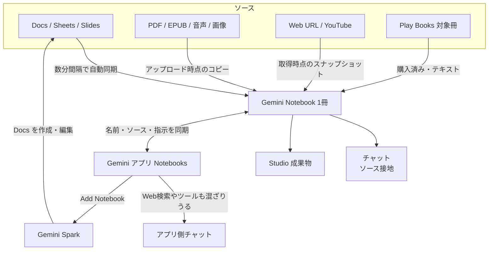
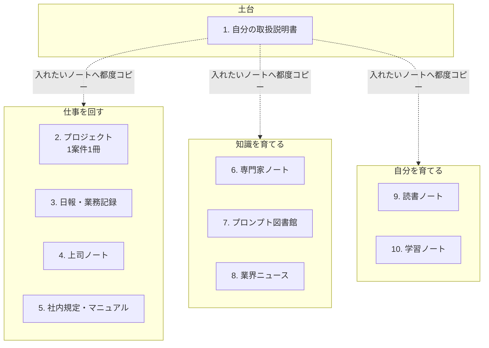

2026年7月に NotebookLM は「Gemini Notebook」へ改名されました。X では「役割ごとに10冊のノートを作れば、メモ帳が小さな会社になる」という [@ai_jitan さんのスレッド](https://x.com/ai_jitan/status/2100347745043439922)（2026-09-16）が広く読まれています。

この記事では、まず Gemini Notebook の仕組みと10冊運用の中身を説明します。次に公式ヘルプと照らして、どこまでが製品機能で、どこからが運用上の工夫かを整理します。最後に、今日から始める最小構成を示します。

記載内容は 2026-09-19 時点の公式ヘルプ・公式ブログに基づきます。プラン上限などは変更されうるため、利用前に公式ページを確認してください。

*この記事の全体像。以下、順に解説します。*

## Gemini Notebook とは

Gemini Notebook は、ユーザーが入れたソースに基づいて回答する Google のスタンドアロン研究ツールです。2026-07-16 に NotebookLM から改名され、既存リンクは自動リダイレクトされます。現行の入口は [notebook.google.com](https://notebook.google.com/) です。

### できること

- **ソースに接地したチャット**: スタンドアロン版では、ノート内のソースに基づいて回答します
- **多様なソース**: Google ドキュメント / スライド（最大100枚）/ スプレッドシート（100k tokens）/ PDF・docx・md・csv・pptx・EPUB / 画像 / 音声 / Web URL / 公開 YouTube / 貼り付けテキスト / 対象の Play Books / Gemini チャット
- **Drive の自動同期**: Drive 上の Docs / Sheets / Slides は数分間隔で自動同期されます（2026-05-26 以降）
- **Studio 成果物**: 音声解説、動画解説、レポート、クイズ、フラッシュカード、マインドマップ、スライド、インフォグラフィック、データテーブル
- **リサーチ**: Fast Research（Web または Drive）と Deep Research（Web、18歳以上）
- **Gemini アプリ連携**: Gemini アプリの Notebooks と双方向に同期します。Gemini Spark のタスクにはノートを追加（Add Notebook）できます

ノートは互いに独立しています。1つのチャットで複数ノートを同時に参照することはできません。

### 全体の構造

製品は「ソース → 独立したノート → チャット / Studio → 他の Gemini 機能」という層になっています。

ポイントは次の2つです。

- 常に最新を保てるのは Drive 上の Docs / Sheets / Slides だけです。それ以外は取り込んだ時点のコピーです
- Gemini アプリ側のチャットは Web 検索やツールを混ぜることがあり、スタンドアロン版より接地が緩くなります

### ソースごとの更新のされ方

| ソース | 更新 |
|---|---|
| Drive の Docs / Sheets / Slides | 数分間隔の自動同期。権限喪失・削除も反映 |
| ローカルの PDF / Word / 画像 / 音声 | アップロード時点のコピー |
| Web URL | 取得時点の本文テキストのみ。有料壁の記事は非対応 |
| YouTube | 字幕テキスト。非公開化後は30日以内に削除されうる |
| Play Books | 対象の書籍のみ。共有相手も購入が必要 |

### Gemini Spark との関係

Gemini Spark は、24時間クラウドで動くエージェントです。日本では 2026-07-16 に Ultra 向けに日本語で展開され、2026-07-29 に Pro への拡大が公式に発表されました。

利用条件は次のとおりです（[Gemini Spark ヘルプ](https://support.google.com/gemini/answer/17094507?hl=en)）。

- 18歳以上
- 個人の Google アカウント（仕事用・学校用アカウントは現時点で不可）
- Google AI Pro または Ultra
- Keep Activity がオン
- EEA / ナイジェリア / スイス / 英国は対象外

同時に実行できるタスクは最大15件です。送信・データ変更・購入・フォーム送信の前にはユーザーに確認する設計で、公式は実験機能と位置づけています。

## 10冊運用とは

起点のスレッドは、役割ごとに10冊のノートを作り、Drive 経由で育てる運用カタログです。製品機能ではなく、ノートの分け方の提案です。

スレッドは10冊を「土台・仕事・知識・自分」の4群に分けます。1冊目の方針書（取扱説明書）を、他のノートのソースにも入れる運用です。

運用の核は次の3原則です。

| 原則 | 内容 |
|---|---|
| 1冊1役割 | テーマを混ぜず、役割ごとにノートを分ける |
| 役割で命名 | 「上司ノート」のように役割名を付け、名前で呼び出す |
| Docs 経由で育てる | 生きたメモは Google ドキュメントに書き、ノートのソースにする |

## 注意点

### スレッドの主張と公式仕様の対応

スレッドは宣伝を含む長文で、有料教材の予告にもつながっています。主張ごとに、公式ヘルプで裏付けられる範囲は次のとおりです。

| 主張 | 公式ヘルプとの対応 |
|---|---|
| 「10冊で十分」「小さな会社になる」「26人の AI 社員」 | 製品機能ではなく運用上のたとえ |
| Drive 経由でノートが勝手に育つ | Docs / Sheets / Slides に限られる。PDF・URL・YouTube・ローカルアップロードはスナップショット |
| Spark でニュース収集を自動化 | Spark にはニュースダイジェスト、Docs 編集、Add Notebook がある。ニュースをノートへ入れる完成品のコネクタは公式に記載がない |
| 「上司ノートを参照して」と呼ぶ | 名前での一覧、Add Notebook、`@Gemini Notebook` までは公式機能。自然言語で全ノートを横断する機能は公式にない |
| 差し戻しが激減した | 個人の体験談 |

### ノートは横断できない

ノートは独立しているため、1冊目の方針書を他のノートで使うにはソースを複製する必要があります。10冊運用では、この複製と更新の手間が冊数分かかります。

### 数値の読み方

| 数値 | 読み方 |
|---|---|
| 利用者3,000万人超・60万組織超 | 2026-07-16 の公式発表。計測定義は記載されていない |
| 自社評価の win rate 65% / 69.9% / 78.2% | 前システムとの社内比較。競合製品との比較ではない |

### 接地しても間違える

「ソースに接地すれば嘘をつかない」わけではありません。公式ヘルプも回答は間違えることがあると明記しています。文書クエリの評価研究（[arXiv:2509.25498](https://arxiv.org/abs/2509.25498)）では、NotebookLM でも15件中2件（13%）に幻覚が見られました。サンプルが小さいため目安にとどまりますが、一般的なチャットの約40%よりは少ない方向です。

回答の出典は必ずクリックして原文を確認します。特に解釈・性格付け・意見の一般化は誤りやすい部分です。公式は、医療・法務・財務の判断に使わないよう繰り返し注意しています。

### プライバシーと共有

- 個人アカウントでは、ソースが基礎モデルの学習に直接使われることはありません。ただし 👍👎 のフィードバックを送ると、ソース全文を含む文脈を人がレビューし、最大3年保持して ML 改善に使います。Gemini Apps Activity をオフにしても、ノート内の Gemini チャットは対象です
- Workspace / Education アカウントでは、👍👎 を送っても人のレビューや学習の対象になりません
- 個人 Gmail での共有は最大50人です。Chat View で共有してもソースは完全には隠れません。公開した成果物のリンクは未ログインでも閲覧できます
- Gemini チャットを文脈に含むノートは共有できません
- 組織の data region 設定は、Notebook が処理・キャッシュするデータには適用されません（Workspace 管理者ヘルプ）
- Google Cloud の公式ドキュメントは、consumer 版にはエンタープライズ向けのコンプライアンスがないと明記しています

### 仕事用アカウントの対応状況

- Spark は、ヘルプ上で仕事用アカウントが「現時点で不可」です
- Gemini アプリの Notebooks は、2026-09-17 の Workspace Updates で学校・組織への展開が発表されました（9/14〜、EEA 外、アプリ側のソース上限10）。一方、[Notebooks in Gemini Apps のヘルプ](https://support.google.com/gemini/answer/16972047?hl=en)は 2026-09-19 時点で個人アカウント限定の記載のままです

### 著作権

スキャンした市販本をノートに入れて共有することは、公式が禁止しています。読書ノートは Play Books の対象書籍を使うのが正規ルートです。

## プランごとの上限

ヘルプの上限表（2026-09-19 取得、変更されうる）は次のとおりです。

| 項目 | Standard | Plus | Pro | Ultra 20TB | Ultra 30TB |
|---|---|---|---|---|---|
| ノート / ユーザー | 100 | 200 | 500 | 500 | 500 |
| ソース / ノート | 50 | 100 | 300 | 500 | 600 |
| チャット / 日 | 50 | 200 | 500 | 2.5K | 5K |
| 音声解説 / 日 | 3 | 6 | 20 | 100 | 200 |
| 動画解説 / 日 | 3 | 6 | 20 | 100 | 200 |
| うち Cinematic 動画 / 日 | — | — | 2 | 10 | 20 |
| レポート・クイズ・カード・マップ / 日 | 10 | 20 | 100 | 500 | 1K |
| Deep Research | 10 / 月 | 3 / 日 | 20 / 日 | 75 / 日 | 200 / 日 |

- 1ソースあたりの上限は、全プラン共通で50万語または200MBです
- ノートを共有しても、共同編集者のソース上限は増えません
- 2026-09-02 から、consumer 向けに compute ベースの上限が加わりました。プロンプトの複雑さ、チャットの長さ、ソース数、使う機能を織り込み、5時間ごとに回復します。週次上限もあり、絶対値は非公開です。相対倍率は Plus が Standard の2倍、Pro が4倍、Ultra が Pro の5倍または20倍です。実際の残量は Settings > Usage で確認します

日本の料金（[Google AI のプラン](https://one.google.com/intl/ja_jp/about/google-ai-plans/)、2026-09-19 取得）は、Plus が月額 ￥725、Pro が月額 ￥2,900、Ultra が月額 ￥14,500〜（20 TB〜）です。

## 10冊のうちどれを作るか

3原則は公式仕様とおおむね整合します。

| 原則 | 公式仕様で言えること | ずれる点 |
|---|---|---|
| 1冊1役割 | ノートは独立している。テーマを混ぜると回答が薄くなる、は運用として妥当 | 「10冊で十分」は製品仕様ではない |
| 役割で命名 | アプリの一覧や Add Notebook では、名前がノートの住所になる | 全ノートを横断する自然言語検索はない |
| Docs 経由で育てる | Drive 自動同期は公式機能 | PDF や URL では成立しない |

10冊それぞれを公式の制約と重ねると、採用の目安は次のようになります。

| # | 役割 | 採用の目安 | 注意 |
|---|---|---|---|
| 1 | 取扱説明書 | 最初の1冊として妥当 | 他のノートで使うならソースの複製が必要 |
| 2 | プロジェクト | 案件が動いているなら本命 | 1案件1冊はソース上限と精度の両方に合う |
| 3 | 日報 | Drive の1ドキュメントへの追記と相性が良い | 個人の勤務記録に 👍👎 を付けない |
| 4 | 上司ノート | 原則として consumer 版に置かない | 1on1 や差し戻しの内容は機密。個人 Gmail とフィードバックの扱いが重い |
| 5 | 社内規定 | Workspace アカウント向き | 公開共有しない。Chat View でもソースは残る |
| 6 | 専門家 | Fast Research で種を入れ、自分の経験で上書きする | 一般の Web 情報を入れすぎると接地が薄まる |
| 7 | プロンプト図書館 | 小さくてよい | 1テーマの Docs 1本でも足りる |
| 8 | 業界ニュース | Spark のダイジェスト → Docs → Drive 同期、という公式部品の組み合わせ | 完成品のコネクタではない |
| 9 | 読書 | Play Books の対象書籍を正規ルートで使う | スキャンした私有本の共有は禁止。対象外タイトルの扱いは曖昧 |
| 10 | 学習 | クイズ・音声解説など学習系の公式機能が厚い | 教材の著作権に注意。個人情報を入れない |

日本語コミュニティでも、10冊を唯一の正解とはしていません。

- 増やしすぎると開かないノートが増えるため、コアを少数に絞る意見が繰り返し出ています（[寺田さんの note](https://note.com/green_ai/n/n0c0464f07438)、[高田さんの note](https://note.com/tomokozo/n/n285bd20c2d20)）
- 1ソース1ノートは上限と管理の両面で破綻しやすく、1テーマに複数ソースを入れる形が勧められています
- 組織では「誰が × 何のため × 容量」で分け、社外と社内の情報を混ぜない、という整理があります
- Gemini アプリ側のチャットがソースに自動で取り込まれ、削除してもノート側に残った事例が報告されています（[echo さんの note](https://note.com/echo685/n/n7324a57560e9)、2026-04、同期機能の初期）

## 他の手段との使い分け

| 観点 | スタンドアロン Notebook | Gemini アプリ Notebooks | Spark | Claude / ChatGPT Projects | ローカル PKM |
|---|---|---|---|---|---|
| 接地 | ソースのみ | ソース + Web / ツール | ノート + Workspace + ブラウザ | アップロード依存。文書クエリでは幻覚が多い方向 | 人間が正本 |
| 横断 | 不可 | ノートをソースにはできない | Add Notebook はタスク単位 | プロジェクト内 | 得意 |
| 自動化 | Studio を手動で実行 | 弱い | 24時間。有料の個人アカウント | 限定的 | 自前で組む |
| 機密 | consumer は個人向け規約 | Keep Activity 前提の機能あり | 仕事用アカウント不可 | 各社のポリシー | 端末内 |
| 向く仕事 | 1テーマの統合・学習 | 同じノートでの下書き | 定期的な Docs 更新 | 長文生成 | 正本の管理・横断 |

目的別の選び方は次のとおりです。

- 1案件の資料を引用付きで読み込む → スタンドアロン Notebook
- 同じ資料からメールの下書きまで一気に作る → Gemini アプリ側（接地が緩む前提で使う）
- 受信箱やニュースを Docs にまとめる → Spark（Pro / Ultra の個人アカウント）
- 社内規定・顧客情報 → Enterprise 版を使うか、置かない
- 長期の知識の蓄積 → 既存の PKM。すべてを Notebook に移さない

## 今日から始める最小構成

10冊はカタログとして手元に置き、必要になった役割だけ足します。最初に作るのは、取扱説明書1冊か、進行中の案件1冊で十分です。知識の正本は既存の PKM に残し、Notebook はソースに接地した作業場として使います。

手順は次のとおりです。

1. Google ドキュメントに「目的 / 期限つきの目標 / 判断基準 / 対象 / やらないこと」を書く
2. 新しいノートを役割名で作り、そのドキュメントを Drive ソースとして追加する
3. 最初に「この内容を踏まえて自分を一言で表し、注意すべき弱点を挙げて」と尋ねる
4. 案件が動いていれば、企画書・議事録・メールをその案件専用のノートに入れる。何でも入れる巨大なノートにしない
5. 本は Play Books の対象書籍だけを使う。スキャンした私有本は共有しない
6. 社内規定・上司の発言・顧客情報は、Workspace または Enterprise 以外に置かない。置いたノートでは 👍👎 を付けない
7. Spark を使うなら個人の Pro / Ultra で使う。ニュースは Docs に追記させ、ノートは Drive 同期で追う
8. 回答の出典はクリックして原文を確認する

次の変化があれば、この判断を見直します。

- 仕事用アカウントで Gemini アプリ Notebooks がヘルプ上も解禁され、Spark も使えるようになった場合 → 職場での使い方を更新する
- ノートを横断するクエリが公式に入った場合 → 取扱説明書の複製が不要になる
- consumer 版に Workspace 並みの契約上の学習除外が入った場合 → 個人事業での機密情報の扱いを見直す

## まとめ

- Gemini Notebook は、入れたソースに接地して回答し、音声解説やクイズなどを作る Google の研究ツールです
- 10冊運用の3原則（1冊1役割・役割で命名・Docs 経由で育てる）は公式仕様とおおむね整合します
- 一方、ノートは横断できず、自動で育つのは Drive の Docs / Sheets / Slides だけです。「小さな会社」「AI 社員」は運用上のたとえです
- 仕事の機密情報を個人アカウントのノートに置くのは避けます
- 有料教材がなくても、公式ヘルプだけで1〜3冊の運用は始められます

この記事が少しでも参考になった、あるいは改善点などがあれば、ぜひリアクションやコメント、SNSでのシェアをいただけると励みになります！

## 参考リンク

### 公式

- [NotebookLM is now Gemini Notebook](https://blog.google/innovation-and-ai/products/gemini-notebook/notebooklm-gemini-notebook/)（2026-07-16）
- [Do better research with NotebookLM](https://blog.google/innovation-and-ai/products/notebooklm/better-research-notebooklm/)（2026-06-08、2026-07-16 更新）
- [Flexible usage limits](https://blog.google/innovation-and-ai/products/gemini-notebook/new-flexible-usage-limits/)（2026-08-28）
- [Expert Intelligence](https://blog.google/innovation-and-ai/products/gemini-notebook/expert-intelligence-leading-sources/)（2026-08-27）
- [Study tools](https://blog.google/innovation-and-ai/products/gemini-notebook/new-study-tools-september-2026/)（2026-09-15）
- [Notebooks in Gemini](https://blog.google/innovation-and-ai/products/gemini-app/notebooks-gemini-notebooklm/)（2026-04-08）
- [Gemini Spark 発表](https://blog.google/innovation-and-ai/products/gemini-app/next-evolution-gemini-app/)（2026-05-19）
- [Gemini Spark の日本展開](https://blog.google/intl/ja-jp/company-news/technology/gemini-spark-comes-to-japan/)（2026-07-29）
- [Drive 自動同期](https://workspaceupdates.googleblog.com/2026/05/keep-your-sources-up-to-date-with-automatic-Drive-syncing-in-NotebookLM.html)（2026-05-26）
- [NotebookLM in Workspace Studio](https://workspaceupdates.googleblog.com/2026/05/notebooklm-in-workspace-studio.html)（2026-05-12）
- [Notebooks in Gemini for schools and organizations](https://workspaceupdates.googleblog.com/2026/09/notebooks-in-gemini-dedicated-workspace-for-focused-organized-work-now-for-schools-and-organizations.html)（2026-09-17）
- [Create a notebook](https://support.google.com/gemininotebook/answer/16206563?hl=en)
- [Add sources](https://support.google.com/gemininotebook/answer/16215270?hl=en)
- [Upgrade / limits](https://support.google.com/gemininotebook/answer/16213268?hl=en)
- [Manage usage limits](https://support.google.com/gemininotebook/answer/17670842?hl=en)
- [Privacy](https://support.google.com/notebooklm/answer/17004255?hl=en)
- [Notebooks in Gemini Apps](https://support.google.com/gemini/answer/16972047?hl=en)
- [Gemini Spark](https://support.google.com/gemini/answer/17094507?hl=en)
- [Gemini Notebook Enterprise overview](https://docs.cloud.google.com/gemini/enterprise/notebooklm-enterprise/docs/overview)
- [Google AI のプラン（日本）](https://one.google.com/intl/ja_jp/about/google-ai-plans/)

### 論文

- Hagar, Agustianto, Diakopoulos. *Not Wrong, But Untrue*. [arXiv:2509.25498](https://arxiv.org/abs/2509.25498)（2025-09-29）

### コミュニティ

- [@ai_jitan さんのスレッド](https://x.com/ai_jitan/status/2100347745043439922)（2026-09-16）
- [寺田さん「ノートの分け方」](https://note.com/green_ai/n/n0c0464f07438)
- [高田さん「操作より整理」](https://note.com/tomokozo/n/n285bd20c2d20)
- [keitaro_aigc さんの note](https://note.com/keitaro_aigc/n/nc7cb7941ff24)
- [echo さん「Gemini ノート汚染」](https://note.com/echo685/n/n7324a57560e9)（2026-04）
