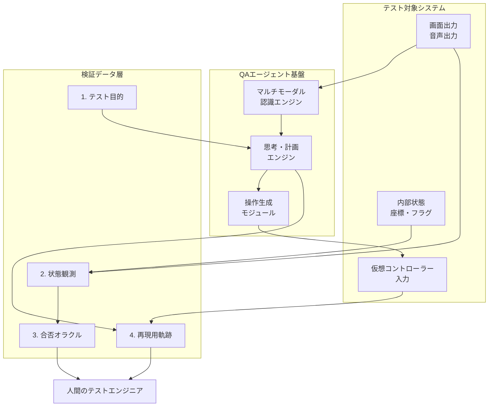

## この記事の対象と得られるもの

スクウェア・エニックスが Google Cloud Next Tokyo '26 の基調講演で、Gemini によるゲーム QA テスト自動化の事例を発表しました。AI がゲーム画面と音声を認識し、自分でコントローラーを操作して検証を進める、という内容です。

この記事では、その事例を「ゲーム業界のニュース」としてではなく、**画面を直接操作する AI エージェントを検証工程に置くときのアーキテクチャ設計**として読み解きます。

対象読者は次のとおりです。

- AI コーディングで実装は速くなったが、検証工程が詰まっていると感じている開発者
- Web / デスクトップアプリの E2E 検証に AI エージェントの導入を検討している人
- 「AI に画面を操作させる」施策の投資判断をする立場の人

読み終えると、次の 3 点を持ち帰れます。

1. GUI 操作エージェントを置くときに分離すべき 4 要素
2. 探索的テストと回帰テストで、AI と決定的スクリプトをどう配分するか
3. AI の自律処理を止めて人間に判断を返す条件

## 何が発表されたのか

発表された取り組みの要点を整理します。

| 観点 | 内容 |
|---|---|
| 入力 | ゲームの画面出力と、ゲーム内音声（SE・BGM） |
| 出力 | コントローラー入力によるキャラクター操作 |
| 自律行動 | 自らマップを開き、現在地と目的地を確認して移動する |
| 可視化 | エージェントの思考ログとタスクリストを画面上にオーバーレイ表示 |
| 適用範囲 | テスト設計、自動プレイ、グラフィックス不具合検出、テキストチェック |
| 基盤 | Gemini Enterprise Agent Platform |

同社は経済産業省のコンテンツ産業成長投資支援事業「IP360」の採択を受け、東京大学 松尾・岩澤研究室との共同研究を基盤として、2027 年末までにデバッグ作業の 70% を AI で自動化する目標を掲げています。なお、補助規模や共同研究の詳細は関連報道・事業発表に基づく二次情報であり、一次資料での確認をおすすめします。

### 従来の自動テストとの違い

これまでのゲーム自動テストは、内部 API を叩く、あるいは特定の座標をクリックする、といった**内部状態やスクリプトに依存した操作**が中心でした。

今回の事例が異なるのは、人間のテスターと同じ入出力インターフェース（画面・音声・コントローラー）だけで完結している点です。テスト対象のビルドに手を入れずに検証できる一方、後述する再現性の課題を引き受けることになります。

## なぜ「操作の自動化」だけでは足りないのか

この事例から引き出せる最も実務的な示唆は、**操作の自動化はエージェント QA の一部でしかない**ということです。

「AI に画面を見せて操作させる」だけの構成では、次の問題が起きます。

- バグを見つけても、開発者が手元の環境で再現できない
- 「正常にプレイできている」ように見えて、内部状態が壊れていることに気づけない
- 判定が曖昧なケースが、そのまま放置されるか誤検知として量産される

つまり、操作を自動化するほど、**判定と再現の設計が追いつかなくなる**という構造です。

## QAエージェントの4要素を分離する

対策は、エージェントを 1 つのブラックボックスとして扱わず、次の 4 要素をアーキテクチャ上で明示的に分離し、それぞれを独立したデータとして保存することです。

| 要素 | 役割 | 実装上のポイント |
|---|---|---|
| 1. テスト目的（Task Spec） | エージェントに達成させる検証シナリオの定義 | 「地点 A から B へ移動し NPC に話しかける」といった抽象命令とゴール条件を構造化する |
| 2. 状態観測（Observation） | 視覚・音声・内部状態の継続的な記録 | 画面フレームと音声に加え、可能なら内部座標やフラグなど軽量なステートも同時収集する |
| 3. 合否オラクル（Oracle） | 期待値との比較と不具合の判定 | 表示崩れ・壁抜け・エラーダイアログなどの視覚的異常検知ルールと、仕様違反の判定を分けて持つ |
| 4. 再現用軌跡（Replay Trace） | 不具合発生時の決定的な再現データ | フレーム単位の入力履歴、乱数シード、思考ログ、前後数秒の動画をパッケージ化する |

この 4 要素の関係を図にすると次のようになります。

図のポイントは、**エージェントの実行経路（左）と、検証データの蓄積経路（右）が分かれている**ことです。エージェントが動くことと、その結果を人間が検証できることは別の設計課題として扱います。

### 分離しないとどうなるか

4 要素を混ぜて実装すると、典型的には次の症状が出ます。

- 目的と判定が混在する: 「移動できたら OK」というプロンプト 1 本に判定条件を埋め込むと、判定基準を後から差し替えられない
- 観測と判定が混在する: ログに「異常あり」しか残らず、後から判定ロジックを変えて再評価できない
- 軌跡がない: バグ報告が「AI が異常を検知した」という文章だけになり、開発者は再現から始めることになる

逆に言えば、分離しておくと**判定ロジックだけを差し替えて過去の観測ログを再評価する**という運用ができます。これはオラクルの精度を上げていく上で効きます。

## 探索的テストと回帰テストで役割を分ける

もう 1 つの判断ポイントは、AI エージェントをどのテストに割り当てるかです。結論としては、テストの性質で配分を変えます。

| テスト種別 | 主体 | 理由 |
|---|---|---|
| 探索的テスト | AI エージェント | 人間が思いつかない入力列や境界での挙動を、多様な行動選択で掘れる |
| 回帰テスト | 決定的スクリプト | リビジョンごとに同じ手順を正確に再実行する必要があり、揺らぎが許容できない |

LLM ベースのエージェントは、同じ状況でも毎回同じ操作を選ぶとは限りません。この確率的な性質は、探索では強みになり、回帰では Flaky なテストの原因になります。

したがって実務上の推奨は、**重要な回帰パスは決定的なスクリプトや内部 API 駆動のテストで押さえ、その周辺のロングテール探索に AI エージェントを配置する**ハイブリッド構成です。エージェントを回帰に使う場合も、判定の主体はスクリプト側に置き、エージェントは操作の補佐に留めます。

## 技術的な限界を先に認識する

導入判断の前に、次の 2 点は限界として織り込んでおきます。

### オラクル問題

画面上「正常にプレイしている」ように見えても、内部メモリの破損やフラグの不整合は視覚情報だけでは検出できません。視覚オラクルは万能ではなく、内部状態の観測とアサーションを併用する前提で設計します。

前掲の表で「可能なら内部座標やフラグも同時収集する」と書いたのは、この限界を埋めるためです。

### 推論コストとフレームレート

高解像度・高フレームレートの映像を連続して推論にかけると、API コストとネットワーク遅延がボトルネックになります。実装では次のような軽量化が前提になります。

- フレーム間の差分が閾値を超えたときだけ推論する
- キーフレーム（画面遷移・ダイアログ出現など）を選んで送る
- 定型的な移動中は推論を止め、目的地付近でのみ再開する

「毎フレーム Gemini に投げる」構成は、検証時間とコストの両面で現実的ではありません。

## 人間に判断を返す条件を決めておく

自律エージェントの運用で最後に効くのは、**どこで止めて人間に渡すか**の定義です。次の 3 条件を明示的に実装します。

1. **オラクルの確信度が閾値未満**: 画面の異常を検知したが、演出か不具合かの識別確信度が低い場合（例: 確信度 80% 未満）
2. **スタック・進行不能の検知**: 同一エリアで一定時間タスクが進展せず、思考ループに陥った場合
3. **定性評価が必要な領域**: 「難易度が不自然」「操作感が不快」など、人間の主観的評価が求められる場合

エスカレーション時には、思考ログと再現用軌跡を添えて渡します。ここで前述の 4 要素分離が効いてきます。分離されていれば、通知にそのまま添付できる形でデータが揃っているためです。

## 自分の開発に接続する

この事例はゲーム QA の話ですが、参照モデルとしての価値はもっと広い範囲にあります。

Claude Code や GitHub Copilot の普及でコード生成の速度が上がった結果、多くの現場では**後段の検証・動作確認が最大のボトルネック**になりつつあります。画面を直接扱って自走する検証エージェントという構図は、Web アプリやデスクトップアプリの動作検証にもそのまま当てはまります。

具体的な着手順としては、次を推奨します。

1. **4 要素のスキーマを先に設計する**: 自分の検証パイプラインで、目的・観測・判定・軌跡を別々のデータとして保持する構造を決める。エージェント本体の実装より先に着手する
2. **ハイブリッドのテスト戦略を採る**: 定型的な導線確認は決定的な E2E スクリプトに任せ、探索的なエッジケース検証にだけ LLM エージェントを配置する
3. **人間へのルーティングを標準化する**: 異常検知時に、思考ログと再現ステップを添付して開発者へ通知するエスカレーションフローを最初から組み込む

順番が重要です。1 を飛ばして 3 に着手すると、通知に載せるデータがそもそも存在しない、という状態になります。

## まとめ

- スクウェア・エニックスの事例は、AI エージェントの適用領域がテキストやコードからリアルタイム GUI へ広がったことを示す
- 実装上の核心は操作の自動化ではなく、**テスト目的・状態観測・合否オラクル・再現用軌跡の 4 要素を分離して保存すること**
- 確率的に揺らぐ LLM エージェントは探索的テストに向き、回帰テストは決定的スクリプトで押さえるハイブリッド構成が現実的
- 視覚オラクルは内部状態の破損を検出できない。内部ステートの観測を併用する前提で設計する
- 確信度・スタック・定性評価の 3 条件で自律処理を止め、思考ログと再現データを添えて人間に返す

この記事が少しでも参考になった、あるいは改善点などがあれば、ぜひリアクションやコメント、SNSでのシェアをいただけると励みになります！

## 参考リンク

- [スクエニ、ゲームの品質テストをGeminiで自動化　AIが画面を見ながらコントローラーを操作、検証作業を自走（ITmedia AI＋、2026年7月31日、村田知己）](https://www.itmedia.co.jp/aiplus/article/2607/31/2000000322/)
- Google Cloud Next Tokyo '26 基調講演（2026年7月30日、発表者: スクウェア・エニックス 荒牧岳志 氏）
- 経済産業省 コンテンツ産業成長投資支援事業「IP360」採択情報（二次情報）
