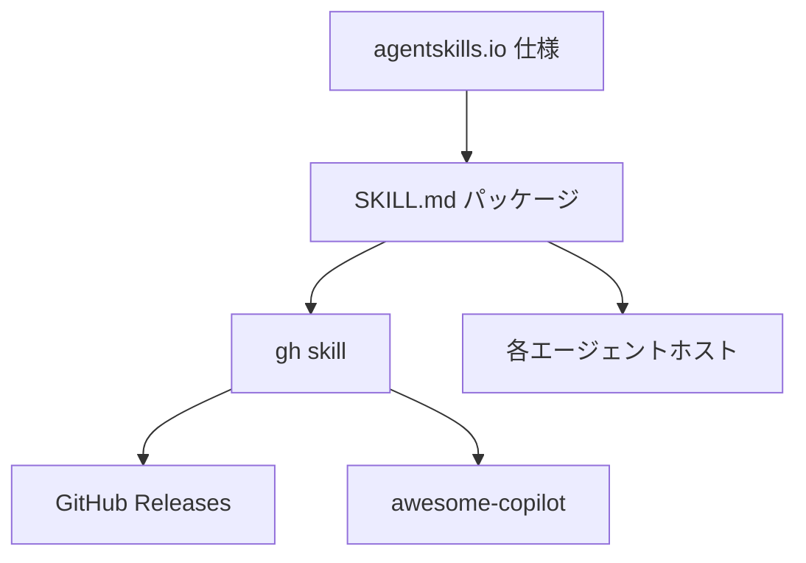
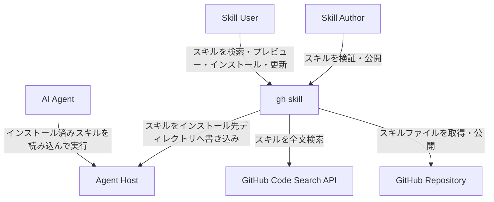
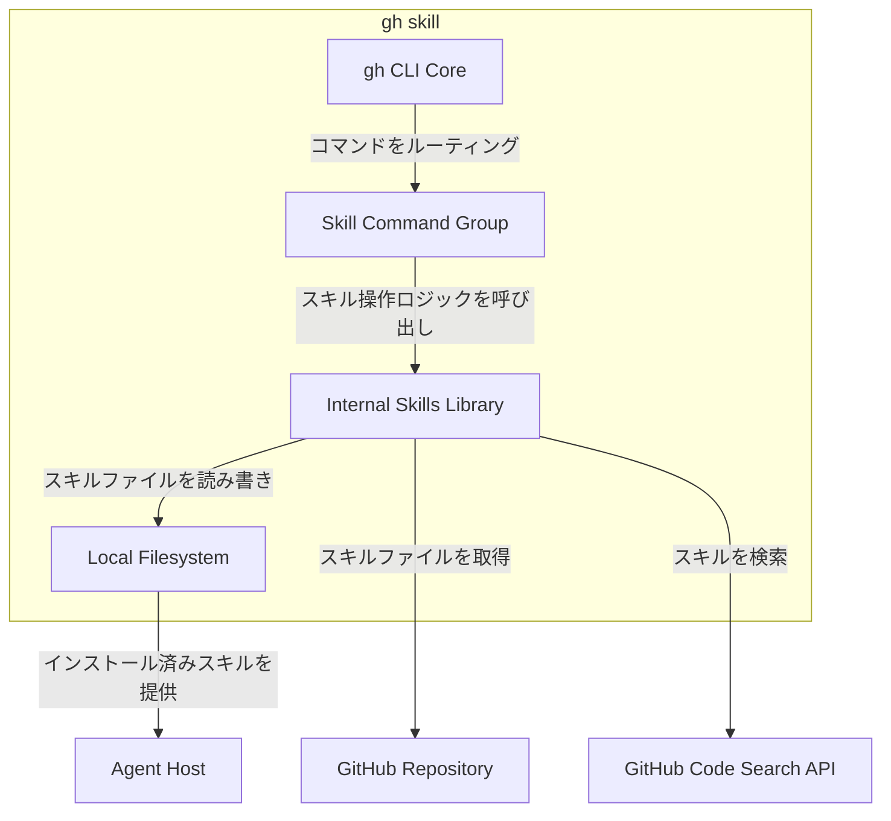
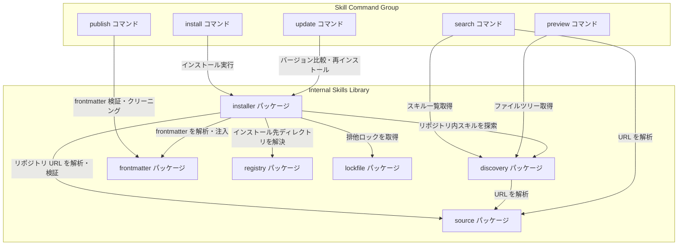
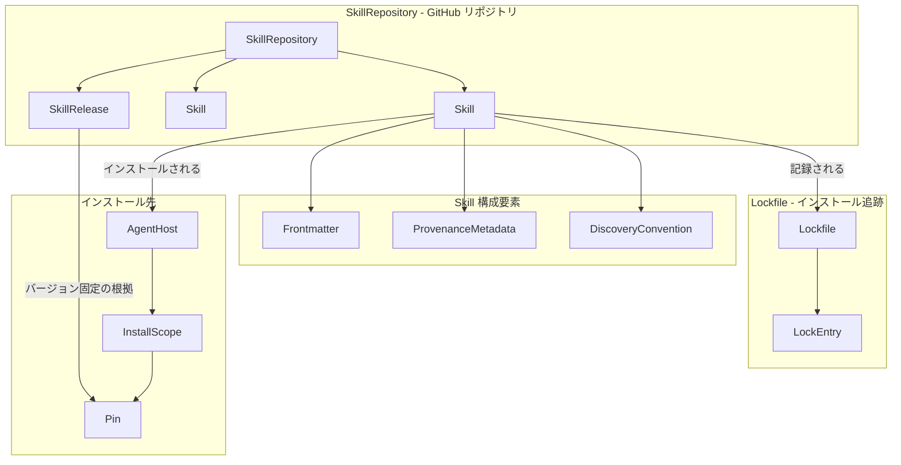

:::message
GitHub CLI v2.90.0（2026-04-16 リリース）で追加された公式サブコマンドです。Public Preview のため予告なく仕様が変更される可能性があります。
:::

## 概要

`gh skill` は GitHub 公式 CLI（`gh`）に組み込まれたエージェントスキル管理サブコマンド群です。AI コーディングエージェント向けの再利用可能な指示・スクリプト・リソースをパッケージ化した「エージェントスキル」を、GitHub リポジトリから検索・プレビュー・インストール・更新・公開できます。

### 位置づけ



| 要素名               | 説明                                                                                                |
| -------------------- | --------------------------------------------------------------------------------------------------- |
| agentskills.io 仕様  | エージェントスキルのオープン標準。SKILL.md のフォーマットと構造を定義                               |
| SKILL.md パッケージ  | 仕様に準拠したスキルの実体。指示・スクリプト・リソースを含むディレクトリ                            |
| gh skill             | SKILL.md パッケージを管理する GitHub CLI 公式サブコマンド群                                         |
| 各エージェントホスト | スキルを読み込んで動作する AI エージェント                                                          |
| GitHub Releases      | gh skill publish が利用する配布メカニズム                                                           |
| awesome-copilot      | GitHub が運営する主要なスキル集約リポジトリ（`github/awesome-copilot`）。サンプル・公式スキルを掲載 |

### 関連技術との関係

| 技術                | gh skill との関係                                                                 |
| ------------------- | --------------------------------------------------------------------------------- |
| agentskills.io 仕様 | gh skill が準拠するオープン標準。スキルのフォーマットと検証ルールを定義           |
| awesome-copilot     | GitHub が運営する主要スキル集約リポジトリ。`gh skill search` の推奨参照先のひとつ |
| Claude Code skills  | `~/.claude/skills` に格納する SKILL.md。gh skill でインストール可能               |
| MCP サーバー        | ツール・データソースへの接続インターフェース。スキルより高機能で実装コストが高い  |
| Plugin              | スキル・MCP・フック等を束ねた配布パッケージ。スキルより粒度が大きい               |

### 他のスキル管理ツールとの比較

エージェントスキルを管理する CLI や配布チャネルは複数存在します。主要 5 つを以下に整理します。

| 比較項目           | gh skill                                                               | npx skills（vercel-labs/skills）                            | gh-upskill（ai-ecoverse）                                    | anthropics/skills                                         | openai/skills               |
| ------------------ | ---------------------------------------------------------------------- | ----------------------------------------------------------- | ------------------------------------------------------------ | --------------------------------------------------------- | --------------------------- |
| 提供元             | GitHub 公式                                                            | Vercel Labs（OSS）                                          | コミュニティ                                                 | Anthropic 公式                                            | OpenAI 公式                 |
| 形態               | GitHub CLI サブコマンド                                                | Node.js CLI                                                 | gh CLI 拡張                                                  | スキル集約リポジトリ + Claude Code Marketplace プラグイン | スキル集約リポジトリ        |
| 配布チャネル       | GitHub Release                                                         | git リポジトリ（GitHub / GitLab / 任意 git URL / ローカル） | GitHub / ClawHub / Tessl レジストリ                          | リポジトリ直接 + Claude Code `/plugin install`            | リポジトリ直接              |
| 検索               | `gh skill search`（GitHub Code Search）                                | `skills find`                                               | `skills search`                                              | Claude Code Marketplace UI                                | なし                        |
| 公開               | `gh skill publish`（仕様検証と Release 作成）                          | `skills init` で雛形のみ、配布は手動                        | なし（インストール専用）                                     | Anthropic にプルリクエスト                                | OpenAI にプルリクエスト     |
| バージョン管理     | git タグ・commit SHA・`--pin`                                          | バージョン指定機構は限定的                                  | `@VERSION` 指定                                              | リポジトリのタグ                                          | リポジトリのタグ            |
| 供給網セキュリティ | tree SHA 追跡・Immutable Releases・Portable Provenance frontmatter     | なし                                                        | なし                                                         | プルリクエストレビュー                                    | プルリクエストレビュー      |
| 仕様準拠チェック   | publish 時に agentskills.io 仕様を検証                                 | 検証なし                                                    | 検証なし                                                     | レビュアーが手動確認                                      | レビュアーが手動確認        |
| 対応エージェント   | 6（Copilot / Claude Code / Cursor / Codex / Gemini CLI / Antigravity） | 45+                                                         | Claude Code を含む agentskills.io 準拠ホスト                 | Claude Code 中心                                          | Codex 中心                  |
| インストール方式   | ファイルコピー + frontmatter にメタデータ注入                          | シンボリックリンク（既定）またはコピー                      | ZIP ダウンロード（git 不要、`gh repo clone` フォールバック） | Claude Code プラグイン機構                                | リポジトリの clone / コピー |

### ユースケース別推奨

| ユースケース                                       | 推奨ツール            | 理由                                                                                      |
| -------------------------------------------------- | --------------------- | ----------------------------------------------------------------------------------------- |
| 複数エージェントで同じスキルを使い回したい         | gh skill / npx skills | agentskills.io 標準に準拠し、エージェント横断インストール可能。対応幅は npx skills が最広 |
| 追跡性・再現性を担保してチームに配布したい         | gh skill --pin        | tree SHA 追跡と Immutable Releases と `--pin` の組合せで出所と再現性を担保                |
| シンボリックリンクで開発中のスキルを素早く試したい | npx skills            | symlink インストールが既定。ローカル編集が即時反映                                        |
| GitHub に依存せずに配布したい                      | npx skills            | 任意 git URL とローカルパスをサポート                                                     |
| スキルを一般公開したい                             | gh skill publish      | 仕様準拠チェックとイミュータブルリリース作成を自動化                                      |
| Anthropic 公式スキルを Claude Code で使いたい      | anthropics/skills     | `/plugin install` で公式配布されたものを直接利用                                          |
| OpenAI 公式スキル集を Codex で使いたい             | openai/skills         | OpenAI 公式メンテナンスのリポジトリを直接 clone                                           |
| Copilot 用の高度な機能拡張が必要                   | Copilot Extensions    | スキルはプロンプト指示の範囲。審査済み拡張のほうが適切                                    |
| ツール・API との接続が必要                         | MCP サーバー          | 外部ツール呼び出しには MCP が適切                                                         |

## 特徴

### パッケージマネージャー的特徴

- GitHub が既存提供するプリミティブ（Releases・Code Search・git tree SHA）でパッケージ管理の保証を実現
- `@VERSION` 構文でタグ・commit SHA・ブランチを指定してインストール
- `--pin` でバージョン固定、`gh skill update` で意図的にアップグレード
- `--dry-run` で実際の変更なく更新内容を事前確認

### エージェント横断対応

- GitHub Copilot・Claude Code・Cursor・Codex・Gemini CLI・Antigravity の 6 エージェントに対応
- `--agent` フラグでインストール先エージェントを切り替え
- `--scope project`（既定）または `--scope user` でスコープを選択
- agentskills.io 仕様に準拠したスキルは修正なしで全エージェントで動作

### 供給網セキュリティ

- **Tree SHA 追跡**: インストール時に git tree SHA を SKILL.md frontmatter に記録します。`gh skill update` はローカルとリモートの SHA を比較して実コンテンツ変更を検知します
- **Portable Provenance**: インストール元（リポジトリ・ref・tree SHA）を `metadata.github-*` に記録します。ファイルと共に追跡情報が伝搬します
- **Immutable Releases**: `gh skill publish` が GitHub の Immutable Releases 機能の有効化を提案します。有効にするとリリースアセットと git タグが公開後変更不可となり、タグ・commit SHA・アセットの暗号学的記録（リリースアテステーション）が自動生成されます。Repository Rulesets でタグへの create / update / delete / force-push を追加制限できます
- **バージョンピン止め**: `--pin <tag|sha>` で固定したスキルは更新時にスキップされます

### 段階的開示（Progressive Disclosure）

- メタデータ（約 100 トークン）: `name` と `description` は起動時に全スキルから読み込まれます
- 指示本文（5000 トークン推奨以下）: SKILL.md 全体はスキル活性化時に読み込まれます
- リソース: `scripts/`・`references/`・`assets/` は必要時のみ読み込まれます

### 公開・配布のサポート

- `gh skill publish` がローカルスキルを agentskills.io 仕様に照らして検証
- `--fix` フラグで修正可能な問題（インストールメタデータの残留等）を自動修正
- `--dry-run` で公開前に検証のみ実行
- `gh skill search` が GitHub Code Search API でスキルを発見

## 構造

### システムコンテキスト図



| 要素名                 | 説明                                                                                                   |
| ---------------------- | ------------------------------------------------------------------------------------------------------ |
| Skill Author           | スキルを作成し、GitHub リポジトリへ公開する開発者またはチーム                                          |
| Skill User             | gh skill コマンドでスキルを検索・インストール・更新するエンドユーザー                                  |
| AI Agent               | インストール済みのスキルディレクトリを読み込んで指示・スクリプトを実行する AI コーディングエージェント |
| gh skill               | GitHub CLI v2.90.0 に組み込まれたエージェントスキル管理サブコマンド群                                  |
| GitHub Repository      | スキルファイル一式を格納するリモートリポジトリ                                                         |
| GitHub Code Search API | スキルの全文検索に使用される GitHub のコード検索エンドポイント                                         |
| Agent Host             | AI エージェントがスキルを読み込むローカルディレクトリ                                                  |

### コンテナ図



#### gh skill システム内部

| 要素名                  | 説明                                                                                              |
| ----------------------- | ------------------------------------------------------------------------------------------------- |
| gh CLI Core             | `cobra` フレームワークベースの gh CLI 本体。認証・HTTP クライアント・コマンドルーティングを担当   |
| Skill Command Group     | `pkg/cmd/skills/` 以下に実装されるサブコマンド群（search / preview / install / update / publish） |
| Internal Skills Library | `internal/skills/` 以下に実装されるコアロジック                                                   |
| Local Filesystem        | スキルのインストール先となるローカルディレクトリ群                                                |

#### 外部システム

| 要素名                 | 説明                                                |
| ---------------------- | --------------------------------------------------- |
| GitHub Repository      | スキルの配布元となるリモートリポジトリ              |
| GitHub Code Search API | `gh skill search` が利用する全文検索エンドポイント  |
| Agent Host             | AI エージェントがスキルを読み込むローカルホスト環境 |

### コンポーネント図



#### Skill Command Group

| 要素名           | 説明                                                                                                            |
| ---------------- | --------------------------------------------------------------------------------------------------------------- |
| search コマンド  | GitHub Code Search API でスキルを全文検索し一覧表示（`pkg/cmd/skills/search/search.go`）                        |
| preview コマンド | インストール前に SKILL.md 本文とファイルツリーをターミナルへレンダリング（`pkg/cmd/skills/preview/preview.go`） |
| install コマンド | リモートリポジトリまたはローカルディレクトリからスキルをインストール（`pkg/cmd/skills/install/install.go`）     |
| update コマンド  | インストール済みスキルのバージョンをチェックし更新を適用（`pkg/cmd/skills/update/update.go`）                   |
| publish コマンド | ローカルスキルを検証し GitHub Release として公開（`pkg/cmd/skills/publish/publish.go`）                         |

#### Internal Skills Library

| 要素名                 | 説明                                                                                                                |
| ---------------------- | ------------------------------------------------------------------------------------------------------------------- |
| discovery パッケージ   | リポジトリ内またはローカルの SKILL.md を `skills/*/SKILL.md` 等の規約パターンで自動探索                             |
| installer パッケージ   | スキルファイルのダウンロード・コピー・メタデータ注入を行う共通インストールロジック                                  |
| frontmatter パッケージ | SKILL.md の YAML frontmatter を解析・検証し、インストール時の `github-repo`・`github-ref`・`github-tree-sha` を注入 |
| registry パッケージ    | サポートエージェントの定義とインストール先ディレクトリの解決ロジック                                                |
| lockfile パッケージ    | OS 依存ファイルロックで並行インストール時の衝突を防止し、インストール済みスキルの追跡情報を管理                     |
| source パッケージ      | `owner/repo/path@VERSION` 形式のリポジトリ URL を解析・正規化し、ホスト検証とバージョン解決を実施                   |

## データ

### 概念モデル



| 要素名              | 説明                                                                                |
| ------------------- | ----------------------------------------------------------------------------------- |
| SkillRepository     | スキルを格納する GitHub リポジトリ。複数の Skill と SkillRelease を持つ             |
| Skill               | AI コーディングエージェント向けの再利用可能な指示・スクリプト・リソースのパッケージ |
| SkillRelease        | タグ付きリリース単位。イミュータブルな公開成果物                                    |
| Frontmatter         | SKILL.md ファイル先頭の YAML メタデータブロック                                     |
| ProvenanceMetadata  | インストール元追跡情報（リポジトリ・ref・tree SHA）                                 |
| DiscoveryConvention | リポジトリ内の SKILL.md を探索するディレクトリレイアウトルール                      |
| Lockfile            | インストール済みスキルを追跡する JSON ファイル                                      |
| LockEntry           | Lockfile 内の 1 スキル分のレコード                                                  |
| AgentHost           | スキルを利用する AI エージェント                                                    |
| InstallScope        | インストール先のスコープ（project または user）                                     |
| Pin                 | 特定の git タグまたはコミット SHA への固定                                          |

### 情報モデル

```mermaid
classDiagram
    class Skill {
        name : string
        description : string
        license : string
        compatibility : string
        allowedTools : string
        bodyContent : string
        directoryPath : string
        convention : string
    }

    class Frontmatter {
        name : string
        description : string
        license : string
        compatibility : string
        allowedTools : string
        metadata : map
    }

    class ProvenanceMetadata {
        githubRepo : string
        githubRef : string
        githubTreeSha : string
        githubPath : string
        githubPinned : string
    }

    class SkillRepository {
        owner : string
        repo : string
        host : string
        defaultBranch : string
    }

    class SkillRelease {
        tag : string
        commitSHA : string
        treeSHA : string
        isImmutable : boolean
    }

    class AgentHost {
        id : string
        name : string
        projectDir : string
        userDir : string
    }

    class InstallScope {
        scope : string
        resolvedDir : string
    }

    class Pin {
        ref : string
        refType : string
    }

    class Lockfile {
        version : integer
        filePath : string
        dismissed : map
    }

    class LockEntry {
        source : string
        sourceType : string
        sourceUrl : string
        skillPath : string
        skillFolderHash : string
        installedAt : string
        updatedAt : string
        pinnedRef : string
    }

    class DiscoveryConvention {
        pattern : string
        conventionType : string
        namespace : string
    }

    Skill "1" --> "1" Frontmatter : has
    Frontmatter "1" --> "0..1" ProvenanceMetadata : embeds
    SkillRepository "1" --> "many" Skill : contains
    SkillRepository "1" --> "many" SkillRelease : publishes
    SkillRelease "0..1" --> "0..1" Pin : referenced by
    AgentHost "1" --> "many" InstallScope : supports
    InstallScope "0..1" --> "0..1" Pin : locks with
    Skill "many" --> "1" DiscoveryConvention : matched by
    Lockfile "1" --> "many" LockEntry : tracks
    LockEntry "1" --> "1" Skill : records
    LockEntry "0..1" --> "0..1" Pin : pins
```



| 要素名              | 説明                                                                                                                                         |
| ------------------- | -------------------------------------------------------------------------------------------------------------------------------------------- |
| Skill               | スキル本体。SKILL.md ファイルとそれを含むディレクトリに対応                                                                                  |
| Frontmatter         | SKILL.md 先頭の YAML ブロック。`name` と `description` が必須                                                                                |
| ProvenanceMetadata  | インストール時に Frontmatter の `metadata` マップへ自動注入される `github-*` キー群。公開時は自動削除                                        |
| SkillRepository     | スキルを格納する GitHub リポジトリ。owner/repo 形式で参照                                                                                    |
| SkillRelease        | `gh skill publish` で作成する GitHub Release。イミュータブル化を推奨                                                                         |
| AgentHost           | スキルを使用するエージェント。id は `github-copilot` / `claude-code` / `cursor` / `codex` / `gemini` / `antigravity`（`--agent` の値と一致） |
| InstallScope        | `project`（リポジトリ相対）または `user`（ホームディレクトリ相対）。`--dir` で上書き可                                                       |
| Pin                 | git タグまたはコミット SHA への固定。`--pin` フラグで指定。update 時はスキップ                                                               |
| Lockfile            | インストール追跡情報を格納する JSON。バージョン 3 が現行仕様                                                                                 |
| LockEntry           | Lockfile 内の 1 スキル分のレコード。`skillFolderHash` は tree SHA と対応し更新検知に使用                                                     |
| DiscoveryConvention | `skills/*/SKILL.md` 等のパターン。`flat` / `namespaced` / `root` / `plugins` の 4 種類                                                       |

## 構築方法

### GitHub CLI のインストール

#### macOS（Homebrew）

```bash
brew install gh
```

#### Linux — Debian / Ubuntu（apt）

```bash
(type -p wget >/dev/null || (sudo apt update && sudo apt install wget -y)) \
  && sudo mkdir -p -m 755 /etc/apt/keyrings \
  && out=$(mktemp) && wget -nv -O$out https://cli.github.com/packages/githubcli-archive-keyring.gpg \
  && cat $out | sudo tee /etc/apt/keyrings/githubcli-archive-keyring.gpg > /dev/null \
  && sudo chmod go+r /etc/apt/keyrings/githubcli-archive-keyring.gpg \
  && sudo mkdir -p -m 755 /etc/apt/sources.list.d \
  && echo "deb [arch=$(dpkg --print-architecture) signed-by=/etc/apt/keyrings/githubcli-archive-keyring.gpg] https://cli.github.com/packages stable main" \
     | sudo tee /etc/apt/sources.list.d/github-cli.list > /dev/null \
  && sudo apt update \
  && sudo apt install gh -y
```

#### Linux — Fedora / RHEL 系（DNF5）

```bash
sudo dnf install dnf5-plugins
sudo dnf config-manager addrepo --from-repofile=https://cli.github.com/packages/rpm/gh-cli.repo
sudo dnf install gh --repo gh-cli
```

#### Linux — Alpine Linux

```bash
apk add github-cli
```

#### Windows（winget / Scoop）

```powershell
winget install --id GitHub.cli
# または
scoop install gh
```

#### Docker / CI 環境

GitHub Actions のホストランナーには `gh` がプリインストール済みです。Docker コンテナや GitHub Codespaces では devcontainer feature を利用します。

```json
{
  "features": {
    "ghcr.io/devcontainers/features/github-cli:1": {}
  }
}
```

### 既存 gh CLI のアップグレード

`gh skill` は v2.90.0 以上でのみ利用できます。

```bash
brew upgrade gh                       # macOS
sudo apt update && sudo apt install gh # Linux (apt)
sudo dnf upgrade gh                    # Linux (DNF)
```

### バージョン確認

```bash
gh --version
# gh version 2.90.0 (2026-04-16)
```

`gh skill` が認識されない場合は v2.90.0 未満です。アップグレードしてください。

### 初回認証

```bash
gh auth login
# 既存認証に repo スコープを追加する場合
gh auth refresh -s repo
```

プライベートリポジトリのスキルを操作する場合は `repo` スコープが必要です。

### スキル配布リポジトリの準備

#### ディレクトリレイアウト

```
my-skills-repo/
├── skills/
│   ├── git-commit/
│   │   ├── SKILL.md
│   │   ├── scripts/
│   │   ├── references/
│   │   └── assets/
│   └── code-review/
│       └── SKILL.md
└── README.md
```

`gh skill install` が自動検出するレイアウト一覧です。

| パターン                            | 用途                       |
| ----------------------------------- | -------------------------- |
| `skills/*/SKILL.md`                 | フラット構造（最も一般的） |
| `skills/{scope}/*/SKILL.md`         | スコープ付き組織化         |
| `*/SKILL.md`                        | リポジトリルート直下       |
| `plugins/{scope}/skills/*/SKILL.md` | プラグイン構造リポジトリ   |

#### SKILL.md 雛形

```markdown
---
name: pdf-processing
description: PDF からテキスト・表を抽出し、フォームへの記入や複数 PDF のマージを行います。PDF ドキュメントの操作が必要な場合に使用します。
license: Apache-2.0
compatibility: Python 3.14+ および uv が必要です。
metadata:
  author: example-org
  version: "1.0"
allowed-tools: Bash(python:*) Read Write
---

## 概要

ここにスキルの指示（Markdown）を記述します。

## 手順

1. ステップ 1
2. ステップ 2
```

#### frontmatter フィールド一覧

| フィールド      | 必須   | 制約                                                                                                                                                                                                                                              |
| --------------- | ------ | ------------------------------------------------------------------------------------------------------------------------------------------------------------------------------------------------------------------------------------------------- |
| `name`          | はい   | 1〜64 文字、小文字英数とハイフンのみ、先頭末尾ハイフン不可、連続ハイフン不可、ディレクトリ名と一致必須                                                                                                                                            |
| `description`   | はい   | 1〜1024 文字、何をするか・いつ使うかを含める                                                                                                                                                                                                      |
| `license`       | いいえ | ライセンス名または同梱ライセンスファイル参照                                                                                                                                                                                                      |
| `compatibility` | いいえ | 1〜500 文字、対象製品・依存パッケージ・ネット要件等                                                                                                                                                                                               |
| `metadata`      | いいえ | 文字列キー/値マップ（拡張用）                                                                                                                                                                                                                     |
| `allowed-tools` | いいえ | スペース区切り文字列の事前承認ツール（実験的）。YAML 配列（`[Bash, Read]`）は不可、スペース区切り文字列（`"Bash Read"`）のみ有効。`gh skill publish` の検証で型不正が拒否される。Claude Code が解釈する想定で、他エージェントは無視する場合がある |

## 利用方法

### コマンド一覧

| コマンド           | 説明                                            | エイリアス                        |
| ------------------ | ----------------------------------------------- | --------------------------------- |
| `gh skill search`  | 公開リポジトリからスキルを検索                  | —                                 |
| `gh skill preview` | SKILL.md とファイルツリーをプレビュー表示       | `gh skill show`, `gh skills show` |
| `gh skill install` | スキルをインストール（リモート / ローカル対応） | `gh skill add`, `gh skills add`   |
| `gh skill update`  | インストール済みスキルの更新チェック・適用      | —                                 |
| `gh skill publish` | ローカルスキルを検証して GitHub Release で公開  | —                                 |

メインコマンド `gh skill` のエイリアスとして `gh skills` も利用できます。

### 主要フラグ

`--agent` フラグ（install / update）の対応エージェントとインストール先です。

| 値                       | エージェント   | プロジェクトスコープ | ユーザースコープ               |
| ------------------------ | -------------- | -------------------- | ------------------------------ |
| `github-copilot`（既定） | GitHub Copilot | `.agents/skills`     | `~/.copilot/skills`            |
| `claude-code`            | Claude Code    | `.claude/skills`     | `~/.claude/skills`             |
| `cursor`                 | Cursor         | `.agents/skills`     | `~/.cursor/skills`             |
| `codex`                  | Codex          | `.agents/skills`     | `~/.codex/skills`              |
| `gemini`                 | Gemini CLI     | `.agents/skills`     | `~/.gemini/skills`             |
| `antigravity`            | Antigravity    | `.agents/skills`     | `~/.gemini/antigravity/skills` |

`.agents/skills` は `--agent` で `github-copilot` / `cursor` / `codex` / `gemini` を指定した際の共有 project スコープです。同一プロジェクトでこれらのエージェントを併用する場合、スキルは同じディレクトリに配置されます。各エージェントを別ディレクトリに分離したい場合は `--dir` を明示します。

`--scope` フラグの値です。

| 値                | 意味                                                 |
| ----------------- | ---------------------------------------------------- |
| `project`（既定） | カレントリポジトリのスキルディレクトリにインストール |
| `user`            | ユーザーホームのスキルディレクトリにインストール     |

`--dir <string>` を指定すると `--agent` / `--scope` を上書きしてカスタムディレクトリにインストールできます。

### 検索: `gh skill search`

```bash
gh skill search <query> [flags]
```

#### 主要フラグ

| フラグ                 | 説明                                                                          | 既定 |
| ---------------------- | ----------------------------------------------------------------------------- | ---- |
| `--owner <string>`     | ユーザー / 組織で絞り込み                                                     | —    |
| `-L, --limit <int>`    | 1 ページあたり最大結果数                                                      | 15   |
| `--page <int>`         | ページネーション                                                              | 1    |
| `--json <fields>`      | JSON 出力（`description`, `namespace`, `path`, `repo`, `skillName`, `stars`） | —    |
| `-q, --jq <expr>`      | jq 構文でフィルタ                                                             | —    |
| `-t, --template <str>` | Go テンプレートで整形                                                         | —    |

#### 実行例

```bash
gh skill search terraform
gh skill search terraform --owner hashicorp
gh skill search code-review --json skillName,description,stars
gh skill search git --limit 5 --page 2
gh skill search documentation --json skillName,stars --jq 'sort_by(-.stars) | .[0:3]'
```

### プレビュー: `gh skill preview`

```bash
gh skill preview <repository> [<skill[@version]>] [flags]
```

#### 実行例

```bash
gh skill preview github/awesome-copilot documentation-writer
gh skill preview github/awesome-copilot documentation-writer@v1.2.0
gh skill preview github/awesome-copilot documentation-writer@abc123def456
gh skill preview github/awesome-copilot
```

スキル名を省略するとリポジトリ内のスキル一覧が表示され、対話的に選択できます。

### インストール: `gh skill install`

```bash
gh skill install <repository> [<skill[@version]>] [flags]
```

#### 主要フラグ

| フラグ             | 説明                                             |
| ------------------ | ------------------------------------------------ |
| `--agent <string>` | 対象エージェントを指定（既定: `github-copilot`） |
| `--scope <string>` | `project`（既定）または `user`                   |
| `--pin <string>`   | git タグまたは commit SHA に固定                 |
| `--from-local`     | 引数をローカルディレクトリパスとして扱う         |
| `-f, --force`      | 既存スキルを確認なく上書き                       |
| `--dir <string>`   | カスタムインストール先                           |

#### バージョン解決順

1. `@VERSION` 指定があればそれを使用（タグ / commit SHA / ブランチ）
2. リポジトリ内の最新タグ付きリリース
3. デフォルトブランチの HEAD

#### 実行例

```bash
gh skill install
gh skill install github/awesome-copilot git-commit
gh skill install github/awesome-copilot git-commit@v1.2.0
gh skill install github/awesome-copilot git-commit --pin v1.2.0
gh skill install github/awesome-copilot git-commit \
  --agent claude-code --scope user
gh skill install ./my-skills-repo --from-local
gh skill install github/awesome-copilot git-commit --dir ./.claude/skills
```

### 更新: `gh skill update`

```bash
gh skill update [<skill>...] [flags]
```

引数なしで実行すると全スキルを確認しながら更新します。インストール時に記録した git tree SHA とリモートを比較して実コンテンツの変更を検知します。

#### 主要フラグ

| フラグ           | 説明                                   |
| ---------------- | -------------------------------------- |
| `--all`          | 確認なく全スキル更新                   |
| `--dry-run`      | 適用せず利用可能な更新だけ表示         |
| `--force`        | バージョン一致時も再ダウンロード       |
| `--unpin`        | `--pin` 設定を解除して更新対象に含める |
| `--dir <string>` | カスタムスキャン先                     |

`gh skill update` はエージェントやスコープを絞り込むフラグを持ちません。引数なしで実行すると全エージェント・全スコープのスキルを自動スキャンします。特定スキルのみ更新したい場合はスキル名を引数で指定します。

#### 実行例

```bash
gh skill update
gh skill update mcp-cli git-commit
gh skill update --all
gh skill update --dry-run
gh skill update --force --all
gh skill update --unpin --all
```

#### Immutable Releases の動作原理

`gh skill publish` 対話モードで Immutable Releases の有効化に同意すると、以下が適用されます。

| 仕組み                   | 効果                                                                                               |
| ------------------------ | -------------------------------------------------------------------------------------------------- |
| リリースアセットの不変化 | リリースに添付されたファイル（zip / tarball / 個別アセット）が変更・削除不可になる                 |
| git タグの保護           | リリースに紐づく git タグが上書き・削除不可になる                                                  |
| リリースアテステーション | タグ名・commit SHA・アセットハッシュを含む暗号学的に検証可能な記録が GitHub によって自動生成される |
| Repository Rulesets 連携 | タグ全体への create / update / delete / force-push 制限を Rulesets で追加可能                      |

Immutable Releases はリポジトリ設定または組織設定で有効化されている前提で機能します。公開済みリリースを後から Immutable 化することも可能です。

### 公開: `gh skill publish`

```bash
gh skill publish [<directory>] [flags]
```

Agent Skills 仕様に照らしてスキルを検証し、GitHub Release を作成して公開します。公開時に SKILL.md frontmatter の `metadata.github-*`（インストール由来メタデータ）は自動削除されます。

#### 主要フラグ

| フラグ           | 説明                               |
| ---------------- | ---------------------------------- |
| `--dry-run`      | 検証のみ（公開しない）             |
| `--fix`          | 修正可能な問題を自動修正           |
| `--tag <string>` | バージョンタグを指定して非対話公開 |

#### 実行例

```bash
gh skill publish
gh skill publish ./skills/my-skill
gh skill publish --tag v1.0.0
gh skill publish --dry-run
gh skill publish --fix
gh skill publish --tag v1.1.0 --fix
```

`gh skill publish` を実行すると以下が対話的に案内されます。

- リポジトリへの `agent-skills` トピックの追加
- セマンティックバージョニングに基づくタグの選択
- GitHub Release の自動生成（リリースノート付き）
- Immutable Releases の有効化提案

## 運用

### インストール済みスキル一覧の確認

スキルはエージェントとスコープの組み合わせに応じたディレクトリで管理されます。

```bash
ls .claude/skills/                # Claude Code + プロジェクト
ls ~/.claude/skills/              # Claude Code + ユーザー
ls .agents/skills/                # Copilot / Cursor / Codex / Gemini + プロジェクト
ls ~/.copilot/skills/             # Copilot + ユーザー

# 全エージェント・全スコープを横断
find . ~/.copilot ~/.claude ~/.cursor ~/.codex ~/.gemini \
  -name "SKILL.md" 2>/dev/null
```

Provenance（出所情報）は各 SKILL.md の frontmatter に記録されています。

```bash
grep -r "github-repo\|github-ref\|github-tree-sha" \
  .claude/skills/ ~/.claude/skills/ \
  --include="SKILL.md" -l
```

### 定期的な更新運用

`gh skill update` を定期実行してスキルを最新状態に維持します。

```bash
gh skill update --dry-run         # 更新可否の確認
gh skill update --all             # 一括更新
gh skill update --all --unpin     # ピン留め含めて全更新
gh skill update my-skill another  # 特定スキルのみ
```

週次・月次の更新フロー例です。

```bash
#!/bin/bash
# scripts/update-skills.sh
echo "=== スキル更新確認 ==="
gh skill update --dry-run

echo "上記の更新を適用しますか？ (y/N)"
read -r answer
if [[ "$answer" == "y" ]]; then
  gh skill update --all
  echo "更新完了"
fi
```

### スキルの削除

`gh skill` には専用の削除サブコマンドがありません。インストール先ディレクトリを直接削除します。

```bash
rm -rf .claude/skills/my-skill/
rm -rf ~/.claude/skills/my-skill/

# 再インストール（上書き）
gh skill install github/awesome-copilot my-skill --force
gh skill install github/awesome-copilot my-skill@v2.0.0 --force
```

### ロックファイルの挙動

`gh skill` は OS レベルのファイルロック（`internal/flock/`）を使い、複数プロセスによる同時インストール・更新の衝突を防ぎます。

- インストール・更新操作の開始時にロックを取得し、完了後に解放します
- 別プロセスがロックを保持している場合は解放を待機します
- タイムアウト時はエラーを返します

CI 環境での衝突回避例です。

```yaml
jobs:
  update-skills:
    runs-on: ubuntu-latest
    concurrency:
      group: skill-update-${{ github.ref }}
      cancel-in-progress: false
    steps:
      - uses: actions/checkout@v4
      - run: gh skill update --all
        env:
          GH_TOKEN: ${{ secrets.GITHUB_TOKEN }}
```

### 監査: 使用中スキルの起源を一覧化

`metadata.github-*` を grep することで、各スキルの取得元を追跡できます。

```bash
echo "=== スキル監査レポート ==="
for skill_md in \
  .claude/skills/*/SKILL.md \
  ~/.claude/skills/*/SKILL.md \
  .agents/skills/*/SKILL.md \
  ~/.copilot/skills/*/SKILL.md; do
  [ -f "$skill_md" ] || continue
  skill_name=$(basename "$(dirname "$skill_md")")
  echo "--- $skill_name ---"
  grep "github-repo\|github-ref\|github-tree-sha" "$skill_md" || echo "  (no provenance)"
done
```

JSON 形式で出力する例です。

```bash
for skill_md in .claude/skills/*/SKILL.md; do
  [ -f "$skill_md" ] || continue
  skill_name=$(basename "$(dirname "$skill_md")")
  repo=$(grep "github-repo:" "$skill_md" | awk '{print $2}')
  ref=$(grep "github-ref:" "$skill_md" | awk '{print $2}')
  sha=$(grep "github-tree-sha:" "$skill_md" | awk '{print $2}')
  echo "{\"skill\":\"$skill_name\",\"repo\":\"$repo\",\"ref\":\"$ref\",\"sha\":\"$sha\"}"
done | jq -s .
```

### リリース運用

```bash
gh skill publish --dry-run       # 検証のみ
gh skill publish --fix --dry-run # 自動修正を試行
gh skill publish --tag v1.2.0    # 非対話公開
gh skill publish                 # 対話公開（タグ選択 + Immutable 設定）
```

CI/CD で自動リリースする GitHub Actions 例です。

```yaml
name: Publish Agent Skill
on:
  push:
    tags:
      - 'v*'
jobs:
  publish:
    runs-on: ubuntu-latest
    permissions:
      contents: write
    steps:
      - uses: actions/checkout@v4
      - name: Validate skill
        run: gh skill publish --dry-run
        env:
          GH_TOKEN: ${{ secrets.GITHUB_TOKEN }}
      - name: Publish skill
        run: gh skill publish --tag ${{ github.ref_name }}
        env:
          GH_TOKEN: ${{ secrets.GITHUB_TOKEN }}
```

## ベストプラクティス

### 配布リポジトリの推奨レイアウト

```
my-skills-repo/
├── skills/
│   ├── {namespace}/
│   │   ├── code-review/
│   │   │   ├── SKILL.md
│   │   │   ├── scripts/
│   │   │   └── references/
│   │   └── test-generator/
│   │       └── SKILL.md
│   └── devops/
│       └── deploy-checker/
│           └── SKILL.md
├── LICENSE
└── README.md
```

`skills/{namespace}/{skill}/SKILL.md` のレイアウトで、`gh skill install` が自動的にスキルを探索できます。単一スキルのリポジトリではリポジトリルートに SKILL.md を置くことも可能です。

### セマンティックバージョニング

スキルのリリースには [Semantic Versioning](https://semver.org/) を推奨します。

```bash
git tag -a v1.2.0 -m "Add PDF extraction support"
git push origin v1.2.0
gh skill publish --tag v1.2.0
```

### `--pin` で本番環境のバージョンを固定

本番環境や共有プロジェクトでは、スキルバージョンをタグまたは commit SHA に固定します。

```bash
gh skill install github/awesome-copilot my-skill --pin v1.2.0
gh skill install github/awesome-copilot my-skill --pin abc123def456

# ピン留めされたスキルは update でスキップされる
gh skill update --dry-run

# 意図的にアップグレードする場合
gh skill update my-skill --unpin
```

### マルチエージェント環境でのスコープ管理

複数エージェントを同一プロジェクトで使用する場合は `--agent` と `--scope` を明示します。

```bash
# Claude Code 専用
gh skill install github/awesome-copilot my-skill \
  --agent claude-code --scope project
# → .claude/skills/

# Copilot 専用（既定スコープでは Cursor / Codex / Gemini と共有）
gh skill install github/awesome-copilot my-skill \
  --agent github-copilot --scope project
# → .agents/skills/

# Copilot 用に専用ディレクトリで分離
gh skill install github/awesome-copilot my-skill \
  --agent github-copilot --dir .copilot/skills
```

### CI/CD で SKILL.md を検証

プルリクエスト時に検証を自動実行すると、不正な frontmatter や命名規則違反を早期に発見できます。

```yaml
name: Validate Agent Skills
on:
  pull_request:
    paths:
      - 'skills/**'
jobs:
  validate:
    runs-on: ubuntu-latest
    steps:
      - uses: actions/checkout@v4
      - name: Validate skills (dry-run)
        run: gh skill publish --dry-run
        env:
          GH_TOKEN: ${{ secrets.GITHUB_TOKEN }}
```

### スキルの自動更新検出（Renovate / Dependabot 風）

定期スケジュールで `gh skill update --dry-run` を実行し、利用可能な更新を検知した場合に PR を作成するパターンです。

```yaml
name: Check Skill Updates
on:
  schedule:
    - cron: '0 9 * * 1'
  workflow_dispatch:
jobs:
  check-updates:
    runs-on: ubuntu-latest
    steps:
      - uses: actions/checkout@v4
      - name: Check for skill updates
        id: check
        run: |
          OUTPUT=$(gh skill update --dry-run 2>&1)
          echo "$OUTPUT"
          if echo "$OUTPUT" | grep -q "update available"; then
            echo "updates_found=true" >> "$GITHUB_OUTPUT"
          fi
        env:
          GH_TOKEN: ${{ secrets.GITHUB_TOKEN }}
      - name: Create PR if updates found
        if: steps.check.outputs.updates_found == 'true'
        run: |
          BRANCH="skill-updates-$(date +%Y%m%d)"
          git checkout -b "$BRANCH"
          gh skill update --all
          git add -A
          git commit -m "chore: update agent skills"
          git push origin "$BRANCH"
          gh pr create \
            --title "chore: update agent skills" \
            --body "Automated skill update" \
            --base main
        env:
          GH_TOKEN: ${{ secrets.GITHUB_TOKEN }}
```

### セキュリティ: インストール前の preview 強制と owner 限定

スキルは GitHub による検証を受けず、プロンプトインジェクションや悪意あるスクリプトを含む可能性があります。

```bash
# インストール前に必ず内容を確認
gh skill preview github/awesome-copilot my-skill

# 信頼できる owner のみを検索・インストール
gh skill search terraform --owner hashicorp
gh skill install hashicorp/terraform-skills my-tool

# 組織内で取得元を限定するスクリプト例
ALLOWED_OWNERS=("github" "anthropics" "openai" "your-org")
install_skill() {
  local repo="$1"
  local skill="$2"
  local owner="${repo%%/*}"
  if [[ " ${ALLOWED_OWNERS[*]} " =~ " ${owner} " ]]; then
    gh skill install "$repo" "$skill"
  else
    echo "Error: '$owner' は許可されていない owner です"
    exit 1
  fi
}
```

### Progressive Disclosure を意識した SKILL.md 設計

エージェントはスキルを段階的に読み込みます。コンテキスト効率のために以下の構造を維持します。

- SKILL.md 本体は 500 行以下
- 詳細な技術リファレンスは `references/` に分離
- スクリプトは `scripts/` に配置
- `description` に用途とトリガーキーワードを含める

```markdown
---
name: code-review
description: >
  コードレビューのベストプラクティスを適用してコードを分析します。
  PR、コミット、コードスニペットのレビュー依頼時に使用します。
---

## 概要
...（500行以下、詳細は references/ に分離）

## 詳細な手順
詳細は [リファレンスガイド](references/REFERENCE.md) を参照してください。
```

## トラブルシューティング

### 頻出エラーと対処一覧

| 症状                                   | 原因                                              | 対処                                                                                |
| -------------------------------------- | ------------------------------------------------- | ----------------------------------------------------------------------------------- |
| `gh skill: unknown command`            | gh CLI が v2.90.0 未満                            | `gh --version` で確認後、`brew upgrade gh` 等で更新                                 |
| `gh skill install` で認証エラー        | トークン未設定または権限不足                      | `gh auth login` で再認証、または `gh auth refresh -s repo`                          |
| `GitHub API rate limit exceeded`       | 短時間に大量リクエスト                            | `gh api rate_limit` でリセット時刻を確認。認証済みで 5000 req/h                     |
| スキルが検索結果に出ない               | Code Search のインデックス未完了 / namespace ミス | リポジトリに `agent-skills` トピック追加、または `gh skill install` で直接 URL 指定 |
| `gh skill publish` で name 検証失敗    | 大文字・連続ハイフン・先頭末尾ハイフンを含む      | 仕様準拠に修正、または `--fix` で自動修正                                           |
| `gh skill publish` で frontmatter 不正 | 必須フィールド欠落 / `allowed-tools` 型不正       | SKILL.md frontmatter を agentskills.io 仕様に準拠                                   |
| インストール後に認識されない           | パスまたは `--agent` 指定が誤り                   | `--agent` と `--scope` を明示して再インストール、`ls` でパス確認                    |
| update が「変更なし」と判定            | tree SHA 比較の盲点                               | `gh skill update --force` で強制再ダウンロード                                      |
| ロックファイル取得失敗                 | 別プロセス保持中 / 残留ロック                     | 他プロセス完了を待つ、残留ロックを削除して再試行                                    |

### `gh skill: unknown command`

```bash
gh --version

brew upgrade gh                       # macOS
sudo apt update && sudo apt install gh # Linux (apt)

gh --version
# gh version 2.90.0 (2026-04-16)
```

### `gh skill install` の認証エラー

```bash
gh auth status
gh auth login
gh auth refresh -s repo
```

### GitHub API rate limit exceeded

```bash
gh api rate_limit

# リセット時刻を人間可読形式で表示
gh api rate_limit --jq '.resources.core | "remaining: \(.remaining)/\(.limit), reset: \(.reset | todate)"'

gh auth status
```

### スキルが検索結果に出ない

```bash
# 直接リポジトリを指定（検索をバイパス）
gh skill install owner/repo skill-name

# ローカルディレクトリから直接インストール
gh skill install ./path/to/skill-directory --from-local

# リポジトリに agent-skills トピックを追加（配布側）
gh repo edit owner/repo --add-topic agent-skills
```

### `gh skill publish` での name 検証失敗

```bash
gh skill publish --dry-run
gh skill publish --fix --dry-run

# NG/OK 例
# NG: name: My-Skill      → OK: name: my-skill
# NG: name: my--skill     → OK: name: my-skill
# NG: name: -my-skill     → OK: name: my-skill
# NG: allowed-tools: [Bash, Read]  → OK: allowed-tools: "Bash Read"
```

### インストール後にスキルが認識されない

```bash
ls .claude/skills/
ls ~/.claude/skills/
ls .agents/skills/

gh skill install github/awesome-copilot my-skill \
  --agent claude-code --scope project

gh skill install github/awesome-copilot my-skill \
  --dir /path/to/custom/skills/
```

### update が「変更なし」と判定する

`gh skill update` は git tree SHA を比較します。同一コンテンツでメタデータのみ変わった場合は「変更なし」と判定することがあります。

```bash
gh skill update my-skill --force
gh skill update --all --force
```

### ロックファイル取得失敗

```bash
# 他のプロセスが動いていないか確認
ps aux | grep "gh skill"

# 残留ロックの削除（実装上のパス: ~/.agents/.skill-lock.json）
rm -f ~/.agents/.skill-lock.json

# 再実行
gh skill update --all
```

CI 環境での対策です。

```yaml
concurrency:
  group: gh-skill-${{ github.repository }}
  cancel-in-progress: false
```

## まとめ

`gh skill` は GitHub CLI v2.90.0 に公式統合されたエージェントスキルのパッケージマネージャーで、tree SHA 追跡・Portable Provenance・Immutable Releases により、6 種類のエージェントに対して追跡性と再現性を担保しながらスキルを配布・更新できます。本記事では全体構造・データモデル・主要コマンド・運用パターン・ベストプラクティス・トラブルシューティングまでを整理しましたので、チームでのスキル運用設計の出発点としてご活用ください。

この記事が少しでも参考になった、あるいは改善点などがあれば、ぜひリアクションやコメント、SNSでのシェアをいただけると励みになります！

## 参考リンク

- 公式ドキュメント
  - [Agent Skills Specification - agentskills.io](https://agentskills.io/specification)
  - [About agent skills - GitHub Docs](https://docs.github.com/en/copilot/concepts/agents/about-agent-skills)
  - [gh skill](https://cli.github.com/manual/gh_skill)
  - [gh skill install](https://cli.github.com/manual/gh_skill_install)
  - [gh skill search](https://cli.github.com/manual/gh_skill_search)
  - [gh skill preview](https://cli.github.com/manual/gh_skill_preview)
  - [gh skill update](https://cli.github.com/manual/gh_skill_update)
  - [gh skill publish](https://cli.github.com/manual/gh_skill_publish)
  - [GitHub REST API: Rate Limits](https://docs.github.com/en/rest/rate-limit/rate-limit)
- GitHub
  - [GitHub CLI v2.90.0 Release Notes](https://github.com/cli/cli/releases/tag/v2.90.0)
  - [cli/cli リポジトリ](https://github.com/cli/cli)
  - [実装コア PR #13165](https://github.com/cli/cli/pull/13165)
  - [GitHub CLI インストール（macOS）](https://github.com/cli/cli/blob/trunk/docs/install_macos.md)
  - [GitHub CLI インストール（Linux）](https://github.com/cli/cli/blob/trunk/docs/install_linux.md)
  - [awesome-copilot（GitHub 公式スキル集）](https://github.com/github/awesome-copilot)
  - [npx skills（vercel-labs/skills）](https://github.com/vercel-labs/skills)
  - [gh-upskill（ai-ecoverse 製 gh 拡張）](https://github.com/ai-ecoverse/gh-upskill)
  - [anthropics/skills（Anthropic 公式スキル集）](https://github.com/anthropics/skills)
  - [openai/skills（OpenAI 公式スキル集）](https://github.com/openai/skills)
- 記事
  - [Manage agent skills with GitHub CLI - GitHub Changelog](https://github.blog/changelog/2026-04-16-manage-agent-skills-with-github-cli/)
