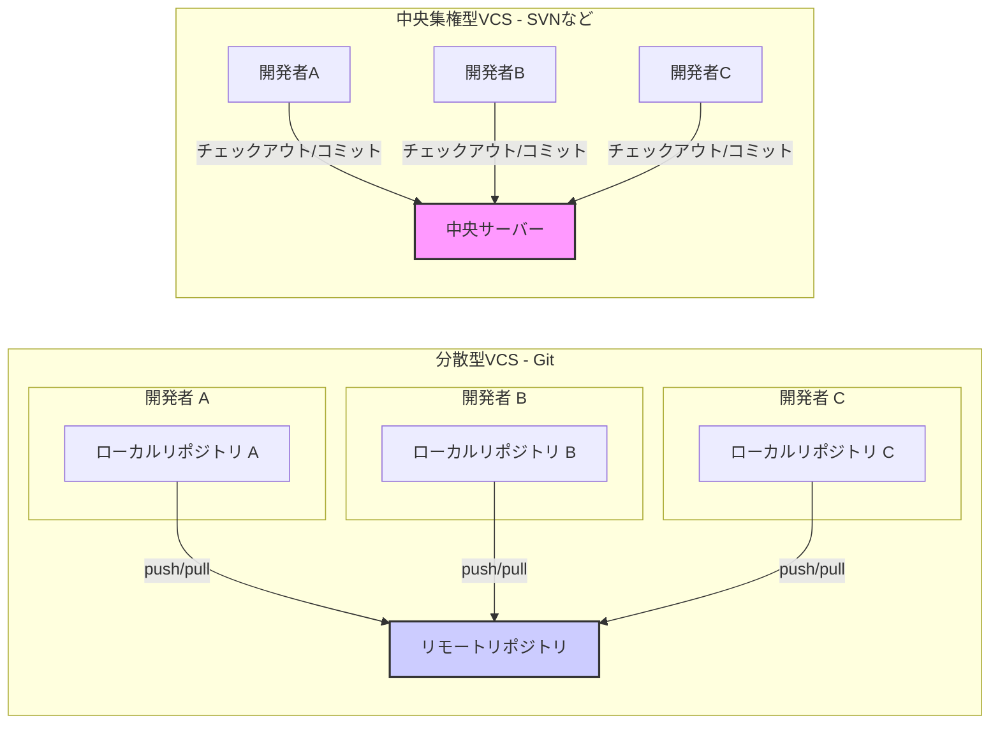
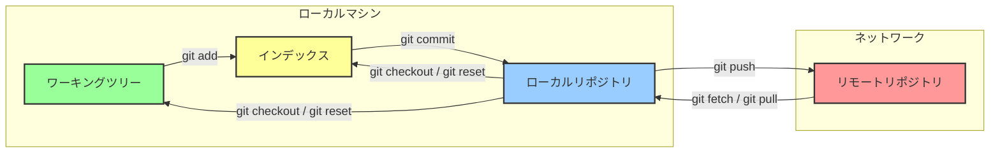
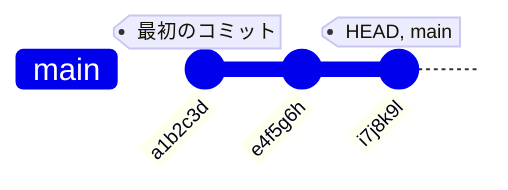
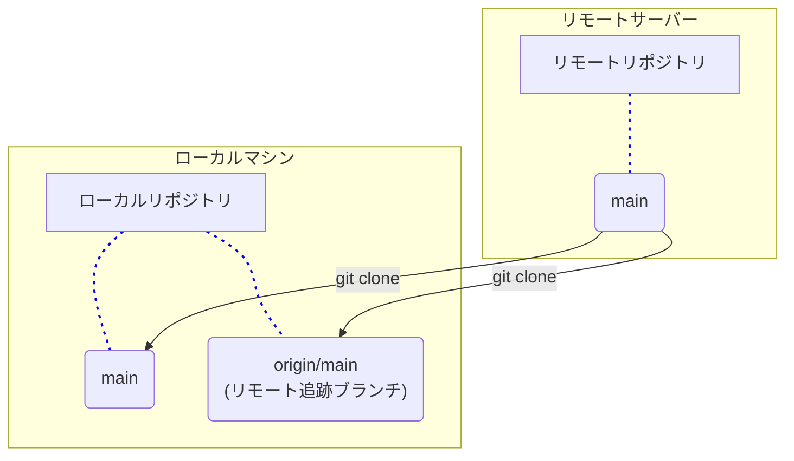
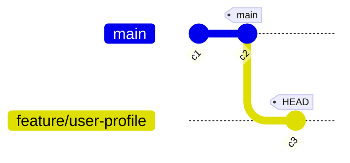
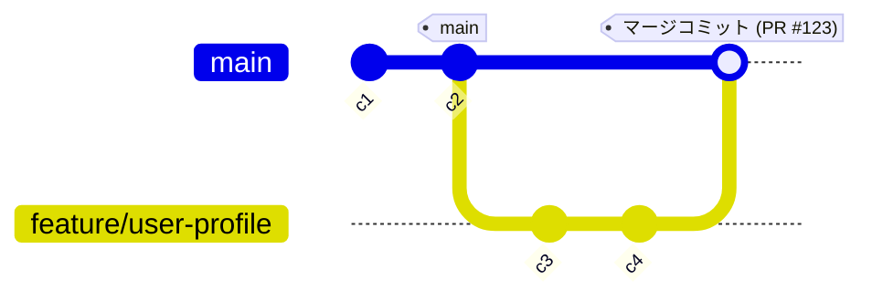
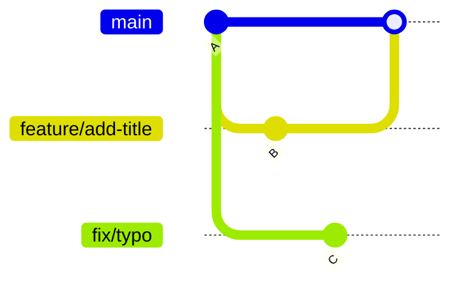
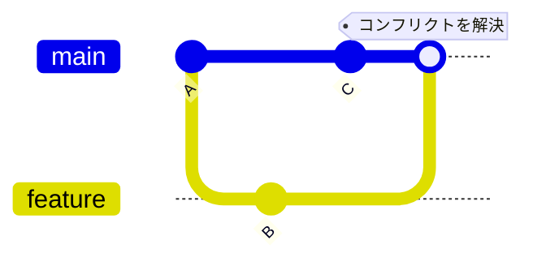

## はじめに

この記事は、Gitの基本的なコマンドは知っているものの、その裏側にある仕組みやチーム開発における効果的な使い方を体系的に学びたいエンジニアを対象としています。

Gitの「なぜそう動くのか？」という内部構造の理解から始め、GitHub Flowに沿った実践的な開発サイクル、そして状況に応じたブランチ戦略の比較まで、豊富な図解と共に一気通貫で解説します。この記事を読み終える頃には、**日々の業務で自信を持ってGitを扱えるようになっている**ことを目指しました。

## 1. Gitの基本概念と内部構造

Gitを効果的に使うための基礎となる考え方を構築します。本セクションでは、Gitの環境を構成要素に分解し、その設計思想を解説します。これにより、エンジニアが日々の業務でGitを扱う際の地図を提供します。

### 1.1. Git: 分散バージョン管理システム

Gitは分散バージョン管理システム（DVCS）です。これは、すべてのバージョン履歴を単一の中央サーバーに保存するSubversion（SVN）のような中央集権型バージョン管理システム（CVCS）とは異なります。Gitでは、各開発者がプロジェクトの完全な履歴を含むリポジトリ全体のコピーを、自身のローカルマシン上に保持します。

この分散アーキテクチャには、主に2つの利点があります。

  * **オフラインでの作業**: コミットやブランチ作成など、ほとんどの操作はローカルで完結するため、ネットワーク接続を必要としません。
  * **高い回復力**: 各開発者が完全なバックアップを持つため、中央サーバーに障害が発生しても、いずれかの開発者のローカルリポジトリから復元できます。

以下の図は、中央集権型と分散型のモデルの違いを示します。



| モデル | 説明 |
| :--- | :--- |
| **中央集権型 VCS** | 全ての開発者が単一の中央サーバーに対して直接やり取りするモデル |
| **分散型 VCS** | 各開発者が自身のローカルリポジトリを持ち、リモートリポジトリを介して変更を同期するモデル |

Gitの分散モデルは、現代のソフトウェア開発に不可欠な柔軟性とコラボレーションの基盤です。

### 1.2. 4つの領域：コードが移動する道のり

Gitを理解する上で最も重要な概念は、コードが存在し移動する4つの主要な領域です。これらの領域は、開発者が変更を管理し、追跡可能なクリーンな履歴を作成するための枠組みを提供します。

| 領域名 | 説明 |
| :--- | :--- |
| **ワーキングツリー** | ファイルを編集する、ローカルファイルシステム上のディレクトリ。**作業台**に相当。 |
| **インデックス (ステージングエリア)** | 次のコミットに含める変更のスナップショットを保持する中間領域。**変更の準備エリア**。 |
| **ローカルリポジトリ** | プロジェクト内の`.git`ディレクトリ。すべてのコミットとプロジェクトの全履歴をローカルに保存。 |
| **リモートリポジトリ** | サーバー（例: GitHub）上でホストされるプロジェクトのバージョン。チームで共有する信頼できる情報源。 |

以下の図は、4つの領域間の関係と、領域間で変更を移動させる主要なコマンドを示します。



ワーキングツリー、インデックス、ローカルリポジトリの3つの領域を分離することは、Gitの核となる思想です。これにより、クリーンでアトミックなコミットを作成できます。開発者は、ワーキングツリーで複数のファイルを変更しても、`git add`コマンドで特定の変更だけをインデックスに登録できます。インデックスを「次のコミットの草稿」として精密に作り上げることで、**アトミックなコミット**（小さく、自己完結した変更）の作成を促進します。アトミックなコミットは、レビューや取り消しが容易で、保守性の高いソフトウェア履歴の礎となります。

### 1.3. コミット：特定時刻のスナップショット

Gitのコミットは差分ではなく、特定の時点における**プロジェクト全体のスナップショット**です。各コミットは、その内容から計算される一意のSHA-1ハッシュ値を持ち、一つ以上の親コミットを指します。この親子関係が連鎖し、プロジェクトの履歴全体が有向非巡回グラフ（DAG）と呼ばれる構造を形成します。

このスナップショット方式のモデルにより、ブランチの作成やマージといった操作を非常に高速かつ効率的に実行できます。



上の図は、コミットがどのように連なっているかを示します。各コミット（円）は親コミットへのポインタを持ち、直線的な履歴を形成します。`main`のようなブランチは、特定のコミットを指す軽量なポインタに過ぎません。

## 2. GitHub Flowによる実践的ワークフロー

GitHub Flowをフレームワークとして、最も一般的な開発サイクルを段階的に解説します。各コマンドと概念を視覚的に理解できる、実践的なチュートリアルです。

### 2.1. リポジトリのセットアップ

開発の最初のステップは、コードリポジトリをローカルマシンに準備することです。これには主に2つのシナリオがあります。

#### git init: 新規プロジェクトの開始

ローカルで新しいプロジェクトを開始する場合、`git init`コマンドを使います。これにより、現在のディレクトリに新しい`.git`サブディレクトリが作成され、空のGitリポジトリが初期化されます。

```bash
mkdir my-new-project
cd my-new-project
git init
```

#### git clone: 既存リポジトリの複製

GitHubなどのリモートサーバーに存在するリポジトリを複製する場合は、`git clone`コマンドを使います。このコマンドは、リポジトリをダウンロードするだけでなく、以下の重要な設定を自動的に行います。

1.  プロジェクトの全履歴を含むローカルリポジトリ（`.git`ディレクトリ）を作成
2.  デフォルトブランチ（通常は`main`）のワーキングツリーをチェックアウト
3.  リモートリポジトリを`origin`という名前で登録
4.  リモートリポジトリの各ブランチに対応するリモート追跡ブランチ（例: `origin/main`）を作成

<!-- end list -->

```bash
git clone https://github.com/example/repository.git
cd repository
```

`git clone`はリモートリポジトリを複製し、ローカルに`main`ブランチとリモート追跡ブランチ`origin/main`の両方を作成します。



### 2.2. 機能開発：ブランチの活用

GitHub Flowの核となる原則は、新しい機能開発やバグ修正のたびに新しいブランチを作成することです。これにより、作業を`main`ブランチから隔離し、本番環境にデプロイ可能なコードベースを常に安定させます。

ブランチ名は、その作業内容を明確に示す、説明的な名前を推奨します（例: `feature/user-profile`, `fix/login-bug`）。

  * `git branch <branch-name>`: 現在のコミットを指す新しいブランチを作成
  * `git checkout <branch-name>`: `HEAD`ポインタを指定ブランチに移動させ、ワーキングツリーを更新して作業ブランチを切り替え
  * `git checkout -b <branch-name>`: ブランチ作成とチェックアウトを一度に実行

<!-- end list -->

```bash
# mainブランチを最新化
git checkout main
git pull origin main

# 新しい機能ブランチを作成して切り替え
git checkout -b feature/user-profile
```

以下の図は、`main`ブランチから`feature/user-profile`ブランチが作成され、`HEAD`が新しいブランチに移動した状態を示します。



### 2.3. ステージングとコミット：進捗の記録

機能ブランチでの作業の変更を記録するプロセスがコミットです。Gitでは、このプロセスを「ステージング」と「コミット」の2段階に分けます。

  * `git status`: ワーキングツリーとインデックスの状態を確認
  * `git diff`: ワーキングツリー内のまだステージングされていない変更内容を表示
  * `git diff --staged`: インデックスにステージングされ、次にコミットされる内容を表示
  * `git add <file>`: ワーキングツリーの変更をインデックス（ステージングエリア）に移動
  * `git commit -m "Your message"`: インデックスのスナップショットをローカルリポジトリの履歴に永続的に保存

#### 変更からコミットまでの流れ

1.  **ファイル変更後**
    `git status`は変更されたファイル（user.js）を`Changes not staged for commit`として表示します。

    ```mermaid
    graph TD
        subgraph "ワーキングツリー"
            A["user.js<br/>(変更あり)"]
        end
        subgraph "インデックス"
            B["(空)"]
        end
        subgraph "ローカルリポジトリ"
            C["(新しいコミットなし)"]
        end
        style A fill:#f99
    ```

2.  **`git add`実行後**
    `git add user.js`を実行すると、変更がインデックスに移動します。`git status`は`Changes to be committed`として表示します。

    ```mermaid
    graph TD
        subgraph "ワーキングツリー"
            A["user.js<br/>(ステージング済)"]
        end
        subgraph "インデックス"
            B["user.js<br/>(ステージング済)"]
        end
        subgraph "ローカルリポジトリ"
            C["(新しいコミットなし)"]
        end
        style B fill:#ff9
    ```

3.  **`git commit`実行後**
    `git commit`を実行すると、インデックスのスナップショットが新しいコミットとしてリポジトリに保存されます。

    ```mermaid
    gitGraph
        commit id: "c2" tag: "main"
        branch feature/user-profile
        checkout feature/user-profile
        commit id: "c3"
        commit id: "c4" tag: "HEAD"
    ```

### 2.4. コラボレーション：リモートとの同期

ローカルでの作業をチームと共有するには、リモートリポジトリとの同期が必要です。この仕組みを理解する鍵は、「リモート追跡ブランチ」をキャッシュとして捉えることです。

| コマンド / 要素 | 説明 |
| :--- | :--- |
| **リモート追跡ブランチ** | リモートリポジトリの状態をローカルに反映する読み取り専用の参照 (`origin/main` など)。リモートの状態の「キャッシュ」と考えることができます。 |
| `git push` | ローカルブランチのコミットをリモートリポジトリにアップロードします。 |
| `git fetch` | リモートから新しいデータをダウンロードし、リモート追跡ブランチを更新します。ローカルの作業ブランチには影響を与えません。 |
| `git pull` | `git fetch`と`git merge`を連続して実行するコマンド。リモートの最新状態を取得し、現在のローカルブランチに統合（マージ）します。 |

#### リモート操作の図解

1.  **git push**
    ローカルの`feature`ブランチでの作業が進み、リモートにはまだ存在しないコミット(`c3`, `c4`)があるとします。下の図は、まさにその`push`直前の状態を示しています。ローカルの`feature`は`c4`を、リモート追跡ブランチ`origin/feature`は`c2`を指しています。

    ```mermaid
    gitGraph
        commit id: "c1"
        branch feature
        checkout feature
        commit id: "c2" tag: "origin/feature"
        commit id: "c3"
        commit id: "c4" tag: "feature"
    ```

    ここで `git push origin feature` を実行すると、`c3`と`c4`のコミットがリモートリポジトリにアップロードされ、リモート追跡ブランチ`origin/feature`のポインタも`c4`に移動します。

    ```mermaid
    gitGraph
        commit id: "c1"
        branch feature
        checkout feature
        commit id: "c2"
        commit id: "c3"
        commit id: "c4" tag: "feature, origin/feature"
    ```

2.  **git fetch**
    チームの他のメンバーが`main`ブランチに新しいコミットをプッシュした状況を考えます。`fetch`前のローカルでは`origin/main`は古いコミットを指しています。

    - ローカルリポジトリ

        ```mermaid
        gitGraph
            commit id: "c1"
            commit id: "c2" tag: "main, origin/main (fetch前)"
        ```

    - リモートリポジトリ

        ```mermaid
        gitGraph
            commit id: "c1"
            commit id: "c2"
            commit id: "c3"
            commit id: "c4" tag: "リモートのmain"
        ```

    `git fetch`を実行すると、リモートリポジトリの最新情報がダウンロードされ、リモート追跡ブランチ（`origin/main`）だけが更新されます。

    - ローカルリポジトリ

        ```mermaid
        gitGraph
            commit id: "c1"
            commit id: "c2" tag: "main"
            commit id: "c3"
            commit id: "c4" tag: "origin/main (fetch後)"
        ```

    リモートの変更（`c3`, `c4`）がダウンロードされ、`origin/main`のポインタが`c4`に移動しました。重要なのは、**ローカルの`main`ブランチは`c2`を指したままで、一切変更されていない**点です。これにより、ローカルの作業に影響を与えることなく、安全にリモートの進捗を確認できます。

3.  **git pull**
    `git pull`は、`git fetch`（リモート内容の取得）と`git merge`（ローカルブランチへの統合）を連続して行うコマンドです。
    `fetch`によって`origin/main`が更新された後、その変更が現在のローカルブランチ（`main`）にマージされます。これにより、新しいマージコミットが作成される場合があります。

    ```mermaid
    gitGraph
        commit id: "c1"
        branch "origin/main"
        checkout "main"
        commit id: "c2" tag: "main (pull前)"
        
        checkout "origin/main"
        commit id: "c3"
        commit id: "c4"
        commit id: "c5"
        
        checkout "main"
        merge "origin/main" tag: "main (pull後)"
    ```

### 2.5. 統合：プルリクエストとマージ

機能開発が完了したら、GitHubの場合`Pull Request（PR）`を、GitLabの場合`Merge Request（MR）`を作成します。これは、あるブランチを別のブランチ（通常は`main`）にマージすることを依頼するもので、コードレビューの場となります。

PRが承認されると、GitHub内で機能ブランチを`main`ブランチにマージします。内部的には以下のコマンドと同等のことが行われます。

1.  `main`ブランチに切り替える
    ```bash
    git checkout main
    ```
2.  リモートの最新の状態に更新する
    ```bash
    git pull origin main
    ```
3.  機能ブランチをマージする
    ```bash
    git merge feature/user-profile
    ```
4.  マージ結果をリモートにプッシュする
    ```bash
    git push origin main
    # ※PRマージの内部処理では、自身がリモートリポジトリなので、pushしない。
    ```
5.  不要になった機能ブランチを削除する
    ```bash
    git branch -d feature/user-profile
    git push origin --delete feature/user-profile
    # ※PRマージの内部処理では、自身がリモートリポジトリなので、pushしない。
    ```

以下の図は、`feature/user-profile`ブランチが`main`ブランチにマージされ、新しいマージコミットが作成される様子を示します。



## 3. 発展的なブランチ戦略の比較

GitHub Flowは多くのプロジェクトで有効ですが、要件によってはより構造化されたワークフローが必要になる場合があります。ここでは主要な3つのブランチ戦略を比較し、それぞれの長所、短所、最適なシナリオを分析します。

リリース戦略をまず定義し、次にそれをサポートするブランチモデルを選択することが、適切なワークフローを導入する鍵となります。

### 3.1. GitHub Flow: 継続的デリバリー

  * **概要**: シンプルでアジャイルなワークフロー

  * **ブランチ戦略**:

      * `main`ブランチは常にデプロイ可能な状態を維持
      * 機能ブランチは`main`から作成し、レビュー後に`main`へマージ
      * 長期的な`develop`や`release`ブランチは存在しない

  * **長所**:

      * シンプルで習得が容易
      * 高速なイテレーションを促進
      * CI/CD（継続的インテグレーション/継続的デリバリー）との親和性が高い

  * **短所**:

      * 複数のバージョンサポートや、厳格なリリースサイクルを持つプロジェクトには不向きな場合がある

  * **図解**:

    ```mermaid
    gitGraph
        commit tag: "v1.0"
        branch feat/A
        checkout feat/A
        commit
        checkout main
        merge feat/A tag: "Deploy-A"
        commit tag: "v1.1"
        branch feat/B
        checkout feat/B
        commit
        commit
        checkout main
        merge feat/B tag: "Deploy-B"
        commit tag: "v1.2"
    ```

### 3.2. Git Flow: 構造化されたリリースモデル

  * **概要**: Vincent Driessenによって提唱された、構造化されたワークフロー

  * **ブランチ戦略**: 複数の長期ブランチが特定の役割を担う

      * `main`: 安定した本番リリースの履歴のみを保持
      * `develop`: すべての機能開発を統合する主要ブランチ
      * `feature/*`: `develop`から分岐し、`develop`にマージ
      * `release/*`: `develop`から分岐し、`main`と`develop`にマージ
      * `hotfix/*`: `main`から分岐し、`main`と`develop`にマージ

  * **長所**:

      * 定期的なバージョンリリースの管理に優れる
      * 本番ブランチの安定性を最大限に確保
      * 役割分担が明確

  * **短所**:

      * 複雑で、開発サイクルを遅らせる可能性がある
      * 継続的デリバリーには過剰装備

  * **図解**:

    ```mermaid
    gitGraph
        commit id: "init"
        branch develop
        checkout develop
        commit id: "dev-start"
        branch feature/A
        checkout feature/A
        commit
        checkout develop
        merge feature/A
        branch release/1.0
        checkout release/1.0
        commit id: "release-fix"
        checkout main
        merge release/1.0 tag: "v1.0.0"
        checkout develop
        merge release/1.0

        checkout main
        branch hotfix/1.0.1

        checkout hotfix/1.0.1
        commit id: "hotfix-commit"
        checkout main
        merge hotfix/1.0.1 tag: "v1.0.1"
        checkout develop
        merge hotfix/1.0.1
    ```

### 3.3. GitLab Flow: 柔軟な中間案

  * **概要**: GitHub FlowのシンプルさとGit Flowの構造性を組み合わせた実用的な折衷案

  * **ブランチ戦略**: プロジェクトのニーズに応じた2つのバリエーション

    1.  **環境ブランチ**: `staging`や`production`など、デプロイ環境に対応する長期ブランチを使用
    2.  **リリースブランチ**: 複数のバージョンをサポートするために、`main`から`1-5-stable`のような長期的なリリースブランチを作成

  * **長所**:

      * Git Flowより柔軟で、GitHub Flowにはない明確なデプロイステージを提供
      * 課題追跡システムとの統合が強力

  * **短所**:

      * 多くの環境ブランチを使用すると複雑になる可能性がある

  * **図解 (環境ブランチ)**:

    ```mermaid
    gitGraph
        commit id: " "

        branch feature/A
        checkout feature/A
        commit
        checkout main
        merge feature/A

        branch staging
        checkout staging
        commit id: "Verified on Staging (A)" type: HIGHLIGHT

        branch production
        checkout production
        commit id: "Released to Production (A)" type: HIGHLIGHT

        checkout main
        branch feature/B
        checkout feature/B
        commit
        commit
        checkout main
        merge feature/B

        checkout staging
        merge main
        commit id: "Verified on Staging (B)" type: HIGHLIGHT

        checkout production
        merge staging
        commit id: "Released to Production (B)" type: HIGHLIGHT
    ```

### 3.4. 戦略の選択：比較フレームワーク

| 特徴 | GitHub Flow | Git Flow | GitLab Flow |
| :--- | :--- | :--- | :--- |
| **複雑さ** | 低 | 高 | 中 |
| **主な用途** | 継続的デリバリー、Webアプリ | 定期的なバージョンリリース | ステージング環境でのデプロイ、バージョン保守 |
| **主要ブランチ** | `main`, `feature` | `main`, `develop`, `feature`, `release`, `hotfix` | `main`, `feature`, + 環境 or リリースブランチ |
| **CI/CD適合性** | 非常に高い | 難しい | 高い |
| **最適なチーム** | 強力な自動化を持つチーム | 厳格なリリースサイクルを持つ大規模チーム | アジリティと統制のバランスが必要なチーム |

## 4. 日常業務で役立つGitコマンドリファレンス

日常業務で役立つ強力なGitコマンドを、具体的なシナリオ、コマンド構文、そして効果を視覚化する図と共に解説します。

### 4.1. コミット履歴の整理

#### git pull --rebase

  * **シナリオ**: リモートの変更を取り込む際に、不要なマージコミットを作成せず、ローカルの変更をリモートの変更の先端に再配置して、直線的な履歴を保ちたい場合。
  * **コマンド**: `git pull --rebase`
  * **解説**: この操作後、ローカルのコミットは新しいコミットとして再作成されるため、コミットハッシュが変わります。
  * **図解**:
      * **通常の `git pull` (マージコミットが作成される)**

        ```mermaid
        gitGraph
            commit id: "A"
            commit id: "B" tag: "main"
            commit id: "D" tag: "origin/main"
            branch local-work
            checkout local-work
            commit id: "C"
            checkout main
            merge local-work tag: "pullはマージコミットを作成"
        ```

      * **`git pull --rebase` (直線的な履歴を維持)**

        ```mermaid
        gitGraph
            commit id: "A"
            commit id: "B"
            commit id: "D" tag: "main, origin/main"
            commit id: "C'" tag: "ローカルの変更が再配置される"
        ```

#### git merge --squash

  * **シナリオ**: 機能ブランチの細かな「作業中」コミットを一つにまとめ、`main`ブランチに意味のある単一のコミットとして統合したい場合。
  * **コマンド**: `git merge --squash <feature-branch>`
  * **図解**:
      * **Squash前**:

        ```mermaid
        gitGraph
            commit id: "A" tag: "main"
            branch feature
            checkout feature
            commit id: "作業1"
            commit id: "作業2"
            commit id: "typo修正"
        ```

      * **Squash後**: (`main`ブランチでコマンド実行後、コミットする)

        ```mermaid
        gitGraph
            commit id: "A" tag: "main"
            commit id: "feat: 新機能を実装" type: HIGHLIGHT
        ```

### 4.2. 特定の変更の適用

#### git cherry-pick

  * **シナリオ**: あるブランチの特定のコミット（例: 重要なバグ修正）だけを、別のブランチにも適用したい場合。

  * **コマンド**: `git cherry-pick <commit-hash>`

  * **図解**: `release-1.0`ブランチのコミット`C`を`main`ブランチに適用します。

    ```mermaid
    gitGraph
        commit id: "A"
        branch release-1.0
        checkout release-1.0
        commit id: "B"
        commit id: "C"
        checkout main
        commit id: "D"
        commit id: "E"
        commit id: "C'" tag: "Cherry-picked" type: HIGHLIGHT
    ```

### 4.3. 作業の書き換えと取り消し

#### git reset

  * **シナリオ**: まだリモートにプッシュしていないローカルのコミットを取り消したい場合 (**注意: チームで共有しているブランチでは絶対に使用しないでください**)。
  * **コマンド**:
      * `git reset --soft HEAD~1`: コミットのみを取り消し、変更はステージングされたまま残す。
      * `git reset --mixed HEAD~1` (デフォルト): コミットとステージングを取り消し、変更はワーキングツリーに残す。
      * `git reset --hard HEAD~1`: コミット、ステージング、ワーキングツリーの変更をすべて破棄する。
  * **図解 (`--hard`の例)**: `git reset --hard HEAD~1` を実行すると、`main`ブランチの先端がコミット`C`から`B`へ移動します。
      * **Reset前**:

        ```mermaid
        gitGraph
            commit id: "A"
            commit id: "B"
            commit id: "C" tag: "main"
        ```

      * **Reset後**:

        ```mermaid
        gitGraph
            commit id: "A"
            commit id: "B" tag: "main"
        ```

#### git revert

  * **シナリオ**: 既にリモートにプッシュした共有ブランチ上のコミットを、安全に取り消したい場合。

  * **コマンド**: `git revert <commit-hash>`

  * **解説**: `reset`が履歴を書き換えるのに対し、`revert`は指定したコミットの変更を打ち消す**新しいコミット**を作成します。これにより、共有履歴を安全に修正できます。

  * **図解**: コミット`B`を打ち消す新しいコミット`Revert B`が作成されます。

    ```mermaid
    gitGraph
        commit id: "A"
        commit id: "B"
        commit id: "C"
        commit id: "Revert B" type: REVERSE
    ```

### 4.4. 作業の一時退避

#### git stash

  * **シナリオ**: 現在の作業が中途半端だが、緊急の修正のために別のブランチに切り替える必要がある場合。コミットしたくない変更を一時的に退避させたい時に使用します。

  * **コマンド**:

      * `git stash push -m "message"`: 変更をスタックに退避。
      * `git stash list`: 退避した作業の一覧を表示。
      * `git stash pop`: 最新の退避作業を復元し、スタックから削除。

  * **図解**:

    ```mermaid
    graph TD
        A["feature-Aで作業中<br/>(未コミットの変更あり)"] --> B("緊急のバグ修正が必要!");
        B --> C["git stash"];
        C --> D("ワーキングツリーがクリーンになる");
        D --> E["git checkout hotfix-branch"];
        E --> F("バグを修正してコミット");
        F --> G["git checkout feature-A"];
        G --> H["git stash pop"];
        H --> I("未コミットの変更が復元される<br/>feature-Aの作業を再開");
    ```

### 4.5. 履歴の調査

#### git reflog

  * **シナリオ**: `git reset --hard`で誤ってコミットを消した場合など、「失われた」作業を回復したい場合。`reflog`は`HEAD`のすべての動きを記録したローカル専用の安全網です。

  * **コマンド**: `git reflog`

  * **図解**: `reset`で`D`と`C`を消してしまっても、`reflog`で`D`のコミットハッシュ（例：`a3c21b0`）を見つけ、`git reset --hard a3c21b0`で復元できます。

    ```mermaid
    gitGraph
        commit id: "A"
        commit id: "B"
        commit id: "C"
        commit id: "D" tag: "a3c21b0"
    %% `git reset --hard HEAD~2` を実行し、HEADがBに移動したと仮定
    %%
    %% reflog出力例:
    %% b4d45a3 HEAD@{0}: reset: moving to HEAD~2
    %% a3c21b0 HEAD@{1}: commit: Dのコミットメッセージ
    %% f1e09d8 HEAD@{2}: commit: Cのコミットメッセージ
    ```

### 4.6. マイルストーンの記録

#### git tag

  * **シナリオ**: プロジェクトの特定の時点に、`v1.0.0`のような永続的な名前を付けたい場合。主にリリースバージョンをマークするために使用します。

  * **コマンド**:

      * `git tag v1.0.0` (軽量タグ)
      * `git tag -a v1.0.0 -m "Release version 1.0.0"` (注釈付きタグ)

  * **図解**:

    ```mermaid
    gitGraph
        commit
        commit
        commit tag: "v1.0.0"
        commit
    ```

### 4.7. コミット履歴のインタラクティブな編集

#### git rebase -i

  * **シナリオ**: プルリクエストを提出する前に、複数の「作業中」コミットを一つにまとめたり、コミットメッセージを修正したり、不要なコミットを削除して、履歴をきれいに整えたい場合。
  * **コマンド**: `git rebase -i <base>` (例: `git rebase -i HEAD~3` は直近3つのコミットを対象とします)
  * **インタラクティブな操作**: コマンド実行後、エディタが開き、各コミットに対して以下のアクションを指定できます。
      * `pick (p)`: コミットをそのまま使用します。
      * `reword (r)`: コミットを使用しますが、コミットメッセージを編集します。
      * `edit (e)`: コミットを使用しますが、内容を修正するために一時停止します。
      * `squash (s)`: コミットを直前のコミットに統合し、新しいコミットメッセージを編集します。
      * `fixup (f)`: `squash`と同様ですが、このコミットのメッセージは破棄されます。
      * `drop (d)`: コミットを完全に削除します。
  * **図解**: 3つの`wip`コミットを`git rebase -i HEAD~3`を使って1つに`squash`します。
      * **Rebase前**:

        ```mermaid
        gitGraph
            commit id: "A" tag: "main"
            branch feature
            checkout feature
            commit id: "wip1"
            commit id: "wip2"
            commit id: "wip3"
        ```

      * **Rebase後**:

        ```mermaid
        gitGraph
            commit id: "A" tag: "main"
            branch feature
            checkout feature
            commit id: "B" tag: "feat: 新機能の実装"
        ```

### 4.8. 安全なブランチ切り替え

#### git switch

  * **シナリオ**: ブランチの切り替え操作を、ファイル復元機能も持つ`git checkout`から分離し、より明確で安全に行いたい場合（Git v2.23以降で推奨）。

  * **コマンド**:

      * `git switch <branch-name>`: 既存のブランチに切り替えます。
      * `git switch -c <new-branch-name>`: 新しいブランチを作成して切り替えます。
      * `git switch -`: 直前にいたブランチに切り替えます。

  * **図解**:

    ```mermaid
    graph TD
        A["現在のブランチ: main"] -- "git switch -c feature/new-task" --> B["現在のブランチ: feature/new-task"];
        B -- "git switch main" --> A;
    ```

### 4.9. 変更の安全な復元

#### git restore

  * **シナリオ**: ワーキングツリーの変更を破棄したり、ステージングした変更を取り消したりする操作を、より安全かつ明確に行いたい場合（Git v2.23以降で推奨）。

  * **コマンド**:

      * `git restore <file>`: ワーキングツリーのファイルの変更を破棄します。
      * `git restore --staged <file>`: ステージングされたファイルの変更を取り消します（アンステージ）。
      * `git restore --source <commit> <file>`: ファイルを特定のコミットの状態に戻します。

  * **図解**:

    ```mermaid
    graph TD
        subgraph "ワーキングツリーの変更を破棄 (git restore <file>)"
            direction LR
            I1[インデックス] -- "内容をコピー" --> WT1[ワーキングツリー]
        end
        subgraph "ステージングの取り消し (git restore --staged <file>)"
            direction LR
            H2[HEAD] -- "内容をコピー" --> I2[インデックス]
        end
    ```

### 4.10. バグの原因を二分探索で特定

#### git bisect

  * **シナリオ**: プロジェクトの履歴内でバグが混入したコミットを、手作業で一つずつ確認するのではなく、二分探索アルゴリズムを使って効率的に特定したい場合。

  * **コマンド**:

      * `git bisect start`: 二分探索セッションを開始します。
      * `git bisect bad <commit>`: バグが含まれるコミットを指定します（例: `HEAD`）。
      * `git bisect good <commit>`: バグが含まれていなかったことが確実な過去のコミットを指定します。
      * `git bisect good` / `git bisect bad`: Gitが自動でチェックアウトしたコミットをテストし、その結果を報告します。Gitはこれを元に範囲を半分に絞り込みます。
      * `git bisect reset`: セッションを終了し、元のブランチに戻ります。

  * **図解**:

    ```mermaid
    graph TD
        A(セッション開始<br/git bisect start) --> B(悪いコミットをマーク<br/>git bisect bad HEAD);
        B --> C(良いコミットをマーク<br/>git bisect good v1.2.0);
        C --> D{Gitが中間コミットを<br/>自動でチェックアウト};
        D --> E{コードをテスト};
        E -- "バグあり" --> F("悪いとマーク<br/>git bisect bad");
        E -- "バグなし" --> G("良いとマーク<br/>git bisect good");
        F --> H{範囲が特定されたか？};
        G --> H;
        H -- No --> D;
        H -- Yes --> I(Gitが原因のコミットを特定);
        I --> J(セッション終了<br/>git bisect reset);
    ```

## 5. トラブルシューティング：マージコンフリクトの解決

マージコンフリクトはGitの一般的な課題ですが、これはエラーではなく分散開発における正常なプロセスの一部です。ここでは、コンフリクトの原因を理解し、解決するための実践的なガイドを提供します。

### 5.1. コンフリクトの原因

マージコンフリクトは、2つの異なるブランチが同じファイルの同じ行を編集した場合など、Gitがどちらの変更を優先すべきか自動的に判断できない時に発生します。Gitはマージプロセスを中断し、開発者に手動での解決を促します。



### 5.2. 段階的解決ガイド

コンフリクトは、以下の手順で体系的に解決できます。

1.  **マージの開始とコンフリクトの発生**
    `git merge <branch-name>`を実行すると、コンフリクト発生時にGitが通知します。

    ```bash
    $ git merge fix/typo
    Auto-merging README.md
    CONFLICT (content): Merge conflict in README.md
    Automatic merge failed; fix conflicts and then commit the result.
    ```

2.  **コンフリクトの確認**
    `git status`を実行すると、コンフリクトしているファイルが`Unmerged paths`として表示されます。

    ```bash
    $ git status
    On branch main
    You have unmerged paths.
      (fix conflicts and run "git commit")
    Unmerged paths:
        both modified:   README.md
    ```

3.  **コンフリクトマーカーの解釈**
    コンフリクトしたファイルを開くと、以下のようなマーカーが表示されます。

    ```diff
    <<<<<<< HEAD
    # My Awesome Project
    =======
    # My Awesom Project
    >>>>>>> fix/typo
    ```

      * `<<<<<<< HEAD`: 現在のブランチ（この例では`main`）の変更内容
      * `=======`: 2つのブランチの変更内容の区切り
      * `>>>>>>> fix/typo`: マージしようとしているブランチの変更内容

4.  **手動での解決**
    エディタでファイルを開き、マーカーをすべて削除し、最終的に残したいコードの状態に手動で編集します。

    ```markdown
    # My Awesome Project
    ```

5.  **解決のマーク**
    ファイルを保存した後、`git add`コマンドでコンフリクトが解決されたことをGitに伝えます。

    ```bash
    git add README.md
    ```

6.  **マージの完了**
    `git commit`を実行してマージを完了させます。Gitが自動でコミットメッセージの雛形を用意してくれます。

    ```bash
    git commit
    ```

これでマージコンフリクトは解決され、2つのブランチの履歴が統合されます。



## おわりに

Gitは単なるツールではなく、チームの生産性を向上させ、クリーンな開発履歴という資産を築くための強力なフレームワークです。この記事ではその基礎から実践までを解説しましたが、現場でのチーム開発ではさらに考慮すべき点があります。

  * **.gitattributes**: OS間の改行コードの違いなど、環境差異をリポジトリレベルで吸収します。
  * **Git Hooks**: コミット前やプッシュ前に特定のスクリプト（リンターやテストなど）を自動実行させ、コードの品質を保ちます。
  * **Conventional Commits**: `feat:`や`fix:`といった接頭辞をコミットメッセージに付けるルールで、履歴の可読性を高め、リリースノートの自動生成を可能にします。

これらの概念も探求することで、あなたのGitスキルはさらに向上するでしょう。この記事が、あなたのGitに対する理解を深め、日々の開発業務に自信をもたらす一助となれば幸いです。

この記事が少しでも参考になった、あるいは改善点などがあれば、ぜひリアクションやコメント、SNSでのシェアをいただけると励みになります！

-----

## 参考リンク

#### 1. Git全般・公式ドキュメント

Gitの基本的な概念やコマンドについて学べる公式リファレンスやチュートリアルです。

  * **git-scm.com (公式ドキュメント)**
      * [Git Tutorial](https://git-scm.com/docs/gittutorial) - Gitの公式チュートリアル
      * [Reference - Git](https://git-scm.com/docs) - 全コマンドのリファレンス
      * [Remote Branches](https://git-scm.com/book/en/v2/Git-Branching-Remote-Branches) - リモートブランチの概念解説
  * **チュートリアル・個別トピック**
      * [An Intro to Git and GitHub for Beginners (Tutorial)](https://product.hubspot.com/blog/git-and-github-tutorial-for-beginners) - HubSpot
      * [Git Tutorial](https://www.geeksforgeeks.org/git/git-tutorial/) - GeeksforGeeks
      * [Git merge conflicts](https://www.atlassian.com/git/tutorials/using-branches/merge-conflicts) - Atlassian Git Tutorial
      * [What are the differences between local branch, local tracking branch, remote branch and remote tracking branch?](https://stackoverflow.com/questions/16408300/what-are-the-differences-between-local-branch-local-tracking-branch-remote-bra) - Stack Overflow

#### 2. ブランチ戦略 (Git Flow, GitHub Flow, GitLab Flow)

この記事で紹介した主要なブランチ戦略の提唱者による原文や、各ワークフローを詳しく解説・比較している記事です。

  * **Git Flow**
      * [A successful Git branching model](https://nvie.com/posts/a-successful-git-branching-model/) - **Git Flowを提唱したオリジナルの記事** (nvie.com)
      * [Gitflow Workflow](https://www.atlassian.com/git/tutorials/comparing-workflows/gitflow-workflow) - Atlassian Git Tutorial
      * [What is Git Flow](https://www.gitkraken.com/learn/git/git-flow) - GitKraken
  * **GitHub Flow**
      * [GitHub flow](https://docs.github.com/en/get-started/using-github/github-flow) - GitHub Docs (公式)
      * [Understanding the GitHub Flow](https://roachhd.gitbooks.io/github-guides/flow/flow.html) - GitHub Guides
  * **GitLab Flow**
      * [What is GitLab Flow?](https://about.gitlab.com/topics/version-control/what-is-gitlab-flow/) - GitLab (公式)
  * **各Flowの比較**
      * [Choosing the Right Git Branching Strategy: A Comparative Analysis](https://medium.com/@sreekanth.thummala/choosing-the-right-git-branching-strategy-a-comparative-analysis-f5e635443423) - Medium
      * [Git Branching Strategies: GitFlow, Github Flow, Trunk Based...](https://www.abtasty.com/blog/git-branching-strategies/) - AB Tasty
      * [Github Flow vs. Git Flow: What's the Difference?](https://www.harness.io/blog/github-flow-vs-git-flow-whats-the-difference) - Harness
      * [What is the difference between GitHub Flow and GitLab Flow?](https://stackoverflow.com/questions/39917843/what-is-the-difference-between-github-flow-and-gitlab-flow) - Stack Overflow
