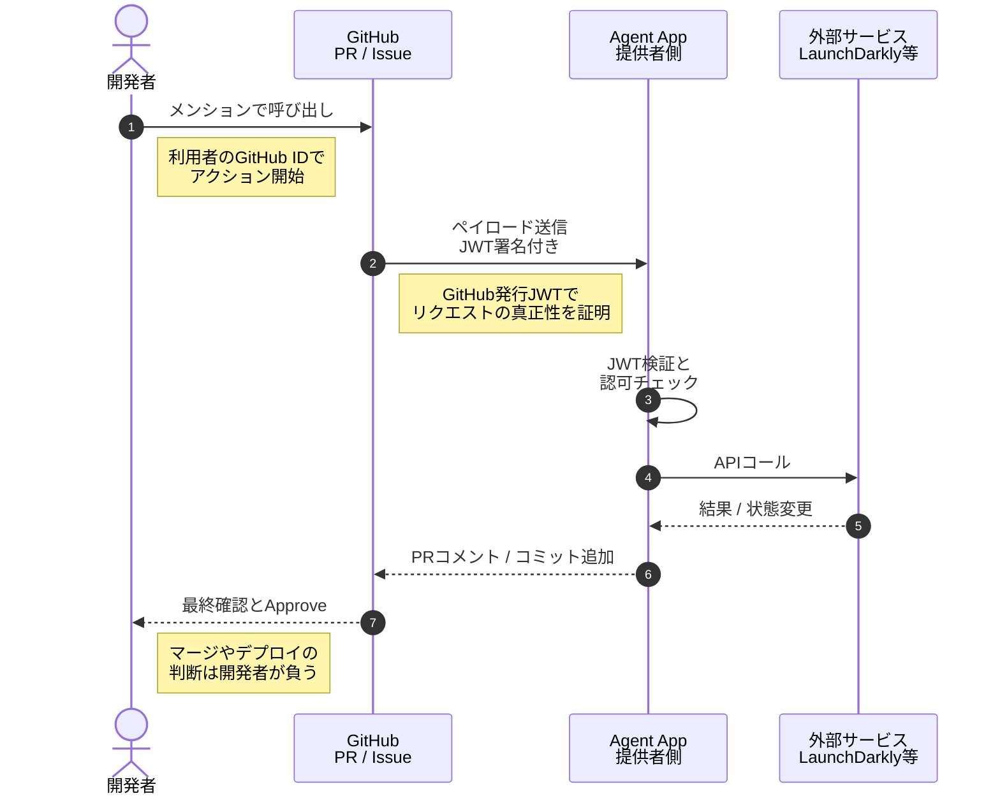

GitHubは2026年8月、外部サービスのエージェントをIssueやPull Requestから直接呼び出す「agent apps」の使い方を公開しました。要件整理から依存関係レビュー、フィーチャーフラグ、デプロイのリスク評価までを、GitHubの画面から離れずに扱えるという内容です。

この記事では、agent appsが実際に何を変えるのかを整理し、導入を判断する側が事前に決めておくべき論点、とくに「誰の権限で実行されるのか」と「事故のとき誰が責任を負うのか」を構造として読み解きます。ツールの紹介ではなく、導入判断の材料として読んでください。

対象読者は次のような方です。

- 開発プロセスにAIエージェントを組み込むか判断する立場の方
- 複数のSaaSにまたがる開発フローの統合を検討している方
- 自動化と承認フローの責任分界を設計する必要がある方

*この記事の全体像。以下、順に解説します。*

## agent appsが変えるのは「作業場所」ではなく「文脈」

agent appsは、GitHub Marketplaceで配布されるアプリの一種です。開発者はIssueやPull Requestのコメントで `@amplitude` `@launchdarkly-agent` のようにメンションし、そのスレッドの文脈のまま外部サービスを操作します。

ここで重要なのは、削減されるのが画面遷移そのものではないという点です。実際に失われがちなのは、別のツールへ移った瞬間に切れる**変更の文脈**です。

- どのIssueの要件に紐づく変更なのか
- どのコミットがそのフラグ設定を必要としたのか
- どのレビューを経てその展開判断がなされたのか

これらは通常、GitHub側とSaaS側に分かれて記録され、後から辿るコストが高くなります。agent appsは、この記録をPull Requestという単一のタイムラインへ寄せる構造をとります。導入効果を測るなら、操作時間よりも「変更の経緯を後から再現できるか」を見るほうが実態に合います。

## SDLCのどの工程に、どのエージェントが入るか

GitHubの記事では、配信ワークフローの各工程に対応するagent appsが挙げられています。

| 工程 | 例として挙げられたサービス | エージェントが担う役割 |
|---|---|---|
| 要件・スコープ整理 | Amplitude | プロダクトデータをもとにした要件スコープの検討 |
| 依存関係のレビュー | Endor Labs | 依存パッケージのリスク確認 |
| 機能の展開制御 | LaunchDarkly | フィーチャーフラグの設定と展開 |
| デプロイのリスク評価 | PagerDuty | 変更に伴う運用リスクの評価 |
| その他の工程 | Packfiles、Miro、Bright Security、SonarQube、Octopus Deploy | 設計、セキュリティ検査、品質分析、デプロイ |

この並びから読み取れるのは、agent appsが単なる「役割分担されたAI」ではないという点です。各エージェントは、**外部サービスへの認証主体**であり、同時に**成果物の受け渡し口**として機能します。呼び出しの結果は、多くの場合そのままサービスへ適用されるのではなく、Pull Requestのコミットや承認リクエストという形でGitHub上に現れます。

つまり、エージェントを増やすことは、システムに対する権限の入口を増やすことと同じです。工程ごとに便利かどうかで採否を決めると、権限の全体像が見えないまま入口だけが増えていきます。

## 権限はどこを通って外部サービスに届くか

agent appsを評価するとき、最初に押さえるべきは「開発者がメンションしてから外部サービスの状態が変わるまで、どのIDで実行されているか」です。おおまかな流れは次のようになります。

この連鎖を3つの責任に分けると、設計上の論点がはっきりします。

1. **GitHubの責任**: 利用者の認証と、agent appへの真正なリクエスト転送。署名付きペイロードによって「そのリクエストが確かにGitHub由来である」ことを保証します。
2. **agent app提供者の責任**: 受け取ったリクエストの検証と、外部サービスに対する適切なスコープでの認可・実行。ここで何の権限を使うかは提供者の実装に依存します。
3. **開発者の責任**: 生成された成果物、つまりコミットや設定変更の提案に対する最終的なレビューと承認。

3番目が構造上の要です。エージェントが提案を作っても、システムを変えるのは承認ボタンを押した人間です。自動化されたように見えて、責任の帰属先は人間側に残る設計になっています。

## 導入前に決めておく4つの論点

上の責任分割をそのまま自組織に持ち込むと、決めきれていない箇所が残ります。判断者として事前に確定させたい項目を挙げます。

### 1. 実行権限は誰のものか

外部サービスへのAPIコールが、利用者個人の権限で動くのか、提供者のサービス権限で動くのかを確認します。前者なら操作ログが個人に紐づき、後者ならエージェント単位の共有権限になります。監査の粒度がここで決まります。

### 2. どの操作を承認必須にするか

Pull Requestのコメント投稿と、本番フラグの展開を同じ扱いにはできません。エージェントごとに、提案までで止めるのか、状態変更まで許すのかを工程単位で線引きします。線引きの単位はエージェントではなく操作です。

### 3. 権限の棚卸しをいつ行うか

agent appsは工程ごとに追加されるため、時間が経つほど「誰も使っていないが権限だけ生きている」エージェントが増えます。導入時点で棚卸しの周期と、未使用判定の基準を決めておきます。

### 4. 事故の初動で誰が何を見るか

誤った展開が起きたとき、原因がエージェントの判断なのか、指示の曖昧さなのか、外部サービス側の障害なのかを切り分ける必要があります。Pull Requestのタイムラインにどこまで記録が残るかを、導入前に実際の操作で確認しておくと初動が変わります。

いずれも技術的な難所ではなく、決めていないと後で揉める種類の項目です。導入判断のチェックリストとして扱うのが現実的です。

## まだ確認できていないこと

公開情報だけでは判断しきれない点も明示しておきます。

- **認証の内部仕様**: GitHubの記事はユースケースの紹介が中心で、agent app内部でのトークンの引き回しや、Model Context Protocol準拠サーバーへの権限伝播の詳細までは示されていません。実装レベルの判断には開発者向けドキュメントでの追加確認が必要です。
- **障害時の責任の切り分け**: 外部サービス側で発生した事故について、エージェントの推論、指示の曖昧さ、サービス側の不具合のいずれに帰属させるかの実務的な基準は、まだ確立されていません。契約や運用ルールで各組織が補う領域になります。

この2点は、少なくとも本番の展開制御をエージェントに預ける前に、自組織の基準として言語化しておく必要があります。

## まとめ

- agent appsは、外部サービスの操作をIssueやPull Requestの文脈へ集約する仕組みです。価値は操作時間よりも、変更の経緯が単一のタイムラインに残ることにあります。
- 各エージェントは外部サービスへの認証主体であり、追加するたびにシステムへの権限の入口が増えます。工程単位の利便性だけで採否を決めない構造理解が要ります。
- GitHub、agent app提供者、開発者の3者で責任が分かれ、最終的なシステム変更の責任は承認した開発者に残ります。
- 導入判断では、実行権限の帰属、承認必須の操作範囲、権限の棚卸し周期、事故時の切り分け手順の4点を先に決めます。
- 認証の内部仕様と障害時の責任分界は公開情報だけでは確定しないため、本番の展開制御を預ける前に自組織の基準を用意します。

この記事が少しでも参考になった、あるいは改善点などがあれば、ぜひリアクションやコメント、SNSでのシェアをいただけると励みになります！

## 参考リンク

- [How to bring your software delivery workflow into GitHub with agent apps (GitHub Blog, 2026-08)](https://github.blog/ai-and-ml/github-copilot/how-to-bring-your-software-delivery-workflow-into-github-with-agent-apps/)
