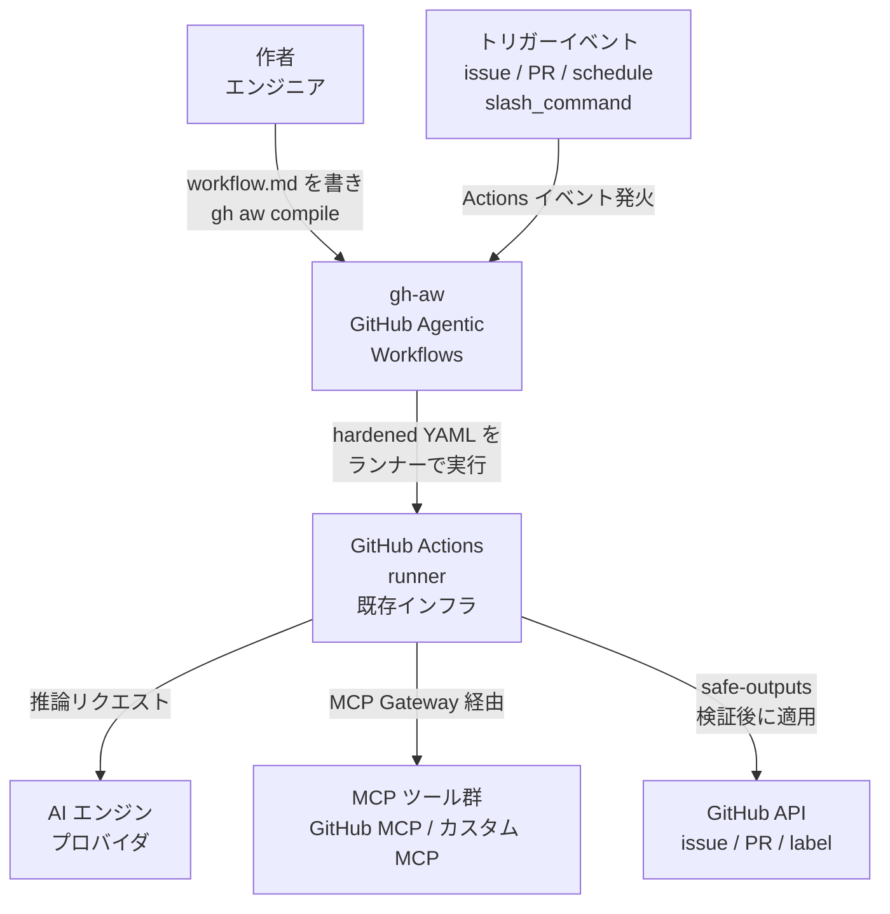
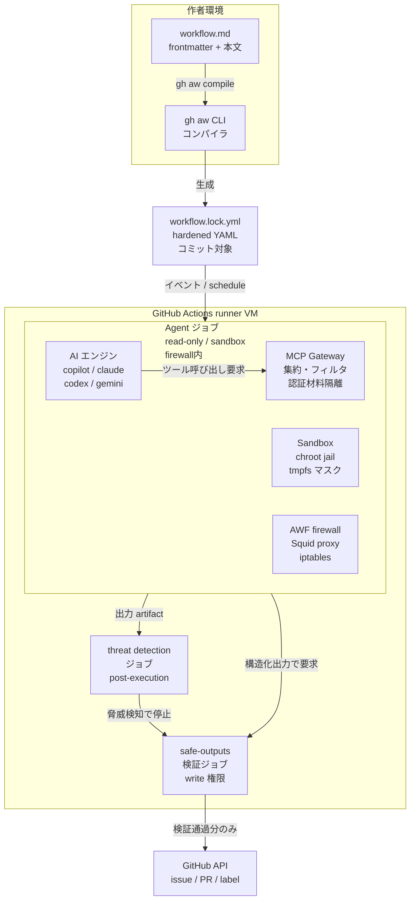
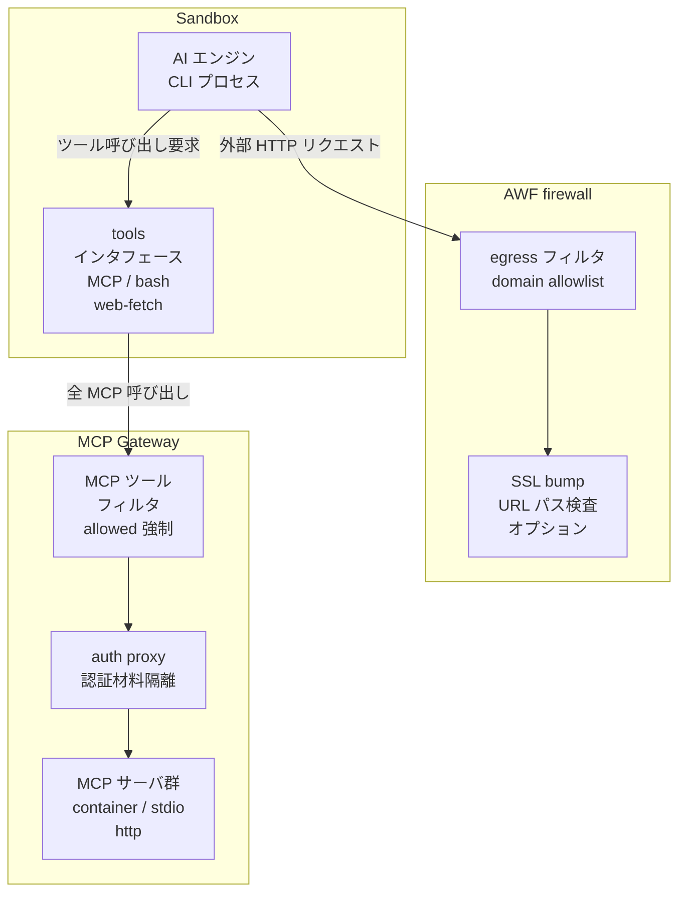
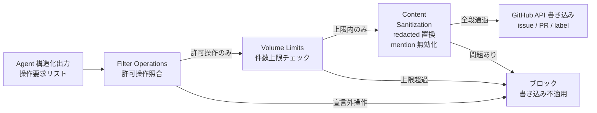
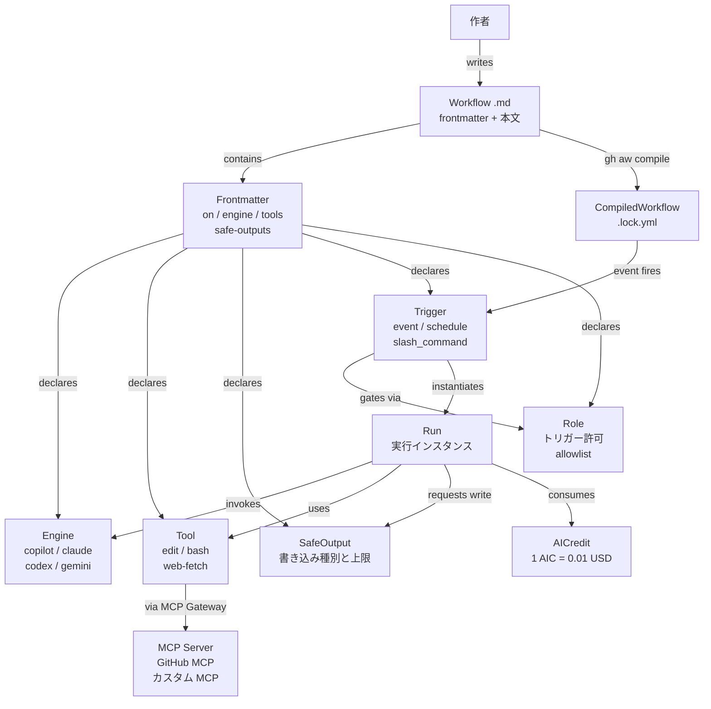
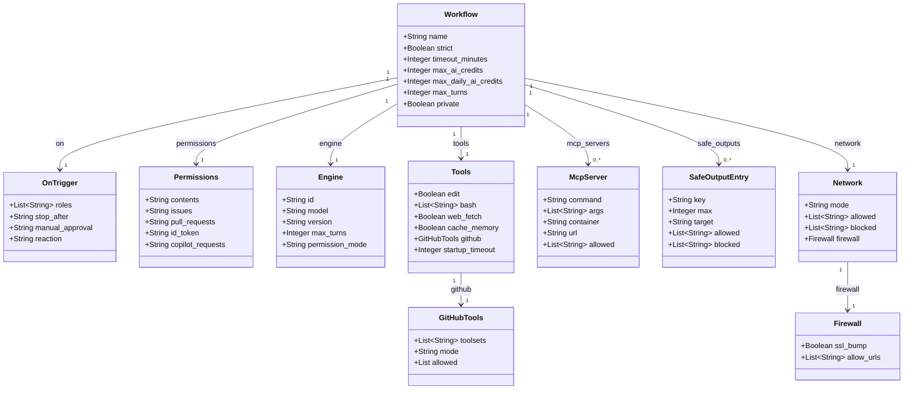

> 調査日: 2026-06-13 / 対象: `github/gh-aw`（GitHub Agentic Workflows, 2026-06-11 public preview）
> Issue 番号・状態は 2026-06-13 に `gh api` で一次照合済みです。

## 概要

**GitHub Agentic Workflows（gh-aw）** は、AI エージェントの作業を「チャット」から「GitHub Actions の権限境界の中」へ移す仕組みです。エンジニアは `.github/workflows/<name>.md` に、frontmatter（トリガー・権限・エンジン・ツール・出力ポリシー）と自然言語 Markdown 本文（エージェントへの指示）を書きます。これを `gh aw compile`（`gh` 拡張 CLI）が hardened な GitHub Actions YAML（`<name>.lock.yml`）へトランスパイルし、実行は通常の GitHub Actions runner 上で行います。2026-06-11 に public preview へ昇格しました（GitHub Next 由来の研究プロトタイプが起点。リポジトリは `github/gh-aw`、約 4,600 star、2026-06-13 取得）。

この二層構造（自然言語 DSL としての `.md` と Actions ランタイムの `.lock.yml`）の核心は、独自実行基盤を新設せず既存 Actions のイベント・権限・runner・課金にそのまま乗る点にあります。`gh aw compile` は決定論的なトランスパイラです。`.lock.yml` は通常の GitHub Actions ワークフローとして、PR レビュー・CODEOWNERS・runner group 設定をそのまま継承します。

最大の主張は **"secure by default"** です。エージェント本体のジョブは read-only に固定されます。書き込み（issue・PR・コメント・ラベル等）は permissions に直接与えず `safe-outputs:` に宣言し、write 権限を持つ別の下流ジョブが決定論的に検証してから実行します。この intent（エージェント＝意図生成・信頼しない）と execution（下流ジョブ＝検証して実行）の分離に、zero-secret sandbox・Agent Workflow Firewall（AWF）・post-execution threat detection を重ね、プロンプトインジェクションや機密持ち出しの被害範囲を構造的に絞り込みます。

本機能の位置づけは「エージェントを新基盤ではなく既存 CI/CD の権限境界に閉じ込める」という問題意識と一致します。ただし GitHub 自身が「非決定的なエージェントは core CI/CD に不適合」と明言し、additive 用途（issue triage・依存更新・ドキュメント生成等）にカーブアウトしています。「strict reproducibility を要する core build/release への適用は推奨しない」と docs で明示している点には留意が必要です。

## 特徴

- **コンパイル方式（自然言語 DSL から hardened Actions YAML へ）**: `.github/workflows/<name>.md` を `gh aw compile` が `.lock.yml` へ決定論的にトランスパイル。`.lock.yml` が commit 対象かつ実行対象で、md 編集のたびに再コンパイルが必要。独自ランタイムを持たず Actions runner にそのまま乗る方式。
- **read-only 既定と safe-outputs による intent/execution 分離**: エージェントジョブは read-only で動作し、直接リポジトリを変更しない。書き込み操作は `safe-outputs:` に宣言した種類・件数上限（`max:`）・対象スコープ（`target:`）内でのみ、下流の検証ジョブが適用。Filter Operations から Volume Limits、Content Sanitization の 3 段パイプラインを通過した artifact だけが GitHub に反映。
- **zero-secret sandbox**: LLM トークンは isolated API proxy 経由、認証材料は MCP Gateway の別 trusted container に隔離。エージェントコンテナは chroot jail に閉じ込め、host filesystem は read-only マウント、機密パスは tmpfs でマスク。エージェントは secret に一切触れない設計。
- **Agent Workflow Firewall（AWF）**: エージェントコンテナを Docker network に束縛し、iptables で HTTP/HTTPS を Squid proxy へリダイレクト。`network:` frontmatter の domain allowlist で egress を制限し exfiltration を防止。SSL bump で URL パス単位まで制御可能。
- **post-execution threat detection**: エージェントジョブ完了後、出力を artifact にバッファし、別の検知ジョブが AI で秘密漏洩・悪意コードパターン・ポリシー違反を解析。脅威を検知したら write が外部化される前にワークフローを停止。
- **マルチエンジン対応（Copilot / Claude / Codex / Gemini）**: `engine:` フィールドで AI エンジンを選択。既定は GitHub Copilot CLI（`copilot-requests: write` で PAT 不要、組織 Copilot 課金に集約）。Claude・OpenAI Codex・Google Gemini CLI を同一 Markdown フォーマットで差し替え可能。
- **GitHub MCP ツール統合（18 toolsets）**: `tools.github.toolsets:` で GitHub MCP の toolsets を指定（既定有効は `context` / `repos` / `issues` / `pull_requests` / `users` の 5 種）。`web-fetch` / `bash` / `playwright` / `cache-memory` 等のビルトインも利用可。カスタム MCP は stdio・Docker・HTTP の 3 方式。
- **AI Credits ガードレール**: per-run 予算 `max-ai-credits`（既定 1000 AIC = $10、enforced）で自動停止。日次ローリング `max-daily-ai-credits` は省略時は無効でフォールバック 5000 AIC（$50）のため明示設定が推奨。`1 AIC = $0.01`。
- **標準 Actions への乗り入れ**: コンパイル後の `.lock.yml` は通常の GitHub Actions ワークフローのため、既存の runner group・CODEOWNERS・Actions ポリシー・Actions minutes 課金・audit log がそのまま機能。
- **Public preview の位置づけ**: 研究プロトタイプ（2025-08）から Technical Preview（2026-02-13）、Public Preview（2026-06-11）。公式 FAQ は "in Public Preview and may change significantly" と明記。GA 日程は公式未記載（2026-06-13 時点）。

## 構造

### システムコンテキスト図



| 要素 | 説明 |
|---|---|
| 作者 | `.github/workflows/<name>.md` を書き、`gh aw compile` で `.lock.yml` に変換する人間アクター |
| トリガーイベント | 標準 Actions イベントに加え、`slash_command` / `reaction` / `label_command` 等の agentic 拡張トリガー |
| gh-aw | 自然言語 Markdown を hardened な Actions YAML にコンパイルし、エージェントを権限境界に閉じ込めて実行するフレームワーク |
| GitHub Actions runner | 標準 Actions runner。gh-aw は独自実行基盤を持たず既存 runner / イベント / 権限 / 課金にそのまま乗る |
| AI エンジンプロバイダ | Copilot（既定）/ Claude / OpenAI Codex / Google Gemini CLI の 4 主要エンジンと実験的エンジン |
| MCP ツール群 | GitHub MCP（18 toolsets）とビルトイン、`mcp-servers:` で定義するカスタム MCP |
| GitHub API | issue / PR / label / release / project 等。safe-outputs 検証ジョブのみが書き込み権限を保持 |

### コンテナ図



| コンテナ | 責務 |
|---|---|
| workflow.md | frontmatter と自然言語 Markdown 本文を格納する人間可読 DSL |
| gh aw CLI | `workflow.md` を hardened Actions YAML へトランスパイル。compile / new / add / run / logs / audit / status / update / trial / mcp 等のサブコマンド |
| workflow.lock.yml | コンパイル後の成果物。コミット対象として git 管理し、GitHub Actions が直接実行。sandbox / firewall / safe-outputs ジョブを含む |
| Agent ジョブ | AI エンジンを呼び出し推論を行うジョブ。read-only に固定。chroot jail / read-only mount / tmpfs マスク / AWF firewall で隔離 |
| AI エンジン | 自然言語指示を受けて推論し、ツール呼び出しや構造化出力を生成。LLM トークンは isolated API proxy 経由のみ |
| MCP Gateway | 全 MCP 呼び出しを集約・フィルタし、認証材料への排他アクセスを保持。`tools.github.allowed:` のツール制限を gateway レベルで強制 |
| Sandbox | host filesystem を read-only マウントし、機密パスを tmpfs でマスク。コンパイラやインタプリタには触れるが secret 材料には到達不可 |
| AWF firewall | エージェントコンテナを Docker network に束縛し HTTP/HTTPS を Squid proxy にリダイレクト。許可外 URL は出力から redacted に置換 |
| safe-outputs 検証ジョブ | 構造化出力をフィルタ・ボリューム制限・サニタイズの 3 段で検証し、全段通過分のみ GitHub API に適用。書き込み secrets はこのジョブにのみ存在 |
| threat detection ジョブ | 出力 artifact を AI で解析し、秘密漏洩・悪意コードパターン・ポリシー違反を検知したら書き込み外部化前に停止 |

### コンポーネント図（Agent ジョブ内部）



### コンポーネント図（safe-outputs パイプライン）



| コンポーネント | 説明 |
|---|---|
| AI エンジン | frontmatter `engine:` で指定された推論エンジン。Sandbox の chroot jail 内で動作し、LLM トークンは isolated API proxy 経由 |
| tools インタフェース | エンジンがツールを呼び出す統一インタフェース。GitHub MCP toolsets とビルトインを束ねる |
| egress フィルタ | iptables で HTTP/HTTPS を Squid proxy にリダイレクトし、`network:` の domain allowlist に照らして通過か遮断を判定 |
| SSL bump | `network.firewall.ssl-bump: true` で HTTPS 内を検査し、`allow-urls:` で URL パス単位まで通過を制御 |
| MCP ツールフィルタ | `tools.github.allowed:` 等で宣言したツール名リストを gateway レベルで強制 |
| auth proxy | 認証材料を保持する isolated 領域。エージェントコンテナには認証材料を渡さず MCP サーバへのリクエスト時のみ付与 |
| MCP サーバ群 | GitHub MCP とカスタム MCP。各サーバは container 隔離で実行 |
| Filter Operations | `safe-outputs:` に宣言した操作種別のみ通過させる第 1 ゲート。宣言外操作は破棄 |
| Volume Limits | 各操作に `max:` の件数上限を設ける第 2 ゲート。上限超過分は不適用 |
| Content Sanitization | 許可ドメイン外 URL を redacted に置換、glob で label を弾く、XML タグを括弧変換、mention をバッククォート無効化する第 3 ゲート |

## データ

### 概念モデル



| 概念 | 説明 |
|---|---|
| Workflow（.md） | frontmatter と自然言語 Markdown 本文で構成。作者が書く唯一の編集対象 |
| CompiledWorkflow（.lock.yml） | `gh aw compile` が生成する hardened Actions YAML。commit 対象。MD 編集後に必ず再生成 |
| Frontmatter | `.md` 冒頭の YAML ブロック。`on` / `permissions` / `engine` / `tools` / `safe-outputs` / `network` / `roles` 等を宣言 |
| Engine | AI 処理エンジン。`copilot`（既定）/ `claude` / `codex` / `gemini` と実験的 3 種 |
| Tool | エージェントが使う操作単位。`edit` / `bash` / `web-fetch` / `web-search` / `playwright` / `cache-memory` 等のビルトインと MCP 経由のカスタムツール |
| MCP Server | Model Context Protocol サーバ。GitHub MCP（18 toolsets）とカスタム MCP（stdio / Docker / HTTP） |
| SafeOutput | エージェントが書き込みを要求する操作の宣言。40 種以上、各種別に件数上限。実行は別ジョブが担当 |
| Trigger | 起動条件。標準 GitHub イベントと gh-aw 固有（`slash_command` / `label_command` / `stop-after`） |
| Run | 1 トリガー＝1 実行インスタンス。自動リトライなし。AI Credits・turns・timeout の上限が Run 単位で適用 |
| AICredit | AI 推論コストの課金単位。`1 AIC = $0.01`。5 トークンクラスで算出。2026-06-08 に Effective Tokens から移行 |
| Role | トリガーを許可するリポジトリロールの完全一致 allowlist。既定 `[admin, maintainer, write]` |

### 情報モデル



Workflow トップレベルの主要フィールドを示します。

| フィールド | 既定値 | 説明 |
|---|---|---|
| `strict` | `true` | セキュリティ検証モード。false だと public repo で動作不可 |
| `timeout-minutes` | `20` | ジョブのタイムアウト（分） |
| `max-ai-credits` | `1000` | 1 run の AI クレジット予算（$10 相当）。`-1` で無効化 |
| `max-daily-ai-credits` | 省略時無効（目安 5000） | 24h ローリング上限。省略時は disabled、明示設定を推奨。`-1` で明示無効化 |
| `max-turns` | `500` | 全エンジン共通の最大反復回数（engines reference で一次確認） |
| `private` | `false` | 外部からのインストール禁止 |

Engine ブロックの主要フィールドを示します。

| フィールド | 既定値 | 説明 |
|---|---|---|
| `id` | `copilot` | エンジン識別子。`copilot` / `claude` / `codex` / `gemini` / `crush` / `opencode` / `pi` |
| `model` | 各 CLI 既定 | エンジン固有のモデル識別子。公式 docs に網羅リストなし |
| `version` | `latest` | アクションバージョン固定 |
| `max-turns` | `500` | `engine.max-turns` は Claude 専用の deprecated ネストエイリアス。共通上限はトップレベル `max-turns` |
| `permission-mode` | `acceptEdits` | Claude 用パーミッションモード |

GitHub MCP の 18 toolsets と既定有効 5 種を示します。

| toolset | 既定有効 | toolset | 既定有効 |
|---|---|---|---|
| `context` | ✓ | `notifications` | — |
| `repos` | ✓ | `orgs` | — |
| `issues` | ✓ | `projects` | — |
| `pull_requests` | ✓ | `gists` | — |
| `users` | ✓ | `search` | — |
| `actions` | — | `dependabot` | —（明示 opt-in） |
| `code_security` | — | `experiments` | — |
| `discussions` | — | `secret_protection` | — |
| `labels` | — | `security_advisories` | — |

SafeOutput の主要種別と既定上限を示します。

| カテゴリ | キー | 既定 max |
|---|---|---|
| Issue | `create-issue` / `update-issue` / `close-issue` | 各 1 |
| Pull Request | `create-pull-request` / `update-pull-request` | 各 1 |
| | `close-pull-request` / `create-pull-request-review-comment` | 各 10 |
| Comment/Label | `add-comment` | 1 |
| | `add-labels` / `remove-labels` | 各 3 |
| Issue Field | `set-issue-type` / `set-issue-field` | 各 5 |
| Project | `update-project` | 10 |
| Code Security | `create-code-scanning-alert` | unlimited |
| Workflow 自動化 | `dispatch-workflow` | 3 |
| Reporting | `missing-tool` / `missing-data` | unlimited |

AICredit の課金モデルを示します。

| 項目 | 値 |
|---|---|
| 1 AIC の価値 | $0.01 |
| トークンクラス | 5 種（input / output / cache read / cache write / reasoning） |
| `max-ai-credits` 既定 | 1000 AIC（$10/run、enforced） |
| `max-daily-ai-credits` | 省略時無効（フォールバック 5000 AIC、$50/24h） |
| 無効化 | `-1`（circuit breaker 不在 #28776 と併用は危険） |
| 解決優先順位 | frontmatter > imports > org variable > ビルトイン既定 |

## 構築方法

### 前提と拡張インストール

`gh aw` は `gh` の拡張機能として動作します。先に GitHub CLI をインストールし認証を済ませます。

```bash
brew install gh   # macOS
gh auth login

# gh 拡張としてインストール
gh extension install github/gh-aw
gh aw version
```

### 初期化と最初のワークフロー作成

```bash
# リポジトリを agentic workflows 用にセットアップ
gh aw init

# 新規ワークフローの雛形を生成
gh aw new my-workflow

# 公開リポジトリからサンプルを追加
gh aw add githubnext/agentics/ci-doctor
```

### Secret の設定

エンジン別に必要な secret を登録します。

```bash
# 個別設定
gh aw secrets set ANTHROPIC_API_KEY

# 不足 secret を自動検出してプロンプト
gh aw secrets bootstrap
```

エンジン別の必要 secret を示します。

| エンジン | `engine:` 値 | 必要 secret / 権限 |
|---|---|---|
| GitHub Copilot CLI（既定） | `copilot` | `copilot-requests: write` または `COPILOT_GITHUB_TOKEN` |
| Claude (Anthropic) | `claude` | `ANTHROPIC_API_KEY` |
| OpenAI Codex | `codex` | `OPENAI_API_KEY` |
| Google Gemini CLI | `gemini` | `GEMINI_API_KEY` |
| Crush / OpenCode / Pi（実験的） | `crush` / `opencode` / `pi` | `COPILOT_GITHUB_TOKEN` |

frontmatter で secret を渡す例を示します。

```yaml
engine:
  id: claude
  env:
    ANTHROPIC_API_KEY: ${{ secrets.ANTHROPIC_API_KEY }}
```

### コンパイルとコミット運用

`.github/workflows/<name>.md` から `<name>.lock.yml`（hardened Actions YAML）を生成します。`.md` を編集するたびに必ず再実行します。`.lock.yml` が実際に Actions を動かすファイルで、`.md` は人間向け DSL です。

```bash
# 全ワークフローをコンパイル
gh aw compile

# コンパイルせず全リンターで検証（lock 生成なし）
gh aw validate
```

`.md`（ソース）と `.lock.yml`（コンパイル済み）の両方をコミット対象にします（`.lock.yml` を `.gitignore` に入れない）。

```bash
git add .github/workflows/my-workflow.md .github/workflows/my-workflow.lock.yml
git commit -m "add: issue triage agentic workflow"
git push
```

サンプルファイル本文冒頭にも `After editing run 'gh aw compile'` とコメントが埋め込まれています。`.md` と `.lock.yml` のドリフト（#27140, CLOSED）は既知の運用負債のため、CI で `gh aw validate` を自動実行してズレを検出することを推奨します。

## 利用方法

### ワークフロー定義ファイルの構造

`.github/workflows/<name>.md` は frontmatter（YAML）と自然言語 Markdown 本文の 2 部構成です。

```
.github/workflows/
  issue-triage.md       ← 作者が書く DSL
  issue-triage.lock.yml ← gh aw compile が生成する実行 YAML
```

frontmatter の主要フィールドを示します。

| フィールド | 役割 | 既定値 |
|---|---|---|
| `on:` | トリガー（必須） | — |
| `engine:` | AI エンジン指定 | `copilot` |
| `permissions:` | GITHUB_TOKEN スコープ | read-only |
| `network:` | egress allowlist | `defaults` |
| `tools:` | 使用ツール / GitHub MCP toolsets | 自動包含 |
| `safe-outputs:` | 許可する書き込み操作と上限 | 無効 |
| `timeout-minutes:` | ジョブタイムアウト | `20` |
| `max-ai-credits:` | 1 run の AI クレジット予算 | `1000`（≒$10） |
| `strict:` | セキュリティ検証モード | `true` |
| `roles:` | トリガー許可ロール（完全一致 allowlist） | `[admin, maintainer, write]` |

### ワークフロー定義サンプル

スケジュール起動のバッチ Issue Triage の例を示します（`githubnext/agentics` より引用）。

```markdown
---
description: |
  Scheduled daily triage that processes untriaged issues in batches.

name: Daily Issue Triage

on:
  schedule: daily
  workflow_dispatch:

permissions: read-all

network: defaults

safe-outputs:
  add-labels:
    target: "*"
    max: 500
  add-comment:
    target: "*"
    max: 100
  set-issue-type:
    target: "*"
    max: 100
  close-issue:
    target: "*"
    state-reason: "not_planned"
    max: 50

tools:
  web-fetch:
  github:
    toolsets: [issues, labels]
    min-integrity: none

timeout-minutes: 60
---

# Daily Issue Triage

You are a batch triage assistant for GitHub issues. Your task is to find untriaged issues in **${{ github.repository }}** and triage them one by one. ...

## Step 1: Find untriaged issues
Use the `search_issues` tool to find open issues that need triage.
Query: `repo:${{ github.repository }} is:issue is:open no:label`
```

イベント駆動の Issue Triage の例を示します（同じく引用）。

```markdown
---
on:
  issues:
    types: [opened, reopened]
  reaction: eyes

permissions: read-all

network: defaults

safe-outputs:
  add-labels:
    max: 5
  add-comment:
  set-issue-type:
    max: 1
  close-issue:
    target: "triggering"
    state-reason: "not_planned"
    max: 1

tools:
  web-fetch:
  github:
    toolsets: [issues, labels]
    min-integrity: none

timeout-minutes: 10
---

# Issue Triage
（自然言語でエージェントへの指示を記述）
```

2 サンプルの対比ポイントを示します。`schedule: daily` と `on: issues: [opened, reopened]` でバッチかリアルタイムを切り替えます。`reaction: eyes` は agentic 拡張で、トリガー issue に 👀 を付けて受領を可視化します。`target: "triggering"` はトリガー issue のみに対象を絞ります。

### トリガーの指定方法

```yaml
# スラッシュコマンド: コメントで /investigate と書くと起動
on:
  slash_command:
    name: investigate
    events: [issues, issue_comment]
```

```yaml
# スケジュール（人間向け表記 or cron 式）
on:
  schedule: daily
```

```yaml
# 標準 Actions イベント
on:
  issues:
    types: [opened, reopened]
  workflow_dispatch:
```

### safe-outputs / network / roles の指定例

```yaml
# safe-outputs: read-only エージェントの唯一の書き込み経路
safe-outputs:
  add-labels:
    target: "*"      # "*" = 全対象 / "triggering" = トリガー元のみ
    max: 5
  add-comment:
    max: 1
  create-pull-request:
    max: 1
```

```yaml
# staged モードで dry-run（実際には適用せず step summary に出力）
safe-outputs:
  add-comment:
    staged: true
```

```yaml
# network: egress の制御
network:
  allowed:
    - "defaults"
    - "python"
```

```yaml
# roles: トリガー許可ロール（完全一致 allowlist）
on:
  issues:
    types: [opened]
    roles: [admin, maintainer, write]
```

`roles: [write]` とすると admin もマッチせず拒否されます。roles は完全一致 allowlist であり権限の階層ではありません。通常は `[admin, maintainer, write]` を明示列挙します。

### 実行・観測コマンド

```bash
# GitHub Actions 上で即時実行してログ URL を返す
gh aw run my-workflow

# ログのダウンロードとツール使用パターン解析
gh aw logs my-workflow

# 1 run の詳細レポート（ターン数・トークン・AIC・safe-outputs の結末）
gh aw audit <run-id>

# 一時 private リポで本番前に試走（本番リポに影響なし）
gh aw trial ./my-workflow.md

# 全ワークフローの有効/無効・スケジュールを表示
gh aw status
```

### 段階導入の推奨フロー

```
gh aw trial（一時 private リポで試走）
  ↓
safe-outputs に staged: true で dry-run
  ↓
本番リポジトリへ限定スコープで投入
  ↓
gh aw audit / gh aw logs でコストと動作を確認しながら max / timeout / credits を調整
```

## 運用

### コスト管理

AI Credits の単位と既定上限を示します。

| 設定項目 | 既定値 | 意味 |
|---|---|---|
| `max-ai-credits` | 1000 AIC | 1 run あたりの予算上限（≒$10/run） |
| `max-daily-ai-credits` | 省略時無効（目安 5000 AIC） | 24h ローリング上限（≒$50/day）。省略時は disabled のため明示設定を推奨 |
| AI Credit 換算 | 1 AIC = $0.01 | トークン使用量 × per-token 単価で算出 |

```yaml
# 上限を明示設定する最小 frontmatter 例（-1 無効化は禁止）
max-ai-credits: 1000
max-daily-ai-credits: 5000
```

```bash
# コスト観測コマンド
gh aw audit <run-id>      # ターン数・トークン・AIC・safe-outputs の結末
gh aw forecast <workflow> # 履歴からトークン使用量とコストを予測（experimental）
gh aw outcomes <workflow> # safe-outputs の結末追跡
gh aw logs <workflow>     # ログ DL とツール使用パターン解析
```

課金は 3 系統が独立します。①AI Credits（推論費、トークン提供アカウント負担で GitHub のスペンド保証なし）、②GitHub Actions 分（runner time）、③エンジン別 API キー。`copilot-requests: write` を付与すると GITHUB_TOKEN で Copilot 推論を組織課金に集約できます（2026-06-11 同時アナウンス）。

なお `1 AIC = $0.01` は推定コスト指標であり、実請求はトークンを提供した provider 側で確認する必要があります。また `max-daily-ai-credits` の省略時挙動は公式 docs 内で記述が割れており（Cost Management は 5000 AIC/day default、Frontmatter schema は「省略時は disabled」）、運用上は明示設定を推奨します。

gh-aw は automatic retry を持たないため（1 trigger = 1 run）retry 増幅はなく、コスト乗数は cron 頻度が主要因です。circuit breaker が無い（#28776）ため、高頻度 cron は手動で制御します。

### 可観測性

```yaml
# OTLP エンドポイントへトレース送出
observability:
  otlp:
    endpoint: "https://otel-collector.example.com:4318"
    headers:
      Authorization: "${{ secrets.OTEL_AUTH_TOKEN }}"
```

```bash
gh aw health <workflow>   # 健全性・成功率メトリクス
gh aw domains <workflow>  # 設定済みネットワークドメイン一覧
```

### 更新とドリフト管理

```yaml
# source: を設定すると gh aw update で upstream に追従
source: "githubnext/agentics/workflows/issue-triage.md@main"
```

```bash
gh aw update <workflow>   # upstream の変更を 3-way merge
gh aw fix <workflow>      # 非推奨フィールドを codemod で自動修正
gh aw compile             # md 編集後は必ず再コンパイル
gh aw validate            # lock を生成せず全リンターで検証
```

`@main` を source に使うと、`.md` と解決済み SHA の `.lock.yml` が非対称になりランタイムエラーになる実例があります（#27407, CLOSED）。更新後は必ず `gh aw validate` を実行します。

### network least-privilege 設定例

```yaml
# 最小権限の原則: defaults + 必要なエコシステムのみ
network:
  allowed:
    - "defaults"      # GitHub インフラ（git push / Actions API 等）
    - "python"        # PyPI など Python エコシステム
```

`network: "*"` や `network.allowed: ["*"]` は firewall を実質無効化するため禁止します。

## ベストプラクティス

### additive 用途に限定する

エージェントを権限境界に閉じ込めたとしても、品質ゲートや release gating には使えません。GitHub 自身が公式 blog と docs で "CI/CD needs to be deterministic, whereas agentic workflows are not" / "With agents, the process in between is intentionally non-deterministic" と明言しています。使ってよい用途は issue triage・定期 PR・依存更新・ドキュメント生成です（additive で、失敗しても人間がフォロー可能）。build/test の pass/fail 判定・release 可否判断・deploy gate には使いません。

### roles は完全列挙する

`roles:` は権限の階層ではなく完全一致の allowlist です。`[write]` だと admin / maintainer はマッチせず拒否されます。通常コントリビューターを許可するなら `[admin, maintainer, write]` を全列挙します。利用可能ロールは `admin` / `maintainer`(=`maintain`) / `write` / `triage` / `read` / `all` です。

### 永続 memory への信頼を最小化する

永続 memory はサニタイザを通らずエージェントプロンプトに注入されます（#28775, OPEN / ASI-06）。悪意ある content が memory に混入するとクロスラン injection が成立します（#28830, OPEN）。memory を有効化する場合は書き込み元 workflow を信頼できるトリガーに限定します。untrusted な入力（外部コントリビューターの issue/PR/comment）が memory に書き込まれうる構成は避けます。memory は参考情報として扱い、必ず現ランタイム情報で検証します。

### AI Credits 上限を明示設定する

`max-ai-credits` は `-1` 1 行で無効化できます。1 run で 4219 AIC を消費した runaway 実例もあります（#38809, CLOSED）。`max-ai-credits` と `max-daily-ai-credits` をすべての workflow で明示設定し、`-1`（無効化）はレビューなしの frontmatter コミットを禁止するポリシーを設けます。circuit breaker が無い（#28776, OPEN）前提で cron 頻度とクレジット上限を設計します。

### 段階導入する

`gh aw trial`（一時 private リポで試走）から safe-outputs を `staged: true` で dry-run、限定スコープで本番投入、`gh aw audit` で数回の run を確認してから全体展開、の順で blast radius を確認しながら広げます。

### network は最小権限にする

`network: "*"` や `network.allowed: ["*"]` は AWF firewall を実質無効化します。`network: defaults` と必要なエコシステムプリセット（`python` / `node` / `github`）だけを追加し、不要な toolset を `tools.github.toolsets` で絞ります（既定有効は 5 種）。

## トラブルシューティング

### `.md` と `.lock.yml` のドリフト（#27140, CLOSED / #27407, CLOSED）

- 症状: `"Lock file ... is outdated! ... frontmatter has changed"` のランタイムエラーが出るが `.md` を編集した覚えがない。依存コンテナのバージョンが Actions で動いているものと `.md` の記述が違う。
- 原因: `gh aw add ...@main` が `.md` に `@main` を書き、`.lock.yml` は解決済み SHA で記録するため非対称になる（#27407）。container バージョン bump が `.lock.yml` へ自動伝播しない（#27140）。
- 対処: `.md` の floating ref を固定 SHA に変更し、`gh aw compile` で再コンパイル、`gh aw validate` で検証してから `.lock.yml` を commit。

### 21,000 文字式上限超過（#20719, CLOSED）

- 症状: Actions の workflow validation でエラーが出る。`gh aw compile` は成功するが GitHub Actions が workflow を起動しない。
- 原因: 生成された `.lock.yml` の式が GitHub Actions の 21,000 文字式上限を超える。多数の safe-outputs や mcp-servers を同一 workflow に詰め込むと発生しやすい。
- 対処: workflow を分割して safe-outputs の種類を減らす、mcp-servers の数を削減、不要な toolsets を無効化（`tools.github.toolsets: [context, issues]` のように最小限に）。

### runaway エージェント（#38809, CLOSED / #28776, OPEN）

- 症状: 1 run が異常に長時間継続し高額 AIC を消費（実例: 244 turns / 12.3M tokens / 4219 AIC, #38809）。失敗しても次のイベントで起動し続ける（circuit breaker が無い, #28776）。
- 原因: circuit breaker 未実装（時間ベースの `stop-after` のみ）。`max-ai-credits: -1` でガードレールが無効化されている。
- 対処: `gh aw disable <workflow>` で即時停止し、`gh run cancel <run-id>` で実行中 run をキャンセル、`gh aw audit` でコスト確認。

```yaml
# 予防策
max-ai-credits: 500
max-daily-ai-credits: 2000
timeout-minutes: 15
engine:
  max-turns: 20      # 既定 500 は過大。明示的に絞る
on:
  stop-after: "+7d"
  schedule:
    - cron: "0 9 * * 1"
```

### roles 完全一致の罠（admin が拒否される）

- 症状: `/slash-command` を打った admin や maintainer が "Permission denied" または無応答。
- 原因: `roles:` は完全一致の allowlist。`[write]` だと write のみ一致し admin / maintainer はマッチしない。
- 対処: `roles: [admin, maintainer, write]` を全列挙する。

### AWF firewall escape（#10322, CLOSED / #4840, OPEN）

- 症状: エージェントが allowlist 外のドメインへ通信できてしまう。
- 原因（実証済み・修正済み）: #10322（CLOSED, 2026-01-17）で、safe-outputs の `node:lts-alpine` コンテナに `docker exec` で入ると AWF が適用されず外部に無制限 outbound できた。egress policy が全コンテナで一様に適用されていなかった。#4840（OPEN）でコンテナ IP がソースコードにハードコード。
- 対処: `gh aw domains <workflow>` で network 設定を確認。不審な outbound を発見したら即時 `gh aw disable` し Issue 報告。`network:` を least-privilege に保つことが予防策。

### cache-memory / repo-memory クロスラン injection（#28775, OPEN / #28830, OPEN）

- 症状: エージェントが以前の run で書いた memory の内容に従って予期しない操作を実行。悪意ある content が memory 経由で連続 run に伝播。
- 原因: #28775（OPEN / ASI-06）で memory コンテンツはサニタイザを通らずプロンプトに注入される。#28830（OPEN）で汚染 run が instruction 形コンテンツを cache-memory に書き、次の run が content validation なしで auto-commit する（GitHub internal pentest が 4 連続日次 run で確認）。
- 対処: 当該 workflow を `gh aw disable` し、cache-memory の内容をリセット、review 後に再有効化。untrusted な入力を受け取る workflow では `cache-memory` / `repo-memory` を無効化する。

### preview の破壊的変更（"may change significantly"）

- 症状: `gh aw compile` の実行時間が急に 2〜3 倍になる。`gh aw upgrade` 後に workflow が動かない。billing に影響するバグで使用中のリリースが retire 指定される（実例: 0.68.4〜0.71.3）。
- 原因: gh-aw は public preview で「may change significantly」と公式が明言。コンパイラや billing の実装は短期間で大きく変わりうる。
- 対処: retirement 対象バージョンを避けてアップグレード。engine version を明示 pin して破壊的変更を回避。更新前に `gh aw trial` で動作確認。

```yaml
engine:
  id: copilot
  version: "0.0.422"   # 既定 "latest" の代わりに明示 pin
```

## まとめ

GitHub Agentic Workflows は、自然言語 Markdown を hardened な GitHub Actions YAML にコンパイルし、AI エージェントを read-only 既定・safe-outputs・sandbox・firewall・threat detection の権限境界に閉じ込める仕組みです。設計思想は「新基盤を作らず既存 CI/CD の権限境界に閉じ込める」という方向で妥当ですが、非決定性ゆえに core CI/CD gating には不適合で、memory 経路の injection や preview の破壊的変更といった限界を理解した上で additive 用途から段階導入するのが現実的です。

この記事が少しでも参考になった、あるいは改善点などがあれば、ぜひリアクションやコメント、SNSでのシェアをいただけると励みになります！

## 参考リンク

- 公式ドキュメント
  - [GitHub Agentic Workflows docs](https://github.github.com/gh-aw/)
  - [frontmatter リファレンス](https://github.github.com/gh-aw/reference/frontmatter/)
  - [engines リファレンス](https://github.github.com/gh-aw/reference/engines/)
  - [triggers リファレンス](https://github.github.com/gh-aw/reference/triggers/)
  - [tools リファレンス](https://github.github.com/gh-aw/reference/tools/)
  - [safe-outputs リファレンス](https://github.github.com/gh-aw/reference/safe-outputs/)
  - [network / firewall リファレンス](https://github.github.com/gh-aw/reference/network/)
  - [permissions リファレンス](https://github.github.com/gh-aw/reference/permissions/)
  - [AI Credits 仕様](https://github.github.com/gh-aw/specs/ai-credits-specification/)
  - [CLI セットアップ](https://github.github.com/gh-aw/setup/cli/)
  - [FAQ](https://github.github.com/gh-aw/reference/faq/)
- GitHub
  - [本体リポジトリ github/gh-aw](https://github.com/github/gh-aw)
  - [Firewall 実装 github/gh-aw-firewall](https://github.com/github/gh-aw-firewall)
  - [サンプル集 githubnext/agentics](https://github.com/githubnext/agentics)
  - [GitHub Next プロジェクトページ](https://githubnext.com/projects/agentic-workflows/)
- 記事
  - [GitHub Changelog: public preview（2026-06-11）](https://github.blog/changelog/2026-06-11-github-agentic-workflows-is-now-in-public-preview/)
  - [GitHub Changelog: technical preview（2026-02-13）](https://github.blog/changelog/2026-02-13-github-agentic-workflows-are-now-in-technical-preview/)
  - [セキュリティアーキテクチャ深掘り](https://github.blog/ai-and-ml/generative-ai/under-the-hood-security-architecture-of-github-agentic-workflows/)
  - [非決定性と CI/CD](https://github.blog/ai-and-ml/generative-ai/validating-agentic-behavior-when-correct-isnt-deterministic/)
</content>
