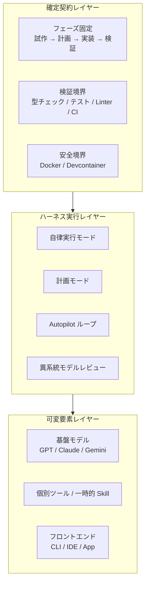

コーディングエージェントの話題は、毎週のように新しいツール・MCP サーバー・カスタム Skill・プロンプト技法へ移ります。追いかけるほど手元の開発プロセスは複雑になり、何が効いているのか説明できなくなります。

GitHub Blog に 2026 年 7 月 27 日付で公開された Burke Holland 氏の記事 *"The harness is all you need (mostly)"* は、この状況に対して「ハーネス（agent harness）が標準で提供する機能だけでほぼ足りる」という立場を取ります。

本記事では、その主張を **「工程と検証条件を固定契約として設計し、ツールとモデルは可変扱いにする」** という設計判断へ読み替えて整理します。読み終えると、次の 3 つが手に入ります。

- ハーネス中心の 8 ステップ開発ワークフローの全体像
- 「固定すべき契約」と「可変にすべき判断」の切り分け基準
- YOLO モード運用に伴うリスクと、その前提条件

## エージェントハーネスとは何を指すか

ここでいうハーネスは、LLM そのものではなく、**LLM をコード変更の実務に接続する実行機構**を指します。GitHub Copilot CLI / VS Code の Copilot / Copilot App などが、同じハーネスの異なるフロントエンドにあたります。

ハーネスが標準で持つ機能はおおむね次の 4 つです。

| 機能 | 役割 |
|---|---|
| 対話 | 要件の言語化と、実装前のすり合わせ |
| 計画モード（`/plan` 等） | エッジケースの洗い出しとタスク分解 |
| 自律実行（Autopilot / YOLO） | 承認を挟まずタスクを完遂まで回す |
| 異系統レビュー | 別モデルに成果物を検証させる |

記事の主張は、この 4 つで大半の作業は成立し、追加の Skill やプロンプト技法は限界効用が小さい、というものです。

## 3 レイヤーで捉える

ツールの入れ替わりに振り回されないために、開発工程を 3 つのレイヤーに分けて考えます。

- **確定契約レイヤー**: 人間と組織が決める規範。工程の順序、合格基準となる機械的テスト、実行を閉じ込める安全境界。
- **ハーネス実行レイヤー**: 契約を実際に回すオーケストレーション機構。
- **可変要素レイヤー**: 技術進化に応じて差し替えてよい流動的な要素。

判断のポイントは、**投資先を上のレイヤーへ寄せる**ことです。可変要素レイヤーへの投資は、モデルが世代交代すると回収前に価値を失います。

## 試作からレビューまでの 8 ステップ

Burke Holland 氏が提示するワークフローは、次の 8 ステップです。左列が原記事のステップ名、右列が発注側・経営側から見た要点です。

| # | ステップ | 内容 | 発注側から見た要点 |
|---|---|---|---|
| 1 | Pick a tool, any tool | CLI / IDE / App から 1 つ選ぶ | どれも同じハーネス。標準化の初期は挙動が直接的な CLI が扱いやすい |
| 2 | Turn on YOLO mode | コマンド承認を自動化し自律性を解放 | **サンドボックス併用が前提**。単体で有効化してはいけない |
| 3 | Start with a prototype | 実装前に HTML モックや Mermaid 図を大量に出させる | 人間の視覚処理で仕様漏れを早期に潰す |
| 4 | Plan methodically | 計画モードで例外・境界条件を対話的に抽出 | ドメイン知識を注入する最重要工程。手戻りがここで決まる |
| 5 | Implement with Autopilot | 確定した計画をループで完遂させる | 探索と実装でモデルを使い分け、コストと精度を両立 |
| 6 | Human review and iteration | 品質基準・テイストを人間が適用 | AI の「まあ動く」水準を組織基準まで引き上げる |
| 7 | Rubber duck the result | 別系統のモデルに相互レビューさせる | 単一モデルの確証バイアスを外部から崩す |
| 8 | Profit | コミットし、次の機能では新規セッションを開く | コンテキスト汚染とトークン浪費を断ち切る |

### ステップ 3 と 4 が効く理由

このワークフローで実務上の差が出るのは、実装前の 2 ステップです。

**ステップ 3（試作）** は、テキストの要件定義では発見できない齟齬を、見た目で発見させる工程です。20 パターン程度のモックを並べて出させ、「これは違う」を先に言語化します。実装後に同じ指摘をすると、手戻りのコストは桁で変わります。

**ステップ 4（計画）** では、エージェントに質問させる方向に会話をひっくり返します。人間が仕様を語るのではなく、エージェントが境界条件・例外系を問い、人間が答える形です。ここで暗黙のドメインルールが計画へ書き出されるため、ステップ 5 の自律実行が空回りしにくくなります。

### ステップ 7 を省略しない

異系統モデルによるレビューは、同じモデルに自己レビューさせても代替できません。同一モデルは自分の生成物を妥当と判断しやすく、見落としの傾向も揃うためです。GPT 系で実装したら Claude 系に読ませる、というように**系統をまたぐ**ことに意味があります。

## 固定すべき契約と、可変にすべき判断

導入時に組織が陥りやすい失敗は、可変要素（個別ツール・プロンプト技法）の比較検討に工数を使い、固定契約（工程・検証条件）を決めないまま走り出すことです。切り分けの目安を示します。

### 固定すべき契約

| 契約 | 具体化の例 |
|---|---|
| 工程のフェーズ定義 | 「いきなり実装させない。試作 → 計画 → Autopilot の順を守る」 |
| 決定論的な検証境界 | エージェントの「完了しました」を信用せず、Linter・型チェック・自動テストの通過をもって完了とする |
| 実行境界の安全策 | 自律実行は破棄可能なコンテナ／サンドボックス内に限定する |

3 つに共通するのは、**モデルが変わっても書き換える必要がない**点です。だからこそ恒久ルールとして文書化する価値があります。

### 可変にすべき判断

| 判断 | 扱い方 |
|---|---|
| 基盤モデルの選定 | コストとキャッシュ効率で随時切り替える。標準手順に固有名を書き込まない |
| 個別ツール・Skill の採否 | 試行の対象に留め、標準プロセスへ組み込まない |
| 開発インターフェース | CLI / IDE / App はエンジニアの好みに任せる |

判断基準は「入れ替えたときに、工程の合否基準が変わるか」です。変わらないなら可変扱いで構いません。

## リスクと、適用前に確認すること

原記事の主張をそのまま現場へ持ち込む前に、次の 3 点を確認してください。

### 1. YOLO モードのセキュリティリスク

コマンド承認を外すということは、エージェントが読んだ内容に従って任意のコマンドを実行しうる状態を許すことです。プロンプトインジェクションや悪意ある依存パッケージを経由して、環境変数の API キーや認証情報が外部へ送られる経路が生まれます。

前提条件として、次を満たす環境でのみ有効化します。

- 機密情報を含まないクリーンなコンテナ内で実行する
- マウントする範囲と付与するクレデンシャルを最小化する
- 壊れても破棄して作り直せる状態を保つ

GitHub の Copilot CLI ドキュメントにもツール許可とサンドボックスの項目があり、許可範囲の設計は運用側の責務として明示されています。

### 2. 「承認疲れ」が「検証の形骸化」へずれる

承認クリックの手間を減らした結果、最終成果物のレビューで「テストが通っているから」と精読せずマージする、という別の省略が起きえます。**削ったのは承認作業であって、レビューではありません。**

対策は、ステップ 6（人間レビュー）とステップ 7（異系統レビュー）をチェックリスト化し、実施の有無を可視化することです。工程が省略されたかどうかが後から分かる形にしておきます。

### 3. ドメイン固有ルールはハーネス標準では守られない

企業固有のアーキテクチャ規約や社内標準ライブラリの利用ルールは、ハーネスの標準機能だけでは遵守されません。最低限の共通ルールは `.github/copilot-instructions.md` のような標準ファイルへ明記し、ハーネスに読み込ませる必要があります。

なお、この 3 点目は原記事の「ほぼ（mostly）足りる」という留保に対応します。**ハーネスで足りないのは、組織固有の知識を注入する部分**だと理解すると整理しやすくなります。

## 導入を検討するときの推奨

判断支援の観点から、次の順序を推奨します。

1. **投資先を、ツール選定から工程設計へ移す**
   「どの最新ツールを入れるか」の議論を打ち切り、「試作 → 計画 → 自律実装 → 異系統レビュー」をチームの標準手順として文書化します。

2. **サンドボックスをリポジトリに同梱する**
   全員が即座に起動できる Devcontainer / Docker 環境をリポジトリへ置きます。安全境界が個人の設定に依存している間は、自律実行を標準手順にできません。

3. **完了判定を決定論的テストに委ねる**
   Autopilot の完了条件を、CI・Linter・型チェックの通過として契約に組み込みます。自然言語の「できました」を完了条件にしないことが、この工程設計の要です。

## まとめ

- ハーネスは LLM ではなく、LLM をコード変更に接続する実行機構を指す。対話・計画・自律実行・異系統レビューの 4 機能でおおむね足りる。
- 開発工程は、確定契約 / ハーネス実行 / 可変要素の 3 レイヤーに分けて捉える。投資は上のレイヤーへ寄せる。
- 8 ステップのうち差が出るのは実装前の試作と計画。ここでの手戻り削減が全体効率を決める。
- 固定すべきは工程順序・決定論的な検証境界・安全境界。可変でよいのはモデル・個別ツール・インターフェース。
- YOLO モードはサンドボックスとセットで初めて成立する。承認省略をレビュー省略へ拡大しない。
- 組織固有のルールだけはハーネス標準の外側にあり、instructions ファイル等で明示的に注入する。

## 参考リンク

- Burke Holland, "The harness is all you need (mostly)", The GitHub Blog, 2026-07-27
  https://github.blog/ai-and-ml/github-copilot/the-harness-is-all-you-need-mostly/
- GitHub Docs: Allowing tools（Copilot CLI）
  https://docs.github.com/copilot/how-tos/copilot-cli/use-copilot-cli/allowing-tools
