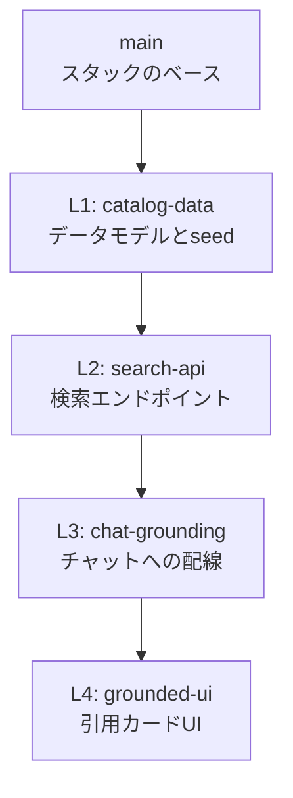
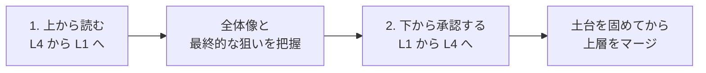
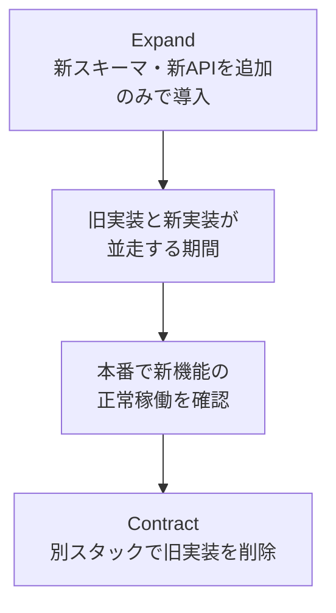

コーディングエージェントを本格導入したチームで、次のような詰まりが起きていないでしょうか。

- エージェントは半日で機能を書き切るのに、レビューが1週間止まる
- 1,000行超のPRが「あとで見ます」のまま滞留する
- レビューを通したはずなのに、統合したら設計が破綻していた

GitHubは2026年8月4日のエンジニアリングブログで、この詰まりに対する構造的な処方箋として **Stacked Pull Requests** を提示しました。1つの巨大な差分を、依存順に並んだ小さなPRの連鎖へ分割する手法です。

この記事では、その設計思想とレイヤー分割の考え方を整理したうえで、**元記事が触れていない副作用**（PRの氾濫・CIコスト・ロールバック不能）と、導入前に決めておくべき運用ルールまで踏み込みます。読み終えたときに「自分のチームで導入すべきか、するなら何を先に決めるか」を判断できる状態を目指します。

対象読者は、AIエージェントを使う開発チームのリード、および開発を発注・管理する立場の方です。


*この記事の全体像。以下、順に解説します。*

## なぜ巨大PRがボトルネックになるのか

問題の本質は「AIが速すぎること」ではなく、**生成速度と理解速度の非対称性**にあります。

| 工程 | エージェント導入前 | 導入後 |
|---|---|---|
| 実装 | 数日 | 数時間 |
| レビュー | 数時間 | 数時間〜数日（変わらない、むしろ増える） |

実装だけが加速すると、差分はレビュアの認知容量を超えます。GitHubの記事では、エージェントが既定で出力する差分規模として1,000〜1,700行超の単一PRが例に挙げられています。この規模になると、レビューは次のように劣化します。

- **着手されない**: 開くだけで負荷が高く、後回しにされ続ける
- **文脈が失われる**: データモデルの変更とUIの微調整が同じ差分に同居し、どこを見ればいいか分からない
- **検査が形骸化する**: 全体を追えないまま「動いているようなので承認」になる

つまりボトルネックは人間側の**レビュー可能性（reviewability）**であり、そこを設計対象にしないと生成速度の向上は成果に変換されません。

## Stacked Pull Requestsの構造

Stacked PRsは、1つの機能を関心事ごとに分離し、下層ブランチをベースに上層ブランチを積み上げる形でPRを連鎖させます。

GitHubの記事では、検索機能付きAIチャットを例に4層へ分解しています。



各ブランチは「1つ下の層をベースブランチとするPR」として提出されます。差分は各層200〜400行程度に収まり、レビュアは一度に1層だけを見ればよくなります。

### レイヤーの切り方とレビュアの割り当て

分割の効用は行数の削減だけではありません。**層ごとに検証すべき観点とレビュー適任者が変わる**点が実務上は大きいところです。

| 層 | 担当領域 | ベースブランチ | 主な検証観点 | 適したレビュア |
|---|---|---|---|---|
| L1 Data | データモデル、型定義、seed、リポジトリ層 | `main` | スキーマ整合性、バリデーション、データ安全性 | データオーナー、DB管理者 |
| L2 API | エンドポイント、リクエスト検証 | L1 | レスポンス契約、エラーハンドリング、認可 | バックエンドリード |
| L3 Wiring | AIチャット呼び出し、コンテキスト供給 | L2 | 連携仕様、状態管理、異常系フォールバック | アーキテクト |
| L4 UI | 引用カード、表示コンポーネント | L3 | 表示崩れ、空状態とローディング、アクセシビリティ | デザイナー、フロントエンド |

巨大PRでは「全員が全コードを読む」しかありませんが、スタックでは各自が自分の専門領域だけを深く見られます。レビュー総時間は減らないかもしれませんが、**1人あたりの認知負荷と待ち時間**は明確に下がります。

### 読む向きと承認する向きは逆になる

Stacked PRsで特徴的なのが、レビューの進め方です。



- **読むのはトップダウン**: 最上層（UI）から見ると「この機能は最終的に何を実現するのか」が最短で分かる
- **承認とマージはボトムアップ**: 土台であるデータモデルから確定させないと、上層のレビューが空振りになる

この二方向の使い分けを共有しないと、レビュアは「どのPRから開けばいいのか」で迷います。導入時に最初に説明すべきルールです。

## エージェントに分割を任せる

人間が後からブランチを切り直すのは非現実的です。GitHubのアプローチは、**分割の規約そのものをエージェントに渡す**というものです。

記事では、GitHub CLIの拡張とエージェント向けskillの導入が案内されています。

```bash
# GitHub CLI 拡張の導入
gh extension install github/gh-stack

# エージェントにスタック運用の規約を読み込ませる
gh skill install github/gh-stack
```

導入後、エージェントは実装ループの中で `gh stack` 系のコマンドを使い、スタックの構築からPR群の提出までを完結させます。記事で紹介されている代表的な操作は次のとおりです。

| 操作 | 役割 |
|---|---|
| スタックの初期化・層の追加 | 分割対象の層を宣言し、ベースブランチを連鎖させる |
| スタックの提出 | 連鎖する全ブランチをPR群としてまとめて作成する |
| スタックの同期 | 下層への修正を上層ブランチへ一括でリベース・追従させる |

:::message
`gh-stack` 拡張とskillは、この記事の公開時点（2026年8月）のGitHubブログの記載に基づきます。サブコマンド名やskillの提供形態は変わりうるため、導入時は `gh stack --help` と拡張のREADMEで現行仕様を確認してください。
:::

### 指示に落とすなら

「巨大PRを出すな」だけでは、エージェントは行数で機械的に切ります。それは後述するようにアンチパターンです。指示は**分割の基準**まで書き切る必要があります。

```text
1. 実装に着手する前に、依存順のスタック構造(L1 データ / L2 API / L3 配線 / L4 UI)を先に定義すること。
2. 各層は単体でビルドとテストがグリーンになる状態で完結させること。
3. 既存スキーマ・既存APIを壊さず、追加のみで済むExpand-Contractの形に分割すること。
4. 層をまたぐ修正が必要になった場合は、実装を続けずスタック構造の再定義から見直すこと。
```

## 分割基準は行数ではなく「戻せるか」で決める

ここからが、導入判断で最も重要な部分です。

### ロールバックできないスタックが生まれる

「200行ごとに切る」という形式的な分割は機能しません。純粋な層状依存では、次の状況が起こりうるからです。

- L1（DBスキーマ）→ L2（API）→ L3（UI）の順にマージ済み
- 本番でL3のUIに障害が出た
- L1だけを `git revert` したいが、L2とL3がそのスキーマに依存しているため戻せない

つまり**マージ順は下から、切り戻し順は上から**でなければならず、下層ほど「戻せない前提」で設計する必要があります。

### Expand-Contractで戻せる状態を保つ

この制約に応える実務的な型が、Expand-Contract（拡張してから縮退する）パターンです。



適用する際の判断基準は3点です。

1. **破壊的変更を下層に置かない**: L1では既存スキーマを変更せず、新しいカラムやテーブルを追加するに留める。旧実装は動き続ける
2. **各層が単独で検証可能**: その層だけをマージした状態でビルドとテストが通る。「上の層が来れば動く」中途半端なコードはマージしない
3. **削除は別スタックに切り出す**: 新機能の本番稼働を確認したあとで、旧実装を消すPRを改めて出す

この形にしておくと、L3で障害が出てもL3の切り戻しだけで旧経路に戻せます。**Expand-Contractを守らないStacked PRsは、レビューは楽になるが本番リスクは上がる**という取り違えになりかねません。

## 導入前に見積もっておく副作用

Stacked PRsは万能ではありません。導入によって問題が消えるのではなく、**ボトルネックの位置が移動する**と考えるのが実態に近いところです。

### 1. PRの巨大化からPRの氾濫へ

1,700行のPR1つを5つに割っても、レビューすべきコードの総量は変わりません。代わりに次が起きます。

- 通知の激増によるレビュー疲れ
- 下層PRの承認遅延が、上層すべてをブロックする待ち行列

対策は、レビューSLAを**スタック単位ではなく層単位**で定めることです。特にL1は全体を止める位置にあるため、優先度を明示的に上げる運用が要ります。

### 2. 文脈の断片化

各層を単体で見ると、システム全体への影響範囲が見えません。層ごとには全部「問題なし」で通ったのに、統合すると設計上の欠陥が露出する、という失敗が起こります。

対策は、スタックの先頭PRに**全体の設計意図と影響範囲を書いた説明を必ず置く**ことです。トップダウンで読ませる運用は、この断片化を抑えるための仕組みでもあります。

### 3. CIコストの線形増加

下層に修正が入ると、上層すべてでリベースとpushが発生します。pushのたびにワークフローが起動するため、**1回のレビュー指摘がCI実行回数を層の数だけ増やす**構造です。

対策の方向は2つあります。

- 重いジョブ（E2E、ビルド成果物の生成）は最下層とマージ時のみに絞る
- 上層では型チェックと単体テストなど軽量なジョブに限定する

導入前に、スタック1本あたりのCI分数を概算しておくことをおすすめします。層が増えるほど効いてきます。

### 4. Web UIでの一括リベースと署名

GitHubブログでは、Web UI上でスタックをリベースする操作について、リベースの実行者がコミッターとして記録される旨が説明されています。コミット署名を必須にしているリポジトリでは、この扱いが問題になりえます。

署名必須の運用をしている場合は、Web UIからの一括リベースではなくCLI経由の同期を標準手順に定め、実際に自分のリポジトリの保護ルールで挙動を確認してから展開してください。

## 導入判断のチェックリスト

ここまでを踏まえると、Stacked PRsが効くチームとそうでないチームが分かれます。

| 確認項目 | 導入に向く | 見送り・保留 |
|---|---|---|
| PR規模 | エージェント由来の1,000行超が常態化 | 数百行に収まっている |
| レビュア | 層ごとに専門が分かれている | 少人数で全員が全体を見ている |
| リリース設計 | 後方互換の追加変更を設計できる | 破壊的変更を一括で入れる運用 |
| CI予算 | 実行回数の増加を許容できる | 実行時間が既に逼迫している |
| レビュー運用 | 層単位のSLAを決められる | レビュー着手がすでに属人的 |

導入するなら、着手前に決めるべきものは次の3つです。

1. 層の定義（自分たちの構成でL1〜L4に相当するものは何か）
2. Expand-Contractの適用範囲（どこまでを「追加のみ」で通すか）
3. CIジョブの層別配分

## まとめ

- AIエージェント導入の詰まりは実装速度ではなく、**レビュー可能性**に現れる
- Stacked PRsは、機能を依存順の層に割り、各層200〜400行規模のPRの連鎖として提出する設計手法
- 読むのはトップダウン、承認とマージはボトムアップという二方向の使い分けが前提になる
- 分割は行数ではなく、**独立検証可能性とロールバック可能性**から逆算する。Expand-Contractがその実務的な型
- 導入するとボトルネックはPRの氾濫・文脈の断片化・CIコストへ移動する。層単位のSLAとCIジョブ配分を先に決めておく

エージェントの生成速度に人間の理解速度を追従させる、という観点で見ると、Stacked PRsは「AIを速くする道具」ではなく「人間のレビューを守るための構造」です。導入の可否は、その構造を運用し切れるかどうかで判断するのが妥当だと考えます。

この記事が少しでも参考になった、あるいは改善点などがあれば、ぜひリアクションやコメント、SNSでのシェアをいただけると励みになります！

## 参考リンク

- [Turn one giant AI-generated pull request to a reviewable stack - The GitHub Blog (2026-08-04)](https://github.blog/engineering/turn-one-giant-ai-generated-pull-request-to-a-reviewable-stack/)
- GitHub CLI 拡張 `github/gh-stack`（導入手順と現行のサブコマンドは上記ブログおよび `gh stack --help` を参照）
