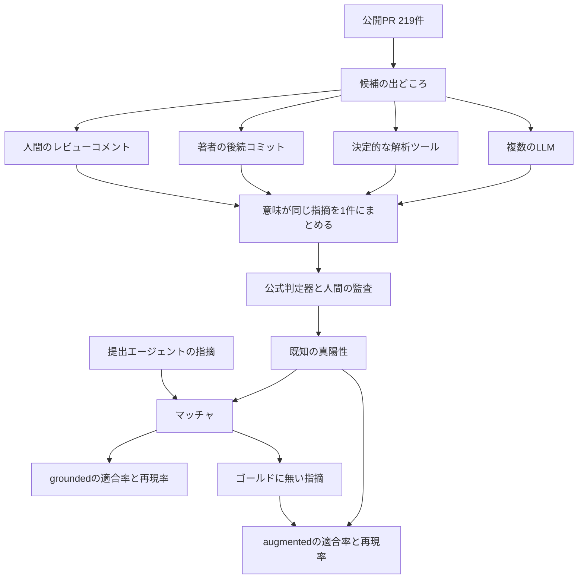

GitHub は 2026-10-05 に、AI のコードレビューを公開 pull request の上で比べる ReviewBench を研究プレビューとして公開しました。この記事では、何を何件で測っているか、適合率と再現率がどの欄に分かれるか、公開リーダーボードを同時比較として読むときの条件、人間のレビューを工程のどこに残すかの材料を順に確認します。数値は 2026-10-06 時点の公開資料とリーダーボード API に基づきます。

*この記事の全体像。以下、順に解説します。*

## ReviewBenchとは

ReviewBench は、AI のコードレビューエージェントを公開 pull request の上で比べるオフラインの評価セットです。219 件の公開 PR と、真偽を付けた指摘の集合を使い、適合率と再現率を同じ型で出します。提出者はコンテナイメージと自分のモデル鍵を持ち込み、最終ラウンドの判定器は主催側が用意します。公開サイトは [review-bench.ai](https://review-bench.ai/) で、実装は [review-bench/ReviewBench](https://github.com/review-bench/ReviewBench) です。ライセンスは MIT です。リポジトリの star は 2026-10-06 時点で約 7 です。

### データの範囲

分布の観察に使った母集団は、1 億 390 万件の GitHub pull request です。評価そのものの件数は 219 PR、187 の公開 OSS リポジトリ、19 言語です。言語とリポジトリサイズは GitHub 全体に寄せ、変更の大きさだけはレビューしやすい中間と裾に重みを置きます。テストに使うのは 219 件のうち 25 PR です。最終評価は 219 PR を 3 ラウンド回し、その算術平均をリーダーボードの点にします。

公開は、メンテナ承認のあと、そのエージェントの自己ベストを更新したとき、または初登録のときに限ります。

### 指摘の作り方

指摘の候補は、次の四つから作ります。

- 人間のレビュー
- 著者の後続コミットから推定した指摘
- 決定的な解析ツール
- 複数のフロンティア LLM

意味が同じ指摘は 1 件にまとめ、出どころの数では件数を増やしません。真陽性の条件は、正しく、関係があり、自明でないことです。

### 六つの指標

公式の指標は六つです。既知の真陽性だけを見るのが grounded precision、grounded recall、grounded F1 です。ゴールドに無い指摘も同じ判定器で採点するのが augmented precision、augmented recall、augmented F1 です。

横断比較の見出しは grounded recall です。Fβ の β で、適合率寄りと再現率寄りを切り替えられます。所要時間はスコアに畳み込みません。

マッチャが既知の真陽性と結べた指摘だけが、grounded の分子に入ります。結べなかった指摘は、同じ判定器が真偽を付けたあと augmented の側に入ります。

### 指摘が点数になるまでの流れ

評価対象の流れは、公開 PR から候補を集め、重複を除いて真陽性の集合を作り、提出エージェントの指摘と突き合わせる、という一本道です。

### 提出するときの実行条件

提出契約は、リポジトリの `docs/AGENT_CONTRACT.md`（commit `ceb0794`、2026-10-05）が書いています。

出力 JSON は、`pr.repo`、`pr.pr_number`、`pr.base`、`pr.head`、`agent`、`findings[]` を持ちます。各 finding は file、start_line、end_line、message、producer を持ちます。指摘が空で終了コード 0 のときは、何も見つからなかった結果として受理されます。非ゼロ終了、ファイル欠落、壊れた JSON、head または PR 番号の不一致は、retry のあと run 全体を失敗させます。retry の回数は契約に書いてありません。

実行環境は linux/amd64、既定 15 分/PR、egress は manifest のホストの port 443 だけ、GPU なし、GitHub-hosted runner です。コンテナ内に GitHub API トークンはありません。非公開の GHCR イメージを引くには、classic personal access token の `read:packages` が要ります。fine-grained token ではパッケージを読めないと ONBOARDING が書いています。

## 注意点

公開資料の定義と一致しない読み方と、2026-10-06 時点で確認できていない項目をここにまとめます。

### 適合率の高さは検出力と一致しない

総合点や grounded precision の高さは、既知の欠陥のほとんどを見つけたことと一致しません。2026-10-06 に取得した公開 API では、1 位の Copilot Code Review Balanced（snapshot 2026-10-01、3 ラウンド）の grounded precision は約 87.8%、grounded recall は約 26.0% です。下位の Codex GPT-5.6 Terra Low（snapshot 2026-07-19）も grounded precision は約 88.5% で、grounded recall は約 5.7% です。

grounded precision の分母は、ゴールドと結べた指摘だけです。結べなかった誤指摘は、この分母に入りません。誤指摘の処理負荷を見る欄は、augmented precision、新規の偽陽性、候補の件数の側にあります。

### 一致率は真偽の二値である

96.6% は、TP/FP の二値について、データセット構築に参加していないシニアの付け直しと ReviewBench のラベルが一致した割合です。手法書は、不一致を全件手で監査し、人間側のラベルが誤っていた例もあると書いています。深刻度の完全一致は 62.9% で、1 段階以内は 98.7% です。人間の方が重い側に振る回数は、軽い側に振る回数の約 9 倍です。カテゴリの完全一致は 79.7% で、境目は正しさと信頼性に寄ります。

### ブログと手法で深刻度の語が違う

ブログの一覧は深刻度を Critical / Medium / Low と書きます。手法と公開 JSON のラベルは high / medium / low です。

ゴールデン 219 ファイルの集計では、指摘 4632 件のうち真陽性 2623、偽陽性 2009 です。真陽性のうち high は 181 件（約 6.9%）で、high の真陽性が 1 件も無い PR は 156/219 です。high の security は 12 件です。重大な見逃しの率は、分母が小さい切片の上にあります。

### 残った真陽性ラベルの出どころ

重複排除のあと残った真陽性のラベルは、`llm_review:claude-sonnet-4.6` が 1206、`ccr:gpt-5.5` medium が 957、`ccr:claude-opus-4.7` medium が 228 です。合計 2391 件で、真陽性の約 91% にあたります。`human_review` は 39 件（約 1.5%）です。これは残ったラベルの件数であり、その producer だけが発見した割合ではありません。どちらを残すかの規則は未確認です。

初期分類器は Claude Sonnet 4.6、公式判定器は Claude Sonnet 5 です。同一モデルの自己採点とは手法書に書いていません。リーダーボードの Balanced 行が、この `ccr:` の生成設定と同じだとも書いていません。

### 本番との増減は 1 例で、本文とチャートが揃わない

本番との増減は、GitHub ブログが書く lite-tier の ensemble と、本番の単一レビュアー制御の 1 例です。本文の相対変化は、対応率 +8.0%、recall +13.6%、コメント量 +61%、レビュー単価 -8.0% です。同じページのチャート `gh-chart-reviewbench-online-impact` の online 列は、Precision 8、Recall 13.58、Comment volume 25、Cost/review -8 です。offline 列は 4.45、12.88、40、-23.7 です。コメント量の本文 +61% は、チャートの 25 とも 40 とも一致しません。

深刻度チャートの Critical は offline 227.4、online 262 で、本文の +227% 対 +262% と対応します。Moderate は 121 と 18、Nit は -15.69 と -45 で、本文は方向だけを書いています。対応率は、LLM が「そのコメントが対応するコード変更を促した」と判断した割合であり、人間が受理した割合ではありません。オンライン recall の計算式は未確認です。

### 行の日付と集計単位は揃っていない

公開 API の 28 行は、profile `official-2026-07` が 23 行、`official-2026-09` が 5 行です。snapshot は 2026-06-16 から 2026-10-01 まで分かれます。2 つの profile の中身の差は未確認です。同じ日の同時比較としては読めません。各率の macro（PR 等重）か micro（指摘をプール）かは、payload にフィールドが無く未確認です。

### 深刻度別の点は F1 である

公開 API の `severityF1` は F1 です。Copilot Balanced は High 63、Medium 60、Low 38 です。これを recall と読みません。`categoryRecallBySeverity.High` の Security 61 は、分母が payload にありません。ゴールデン全体の high security 真陽性が 12 件なので、この 61 を安定したセキュリティ検出力とは置きません。

### 同名の別物がある

LangChain の ReviewBench（Nick Hollon、July 31, 2026）は、LangSmith モノレポの 59 タスク、64 baseline issues です。強い実行でも baseline issues の約 30% と、その記事は書いています。GitHub 版の 219 PR や約 26% の grounded recall とは別の数です。`researchbites/reviewbench` は論文査読です。

この ReviewBench を名指しした外部批判は、2026-10-06 の検索では確認できませんでした。NVD の keyword `ReviewBench` と `review-bench` はいずれも totalResults 0 で、リポジトリの security advisory は空配列でした。確認できなかったことは、批判が無いことの証拠ではありません。

### 価格と運用条項は見えていない

公開価格表は未確認です。調整時のモデル推論と、最終以外の判定器は参加者負担で、最終の判定器だけ主催側が負担すると README が書いています。SLA、リージョン条項、Colab の公式ノートは、確認した文書の範囲では見えていません。matcher の精度として併記されている数値も、今回の API 取得では見えていません。

## 指標をどの欄で見るか

見たいものと、使う欄は次のとおりです。

| 見たいもの | 使う欄 | 使わない欄 |
|---|---|---|
| 既知の欠陥をどれだけ拾うか | grounded recall | augmented recall 単独 |
| 結べた指摘がどれだけ妥当か | grounded precision | 未一致の誤指摘を含む処理負荷 |
| ゴールドに無い指摘の妥当さ | augmented precision と novel true positive の件数 | augmented recall を順位の見出しにすること |
| 誤指摘の量 | augmented precision、候補件数、新規の偽陽性 | grounded precision |
| 待ち時間と費用 | `durationMs` と、別途の請求 | Fβ に畳み込まれたコスト |
| 重大な見逃し | high の切片。分母が薄いことを併記する | 総合 F1 |

著者の数値例では、既知の真陽性が 10、そのうち 5 に結べたとき、新規の真陽性が 2 なら augmented recall は 7/12、100 なら 105/110 になります。grounded recall はどちらも 0.5 です。matcher が結べなかった真の一致は、grounded から augmented へ移ります。

## 公開リーダーボードの抜粋

2026-10-06 に [リーダーボード API](https://review-bench.ai/api/leaderboard) を取得した値です。百分率は payload の実数を小数第 1 位で示します。所要時間は成功した試行の壁時計 `review_ms` の平均で、品質点には入りません。順位は公開 API の並びです。

| 順位 | 名前 | snapshot | profile | grounded precision | grounded recall | augmented F1 | ラウンド |
|---|---|---|---|---:|---:|---:|---:|
| 1 | Copilot Code Review Balanced | 2026-10-01 | official-2026-09 | 約 87.8% | 約 26.0% | 約 49.7% | 3 |
| 2 | Devin AI | 2026-09-28 | official-2026-09 | 約 84.0% | 約 23.8% | 約 47.3% | 3 |
| 3 | Qodo | 2026-09-28 | official-2026-09 | 約 85.3% | 約 22.1% | 約 44.5% | 3 |
| 4 | Codex GPT-5.6 Sol Ultra | 2026-07-19 | official-2026-07 | 約 87.0% | 約 19.9% | 約 43.2% | 3 |
| 7 | Copilot Code Review Lite | 2026-07-20 | official-2026-07 | 約 83.8% | 約 17.2% | 約 37.2% | 3 |
| 9 | Cubic | 2026-06-29 | official-2026-07 | 約 85.5% | 約 16.3% | 約 37.4% | 1 |
| 20 | Cursor | 2026-09-27 | official-2026-09 | 約 87.7% | 約 9.6% | 約 21.7% | 3 |
| 28 | Codex GPT-5.6 Terra Low | 2026-07-19 | official-2026-07 | 約 88.5% | 約 5.7% | 約 13.0% | 3 |

Copilot Balanced の追加欄は、augmented precision 約 87.4%、augmented recall 約 34.7%、novel true positive 417、候補 1185、1 PR あたり約 4.7 分（durationMs 約 283364）です。Cubic はラウンド 1 で、標準偏差が null です。ばらつきの比較には使いません。

High と Medium を合わせたカテゴリ recall（Copilot Balanced、分母は payload に無い）は、Correctness 43、Testing 54、Reliability 37、Security 44、Maintainability 23、API design 43 です。

28 行に共通して見える形は、precision が高くても recall が低い、ということです。公開 PR、公開リポジトリ、公開の判定手順で、適合率と再現率を分けて比較できる、という点がこのセットの使い道です。著者は、augmented recall を横断順位に使うなと、上の数値例つきで書いています。ゴールデンの真偽は人間が監査し、TP/FP の一致 96.6% と不一致の手監査を手法書が書いています。

## 自社のPRで新規の発見を残す

公式の置き場所は augmented です。ゴールドと結べなかった指摘を、公式判定器と同じ分類器が真陽性か偽陽性か判定します。真陽性になった件数は novel true positive として残り、augmented precision の分子と、augmented recall の分子・分母の両方に入ります。

自社 PR へ持ち込むときの対応は次のとおりです。

1. 既知の指摘（人間レビュー、後続修正、静的解析、複数モデル）を意味で 1 件にまとめ、真陽性だけを grounded recall の分母にします。
2. エージェントが既知集合と結べなかった指摘は捨てず、別の判定で真偽を付けます。その真陽性を augmented と件数で残します。
3. 順位や採用の見出しは grounded recall に置きます。augmented recall は、そのシステムが新規をどれだけ積んだかの診断に留めます。
4. 判定器が真陽性とした新規指摘は、人間がサンプルで裁定します。公式セットでも、分類器が誤って真陽性とした 47 件を人間が直しています。
5. 自社の文化で「自明」「関係がある」の境界が公式の作業部会と違うなら、その境界をルーブリックに書きます。手法書は、真偽の境界がレビュー文化と作業部会の好みに依存すると書いています。

自社の非公開 PR では、公開 OSS の文化で付けた真偽がどこまで転用できるかは未確認です。

## 人間のレビューを残す場所

ここは解釈です。公開セットがそのまま自社の工程を置き換える根拠にはしません。

残す場所は二つに分かれます。

- 検出力の穴。公開 1 位でも既知の真陽性の約 4 分の 3 は grounded recall の外にあります。high の真陽性は 181 件、そのうち security は 12 件で、156 PR には high の真陽性がありません。重大な見逃しの率だけでエージェントを落とすには、自社側で分母を足す必要があります。足すまでのあいだ、正しさ、信頼性、セキュリティの high は人間の確認を残します。
- 確認負荷の穴。grounded precision が約 88% でも、未一致の指摘は別腹です。判定器が新規の真陽性としたもの、と、候補件数が多い実行の偽陽性は、人間が処理する列に残します。時間と費用は Fβ の外で見ます。Balanced の公開値は 1 PR あたり約 4.7 分で、価格表は未確認です。

次の三つは、公開資料から人間の確認を外す根拠にはなりません。総合 F1 が上だったこと、grounded precision が高いこと、ブログの 1 実験で対応率と recall の符号が揃ったことです。本番の数値は自己申告の 1 例で、コメント量は本文とチャートが一致しません。真陽性の残存ラベルの約 91% は Claude 系と CCR 系なので、人間コメントの再現率としては読めません。行の profile と snapshot は混ざります。

## まとめ

ReviewBench は、219 件の公開 PR の上で、AI コードレビューの適合率と再現率を同じ型で出す研究プレビューです。横断比較の見出しは grounded recall で、2026-10-06 の 1 位でも約 26% です。grounded precision は上位も下位も 80% 台で、結べた指摘の妥当さと、既知欠陥の拾い切りは別の欄です。ゴールドに無い発見は augmented と件数で残し、順位の見出しには使いません。重大度 high の切片は薄く、ブログの本番比較は 1 例で本文とチャートが揃わない箇所があります。価格、macro か micro か、二つの profile の差分は未確認です。

人間の確認を残すなら、正しさ・信頼性・セキュリティの high と、未一致の指摘の処理列です。総合 F1 や grounded precision の高さだけでは、その確認を外す材料になりません。

この記事が少しでも参考になった、あるいは改善点などがあれば、ぜひリアクションやコメント、SNSでのシェアをいただけると励みになります！

## 参考リンク

- [ReviewBench: an open benchmark for AI code review](https://github.blog/ai-and-ml/github-copilot/reviewbench-an-open-benchmark-for-ai-code-review/)（GitHub Blog、2026-10-05）
- [review-bench/ReviewBench](https://github.com/review-bench/ReviewBench)（main `ceb0794`、2026-10-05）
- [METHODOLOGY.md](https://github.com/review-bench/ReviewBench/blob/ceb0794a3768da6ef4a56e5311dfb4afd29e5dee/docs/METHODOLOGY.md)
- [AGENT_CONTRACT.md](https://github.com/review-bench/ReviewBench/blob/ceb0794a3768da6ef4a56e5311dfb4afd29e5dee/docs/AGENT_CONTRACT.md)
- [リーダーボード API](https://review-bench.ai/api/leaderboard)（2026-10-06 取得）
- [review-bench.ai](https://review-bench.ai/)
- [Evaluating code review agents with ReviewBench](https://www.langchain.com/blog/evaluating-code-review-agents-with-reviewbench)（LangChain、July 31, 2026。同名の別ベンチマーク）
