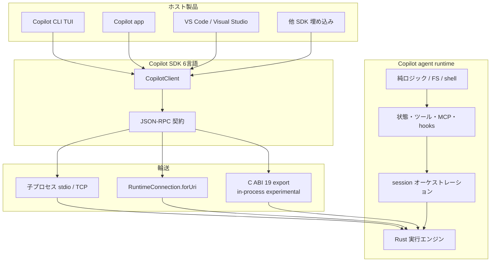
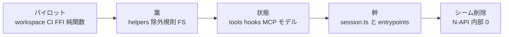

GitHub Distinguished Engineer の Stephen Toub 氏が、2026-09-16 の [GitHub Blog](https://github.blog/ai-and-ml/generative-ai/migrating-the-github-copilot-runtime-to-rust-using-copilot/) で、Copilot agent runtime を TypeScript / Node.js / V8 から Rust へ置き換えた過程を公開しました。出典は GitHub 自身の製品ブログであり、runtime 本体リポジトリ `github/copilot-agent-runtime` は非公開です。

この記事では、共有 runtime が何か、128 件の pull request で main を止めずに置換した型、数値をどこまで信じてよいか、発注側が同じ型を使うなら何を先に置くかを整理します。

*この記事の全体像。以下、順に解説します。*

## Copilot agent runtimeとは

Copilot agent runtime は、GitHub Copilot CLI、GitHub Copilot app、GitHub Copilot SDK の背後にある agent harness です。VS Code / Visual Studio / GitHub Copilot cloud agent（CCA）/ Copilot Code Review / Copilot Cowork / Copilot Studio / Office 系まで共有します。

runtime は当初、CCA 向けに TypeScript で書かれ、CLI の TUI と絡んだまま SDK から JSON-RPC で子プロセス起動されていました。旧構成では、SDK が Copilot CLI を headless 子プロセスとして起動し、JSON-RPC で会話します。

2026-05 初旬に計画し、約 14.5 週のインプレース置換のあと、2026-08-21 に production runtime を 100% Rust と宣言しました。変更は 128 件の pull request として main に入り、その間 main は 135 回リリースしました。

新構成は Rust の native バイナリです。恒久面は C ABI（export 19）と、必要なら stdin/stdout または socket のサーバです。移行はコンポーネント単位の原子置換で、TypeScript 削除と Rust shim を同一 PR に載せます。最初に副作用のない部品でビルド・相互運用・テストを通し、その型を状態管理と実行制御へ広げます。

一時内部 interop は napi-rs です。2026-08-03 ピークで内部 N-API export は 2,019、TypeScript 呼び出しは 3,356 でした。完了時は 0 です。言語移行と振る舞い変更は意図的に分離し、機会的な最適化は後回しにしています。

6 言語 SDK（C# / TypeScript / Python / Rust / Go / Java）が同じ JSON-RPC 契約を共有します。in-process FFI は opt-in です。公式 SDK docs では全言語 experimental です。著者は、エージェント（Copilot app / Copilot CLI）が大半の移植コードを書いたと述べています。

共有 runtime を TUI から切り離し、一時 N-API シームを経て C ABI へ収束させます。SDK は輸送（子プロセス / URI / in-process）を差し替えても、セッション・イベント・ツール・権限の API は同じです。

移植の順序は葉から幹へ進みます。

## 注意点

出典は GitHub 自身の製品ブログです。[The New Stack](https://thenewstack.io/github-copilot-anthropic-rust-migration/)（Paul Sawers、2026-09-17）は、GitHub も Anthropic も「自社エージェントが大規模書き換えを可能にした」と主張する当事者だと注記しています。数値は private repo とセッションログに閉じ、第三者は 128 PR と 832,378 行を独立に数えられません。

| 主張 | 一次の限定 |
|---|---|
| 800,000 行超 / 832,378 行 | production runtime の Rust。TUI・CLI・E2E は TypeScript が残る |
| 128 PR | 件数は一次。末期 4 PR の中央値変更行は 99,445。MCP は 7 PR、tools は 6 部作 |
| 135 リリース | 100 pre-release + 35 stable。7 日 npm サンプルで pre-release はダウンロードの 10.5% |
| 単一開発者が数か月 | 冒頭の要約。本文は「100% 単一開発者ではない」。FFI 5/6 は Steve Sanderson。トークン時間は「自分の PR の約 20% を手振りで 3 週」 |
| エージェントが大半 | 操作定義（行数 / 作者 / トークン）なし。人間の入力は約 2,600。user-role 31,247 の約 1/12 |
| 18.0x | 表の「Client, session, one turn」May 12 の 5.25 s から Aug 21 in-process 292 ms。localhost 決定論サーバ。推論とネットワークを除外。言語変更の単離ではない |
| 同じ段落の「約 55 ms」 | 表の 292 ms と一次記事内で一致しない。別シナリオか未説明の数字。断定しない |
| 既定経路 | 同じ表の out-of-process は 4.0x（1.33 s）。SDK 既定は子プロセス |
| 品質比率がほぼ不変 | bug ラベルまたはタイトル語の分類。CLI は 22.9% から 23.7% で微増。窓は 8 月まで。availability ではないと著者自身が書く |
| 100% Rust（8/21） | production 実装と一時内部 N-API。CLI の runtime 内部直呼びは「作業中」。マクロ構造は TypeScript アルゴリズムの Rust 化 |
| in-process で Node 不要 | 公式 docs は experimental。失敗境界をホストと共有する。JSON-RPC フレームはプロセス内でも残る |

公開 [`github/copilot-cli`](https://github.com/github/copilot-cli) では、8/21 の runtime 宣言後も障害報告が open です。経路は一つではありません。

- [#4686](https://github.com/github/copilot-cli/issues/4686) OPEN（作成 2026-09-01）: 長時間後の Node.js heap OOM。SEA が `NODE_OPTIONS` を無視する、と報告
- [#4891](https://github.com/github/copilot-cli/issues/4891) OPEN（作成 2026-09-17）: Windows の `copilot.exe` が `0xc0000005` で落ち、進行中の turn を失う。JS heap / SEA ではない
- [#4026](https://github.com/github/copilot-cli/issues/4026) OPEN（作成 2026-07-04）: 複数版で native runtime / `runtime.node` の crash が続く、と報告

ユーザー観測の CLI は、production runtime の 100% Rust 宣言と同一物ではありません。native crash が移植由来かは未確定です。

[CVE-2026-45033](https://github.com/advisories/GHSA-9ccr-r5hg-74gf)（GHSA-9ccr-r5hg-74gf、影響 `@github/copilot` <= 1.0.42、修正 1.0.43）は nested bare repo の `core.fsmonitor` による任意コマンド実行です。repo advisory は 2026-05-06、GitHub Advisory Database は 2026-05-11、NVD 掲載は 2026-05-13 です。borrow checker では閉じないクラスです。移植開始と同時期ですが、言語移行の直接成果ではありません。

エージェント同士が他セッションの worktree を無断マージした、と著者は書いています。拒否に強制力がなかった、とも書いています。

## なぜ Node と V8 を外したか

旧 SDK は `client.start()` で CLI を spawn します。各言語ホストが Node/V8 を運び、イベントと仮想 FS がプロセス境界を越え、Node のクラッシュがセッションを落とします。著者はワーキングセットを「最低おおよそ 100 MB」と書いています。

求めた性質は次です。

- TUI を含まないライブラリ
- 低依存・低オーバーヘッド
- in-process 埋め込み
- 6 言語 FFI
- サプライチェーンと correct-by-construction の姿勢

Rust 以外でも要件は満たし得る、と著者は書いています。今回の要件は C ABI・起動・定常オーバーヘッド・予測可能な資源でした。

公式 SDK のルート README は 2026-09-18 時点でも「JSON-RPC → Copilot CLI server mode」を既定図として載せます。in-process 専用ページは `docs.github.com` では 404 です。正本はリポジトリの [`docs/setup/in-process-runtime.md`](https://github.com/github/copilot-sdk/blob/main/docs/setup/in-process-runtime.md) です。埋め込みが必要なら、失敗境界をホストと共有してよいかを先に決めます。公式 in-process は 2026-09-18 時点で experimental のままです。

## 原子置換で main を出荷し続ける

戦略の選択肢は 4 つあり、採用したのは原子置換だけです。

| 選択肢 | 内容 | 採否 |
|---|---|---|
| 1a 世界停止 | main で全面書き換え、他作業停止 | 不採用 |
| 1b 並行ブランチ | 長期ブランチが main に追いつく | 不採用 |
| 2a 原子置換 | 1 スライスを TS から Rust にして旧コード削除 | 採用 |
| 2b A/B | TS と Rust をホットスワップ | 不採用（週数百 PR の二重保守、session の状態所有） |

2a を選んだ理由は、main を常に出荷可能にすること、差分をレビュー可能にすること、既存 E2E を毎 PR で新コードにかけることです。

規模の見積は動きました。early May は runtime を約 130,000 行の TypeScript と見ました。同時進行で TUI から runtime へコードが降り、他開発者の TypeScript が増えました。著者推定で約 430,000 行の production TypeScript が移植を通過しました。期間中の churn は TypeScript が約 +300,000 / -430,000、production Rust が約 +1,200,000 / -365,000 です。

PR の時期（一次表）は次です。

| 期間 | PR 数 | 中央値変更行 |
|---|---|---|
| May 1-15 | 8 | 3,250 |
| May 16-31 | 2 | 9,421 |
| Jun 1-15 | 40 | 5,073 |
| Jun 16-30 | 31 | 8,253 |
| Jul 1-15 | 10 | 9,514 |
| Jul 16-31 | 14 | 28,159 |
| Aug 1-15 | 19 | 13,861 |
| Aug 16-30 | 4 | 99,445 |

有用な単位は「1 ファイル」ではなく波です。純ロジック → 状態所有 → オーケストレーション → fallback 削除 → 一時 interop 除去後の簡素化です。最初の 2 PR で Rust workspace、toolchain、lint、CI、codegen、interop を置きました。そのあと副作用のないヘルパー 3 つでビルド・FFI・テスト・レビューを通しました。続けて content exclusion、shell、session filesystem へ広げ、tools / hooks / モデルクライアント / MCP、最後に session オーケストレーションへ進みました。

E2E は移植中に書き換えません。エージェントが E2E を消した事例があり、以後は明示同意なしの E2E 変更を禁じました。Agent merge が欠落 API に `schema-break-ok` を貼った事例では、人間がマージ前に差し戻しました。教訓は「実装を変える主体に正しさの再定義を任せない」です。

原子置換の副作用として、移植済み TypeScript を消すと、後続の TypeScript 変更が conflict になります。rebase 漏れを機械的に気づけます。

## 一時 N-API と恒久 C ABI

一時層は napi-rs です。Rust から TypeScript への戻りは threadsafe function です。完了後、内部一時 export は 0 です。CLI から runtime 内部への残アクセスはこの 0 に含めません。

恒久層は 19 export（lifecycle 4、session 4、connection 8、embedded host 3）です。背後の dispatch は 364（SDK 向け 340、コールバック 24）です。API 追加は ABI を増やさず dispatch 表を変えます。

in-process でも JSON-RPC を残した理由は、6 SDK の既存クライアントを輸送差し替えで済ませるためです。トレードオフはシリアライズコストが残ることです。推論支配の仕事ではモデル往復の方が大きい、と著者は書いています。

公式の制約（リポ docs、2026-09-18）は次です。

- 全 SDK で experimental。OS / arch ごとに startup・turn・shutdown を試験する
- プロセス広域の env / cwd / ネイティブライブラリ / worker pool を共有する
- 任意 env、working directory、telemetry、実行ファイルパス、CLI 引数は拒否される場合がある
- 1 プロセス 1 runtime バージョン
- `COPILOT_SDK_DEFAULT_CONNECTION=inprocess` は明示 connection が無いときだけ効く

関連 Issue も公開面に残っています。

| Issue | 状態 | 要約 |
|---|---|---|
| [github/copilot-sdk#1934](https://github.com/github/copilot-sdk/issues/1934) | CLOSED duplicate of #2522（2026-09-04） | in-process では env へ落とすオプションが効かない追跡 |
| [github/copilot-sdk#2533](https://github.com/github/copilot-sdk/issues/2533) | OPEN | runtime が ambient process env を読む。複数 client で混線 |
| [github/copilot-sdk#2517](https://github.com/github/copilot-sdk/issues/2517) | OPEN | error handler がホストを 0xC0000005 で落とす |

一時シームのピーク（内部 N-API export 数）は進捗指標であり、残すものではありません。自システムで同じ型を使うなら、シーム数を監視対象にします。

## 正しさの失敗は三家族に寄る

2026-09-14 時点で既知の移植回帰は dozens、すべて修正済みと著者は書いています。一部は stable に乗りました。未発見分もある、と自認しています。

正しさの失敗はほぼ次の 3 家族です。

1. **契約が違う**。TypeScript の単一 number が f64 になり、Go/C# が repo ID を拒否しました。`timeToFirstTokenMs` を i64 にしたら 5446.712845 でセッションが resume 不能になりました。`error || "Unknown error"` が `unwrap_or` になり、空文字が残りました。
2. **状態・所有・寿命**。opaque handle がインスタンスより長生きします。hook 途中 dispose で `tool_use` が孤立します。sandbox 世代カウンタが片側だけ更新されます。
3. **欠落 / 部分適用 / rebase 損失**。SDK コールバックと E2E を同時に消します。組み込みツール検索の enablement・schema・routing を三点とも落とします。

そのほか、ホストの暗黙（TZ、`process.report.getReport()` が Windows で PDB を取る、Windows `CREATE_NO_WINDOW`）、対の片側だけ移植（abort フラグは更新するがループは止まらない）、同期 napi が Node メインスレッドを止める（`/chronicle` が約 1 分）、ライブラリ意味差（当時の Rust MCP SDK `rmcp` が不正 JSON-RPC に応答し、無限ループで起動 hang）、遅いが正しい（260 MB イベントログの deep copy。チャネル flush が追いつかず V8 heap 枯渇）があります。

静的解析では、coded rustc 診断 8,678 件のうち大きい 4 家族が 84% です。内訳は名前解決 37%、欠けたメソッド 22%、型不一致 14%、trait 11% です。ownership / borrow / lifetime は 1.7% です。`cargo check` 4,478 回のうち 87.1% が clean です。既知回帰はすべてコンパイルを通っています。「コンパイルできれば正しい」は成り立たない、と著者自身が書いています。

unsafe は runtime crate で 158 block / 36 ファイルです。内訳は C ABI 32.3%、Windows API 31.0%、POSIX 29.1%、SQLite 4.4%、dlopen 2.5%、process env 0.6% です。既知回帰に unsafe は関与していません。モデル / MCP / agent / prompt 層では使っていません。

検収で見るなら、コンパイル通過ではなく契約・寿命・欠落の 3 家族です。number、空文字、TZ、環境変数のキャプチャ時点、Windows プロセスフラグは暗黙のまま残さない対象です。

## 性能とコストの読み方

測定は C# SDK です。ベースラインは 2026-05-12（TypeScript runtime + Node、stdio）です。比較は 2026-08-21（Rust、out-of-process と in-process）です。localhost 決定論サーバ、固定の小さい応答です。推論とネットワークは含めません。同時期の他変更を含みます。

| シナリオ | May 12 | Aug 21 OOP | Aug 21 in-process |
|---|---|---|---|
| Client, session, one turn | 5.25 s | 1.33 s（4.0x） | 292 ms（18.0x） |
| Resume 32-turn | 5.64 s | 1.52 s（3.7x） | 264 ms（21.4x） |
| Ten concurrent client lifecycles | 12.34 s | 4.18 s（3.0x） | 742 ms（16.6x） |
| 1,000 one-turn session lifecycles | 132.52 s | 22.53 s（5.9x） | 20.93 s（6.3x） |

100 並列 × 10 回の別計測では、TypeScript 7.55 lifecycle/s、Rust OOP 57.45、in-process 120.0 です。同一ワークロードの CPU は pre-port 312 s、Rust 約 110 s です。10 client の private memory 増分ピークは pre-port 1,383 MB、OOP 247 MB、in-process 126 MB です。

トークンは合計約 136.3 billion（cache read 約 130.6B、cache write 約 4.2B、fresh input 約 900M、output 約 600M）です。金額は約 120,000 USD です。prompt-cache hit は 96.22% です。compaction は 5,116 回です。

性能の大きな改善は「V8 子プロセスを外す」経路で出やすい、と読めます。既定の OOP や推論込み仕事では倍率は落ちます。子プロセス除去、in-process、推論込みの 3 つを混ぜないことが、主張を読むときの判断基準です。独立ベンチの再現物は、2026-09-18 時点で未発見です。

公開リポジトリ（`gh repo view`、2026-09-18）では、[`github/copilot-sdk`](https://github.com/github/copilot-sdk) が約 1.05 万 star、[`github/copilot-cli`](https://github.com/github/copilot-cli) が約 1.12 万 star です。どちらも非 archived、push は 2026-09-17 です。

## 短い一括置換が向く条件

Bun（Jarred Sumner、[bun.com/blog/bun-in-rust](https://bun.com/blog/bun-in-rust)）は Zig 約 535,496 行を 11 日で Rust へ機械翻訳し、既存テストを通したと主張します。これは Bun 公式ブログの二次情報であり、GitHub 事例の監査には使いません。The New Stack は「11 日 vs 14.5 週を Claude vs Copilot のベンチにするな」と書いています。元言語、テストの言語非依存性、毎日の出荷義務が違います。

GitHub 方式が不利になり得る逆転条件は次です。

- 言語非依存の厚いテストオラクルがある
- 元が既にシステム言語で、実行モデルの差が小さい
- 一時 FFI シームのコストが本体を上回る
- 短い機能凍結や canary 切替が許される
- 週数百 PR との rebase より、短い並行停止の方が安い

OpenAI Habitat の Python から Rust（[openai.com](https://openai.com/index/scaling-storage-one-billion-users-part-one/)、TNS 経由）は CPU 6x / memory 15x と報告されます。PDF/本文は未確認のため、二次情報とします。

毎日出荷する共有 runtime なら原子置換が候補です。テストが言語非依存で厚く、毎日の出荷義務がなく、一時 FFI が本体より高いなら、短期間の一括置換も候補になります。

## 発注側が先に置く設計

大規模な言語移行でも、副作用のない部品で型を通し、原子置換で main を出荷し続け、言語変更と振る舞い変更を分ければ、共有 runtime を止めずに置換できます。エージェントは行生成を担います。契約・オラクル・マージ判定は人が持ちます。工程の型（パイロット、原子置換、オラクル保護、言語と振る舞いの分離）は、レガシー共有 runtime の移行設計として使えます。到達宣言と倍率はそのまま一般化しません。

発注側が「移行中も出荷する言語置換」を設計するときの 8 項です。

1. **最初の PR は機能ではなく機械**。toolchain、CI、FFI、副作用なし純関数でビルドとテストを通す
2. **言語移行と振る舞い変更を分ける**。最適化とバグ修正はシーム削除後。混ぜると原因が取れない
3. **オラクルをエージェントの外に置く**。E2E の改変、スナップショット更新、互換ラベルは別承認
4. **暗黙を明示する**。number、空文字、TZ、環境変数のキャプチャ時点、Windows プロセスフラグ
5. **寿命を先に設計する**。handle とインスタンス、cancel の対、世代カウンタの両方
6. **一時シームのピークを監視する**。N-API export 数は進捗指標であり、残すものではない
7. **性能主張は経路を分ける**。子プロセス除去、in-process、推論込みの 3 つを混ぜない
8. **並行エージェントには tiebreaker**。隣接ファイルの自律セッションはコーディネータか人間が必要

直近の確認は 3 つです。自システムで「純関数パイロット → 状態 → オーケストレーション」の順序が守れるか。E2E を移植エージェントが触れない仕組みがあるか。埋め込みが必要なら、失敗境界をホストと共有してよいか。

## まとめ

Copilot agent runtime は、CLI / app / SDK / IDE が共有する agent harness です。GitHub は 128 PR の原子置換で TypeScript 実装を Rust へ移し、一時 N-API を 0 にして C ABI 19 export に収束させたと述べています。

数値は当事者ブログの一次であり、private repo のため第三者監査はできません。「100% Rust」「18x」「エージェントが大半」は定義と測定窓を外すと崩れます。公開 CLI の OOM と native crash は、宣言と同一経路ではありません。

持ち帰るのは到達宣言ではなく、パイロット、原子置換、オラクル保護、言語と振る舞いの分離です。エージェントに行を書かせるなら、契約と正しさの再定義は人の側に残します。

この記事が少しでも参考になった、あるいは改善点などがあれば、ぜひリアクションやコメント、SNSでのシェアをいただけると励みになります！

## 参考リンク

1. Stephen Toub, “Migrating the GitHub Copilot runtime to Rust, using Copilot”, GitHub Blog, 2026-09-16. https://github.blog/ai-and-ml/generative-ai/migrating-the-github-copilot-runtime-to-rust-using-copilot/
2. Stephen Toub author page. https://github.blog/author/stephentoub/
3. GitHub Copilot SDK. https://github.com/github/copilot-sdk
4. In-process runtime（リポ docs、experimental）. https://github.com/github/copilot-sdk/blob/main/docs/setup/in-process-runtime.md
5. Copilot SDK docs 入口. https://docs.github.com/en/copilot/how-tos/copilot-sdk
6. GitHub Copilot CLI. https://github.com/github/copilot-cli
7. Paul Sawers, “GitHub and Anthropic used their own agents for major Rust rewrites”, The New Stack, 2026-09-17. https://thenewstack.io/github-copilot-anthropic-rust-migration/
8. Jarred Sumner, Bun in Rust. https://bun.com/blog/bun-in-rust
9. Hacker News thread. https://news.ycombinator.com/item?id=49735238
10. GHSA-9ccr-r5hg-74gf / CVE-2026-45033. https://github.com/advisories/GHSA-9ccr-r5hg-74gf
11. github/copilot-sdk#1934. https://github.com/github/copilot-sdk/issues/1934
12. github/copilot-cli#4026. https://github.com/github/copilot-cli/issues/4026
13. github/copilot-cli#4686. https://github.com/github/copilot-cli/issues/4686
14. github/copilot-cli#4891. https://github.com/github/copilot-cli/issues/4891
