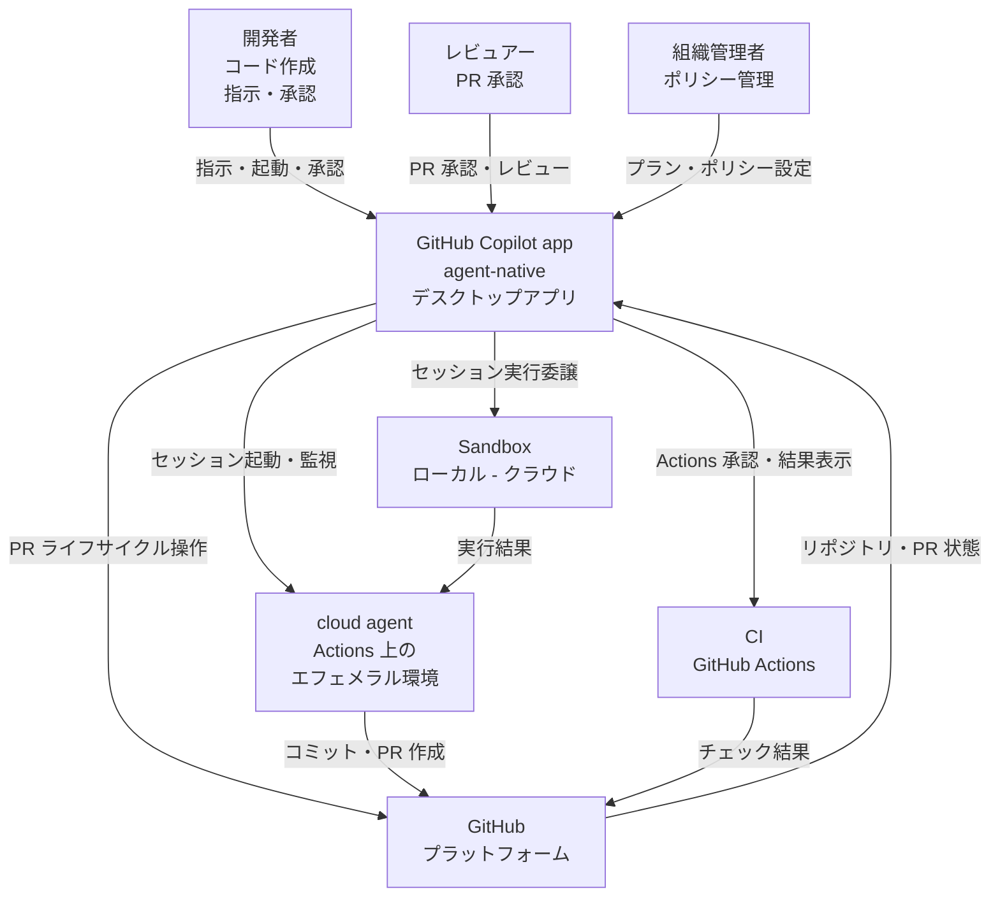
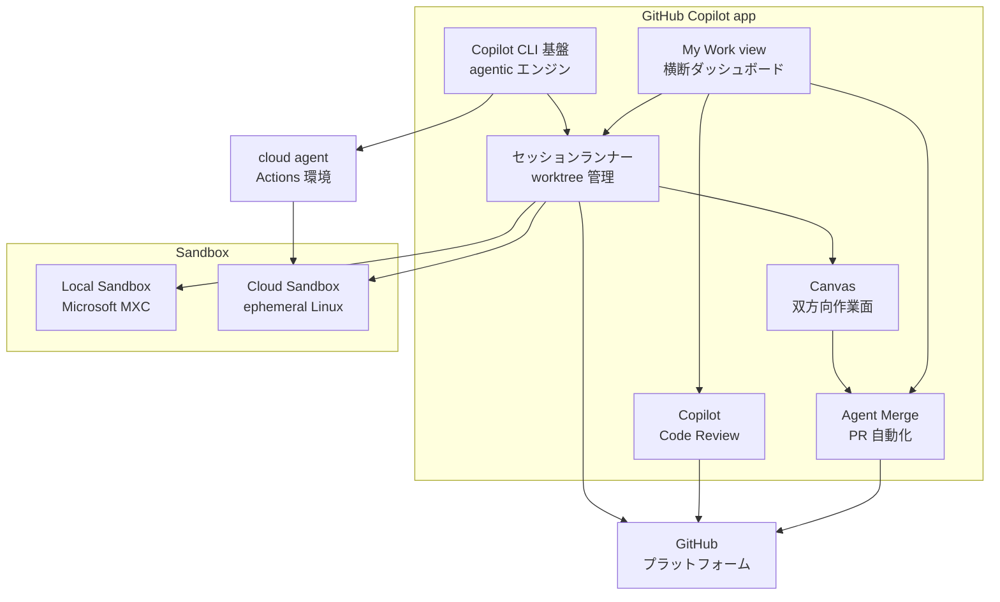
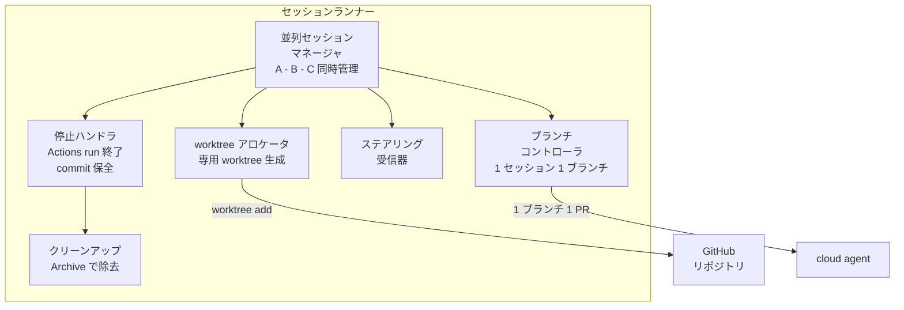
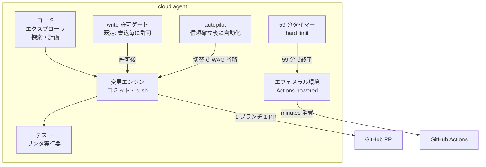
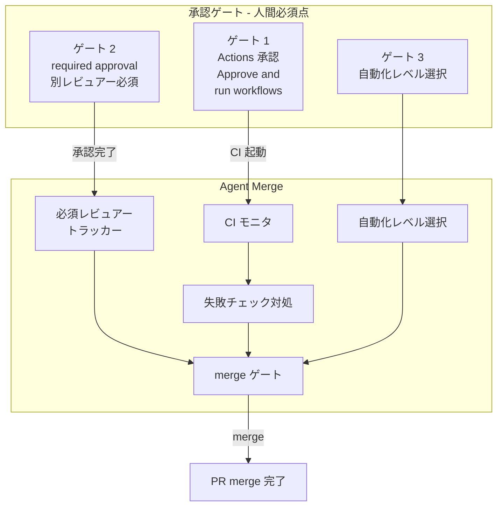
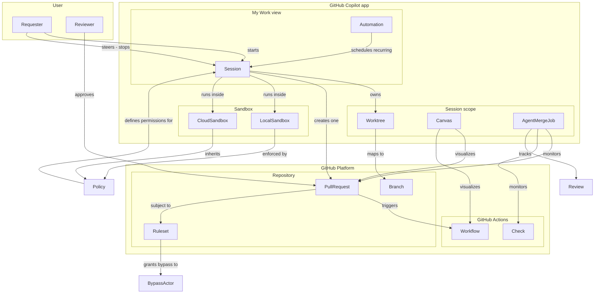
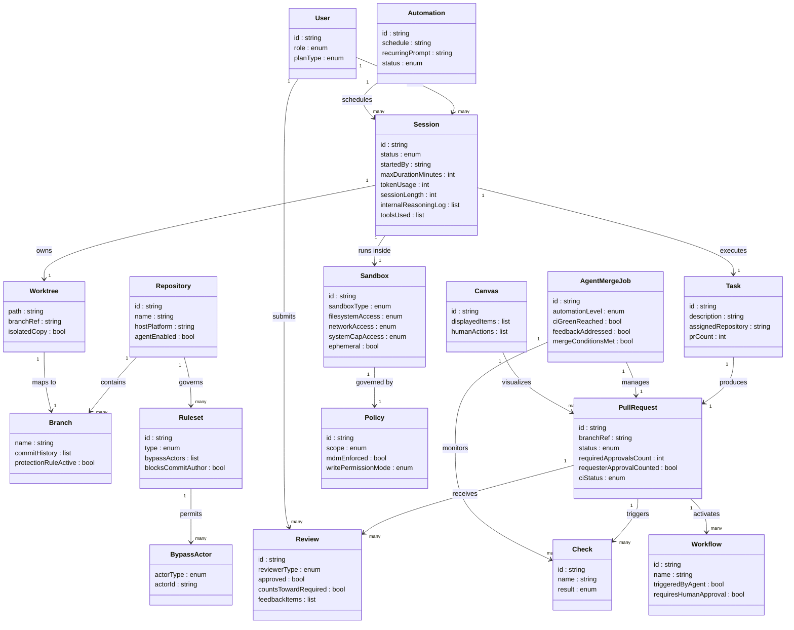

> 検証日: 2026-06-03 / 一次ソース: GitHub Blog（製品発表 2026-06-02）・GitHub Changelog（technical preview 2026-05-14 / sandboxes public preview 2026-06-02）・GitHub Docs（cloud agent / code review / autopilot / sessions）

GitHub は 2026-06-02 に **GitHub Copilot app（the agent-native desktop experience built on GitHub）** を製品発表しました。複数の AI エージェントを並列で指揮するデスクトップアプリです。

この記事は機能カタログではありません。**並列エージェントの本当の設計論点は「並べること」ではなく「どこで人間が止めるか（human-in-the-loop の停止点）」にある**という観点で、Copilot app の構造・承認点・責任境界を一次ソースから読み解きます。並列エージェント運用を設計する実装エンジニアに向けて、承認ゲートの位置・worktree 分離の限界・コストの罠まで扱います。

## 概要

### 製品の定義と目的

GitHub Docs の公式定義は「エージェント駆動開発のためのデスクトップアプリで、**並列ワークストリーム・GitHub 統合・PR ライフサイクル管理を 1 か所にまとめる**」製品です。VS Code 拡張でも CLI でもない、独立したデスクトップアプリとして設計されています。

複数の AI エージェントを並列で動かすと「context scatters across windows（コンテキストがターミナル・IDE・ブラウザタブに散らばる）」状態が生じます。この課題を **My Work** という単一ビューに集約し、接続したリポジトリ横断でアクティブセッション・issue・PR・バックグラウンド自動化を一望させます。

### 「agent-native」の意味

「agent-native」は、複数の AI エージェントを並列で指揮することを前提に設計したシステムを指します。「agents need a real place in the developer workflow（エージェントには開発者ワークフロー上の確かな居場所が必要）」という設計思想に基づき、IDE のサイドパネルに後付けするのではなく、独立アプリとしてエージェント群のオーケストレーションに特化します。

### 既存 Copilot 製品との関係

| 製品 | 位置づけ |
|---|---|
| GitHub Copilot app | GitHub 直結の独立デスクトップアプリ。エージェント並列指揮・PR ライフサイクル管理が主軸 |
| VS Code 拡張 | エディタ内の補完・エージェント操作。app との厳密な差分は一次 docs に明示なし（要確認） |
| Copilot CLI | app の技術基盤。app は CLI 上に構築（"built on GitHub Copilot CLI"） |
| github.com coding agent | Web 側のエージェント。app はデスクトップ集約側という棲み分けが示唆される（要確認） |
| GitHub Copilot SDK | app を支える基盤ランタイム。Node.js/TypeScript・Python・Go・.NET・Rust・Java で利用可能 |

### 提供状態とアクセス条件

- app 本体: technical preview（"subject to change"）、GA 日付は未発表
- sandboxes: public preview（2026-06-02）
- 対応 OS: macOS / Windows / Linux
- 即時利用可能: Copilot Business / Enterprise / Pro / Pro+ ユーザー
- waitlist: Copilot Free ユーザーおよび Copilot 未加入ユーザー

## 特徴

### 主要機能

- **My Work ビュー**: 接続リポジトリ横断でアクティブセッション・issue・PR・バックグラウンド自動化を単一画面に集約する中央ダッシュボード。
- **並列セッション**: 各セッションが専用の git worktree とブランチで隔離実行される。worktree のセットアップ・クリーンアップ・ブランチ操作はアプリが自動処理する。
- **Canvas**: 人間とエージェントの双方向作業面。エージェントが canvas を更新し、開発者は同じ面で edit / reorder / approve / redirect する。
- **Agent Merge**: 単一の PR を対象に、CI 監視・必須レビュアー追跡・失敗チェック対処・全条件充足の待機を自動化し、マージまで運ぶ。
- **Copilot Code Review**: PR をレビューしフィードバックを返す。effort レベルは low / medium。
- **Sandbox（local / cloud）**: エージェントのシェル実行を隔離する 2 系統の実行環境。
- **セッション継続（Memory++ / `/chronicle`）**: デバイスや時間を越えた継続性を提供する。

### Agent Merge の正確な意味（誤読の訂正）

「Agent Merge = 複数エージェントの成果を 1 つに統合するマージ」と誤読されやすいですが、一次ソースにそうは書かれていません。発表記事の原文は "carry **that** pull request through review, checks, and merge"（単数の that pull request）です。cloud agent は「1 セッション = 1 ブランチ」「1 タスク = 正確に 1 PR」という制約で動くため、**Agent Merge は単一 PR をマージまで運ぶ機能として読み取れます**。複数 PR を束ねる統合機能を示す記述は公式に確認できませんでした（要確認）。

### Sandbox の構成

| 種別 | 実行場所 | 技術基盤 | 有効化 | 費用 |
|---|---|---|---|---|
| Local sandbox | 自マシン上 | Microsoft MXC（macOS / Windows / Linux 対応） | `/sandbox enable` | 標準 Copilot シートに含まれる |
| Cloud sandbox | GitHub ホストの ephemeral Linux | — | `copilot --cloud` | 別料金 |

設計意図は「stay in control of what Copilot can touch on your machine」です。autopilot で自動化の自由度を上げつつ、sandbox で触れる範囲をポリシーで縛る二層構造を実現します。

### 競合との比較

| 製品 | 実行方式 | worktree 分離 | PR・CI 統合 | 提供形態（確認日 2026-06-03） |
|---|---|---|---|---|
| GitHub Copilot app | デスクトップ制御盤（GitHub 直結）+ sandbox | 完全自動（設定不要） | 最深。Agent Merge が CI 監視〜マージを自動化 | technical preview / 有料サブスク必須 |
| Claude Code | CLI 中心（+ デスクトップアプリ） | 明示制御（`--worktree`・`.worktreeinclude`） | CI / マージ自動化は git/GitHub 運用に委ねる | BYO サブスク or API |
| Cursor | Agents Window。最大 8 並列 cloud | 完全自動 | 別ブランチ作業→push→PR。Slack / GitHub / Linear 連携 | Pro $20/月〜、usage 制 |
| OpenAI Codex | CLI / IDE / app のマルチサーフェス | 組み込み worktree | cloud 環境で build / test | ChatGPT Plus $20/月〜、トークン課金 |
| Google Antigravity | Agent Manager。同時最大 5 | workspace ベース | Artifact にブラウザ録画 | public preview 無料 |
| Devin | クラウド自律エージェント | クラウド VM 分離 | Devin Review が独立 AI code review | Core $20/月〜、Team $500/月 |
| Conductor | macOS ローカル並列ランナー（BYO ラップ） | GUI で `git worktree add` を自動実行 | diff コメントを GitHub に sync | アプリ無料・BYO |

並列数・価格の一部は変動が激しいため、各製品公式での確認を推奨します（Copilot は 2026-06-01 課金改定、Codex は 2026-04 トークン課金移行、Devin は値下げ済み）。

worktree の自動化度が設計思想を最もよく表します。Copilot / Cursor / Conductor / Codex は「ユーザーに意識させない完全自動」に倒します。一方 Claude Code は `.worktreeinclude`（.env 等 gitignored ファイルの複製）や base branch・PR 番号指定まで握れる明示制御型で、スクリプト / 自動化との相性で優位があります。

## 構造

C4 model 3 段階で図解します。

### システムコンテキスト図



| 要素 | 説明 |
|---|---|
| 開発者 | セッションを起動し、指示・steering・承認を行うメイン操作者 |
| レビュアー | Copilot が作成した PR に required approval として必須承認を行う人間。依頼者本人の承認はカウントされないため別人が担う |
| 組織管理者 | プラン設定、ブランチ保護ルール・bypass actor 追加、sandbox ポリシーの MDM 配布を管理 |
| GitHub Copilot app | 並列ワークストリーム・GitHub 統合・PR ライフサイクル管理を集約する agent-native デスクトップアプリ |
| GitHub プラットフォーム | リポジトリ・PR・Issues・GitHub Actions・branch protection を提供する外部システム |
| cloud agent | GitHub Actions 上のエフェメラル開発環境。1 セッション = 1 ブランチ・1 PR・最大 59 分 hard limit |
| CI（GitHub Actions） | ワークフローを実行しチェック結果を提供。Copilot の変更には自動実行されず、人間の承認クリックが必要 |
| Sandbox | エージェントのシェルコマンドを隔離する環境。ローカル（MXC 基盤）とクラウド（ephemeral Linux）の 2 系統 |

### コンテナ図



| コンテナ | 説明 |
|---|---|
| My Work view | 接続リポジトリ横断で active sessions・issues・PR・background automations を一望する中央ダッシュボード |
| Canvas | 人間とエージェントの双方向作業面。人間の edit・reorder・approve・redirect 操作点が集約される |
| セッションランナー | 各セッションに専用 git worktree と branch を割り当て自動管理。並列分離の中核 |
| Agent Merge | 単一 PR を CI 監視・必須レビュアー追跡・失敗チェック対処・条件充足待機を経て merge まで運ぶ |
| Copilot Code Review | PR を評価しフィードバックを返すレビューエージェント。公式は「人間レビューの補完」と位置づけ |
| Copilot CLI 基盤 | desktop app・CLI・SDK・cloud agent に共通する統合 agentic エンジン |
| Local Sandbox | ローカルでシェルコマンドを制限付きアクセスで実行する隔離環境。MXC 基盤、標準シート同梱 |
| Cloud Sandbox | GitHub ホストの完全隔離・揮発性 Linux。既存 cloud agent ポリシーを継承。別料金 |
| cloud agent | GitHub Actions 上のエフェメラル開発環境。1 ブランチ・1 PR・59 分 hard limit |
| GitHub プラットフォーム | リポジトリ・PR・branch protection・Actions を提供する外部システム |

### コンポーネント図

並列実行の中核「セッションランナー」「cloud agent」と、本記事の主題である「承認ゲート」をドリルダウンします。

#### セッションランナー（worktree 管理）



| コンポーネント | 説明 |
|---|---|
| worktree アロケータ | セッション開始時に専用 git worktree を生成し、ブランチの実体コピーを作成 |
| ブランチコントローラ | 1 セッション = 1 ブランチ、1 タスク = 正確に 1 PR を強制。ブランチ作成・コミット・push を自動化 |
| 並列セッションマネージャ | 複数セッションを同時管理し、My Work view へ状態を集約 |
| ステアリング受信器 | follow-up 指示を受け取り、現在の tool call 完了後にエージェントへ反映 |
| 停止ハンドラ | "Stop session" を受けて Actions run を終了。push 済みコミットは保全 |
| クリーンアップ | Archive を受けてセッションを sessions list から除去 |

#### cloud agent（1 ブランチ / 1 PR / 59 分 hard limit）



| コンポーネント | 説明 |
|---|---|
| エフェメラル環境 | GitHub Actions 上に起動する揮発性の開発環境。セッション終了と共に破棄 |
| コードエクスプローラ | リポジトリを探索し実装計画を立案。読み取りは自動で許可不要 |
| 変更エンジン | ブランチ上でコードを変更し push。1 セッション = 1 ブランチ・1 PR 制約を遵守 |
| テスト・リンタ実行器 | 自動テストとリンタを実行して変更を検証 |
| 59 分タイマー | 1 セッションの最大実行時間（hard limit、延長・回避不可） |
| write 許可ゲート | 既定で書き込みアクション毎に人間の許可を要求。graduated automation の保守的起点 |
| autopilot | 信頼確立後に切り替えるモード。write 許可ゲートを省略し自律的に作業 |

#### 承認ゲートの位置（人間が止める点）



| 要素 | 説明 |
|---|---|
| CI モニタ | GitHub Actions のチェック状態を継続監視。Copilot の変更に Actions は自動実行されず、ゲート 1 通過後に走る |
| 必須レビュアートラッカー | required approval の充足状況を追跡。依頼者本人の承認はカウントされず、別レビュアーの承認が必須 |
| 失敗チェック対処 | failing checks を検出して再対応し、CI を green に戻す |
| 自動化レベル選択 | 「CI green まで」「feedback 対処まで」「merge まで」の 3 段階からユーザーが到達点を指定 |
| merge ゲート | CI 結果・required approval・自動化レベルの全条件が揃った時点で merge を実行 |
| ゲート 1: Actions 承認 | `.github/workflows/` の変更を人間が確認し "Approve and run workflows" をクリックするまで CI は走らない |
| ゲート 2: required approval | Copilot に依頼した人物とは別のレビュアーによる承認が必須 |
| ゲート 3: 自動化レベル選択 | merge の自動化範囲をユーザーが選択する人間の意思決定点 |

公式に確認できなかった構造もあります。Agent Merge が複数 PR を 1 つに統合する機能を持つかは一次ソースに記述がなく、本図では「単一 PR を運ぶ」構造として描いています。My Work view のステータスラベル語彙、Canvas extensions・Memory++・Remote control の詳細内部構造は名称のみ記載で確認できませんでした。app 本体の GA 日付は未発表です（2026-06-03 時点）。

## データ

### 概念モデル

一次ソースから抽出したエンティティと所有・利用関係を示します。所有関係は subgraph、利用・参照関係は矢印で表現します。



### 情報モデル

各エンティティの主要属性を記載します。型は汎用名を使い、一次ソースに記載がなく構造から推測した属性は注記します。



主要エンティティの根拠を補足します。Session は最大 59 分の hard limit を持ち、steering / stop / archive の状態遷移を持ちます。Task は 1 タスク = 正確に 1 PR という一次制約に従います。PullRequest の `requesterApprovalCounted=false` は公式の強い制約です。Workflow の `requiresHumanApproval=true` が既定で、"Approve and run workflows" を人間がクリックします。Ruleset は BypassActor に Copilot を明示追加しないとエージェントをブロックします。

## 構築方法

### 前提条件

対応 OS は macOS / Windows / Linux です（OS 別の最小バージョン要件は確認した公式ドキュメントに記載なし）。

必要プランは以下のとおりです。

| プラン | アクセス方法 |
|---|---|
| Copilot Business | 即時ダウンロード可（組織設定が必要） |
| Copilot Enterprise | 即時ダウンロード可（組織設定が必要） |
| Copilot Pro | 即時ダウンロード可 |
| Copilot Pro+ | 即時ダウンロード可 |
| Copilot Free | waitlist 経由 |
| Copilot プランなし | waitlist 経由 |

Business / Enterprise は、組織またはエンタープライズ側で次の 2 項目を有効化します。

1. preview features を有効化する
2. Copilot CLI を有効化する

### インストールとサインイン

1. アクセス権を取得したら GitHub Copilot app をダウンロードしてインストールします。
2. アプリを起動し、"Sign in to GitHub" をクリックしてプロンプトに従い GitHub 認証を完了します。
3. サインイン後、サイドバーの "Sessions" 横の + ボタンからリポジトリ（ローカルフォルダ / GitHub リポジトリ / Git URL）を追加します。

## 利用方法

### 主要コマンド・フラグ一覧（利用シーン別）

| 操作 | コマンド / フラグ | 説明 |
|---|---|---|
| Cloud sandbox 起動 | `copilot --cloud` | GitHub ホストの ephemeral Linux 環境でセッションを開始 |
| Autopilot 有効化（起動時） | `copilot --autopilot` | 起動時から autopilot モードで実行 |
| 全許可 autopilot | `copilot --allow-all` / `copilot --yolo` | 通常承認が必要なツール・パス・URL も許可なしで進む（両者は同義） |
| Local sandbox 有効化 | `/sandbox enable`（セッション内） | 実行中セッションのシェルコマンドをローカル隔離環境で走らせる |
| セッション軌道修正 | セッション内チャット入力（steering） | 現在の tool call 完了後に follow-up を反映 |
| セッション停止 | session log viewer の "Stop session" | Actions run を終了し push 済みコミットを保全 |
| セッション除去 | Archive（more-actions メニュー） | セッション一覧から除去 |

### 並列セッションの開始

各セッションは専用の git worktree とブランチで隔離されるため、互いの作業を踏み合いません。セッションは次の起点から開始できます。

- GitHub（agents page: `github.com/copilot/agents`、リポジトリ内 Agents タブ、agents panel）
- IDE（Visual Studio Code / JetBrains IDEs / Eclipse）
- GitHub CLI
- Slack / Jira / Teams などの外部インテグレーション

各起点から新しいセッションを開始するたびに、app が worktree のセットアップ・クリーンアップ・ブランチ操作を自動で肩代わりします。

### My Work でのセッション追跡

My Work ビューは接続済みリポジトリ全体の「進行中の作業」（active sessions / issues / pull requests / background automations）を 1 画面に集約します。セッションをクリックすると session log と overview が開き、進捗（内部推論と使用ツールの履歴）・トークン使用量・セッション長を確認できます。

### Steering・Stop・Archive

- Steering: agents page でセッションを選び、session log 下のプロンプトボックスに follow-up を入力。現在の tool call 完了後に反映され、実行を止めずに意図を修正できます。
- Stop session: session log viewer で "Stop session" をクリック。Actions run を終了するが push 済みコミットは保全されます。
- Archive: 停止後に more-actions メニューから Archive を選ぶとセッション一覧から除去されます。

### Sandbox 有効化

Local sandbox はセッション内で次を実行します。

```shell
/sandbox enable
```

有効化後、そのセッションで Copilot が起動するシェルコマンドは、ファイルシステム・ネットワーク・システム機能への制限付きアクセスで実行されます。Microsoft MXC 基盤で macOS / Linux / Windows に一貫した隔離を提供し、標準シートに含まれます。Enterprise では Microsoft Intune 等の MDM で集中管理できます。

Cloud sandbox は次のフラグを付けて起動します。

```shell
copilot --cloud
```

GitHub がホストする完全隔離・揮発性の Linux サンドボックスが起動し、既存の Copilot cloud agent ポリシーを継承します。別料金です。

### Copilot CLI の autopilot 切替

autopilot は各ステップの確認待ちなしに Copilot が自律的にタスクを進めるモードです。有効化は 3 経路あります。

1. Shift+Tab（インタラクティブセッション中にモードを巡回）
2. `--autopilot` フラグ（起動時）

```shell
copilot --autopilot -p "YOUR PROMPT HERE"
```

3. "Accept plan and build on autopilot"（plan モードでプラン作成後に選択）

事前に権限が付与されていない状態で autopilot に入ると、3 択ダイアログが提示されます。

| 選択肢 | 動作 |
|---|---|
| Enable all permissions (recommended) | すべてのツール・パス・URL の使用を許可する（ダイアログ文言は英語） |
| Continue with limited permissions | 承認が要るツール要求は自動拒否する |
| Cancel（Esc） | autopilot を開始しない |

`--allow-all`（別名 `--yolo`）は、通常承認が必要なツール・パス・URL をすべて許可なしで進めます。ファイルの改変・削除を含む任意の変更が行われるため、慎重に評価してください。

### Copilot Code Review

Copilot code review は PR をレビューしフィードバックを返します。レビュー支援として rubber duck agent（agent id: `rubber-duck`）などを備え、effort レベルは low（標準）/ medium（public preview）から選べます。公式は「Copilot のフィードバックは常に慎重に検証し、人間のレビューで補完すること」と明言しています。単独で required approval を満たす設計ではありません。

### Agent Merge の自動化レベル選択

| 自動化レベル | 内容 |
|---|---|
| Drive CI back to green | CI を green に戻すところまで運ぶ |
| Address feedback | レビューフィードバックへの対処まで運ぶ |
| Merge when conditions are met | 条件が満たされたら merge まで運ぶ |

選択肢のラベルは発表記事時点の表現です。technical preview のため UI 文言は変わる可能性があります。

## 運用

### セッション管理（steering / stop / archive）

| 操作 | 使いどころ | 挙動 |
|---|---|---|
| Steering | 走らせたまま方向修正 | follow-up を入力。現在の tool call 完了後に反映 |
| Stop session | 完了 / やり直し / コスト抑制 | Actions run を終了。push 済みコミットは保全 |
| Archive | 一覧から除去 | Stop 後に Archive。一覧から消える |

### 複数リポジトリ横断の監視

My Work ビューに加え、次の 3 経路でセッション状態を確認できます。

- Agents panel: GitHub 上の任意のページからアクセス可能。複数リポジトリを横断監視。
- Agents page（`github.com/copilot/agents`）: セッションの閲覧・開始の起点。
- Agents tab: cloud agent が有効な各リポジトリ内に表示。

### Cloud agent ポリシーと bypass actor

cloud agent はブランチ保護ルールや ruleset と非互換な制約があるとアクセスをブロックされます。回避するには組織管理者が ruleset の Bypass list に GitHub Copilot を追加します（ruleset ベースに対応。legacy の branch protection rules には対応しません）。具体的な設定 UI の手順は GitHub Docs の ruleset 設定ページを参照してください。

注意点として、cloud agent は content exclusions（コンテンツ除外設定）を考慮しません（"doesn't account for content exclusions"、cloud agent docs）。`Suggestions matching public code` を "Block" に設定した場合の効果は公式ドキュメントで個別確認が必要です（要確認）。ライセンス・コンプラ観点で要注意です。

### Enterprise の sandbox ポリシー集中管理

Local sandbox ポリシーは Microsoft Intune などの MDM プラットフォームで中央集権的に強制できます。Cloud sandbox は既存の cloud agent ポリシーを継承するため、追加セットアップなしで組織のセキュリティ制御が day 1 から有効になります。

### Token billing コスト監視（2026-06-01 usage-based 移行）

2026-06-01 より GitHub Copilot はトークン消費量ベースの課金（AI credits、1 AI credit = $0.01）に移行しました。agentic features（agent mode / coding agent / CLI / code review）は premium request を消費します。モデル別トークン料金は GitHub Docs「Models and pricing」が正であり、頻繁に改定されるため本記事では値を固定しません。

agentic features が最高コストです。1 agentic セッションは数十回の file read/write で数千トークンを消費します。並列で多数走らせるとコストは乗算的に膨らみます。逸話的な二次報告（ユーザー自己申告の集約）では $29 → $750/月、$50 → $3,000/月（10x〜50x）の "meter shock" が報じられていますが、これは一次検証された値ではありません。公式に検証できるのは spending cap と session overview の token usage の確認までです。

コスト管理として、Enterprise / cost center / ユーザー単位で spending cap を設定でき、session overview でセッションごとの token usage を確認できます。

## ベストプラクティス

### 承認点設計（既定の人間ゲート 3 点 + 責任境界）

並列エージェント運用を設計するなら、まずこの 3 ゲートを自チームのリスク許容度に合わせて配置します。番号は前掲「承認ゲートの位置」の図と一致させています。

**ゲート 1: Actions は「Approve and run workflows」を人間がクリック**

Copilot の変更に対し GitHub Actions ワークフローは既定で自動実行されません。"Approve and run workflows" を人間がクリックするまで CI は走りません（設定により自動実行を許可することもできますが、既定・推奨運用ではこれを承認点として扱います）。特に `.github/workflows/` 配下の変更は機密 secrets へのアクセスが発生するため、実行前に念入りに確認します。

**ゲート 2: required approval は別レビュアーが必須**

> "your approval of a Copilot pull request won't count toward the required number. Another reviewer must approve it." — review-PR docs

Copilot に依頼したあなた自身の承認は required approval にカウントされません。別レビュアーの承認が必須であり、これは設定ではなく仕様です。

**ゲート 3: 自動化レベルの選択（Agent Merge）**

Agent Merge は「CI green まで / feedback 対処まで / merge まで」のどこまで任せるかを人間が選びます。merge の自動化範囲を人間が意思決定する点が、ここでのゲートです。

**責任境界の既定: write ごとに許可 → 信頼確立後に autopilot**

> "By default, the cloud agent asks permission before each write action. Switch to autopilot once you have established trust." — 発表記事

cloud agent の既定は書き込みのたびに許可を求める保守的設定です。信頼確立後に autopilot へ切り替えますが、`--allow-all`（`--yolo`）はファイルの改変・削除を含む全操作を委ねるため慎重に評価します。

### 並列実効上限（5〜7、sweet spot 3〜5）

経験則として、実務ガイド（Superset の並列エージェント運用ガイド等）が示す並列の実効上限は 5〜7、sweet spot は 3〜5 です。この値は公式仕様ではなく、チーム規模・レビュー体制・リポジトリ特性で変動します。これを超えると次の問題が顕在化します。

1. レビュー線形ボトルネック: 「10 エージェントが各 15 分で diff を出すと、1 時間に 10 個の diff をレビューすることになる」。ボトルネックは「AI が遅い」から「人間がレビューしきれない」に移ります。Faros AI の一次調査（2026-03）は incidents per PR +242.7%、レビューなしマージ +31.3% を報告し「reviewers cannot keep pace with the volume of AI-generated code」と結論づけています。
2. Token billing でコスト乗算: 並列数 × セッションごとの消費がそのままコストになります。
3. Provider rate limit: 並列で複数セッションを走らせると provider 側の rate limit にも当たります。

並列数は 3〜5 から始め、レビュー体制・コスト・衝突率を見て段階拡大します。

### worktree のセマンティック衝突対策

worktree が分離するのはテキスト衝突だけです。複数エージェントが同じ機能領域を触ると、衝突は PR マージ段に先送りされます。GitButler チームの一次証言は「The worktrees are separate, so you can create merge conflicts between them without knowing.」です。

- 共有ホットスポット（routes / configs / registries）を事前にマップする
- タスク境界を機能単位で切り、同じコンポーネントを複数エージェントが同時変更しないようにする
- 依存関係のある変更は並列でなく直列にする

### セキュリティ（誤解 → 反証 → 推奨）

- 誤解: sandbox があるから prompt injection は防げる。
- 反証: sandbox は injection の影響を封じ込めるだけで、injection 自体は防げません（CSA Labs）。Copilot app 固有の実測ではありませんが、agentic コーディング支援を対象に複数研究を統合したレビュー報告（2021-2026）は、適応的攻撃で最新防御に対する成功率 85% 超と報告しています。
- 推奨: 信頼できないコンテンツ（issue / PR コメント / 外部 URL）を処理させるときは Copilot code review を事前実行し、ワークフロー変更は特に念入りに審査します。

Copilot エコシステムの統制ギャップ（公式仕様ベース）も把握しておきます。

| 項目 | ギャップ |
|---|---|
| CLI プラグイン | 組織レベルで制限する設定が無い。開発者のフル権限で実行される |
| ローカル拡張（`.github/extensions/`） | clone で自動有効化。発火 hook の audit trail が無い |
| MCP registry policy | VS Code の Copilot にしか効かず、他クライアントは素通り |
| `gh skill install` | 任意の public repo からインストール可能。org allowlist 無し。GitHub 自身が「Skills are not verified by GitHub」と明記 |

## トラブルシューティング

| 症状 | 原因 | 対処 |
|---|---|---|
| エージェントがブロックされる | cloud agent と非互換なブランチ保護 / ruleset がある | Rulesets の Bypass list に GitHub Copilot を追加（ruleset ベースに対応。legacy の branch protection rule では bypass actor 追加で回避できないため ruleset へ移行） |
| app にアクセスできない（waitlist） | Free / 無プランは不可、または Business / Enterprise の 2 段 opt-in 未完 | 有料プランを確認。管理者が「preview features」+「Copilot CLI」を org で両方有効化 |
| CI が走らない | Copilot の変更に Actions は自動実行されない（安全策） | マージボックスで "Approve and run workflows" をクリック。workflows 変更は精査してから承認 |
| 自分で PR を承認したのにマージできない | 依頼者本人の承認は required approval にカウントされない | 別のレビュアーに承認をもらう。仕様変更では回避できない |
| コスト急増（meter shock） | token billing 移行後、agentic sessions が最高コスト。並列で乗算的に増加 | spending cap を設定。並列数を 3〜5 に絞る。低コストモデルへ変更。Steering 頻度を下げる |
| セッションが 59 分で打ち切られる | cloud agent の hard limit（延長・回避不可） | タスクを 59 分以内に収まる粒度に分割。部分 push は保全されるので続きを新セッションで実行 |
| マージ衝突が頻発する | worktree 分離はテキスト衝突を先送りするだけ。セマンティック衝突は検出不能 | 共有ホットスポットを事前マップ。タスク境界を機能単位で切る。直列化 |
| Copilot code review だけでは insufficient approvals | Copilot review は required approval を満たさない（公式明言） | 人間レビュアーに承認を依頼。Code review は補完であり代替ではない |
| Steering を送ったが反映されない | Steering は現在の tool call 完了後に反映（即時ではない） | tool call 終了を待つ。急ぐ場合は Stop して新セッションを開始 |

## まとめ

GitHub Copilot app は「並列エージェントを GitHub の PR/CI フローに直結させるデスクトップ制御盤」として有力ですが、その価値の核心は「並べること」より「どこで人間が止めるか」の承認点設計にあります。worktree 並列は衝突を先送りし、レビューが線形ボトルネック化し、token billing でコストが乗算的に膨らむため、並列度より 3 つの人間ゲート（required approval は別レビュアー / Actions は手動承認 / write ごと許可→autopilot）と実効上限 5〜7 の見極めが実務の肝になります。

この記事が少しでも参考になった、あるいは改善点などがあれば、ぜひリアクションやコメント、SNSでのシェアをいただけると励みになります！

## 参考リンク

- 公式ドキュメント・GitHub
  - [GitHub Copilot app: the agent-native desktop experience（2026-06-02）](https://github.blog/news-insights/product-news/github-copilot-app-the-agent-native-desktop-experience/)
  - [Copilot app technical preview（2026-05-14）](https://github.blog/changelog/2026-05-14-github-copilot-app-is-now-available-in-technical-preview/)
  - [Cloud and local sandboxes public preview（2026-06-02）](https://github.blog/changelog/2026-06-02-cloud-and-local-sandboxes-for-github-copilot-now-in-public-preview/)
  - [About the GitHub Copilot app](https://docs.github.com/en/copilot/concepts/agents/github-copilot-app)
  - [Getting started with the GitHub Copilot app](https://docs.github.com/en/copilot/how-tos/github-copilot-app/getting-started)
  - [About GitHub Copilot cloud agent](https://docs.github.com/en/copilot/concepts/agents/cloud-agent/about-cloud-agent)
  - [About agent management](https://docs.github.com/en/copilot/concepts/agents/cloud-agent/agent-management)
  - [Tracking Copilot sessions](https://docs.github.com/en/copilot/how-tos/use-copilot-agents/cloud-agent/track-copilot-sessions)
  - [Reviewing a PR created by Copilot](https://docs.github.com/copilot/how-tos/agents/copilot-coding-agent/reviewing-a-pull-request-created-by-copilot)
  - [About Copilot code review](https://docs.github.com/en/copilot/concepts/agents/code-review)
  - [Copilot CLI autopilot](https://docs.github.com/en/copilot/concepts/agents/copilot-cli/autopilot)
  - [Models and pricing](https://docs.github.com/en/copilot/reference/copilot-billing/models-and-pricing)
  - [Copilot moving to usage-based billing](https://github.blog/news-insights/company-news/github-copilot-is-moving-to-usage-based-billing/)
- 競合プロダクト公式
  - [Claude Code worktrees](https://code.claude.com/docs/en/worktrees)
  - [Cursor Cloud Agents](https://cursor.com/docs/cloud-agent)
  - [OpenAI Codex](https://openai.com/codex/)
  - [Google Antigravity](https://developers.googleblog.com/build-with-google-antigravity-our-new-agentic-development-platform/)
  - [Devin Review](https://cognition.ai/blog/devin-review)
- 記事・調査
  - [Faros AI — AI Engineering Report 2026](https://www.faros.ai/blog/ai-acceleration-whiplash-takeaways)
  - [Superset — Complete Guide to Running Parallel AI Coding Agents](https://superset.sh/blog/parallel-coding-agents-guide)
  - [DevOps Journal — Copilot extension governance concerns](https://devopsjournal.io/blog/2026/05/01/Copilot-extension-governance-concerns)
  - [CSA Labs — Agentic IDE Prompt Injection & Sandbox Escape](https://labs.cloudsecurityalliance.org/research/csa-research-note-agentic-ide-prompt-injection-sandbox-escap/)
  - [TechJournal — Copilot Token Billing Backlash](https://techjournal.org/github-copilot-token-billing-backlash)
  - [Hacker News — GitHub Copilot app discussion](https://news.ycombinator.com/item?id=48373764)
