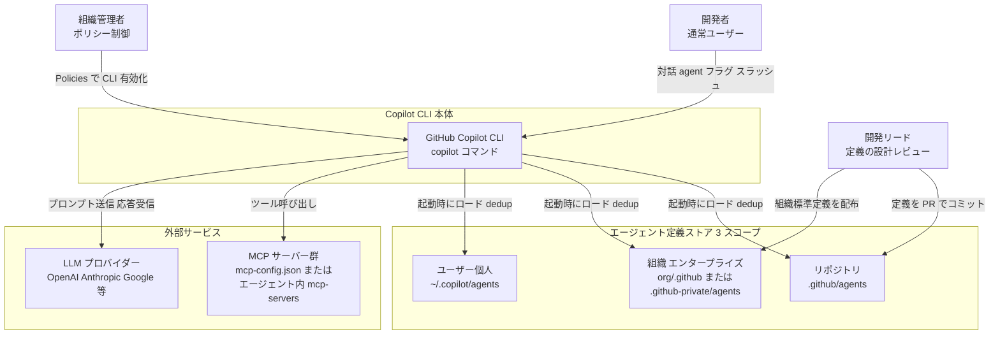
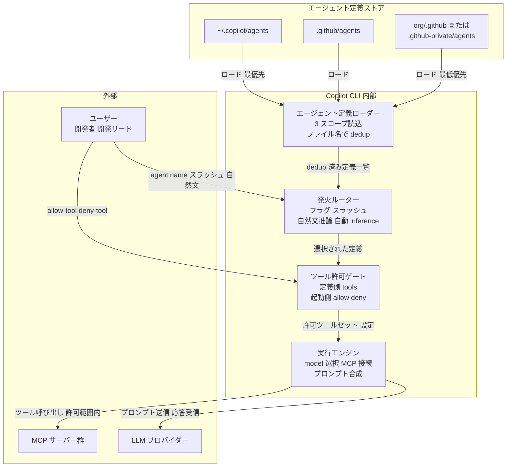
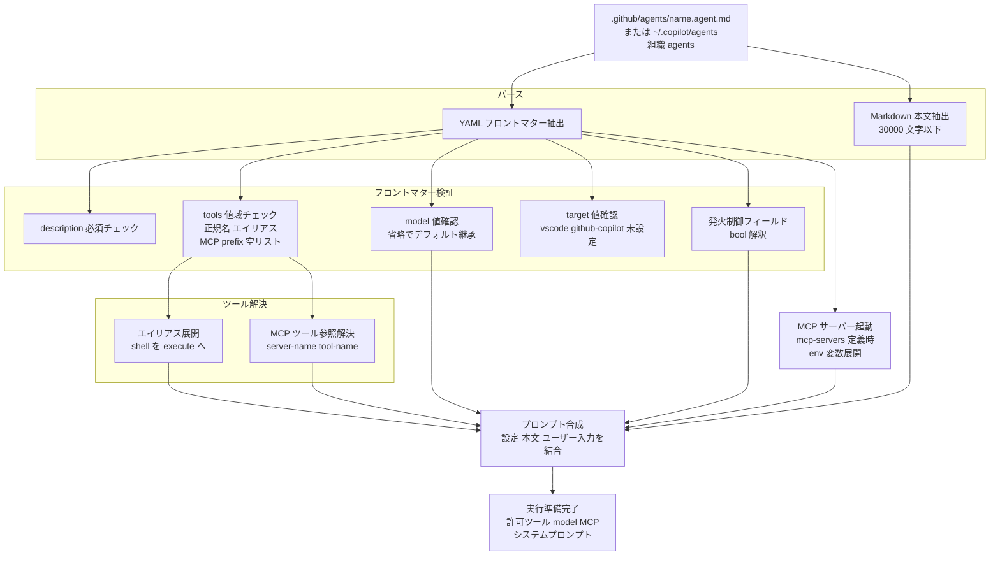
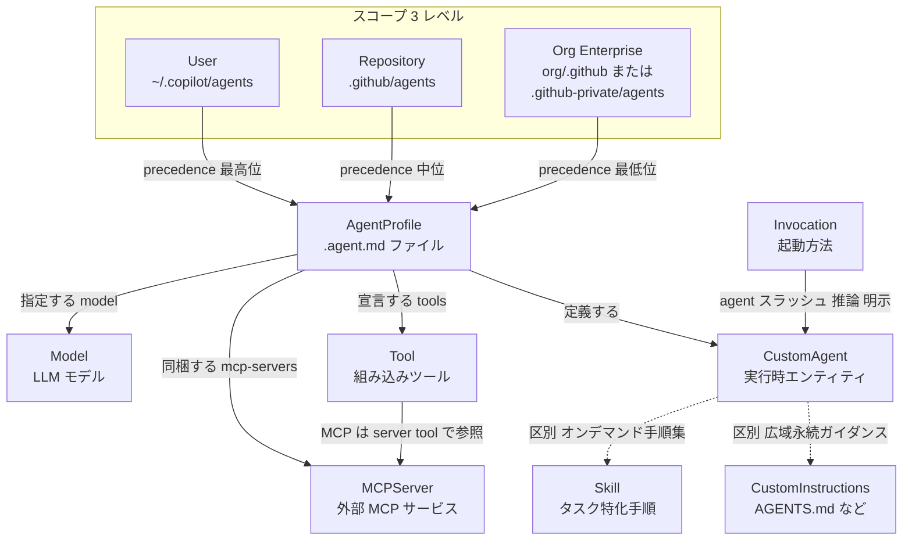
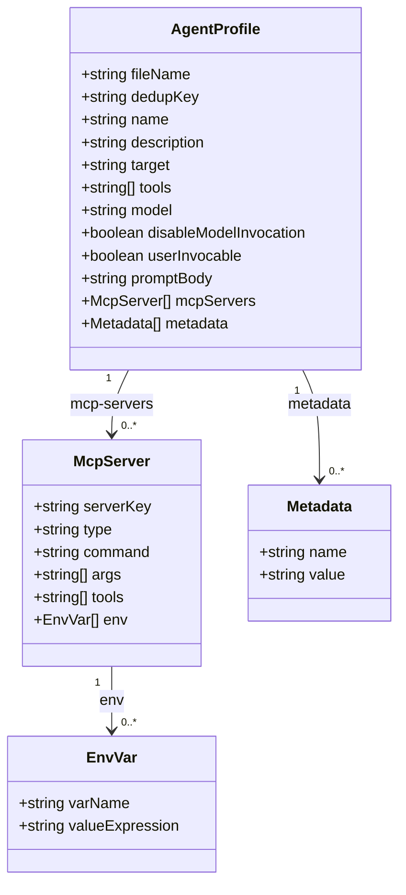

> 調査日: 2026-06-10
> 対象: GitHub Copilot CLI のリポジトリ管理型カスタムエージェント (`.github/agents/*.agent.md`)

## 概要

GitHub Copilot CLI のカスタムエージェント (custom agents) は、エージェントの振る舞いを 1 つの Markdown ファイルに固める仕組みです。固める対象は、システムプロンプト・許可ツール・使用モデル・MCP 連携です。ファイルは `.github/agents/<name>.agent.md` という形で、リポジトリにコミットして使います。

個人がチャット欄に打ち込む使い捨てのプロンプトには、3 つの弱点があります。再現できません。共有できません。改善を積み上げられません。カスタムエージェントは、その指示を「ファイル」に変えます。これにより、チームで共有・レビュー・進化できるワークフローになります。公式 Blog はこれを 1 行で表します。

> "From one-off prompts to workflows" (使い捨てプロンプトから、ワークフローへ)

価値の根拠も公式が明示します。

> "Because the agent profile is a file in your repository, it can be reviewed, updated, and shared." (エージェントプロファイルはリポジトリ内のファイルなので、レビュー・更新・共有できます)

`.agent.md` は通常のコードと同じく PR の diff に乗ります。変更履歴も残ります。CODEOWNERS で所有者も割り当てられます。

ここで 1 点、立ち止まる価値があります。「リポジトリにコミットできること」と「それが組織知として機能すること」は、別の命題です。前者は反証できない機構的事実です。後者は前提条件に依存する含意で、無条件には成立しません。複数の実務記事・セキュリティ研究・GitHub Issue を突き合わせると、この差がはっきり見えます。本記事は、器 (`.agent.md`) としての仕様を正確に押さえます。そのうえで、それを組織知に変えるために何を足すべきかまで扱います。

### リリース状況と対象プラン

| 時点 | 内容 |
|---|---|
| 2025-10-28 | GitHub Changelog にカスタムエージェント機能が初出。`.github/agents/` / `{org}/.github` / `~/.copilot/agents/` の認識と `/agent` スラッシュコマンドを発表 |
| 2026-02-25 | GitHub Copilot CLI 本体が一般提供 (GA)。カスタムエージェントは GA 機能の一部として記載 |

対象プランは Copilot Pro / Pro+ / Business / Enterprise です。Business・Enterprise では、管理者が Policies ページで CLI を有効化します。Free プランは CLI 対象外です (GA 文言が Pro 以上のみを列挙)。

## 特徴

### 1. 定義は 1 ファイル、本文は最大 30,000 文字

カスタムエージェントは `.github/agents/<name>.agent.md` という形式のファイルで定義します。拡張子は `.agent.md` が正規表記です (設定リファレンスの dedup 記述では `.md` も認識されます)。ファイルは 2 部構成です。1 つは属性を宣言する YAML frontmatter です。もう 1 つはシステムプロンプトを書く Markdown 本文で、最大 30,000 文字です。設定リファレンスは "The prompt can be a maximum of 30,000 characters." と明記します。

frontmatter で宣言できるフィールドは以下のとおりです。

| フィールド | 必須 | 意味 |
|---|---|---|
| `description` | 必須 | エージェントの目的・能力の説明。自動ルーティングの判断材料 |
| `name` | 任意 | 表示名。省略時はファイル名が識別子兼デフォルト表示名 |
| `target` | 任意 | `vscode` または `github-copilot`。未設定で両環境に対応 |
| `tools` | 任意 | 使用可能なツール名のリスト。未設定で全ツール許可 |
| `model` | 任意 | 実行モデルの指定。未設定でデフォルトモデルを継承 |
| `disable-model-invocation` | 任意 | `true` でタスク文脈からの自動選択を無効化 |
| `user-invocable` | 任意 | `false` でユーザーの手動選択を不可にする |
| `mcp-servers` | 任意 | エージェントに同梱する MCP サーバーの定義 |
| `metadata` | 任意 | 任意の name/value 注釈 |
| `infer` | — | Retired。`disable-model-invocation` + `user-invocable` に分割・置換済み |

### 2. `tools` で能力境界を宣言的に絞る

`tools` フィールドは、エージェントが触れてよいツールの範囲を宣言的に制限します。セキュリティ設計の中核フィールドです。指定書式は設定リファレンスが次のように定めます。

- 全ツール有効: `tools` 省略、または `tools: ["*"]`
- allow リスト: `tools: ["read", "edit", "search"]`
- 全ツール無効: `tools: []`
- MCP ツール参照: `サーバー名/ツール名` のプレフィックス形式

組み込みツールの正規名とエイリアスは以下のとおりです。

| 正規名 | エイリアス | 内容 |
|---|---|---|
| `execute` | `shell`, `Bash`, `powershell` | シェル実行 |
| `read` | `Read`, `NotebookRead`, `view` | 閲覧 |
| `edit` | `Edit`, `MultiEdit`, `Write`, `NotebookEdit` | 編集 |
| `search` | `Grep`, `Glob` | 検索 |
| `agent` | `custom-agent`, `Task` | サブエージェント呼び出し |
| `web` | `WebSearch`, `WebFetch` | URL / Web 検索 |
| `todo` | `TodoWrite` | タスクリスト |

ここに重要な注意点があります。`tools` を省略すると、全ツール付与が既定になります。組織標準で配布するエージェントほど、`tools` の明示的な最小化が必要です。なお設定リファレンスで確認できるのは allow 方向の指定だけです。特定ツールだけを除外する deny-list 構文の公式記載は、現時点で確認できていません。ツール単位の除外は、後述する起動側フラグで行います。

### 3. 発火経路が 4 系統

カスタムエージェントの起動手段は 4 系統あります。

1. 明示フラグ (非対話): `copilot --agent security-auditor --prompt "Check /src/app/validator.go"`。ファイル名から `.agent.md` を除いた名称で指定します
2. 自然文での名指し: 「Use the security-auditor agent on all files in the /src/app directory」
3. 対話内 `/agent` コマンド: 一覧から選択して起動します
4. 自動推論 (inference): `description` の内容がタスク文脈に一致すると Copilot が自動選択します。`disable-model-invocation: true` で抑止できます

発火制御の 2 フィールドを組み合わせると、ポリシーをファイルに宣言できます。たとえば「人が選べるが自動では発火しない」「オーケストレーションからのみ呼ぶ内部エージェント」といった形です。

### 4. 実行時ガードは二層

セキュリティは二層で設計します。定義側の `tools:` がエージェントの能力境界を宣言します。起動側の CLI フラグが、都度承認なしに走ってよいコマンドを制御します。

| オプション | 効果 |
|---|---|
| `--allow-tool=shell` | 全シェルコマンドを許可 |
| `--allow-tool='shell(git:*)' --deny-tool='shell(git push)'` | `git push` 以外の全 `git` を許可 |
| `--deny-tool=write` | 全ファイル書き込みを拒否 |

最重要規則は deny の優先です。設定ドキュメントは "Deny rules always take precedence over allow rules, even when `--allow-all` is set." と明記します。deny は allow に常に優先し、`--allow-all` を設定しても deny が上書きします。対話時は、破壊的操作の前に「今回だけ / セッション中ずっと」の承認プロンプトが出ます。`--allow-all` (`--yolo`) は全自律化なので、自動実行での利用は慎重に扱います。

### 5. スコープは 3 層、配布は組織リポジトリ経由

エージェント定義ファイルの配置場所は 3 層です。

| スコープ | パス |
|---|---|
| リポジトリ (プロジェクト) | `.github/agents/` |
| ユーザー (個人・グローバル) | `~/.copilot/agents/` |
| 組織 (CLI 文脈) | `{org}/.github` リポジトリ内 |

同名定義の dedup キーは、ファイル名から `.md`/`.agent.md` を除いた部分です。優先度は「個人 (ユーザー) > リポジトリ > 組織」の方向です (作成 How-to: "the one in your home directory will be used, rather than the one in the repository")。この仕組みにより、組織標準エージェントを `{org}/.github` で一元配布しつつ、各リポジトリや各個人がローカルで上書き微調整する重ね合わせが成立します。

なお組織レベルの正確なパスは、CLI 文脈 (`{org}/.github`) と cloud agent 文脈 (`.github-private` リポジトリの `/agents/`) でドキュメント表記が分かれています。公式間で表記揺れがある点に注意します。

### 6. custom instructions / skill との棲み分け

Copilot CLI には似た 3 つの仕組みがあります。公式の機能比較で棲み分けが明示されています。

| 仕組み | 配置ファイル | 特性 |
|---|---|---|
| custom instructions | `AGENTS.md` / `.github/copilot-instructions.md` / `$HOME/.copilot/copilot-instructions.md` | セッション開始時に常時ロードされる永続ガイダンス。全体挙動を形成 |
| custom agent | `.github/agents/*.agent.md` | 専用コンテキストと限定ツール権限を持つ専門ペルソナ |
| skill | Markdown ファイル (手順書) | オンデマンドで発火するタスク特化の手順書 |

公式の判断軸は次のとおりです。"When working on particular tasks, I want Copilot to operate as a specialist with a constrained toolset. → Custom agent"。特定タスクで、限定ツールセットを持つ専門家として動かしたいなら、カスタムエージェントを選びます。

## 構造

本節の C4 model は「カスタムエージェント機構の論理構造」に読み替えて適用します。

### システムコンテキスト図

カスタムエージェント機構に関わるアクターと外部システムの全体像です。



| 要素名 | 説明 |
|---|---|
| 開発者 | エージェントをスラッシュ・フラグ・自然文で起動してタスクを委譲 |
| 開発リード | `.agent.md` を設計・PR レビューし、チーム共有の専門エージェントを整備 |
| 組織管理者 | Business / Enterprise で Policies ページから CLI 機能を有効化 |
| GitHub Copilot CLI | エージェント定義のロード・dedup、発火判定、ツール実行、LLM 呼び出しの統合制御 |
| リポジトリ定義ストア | プロジェクト固有のエージェント定義を置く主要スコープ |
| 組織定義ストア | `{org}/.github` または `.github-private` の `agents/` 経由で組織全体へ配布 |
| ユーザー定義ストア | 個人のグローバル定義。同名定義でリポジトリ定義に優先 |
| MCP サーバー群 | エージェントに追加ツール機能を提供する外部プロセス・リモートサービス |
| LLM プロバイダー | `model:` フィールドまたはデフォルトで選択されたモデルで推論を実行 |

### コンテナ図

Copilot CLI 内部を主要な論理コンポーネントに分解します。



| 要素名 | 説明 |
|---|---|
| エージェント定義ローダー | 3 スコープを走査し、ファイル名をキーに dedup して利用可能エージェント一覧を構築 |
| 発火ルーター | 4 系統で呼び出し先を決定。`disable-model-invocation` で自動推論抑止、`user-invocable` で手動選択禁止 |
| ツール許可ゲート | 定義 `tools:` と起動時 `--allow-tool`/`--deny-tool` を合算して実行可ツールを決定。deny は allow より常に優先 |
| 実行エンジン | `model:` でモデル選択、`mcp-servers:` またはグローバル MCP 設定でサーバー起動、frontmatter と本文でシステムプロンプトを合成 |

優先順位の表記には揺れがあります。公式間で「home > repo」「system > repository > organization」「lowest level takes precedence」の 3 表現が並存します。「個人/ローカル寄りが優先」という方向性は一致しますが、厳密な順序の公式確定版は現状未取得です (要現物確認)。

### コンポーネント図

1 つの `.agent.md` がパースされ実行可能状態になるまでの内部フローです。



| 要素名 | 説明 |
|---|---|
| YAML フロントマター抽出 | ファイル冒頭の区切りブロックをパースし構造化データとして取得 |
| Markdown 本文抽出 | frontmatter 下部の Markdown をシステムプロンプト候補として取得。最大 30000 文字 |
| description 必須チェック | `description` が唯一の必須フィールドであることを検証。自動ルーティングの判断材料 |
| tools 値域チェック | 省略 全許可 全無効 明示リスト MCP 参照のいずれかを確認。deny 専用構文は未確認 |
| model 値確認 | 省略時はデフォルト継承。指定時は Copilot サポートモデル識別子。CLI での有効性は要検証 |
| 発火制御フィールド解釈 | `disable-model-invocation` と `user-invocable` を bool 解釈。旧 `infer` は Retired で無視 |
| エイリアス展開 | `shell` を `execute` へ等、正規名への正規化 |
| MCP サーバー起動 | `mcp-servers:` の YAML を元にプロセス起動。`env:` 内の変数を展開 |

## データ

### 概念モデル



| 要素名 | 説明 |
|---|---|
| AgentProfile | `.agent.md` ファイル本体。frontmatter と本文で構成。ファイル名が dedup キー |
| CustomAgent | AgentProfile から実行時に生成される専門ペルソナ。専用コンテキストと限定ツール権限を保有 |
| Scope | AgentProfile の配置レベル。User > Repository > Org の優先順位。同名は最もローカル寄りが優先 |
| Tool | CustomAgent が使える操作の単位。正規名とエイリアスが存在。全許可 全拒否 省略で全許可 |
| MCPServer | `mcp-servers` でインライン同梱できる外部 MCP サービス。CLI / cloud agent 専用 |
| Model | `model` で指定する LLM。未設定でデフォルト継承。例 GPT-4.1 |
| Invocation | CustomAgent の起動方法。フラグ スラッシュ 自然文推論 明示指示の 4 通り |
| CustomInstructions | `AGENTS.md` 等に置く永続ガイダンス。セッション開始時に常時ロード。CustomAgent とは別物 |
| Skill | タスク特化手順の Markdown。必要時だけオンデマンド発火。CustomAgent は専門家、Skill は手順集 |

### 情報モデル



| 要素名 | 説明 |
|---|---|
| AgentProfile | frontmatter の全フィールドと本文を保持。`description` が唯一の必須。`infer` は Retired |
| McpServer | エージェントに同梱する MCP サーバー定義。`serverKey` で `tools` から参照 |
| EnvVar | MCP サーバーの環境変数。値に変数展開構文を許容 |
| Metadata | name と value のペア。ともに string のアノテーション |

`model` フィールドの許容値は、設定リファレンス本体には列挙がありません。supported-models ページに準拠します。本文プロンプトの上限は 30000 文字です。dedup キーは、ファイル名から `.md`/`.agent.md` を除いた部分です。例として `accessibility.agent.md` の dedup キーは `accessibility` です。同じ dedup キーが複数スコープにあると、最もローカル寄り (User > Repository > Org) が優先されます。

`~/.copilot/mcp-config.json` とエージェント内 `mcp-servers` の優先関係は、公式に明記がなく未確認です。`type` の許容値も、公式例に `'local'` があるのみです。

## 構築方法

### Copilot CLI のインストール・更新

```bash
npm install -g @github/copilot@latest
```

対象プランは Pro / Pro+ / Business / Enterprise です。Free は CLI 対象外です。Business / Enterprise では、管理者が Organizations/Enterprise の Policies ページで CLI を有効化します。カスタムエージェント固有の enterprise Policies トグルの有無は未確認です。

### カスタムエージェントの作成 (2 通り)

方法 A は対話ウィザードです。`copilot` で対話モードを起動し、`/agent` を入力し、「Create new agent」を選びます。保存スコープ (リポジトリ / ユーザーホーム) を選ぶと雛形が生成されます。

方法 B はファイルの手書きです。`.github/agents/<name>.agent.md` を直接作成します。

```bash
mkdir -p .github/agents
touch .github/agents/security-auditor.agent.md
```

ファイル名 (`.agent.md` を除いた部分) がエージェント識別子になります。

### `.agent.md` のフォーマット

最小例です。

```yaml
---
description: 'セキュリティ脆弱性を検出する専門エージェント'
---

あなたはセキュリティ審査の専門家です。
指定されたファイルやディレクトリのコードを読み取り、CVE や OWASP Top 10 に照らした脆弱性を列挙してください。
```

`description` は必須です。省略するとエージェントが登録されません。本文は最大 30000 文字です。

実用例 1 は、読み取り専用のセキュリティ審査エージェントです。

```yaml
---
name: 'Security Auditor'
description: 'OWASP Top 10 / CVE ベースのセキュリティ脆弱性検出エージェント'
tools: ['read', 'search', 'web']
disable-model-invocation: false
---

あなたは経験豊富なセキュリティエンジニアです。

## 役割
- 指定されたコードパスを read/search で調査
- OWASP Top 10 (2021) および既知の CVE に照らして脆弱性を検出
- 各発見事項について 場所 リスクレベル 修正案 を報告

## 制約
- コードの書き換えはしない (read 専用ワークフロー)
- 根拠が不明な脆弱性は「要確認」と明示
```

実用例 2 は、Kubernetes 運用エージェントです (二次情報: Jimmy Song ブログ参考)。

```yaml
---
name: 'k8s'
description: 'Kubernetes クラスタの診断・マニフェスト修正を行う専門エージェント'
tools: ['read', 'search', 'edit', 'shell']
---

あなたは Kubernetes の専門家です。kubectl helm yq が利用可能な前提で作業します。

## できること
- クラスタの状態確認 kubectl get describe logs
- マニフェスト YAML の構文検査と修正
- Helm チャートのレンダリングと diff 確認

## 制約
- kubectl delete は実行前に必ずユーザー確認
- 本番クラスタへの apply は明示的な指示がある場合のみ
```

`model` フィールドの扱いには注意が必要です (要検証)。公式 GitHub Blog 例 (`model: GPT-4.1`) と Issue #2904 (`model: claude-sonnet-4.5`) は、CLI で `model:` を使う前提で記述します。一方、github/copilot-cli-for-beginners 教材には「`model` property は VS Code では効くが GitHub Copilot CLI では未サポート」との記載があります。両表記が矛盾します。学習教材が古い可能性が高いものの、CLI での動作は確認済みとは言えません。表示名形式 (`GPT-4.1`) と ID 形式 (`claude-sonnet-4.5`) のどちらで書くべきかも未確認です。

### MCP サーバーをエージェントに同梱する

```yaml
---
name: 'Issue Triage Agent'
description: 'GitHub Issues を自動トリアージして優先度ラベルを付けるエージェント'
tools: ['read', 'agent', 'issues-mcp/create_issue', 'issues-mcp/update_issue']
mcp-servers:
  issues-mcp:
    type: 'local'
    command: 'npx'
    args: ['-y', '@org/github-issues-mcp']
    tools: ['*']
    env:
      GITHUB_TOKEN: ${{ secrets.COPILOT_MCP_GITHUB_TOKEN }}
---

あなたは Issue トリアージの専門エージェントです。
```

`type: local` は、ローカルプロセスを起動する MCP サーバーを指定します。`env` の変数展開で使える構文は `$NAME` / `${NAME}` / `${{ secrets.NAME }}` / `${{ vars.NAME }}` です。MCP ツールを `tools:` で参照するときは `<サーバー名>/<ツール名>` プレフィックスを使います (例: `issues-mcp/create_issue`)。`mcp-servers` は VS Code 等 IDE 版では無視されます (CLI / cloud agent 専用)。`~/.copilot/mcp-config.json` との優先関係は未確認です。

### 配置スコープと優先順位

| スコープ | 配置パス | 説明 |
|---|---|---|
| リポジトリ | `.github/agents/<name>.agent.md` | そのリポジトリでのみ有効 |
| ユーザー | `~/.copilot/agents/<name>.agent.md` | 全リポジトリ横断で有効 |
| 組織 (CLI) | `{org}/.github` リポジトリ内 | 組織全体に配布 |
| 組織/エンタープライズ (cloud agent) | `.github-private` リポジトリのルート `agents/` 配下 | cloud agent 文脈での組織配布 |

優先順位は「ユーザー > リポジトリ > 組織」です。同名は dedup キー (拡張子を除いたファイル名) で、よりローカル寄りのレベルが優先されます。組織配布リポジトリが `{org}/.github` か `.github-private` かは公式間で表記揺れがあり、要現物確認です。

## 利用方法

### 4 つの起動方法

```bash
# 方法 1: コマンドラインフラグ (非対話・スクリプト向け)
copilot --agent security-auditor --prompt "Check /src/app/validator.go"
copilot --agent=refactor-agent --prompt "Refactor this code block"   # = 区切りも可
```

```text
# 方法 2: 対話モードでスラッシュ選択 (一覧から選択)
/agent

# 方法 3: プロンプト内での自然文指名 (Copilot が自動推論)
Use the security-auditor agent to check /src/app/validator.go

# 方法 4: /agent で名前を直接指定
/agent k8s
```

`--agent` や `/agent <名前>` の値は、ファイル名から `.agent.md` を除いた部分です。方法 3 の自動推論は `disable-model-invocation: true` で抑止されます。

### `disable-model-invocation` / `user-invocable` による発火制御

| フィールド | デフォルト | 効果 |
|---|---|---|
| `disable-model-invocation: false` | デフォルト | タスク文脈に応じて Copilot が自動でこのエージェントを選択 |
| `disable-model-invocation: true` | — | 自動選択を無効化。`/agent` や `--agent` で手動選択時のみ起動 |
| `user-invocable: true` | デフォルト | ユーザーが一覧やフラグで手動選択できる |
| `user-invocable: false` | — | 手動選択を禁止。プログラム経由のみ |

典型的な使い分けです。

```yaml
# パターン A: 手動専用 (自動発火させたくない危険操作系)
disable-model-invocation: true
user-invocable: true
```

```yaml
# パターン B: 内部オーケストレーション専用 (ユーザーには見せない sub-agent)
disable-model-invocation: false
user-invocable: false
```

```yaml
# パターン C: 完全手動 + 非公開 (CI 専用エージェント等)
disable-model-invocation: true
user-invocable: false
```

### `--allow-tool` / `--deny-tool` によるツール実行制御

エージェント定義の `tools:` は「能力の宣言」です。`--allow-tool` / `--deny-tool` は「起動時に都度承認なしで実行してよいか」を制御します。deny が常に allow より優先します。

```bash
# git 全操作を許可しつつ push だけ拒否
copilot --agent refactor-agent \
  --allow-tool='shell(git:*)' \
  --deny-tool='shell(git push)' \
  --prompt "このモジュールをリファクタリングして"

# ファイル書き込みを全拒否 (read-only 実行)
copilot --agent security-auditor --deny-tool=write --prompt "Check /src/app/ for vulnerabilities"

# 特定ファイルへの read と write だけ許可
copilot --agent doc-writer \
  --allow-tool='read, write(.github/copilot-instructions.md)' \
  --prompt "ドキュメントを更新して"

# MCP サーバーの特定ツールだけ許可
copilot --agent issue-triage \
  --allow-tool='MyMCP(create_issue), MyMCP(delete_issue)' \
  --prompt "Issue をトリアージして"
```

利用可能なツール種別は `shell` (別名 `execute`/`Bash`/`powershell`) `write` `read` `edit` `view` `grep` `glob` `web_fetch` `web_search` です。MCP ツールは `ServerName(subcommand_name)` 構文です。

自動承認モードもあります。

```bash
copilot --allow-all-tools --agent my-agent --prompt "..."   # 全ツールの実行承認を省略
copilot --allow-all --agent my-agent --prompt "..."          # ツール パス URL を都度確認なし
copilot --yolo --agent my-agent --prompt "..."
```

対話中のスラッシュコマンドには `/allow-all` `/yolo` (全許可に切替) と `/reset-allowed-tools` (当該セッションで付与した全許可をリセット) があります。

### `/delegate TASK` で Copilot coding agent に委譲する

```text
/delegate Add unit tests for the auth module and open a PR
```

委譲の流れは次のとおりです (Changelog 2025-10-28)。未ステージの変更を新ブランチにコミットします。Copilot coding agent が draft PR を開きます。バックグラウンドで実行します。完了したらレビューを依頼します。長時間作業やリポジトリ全体を俯瞰する変更に向きます。

## 運用

### エージェント定義を「コードとして変更管理」する

`.github/agents/` を CODEOWNERS で特定チームに所有させます。branch ruleset で PR 必須と必須レビュアーを課します。`tools:` や `disable-model-invocation:` の変更は、実行権限や自動発火の変更を意味します。よって、権限変更レビューと同等のゲートとして扱います。

```text
# .github/CODEOWNERS
.github/agents/   @your-org/agent-owners
```

GitHub Well-Architected "Governing agents in GitHub Enterprise" は原則を挙げます (二次情報)。エージェント生成物と同じ CI・セキュリティスキャン・レビューゲートを、定義ファイルにも適用し、例外を作りません。

### CI で定義ファイルを lint する

`.agent.md` 専用の公式 linter は未確認です。汎用 YAML バリデータと GitHub Actions による PR ゲートで代替できます。検証項目は、YAML パース可否・`description` 必須かつ非空・本文 30000 文字以下・`tools:` 値が公式エイリアス集合に含まれること (typo 検出)・`target:` 値域・`model:` 形式です。

```yaml
# .github/workflows/lint-agents.yml
name: Lint agent definitions
on:
  pull_request:
    paths:
      - ".github/agents/**"
jobs:
  lint:
    runs-on: ubuntu-latest
    steps:
      - uses: actions/checkout@v4
      - name: Validate agent frontmatter
        run: |
          pip install pyyaml
          python3 .github/scripts/lint_agents.py
```

```python
# .github/scripts/lint_agents.py
import sys, os, re, yaml

MAX_BODY_CHARS = 30000
VALID_TARGETS = {"vscode", "github-copilot"}
VALID_TOOLS = {
    "execute", "shell", "Bash", "powershell",
    "read", "Read", "NotebookRead", "view",
    "edit", "Edit", "MultiEdit", "Write", "NotebookEdit",
    "search", "Grep", "Glob",
    "agent", "custom-agent", "Task",
    "web", "WebSearch", "WebFetch",
    "todo", "TodoWrite", "*",
}
# 不可視 Unicode (Rules File Backdoor 対策): ZWSP/ZWNJ/ZWJ, bidi 制御, word joiner, BOM 等
INVISIBLE = re.compile("[​-‏‪-‮⁠-]")

errors = []
agents_dir = ".github/agents"
for fname in os.listdir(agents_dir):
    if not (fname.endswith(".agent.md") or fname.endswith(".md")):
        continue
    text = open(os.path.join(agents_dir, fname)).read()
    if INVISIBLE.search(text):
        errors.append(f"{fname}: invisible Unicode detected")
    m = re.match(r"^---\n(.*?)\n---\n(.*)", text, re.DOTALL)
    if not m:
        errors.append(f"{fname}: YAML frontmatter not found"); continue
    try:
        fm = yaml.safe_load(m.group(1))
    except yaml.YAMLError as e:
        errors.append(f"{fname}: YAML parse error: {e}"); continue
    if not fm.get("description"):
        errors.append(f"{fname}: 'description' is required")
    if len(m.group(2)) > MAX_BODY_CHARS:
        errors.append(f"{fname}: body exceeds {MAX_BODY_CHARS} chars")
    target = fm.get("target")
    if target and target not in VALID_TARGETS:
        errors.append(f"{fname}: invalid target '{target}'")
    tools = fm.get("tools")
    if isinstance(tools, str):
        tools = [t.strip() for t in tools.split(",")]
    for t in (tools or []):
        t = t.strip().strip('"').strip("'")
        if "/" not in t and t not in VALID_TOOLS:
            errors.append(f"{fname}: unknown tool '{t}'")

if errors:
    for e in errors:
        print(f"ERROR: {e}", file=sys.stderr)
    sys.exit(1)
print("All agent definitions passed lint.")
```

ツール名セットは、公式 configuration reference に合わせて更新します。不可視 Unicode スキャンは、後述する Rules File Backdoor 対策として必ず含めます。

### 組織配布と precedence による標準 + ローカル上書き

組織標準エージェントを `.github-private` (または `{org}/.github`) リポジトリのルート `agents/` に置くと、全リポへ可視化されます。同名を各リポの `.github/agents/` に置けば、ローカルで上書きできます (ユーザー > リポジトリ > 組織)。組織配布先が `.github` か `.github-private` かは公式間で表記揺れがあり、実機確認が必要です。

### 実行時ガード: `--deny-tool` と `--allow-all` の扱い

deny が常に allow より優先します (公式: "Deny rules always take precedence over allow rules, even when `--allow-all` is set.")。CI や自動実行での `--allow-all` / `--yolo` は、破壊的操作を無制限に通過させます。よって、必ず `--deny-tool` で破壊的操作を明示ブロックしてから使います。`--available-tools='bash,edit,view,grep,glob'` で、使えるツール自体を絞ることもできます。

## ベストプラクティス

各項目を「誤解 → 反証 → 推奨」の構造で示します。機構的事実 (版管理・レビュー・共有ができる) は反証されません。崩れるのは「だから組織知として有効に機能する」という含意です。

### 能動メンテ前提で定義を置く — stale 定義は「無いより悪い」

- 誤解: 一度コミットすれば組織知になり、以後は放置できる
- 反証: 複数の実務記事が「stale な context file は無いより悪い。陳腐化した構造参照はエージェントを積極的にミスリードする」と指摘 (二次情報)。指示ファイルは通常のドキュメント同様に腐ります
- 推奨: 定義を CODEOWNERS で所有チームに割り当て、メンテ責任を明示。参照するパス・ツール名・API 仕様が変わったら定義を追従させるタスクをバックログに入れる。使われない定義は削除

### 500 行超の定義は無視されがち — 最小限に保つ

- 誤解: 細かく書き込むほど正確に従う
- 反証: 「定義が 500 行を超えると大半が無視される。指示を増やすほど従う数が減る逆説がある」「乱立する定義ファイルは人にも AI にも管理不能になる」(二次情報)
- 推奨: 1 エージェントの本文は実質 200〜300 行以内を目安に。「何をさせるか」を 1 文で書けないなら分割を検討

### 最小権限 tools — `tools` 省略に頼らない

- 誤解: `tools` を省略すれば全ツール有効になり、必要に応じて使うので問題ない
- 反証: 省略や `["*"]` は全ツール付与が既定。プロンプトインジェクション成功時に攻撃者が全ツールを操作でき被害が増幅。OWASP AI Agent Security Cheat Sheet も最小権限を要求 (二次情報)
- 推奨: 目的に必要なツールのみ明示リスト (読み取り専用レビューなら `tools: ["read", "search", "web"]`)。`execute`/`shell` は原則省略し、必要時のみ追加して `--deny-tool` でコマンドを絞る

### 不可視 Unicode を CI でスキャンする — PR レビューだけに頼らない

- 誤解: PR レビューで人間が目視確認すれば Rules File Backdoor を防げる
- 反証: zero-width joiner 等の不可視 Unicode を定義ファイルに埋めると、レビュアーには見えない悪意ある指示を AI に注入できる。ベンダー (GitHub / Cursor) は「利用者が内容を確認する責任がある」として脆弱性と認定していない (二次情報)。汚染された定義ファイルは fork にも伝播
- 推奨: 上記 CI lint の不可視 Unicode スキャンを必ず含める。外部リポジトリから定義を取り込む場合は取り込み時にスキャン

### モデル評価セットを用意する — `model` 固定でも版で挙動が変わる

- 誤解: `model: GPT-4.1` でモデルを固定すれば挙動が再現する
- 反証: LLM はモデル版更新・セッション長・コンテキスト量で挙動が変わる。「定義に書いたハード要件を LLM はサイレントに落とす」(二次情報)
- 推奨: モデル版更新のたびに実行する回帰評価セット (入力と期待出力のペアに自動 assert) を用意。`model:` の識別子表記は supported-models ページで現行の許容値を確認。per-agent reasoning effort は未対応 (Issue #2904)

### `AGENTS.md` 標準を併用してロックインを抑える

- 誤解: `.agent.md` に集約すれば組織全体の AI エージェント標準化が達成できる
- 反証: `.agent.md` の frontmatter (`target`/`disable-model-invocation`/`mcp-servers` 等) は GitHub Copilot 固有フォーマット。業界中立の `AGENTS.md` (OpenAI 提案 → Linux Foundation 寄贈、2026-05 時点で主要エージェントがネイティブ対応、60,000+ リポで採用) には乗らない (二次情報)。Codex / Gemini CLI / Cursor は Copilot 固有フィールドを解釈しない
- 推奨: リポジトリの基本コンテキストや規約は `AGENTS.md` に書き、Copilot 固有の高度な制御のみ `.agent.md` に書く。ツール多様性のある組織では、固有スキーマへの過剰投資がロックインと多重メンテを招く点を認識

## トラブルシューティング

### 既知 Issue (GitHub Copilot CLI — GA 後)

各 Issue の state は `gh issue view` による実機確認済みです (検索サマリの state より gh 出力を正とします)。

| owner/repo#番号 | state | 概要 |
|---|---|---|
| github/copilot-cli#1990 | OPEN | 組み込みエージェント (explore/task/code-review) が custom instructions を継承しない。GA 後 2026-03-11 起票 |
| github/copilot-cli#2569 | OPEN | 単一の task ツール呼び出しから複数のバックグラウンドエージェントが意図せず spawn される。GA 後 2026-04-08 起票 |
| github/copilot-cli#452 | CLOSED (COMPLETED, 2026-01-17) | `~/.copilot/agents/` のユーザーレベル定義が読み込まれず、`.github/agents/` しか機能しなかった。解決済み |
| github/copilot-cli#2904 | OPEN | カスタムエージェント YAML に reasoning effort を per-agent 指定できない。グローバル設定のみ |

対応の指針です。#1990 では、builtin エージェントを多用する場合に `copilot-instructions.md` の設定を併用します。「リポにコミットした指示が組み込みエージェント経由では効かない」点に注意します。#2569 では、自動オーケストレーションで同一タスクへの多重実行が起こっていないかログ確認します。#452 では、GA 前後の版を使っている場合に `npm install -g @github/copilot@latest` で更新すると、ユーザーレベル定義が正しく読み込まれます。#2904 では、effort のエージェント単位設定が未対応です。`model: claude-sonnet-4.5@high` 構文案が提案中ですが、2026-06-10 時点で未実装です。

### セキュリティ: 既知の脆弱性・攻撃クラス

#### CVE-2025-53773 (NVD 一次確認済み)

| 項目 | 内容 |
|---|---|
| 分類 | CWE-77 コマンドインジェクション |
| CVSS 3.1 | 7.8 HIGH (`AV:L/AC:L/PR:N/UI:R/S:U/C:H/I:H/A:H`) |
| 影響バージョン | Visual Studio 2022 `17.14.0` 〜 `17.14.12` 未満。GitHub Copilot 本体の影響版数は NVD 未記載 |
| 前提条件 | ローカルアクセス (AV:L) ユーザー操作必要 (UI:R) 特権不要 (PR:N) |
| 修正 | Microsoft 2025-08 Patch Tuesday で修正。Visual Studio を 17.14.12 以上に更新 |

攻撃の仕組みです。ソースコードや web ページや issue やツール応答に埋め込まれたプロンプトインジェクションが、エージェントに `.vscode/settings.json` の `"chat.tools.autoApprove": true` を書き込ませます。以後の全確認をスキップさせ、ターミナルコマンドを実行させます。「感染した Git リポジトリを通じて広がるウイルス」として自己増殖性が報告されています (二次情報: Embrace The Red)。

#### Rules File Backdoor / TRA-2025-53 (いずれも CVE 未付与)

Rules File Backdoor は、zero-width joiner 等の不可視 Unicode を rules / instruction ファイルに埋め込む攻撃です。レビュアーには見えない悪意ある指示を AI に注入します。汚染された定義ファイルは fork を通じて伝播し、供給網攻撃のキャリアになります。GitHub は CVE 化せず、「ユーザーが内容を確認する責任がある」としました (Cursor も同様)。GitHub は 2025-05 に github.com 上での不可視文字警告表示を追加しましたが、緩和のみで根治ではありません (二次情報)。

TRA-2025-53 (Tenable) の影響条件は、GitHub Copilot Chat 0.28.0 / macOS Sequoia 15.5 / VS Code 1.101.2 / Agent mode / Claude Sonnet 4 です。悪意あるファイル名に AI への指示を埋め込み、ファイル名がプロンプトに連結される際に Copilot が指示に従います。被害者が clone する前にリポジトリへ仕込めます。ベンダー対応は「Workspace Trust 機能で緩和するため脆弱性ではない。修正しない」です。CVE は未付与です。

共通の対策です。CI lint に不可視 Unicode スキャンを必ず含めます。外部由来のエージェント定義は取り込み時にスキャンします。`tools:` を最小権限にして、インジェクション成功時の被害範囲を限定します。

## まとめ

GitHub Copilot CLI のカスタムエージェントは、エージェントの振る舞いを `.agent.md` ファイルとしてリポジトリにコミットし、PR レビュー・CI・組織配布で変更管理する仕組みです。ただし「コミットできる」ことは出発点にすぎず、組織知として機能させるには能動メンテ・最小権限・不可視文字スキャン・モデル評価・`AGENTS.md` 標準併用という運用設計を足す必要があります。

この記事が少しでも参考になった、あるいは改善点などがあれば、ぜひリアクションやコメント、SNSでのシェアをいただけると励みになります！

## 参考リンク

- 公式ドキュメント
  - [From one-off prompts to workflows: How to use custom agents in GitHub Copilot CLI](https://github.blog/ai-and-ml/github-copilot/from-one-off-prompts-to-workflows-how-to-use-custom-agents-in-github-copilot-cli/)
  - [Custom agents configuration](https://docs.github.com/en/copilot/reference/custom-agents-configuration)
  - [Create custom agents for CLI](https://docs.github.com/en/copilot/how-tos/copilot-cli/customize-copilot/create-custom-agents-for-cli)
  - [Invoke custom agents](https://docs.github.com/en/copilot/how-tos/copilot-cli/use-copilot-cli/invoke-custom-agents)
  - [Comparing CLI features](https://docs.github.com/en/copilot/concepts/agents/copilot-cli/comparing-cli-features)
  - [Allowing tools](https://docs.github.com/en/copilot/how-tos/copilot-cli/use-copilot-cli/allowing-tools)
  - [About custom agents (cloud agent)](https://docs.github.com/en/copilot/concepts/agents/cloud-agent/about-custom-agents)
  - [GitHub Copilot CLI: Use custom agents and delegate to Copilot coding agent (Changelog 2025-10-28)](https://github.blog/changelog/2025-10-28-github-copilot-cli-use-custom-agents-and-delegate-to-copilot-coding-agent/)
  - [GitHub Copilot CLI is now generally available (Changelog 2026-02-25)](https://github.blog/changelog/2026-02-25-github-copilot-cli-is-now-generally-available/)
  - [NVD CVE-2025-53773](https://nvd.nist.gov/vuln/detail/CVE-2025-53773)
- GitHub
  - [copilot-cli#1990](https://github.com/github/copilot-cli/issues/1990)
  - [copilot-cli#2569](https://github.com/github/copilot-cli/issues/2569)
  - [copilot-cli#452](https://github.com/github/copilot-cli/issues/452)
  - [copilot-cli#2904](https://github.com/github/copilot-cli/issues/2904)
  - [AGENTS.md](https://agents.md/)
- 記事
  - [Tenable TRA-2025-53](https://www.tenable.com/security/research/tra-2025-53)
  - [Pillar Security: Rules File Backdoor](https://www.pillar.security/blog/new-vulnerability-in-github-copilot-and-cursor-how-hackers-can-weaponize-code-agents)
  - [Embrace The Red: GitHub Copilot RCE via prompt injection](https://embracethered.com/blog/posts/2025/github-copilot-remote-code-execution-via-prompt-injection/)
  - [Tessl: From prompts to AGENTS.md](https://tessl.io/blog/from-prompts-to-agents-md-what-survives-across-thousands-of-runs/)
  - [DeployHQ: CLAUDE.md, AGENTS.md, and every AI config file explained](https://dev.to/deployhq/claudemd-agentsmd-and-every-ai-config-file-explained-4pde)
  - [OWASP: AI Agent Security Cheat Sheet](https://cheatsheetseries.owasp.org/cheatsheets/AI_Agent_Security_Cheat_Sheet.html)
