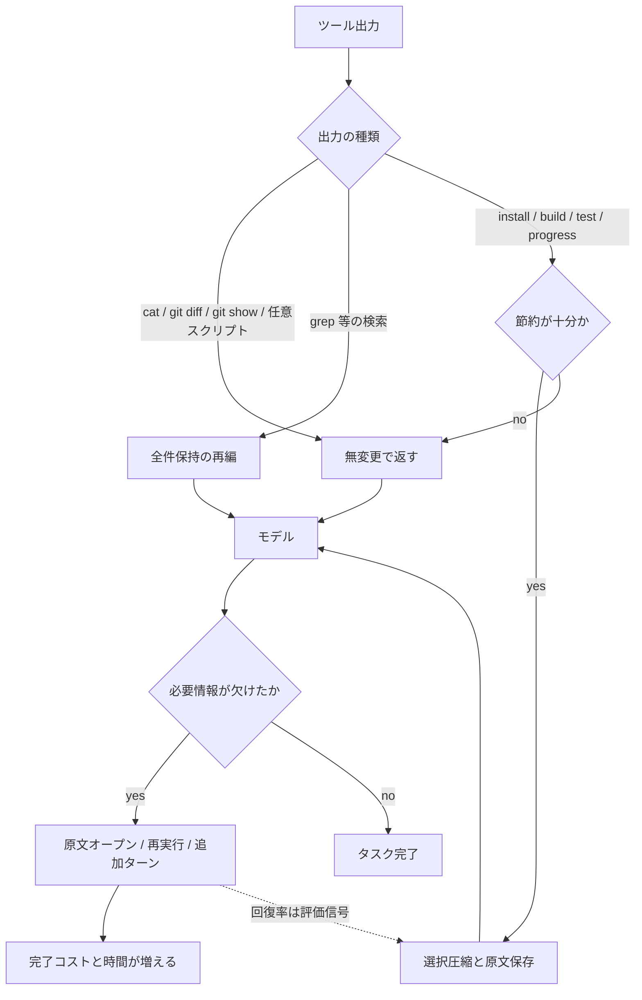

GitHubは2026年9月2日、コーディングエージェントの費用を「ツール呼び出しあたりのトークン数」で測ると誤ると書きました。
シェル出力を短くすると、欠けた情報をモデルが原文の再オープンやコマンド再実行で取りに行きます。
ターンと持ち越し文脈が増えます。
局所では安く見えても、タスク全体では高くなります。

この記事では、GitHub Copilot CLIのハーネスで何を評価し、何を出荷したのかを整理します。
エージェント基盤のコストを設計する人が、圧縮率を主指標にしない判断ができるようにします。

*この記事の全体像。以下、順に解説します。*

評価対象はCopilot CLIのハーネスです。
同じハーネスを使うCopilot appとCopilot code reviewにも出荷すると述べています。
RTK（Rust Token Killer）をそのハーネスで試したところ、平均ではトークンと所要時間が増えました。
GitHubはこれを「評価した統合とワークロードに限る。すべてのRTK設定や圧縮一般ではない」と限定しています。

## ツール呼び出しあたりのトークンでは測れない

コーディングエージェントでは、ツール出力を短くすることが費用対策としてよく提案されます。
[RTK](https://www.rtk-ai.app/docs)は、エージェントが読む前にシェル出力を短くするユーティリティです。
公式はbash output bytesを最大90%減らすと書きます。
請求が90%減るとは書いていません。

GitHubが自ハーネスで評価したところ、短い応答のあと、モデルが原文を開き直したりコマンドを再実行したりしました。
回復のステップがターンを増やし、文脈も持ち越します。
個別のツール応答は短くなっても、完了までのトークンと所要時間は平均で増えました。

ここでの結論は「圧縮は常に高い」ではありません。
測る対象が「1回のツール出力」だと、回復コストが見えない、という話です。
GitHubの表現では、最適化すべきはツール呼び出しではなく、ユーザー依頼から最終結果までの完了タスクです。

課金単位はGitHub AI Creditsです。
公式は1 AI credit = $0.01 USDとし、input / cached input / cache write / outputをモデル単価で換算します。
usage-based billingの開始は2026-06-01です。
CLIはツール出力が既定20 KiBを超えると一時ファイル化し、モデルにはパスとプレビューを渡します。
選択圧縮とは別層です。

## 欠けた情報は回復経路を通って戻ってくる

ツール出力は種類で分岐します。
損失圧縮のあとに回復が走ると、閉ループの完了コストが上がります。

早期版は`git diff`まで圧縮しました。
ベンチマークでエージェントが原文を開き直したため、そのフィルタは外しています。
出荷版では、圧縮した出力の原文を残し、直接の回復経路を用意しています。
回復経路は安全装置であるだけでなく、評価信号でもあります。
原文オープン、再実行、探索のやり直し、追加ターンが頻繁なら、価値ある情報を落としている合図です。

## GitHubが出荷した三分岐

出荷したのは一律圧縮ではありません。
`git diff`など原文が必要な出力は保持し、検索は無損失で再編し、ビルドとテストのログだけ選択圧縮します。

1. **ソース相当と任意出力は無変更で返す**。`cat`、`git diff`、`git show`、任意スクリプトが対象です。
2. **検索結果は件数を落とさず再編する**。`grep`などの一致とファイル一覧をグループ化します。
3. **反復ノイズだけ選択圧縮する**。install、build、test、progressの出力は、節約が十分なときだけ圧縮します。

オフラインで圧縮が発火したタスクでは、統計的に有意な成功率の退行は検出されず、保存した原文を開くことも極めて稀だった、とGitHubは書いています。
オンライン実験では平均コストがわずかに下がり、追跡した品質指標に実質的な退行は検出されなかった、としています。
標本サイズと信頼区間は未公開です。
再現不能な内部評価として読む必要があります。

## 圧縮ではない3つのレバー

三分岐と並行して、使われない行番号の削除、taskツール指示の短縮、完了通知への結果同梱を入れています。
これらは損失圧縮ではありません。

| レバー | 何を消すか | 回復が要るか |
|---|---|---|
| viewの行番号 | 使われない整形 | 不要 |
| taskツール指示の短縮 | 重複した行動指示 | 行動テストが必要。並列が直列化した |
| 完了通知に結果同梱 | 取得専用のモデルターン | 不要。原文を渡す |

`view`ツールは、かつての編集ツールが行番号で変更箇所を指定していた名残で、毎行に番号を付けていました。
現行の編集は周囲コードの一致で行うため、番号は使われません。
オフラインのエージェントベンチではモデル推論コストがroughly 5%減りました。
Copilot CLIのオンラインでは、ユーザーあたり日次推論コストがabout 3%減りました。
edit失敗の増加はなく、情報の回復も不要でした。

taskツールは並列作業用の専用エージェントを起動します。
指示がツール説明、スキーマ、エージェント定義、システム指示、関連ツールへ分散していました。
メタプロンプトで約半分にした初回オンラインは、慎重な並列の案内が硬いスケジューリング方針に書き換わり、独立エージェントが直列化して停止しました。
実験は止め、行動の回帰評価を足してから、次の一文に直して出荷しています。

> Independent agents can run in parallel; consider side effects.

出荷後は約1,300 tokens/turn、セッション総prompt約1.8%減、正規化コスト/アクティブ時間2.9%減です。
プロンプト短縮は、残したい行動をテストしないまま出荷できない、という失敗例です。

バックグラウンド完了の通知は、以前は結果を含みませんでした。
モデルは取得専用のターンを使っていました。
出荷版は適格な完了をまとめ、既存のtool-result形式で結果を同梱します。
圧縮も要約もしません。
AI Creditsはabout 2.3%減です。

## 4つの実験は同じ指標で並んでいるだけ

親記事Figure 1は独立A/Bで、同一のAI-credit指標です。
GitHub自身が「必ずしも厳密には加算できない」と注記しています。

| 変更 | オンラインでの減少 |
|---|---|
| Remove view prefixes | 3.1% |
| Selective output compaction | 5.5% |
| Compact task-tool prompt | 2.9% |
| Reduce notification roundtrips | 2.3% |

三分岐は5.5%の1本です。
4本合計を三分岐の耐久証明には使えません。
あるワークフローで効いた指示短縮が、別面ではコストを増やしたため出荷しなかった、という例も同記事にあります。
証拠はワークロードに局所的です。

Copilot code reviewの共有ファイルツール移行と指示チューニングは別件で、コスト約20%減です。
[changelog 2026-06-25](https://github.blog/changelog/2026-06-25-copilot-code-review-analysis-depth-and-efficiency-updates/)の話であり、今回の三分岐の効果ではありません。

## 一律圧縮、三分岐、無損失整形の比較

同じ「短くする」でも、何を落とすかで完了コストの向きが分かれます。

| 基準 | 一律圧縮（RTK既定） | 三分岐と回復 | 無損失整形とオーケストレーションのみ |
|---|---|---|---|
| 局所バイト削減 | 公式はコマンド別に最大約90%（bash bytes。請求ではない） | 発火時のみ。source-likeは0 | 行番号、重複指示、取得ターン |
| 原文が必要な操作 | `git diff`はcontext削減。`cat`はsignature化 | `git diff`と`cat`は無変更 | 触らない |
| 回復 | 公式フックはBashのみ。エージェントは欠落に気づきにくい | 原文パスあり。利用率を測る | 原則不要 |
| 完了コスト | GitHub Copilot評価では平均増。CCBではRTK +13%、Headroom +44% | GitHub出荷は微減（nとCIは未公開） | 行番号online about 3%（推論コスト/ユーザー日）。通知about 2.3% AI Credits。独立実験 |
| 成功率 | CCBでRTK 54/100（baseline 57） | GitHub: 統計的有意な退行なし（内部） | 行番号: edit失敗増なし |
| 向く条件 | 反復ログだけが支配的で、原文再読が起きない作業 | エージェントがdiffとソースを判断材料にする作業 | 整形と待ちターンが無駄と分かっている作業 |

CCBは[daseinlabs/code-compression-bench](https://github.com/daseinlabs/code-compression-bench) READMEです。
結果日付は2026-07-04、SWE-bench Verified 100、Claude系ハーネスです。
Copilotではありません。
starは約1（2026-09-03）で、独立ですが標本は小さいです。

請求の内訳はツール出力だけでは決まりません。
PointFive論文（Claude Code、[arXiv:2607.12161v5](https://arxiv.org/pdf/2607.12161)、2,848 runs）では、cache writeとreadが実請求の約80%（再構成4成分の約87%）です。
ユーザー側が触れる面は約6%、tool outputsは約3.3%です。
数値はCopilotには直接転記しません。
触れる面が数パーセントなら、主レバーはハーネス固定費とキャッシュです。

## 常に完了コストが上がるわけではない

損失的なツール出力圧縮を圧縮率で最適化すると、回復と追加ターンで完了コストが上がることがあります。
一方、「常に上がる」は過大です。

- GitHub出荷の選択圧縮は平均コスト微減です。行番号削除と通知同梱は回復なしで下がっています。
- CCBのParsecは62/100、総コスト−39%、wall −25%です。圧縮層でも成功とコストが同時に改善し得ます。
- JFrog BoostはTerminal-Bench 2.0でpass 30.9%（25/81）同一、推定コスト−11.9%と自社発表しています。独立再実行は未取得です。
- PointFiveの出荷RTK v0.44.1は、Opus 4.8 mediumのpost-hoc replicationでbilled −2.9% [−18.8, +9.3]です。CIは0を跨ぎます。同replicationのOpus 5は+2.5% [−6.1, +12.0]、主キャンペーン全体は−2.7% [−5.6, −0.1]です。危険なのは攻撃的アームです。攻撃的圧縮ではtool-output −38.4%とbilled +6.8%が共存し、Pearson r = 0.154 [−0.051, +0.356]（100 Haiku tasks）でした。
- Copilot CLIの公開issue検索（親記事翌日時点）では、三分岐を名指しした回帰は0です。会話compaction層の不具合は別件であり、ツール出力圧縮と混ぜてはいけません。網羅証明ではありません。

結論の核は残ります。
範囲は「損失的コンテンツ圧縮」に狭めます。
出荷三分岐は内部評価の後退策であり、独立な一般証明ではありません。

## 発注側が測る組

圧縮率をKPIにすると、局所バイトは改善しても完了コストが悪化する設計を採用しやすくなります。
測る組は次です。

- 回復経路の利用率（原文再オープン、再実行、追加ターン）
- 手戻りを含む完了コスト
- 所要時間
- 成功率
- キャッシュの読み書き比

キャッシュ破壊（R:W低下）が主害なら、ツール出力圧縮より先に別対策が必要です。
CCBのHeadroomは成功をほぼ維持したまま総コスト+44%で、cache R:W 11.3が最低でした。

逆転して一律圧縮を検討してよい条件もあります。

- 対象ワークロードで回復率が無視でき、完了コストと成功が同時に改善する一次実験がある
- ツール出力が請求の支配項である（Claude Code分解ではそうなっていない）

確信度を下げるべき判断は、圧縮ツールを全コマンドに強制することです。
GitHubオンライン実験のnとCI、20 KiB一時ファイル化と選択圧縮の合成効果、Copilot固有の可用性SLAは未解決です。
Online Services SLAの対象リストにCopilotは無く、RPMとTPMの公開値も公式usage-limitsにありません。

## 現場で固定する3群

分類規則の比較実験は、次の3群で固定するのが扱いやすいです。

1. **原文保持**: `git diff`、`git show`、ソース相当
2. **検索の無損失再編**: 件数を落とさずグループ化
3. **ビルドとテストログの選択圧縮**: 原文を残し、回復率を測る

プロンプト短縮は行動テストなしで出荷しません。
バックグラウンド完了は結果を同梱し、取得専用ターンを作りません。

無損失整形とオーケストレーションが先に効くのは、次の条件です。

- モデルが使わないプレフィクスが毎ターン載る
- バックグラウンド完了のあと、結果取得だけのターンがある
- プロンプトに行動テストがある

一律圧縮を既定にしないのは、次の条件です。

- 完了コストと成功率を同じタスクで測っていない
- 検索結果をパイプ後段が生テキストとして読む
- キャッシュprefixを毎ターン書き換える層がある

GitHubの5つの教訓は、モデルを賢くした話ではありません。
モデルが本来やらなくてよい作業を外した、という話です。

1. 完了タスクを最適化し、ツール呼び出しを最適化しない
2. ハーネスが決定的にできる作業をモデルターンにしない
3. 出力が表すものに応じて圧縮し、回復経路の利用を測る
4. プロンプト短縮は意図した行動が残るか検証する
5. 証拠はワークロードに局所的なので、面ごとに測り直す

## まとめ

ツール出力を短くしても、欠けた情報の回復が走れば完了コストは上がります。
GitHub Copilotが自ハーネスでRTKを試した平均結果は、その閉ループを示しています。
出荷したのは一律圧縮ではなく、原文保持、検索の無損失再編、反復ログの選択圧縮です。
行番号削除と完了通知の結果同梱は、回復なしで下がった別レバーです。

測る組は圧縮率ではなく、回復率、完了コスト、所要時間、成功率、キャッシュ健全性です。
内部A/Bの微減を一般証明には使えません。
全コマンドへ損失圧縮を強制する判断だけ、確信度を下げてください。

この記事が少しでも参考になった、あるいは改善点などがあれば、ぜひリアクションやコメント、SNSでのシェアをいただけると励みになります！

## 参考リンク

一次:

- [How we make AI coding more cost efficient without sacrificing task quality](https://github.blog/ai-and-ml/github-copilot/how-we-make-ai-coding-more-cost-efficient-without-sacrificing-task-quality/)（GitHub Blog, 2026-09-02）
- [Copilot code review: Analysis depth and efficiency updates](https://github.blog/changelog/2026-06-25-copilot-code-review-analysis-depth-and-efficiency-updates/)（GitHub Changelog, 2026-06-25）
- [Getting more from each token](https://github.blog/ai-and-ml/github-copilot/getting-more-from-each-token-how-copilot-improves-context-handling-and-model-routing/)（GitHub Blog, 2026-06-17）
- [Token Reduction Is Not Cost Reduction](https://arxiv.org/pdf/2607.12161)（Weinberger and Hozez, 2026, arXiv:2607.12161v5）
- [RTK documentation](https://www.rtk-ai.app/docs)
- [rtk-ai/rtk](https://github.com/rtk-ai/rtk)
- [daseinlabs/code-compression-bench](https://github.com/daseinlabs/code-compression-bench)（README, 結果 2026-07-04）
- [Models and pricing](https://docs.github.com/en/copilot/reference/copilot-billing/models-and-pricing)
- [Copilot CLI context management](https://docs.github.com/en/copilot/concepts/agents/copilot-cli/context-management)
- [Set an AI credit session limit](https://docs.github.com/en/copilot/how-tos/copilot-cli/use-copilot-cli/set-session-limit)
- [Updates to GitHub Copilot billing and plans](https://github.blog/changelog/2026-06-01-updates-to-github-copilot-billing-and-plans/)（GitHub Changelog, 2026-06-01）

二次:

- [Don't Break the Agent](https://jfrog.com/blog/dont-break-the-agent-lessons-in-token-optimization/)（JFrog, 2026-08-20）
- [Claude Code のトークン削減を実測した](https://zenn.dev/pepabo/articles/claude-code-token-reduction-measured)（pepabo, 2026-06-09）
- [AIエージェント時代のトークン削減手法を整理する](https://qiita.com/FlatkeyAI/items/d05a7dfbc70a9dcfe6c6)（FlatkeyAI, 2026-06-09）
