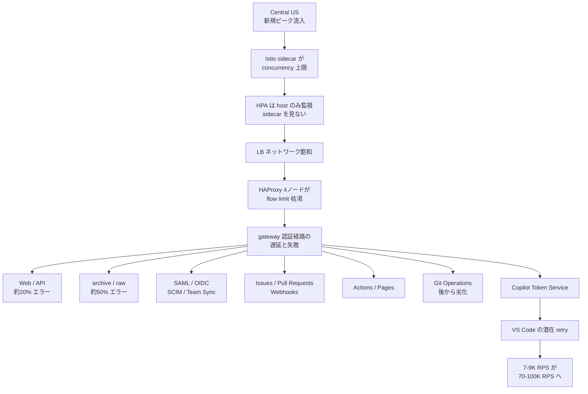
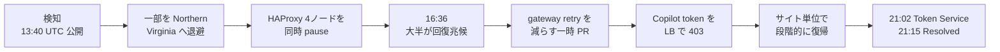
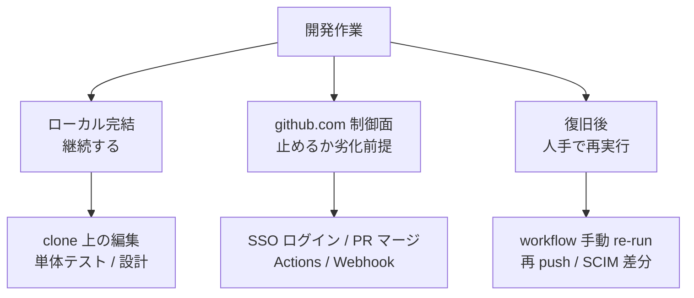

2026年8月17日、GitHub.com が7時間47分にわたって広範囲に劣化しました。GitHub CTO の Vladimir Fedorov 氏による [The August 17 outage, and the work ahead](https://github.blog/news-insights/company-news/the-august-17-outage-and-the-work-ahead/) と、[GitHub Status の RCA](https://www.githubstatus.com/incidents/zkxwbgr0cnmx) が公開されています。

この記事では、公開された一次情報から次を整理します。

- 何が起点で、どこまで連鎖したのか
- 「GitHub が8時間止まった」という読み方はどこまで正しいのか
- 開発チームが今日から用意できる、障害時の作業分類とクライアント設計

結論を先に書くと、これはストレージやリポジトリの障害ではなく、**出荷に必要な制御面（認証・PR・CI・一部の Copilot クライアント）が同じ認証ゲートを共有していたことによる障害**です。したがって対策も「GitHub から離れる」ではなく「制御面が落ちても止まらない作業の切り分け」になります。

*この記事の全体像。以下、順に解説します。*

## 何が起きたのか

起点は Central US リージョンの容量です。

1. 新規のピークトラフィックが Central US に到達する
2. Istio の sidecar プロキシが concurrency 上限に達する
3. Horizontal Pod Autoscaler は host 側のサービスしか見ておらず、sidecar の飽和を検知できない
4. スケールしないままロードバランサのネットワークが飽和する
5. HAProxy 4ノードが flow limit を使い切る
6. その先にある gateway の認証経路が遅延・失敗する
7. 認証ゲートを共有していた製品が一斉に劣化する

ピーク時のエラー率は、web / API がおよそ20%、archive / raw がおよそ50%。影響を受けたコンポーネントは Git Operations、Webhooks、API Requests、Issues、Pull Requests、Actions、Pages、Copilot です。Packages と Codespaces は Status の影響リストに含まれていません。

つまり **Git オブジェクト層が全滅したのではなく、認証ゲートというひとつの隘路が製品横断で詰まった**という形です。

注目すべきは最下段です。認証が遅くなったことで VS Code の Copilot クライアントが潜在的な再試行を一斉に発火し、Copilot Token Service へのリクエストが通常の7〜9K RPS からおよそ10倍の70〜100K RPS まで跳ね上がりました。**障害が自分自身を増幅する経路**が、クライアント側に埋め込まれていたわけです。

## 「7時間47分」の中身

公開窓は 13:28–21:15 UTC です。ただしこの窓は端から端までであり、全機能がゼロだった時間ではありません。

| 時刻 (UTC) | 事実 |
|---|---|
| 13:28 | RCA 上の影響開始 |
| 13:40 | 最初の公開投稿「Investigating」 |
| 13:40–13:44 | API、Actions、Webhooks が degraded |
| 13:45 | Pull Requests / Issues 等でおよそ20%エラー |
| 14:04 | web / API 約20%、archive / raw 約50% |
| 14:24 | SAML/OIDC、SCIM、Team Sync を影響範囲に追加 |
| 14:31 | Copilot が degraded |
| 15:10 / 15:21 | Pages、続いて Git Operations が degraded |
| 16:36 | 問題コンポーネントを特定し是正。回復の兆候 |
| 16:59 | API / Actions / Git Operations / Issues / Pages / PR / Webhooks を mitigate |
| 17:30 / 17:36 / 18:48 | Git Operations、Issues、API が再劣化 |
| 19:13 | authentication token retries を部分的に無効化 |
| 20:08 / 20:45 | 一部アプリで Copilot 認証の問題が残存 |
| 21:02 / 21:15 | Copilot Token Service 復旧、インシデント Resolved |

読み取れる点は3つあります。

- **公開より検知が12分早い。** RCA の影響開始 13:28 に対し、最初の公開投稿は 13:40。ステータスページだけを監視していると、体感より遅れて事実を知ることになります。
- **コアの制御面が重かったのは、窓全体ではなく前半の3〜5時間程度。** 16:36 に多くが回復兆候を見せ、17:30 以降は再劣化と Copilot 残存が中心です。
- **復旧は一様ではない。** 16:59 の mitigate 宣言に Copilot は含まれておらず、Actions はおよそ 18:03、Copilot Token Service は 21:02 まで戻っていません。

なお、二次報道で見かける「Git は終始通常だった」という記述は、15:21 と 17:30 の Git Operations degraded と整合しません。

## なぜ自動フェイルオーバーで閉じなかったのか

一部のトラフィックは Northern Virginia へ退避し、実際に成功処理されています。それでもインシデントが閉じなかったのは、次の3つが重なったためです。

| 条件 | 内容 |
|---|---|
| 起源が観測外 | HPA が sidecar の concurrency を見ていないため、スケールで自然解消しない |
| クライアントが楽観的 | 遅延に対して無制限に再試行し、内部 LB とトークン発行を増幅する |
| 退避先でも増幅する | 退避したトラフィックも同じ token 経路を10倍で叩く |

結果として、閉じるための最後のひと押しは自動化ではなく人の操作でした。そしてその操作はすべて GitHub 社側の管理面に属します。

| 操作 | 依存する管理面 | 効果 |
|---|---|---|
| トラフィック再ルーティング | リージョン LB / トラフィック制御 | 一部を Northern Virginia で成功処理 |
| 影響インフラの隔離 | データセンター / サービス単位の切り離し | 段階復旧の前提づくり |
| HAProxy の同時 pause | ロードバランサ制御 | 広範囲の即時回復 |
| gateway retry を減らす PR | 内部変更の出荷経路 | 退避先での retry storm を止める |
| Copilot token を 403 で遮断 | LB の ACL | 失敗応答が再試行を誘発しないようにする |
| サイト単位の段階復帰 | 流量制御 | Token Service を 21:02 に復旧 |

ここが実務上いちばん重要な示唆です。**顧客側に同等のレバーは存在しません。** 手元で操作できるのは、クライアントの再試行上限、SSO を跨がないローカル作業、Actions の手動 re-run、そして github.com 上の定義への依存を減らすこと、この4つに限られます。

## 隔離環境なら安全か

GitHub Enterprise Cloud with data residency はテナントを分離しますが、今回は **github.com 上の public workflow step definitions を参照する Actions が巻き込まれています**。

[GHEC data residency の機能一覧](https://docs.github.com/enterprise-cloud@latest/admin/data-residency/feature-overview-for-github-enterprise-cloud-with-data-residency) や [GitHub Connect のドキュメント](https://docs.github.com/en/enterprise-server@3.17/admin/configuring-settings/configuring-github-connect/about-github-connect) にも、GHE.com から github.com 上の action を呼ぶ際に `api.github.com` 固定やトークン境界の結合が残る旨が記載されています。

隔離されたテナントや自社ホストのランナーを使っていても、**実行時に github.com の定義を取りに行く限り、今回型の制御面障害は輸入されます**。

同じことが self-hosted runner にも言えます。8月6日の Actions 障害（15:05 UTC–8月7日 00:14 UTC）では hosted / self-hosted の両方が影響を受け、ピーク時には workflow の71%がインフラ起因で失敗し、残りの75%が5分超の遅延となりました。ランナーを自前で持っていても、github.com 側のジョブ割り当てが落ちれば動きません。

## 3月の約束と8月の結果

GitHub は2026年3月と4月にも可用性についてのブログを公開しています。その内容と8月時点の結果を並べると、進捗と未達がはっきり分かれます。

| 3月・4月の方針 | 8月時点の結果 | 評価 |
|---|---|---|
| Git と Actions を共有インフラから隔離 | 認証経路で両方が劣化 | 隔離は未完。Git Operations は遅れて巻き込まれた |
| Azure へ7月までに50%移行 | プラットフォーム負荷のおよそ58% | 比率目標は達成しても今回の障害は防げていない |
| availability first | 8月に重大インシデント2件 | 宣言と結果が一致していない |
| クライアント負荷の shed | VS Code の10倍 retry が発生 | 3月に挙げた課題が再発 |
| フェイルオーバーの dry-run | 退避は動いたが、閉じる操作は手動 | 自動フェイルオーバー単体では不足 |

負荷の伸びは背景として無視できません。4月時点で月間の merged PR ピークが90M、commit ピークが1.4B、新規リポジトリが20M。8月には commit が2.9Bへ、merged PR がおよそ130M、新規リポジトリがおよそ24Mまで伸びています。追加投入された容量も CPU 300万超、高速ストレージ 120PB と大きい。

ただし、**HPA が sidecar を見ていないことと、クライアントの再試行に上限がないことは、成長とは独立した設計上の欠陥**です。ここは容量を積んでも解消しません。

なお CTO ブログは両障害について「code/configuration change が原因ではない」と述べていますが、RCA 側は misconfigured policy を、8月6日は routine deployment を trigger として記録しています。本質が容量であっても、起動条件は設定とデプロイであった、と読むのが妥当です。

## 現場のランブック: 作業を5つに分類する

ここからが実務です。GitHub を「動く / 動かない」の1ブロックとして扱うと、対応は「全部止める」しかなくなります。実際には**ローカルで完結する作業、制御面に依存する作業、復旧後に人手で再実行する作業**の3面に分かれます。

より細かくは、次の5区分で足ります。

| 区分 | 具体例 | 根拠 | 事前準備 |
|---|---|---|---|
| 障害中も続ける | 既存 clone の編集、ローカルテスト、設計、差分整理 | Git オブジェクト層は全滅していない。ただし archive / raw は約50%失敗するため新規取得は当てにしない | 作業リポを事前に clone。依存 tarball をローカルまたは別キャッシュへ |
| 劣化前提で止める | SSO ログイン、PR マージ、レビュー承認、Actions、Webhook 連携、VS Code の Copilot | gateway 認証と Token Service を共有している | ステータスで API / Auth / Actions / Copilot を確認。マージ凍結の判断基準を決めておく |
| クライアントを切り替える | Copilot を CLI または GitHub App 経由へ | 残存フェーズでは CLI と GitHub App は影響なしと Status に記載 | 同じタスクを CLI でも回せる手順を用意 |
| 復旧後に人手で replay | workflow の手動 re-run、再 push、PR 再同期、失敗ジョブの cancel/retry、SCIM / Team Sync の差分点検 | 8月6日は復旧後もイベントが自動 replay されなかった | replay 対象ジョブの一覧を runbook 化。IdP 側の未反映も点検対象に |
| 隔離環境でも切る依存 | GHEC data residency / GHES から github.com の public action や reusable workflow をその場取得 | 今回 Actions が巻き込まれた経路そのもの | action を内部ミラー化、または commit SHA で pin する |

3つ目の「クライアント切り替え」には注意が必要です。CLI と GitHub App が無事だったのは 20:08 以降の**残存フェーズの事実**であり、14:31–16:59 のピーク時に使えたかどうかは公開情報からは確認できません。**フォールバック先として過信せず、あくまで残存フェーズ向けの逃げ道**として扱ってください。

## AI 開発基盤への読み替え

コーディングエージェントや AI 開発基盤を運用しているなら、今回の事象は次のように翻訳できます。

- **モデル API の障害と、SCM / CI / 認証の障害は別の失敗域である。** 今回エージェントを止めたのは後者です。モデル側の冗長化だけでは埋まりません。
- **エージェントの楽観的な再試行は、VS Code の10倍 retry とまったく同じ型です。** 失敗応答を増幅しない retry budget と、403 / 5xx を受けたときの停止条件を先に入れておく必要があります。
- **トークン発行が律速になる。** エージェントはモデルを呼ぶ前に認証で止まります。今回 Copilot Token Service が最後まで復旧しなかったのは象徴的です。

再試行設計の勘所は「失敗を検知したらまず自分の流量を下げる」ことです。GitHub 自身が最終的に取った手段が、gateway の retry を減らす PR と、token リクエストの403遮断だったことを思い出してください。**復旧を早めたのは、再試行を増やす側ではなく減らす側の操作でした。**

## 契約面: SLA が守る範囲

障害対応の計画を立てるうえで、契約上どこまで保証されているかも確認しておく価値があります。

[GitHub Online Services SLA](https://github.com/customer-terms/github-online-services-sla)（Version: June 2026）は四半期ごとに99.9%を定めています。対象は Actions、GitHub Enterprise Cloud の git / Issues / Pages / Pull Requests / Webhooks とそれらの API、および Packages です。

**Copilot はこの列挙に含まれていません。** つまり、Copilot が使えることを99.9%の前提に置いた業務設計は、契約上の裏付けを持ちません。エージェント前提の開発フローを組むなら、この点は明示的にリスクとして扱うべきです。

なお GHEC 顧客は四半期終了後に SLA クレジットを Support へ請求できます。ただし分単位の downtime 公開値がないため、この記事では金額の試算はしません。

## 今日から準備できること

優先度順に7つ挙げます。

1. **チームの作業を前掲の5区分にラベルする。** 週次の「今日必ずやること」を、github.com 制御面が必須のものとローカルで完結するものに分ける。
2. **CI のルールを決める。** 「障害中は新規 trigger しない」「復旧後に手動 re-run するジョブ一覧」をリポジトリごとに持つ。8月6日型（自動 replay なし）を既定の想定にする。
3. **Actions の public workflow / marketplace action を実行時に取得しない。** 内部ミラーか SHA pin へ移す。
4. **エージェントと IDE に retry budget と backoff を入れる。** 同一トークンでの連続失敗時に停止する条件を定義し、無限再試行を禁止する。
5. **観測はコンポーネント単位で行う。** Git Operations が緑でも、PR / Actions / Auth が赤なら出荷は止める。総合ステータスのランプ1個で判断しない。
6. **Copilot を99.9%の前提に置かない。** 現行契約の対象列挙に含まれていない。
7. **依存の棚卸しをする。** 隔離環境を使っていても、実行時に github.com を見に行く箇所が残っていないか確認する。

一方で、**GitHub からの主系統離脱を支持する一次根拠はありません。** ピーク時でも web / API のエラー率は約20%であり、100%ではありませんでした。ローカル clone 上の作業は継続できています。GHEC data residency への移行も、github.com 定義の参照が残る限り今回型の障害は閉じません。

判断を変える条件を先に決めておくなら、こうなります。

- GitHub が gateway 認証を製品単位に隔離し、Actions と Pull Requests が認証劣化と独立に動くことを示す RCA が出た場合 → 「止める」区分を縮小する
- Copilot が SLA の対象に加わった場合 → 契約上の扱いだけ更新する（retry 増幅の問題は別途残る）

## わかっていないこと

公開情報からは次が読み取れません。断定を避けるべき領域として明示しておきます。

- ピーク時に Git Operations が何パーセント失敗したか
- Copilot CLI / GitHub App が 14:31–16:59 のピーク帯に使えたか
- SLA 上の「5%超の失敗」が何分間だったか
- 「public workflow step definitions」の具体（reusable workflow なのか action の YAML なのか）
- codeload への scraping がどの程度の規模だったか（定性的な言及のみ）
- 3月に示された移行比率と5月の数値が同一指標かどうか

これらは SLA クレジットの算定とフォールバック先の信頼度に影響しますが、作業の5区分を採用する判断自体は妨げません。

## まとめ

- 2026年8月17日の GitHub 障害は、Istio sidecar の concurrency 上限を HPA が観測できず、HAProxy の flow limit 枯渇を経て **gateway の認証経路が詰まった容量障害**である。
- 影響は「GitHub 全停止」ではなく、**出荷に必要な制御面（SSO・PR・Actions・一部 Copilot クライアント）の共有障害**。ローカルで完結する作業は継続できた。
- 自動フェイルオーバーは一部成功したが閉じきれず、決め手は HAProxy の同時 pause と、再試行を減らす側の人手操作だった。
- クライアントの楽観的な再試行が障害を10倍に増幅した。これはエージェント／IDE を運用する側の設計課題でもある。
- 隔離環境でも、実行時に github.com の定義を取得していれば制御面障害を輸入する。
- 実務の一手は移行ではなく、**作業の5区分と retry budget**。Copilot は SLA の対象外である点も併せて設計に織り込む。

この記事が少しでも参考になった、あるいは改善点などがあれば、ぜひリアクションやコメント、SNSでのシェアをいただけると励みになります！

## 参考リンク

1. Vladimir Fedorov, [The August 17 outage, and the work ahead](https://github.blog/news-insights/company-news/the-august-17-outage-and-the-work-ahead/), GitHub Blog, 2026-08-20
2. GitHub Status, [Incident with GitHub.com](https://www.githubstatus.com/incidents/zkxwbgr0cnmx), 2026-08-17（incident `zkxwbgr0cnmx`）
3. GitHub Status, [Incident with Actions](https://www.githubstatus.com/incidents/qcvjkzcs7j74), 2026-08-06（incident `qcvjkzcs7j74`）
4. [Addressing GitHub's recent availability issues](https://github.blog/news-insights/company-news/addressing-githubs-recent-availability-issues-2/), GitHub Blog, 2026-03-11
5. [An update on GitHub availability](https://github.blog/news-insights/company-news/an-update-on-github-availability/), GitHub Blog, 2026-04-28
6. [GitHub Online Services SLA](https://github.com/customer-terms/github-online-services-sla), Version: June 2026
7. [Feature overview for GitHub Enterprise Cloud with data residency](https://docs.github.com/enterprise-cloud@latest/admin/data-residency/feature-overview-for-github-enterprise-cloud-with-data-residency)
8. [About GitHub Connect](https://docs.github.com/en/enterprise-server@3.17/admin/configuring-settings/configuring-github-connect/about-github-connect)（GHES 3.17）
