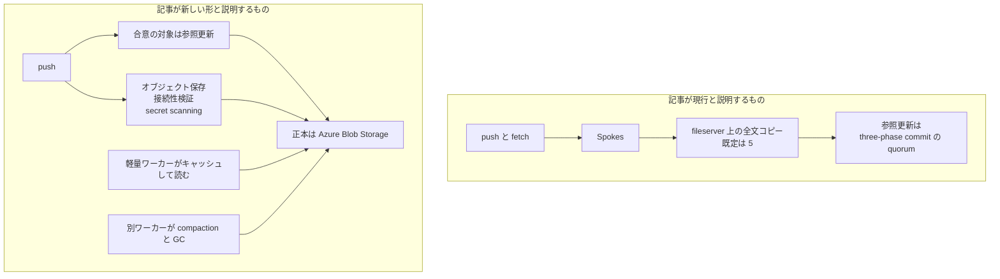

2026年10月6日、GitHub の Brian Celenza が、github.com の Git 配信を止めずに組み替える方針を公開しました。ここに挙げる規模の数値は、GitHub 自身が公開した自己申告です。

この記事では、現行の Spokes と新しい形の分かれ方、2026年8月の分布、自分のリモートで先に決めることを整理します。


*この記事の全体像。以下、順に解説します。*

## GitHubのGit基盤の作り替えとは

対象は、github.com 上の Git 配信です。記事が想定する負荷は、開発者とエージェントが同時に作業し、1日に数百万コミットを受けるリポジトリです。読み手として置かれているのは、エージェントと CI が同じリポジトリへ clone、fetch、push を重ねる運用です。

記事は、単発の clone の速さだけでは足りない、と負荷を分けています。

- エージェントが操作のたびに commit や checkpoint すると、速さは 1 回の push の遅延で頭打ちになります。
- push は前年比 4.9 倍で、月あたり 0.69 billion から 3.35 billion です。多数のエージェントが別ブランチへ書くと、書き込みはアーキテクチャ上の一点へ集まります。
- trunk-based development、release train、merge queue は、その作業を単一の参照へ集めます。Pull request の merge は、1年前のほぼ 4 倍です。
- 1 回の push のあとに、CI や code scanning が同じブランチ先端を clone または fetch します。GitHub Actions は September に 3.26 billion times 走り、1年前の 4 倍超です。
- 速さを保つために compaction と不要オブジェクトの掃除が要ります。書き込みが増えるほど、そのコストは積み上がります。

### 現行の保存は Spokes です

現行の保存は Spokes です。リポジトリの全文を、複数の fileserver のローカルディスクに置きます。全文コピーの既定は 5 です。参照を更新するときは、three-phase commit の quorum で、CI、Web UI、API クライアントが見る状態を揃えます。記事は、この組で 10 億リポジトリを支えていると書いています。

ローカルディスクは、Git 操作がネイティブなリポジトリデータを低遅延で読む層です。副本は、冗長性と、fileserver 間への読みの分散を兼ねます。

読みを増やす仕組みと、耐久コピーを増やす仕組みは、現行では同じです。ディスク上の副本が正本なので、読み容量を足すことは耐久レプリカを足すことです。全レプリカが全 push に参加するため、push の速さは、集合の中で最も遅いレプリカに揃います。記事は、レプリカを足して読みを吸収すると書き込みが遅くなる、と書いています。

活動が最も高い水準では、この結合が天井になります。読みレプリカを足すと、書き込みのオーバーヘッドが増えます。レプリカを失うと、読み容量が減ります。quorum を失うと、書き込みが止まります。

### 新しい形は正本と読みを分けます

記事が新しい形として説明している構成は、次のとおりです。正本は Azure Blob Storage です。耐久と複製は Azure の層に置きます。読み容量は、データをキャッシュする軽量ワーカーで足します。ワーカーを失うことはキャッシュミスに近い、と記事は書いています。代替ワーカーはすぐ要求に答え始め、トラフィックに応じて耐久ストレージからキャッシュを埋めます。ワーカーの台数は流量に合わせます。ピーク分を先に確保し続ける形にはしません。

合意が要るのは、参照更新そのものです。オブジェクトの保存、接続性の検証、secret scanning は量が多く、その多くは他の書き込みと並列に進め、ack を遅らせない、と記事は書いています。

compaction と garbage collection は、ライブの Git 要求に答えるホストから外します。別ワーカーが、耐久ストレージに対して行います。

維持すると書いた制御は、branch protection、required reviews、audit log、repository visibility、自動化、観測性です。ブランチ、レビュー、マージ、履歴という、開発者が既に使っているワークフローの変更は求めない、と記事は書いています。メンテナンスウィンドウは置かない、とも書いています。

社内ベンチマークでは、書き込みスループットが最大 35 倍になり、読み容量は需要に合わせて単独で伸びた、と記事は書いています。土台は置き始めている、とも書いています。続編で future architecture を掘る、と予告しています。

### 記事が分けた構成

図は、記事が現行と説明するものと、新しい形と説明するものを並べたものです。移行の途中でどちらを読むかは描いていません。耐久保存が ack の前に終わるかどうかも示しません。



### 2026年8月の分布

記事内の図は、2026年8月の、リポジトリあたりの月次 Git イベントです。タイトルは "Git events per repository" です。縦軸は対数で、単位は Events です。P100 の Requests は 1,001,000,000 で、本文の「8月におおよそ 10 億リクエスト」と一致します。

| 系列 | P25 | P50 | P75 | P99 | P99.9 | P99.99 | P100 |
|---|---:|---:|---:|---:|---:|---:|---:|
| Fetches | 1 | 2 | 8 | 739 | 10,534 | 214,934 | 514,300,000 |
| Pushes | 2 | 4 | 15 | 802 | 7,502 | 23,758 | 2,970,000 |
| Clones | 1 | 3 | 5 | 283 | 5,619 | 44,691 | 279,300,000 |
| Requests (all) | 15 | 25 | 53 | 7,738 | 80,978 | 570,771 | 1,001,000,000 |

## 注意点

数値は GitHub の自己申告です。第三者による再現測定は、公開されていません。

### 35倍の条件は書かれていません

書き込みスループットの「最大 35 倍」は、"internal benchmarks" の "up to" だけです。対象リポジトリ、期間、ベースライン、本番か実験かは、記事にありません。顧客向けの推奨上限を置き換えた、とも書いていません。

### 分布は毎日数百万コミットを直接示しません

導入の「millions of commits a day を受けるリポジトリ」を、上の図は直接示しません。図に commit 系列はありません。P100 の push は月 2,970,000 です。2,970,000 を 31 日で割ると、約 95,806 pushes/日です。これは「毎日 millions of pushes」を示しません。毎日 millions of commits を否定もしません。

### 倍率の端点は記事の中で揃っていません

"In September alone" の commits は 7.38 billion で、1年前の 5 倍超です。本文は、年も、比較した月の絶対値も付けません。push の 4.9 倍は、月あたり 0.69 billion から 3.35 billion です。月名はありません。3.35 / 0.69 = 4.855 なので、倍率は本文の端点と算術が合います。Actions の "times" が workflow か job かは、定義されていません。merge のほぼ 4 倍には、絶対数がありません。

期間が明示される全体量は、September 2025 から August 2026 の Git 活動が、月 218.2 billion events から 473.3 billion events へ、2 倍超、という一文です。event の内訳が、チャートの 4 系列と同じだとは書いていません。

2026年8月20日の別記事は、"Since April, monthly commits have grown from 1.4 billion to 2.9 billion." と書いています。10月6日の 7.38 billion との関係は、どちらの記事も説明しません。一本の系列として接続しません。

### 既定5の可決数は10月6日の記事にありません

「既定 5」は、10月6日の記事の文です。2016年9月7日の Spokes の記事は、少なくとも 3 副本と書いています。ちょうど 3 副本なら、2 副本への成功が durable set かつ majority です。4 または 5 副本なら、majority は 3 です。10月6日の記事は、quorum の分子を書きません。2016年の分数を、2026年の現行仕様として補いません。

### ディスク副本と Blob は同じ記事の中で役割が違います

現行の節は、"The copies on disk are the source of truth" です。Blob を正本と呼ぶ文は、"The approach" にあります。同じ記事の中で、ディスク副本は現行、Blob は新しい形、と読みます。Blob の文は現在形です。全面が未着手だとは、この文だけでは断定できません。

2026年8月20日の記事は、Azure がプラットフォーム負荷のおおよそ 58%、Git operations の半分を担う、と書いています。5月時点のプラットフォーム負荷は 12% でした。この文は、Blob が全リポジトリの正本である、という意味にはなっていません。8月20日の本文に、Azure Blob Storage も source of truth もありません。

検査を ack の外へ出す文は、secret scanning や接続性検証が、参照の公開より前に終わる、とは書いていません。

8月20日の記事は、次のマイルストーンを、読み容量を reader 数に線形に伸ばし、読み操作を無制限にする設計、と呼んでいます。最大のモノレポから段階的に出す、とも書いています。"unlimited read operations" は、その記事の文言です。10月6日の記事は、その継続の原則説明です。顧客向け docs の推奨上限の撤回は、書いていません。

### 顧客向けの推奨上限は残っています

[Repository limits](https://docs.github.com/en/repositories/creating-and-managing-repositories/repository-limits) は、次を推奨したままです。超過は throttled performance になり得ます。

| 対象 | 推奨の最大 | 強制 |
|---|---|---|
| Git の読み（fetch、clone など） | リポジトリあたり毎秒 15 | 強制とは書いていない |
| push の回数 | リポジトリあたり毎分 6 | 強制とは書いていない |
| push サイズ | なし | 2GB |
| 単一オブジェクト | 1MB | 100MB |

同じページは、開いている pull request が同一ブランチに対して 1,000、merge は毎分 1、とも推奨しています。10月6日の記事は、このページの撤回を書いていません。github.com 向けの "repository cache server" は、このページが名前を出すだけで、リンクはありません。

### SLA は性能劣化を適用外にしています

[GitHub Online Services SLA](https://github.com/customer-terms/github-online-services-sla)（Version June 2026）は、対象サービスの Uptime を少なくとも 99.9% と約束しています。GitHub Enterprise Cloud の Service Feature には、git Operations が含まれます。同じ SLA の Limitations and Exclusions は、レート制限、性能劣化、または実際のサービス不能を伴わない遅延を、この SLA と Service Level の適用外にしています。例外は、性能ベースの Service Level を明示しているサービスです。推奨上限を超えた遅延が、そのまま SLA 違反になるわけではありません。

### 価格は両方とも書いていません

10月6日の記事は、価格の変更を書きません。価格が不変だとも書きません。

## 公式が書いた単位と空欄

作り替えの単位ごとに、10月6日の記事が書いたことと、書いていないことを分けます。移行中の読み先は、空欄のままです。記事の HTML に経路図はありません。2026年10月7日時点で、著者ページに続編はありません。

| 単位 | 記事が書いたこと | 記事が書いていないこと |
|---|---|---|
| ストレージ | 新しい形の正本は Azure Blob Storage。耐久と複製は Azure の層に置く | どのリポジトリがすでに Blob 正本か。オブジェクトのパック形式 |
| 読み取り | 軽量ワーカーがキャッシュして読む。ワーカー喪失はキャッシュミスに近い。台数は流量に合わせる | キャッシュの鮮度。古い副本と新しい正本のどちらを CI が読むか |
| 参照の合意 | 合意が要るのは参照更新。現行は three-phase commit の quorum。既定 5 コピー | 5 副本のときの可決数。公開と検査の前後 |
| 検証とスキャン | 接続性検証と secret scanning は量が多く、その多くは他の書き込みと並列化し、ack を遅らせない | 耐久保存やスキャンの完了が ack の前か後か |
| 保守 | compaction と GC は配信ホストから外す | ウィンドウ。失敗時に読者が見る状態 |
| 権限 | branch protection、required reviews、audit log、visibility を維持する | rulesets の差分。新しい認可サービス |

## 自分のリモートで先に決めること

GitHub の内部経路は、利用者が選べるスイッチとして公開されていません。選べるのは、自分のリモートです。10月6日の記事は、GitHub 自身の Git 配信を止めずに組み替える原則の説明です。エージェントを増やす許可証ではありません。増やす前に、正本のリモート、fetch の予算、ミラーを使うならその鮮度、CI が読む URL を決めます。

### 正本はリモートの参照です

正本は、リモートの参照です。worktree は、その参照を作業ディレクトリへ広げたコピーです。2026年6月2日の GitHub Copilot app の記事は、セッションごとの git worktree を、ブランチの隔離されたコピーとして書いています。並列セッションが互いの作業ツリーを踏まないためです。サーバーの読み上限を外すとは、書いていません。開発者の worktree を、正本の代わりにはしません。

### fetch の初期値は docs の推奨に置きます

読みの初期値は、リポジトリあたり毎秒 15 です。push の初期値は、毎分 6 です。どちらも recommended maximum であり、2GB の push サイズとは違い、enforced とは書いていません。エージェントが操作のたびに push すると、6 回/分にはすぐ当たります。

REST API の一次レート制限は、別枠です。認証済みユーザーは、1 時間あたり 5,000 リクエストです。GitHub Enterprise Cloud 組織が所有する GitHub App や、組織が所有または承認した OAuth app が本人の代わりに投げるリクエストは、1 時間あたり 15,000 まで上がります。この枠は、上の Git 操作の推奨上限ではありません。

### ミラーの鮮度は製品ごとに別です

GitHub Enterprise Server の repository cache は、非同期の読み専用ミラーです。push から、通常は数分で見える、とドキュメントは書いています。CI は `url.<base>.insteadOf` でキャッシュを読みます。ドキュメントの例は、次の設定です。`github.example.com` への fetch が、キャッシュのホストへ置き換わります。

```gitconfig
[url "https://europe-ci.github.example.com/"]
    insteadOf = https://github.example.com/
```

キャッシュへ載ったあとに CI を走らせるなら、`cache_sync` webhook があります。高可用性レプリカ（passive、active / geo）と repository cache を合わせて、最大 8 です。クラスタリングでは、repository caching は非対応です。これは GitHub Enterprise Server の製品機能です。10月6日の Blob と軽量ワーカーと同じものだとは、どちらのページも書いていません。

github.com 上のリポジトリについて、公式のキャッシュ製品で鮮度を契約できる、とは確認できていません。Enterprise Cloud の caching 説明は、参照時点で 404 でした。

GitHub Enterprise Server を使っていない場合、公開ドキュメントの複製手順は `git clone --bare` で取り、`git push --mirror` で新しいリポジトリへ送る形です。これは、その時点のコピーです。その後の鮮度は、自分で fetch する間隔になります。公式の「数分」は、GitHub Enterprise Server の repository cache の文です。自前のコピーへ転記しません。

```bash
git clone --bare https://github.com/EXAMPLE-USER/OLD-REPOSITORY.git
cd OLD-REPOSITORY
git push --mirror https://github.com/EXAMPLE-USER/NEW-REPOSITORY.git
```

### 読み先と ack の意味は決め打ちしません

作り替えのあいだ、CI の読み先を「新しい基盤」と決め打ちしません。公式は、経路を公開していません。8月20日の記事は、最大のモノレポから段階展開する、と書いています。

push の ack を、secret scanning 済みや接続性検証済みとは扱いません。記事は、その順序を保証していません。

35 倍を見込んで、エージェントの台数を増やしません。見込めるのは、自分で測った fetch 時間と、docs の推奨と、ミラーの遅れです。最も忙しいリポジトリの活動量は、推奨の毎秒 15 回や毎分 6 push をすでに大きく超えています。推奨は、そのリポジトリが止まっている、という意味ではありません。

## 公開資料だけでは閉じない問い

- 5 副本の quorum は、2016年の「3 で可決」のままか。
- どのリポジトリが Blob 正本で、どの CI がそこを読むか。
- 7.38 billion commits は何年の September で、8月20日の 2.9 billion とどう繋がるか。
- Actions の 3.26 billion times は何か。
- 同じ設計が GitHub Enterprise Server に来るか。時期は書かれていません。
- 続編の公開日。2026年10月7日時点では、著者ページにこの記事以外はありません。
- 価格が変わるか。10月6日の記事は、変わるとも、変わらないとも書いていません。

## まとめ

10月6日の記事は、GitHub 自身の Git 配信を止めずに組み替える原則を説明しています。現行の Spokes は、既定 5 の全文コピーと、参照更新の quorum が同じ仕組みです。新しい形では、正本を Azure Blob Storage に置き、読みは軽量ワーカーのキャッシュで足します。合意の中心は参照更新です。

分布の P100 は極端に厚く、P50 は月に数回から数十回です。35 倍は社内ベンチマークの上限で、顧客向けの毎秒 15 読み、毎分 6 push は残っています。SLA の 99.9% は Uptime の約束であり、推奨を超えた遅延そのものは適用外です。

利用者に公開されているスイッチは、自分のリモートです。正本の参照、fetch の予算、ミラーの鮮度、CI が読む URL を先に決めます。worktree は作業コピーであり、push の ack はスキャン完了ではありません。

この記事が少しでも参考になった、あるいは改善点などがあれば、ぜひリアクションやコメント、SNSでのシェアをいただけると励みになります！

## 参考リンク

- [Celenza, Brian. "Building Git infrastructure for agent-scale development." The GitHub Blog, 2026-10-06](https://github.blog/engineering/architecture-optimization/building-git-infrastructure-for-agent-scale-development/)
- [著者ページ（2026-10-07 時点で上記 1 本）](https://github.blog/author/bcelenza/)
- [Fedorov, Vlad. "The August 17 outage, and the work ahead." The GitHub Blog, 2026-08-20](https://github.blog/news-insights/company-news/the-august-17-outage-and-the-work-ahead/)
- [Reynolds, Patrick. "Building resilience in Spokes." The GitHub Blog, 2016-09-07](https://github.blog/engineering/building-resilience-in-spokes/)
- [Repository limits](https://docs.github.com/en/repositories/creating-and-managing-repositories/repository-limits)
- [REST API rate limits](https://docs.github.com/en/rest/using-the-rest-api/rate-limits-for-the-rest-api)
- [GitHub Online Services SLA, Version June 2026](https://github.com/customer-terms/github-online-services-sla)
- [GitHub Enterprise Server の repository cache](https://docs.github.com/en/enterprise-server@3.19/admin/monitoring-and-managing-your-instance/caching-repositories/about-repository-caching)
- [repository cache の設定（insteadOf）](https://docs.github.com/en/enterprise-server@3.21/admin/monitoring-and-managing-your-instance/caching-repositories/configuring-a-repository-cache)
- [Duplicating a repository](https://docs.github.com/en/repositories/creating-and-managing-repositories/duplicating-a-repository)
- [GitHub Copilot app（worktree はクライアント側）](https://github.blog/news-insights/product-news/github-copilot-app-the-agent-native-desktop-experience/)
