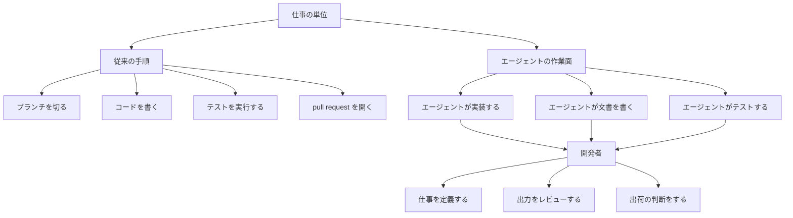

2026年10月2日、GitHub Blogは、開発者の仕事の中心に残す技能を三つ説明しました。エージェントへの指示、出力の批判的な確認、技術判断です。この記事では、その三つの中身と仕事の分け方を確認したうえで、公開されている等級表の一例との対応、速度に関する別の測定、評価表を触る前の見方を順に示します。

*この記事の全体像。以下、順に解説します。*

## GitHubが描く開発者の仕事とは

対象は、GitHubの senior content strategist である Gwen Davis が書いた GitHub Blog の記事です。表示タイトルは “AI is changing developer work. Here are three skills to strengthen.” です。URL のスラッグは `ai-is-rewriting-the-developer-career-ladder-heres-how-to-stand-out` のままです。本文のスキーマ上の wordCount は 458 です。日付はスキーマ上 2026-10-02 で、dateModified は同日 17:14 UTC です。

記事は、実装をエージェントに渡したあとも、結果の責任は開発者に残る、という作業の分け方を、認証追加とダークモードのたとえで示しています。末尾は、Copilot のエージェントセッションを始めるドキュメントへのリンクです。

### 三つの技能

一つ目は、エージェントへの指示です。実行の中身は、問題を明確にすること、文脈を渡すこと、生成コードを評価すること、出荷できるかを決めることです。従来の流れは、ブランチ、実装、テスト、pull request です。エージェントを入れたあとの流れは、一つの作業面で、実装、ドキュメント、テストが別々にレビュー待ちになる、という置き方です。

二つ目は、出力の批判的な確認です。最初の答えを採用せず、別のモデルに批判させてから、人が両方を判断する、と書いてあります。製品名として、GitHub Copilot の Rubber Duck agent が、計画、コード、テストを別モデルで批判する、とあります。

三つ目は、技術判断です。実装に要する時間が空いた分を、顧客課題の確認、トレードオフ、設計、成功指標、承認に使う、と書いてあります。ダークモードのたとえでは、AI が実装、テスト、ドキュメントを行い、開発者のチェックリストが残ります。

### 一つの仕事の分担

記事が描いているのは、一つの仕事を、従来の手順とエージェントの作業面に分けた図です。

従来側は、ブランチを切り、コードを書き、テストを実行し、pull request を開きます。作業面側は、実装、ドキュメント、テストをエージェントが別に出し、どれも開発者へ戻します。開発者が残すのは、仕事の定義、出力のレビュー、出荷の判断です。

### Rubber Duck が担う範囲

Tip 2 の Rubber Duck は、このレビューの一部を別モデルに渡す製品機能です。GitHub Docs では、批評役はセッションのモデルとは別のモデルで、読み取り専用であり、ファイルは変更しません。人が最終判断を残す、という記事の分け方は、ここでも同じです。Docs の取得日は 2026-10-04 です。

## 注意点

GitHub Blog の記事は短い説明です。技能の名前を、測定済みの事実として読まないための条件をここにまとめます。

### キャリアの段は測っていない

記事は、キャリアの段が消えたことを測定していません。評価制度、職務記述、実装量、昇進にも触れていません。描いているのは、一つの仕事の分担です。

認証フロー、SQL、Issue #4821 のダークモードは、いずれも本文中のたとえです。実在の Issue としては扱いません。

### 別モデルの性能数値

「最初の答えを別モデルが正す」は、2026-10-02 の GitHub Blog の中では製品紹介です。性能の数値は別記事にあります。2026-04-06 の GitHub Blog は、Claude Sonnet 4.6 に GPT-5.4 の Rubber Duck を足すと、SWE-Bench Pro 上で Sonnet 単体と Opus 4.6 単体の性能差の 74.7% を埋めた、と書いています。この数値はベンダーの自己申告です。同じ記事は、3 ファイル以上かつ通常 70 ステップ超の問題で Sonnet 基準より 3.8% 高く、三試行で最も難しい問題では 4.8% 高い、とも書いています。こちらもベンダーの自己申告です。

絶対の解答率、問題数、信頼区間は、その記事にありません。74.7% は解答率そのものではありません。Epoch AI は SWE-Bench Pro を Flawed とし、監査が「タスクの 30% 以上が壊れている」と見積もった、と書いています。このベンダー数値を、人の等級の妥当性には使えません。

### 自動起動の既定は一次資料で揃っていない

Rubber Duck の起動既定は、一次資料のあいだで言い切りが揃っていません。`github/copilot-cli` の changelog は、1.0.58（2026-06-02）で “enabled by default” と書き、1.0.60（2026-06-05）で自動起動設定 `rubberDuckAutoInvoke` を “disabled by default” と追加しています。2026-10-04 に取得した Docs は、有効なときは通常自動で相談する、と書いています。changelog と Docs だけでは、その日のバイナリ既定は確定できません。

### 空いた時間の使い方は助言である

「実装が速くなるので、より大きな問題に時間を使う」は助言です。速度そのものは、GitHub Blog の記事では測っていません。

DORA の Kevin M. Storer（2024-12-10）は、生成 AI をより広く使う開発者が、フロー、仕事満足、自己申告の生産性、バーンアウトの低さを報告する一方、雑用の時間は変わらず、価値があると感じる仕事の時間は減った、と書いています。価値の定義を探るインタビューは 2024-09 の 10 件、各約 90 分です。自己申告の「生産性」と、価値ある時間の減少は、同じ頁に並びます。調査票全体の人数は、その頁にはありません。

METR は 2025-07-10 に、熟練したオープンソース開発者 16 人、課題 246、早期 2025 のツール（主に Cursor Pro と Claude 3.5/3.7 Sonnet）で、AI を許すと完了が 19% 長くなった、と報告しました。事前予想は 24% の短縮、事後の自己認識は 20% の短縮でした。METR は 2026-02-24 に、この 19% を信頼区間 +2% から +39% の「長くなった」と再掲し、結果は歴史的だと注記しています。同じ更新は、後期研究の点推定を、元参加者の部分集合で speedup -18%（区間 -38% から +9%）、新規参加者で speedup -4%（区間 -15% から +9%）と書いています。参加者 57 人、リポジトリ 143、課題 800 超、報酬は時給 50 ドルです。METR 自身が、AI なしを拒む参加者の選択で推定が信頼できないと書き、点推定を現在の加速量としては使っていません。

## 公開等級の一例では、何が既に書いてあるか

対応先の一例は、GitLab Development の Intermediate の公開頁です。頁の最終変更は 2023-12-15 で、エージェントが広がるより前の文言です。この頁が全社の等級を代表する、という意味ではありません。開いた一次資料では、実装量の行は無く、判断とレビューの行があります。

| 記事の技能 | 記事が言っている観察 | GitLab Intermediate で対応する行 | 判定 |
|---|---|---|---|
| エージェントへの指示 | 問題、文脈、作業面の切り方を人が定義する | 「Delivers work given clear requirements」は、要件を受け取る側である。エージェントへ渡す境界の行は無い | 測っていない |
| 出力の批判的レビュー | 初回出力を採用しない。別モデルの批判のあと、人が両方を見る | 「Performs thorough reviews within their domain and provides helpful feedback」 | レビュー行為は既にある。差分を却下した理由の記録欄は無い |
| 技術判断 | 顧客課題、トレードオフ、成功指標、承認 | 「Makes responsible decisions … by ideating options, identifying the consequences of each option, evaluating trade-offs」 | 判断の行為は既にある。判断を保留する条件の記録欄は無い |

「実装量の評価のままだから、この三つは職務記述に無い」は、この公開頁には当てはまりません。空なのは三つの行為全部ではありません。空なのは、エージェント作業で初めて必要になる三つの観察です。指示の境界、差分の却下理由、判断の保留条件は、GitHub Blog の記事にも、GitLab のこの頁にも、欄としてはありません。

ここから言えるのは、次の範囲です。三つの観察は、既存の「判断」と「レビュー」にぶら下げる追加の見方であり、新しい等級そのものではありません。

支持になる材料は三つあります。記事は、実装を渡したあとも結果責任が人に残る、と明示しています。三つの観察は、その責任を pull request 上で見るときの候補になります。公開等級の一例は、判断とレビューを既に能力として書いています。ゼロから欄を新設しなくても、空かどうかは照合できます。Rubber Duck の Docs は、別モデルの批評を人が受け取る材料として書いており、批評役がファイルを変えない、と限定しています。

## 速度の数字は、三技能が埋まっている証拠になるか

速度が上がった週だけを、この三欄が埋まった週に限る規則は採りません。欄が埋まっていることと、レビューの中身が残っていることは、別の測定です。

He ほか（arXiv:2607.01904、2026-07-02、査読前）は、2025-06 に merged pull request / engineer / month の倍増を掲げた匿名の中規模企業を追っています。パネルは開発者 802 人、pull request 196,212 件、2024-01 から 2026-04 です。活動開発者あたりの authored pull request は、基準（2025-01 から 04）の 21.2 から 2026-04 の 44.3 へ増え、2.09 倍です。これは、マンデートが名指しした「マージ数 / エンジニア」そのものの系列ではありません。

同時に、人間のレビューを 1 件以上受けた割合は 89% から 68% へ下がり、自動レビューは約 19% から約 84% へ上がりました。コメント付きの人間レビューは約 39% から約 21% へ減り、無言の承認は約 50% でほぼ横ばいでした。著者は、残った人間レビューが bare approval に薄くなった、と書き、割付はランダムではなく因果の大きさは限定される、と書いています。速度を公式の進捗にした現場で、レビューの有無は残り、中身のコメントが減った、という記録です。

Song（arXiv:2610.01471、2026-10-01、単著、査読前）は、成果物 30、仕込み誤り 150、レビュー 900 で、別モデルのレビューを試しています。上位のクロスモデルと、同一モデルの新しいセッションとの F1 差は有意ではありません。等価は示していません。見つけた誤りの Jaccard は 41.2% です。レビューを 2 回使うと、同一モデルの新規セッション 1 回に上位クロスモデル 1 回を足した組は仕込み誤りの 56.7% に当たり、同一モデル 2 回は 42.7% でした（Holm 調整 p=.006）。上位クロスモデルを 2 回使った場合より有意に多い、とまでは分かっていません。キャリア評価は測っていません。記録は著者請求で、同一モデル側の生出力は転写であり、1 run は出所が不明として除外されています。

三欄が埋まっていることだけを速度の入場条件にすると、He ほかの無言承認と同じく、欄の存在が中身の代わりになります。GitHub Blog の記事は、この規則を提案していません。

## 評価表を改訂する前に、何を一ヶ月数えるか

評価表を改訂する前に、既存行へ対応づけます。判断とレビューの行が既にあるなら、新しい三等級は足しません。その行の実例が、エージェントの出した差分に付いているかを見ます。付いていない観察だけを「測っていない」と残します。

エージェントが差分を出した pull request に限り、次の三つのメモを任意で残す対象にします。

- 指示の境界。エージェントに渡した範囲と、人が保持した範囲。
- 差分の却下理由。出さなかった理由が、スタイル以外の欠陥なのか、範囲外なのか。
- 判断の保留条件。何が分かるまでマージしないか。

この三つのメモが空の週は、速度の成果から除外しません。除外すると、埋めたこと自体が指標になります。He ほかでは、レビューの有無が残ってもコメントが減りました。速度の向上を成果の根拠にするなら、件数とは別に、コメント付きレビューの割合が基準期間から落ちていない週に限る方が、記事の「人が出力を見る」に近い条件です。その規則も、GitHub Blog の記事が実験したわけではありません。一ヶ月、エージェント差分の pull request で、三メモの空欄率と、コメント付きレビューの割合を数えてから、等級の文言を変えます。

全社でツールを義務化した経験へ接続する問いは、次の一文に限られます。進捗を件数で置いた期間に、既存の判断行とレビュー行は、エージェントの差分に対して空だったか。空だった行が、義務化のあと職務として見えていなかった範囲です。GitHub の記事は、その空欄の名前の候補を三つ示しています。空欄が存在したことの証拠ではありません。

逆転する条件は三つあります。自社の等級が件数と行数しか持たないなら、三技能はまとめて「測っていない」になります。コメント付きレビューの割合が落ちていないことがログで分かるなら、速度の足切りは不要です。Rubber Duck のログを人の判断欄の代わりにするなら、その置換は Song の範囲では支持されません。

まだ閉じない問いは、次のとおりです。

- 読者の評価表は、GitLab のこの頁のように判断とレビューを既に書くのか、件数だけなのか。公開例から自社表は復元できません。
- He ほかの企業で、個人の昇進資料が pull request 数のままだったかは、論文にありません。進捗指標と個人評価は別です。
- Rubber Duck の自動起動が、2026-10-04 時点の既定でオフかどうかは、changelog と Docs だけでは閉じません。
- Song の仕込み誤りが、実在の pull request の人間判断に移るかは未検証です。
- GitHub 社内の非公開等級に “direct agents” が有るかは、公開検索では否定できません。公開検索では、等級表としては見つかっていません。

## まとめ

GitHub Blog は、実装をエージェントに渡したあとも結果の責任が開発者に残る、という分け方を、指示、レビュー、技術判断の三つで説明しています。Rubber Duck は、そのレビューの一部を別モデルの読み取り専用の批評に渡す機能です。人が最終判断を残す点は、記事と同じです。

この三つは、公開等級の一例では、既存の判断とレビューにぶら下がる追加の見方です。新しい等級そのものではありません。空なのは行為の全部ではなく、指示の境界、差分の却下理由、判断の保留条件です。速度の数字、ベンダーのベンチマーク、空いた時間の助言は、この欄の妥当性を測っていません。

評価表を変える前に、エージェント差分の pull request で一ヶ月、三メモの空欄率とコメント付きレビューの割合を数えます。メモが空の週を速度の成果から外す規則は採りません。

この記事が少しでも参考になった、あるいは改善点などがあれば、ぜひリアクションやコメント、SNSでのシェアをいただけると励みになります！

## 参考リンク

- [Gwen Davis. “AI is changing developer work. Here are three skills to strengthen.” GitHub Blog. 2026-10-02](https://github.blog/ai-and-ml/ai-is-rewriting-the-developer-career-ladder-heres-how-to-stand-out/)
- [GitHub Docs. “About the rubber duck agent.” 2026-10-04 取得](https://docs.github.com/copilot/concepts/agents/copilot-cli/rubber-duck)
- [Nick McKenna, Bartek Perz. “GitHub Copilot CLI combines model families for a second opinion.” GitHub Blog. 2026-04-06](https://github.blog/ai-and-ml/github-copilot/github-copilot-cli-combines-model-families-for-a-second-opinion/)
- [GitHub Changelog. “Copilot CLI: Improved UI, rubber duck, prompt scheduling, and voice input.” 2026-06-02](https://github.blog/changelog/2026-06-02-copilot-cli-improved-ui-rubber-duck-prompt-scheduling-and-voice-input/)
- [github/copilot-cli changelog.md. 1.0.58（2026-06-02）と 1.0.60（2026-06-05）](https://raw.githubusercontent.com/github/copilot-cli/main/changelog.md)
- [Kevin M. Storer. “How gen AI affects the value of development work.” DORA. 2024-12-10](https://dora.dev/insights/value-of-development-work/)
- [Joel Becker, Nate Rush, Beth Barnes, David Rein. “Measuring the Impact of Early-2025 AI on Experienced Open-Source Developer Productivity.” METR. 2025-07-10](https://metr.org/blog/2025-07-10-early-2025-ai-experienced-os-dev-study/)
- [Joel Becker ほか. “We are Changing our Developer Productivity Experiment Design.” METR. 2026-02-24](https://metr.org/blog/2026-02-24-uplift-update/)
- [Hao He ほか. “AI Writes Faster Than Humans Can Review.” arXiv:2607.01904. 2026-07-02](https://arxiv.org/html/2607.01904v1)
- [Song Tae-Eun. “When Does a Second Model Help?” arXiv:2610.01471. 2026-10-01](https://arxiv.org/html/2610.01471)
- [Epoch AI. “SWE-Bench Pro” benchmark review. Flawed](https://epoch.ai/benchmarks/swe-bench-pro/review)
- [GitLab Handbook. “Development Department Career Framework: Intermediate.” 最終変更 2023-12-15](https://handbook.gitlab.com/handbook/engineering/careers/matrix/development/intermediate/)
