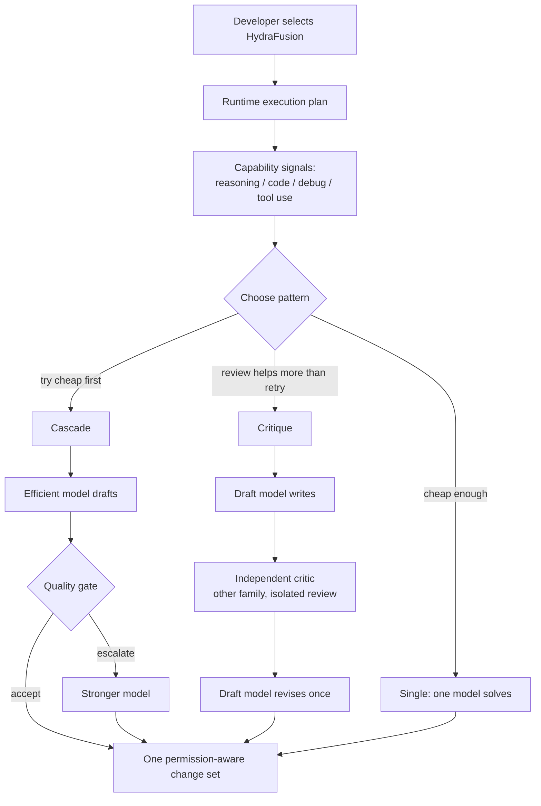
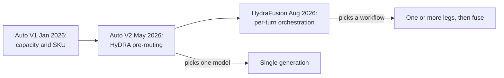

GitHub Copilot のモデル選びは、長らく「どの 1 モデルを使うか」でした。
2026-09-04 の [GitHub Blog](https://github.blog/ai-and-ml/github-copilot/project-hydrafusion-frontier-quality-via-multi-model-orchestration/) が公開した **Project HydraFusion** は、その問いを「このターンをどの実行パターンで解くか」へ移します。

本稿は、research preview の公式一次資料を、製品採用と自前オーケストレーションの判断材料に再構成します。
読者が得られるのは次の 3 点です。

- Single / Cascade / Critique の差分と、Auto（HyDRA）との層の違い
- オフライン評価の読み方（コストは 3 ベンチとも低下、品質は一様に上回らない）
- 現場が真似すべき 4 点（受入基準、昇格条件、批評者の独立性、全レッグの原価配賦）

:::message alert
2026-09-05 時点で、製品面は Copilot CLI の `/experimental` に限ります。VS Code と Copilot app は September targeting です。名簿と挙動は変わりうる research preview です。
:::

*この記事の全体像。以下、順に解説します。*

## HydraFusion が選ぶのはモデルではなく実行パターンである

開発者は HydraFusion を、モデルピッカーの 1 項目として選びます。
裏側では reasoning / code generation / debugging / tool use の capability 信号を使い、そのターンのワークフローを最適化します。

実行時に選ばれるパターンは 3 つです。

| パターン | 動き | 使う局面の公式な言い方 |
|---|---|---|
| **Single** | 1 モデルが解く | cheap enough |
| **Cascade** | 安価モデルが下書きし、品質ゲートが受理または強いモデルへ昇格する | try cheap first |
| **Critique** | 別系列の read-only 批評のあと、下書きモデルが 1 回改稿する | review helps more than retry |

Cascade の定義は「品質ゲートが受理しなければ強いモデルへ escalate」です。
ゲートの閾値、判定器、昇格率は公開されていません。

Critique は Copilot CLI の Rubber Duck と **同じ review pattern** だとブログが書いています。
ただしツール面まで同一ではありません。
HydraFusion の Isolated review は tool-less です。
Rubber Duck 自体は read-only で exploration tools を使います。

中間ドラフトはユーザーに見せません。
外に出るのは 1 応答と、permission-aware な 1 変更セットです。
失敗時は patch を適用しません。
各レッグに timeout と cancellation を置くと書かれていますが、数値は非公開です。

プレビューの推奨は first-turn の単一プロンプトです。
multi-turn は次の焦点です。
モデル名簿の指定と除外はできません。
固定 roster も公開しません。

## Auto と HyDRA は別層である

[公式 FAQ（community#206492）](https://github.com/orgs/community/discussions/206492) の差分は短いです。

- **Auto**：最適な **モデル** を選ぶ。1 リクエスト 1 モデル
- **HydraFusion**：最適な **ワークフロー** を選ぶ。1 ターンで複数モデルを走らせうる

系譜は Auto V1（2026-01）→ Auto V2 こと [HyDRA](https://arxiv.org/abs/2605.17106)（2026-05）→ HydraFusion（2026-08）です。

HyDRA 論文（arXiv:2605.17106v2、2026-06-12）は VS Code Chat の auto-mode に載る **pre-routing** です。
ModernBERT が 4 次元の要求を予測し、YAML の能力プロファイルに対する shortfall matching で最安の充足モデルを選びます。
本番は session-sticky で、再ルートは turn 1 / compaction / summarization に限ります。

HydraFusion ブログは first-turn の単一プロンプトを推奨し、multi-turn を次の焦点とします。
sticky と first-turn 推奨は別層の事実です。
因果は公式に書かれていません。

公式 FAQ は、将来の Auto との統合を「評価中」とします。

混同しない対象がもう 1 つあります。
2022 年 ICCPS の同名 HydraFusion（センサー融合、[arXiv:2201.06644](https://arxiv.org/abs/2201.06644)）は無関係です。

## 公式が固定している 5 原則

出典は [GitHub Blog 2026-09-04](https://github.blog/ai-and-ml/github-copilot/project-hydrafusion-frontier-quality-via-multi-model-orchestration/) です。

| 原則 | 内容 |
|---|---|
| Complete accounting | 全レッグの cost / usage を集計する |
| Bounded execution | レッグごとに timeout と cancellation |
| Isolated review | 批評は isolated かつ tool-less。solver は共有 workspace |
| Fail-safe application | cancel または validation 失敗時は patch なし |
| Validated routing | 実行前に workflow 定義、binding、fallback、availability を検証する |

内部では role / outcome / cost / latency / diagnostics を残します。
外部には 1 応答と 1 変更セットです。

原価会計の対象は drafting / critique / revision / escalation / retry / fallback を含む全レッグです。
ユーザー請求は構成モデルの標準レートの合算です。
HydraFusion 専用 SKU はありません。

## 試す経路と課金

到達経路は Copilot CLI です。
HydraFusion 用の SDK `model` slug と `docs.github.com` 専用ページは、2026-09-05 の検索では確認できていません。

1. `/update`
2. `/experimental on`
3. `/model` で HydraFusion (Research Preview)

認証は Copilot CLI と同じです。
専用スコープはありません。
SLA はありません。
DR / FedRAMP の対象とは書いていません。

請求は [Models and pricing](https://docs.github.com/copilot/reference/copilot-billing/models-and-pricing) の標準レートです。
1 AI credit = $0.01 USD です。
Auto の有料 10% 割引が HydraFusion に付くかは、公式 FAQ にありません。

Copilot トークン例（1M tokens、docs 2026-09-05）は次のとおりです。

| モデル | Input | Cached input | Cache write | Output |
|---|---|---|---|---|
| Claude Opus 5 | $5.00 | $0.50 | $6.25 | $25.00 |
| GPT-5.6 Sol（≤272K） | $4.00 | $0.40 | $5.00 | $20.00 |

HydraFusion のオフライン「estimated cost」は pricing assumptions 付きです。
この表そのものの実測ではありません。
GitHub 自身、見積と実請求の差を「これから学ぶ」と書いています。

Rubber Duck（[About the rubber duck agent](https://docs.github.com/en/copilot/concepts/agents/copilot-cli/rubber-duck)）は、メインが Claude または GPT のときだけ critic を使います。
別ファミリーを自動選択し、read-only です。
判定は Blocking / Non-blocking / Suggestions です。
追加レイテンシと追加モデル使用があります。
小さな変更ではスキップしえます。

HydraFusion Critique は「same review pattern as Rubber Duck」です。
批評は同一入力、改稿 1 回です。
誤り相関の公開実験はありません。

## ベンチマークはコスト低下と品質の近傍を同時に示す

GitHub は 3 つの agentic coding ベンチで **best tuned** 構成を、同一入力、同一ツール、同一実行制限、同一 pricing assumptions、**medium reasoning** で Claude Opus 5 と比較しました。
絶対 pass rate は出していません。
比較に GPT-5.6 Sol も使ったと書きますが、公開表は対 Opus 5 のみです。

| ベンチ | Cost vs Opus 5 | Quality vs Opus 5 | 性格 |
|---|---|---|---|
| TerminalBench 2.1 | 67% lower | +4.9 points | 公開。89 タスクの terminal 環境。[公式ニュース](https://www.tbench.ai/news/terminal-bench-2-1) は 2.0 から 28 タスク修正、リポジトリ README は 26 タスク修正と書く（両方一次、不一致） |
| DeepSWE | 36% lower | −1.5 points | 公開。113 タスク / 91 リポジトリ / 5 言語。汚染回避の自作課題と手書き verifier（[arXiv:2607.07946](https://arxiv.org/abs/2607.07946)） |
| CheckpointBench | 65% lower | −0.1 points | **内部**。実 Copilot セッション。独立再現不可 |

品質は 3 本中 1 本だけ Opus 5 を上回ります。
リードの「matched or exceeded」は DeepSWE −1.5 と緊張します。
品質比較を TerminalBench 2.1 の +4.9 だけで語るわけにはいきません。

コスト列は 3 ベンチとも Opus 5 より低い推定です。
本番クレジットの監査ではありません。
Cascade は安いモデル分を毎回払い、失敗サブセットだけ高くなる分布効果です。
ゲート失敗率は非公開です。

開発記録では、TerminalBench 2.1 で 2026-08-11〜08-25 に evaluation harness の operational failure が 2 件あり、invalid は除外しています。
ブログの hill-climbing 節は「August 25 to 91.8% best-of-2 equivalent」と書きます。
これは Table 1 の相対差（対 Opus 5 のポイント差）とは別指標です。
計算定義は公開されていません。

ポリシーは beam search で構築し、CheckpointBench / DeepSWE / TerminalBench 2.1 を横断して繰り返し調整した、と自ら書きます。
評価集合と開発集合の重なりは独立検証を弱めます。

公開 TerminalBench 2.1 リーダーボードの単一モデル精度（例: 別ハーネスの 80–90% 帯）と、GitHub の 91.8% best-of-2 を同一スケールで比較しません。

公開リポジトリメタ（`gh repo view`、2026-09-05）は次のとおりです。

- `harbor-framework/terminal-bench-2-1`：約 100 stars、archived ではない。default `main` の最新 commit は 2026-08-11。`pushedAt` は 2026-08-26（任意ブランチ）
- `datacurve-ai/deep-swe`：約 1.6k stars、archived ではない。default 最新 commit は 2026-08-26

Agentica の DeepSWE-Preview（SWE-Bench-Verified 上の RL エージェント）は、本 DeepSWE ベンチと別物です。

HyDRA 論文 Table 20 には、敵対的 suffix 診断（INT8 先頭セル。本文順では S1 keyword stuffing）として frontier ASR 12%、コスト比 3.56× があります。
防御は future work です。
これは Auto ルーターの診断であり、HydraFusion 固有の CVE ではありません。

## 製品として見るときの比較軸

| 基準 | 常に Opus 5 | Auto / HyDRA | HydraFusion preview |
|---|---|---|---|
| 何を選ぶか | 固定 1 モデル | 1 モデル | ワークフロー（1〜複数レッグ） |
| 品質ゲート | なし | モデル選択の τ（HyDRA shortfall） | Cascade の受理/昇格。中身非公開 |
| 批評 | なし | なし（別機能の Rubber Duck） | Critique パターン |
| 原価の見え方 | 1 モデルのトークン | 選ばれた 1 モデル。Auto なら有料 10% 割引 | 全 phase 合算。割引適用は未記載 |
| 監査 | 出力を見る | 応答に使ったモデル名を表示（[Auto docs](https://docs.github.com/copilot/concepts/models/auto-model-selection)） | 中間ドラフト非表示 |
| モデル統制 | ユーザーが選ぶ | admin / DR / FedRAMP で除外 | 除外できない |
| 出荷 | GA モデル | VS Code Chat 等で GA | CLI experimental。app / VS Code は September targeting |

**常に frontier 単一モデルが向く条件**

- 品質の下限を契約したい
- 中間推論を人間が読みたい
- モデル allowlist が厳しい

**Auto / HyDRA が向く条件**

- 1 生成で足りるチャット負荷
- カタログ変更を YAML で回したい（HyDRA の設計）
- prompt cache を session-sticky で守りたい

**HydraFusion を試す条件**

- Copilot CLI で、スコープの切れた first-turn 実装を autopilot に渡せる
- オフラインで示された「コスト低下、品質は近傍」を、自分の 20 タスクで検証する前提がある

プレビュー固有の制約もあります。
community#206492 では、plan mode 切替が前モデルに戻るバグが報告され（`aditya81070`、2026-09-04）、GitHub `jukasper` が調査中です。
調査タスクで中間が見えず、質問だけが残る UX 苦情もあります（同 discussion、`shawn-cummins-dsg`）。

## 採用判断を止めるものと止めないもの

「編成に品質ゲートを載せる」という設計命題は、一次ソースで立ちます。
「出荷済みの frontier 品質を、監査可能なゲートと原価配賦つきで使える」という運用命題は、公式表とプレビュー制約では支えられません。

主表面で HydraFusion をデフォルトにする判断は、まだブロックされます。
自前エージェントのゲート設計を進める判断はブロックされません。

製品 HydraFusion を「完成したモデル置換」として採用するわけにはいきません。
CLI プレビューで、スコープの切れた first-turn タスクに限定して試します。

自前オーケストレーションでは、GitHub が公開していない 4 点を先に仕様化します。

1. **受入基準**：品質バーの定義。ゲートを LLM 自己採点だけにせず、テスト、型、差分検証を置く
2. **昇格条件**：いつ安いレッグを捨て、強いモデルへ渡すか。失敗率の観測点
3. **批評者の独立性**：入力、ツール、家系、再批評回数。同一失敗モードの相関を 1 セット測る
4. **全レッグの原価配賦**：drafting / critique / revision / escalation / retry / fallback を集計する。ユーザーに見せる単位も決める

逆転条件は次です。

- 公開 eval で 3 ベンチとも Opus 5 以上、かつ絶対スコアと分散が出る
- ゲート基準とモデル allowlist が設定可能になる
- 中間レッグとクレジット内訳がユーザーに見える
- VS Code で multi-turn が first-turn と同等に安定する

まだ公開されていない項目もあります。

- HydraFusion の絶対 pass rate、試行回数、信頼区間
- 対 GPT-5.6 Sol の表
- ゲートの実装（モデル判定か、テストか、自己スコアか）
- モデル名簿と、org が禁止した家系を選んだときの挙動
- Critique の誤り相関
- Auto 10% 割引の適用有無
- DPA / data residency の対象か
- 実ワークロードのレイテンシ（オフライン表に遅延列がない）
- capability 信号が HyDRA の ModernBERT と同一実装か

直近の次の一手は、自分の 20 タスクで Opus 5 単体と HydraFusion のクレジット、成否、所要時間を並べることです。
1〜2 週後に日本語一次と VS Code 到着を再確認します。

レート制限の RPM/TPM 公開数値はありません。
クォータは AI credits です。
エラーは原則としてレッグ timeout と Fail-safe（patch 非適用）です。
Copilot 一般の `You've hit a rate limit` は別レイヤです。

## まとめ

HydraFusion はルーターを「モデル選択」から「品質ゲート付きワークフロー選択」へ拡張します。
オフラインでは推定原価が下がります。
品質を Opus 5 級で一様に超えるとは言えません。

現場が真似すべきなのはモデルの精度比較ではありません。
受入基準、昇格条件、批評者の独立性、全レッグの原価配賦です。
製品側では、その 4 点は未公開または未設定です。

HyDRA（Auto）と HydraFusion を混同しません。
前者は 1 モデル選択、後者はワークフローです。
sticky routing と per-turn 編成は、まだ同じものではありません。

この記事が少しでも参考になった、あるいは改善点などがあれば、ぜひリアクションやコメント、SNSでのシェアをいただけると励みになります！

## 参考リンク

1. GitHub, *Project HydraFusion: Frontier quality via multi-model orchestration*, 2026-09-04. https://github.blog/ai-and-ml/github-copilot/project-hydrafusion-frontier-quality-via-multi-model-orchestration/
2. GitHub Community, *[Research Preview] HydraFusion is live in GitHub Copilot CLI*, discussion #206492, 2026-09-01. https://github.com/orgs/community/discussions/206492
3. GitHub Docs, *About Copilot auto model selection*. https://docs.github.com/copilot/concepts/models/auto-model-selection
4. GitHub Docs, *About the rubber duck agent*. https://docs.github.com/en/copilot/concepts/agents/copilot-cli/rubber-duck
5. GitHub Docs, *Models and pricing for GitHub Copilot*. https://docs.github.com/copilot/reference/copilot-billing/models-and-pricing
6. Garg et al., *HyDRA: Hybrid Dynamic Routing Architecture for Heterogeneous LLM Pools*, arXiv:2605.17106v2, 2026-06-12. https://arxiv.org/abs/2605.17106
7. Terminal-Bench Team, *Terminal-Bench 2.1*. https://www.tbench.ai/news/terminal-bench-2-1
8. Huang et al., *DeepSWE: Measuring Frontier Coding Agents on Original, Long-Horizon Engineering Tasks*, arXiv:2607.07946, 2026-07-08. https://arxiv.org/abs/2607.07946
9. GitHub Docs, *About cloud and local sandboxes for GitHub Copilot* (`/experimental`). https://docs.github.com/copilot/concepts/about-cloud-and-local-sandboxes
