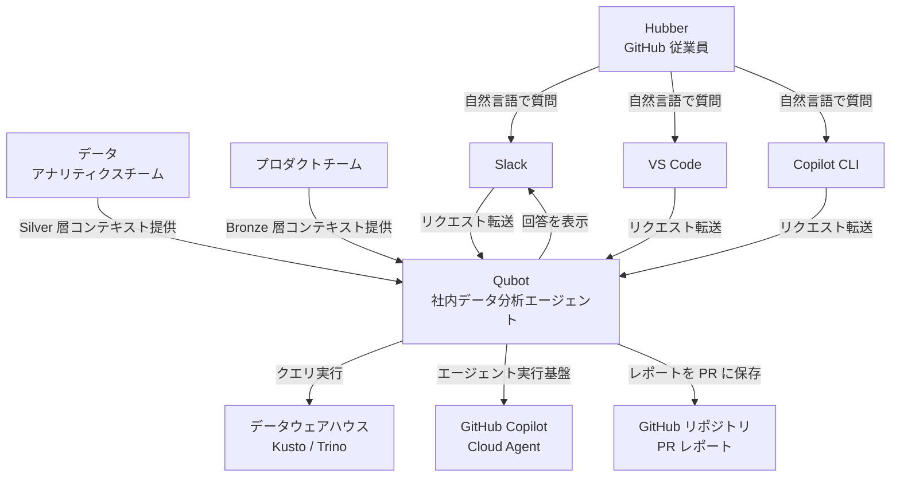
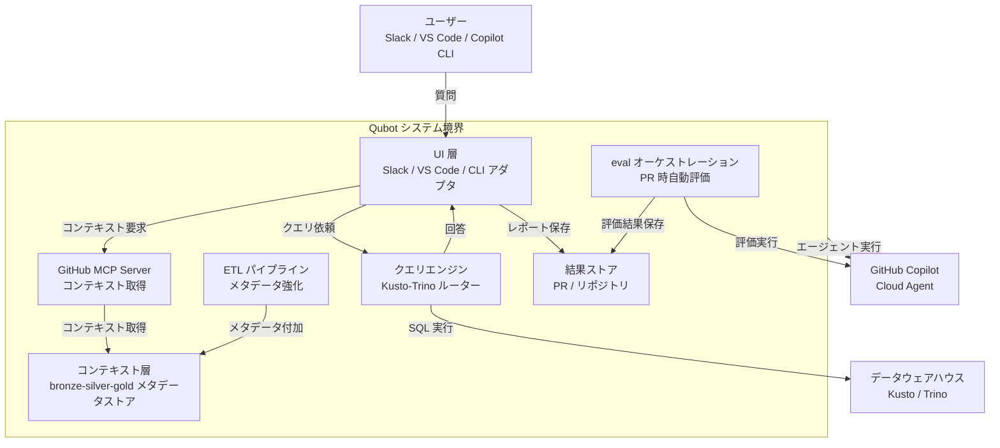
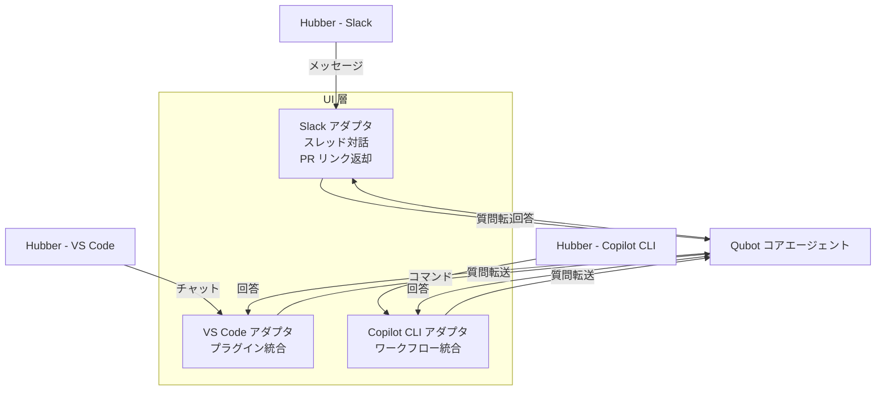
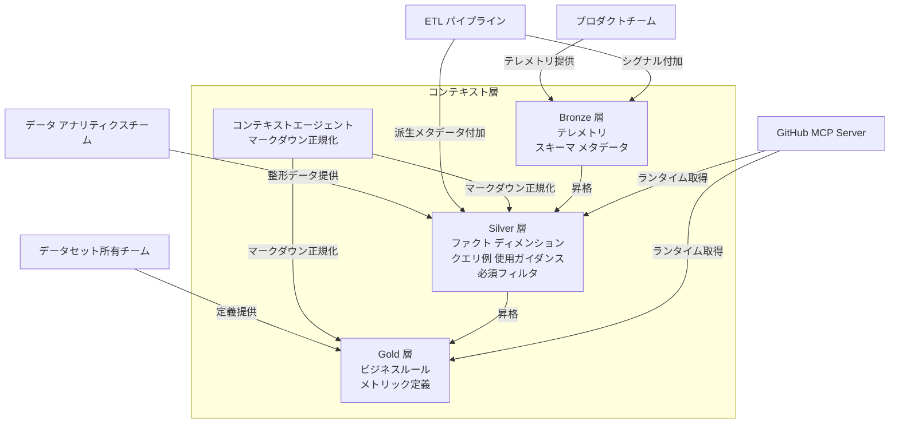
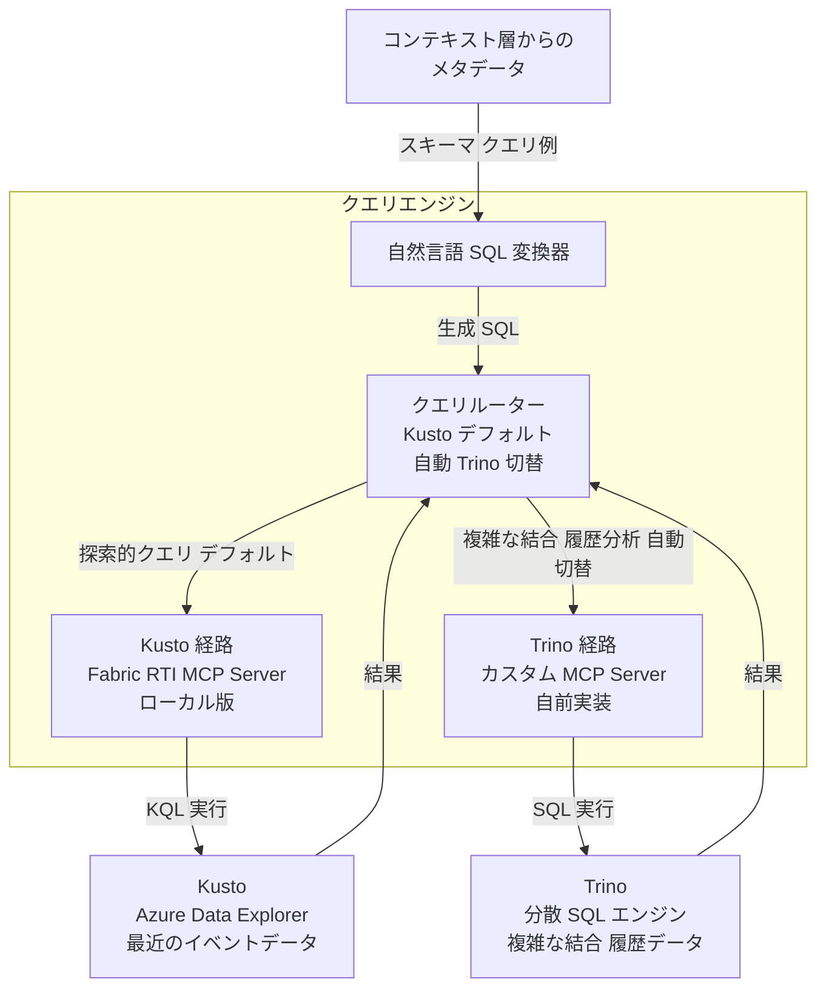
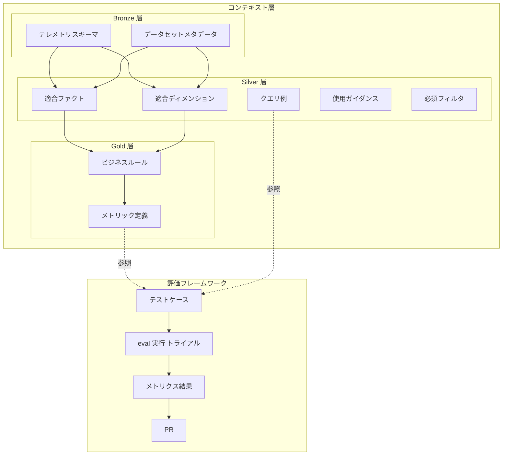
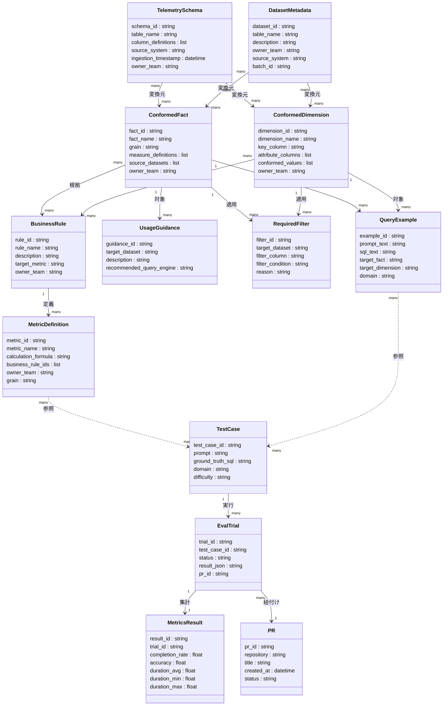

> 本記事は GitHub Blog "How we built an internal data analytics agent" を起点に、GitHub が社内向けに構築したデータ分析エージェント **Qubot** の構造・データモデル・構築・利用・運用を技術調査としてまとめたものです。Qubot は GitHub 社内システムであり一般公開されていないため、構築・利用の一部は公式記述に基づく「再現案」として明示します。

## 概要

Qubot は GitHub が社内向けに構築した Copilot 駆動のデータ分析エージェントです。GitHub 従業員（Hubbers）がデータウェアハウス内の任意のデータモデルに自然言語で質問し、秒単位で回答を得られます。実行環境は GitHub Copilot Cloud Agent（github.com 上）です。

### 背景課題

大規模データ・アナリティクス組織では、データアクセスの完全なセルフサービス化が長年の課題です。GitHub スケールでは、複数のプロダクトチームに専任アナリストを割り当てることが難しく、各チームがデータ問題を個別に解決する状況が生じていました。

Qubot はこの課題を解決するために設計されました。SQL の知識を持たない従業員でも「どのユーザーコホートが最も高い継続率を示すか」のような探索的質問を自然言語で投げ、即座に回答を得られます。ユーザー側のメンテナンスコストはゼロです。

### 位置づけ

Qubot はレポートツールでも BI ダッシュボードの代替でもありません。定型レポートの自動生成ではなく、探索的質問への動的な対話を主目的とします。

### 関連技術・類似アプローチとの比較

| アプローチ | コンテキスト保守責任 | 精度の担保方法 | スケール特性 | メンテコスト | 適するユースケース |
|---|---|---|---|---|---|
| テキスト→SQL 素朴実装 | なし（スキーマのみ） | LLM 依存、ビジネスルール未反映 | スキーマ規模に比例して精度低下 | 低（初期）→高（運用時） | PoC・小規模探索 |
| BI ダッシュボード／レポートツール | BI 管理者 | 定義済みメトリクスのみ正確 | ダッシュボード数に比例してコスト増 | 高（定義変更のたびに改修） | 定型 KPI 監視・経営レポート |
| 汎用 LLM チャットにスキーマを貼る方式 | ユーザー自身 | プロンプト精度に依存、再現性なし | コンテキスト長の制約で大規模 DW に不向き | 毎回手動、蓄積なし | 一時的な試行・個人利用 |
| Qubot（コンテキスト層 + MCP + eval） | チーム分散所有（hub-and-spoke） | 構造化コンテキスト層 + PR ゲート eval で回帰防止 | コンテキスト層が独立してスケール | 低（各チームが自分の定義のみ保守） | 探索的分析・全社セルフサービス |

### ユースケース別推奨

| ユースケース | 推奨アプローチ | 理由 |
|---|---|---|
| 探索的質問（コホート分析、異常値調査） | Qubot 型エージェント | 自然言語で即答、コンテキスト層が精度を保証 |
| 定型 KPI 監視・経営ダッシュボード | BI ツール（Tableau / Looker 等） | 定義済みメトリクスを高速・安定的に可視化 |
| 厳密な監査・コンプライアンス用途 | 手書き SQL + レビュープロセス | SQL の完全な透明性と承認フローが必要 |
| アドホック SQL 生成（個人利用） | 汎用 LLM + スキーマ貼付け | 即席利用で組織管理が不要な場合 |

## 特徴

- **コンテキスト層を first-class に**: Bronze / Silver / Gold の 3 段階キュレーションで、スキーマ情報・クエリ例・ビジネスルール・メトリック定義を構造化して保持します。ETL パイプラインが追加シグナルと派生メタデータを自動付加します。公式ブログは構造化コンテキストにより Qubot が約 3 倍高速に正解へ到達したと報告しています。
- **分散所有モデル（hub-and-spoke）**: テレメトリコンテキストはプロダクトチーム、適合ファクト／ディメンションはデータ・アナリティクスチーム、ビジネスルールはデータセット所有チームがそれぞれ保守します。各チームは自分の知識領域だけを担い、単一ツールに集約します。
- **複数インターフェース**: Slack（設定不要・推奨）、VS Code（1 コマンドインストール）、Copilot CLI の 3 経路を提供します。技術習熟度を問わず採用を促進します。
- **デフォルト Kusto → 自動 Trino 切替**: 最近のイベントデータの探索的質問には Kusto を使い、複雑な結合や履歴分析が必要な場合は自動的に Trino へ切り替えます。ユーザーがエンジンの使い分けを意識する必要はありません。
- **eval を PR で回す**: テストケース（プロンプト + ground-truth SQL + メタデータ）と自動オーケストレーション（`gh agent-task create`）で、コンテキスト変更や機能追加を本番反映前に統計的に評価します。回帰を PR 段階で検出します。
- **MCP によるランタイムコンテキスト取得**: GitHub MCP Server、Trino 用カスタム MCP Server、Kusto 向け Fabric RTI MCP Server をそれぞれ用途別に組み合わせます。

## 構造

C4 model の 3 段階（システムコンテキスト → コンテナ → コンポーネント）で Qubot の内部アーキテクチャを図解します。


### システムコンテキスト図



| 要素名 | 説明 |
|---|---|
| Hubber | GitHub 従業員。自然言語でデータに関する探索的質問を行う主要ユーザー |
| データ・アナリティクスチーム | Silver 層（整形済みコンテキスト）の保守責任を担う |
| プロダクトチーム | Bronze 層（テレメトリ・スキーマ等の生データ）の保守責任を担う |
| Qubot | 本システム。自然言語クエリを解釈し SQL を生成・実行して回答を返す |
| GitHub Copilot Cloud Agent | Qubot の実行基盤。分離された環境でエージェントを非同期実行する |
| Slack | 推奨 UI。設定不要でスレッド内に回答を表示し、PR レポートへのリンクを提供する |
| VS Code | プラグイン UI。カスタムエージェント・スキル・ツールと併用できる |
| Copilot CLI | CLI UI。ワークフローへの組み込みオプション |
| データウェアハウス | Kusto と Trino の 2 エンジン。Qubot がクエリを実行する実データ格納先 |
| GitHub リポジトリ（PR レポート） | 回答の詳細を Markdown レポートとして PR に保存する先。監査・再利用の基盤 |

### コンテナ図



| 要素名 | 説明 |
|---|---|
| UI 層 | Slack・VS Code・Copilot CLI それぞれへの入出力アダプタ群 |
| コンテキスト層 | bronze/silver/gold の 3 段階でキュレーションされたメタデータストア。エージェント精度向上の核心 |
| クエリエンジン | 自然言語から SQL を生成し Kusto と Trino にルーティングする実行コア |
| GitHub MCP Server | ランタイム時にコンテキスト層から構造化メタデータを取得する MCP インタフェース |
| eval オーケストレーション | PR 単位でテストケースを並列実行し精度・完了率・実行時間を集計する評価フレームワーク |
| ETL パイプライン | 外部シグナルや派生メタデータをコンテキスト層へ体系的に付加するデータ変換処理 |
| 結果ストア | 回答レポートおよび eval 結果を保存する PR・リポジトリ |

### コンポーネント図

#### UI 層



| 要素名 | 説明 |
|---|---|
| Slack アダプタ | スレッド内での反復対話を管理し、結果 PR へのリンクを Slack メッセージとして返す |
| VS Code アダプタ | Copilot Chat プラグインとして動作し、カスタムエージェント・スキル・ツールとの併用を可能にする |
| Copilot CLI アダプタ | CLI 経由でのワークフロー統合を提供する。単一コマンドでインストール可能 |

#### コンテキスト層



| 要素名 | 説明 |
|---|---|
| Bronze 層 | プロダクトチームが提供する生テレメトリ・スキーマ情報・メタデータを格納する最下位層 |
| Silver 層 | 適合ファクト・ディメンション・クエリ例・使用ガイダンス・必須フィルタを含む整形済み層 |
| Gold 層 | ビジネスルールとメトリック定義を含むドメインチームキュレーション済み最上位層 |
| コンテキストエージェント | 各チームからの知識提供をマークダウンテンプレートで受け取り、構造化形式に正規化して層へ格納する |

#### クエリエンジン



| 要素名 | 説明 |
|---|---|
| 自然言語 SQL 変換器 | コンテキスト層のメタデータ（スキーマ・クエリ例）を参照しながら自然言語を SQL に変換する |
| クエリルーター | Kusto をデフォルトとし、複雑な結合や履歴分析が必要と判断した場合に自動で Trino へ切り替える |
| Kusto 経路 | Fabric RTI MCP Server のローカルデプロイ版を通じて Kusto（Azure Data Explorer / Fabric Eventhouse）に接続する |
| Trino 経路 | Qubot チームが自前実装したカスタム MCP Server を通じて Trino 分散 SQL エンジンに接続する |

## データ

### 概念モデル

Qubot のデータを構成するエンティティと、その所有・利用関係を示します。



所有関係の補足を示します。

| 層 | 保守責任者 |
|---|---|
| Bronze | プロダクトチーム |
| Silver | データ・アナリティクスチーム |
| Gold | データセット所有チーム（各事業ドメイン） |

### 情報モデル（再現用の推定モデル）

主要エンティティの属性と多重度を示します。公式ブログにここまで詳細なデータモデルの記載はありません。以下は記事記述から再現用に推定したモデルであり、**属性だけでなく関連・多重度も推測**を含みます。記事に明示されていない属性は「※推測」と注記します。



属性の根拠と注記を示します。

| エンティティ | 属性の根拠 |
|---|---|
| TelemetrySchema | 記事「Bronze: telemetry context, schema information」から導出。`ingestion_timestamp` / `batch_id` は medallion 標準（※推測） |
| DatasetMetadata | 記事「Bronze: metadata contributed by product teams」から導出。`source_system` / `batch_id` は medallion 標準（※推測） |
| ConformedFact | 記事「Silver: conformed facts」から導出。`grain` / `measure_definitions` は Kimball 標準（※推測） |
| ConformedDimension | 記事「Silver: conformed dimensions」から導出。`conformed_values` / `key_column` は Kimball 標準（※推測） |
| QueryExample | 記事「Silver: examples of queries」から導出。`target_fact` / `target_dimension` は（※推測） |
| UsageGuidance | 記事「Silver: usage guidance」から導出。`recommended_query_engine` は（※推測） |
| RequiredFilter | 記事「Silver: mandatory filters」から導出。`filter_column` / `filter_condition` は（※推測） |
| BusinessRule | 記事「Gold: business rules owned by subject teams」から導出 |
| MetricDefinition | 記事「Gold: metric definitions」から導出。`grain` / `calculation_formula` は（※推測） |
| TestCase | 記事「curated prompts, ground-truth SQL, metadata (domain, difficulty)」から直接引用 |
| EvalTrial | 記事「parallel trials, JSON result saving, completion polling」から導出 |
| MetricsResult | 記事「completion rate, accuracy, duration」から直接引用。`duration_min` / `duration_max` は（※推測） |
| PR | 記事「PR-based offline evaluation, results saved as markdown report to PR」から導出 |

## 構築方法

> Qubot は GitHub 社内システムであり、一般公開されていません。本セクションは公式ブログ記事に基づく「同等の社内データ分析エージェントを再現するための構成手順」です。Qubot 固有で公開されていない実装部分は「記事記述に基づく再現案」と明示します。

### コンテキスト層（Bronze / Silver / Gold）の整備

公式ブログは、データウェアハウス内のデータを raw events / conformed facts and dimensions / curated datasets という成熟度に分け、それぞれに対応した context knowledge（federated context layer）を持つと説明しています。本記事ではこの 3 区分を medallion アーキテクチャの Bronze / Silver / Gold に対応づけて整理します。なお、以下の「ETL による昇格パイプライン」としての記述は、公式記述を実装に落とすための再現案です。

| 層 | 内容 | 保守責任 | 整備方針 |
|---|---|---|---|
| Bronze（生データ） | テレメトリコンテキスト、スキーマ情報、メタデータ | プロダクトチーム | テーブル定義・カラムコメントをそのまま収録 |
| Silver（整形済み） | ファクト/ディメンション定義、クエリ例、使用ガイダンス、必須フィルタ | データ・アナリティクスチーム | ETL でシグナルを追加し構造化コンテキストとして保存 |
| Gold（キュレーション済み） | ビジネスルール、メトリック定義 | データセット所有チーム | チームが標準テンプレートで定義を提供し、コンテキストエージェントが正規化 |

整備の考え方を示します（記事記述に基づく再現案）。

1. 各プロダクトチームが Bronze 層にテーブルスキーマとメタデータを登録します。
2. ETL パイプラインが Bronze を読み込み、クエリ例・使用ガイダンス・必須フィルタを付加して Silver 層を生成します。
3. データセット所有チームが Silver をもとにビジネスルールとメトリック定義を記述し、Gold 層として確定します。
4. コンテキストエージェントが各チームからの投入物を取り込み、エージェントが利用しやすい統一フォーマットに正規化します。

```text
[Bronze: raw schema + telemetry metadata]
        ↓ ETL (query examples, usage guidance, required filters)
[Silver: structured facts/dimensions]
        ↓ team-curated business rules + metric definitions
[Gold: canonical context for agent]
        ↓ context agent normalizes & indexes
[MCP Server context retrieval at runtime]
```

公式ブログは「構造化・キュレーションされたコンテキストが精度を向上させるだけでなく、応答速度を約 3 倍改善した」と述べています。コンテキスト整備がエージェント品質の核心です。

### GitHub MCP Server のセットアップ

Qubot のコンテキスト層は GitHub 上のリポジトリに Markdown 等で永続化されます。GitHub MCP Server は、その context リポジトリ（およびリポジトリ・Issue・PR）を読む汎用 MCP として機能します。Qubot 専用のメタデータ API ではなく、「GitHub 上の context リポジトリを読む経路」と捉えてください。リモートモードとローカルモードの 2 種類があります。

前提条件を示します。

- GitHub アカウント（Copilot サブスクリプション付き）
- VS Code 1.101 以上（リモートモード使用時）

#### リモートモード（推奨）

追加インストール不要です。VS Code の `settings.json` に以下を追記します。

```json
{
  "mcp": {
    "servers": {
      "github": {
        "type": "http",
        "url": "https://api.githubcopilot.com/mcp/"
      }
    }
  }
}
```

PAT 認証を使う場合は `Authorization` ヘッダを追加します。

```json
{
  "mcp": {
    "servers": {
      "github": {
        "type": "http",
        "url": "https://api.githubcopilot.com/mcp/",
        "headers": {
          "Authorization": "Bearer ${input:github_mcp_pat}"
        }
      }
    }
  }
}
```

#### ローカルモード（Docker）

リモート MCP が利用できない環境向けです。

```bash
docker run -i --rm \
  -e GITHUB_PERSONAL_ACCESS_TOKEN=<your-token> \
  ghcr.io/github/github-mcp-server
```

VS Code の `settings.json` に以下を追記します。

```json
{
  "mcp": {
    "servers": {
      "github": {
        "command": "docker",
        "args": [
          "run", "-i", "--rm",
          "-e", "GITHUB_PERSONAL_ACCESS_TOKEN",
          "ghcr.io/github/github-mcp-server"
        ],
        "env": {
          "GITHUB_PERSONAL_ACCESS_TOKEN": "${input:github_token}"
        }
      }
    }
  }
}
```

主要な環境変数を示します。

| 変数名 | 用途 | 必須 |
|---|---|---|
| `GITHUB_PERSONAL_ACCESS_TOKEN` | 認証トークン | 必須 |
| `GITHUB_HOST` | GitHub Enterprise Server 向けホスト | 任意 |
| `GITHUB_TOOLSETS` | 有効にするツールセット（カンマ区切り） | 任意 |

PAT に付与するスコープは用途に応じた最小権限にします。

### Trino 用 MCP Server の接続

Qubot は複雑な結合・履歴分析に Trino を使用し、カスタム MCP Server を自前実装しています。再現案として OSS 実装を活用する構成を示します。

前提条件を示します。

- Python 3.10 以上
- `uv` パッケージマネージャ
- 稼働中の Trino クラスタ

`.env` ファイルを作成します。

```bash
TRINO_HOST=your-trino-host
TRINO_PORT=8080
TRINO_USER=trino
TRINO_CATALOG=your_catalog
TRINO_SCHEMA=your_schema
TRINO_HTTP_SCHEME=http
# TRINO_PASSWORD=  # 認証が必要な場合のみ
```

VS Code の `settings.json` に以下を追記します。

```json
{
  "mcp": {
    "servers": {
      "trino": {
        "command": "uv",
        "args": [
          "run", "--with", "mcp[cli]",
          "--with", "trino",
          "--with", "loguru",
          "mcp", "run", "/path/to/src/server.py"
        ],
        "envFile": "/path/to/.env"
      }
    }
  }
}
```

提供されるツール名は採用する OSS 実装によって異なります（例: カタログ一覧、スキーマ一覧、テーブル定義取得、SQL 実行など）。Qubot 本体の Trino MCP Server は GitHub 社内のカスタム実装であり非公開のため、ツール名は不明です。再現する場合は採用する OSS 実装（`txn2/mcp-trino` 等）の README で正確なツール名・設定例を確認し、それに合わせてください。

### Fabric RTI MCP Server（Kusto 向け）の接続

Qubot は最近のイベントデータの探索に Kusto（Azure Data Explorer / Microsoft Fabric Eventhouse）を使用し、Fabric RTI MCP Server のローカル版をデプロイしています。

前提条件を示します。

- Python 3.10 以上
- `uv` パッケージマネージャ
- Azure CLI でログイン済み（`az login`）
- Microsoft Fabric または Azure Data Explorer クラスタへのアクセス権

インストール手順を示します。

```bash
pip install microsoft-fabric-rti-mcp
# または uv を使う場合
uvx microsoft-fabric-rti-mcp
```

VS Code の `settings.json` に以下を追記します。

```json
{
  "mcp": {
    "servers": {
      "fabric-rti-mcp": {
        "command": "uvx",
        "args": ["microsoft-fabric-rti-mcp"],
        "env": {
          "KUSTO_SERVICE_URI": "https://your-cluster.region.kusto.windows.net",
          "KUSTO_SERVICE_DEFAULT_DB": "YourDatabase"
        }
      }
    }
  }
}
```

主要な環境変数を示します。

| 変数名 | 用途 | 例 |
|---|---|---|
| `KUSTO_SERVICE_URI` | Kusto クラスタのエンドポイント | `https://mycluster.westus.kusto.windows.net` |
| `KUSTO_SERVICE_DEFAULT_DB` | デフォルトデータベース | `EventsDB` |

認証には `DefaultAzureCredential` を使用します。環境変数・Azure CLI・開発ツールの資格情報の順で自動的に試行されるため、`az login` 済みであれば追加設定は不要です。

利用可能な主要ツール（microsoft/fabric-rti-mcp README に基づく）を示します。

| ツール名 | 機能 |
|---|---|
| `kusto_query` | KQL クエリを実行 |
| `kusto_list_entities` | データベース・テーブル等のエンティティを一覧表示 |
| `kusto_describe_database` | データベースのスキーマ情報を取得 |
| `kusto_sample_entity` | テーブルのサンプルデータを参照 |
| `kusto_get_shots` | 類似クエリをセマンティック検索（few-shot 用） |

Fabric RTI MCP のツール名・引数は更新が続いています。実際の名称は導入時点の公式リポジトリ（microsoft/fabric-rti-mcp）の README で確認してください。

### VS Code プラグイン / Slack / Copilot CLI の導入

#### VS Code — Copilot 拡張のインストール

1. VS Code の拡張機能パネルを開きます。
2. 「GitHub Copilot」と「GitHub Copilot Chat」を検索してインストールします。
3. GitHub アカウントでサインインします（Copilot サブスクリプションが必要）。
4. Agent モードを有効にすると、上記で設定した MCP サーバーが自動的に読み込まれます。

#### Slack — GitHub App の導入

公式ブログでは Qubot は専用の「Qubot Slack channel」として提供され、設定不要で使える推奨経路です。以下は同等の体験を再現する案として、GitHub Copilot 公式の Slack 連携（cloud agent の Slack 統合）を使う手順です。

1. Slack ワークスペースに「GitHub App for Slack」をインストールします。
2. Slack で GitHub App との DM を開くか、任意チャンネルで `@GitHub Copilot` をメンションします。
3. 初回アクセス時に GitHub アカウントの連携と、PR 作成先のデフォルトリポジトリを設定します。
4. 以降は DM またはチャンネルスレッドで自然言語の質問を送ると、Copilot エージェントが応答します。

対象リポジトリへの write アクセスが必要です。Enterprise では管理者による GitHub App の設定が必要です。

#### Copilot CLI のインストール

```bash
# npm（公式パッケージ）
npm install -g @github/copilot
```

認証手順を示します。

```bash
copilot
# 起動後に /login を入力して GitHub 認証
```

## 利用方法

必須パラメータを示します。

| インターフェース | 必須パラメータ | 説明 |
|---|---|---|
| Slack | GitHub App のインストール済み Slack ワークスペース | DM または `@GitHub Copilot` メンション |
| VS Code | Copilot サブスクリプション + MCP 設定 | Agent モードで使用 |
| Copilot CLI | `/login` による GitHub 認証 | `copilot` コマンドで起動 |
| `gh agent-task` | `gh` CLI（最新版） + Copilot サブスクリプション | 対象リポジトリへのアクセス権 |

### Slack スレッドでの自然言語質問

Slack は設定不要で使い始められる推奨インターフェースです。

```text
どのユーザーコホートが最も高い継続率を示していますか？
```

```text
先月の機能 X の利用数を四半期前と比較してください。
```

エージェントの回答に対してスレッド内で追加質問を送ると、前の文脈を引き継いで回答します。

```text
[スレッド内]
> 上記のクエリを地域別に分解してください。
```

回答は Slack スレッドに直接表示されます。詳細なレポートは Markdown 形式の PR として保存されるため、後から参照・共有できます。

### VS Code でのコマンド実行

Copilot Chat の Agent モードで MCP サーバー経由のクエリを実行します。

1. コマンドパレット（`Ctrl+Shift+P` / `Cmd+Shift+P`）を開きます。
2. 「Copilot Chat」を起動し、Agent モードに切り替えます。
3. チャットパネルに質問を入力します。

```text
過去 7 日間のアクティブユーザー数をコホート別に集計してください
```

### Copilot CLI 経由での実行

```bash
# CLI を起動
copilot

# ログイン（未認証の場合）
/login

# データ分析タスクを実行
先週の主要メトリクスを取得してください
```

### `gh agent-task create` でのオフライン eval 実行

Qubot の評価フレームワークでは、`gh agent-task create` コマンドを使って PR マージ前にエージェントの品質を測定します。

`gh agent-task` は 2025-09 に GitHub CLI から Copilot coding agent セッションを起動・追跡する機能として追加されました。利用には Copilot coding agent が有効な GitHub Copilot プランが必要です。対応プラン・GA 状況は公式 Changelog および GitHub Docs で確認してください。`view` はタスク ID（PR 番号またはタスク UUID）を受け付けます。

基本コマンドを示します。

```bash
# 新しいエージェントタスクを作成（eval スクリプトを指示として渡す）
gh agent-task create "run evaluation suite against PR #123 using test cases in ./eval/cases.json"

# タスク一覧を表示
gh agent-task list

# タスクの詳細・ログを確認（PR 番号またはタスク UUID を指定）
gh agent-task view 1234
```

テストケースのスキーマ例を示します（再現案）。

```json
{
  "test_case_id": "cohort_retention_001",
  "prompt": "どのユーザーコホートが最も高い継続率を示しますか？",
  "ground_truth_sql": "SELECT cohort, retention_rate FROM gold.user_retention WHERE deleted = 0",
  "domain": "growth",
  "difficulty": "medium"
}
```

eval ワークフローを示します（記事記述に基づく再現案）。

```bash
# 1. テストケース（プロンプト + ground-truth SQL）を用意
ls ./eval/cases/
# → domain_cohort_analysis.json
# → difficulty_hard_join.json

# 2. eval スクリプトを agent-task 経由で並列実行
for case in ./eval/cases/*.json; do
  gh agent-task create "evaluate qubot with test case: $(cat $case)"
done

# 3. 全タスクの完了を確認
gh agent-task list

# 4. 各エージェントが保存した結果 JSON を収集してメトリクスを集計
#    （結果はエージェントがリポジトリ/PR に JSON として書き出す前提。
#     ターミナルから取得する場合は `gh agent-task view <id> --json` 等で形式を確認する）
jq -s '{completion_rate: ([.[] | select(.status=="completed")] | length) / (length)}' results/*.json
```

eval のフロー概要を示します。

```text
[PR 作成]
    ↓
[gh agent-task create でテストケースを N 並列実行]
    ↓
[完了をポーリング]
    ↓
[JSON 結果を収集 → 統計集計スクリプトで completion rate / accuracy / duration を算出]
    ↓
[メトリクスを PR に反映 → レビュー・マージ判断]
```

新しいコンテキストはコンテキスト層への PR として追加し、この eval フローで品質を確認してからマージします。eval 結果は JSON で保存し、設定間の比較に使います。

## 運用

### コンテキスト層の保守責任

Qubot のコンテキスト層は 3 層に分かれ、各層の保守責任者が明確に分離されています。

| 層 | 保守責任者 | 主な更新内容 |
|---|---|---|
| Bronze | プロダクトチーム | スキーマ定義・テレメトリメタデータの追加・変更 |
| Silver | データ・アナリティクスチーム | クエリ例・使用ガイダンス・必須フィルタの整備 |
| Gold | データセット所有チーム（ドメインチーム） | ビジネスルール・メトリック定義の追加・改訂 |

この分散型オーナーシップにより、データ・アナリティクスチームへの問い合わせ集中を防ぎます。各チームが自身の知識ドメインを直接管理し、コンテキストエージェントが標準テンプレートまたはリポジトリ参照経由で取り込みを自動化します。

### ETL によるコンテキスト強化

ETL パイプラインが継続的にコンテキスト層を強化します。

- **追加シグナルの付加**: クエリログ・アクセスパターンなどの利用実績から派生メタデータを生成します。
- **正規化**: コンテキストエージェントが各チームの投稿内容を統一フォーマットに変換します。
- **スケジュール更新**: スキーマ変更や新規データモデル追加のたびに Bronze 層を更新し、下流の Silver・Gold に変更を伝播します。

### eval を PR ゲートとして回す CI 運用

コンテキスト層の変更はすべて PR 経由で eval を通過してからマージします。

```text
[PR 作成]
  ↓
[gh agent-task create でジョブ起動]
  ↓
[並列トライアル実行]
  ↓
[完了ポーリング]
  ↓
[JSON 結果ファイル保存]
  ↓
[統計集約・メトリクス算出]
  ↓
[PR レビュー・マージ判定]
```

eval の構成要素を示します。

| 要素 | 内容 |
|---|---|
| テストケース | プロンプト・ground-truth SQL・メタデータ（ドメイン・難度）のキュレーション済みデータセット |
| オーケストレーション | `gh agent-task create` でスクリプトを起動、並列トライアル、完了ポーリング、JSON 結果ログ |
| メトリクス | 完了率（completion rate）・精度（accuracy）・実行時間（duration） |

コンテキスト層の変更が既存クエリの精度を下げていないかをシップ前に検出します。

### メトリクス監視

| 指標 | 閾値の考え方 |
|---|---|
| 完了率 | クエリに対して回答が返せた割合。前週比 5% 超低下または絶対値が基準未満でコンテキスト更新を優先する（閾値は再現案） |
| 精度 | ground-truth との結果一致率。前週比 3% 超低下でドメイン別内訳を確認し Gold 層の定義を見直す（閾値は再現案） |
| 実行時間 | P95 が通常比 2 倍超でクエリエンジン選択の不適合またはコンテキスト量過多を疑う（閾値は再現案） |

completion rate が基準値（例: 0.90）未満、または前回 PR より精度が低下した場合にマージをブロックする運用が考えられます。閾値はドメイン・難度別に分けて設定すると安定します（PR ゲートの合否例・再現案）。

## ベストプラクティス

### 1. コンテキストを first-class 成果物として扱う

コンテキスト資産（Silver 層のクエリ例・使用ガイダンス・必須フィルタ）を、データモデリングの副産物ではなく主要な配信物として設計します。公式ブログは、これまで事後的だったアナリティクスエンジニアリングのコンテキスト成果物を first-class citizen（第一級の成果物）としてデータモデリングに組み込むべきだと述べています。データモデル変更時は必ずコンテキストも同時に更新するプロセスを組み込みます。

### 2. 必須フィルタと使用ガイダンスを Silver に集約する

Bronze のスキーマだけでは LLM が適切なフィルタ条件を推論できません。Silver 層に以下を明示的に記載します。

- `WHERE deleted = 0` 等の必須フィルタ条件
- ファクトテーブルとディメンションテーブルの推奨結合パターン
- メトリックの計算方法（例: `active_users` の定義）

### 3. デフォルトエンジン選択をユーザーから隠蔽する

クエリエンジンの使い分けをユーザーに強制しません。Qubot の設計では Kusto をデフォルトとし、複雑な結合や履歴分析が必要と判断した場合に自動で Trino へ切り替えます。ユーザーはエンジンを意識せず質問できます。

### 4. ゼロ設定インターフェースを採用の入口にする

Slack インターフェースは設定不要で使い始められます。技術知識が高いユーザーでも、最初の採用障壁を下げるためにゼロ設定オプションを提供します。VS Code プラグインや Copilot CLI は、より高度な利用者向けの追加選択肢として位置づけます。

### 5. 分散知識を hub-and-spoke で集約する

各チームが持つ独自の定義・ルールを個別ツールに閉じ込めず、Qubot という単一ハブに集約します。各チームは自身のドメイン知識を Silver・Gold 層へ投稿し、全社がそれを参照します。これによりデータ・アナリティクスチームへの問い合わせ集中が解消されます。

### 6. 回答を PR として保存し監査性と再現性を確保する

Slack で得た回答を markdown レポートとして PR に自動保存します。これにより以下を実現します。

- 過去の分析結果を再参照・再利用できます。
- 誤った回答を発見した場合に ground-truth として eval セットへ登録できます。
- 保存時にコンテキスト・モデルのバージョンを併記すれば、どの条件で生成した回答かを追跡できます（再現案）。

## トラブルシューティング

text-to-SQL / データ分析エージェントで頻出する失敗を症状・原因・対処の順に示します。

| 症状 | 推定原因 | 対処 |
|---|---|---|
| 結合が正しくなく件数が膨れる / 欠損する | Silver 層に推奨結合パターンが未記載。LLM がブリッジテーブルを見つけられない | Silver にファクト-ディメンション間の結合例を明示する |
| 必須フィルタが欠落し全件を集計する | Bronze のスキーマのみで必須条件が記載されていない | Silver に必須フィルタ（例: `WHERE status = 'active'`）を必須ガイダンスとして記載する |
| メトリック定義が取り違えられ誤った値を返す | Gold 層のビジネスルールが未整備、または古い定義が残存する | Gold 層のメトリック定義を最新化し、誤解しやすい類義語を併記する |
| 存在しないカラム・テーブル名が SQL に出現する（ハルシネーション） | コンテキストにスキーマ情報が不足し、LLM が推測で補完する | Bronze のスキーマメタデータを完全に記載する。eval で定期的にハルシネーション率を計測する |
| Kusto で実行されるべきクエリが Trino で実行され遅い（またはその逆） | クエリエンジン選択ロジックがデータの新旧・結合複雑度を誤判定する | Silver に「このデータセットは Kusto 向け / Trino 向け」の明示的なガイダンスを追加する |
| 以前は正しく答えられた質問に誤答するようになった（コンテキスト陳腐化） | データモデル変更後にコンテキスト層が更新されていない（スキーマドリフト） | データモデル変更時に Bronze → Silver → Gold の更新をリリースプロセスに組み込む。eval の精度低下時点でコンテキスト更新を優先する |
| eval の精度が PR ごとに不安定でレビュー判断が難しい | テストケースが少なく、難度の偏りがある | テストケースをドメイン・難度別に分類してキュレーションし、各カテゴリで精度を個別に追跡する |

コンテキスト陳腐化による誤答は、SQL 文法エラーとは異なり「技術的に正しいが意味的に間違い」な結果を返します。通常のデータ品質監視では検出できないため、eval による定期的な精度計測が有効な検出手段です（一般的なベストプラクティス）。

## まとめ

GitHub の社内データ分析エージェント Qubot は、エージェントの精度をモデルやプロンプトではなく、Bronze / Silver / Gold の 3 段階で各チームが分散保守する「コンテキスト層」と、`gh agent-task` による PR ゲート型のオフライン eval に置いています。コンテキストを first-class 成果物として設計し、MCP でランタイム取得・Kusto/Trino を自動使い分けする構造は、社内 RAG・データ分析エージェントを本番運用する組織にとって再利用価値の高い設計パターンです。

この記事が少しでも参考になった、あるいは改善点などがあれば、ぜひリアクションやコメント、SNSでのシェアをいただけると励みになります！

## 参考リンク

- 公式ドキュメント
  - [How we built an internal data analytics agent - GitHub Blog](https://github.blog/ai-and-ml/github-copilot/how-we-built-an-internal-data-analytics-agent/)
  - [About GitHub Copilot cloud agent - GitHub Docs](https://docs.github.com/en/copilot/how-tos/use-copilot-agents/cloud-agent)
  - [Integrate cloud agent with Slack - GitHub Docs](https://docs.github.com/en/copilot/how-tos/use-copilot-agents/cloud-agent/integrate-cloud-agent-with-slack)
  - [Install Copilot CLI - GitHub Docs](https://docs.github.com/en/copilot/how-tos/set-up/install-copilot-cli)
  - [Copilot CLI overview - GitHub Docs](https://docs.github.com/en/copilot/how-tos/copilot-cli/use-copilot-cli/overview)
  - [Fabric RTI MCP overview - Microsoft Learn](https://learn.microsoft.com/en-us/fabric/real-time-intelligence/mcp-overview)
  - [Integrate MCP servers with Azure Data Explorer - Microsoft Learn](https://learn.microsoft.com/en-us/azure/data-explorer/integrate-mcp-servers)
  - [Conformed Dimension - Kimball Group](https://www.kimballgroup.com/data-warehouse-business-intelligence-resources/kimball-techniques/dimensional-modeling-techniques/conformed-dimension/)
- GitHub
  - [github/github-mcp-server](https://github.com/github/github-mcp-server)
  - [microsoft/fabric-rti-mcp](https://github.com/microsoft/fabric-rti-mcp)
  - [What is MCP - GitHub Resources](https://github.com/resources/articles/what-is-mcp-model-context-protocol)
  - [microsoft-fabric-rti-mcp - PyPI](https://pypi.org/project/microsoft-fabric-rti-mcp/)
- 記事
  - [Kick off and track Copilot coding agent sessions from the GitHub CLI - GitHub Changelog](https://github.blog/changelog/2025-09-25-kick-off-and-track-copilot-coding-agent-sessions-from-the-github-cli/)
  - [Model Context Protocol Specification](https://modelcontextprotocol.io/specification/2025-03-26/architecture)
  - [Trino MCP server (imti.co)](https://imti.co/mcp-trino/)
  - [Medallion Architecture: Bronze, Silver and Gold Layers - dataforest.ai](https://dataforest.ai/blog/medallion-architecture)
  - [Why text-to-SQL fails - omni.co](https://omni.co/blog/why-text-to-sql-fails)
  - [The six failures of text-to-SQL and how to fix them with agents - Google Cloud](https://medium.com/google-cloud/the-six-failures-of-text-to-sql-and-how-to-fix-them-with-agents-ef5fd2b74b68)
  - [Context drift detection - atlan.com](https://atlan.com/know/context-drift-detection/)
  - [Text-to-SQL evaluation techniques - Ragas docs](https://docs.ragas.io/en/stable/howtos/applications/text2sql/)
