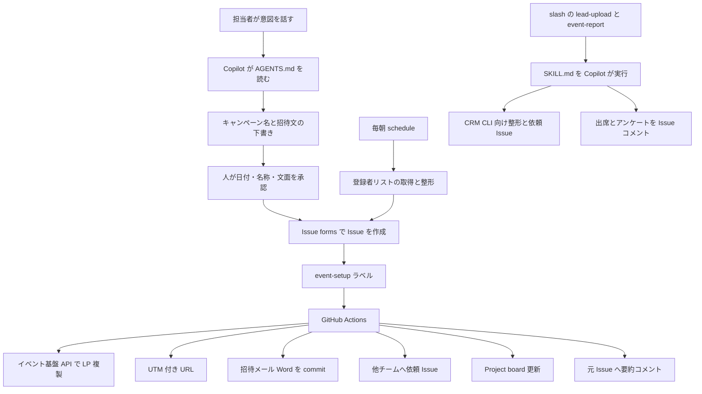
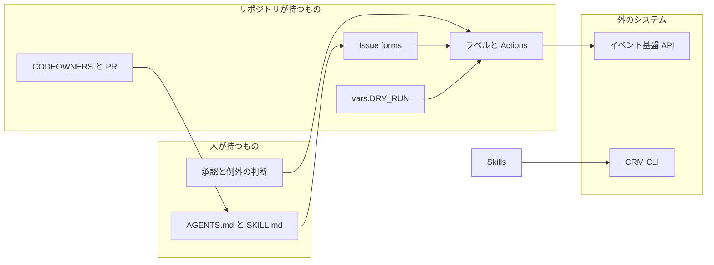

2026-09-11、GitHub Blog に [Marketing ops as code: Automating events from planning to follow-up on GitHub](https://github.blog/ai-and-ml/github-copilot/marketing-ops-as-code-automating-events-from-planning-to-follow-up-on-github/) が公開されました。著者は日本・韓国マーケティング担当の Tomoko Tanaka 氏（[@tomokota](https://github.com/tomokota)）です。本稿で扱うのは GitHub 社員による社内実践の自己報告であり、記事公開時点で構成ファイルの公開リンクはありません。

読者が得るものは、1イベントを Issue に載せる外形、ラベルで Actions を起動し Skills で後処理する役割分担、公式ドキュメントと突き合わせたときに残る穴、導入するなら置く検収条件です。

*この記事の全体像。以下、順に解説します。*

## Issue・Actions・Skillsによるイベント運用とは

GitHub の日本・韓国マーケティング担当が、APAC のイベント業務を GitHub リポジトリ上の運用にした事例です。1イベントを 1 Issue にし、Issue forms で入力を揃え、ラベルで GitHub Actions を起動し、開催後の可変手順を Copilot の `SKILL.md` として実行します。計画の会話はリポジトリ直下の `AGENTS.md` がキャンペーン命名・会計四半期・タイムゾーン・招待文の型を与えます。イベント基盤は API、CRM は公式 CLI（ブラウザ認証）を使います。著者はコードを書かず runbook を Copilot に渡した、と書いています。

業務単位は GitHub Issue です。GitHub マーケではプロジェクトごとに Issue を開く習慣が先にあり、著者は Issue に作業を実行させました。

Issue forms が申請フォームです。イベント名、日付、地域、キャンペーン名、対象読者を揃えます。ウェビナーと対面でフォームを分け、同じ機械に流します。

ラベルが実行スイッチです。`event-setup` が着くと Actions が Issue body を parse します。`event-setup` で行うことは次です。

- ランディングページの複製
- チャネル別 UTM
- 招待メールを Word として commit
- 送信チームと地域マーケへの依頼 Issue
- Project board 投入
- 元 Issue への要約コメント

登録スクリーニングはラベルではなく毎朝の `schedule` です。invite-only は waitlist を基準で審査します。

開催後は `/lead-upload` と `/event-report` です。出席者の CRM 向け整形と、メトリクス・アンケートの Issue コメントです。可変な後処理は Skills（Markdown の手順）です。市場ごとに follow-up が違うため固定 pipeline にしない、と著者は書いています。新 Skills は pull request です。`CODEOWNERS` が maintainer へレビューを回します。

`DRY_RUN` は repository variable です。全 workflow が実行前に見る、と著者は書いています。on なら外部システムに触れません。自作のガードとして、DRY_RUN、PR ごとのテスト、すべての変更の code review を挙げています。プラットフォーム付属として著者が挙げるものは、secret scanning の push protection、Copilot Business のプロンプト方針、組織ポリシーによるモデル選択です。

入口は Copilot CLI から Copilot app へ移し、「ターミナルが使える」から「入力できる」へ下げた、と書いています。分業の定義は、Copilot が下書きし、人が決める、です。キャンペーン名、件名、日付は sign-off 後に Issue が立ちます。

会話で入力を揃え、ラベルで副作用を起こし、Skills で市場差のある後処理をします。監視は記事時点では後追いの宿題です。

レイヤの役割は次のとおりです。

## 注意点

公開されたのは到達宣言です。構成ファイルの公開リンクは無く、確認した公開範囲でも YAML / `SKILL.md` / `CODEOWNERS` の実体は見つかりません。社内 private や、組織所有の別公開先の存在は否定しません。第三者は権限設計と失敗時挙動を検証できません。

時間と件数はすべて自己申告です。「手作業は a couple of days」「ラベル後は a few minutes（以前は better part of a day）」「キャンペーン名に 15 の下流レポートが依存」「朝の screening が 5 日サイレント失敗」に、期間・サンプル・計測方法は付いていません。記事の時間短縮を KPI 根拠にはできません。

著者は第一キャリアが Linux 上のデータベース運用だと書いています。被験者は元エンジニアかつ製品ベンダー社員です。「非開発部門が手順を書けば同じことができる」への外挿は、当該ブログ単体では支持されません。

「business plans don’t retain prompts or use them to train models」は公式と完全一致しません。公式は Copilot Business / Enterprise の顧客データをモデル訓練に使わない、と OpenAI との zero data retention 契約を書いています。保持ゼロはモデル別です。Claude Fable 5 / 5.1 は prompts と outputs を既定で保持し、ZDR は申請と期限付き免除です。Copilot Memory と CLI のセッション同期は別の保持経路です。

push protection のリポジトリ型は GitHub Secret Protection が必要で既定オフです。ユーザー型は public への push が対象です。記事の「ガードレールは最初からあった」は GitHub 社内設定の話です。

Issue forms は公式に public preview です。

## 公式の実体との対応

記事の言い方と、GitHub Docs 上の実体は次のように対応します。

| 記事の言い方 | 公式の実体 | ずれる点 |
|---|---|---|
| Issue forms は申請フォーム | `/.github/ISSUE_TEMPLATE` の YAML。回答は Issue body の Markdown | preview。存在しないラベルは自動付与されない |
| ラベルはスイッチ | `on: issues: types: [labeled]`。workflow は default branch 必須 | ラベルを付けられる権限者が発火者になる |
| Actions が機械 | ラベルと `schedule` | `schedule` は高負荷で遅延し、queued jobs が drop しうる |
| Skills は Markdown の手順 | Agent skills。`.github/skills` 等の `SKILL.md` | cloud agent / code review / CLI / app / IDE agent mode 向け。Actions の決定的ジョブではない |
| DRY_RUN は repository variable | configuration variable。`vars` コンテキスト。未設定は空文字 | write 保持者が設定画面から変更できる。未参照 workflow を公式は止めない |
| CODEOWNERS がレビューを回す | 該当パスの PR で review request | 必須化は branch protection / ruleset の "Require review from Code Owners"。複数 owner なら 1 人の approval で足りる |

3 primitive の役割分担は、Issue forms・`issues: labeled`・Agent skills の公式と矛盾しません。API または CLI があれば同じパターンが使える、と著者自身が適用条件を書いています。計画を完全自動にせず、会話と人の sign-off を入力ゲートにしている点も、公開されたスナップショットとして一貫しています。

一方で、確認した公開範囲では実ファイル未発見です。再現は文章からの再実装になります。Skills の PR 審査は文章レビューです。同じ `SKILL.md` でもモデルと文脈で結果が揺れます。CODEOWNERS ファイルがあることと、異動後も直せる強制レビューは別物です。on-call の記述はありません。HubSpot Marketing Events、Marketo REST、Salesforce Marketing Cloud REST は公開 API を持ちます。自前 GitHub はツール欠如の必然ではありません。`issues: labeled` は triage 権限でも発火しえます。外部 API への副作用があるスイッチとしては、権限設計が本文にありません。

## 朝の失敗が5日静かだった理由

著者が確定している事実は次だけです。朝の screening が静かに失敗し、リストが古くなったことに 5 日気づきませんでした。技術原因（未発火、非ゼロ終了、exit 0 で空成果）は書いていません。

公式が支える周辺事実は次です。

- `schedule` は遅延し、高負荷では queued jobs が drop しうる
- public リポジトリは 60 日無活動で scheduled workflow が自動無効化される（社内 private には直接当たらない）
- ワークフロー失敗の通知は設定依存。未発火には通知対象が無い

したがって監視は「失敗メール」だけでは足りません。期待する成果物（登録者リストの日付、Issue コメントの時刻）が更新されなかったときに鳴らす必要があります。vendor の dead-man switch はその実装例であり、必須製品ではありません。5 日のサイレント失敗は、公式の best-effort schedule と弱い既定通知と整合します。例外というより設計穴です。

著者が一次で警告しているのは、監視されない自動化です。“Automation you don’t monitor is more of a time bomb with a delay.” 公開された芯は肩書きの輸入ではなく、この警告です。

## 異動後も直せるかの見方

手順の変更権限、CODEOWNERS、障害対応者を一組で見る問いに、当該ブログはファイル名までしか答えません。

| 役割 | 記事にあるもの | 記事に無いもの |
|---|---|---|
| 手順の変更 | Skills は PR。Actions も code review すると書く | 誰が merge できるか、ruleset の有無 |
| CODEOWNERS | maintainer へ routing | required reviews、チームか個人か、CODEOWNERS 自身の owner |
| 障害対応 | 5 日気づかなかった、という失敗談 | 指名、ローテーション、SLO、エスカレーション先 |

単一 maintainer なら、ファイルがあっても異動で止まります。公式も CODEOWNERS の owner が write を失うと assign されない、と書いています。

## 導入するなら置く検収条件

公開されたのは「GitHub 上に人がいるマーケチームが、Issue を業務単位にしてイベントの副作用を Actions に、市場差のある後処理を Skills に置いた」という社内スナップショットです。他組織が同じ保守責任を持てるかは、記事が証明していません。真似る価値があるのは構成の物語より、共通 DRY_RUN と「成果物が止まったら鳴る」監視です。パターンのスケッチとして読み、プレイブックのコピーとしては読まない、が実務上の置き方です。

既存の職種議論では、2026年型の定義の一つは「マーケをする機械を作る」です。本事例の著者は肩書きが regional marketing lead で、機械をリポジトリに置いた人です。判断に使える芯は肩書きではありません。

導入するなら、次の 3 点を検収条件にします。著者の必要条件の列挙ではありません。同等の統制（別の承認経路、別のリハーサル環境、別の鮮度監視）で目的を満たしてもよいです。

1. 変更は PR で、required CODEOWNERS がある
2. 外部副作用は全経路が同じ DRY_RUN を見る
3. 定期成果物の更新停止が、失敗 run だけでなく「静かさ」でも通知される

真似るなら最小セットは次です。

1. 業務単位を Issue forms にする。実行ラベルは、付与できるロールを絞るか、workflow 側で許可した actor 以外を無視する（標準の triage でもラベルは付けられる）
2. 外部 API / 他リポ Issue を触る全 workflow が `vars.DRY_RUN` を見る。未設定は失敗させる（空文字を本番にしない）
3. 毎朝の成果物に鮮度チェックを付け、期待時刻を過ぎたら通知する
4. Skills と workflow YAML に CODEOWNERS を置き、default branch で code owner review を必須にする
5. 変更権限者と障害の一次受けを名前で 1 組にする。ファイルだけでは異動耐性に数えない

逆転条件は、イベント基盤にも CRM にも scriptable な入口が無いことです。その場合は先に入口を作るか、パッケージ MA の API 側に寄せます。

自組織導入の「やる / やらない」は、公開されたスナップショット単体ではブロックしません。未解決のまま残る問いは次です。

- 社内で required CODEOWNERS と Secret Protection は既に有効か
- DRY_RUN を参照しない workflow が無いか
- 5 日失敗の技術原因
- イベント件数、失敗率、Actions 分、Copilot クレジット
- Copilot app の slash と repository skills の対応（公式は custom skills を load すると書くが、当該 `/lead-upload` の実体は確認した公開範囲では未発見）

## まとめ

GitHub の APAC マーケは、イベントを Issue に載せ、ラベルで Actions を起動し、市場差のある後処理を Skills に置きました。会話と人の sign-off が入力ゲートです。公開されたのは構成ファイルではなく到達宣言なので、時間短縮や「非開発部門でも同じ」は記事単体の根拠になりません。

導入判断の芯は 3 点です。変更は required CODEOWNERS 付きの PR、外部副作用は全経路が同じ DRY_RUN を見る、定期成果物の更新停止は失敗 run だけでなく静かさでも通知する。入口が scriptable で無いなら、先に入口を作るかパッケージ MA の API に寄せます。

この記事が少しでも参考になった、あるいは改善点などがあれば、ぜひリアクションやコメント、SNSでのシェアをいただけると励みになります！

## 参考リンク

1. Tomoko Tanaka, “Marketing ops as code: Automating events from planning to follow-up on GitHub,” GitHub Blog, 2026-09-11. https://github.blog/ai-and-ml/github-copilot/marketing-ops-as-code-automating-events-from-planning-to-follow-up-on-github/
2. GitHub Docs, Syntax for issue forms. https://docs.github.com/en/communities/using-templates-to-encourage-useful-issues-and-pull-requests/syntax-for-issue-forms
3. GitHub Docs, Events that trigger workflows. https://docs.github.com/en/actions/writing-workflows/choosing-when-your-workflow-runs/events-that-trigger-workflows
4. GitHub Docs, About agent skills. https://docs.github.com/en/copilot/concepts/agents/about-agent-skills
5. GitHub Docs, Store information in variables. https://docs.github.com/en/actions/learn-github-actions/variables
6. GitHub Docs, About code owners. https://docs.github.com/en/repositories/managing-your-repositorys-settings-and-features/customizing-your-repository/about-code-owners
7. GitHub Docs, Push protection. https://docs.github.com/en/code-security/secret-scanning/introduction/about-push-protection
8. GitHub Docs, Hosting of models for GitHub Copilot. https://docs.github.com/copilot/reference/ai-models/model-hosting
9. GitHub Docs, Disabling and enabling a workflow. https://docs.github.com/actions/managing-workflow-runs/disabling-and-enabling-a-workflow
10. GitHub Docs, Closing inactive issues（`schedule` の遅延・drop 注記）. https://docs.github.com/actions/managing-issues-and-pull-requests/closing-inactive-issues
11. GitHub user `tomokota`. https://github.com/tomokota
12. HubSpot Marketing Events API. https://developers.hubspot.com/docs/api/marketing/marketing-events
13. Adobe Marketo REST API. https://experienceleague.adobe.com/en/docs/marketo-developer/marketo/rest/rest-api
14. Salesforce Marketing Cloud APIs. https://developer.salesforce.com/docs/marketing/marketing-cloud/overview
