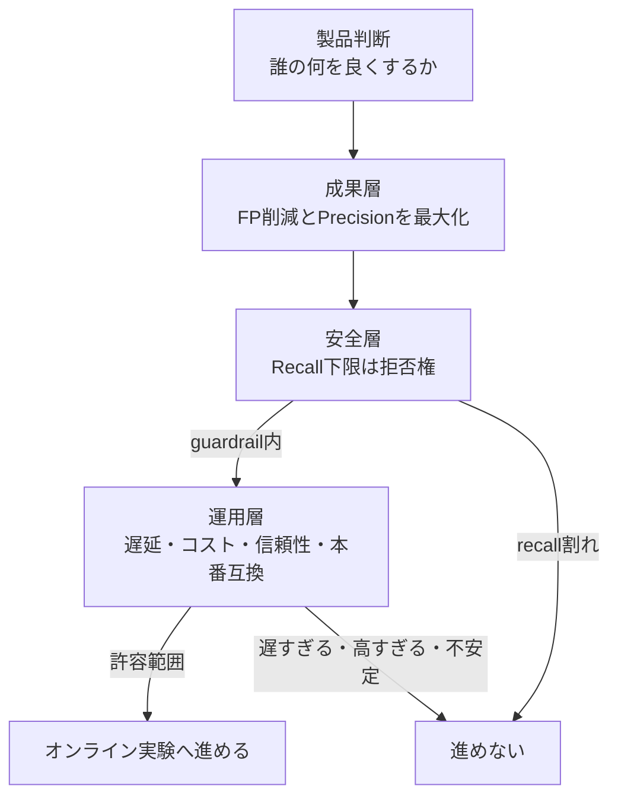
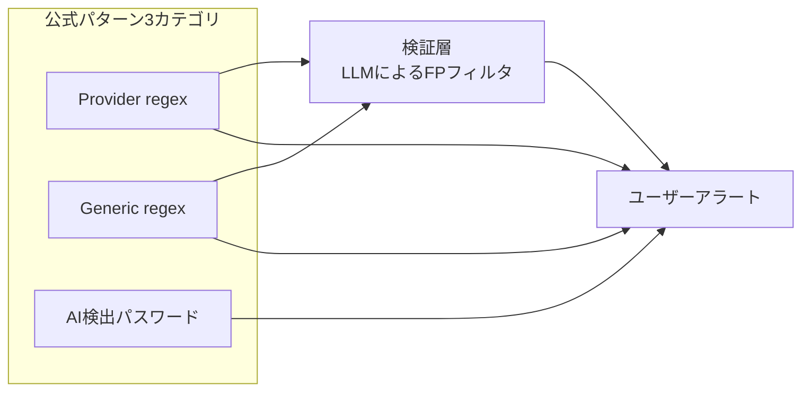

LLM を使った機能を本番へ出すかどうかを、評価スコアの平均値や F1 だけで決めていないでしょうか。この決め方は、品質が上がったのに事故が増える、あるいは配備できないものを合格させる、という失敗を生みます。

2026-08-25 に GitHub が公開した [How to evaluate LLMs before production](https://github.blog/ai-and-ml/llms/how-to-evaluate-llms-before-production/) は、Secret Scanning の偽陽性削減に LLM を使った実例をもとに、本番前評価を「モデル比較」ではなく「製品判断の証拠作り」として設計しています。指標を **成果・安全・運用** の 3 層に分け、下 2 層に拒否権を持たせる形です。

この記事では、その設計を自分のプロジェクトや発注仕様へ持ち込むために必要な情報を、次の順で整理します。

- 3 層モデルが何をゲートにしているのか
- 拒否権の向きは案件ごとに変わること、その決め方
- 公表されている数字をどこまで引用してよいのか
- 反復可能な評価工程として何を version し何を分類するのか

対象読者は、LLM 機能の受け入れ基準を書く立場の方、および外部へ LLM 機能を発注して合否を判断する立場の方です。特定のフレームワークの知識は前提としません。

*この記事の全体像。以下、順に解説します。*

## 3層モデルは重み付けではなくゲートである

まず押さえるべき点は、この 3 層が **スコアの重み付けではない** ことです。下 2 層はゲートであり、成果が良くてもゲートを割れば進めません。

| 層 | GitHub がこの評価で割り当てたもの | 役割 | 破れたときの扱い |
|---|---|---|---|
| 成果 | 偽陽性削減、precision | ユーザー便益。最大化してよい | 改善が弱ければ別の実験を続ける |
| 安全 | recall | 越えてはいけないリスク。拒否権 | precision が大きく上がっても進めない |
| 運用 | latency、cost、reliability、production compatibility | 配備できるか | 品質が上がっても遅い・高い・結合できないなら失敗 |

Secret Scanning での問いは「文字列分類が当たるか」ではありません。「偽陽性を減らしつつ、セキュリティワークフローとして安全な recall を保てるか」です。製品判断が先にあり、モデル調整はその後に来ます。

判定の流れは次のとおりです。

GitHub の記事は、この規則を Experiment A / B という形で示しています。A は precision が大きく改善したが recall が guardrail を割ったため進めない、という例です。**平均スコアなら A が勝つ場面で、A を落とす** ところにこの設計の意味があります。

なお、記事中の Experiment A/B 表や Run 追跡表（Precision 0.71、Recall 0.78、Latency 1.2s など）は hypothetical、つまり書き方の例として置かれた数値です。実測値ではありません。

## 拒否権をどちらの指標に置くかは案件で変わる

3 層分離は移植できますが、**「拒否権 = recall」は移植できません**。同じ秘密検出という領域でも、向きは逆になります。

- **GitHub の記事型**: 検出漏れが致命的なので、recall に下限を置く。
- **GitGuardian の FP Remover 型**: 後段の偽陽性フィルタが誤ると、それがそのまま検出漏れになる。だから precision を守り、「FP を正しく FP と判定する recall」を伸ばす。[GitGuardian の docs](https://docs.gitguardian.com/secrets-detection/secrets-detection-engine/machine_learning) は現行仕様を precision around 95% と記載しています。

ここでいう GitGuardian 側の recall は、検出エンジンの漏えい再現率ではなく、フィルタが FP を識別する再現率です。同じ語が別の対象を指しているので、数値をそのまま並べると意味が崩れます。

さらに、GitHub 自身が出荷している機能でも向きは一致しません。AI 検出パスワードは push protection と validity check の対象外で、[Application card](https://docs.github.com/en/code-security/responsible-use/security-and-quality-ai-features) は path に test / mock / spec を含む場合や特定拡張子では検出しないことがあると記載しています。つまり **意図的に recall を削って出荷** しています。評価枠と出荷機能は別物です。

したがって、発注や設計で最初に決めるのは指標の目標値ではなく、次の 1 点です。

> **どちらの誤りが拒否権か。**

抑制の誤り（見逃し）が致命的なら recall 下限、抑制そのもの（過検出でワークフローが止まる）が致命的なら precision 下限、運用不能が致命的なら latency / cost 下限を拒否権にします。

## 公表されている数字をどこまで引用してよいか

この領域は数字が独り歩きしやすいので、出典と対象を固定して扱います。

| 数字 | 出典 | 対象 | 使ってよい範囲 |
|---|---|---|---|
| 95% FP 削減 | GitHub Blog 2026-08-25 | 評価済みオフラインデータセット。recall は defined guardrail 内（数値非公開） | オフライン評価の結果。本番全量の SLA ではない |
| 75.76%（目標 65%） | GitHub Blog 2026-06-11 | 顧客確認済み FP 数百件の verification | 別評価。95% の途中経過ではない |
| 94% FP 削減（一部 org） | GitHub Blog 2025-03-04 | Copilot secret scanning の public preview、mirror testing | さらに別系統 |
| Precision 0.71 / Recall 0.78 / Latency 1.2s | GitHub Blog 2026-08-25 | hypothetical | 追跡表の書き方の例のみ |
| Precision 75% / Recall 6% | arXiv:2307.00714（2023、SecretBench 818 repos） | 当時の GitHub Secret Scanner | 2026 年の LLM フィルタの成果ではない |
| FP Remover precision around 95% | GitGuardian docs | 後段 FP 識別器 | 検出 recall ではない |

記事本文自身が「全本番シナリオの証明ではない」と述べており、recall guardrail の数値、データセット規模、ベースライン検出器の世代はいずれも非公開です。

引用時の禁止事項として、次を明示しておくと事故が減ります。

- **95% を本番 SLA や比較広告に使わない**。オフラインデータセット上の数字です。
- **hypothetical 表の 0.71 を実測として引用しない**。
- **2023 年の Precision 75% を 2026 年の LLM 成果と積算しない**。
- **二次報道の「100% accuracy」「100% recall」を使わない**。一次記事に該当記述はありません。

なお公式のパターン分類は Provider regex / Generic regex / AI 検出パスワードの 3 つです。ブログが扱う LLM 偽陽性フィルタは、この taxonomy に並ぶ 4 つ目のカテゴリではなく検証層です。並べて数えると件数が二重計上になります。

A と B の候補がすべて常に LLM 検証を通る、とは一次資料に記載がありません。図の A→D、B→D は「候補の一部が通る」経路として読んでください。

## 反復可能な評価工程として何をするか

GitHub の記事が繰り返し強調するのは、オフライン評価を **integration test として扱う** ことです。prompt、model、入力組み立て、周辺ロジックのいずれかに意味のある変更が入るたびに再実行します。

工程は次のように分解できます。

1. **製品判断と拒否権を文章化する**。「誰の、どの誤りを、いくらまで許容して、何を減らすか」を 1 文で書きます。
2. **オフラインパイプラインを本番へ寄せる**。候補だけでなく、周辺コード、補助情報、入力の整形と制約、モデルの外側のシステムロジックまで残します。きれいな単一候補データにすると「隣のダミートークンに注意を奪われる」種類の失敗を見逃します。
3. **ラベルの作り方を疑う**。本番の dismiss / resolve は真値ではありません。鍵の回転、リスク受容、ワークフロー解除、誤分類が混ざります。曖昧な集合は人手で再ラベルします。完全な正解を目指さず、判断できる精度にします。
4. **1 度に変える major variable は 1 つにする**。prompt 改訂と model upgrade を同時にやると原因が消えます。prompt / model / dataset version / system configuration を毎回記録し、既知のベースラインと比較します。
5. **集計の次に誤り分析を置く**。FP / FN を model / prompt / input / pipeline / dataset / label のどれに起因するか分類し、次の変更をその分類に紐づけます。
6. **LLM-as-judge は triage に限る**。ground truth にはしません。明確な事例は自動処理、低信頼・高影響は人が見る、高信頼のものは定期サンプリングする、という配分にし、judge 自身もバージョン付きで評価します。
7. **オフライン合格は online 実験の入場券として扱う**。本番の証明ではありません。

合成データや公開データセットは、本番類似データが手に入らない箇所の穴埋めとしては有効ですが、代替にはなりません。

### 受け入れ条件に書ける運用上の制約

Secret Scanning を実際に組み込む場合、次の制約は仕様として受け入れ条件に落とせます。

- Generic 系のアラート上限は 1 リポジトリあたり 5,000 件（open + closed）。
- AI 検出パスワードは push protection と validity check に非対応。
- ペアパターン（AWS のアクセスキー ID とシークレットなど）は、同一ファイルに両方があるときだけ検出。
- secret scanning 専用の RPM 制限は docs にありません。主な制限は一般の REST API 側（認証ユーザーで 5,000 requests/hour など。GitHub App installation ではより高い場合があります）。
- validity の on-demand 再検証専用の REST エンドポイントは公開ページに見当たらず、UI の Verify secret か PATCH による alert override を使います。

## この設計が向かない場合

3 層モデルは万能ではありません。次の条件では過剰、あるいは前提が崩れます。

- **ステークが低く、失敗が可逆で、単一の人間評価で足りる**システム。対話生成の一部などでは F1 で十分です。
- **ラベルがワークフロー結果でしか作れず、recall の分母が構成できない**場合。確認済み FP だけで測ると、そもそもアラートが出なかった真の秘密が分母に入りません。先にラベル定義を直します。
- **オフライン分布が本番と明らかに違う**場合。ゲート合格を入場券として扱えません。

また、偽陽性の最適化は検出漏れを増やす方向に働きます。Semgrep は 2025-11-19 の記事で、word boundary の最適化により GitHub Secret Scanning が特定の OpenAI トークンを push protection を含めて見逃した事例を報告しています。「FP を減らした」という成果は、必ず反対側のコストとセットで読む必要があります。

## リスクマネジメント枠組みとの対応

NIST AI RMF 1.0 の MEASURE 機能と方向は一致します。1 対 1 の公式マッピングではありませんが、受け入れ条件を書くときの参照として使えます。

| GitHub の実践 | NIST AI RMF MEASURE |
|---|---|
| オフライン評価を本番条件へ寄せる | 2.3 配備類似条件での測定 |
| オフライン合格は本番証明ではないと明記する | 2.5 妥当性・信頼性、訓練条件外の一般化限界 |
| recall を risk tolerance として扱う | 2.6 残余リスクが許容を超えない、fail-safe |

一方、日本語の一次資料（AI 事業者ガイドライン、AISI の評価観点ガイド）は precision / recall の数値的な拒否権を持ちません。リスクベースの考え方と「安全性を損なうなら提供しない」という定性的な制約が中心です。**数値ゲートは発注契約側で置く** 必要があります。

## まとめ

- LLM 機能の本番投入判定は、平均スコアや単一の F1 では足りません。成果・安全・運用に分け、下 2 層をゲートにします。
- 成果層は最大化してよい指標、安全層と運用層は拒否権です。ゲートを割った実験は、品質が良く見えても進めません。
- 拒否権を recall に置くか precision に置くかは案件で逆転します。GitHub 記事型と GitGuardian FP Remover 型は正反対です。最初に決めるのは目標値ではなく「どちらの誤りが拒否権か」です。
- 測定集合を必ず書き分けます。オフライン評価、確認済み FP、live traffic は別物で、95% はオフラインデータセット上の数字です。本番 SLA として引用できません。
- オフライン評価は integration test として、prompt / model / dataset / pipeline を version し、1 度に 1 変数だけ変えて回します。集計の後には必ず誤り分析を置きます。
- LLM-as-judge は triage であり ground truth ではありません。judge 自身も評価対象のコンポーネントです。

この記事が少しでも参考になった、あるいは改善点などがあれば、ぜひリアクションやコメント、SNSでのシェアをいただけると励みになります！

## 参考リンク

- [How to evaluate LLMs before production](https://github.blog/ai-and-ml/llms/how-to-evaluate-llms-before-production/)
- [Making secret scanning more trustworthy: Reducing false positives at scale](https://github.blog/security/making-secret-scanning-more-trustworthy-reducing-false-positives-at-scale/)
- [GitHub Docs: Secret scanning](https://docs.github.com/en/code-security/concepts/secret-security/secret-scanning)
- [GitHub Docs: Supported secret scanning patterns](https://docs.github.com/en/code-security/secret-scanning/introduction/supported-secret-scanning-patterns)
- [GitHub Docs: Application card for security and quality AI features](https://docs.github.com/en/code-security/responsible-use/security-and-quality-ai-features)
- [NIST AI Risk Management Framework 1.0](https://airc.nist.gov/airmf-resources/airmf/5-sec-core/)
- [GitGuardian: Assessing model performance in secrets detection](https://blog.gitguardian.com/secrets-detection-accuracy-precision-recall-explained/)
- [GitGuardian: FP Remover V2](https://blog.gitguardian.com/ai-false-positive-remover-v2)
- [GitGuardian Docs: Machine learning / False Positive Remover](https://docs.gitguardian.com/secrets-detection/secrets-detection-engine/machine_learning)
- [A Comparative Study of Software Secrets Reporting by Secret Detection Tools (arXiv:2307.00714)](https://arxiv.org/abs/2307.00714)
- [Semgrep: Secrets Story, The Prefixed Secrets That Tried to Get Away](https://semgrep.dev/blog/2025/secrets-story-and-prefixed-secrets/)
