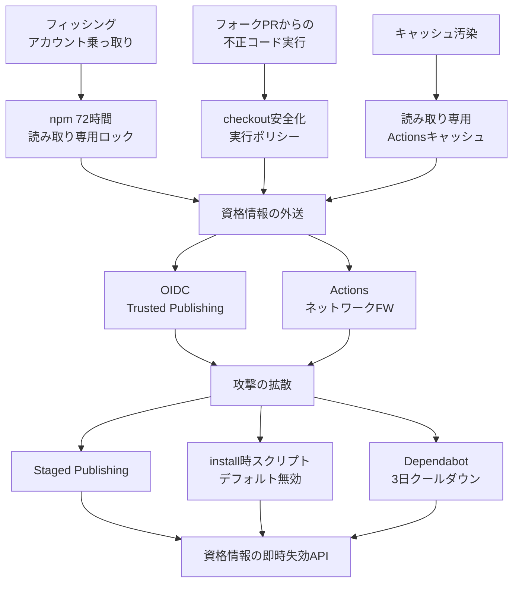

GitHub は 2026 年 7 月 28 日、npm と GitHub Actions に投入してきたサプライチェーン攻撃対策を包括的に整理した記事を公開しました（[Disrupting supply chain attacks on npm and GitHub Actions](https://github.blog/security/supply-chain-security/disrupting-supply-chain-attacks-on-npm-and-github-actions/)、著者は Greg Ose と Zachary Steindler）。

この記事は、その発表内容を「自分のリポジトリで何を設定すべきか」という観点で読み替えたものです。読み終えると、次の 3 つが判断できます。

- 個別のマルウェア検知ではなく、なぜ権限境界と公開経路を絞る方向へ舵が切られたのか
- 正規の CI/CD 経路以外からの公開（手元の `npm publish`、手動 `git tag`）を組織として拒否する具体的な設定
- AI エージェントにコード変更を任せる前提で、どこに人間の承認を残すべきか

## なぜ「検知」から「経路を塞ぐ」へ移ったのか

シグネチャ照合やパターン監視は、悪意あるパッケージが公開された後にしか反応できません。npm のように公開から数分で世界中の CI がインストールする流通経路では、検知が間に合った時点で既に被害が広がっています。

今回の施策群は、攻撃を検知する代わりに、攻撃者が通らざるを得ない経路を決定論的に狭めます。具体的には、サプライチェーン攻撃を **初期侵害 → 資格情報の外送 → 攻撃の拡散** の 3 段に分解し、各段に別々の防御を置く構成です。



設計上の要点は 2 つです。

1. **多層である**こと。アカウント乗っ取りが成立しても、公開には別の承認が要る構造になっています。
2. **デフォルトで効く**こと。`actions/checkout` の挙動変更や Dependabot のクールダウンは、オプトインではなく標準設定として入ります。既存ワークフローの側に影響が出るのはこのためです。

## 2026年3月〜7月に入った変更の一覧

| 時期 | 領域 | 変更 | 効果 |
|---|---|---|---|
| 2026-03 | インシデント対応 | Credential Revocation API 拡大 | PAT に加え OAuth / GitHub App トークンも漏洩時に失効可能 |
| 2026-04 | npm / OIDC | Trusted Publishing の CircleCI 対応 | GitHub Actions 以外の CI からも長期トークンなしで公開 |
| 2026-05 | npm / 公開 | Staged Publishing | CI が公開処理を実行しても、2FA 承認まで公開を保留 |
| 2026-06 | npm / アカウント | 高影響度アカウントの予防的保護 | メール変更や 2FA リカバリ時、72 時間 Read-Only 化 |
| 2026-06 | Actions | `pull_request_target` のデフォルト変更 | フォークの untrusted コードのチェックアウトを既定で遮断 |
| 2026-06 | Actions | Workflow Execution Policies | 実行者とトリガーを Enterprise / Org / Repo 単位で統制 |
| 2026-06 | Actions | Read-only Actions Cache | 低信頼トリガーからのキャッシュ書き込みを禁止 |
| 2026-06 | npm | v12 の破壊的変更アナウンス | install 時スクリプトと git / remote URL 依存を既定で無効化 |
| 2026-06 | 組織管理 | Self-service Credential Revocation | 侵害ユーザーの全資格情報を管理者が一括失効 |
| 2026-07 | Dependabot | 3 日間 Package Cooldown | 新規リリースの更新 PR を既定で 3 日遅延（セキュリティ修正は即時） |
| Preview | Actions | Actions Network Firewall | 実行中のアウトバウンド通信をログ記録・可視化 |

既存プロジェクトに先に影響が出るのは、下 3 つ（`pull_request_target` の既定変更、npm v12、Dependabot クールダウン）です。設定を何も変えなくても挙動が変わるため、ここだけは先に確認しておく価値があります。

## 正規経路以外のリリースを組織として拒否する

ここが実務上いちばん効く部分です。「手元から `npm publish` を打つ」「GitHub の Web UI からタグを切る」といった迂回リリースは、レジストリ層とリポジトリ層の両方に設定を入れることで拒否できます。片方だけでは穴が残ります。

### npm レジストリ層：トークンによる公開を禁止する

1. `https://www.npmjs.com/package/<package-name>/access` を開く
2. **Require two-factor authentication and disallow tokens** を有効化する

これで、Standard / Granular Publish Token を使った公開が全面的に拒否され、OIDC（Trusted Publisher）経由の公開だけが受理されます。手元の `.npmrc` に置いたトークンは、漏洩しても公開に使えません。

制約が 1 つあります。**パッケージの初回バージョンだけは OIDC 経由で公開できません**。新規パッケージは最初の 1 回だけ手動またはトークンで公開し、直後にこの設定を有効化する、という手順を標準化しておく必要があります。

CI に公開権限を完全委任することに抵抗がある場合は、Staged Publishing を併用します。CI がビルドとステージングまでを行い、開発者が Web / CLI で 2FA 承認して初めてレジストリに出る、という分離になります。

公開側のワークフローは、長期トークンを持たず OIDC で認証する形になります。

```yaml
name: publish

on:
  push:
    tags:
      - "v*"

jobs:
  publish:
    runs-on: ubuntu-latest
    permissions:
      contents: read
      id-token: write # OIDC トークン発行に必須
    steps:
      - uses: actions/checkout@v4
      - uses: actions/setup-node@v4
        with:
          node-version: 22
          registry-url: https://registry.npmjs.org
      - run: npm ci
      - run: npm publish # NODE_AUTH_TOKEN を渡さない
```

`NODE_AUTH_TOKEN` を渡していない点が要点です。npm 側に Trusted Publisher（対象リポジトリとワークフローファイル）を登録しておくと、CI が提示する OIDC トークンで公開が通ります。登録手順は npm の [About trusted publishers](https://docs.npmjs.com/trusted-publishers) に従ってください。

### GitHub リポジトリ層：タグ作成を CI 専用にする

npm 側を締めても、誰でもタグを作れる状態では「タグを作った人が実質のリリース権限者」になります。Tag ruleset で塞ぎます。

1. Repository または Enterprise Settings の **Rules > Rulesets** で **New tag ruleset** を作成
2. Target を `v*`（または `*`）に設定
3. Rules で **Restrict creations** と **Restrict updates** を有効化
4. Bypass list から人間を全員外し、リリース専用の GitHub App（または CI サービスアカウント）だけを追加

Repository Admin や Maintainer も bypass list から外すのが肝心です。ここに人間を残すと、緊急対応の名目で経路が復活します。

設定後は次のようになります。

- 手元の `git tag v1.0.0 && git push` は拒否される
- Web UI や `gh release create` からの手動リリースも拒否される
- 認可された GitHub App トークンを使うワークフローだけがタグを作れる

npm 側の「トークン公開の禁止」と GitHub 側の「タグ作成の制限」が揃って初めて、リリース経路が 1 本に収束します。

## AI エージェントに開発を任せる前提での権限設計

この構造は、AI エージェントが依存追加やリリース作業に関わる前提でも、そのまま権限設計モデルとして使えます。判断の軸は「エージェントに何を持たせないか」です。

**1. エージェント環境に長期トークンを置かない**

エージェントの実行環境（手元の端末やコンテナ）に npm トークンや広い権限の GitHub トークンを置かない。エージェントの権限は「コード変更と PR 作成まで」に限定し、公開は OIDC を持つ GitHub Actions に委ねます。エージェントが誤動作しても、公開できる資格情報がそこに存在しません。

**2. エージェントが追加した依存に二重の防御を効かせる**

エージェントが提案した npm パッケージの `postinstall` による初期侵害は、npm v12 の install 時スクリプト既定無効化で止まります。悪意あるリリース直後に取り込む事故は、Dependabot の 3 日クールダウンが吸収します。人間のレビューだけに頼らない層がここにあります。

**3. 実行と公開の承認を分離する**

Workflow Execution Policies でエージェントが作ったブランチやフォークからのデプロイ自動起動を統制し、最終公開には Staged Publishing の 2FA 承認を挟みます。これにより、エージェントが仮に権限昇格しても、人間の承認なしに外部レジストリへは出ません。

## 導入前に見ておくトレードオフ

いずれもデフォルト変更を伴うため、副作用の把握が先です。

**npm v12 のスクリプト無効化はビルドを壊し得る**

`node-gyp` を使うネイティブアドオン（`sharp` など）を含むプロジェクトでは、`npm install` 時のビルドが走らず失敗する可能性があります。許可リストの管理コストが新たに発生します。移行前に、依存ツリーの中でどのパッケージが install 時スクリプトに依存しているかを洗い出しておくのが安全です。

**Dependabot の 3 日クールダウンは通常のバグ修正を遅らせる**

セキュリティアドバイザリが付いた更新は即時のままですが、CVE の付かない重要なバグ修正は 3 日待たされます。急ぐ場合は手動での PR 作成かオプトアウトが必要です。

**初回リリースは自動化できない**

OIDC Trusted Publishing は初回のパッケージ作成に使えません。新規プロジェクトの立ち上げ手順として、「1 回だけ手動公開 → 直後にトークン公開を禁止」を明文化しておく必要があります。

## まとめ

- GitHub の一連の施策は、検知の強化ではなく、攻撃者が通る経路そのものを塞ぐ設計に寄せられている
- 迂回リリースの拒否は、npm 側の「トークン公開禁止」と GitHub 側の「Tag ruleset」の両方を入れて初めて成立する
- Tag ruleset の bypass list から人間を全員外すのが、経路を 1 本に収束させる分かれ目になる
- AI エージェントを開発に組み込むなら、エージェント環境に長期トークンを置かず、公開の最終承認を人間側に残す設計が既定になる
- 既定変更（`pull_request_target`、npm v12、Dependabot クールダウン）は設定を変えなくても効くため、副作用の確認を先に行う

## 参考リンク

- [Disrupting supply chain attacks on npm and GitHub Actions](https://github.blog/security/supply-chain-security/disrupting-supply-chain-attacks-on-npm-and-github-actions/)（GitHub Blog, 2026-07-28）
- [npm adds preventive account protection for high-impact accounts](https://github.blog/changelog/2026-06-25-npm-adds-preventive-account-protection-for-high-impact-accounts/)（2026-06-25）
- [Safer pull_request_target defaults for GitHub Actions checkout](https://github.blog/changelog/2026-06-18-safer-pull_request_target-defaults-for-github-actions-checkout/)（2026-06-18）
- [Staged publishing and new install-time controls for npm](https://github.blog/changelog/2026-05-22-staged-publishing-and-new-install-time-controls-for-npm/)（2026-05-22）
- [Dependabot version updates introduce default package cooldown](https://github.blog/changelog/2026-07-14-dependabot-version-updates-introduce-default-package-cooldown/)（2026-07-14）
- [About trusted publishers](https://docs.npmjs.com/trusted-publishers)（npm Docs）
- [About rulesets](https://docs.github.com/en/repositories/configuring-branches-and-merges-in-your-repository/managing-rulesets/about-rulesets)（GitHub Docs）
