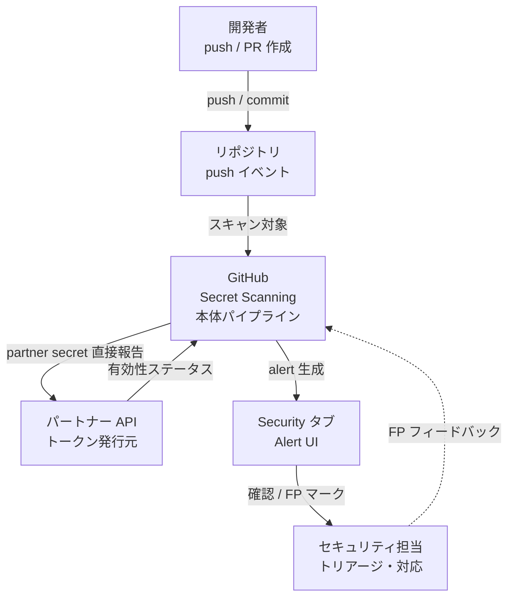
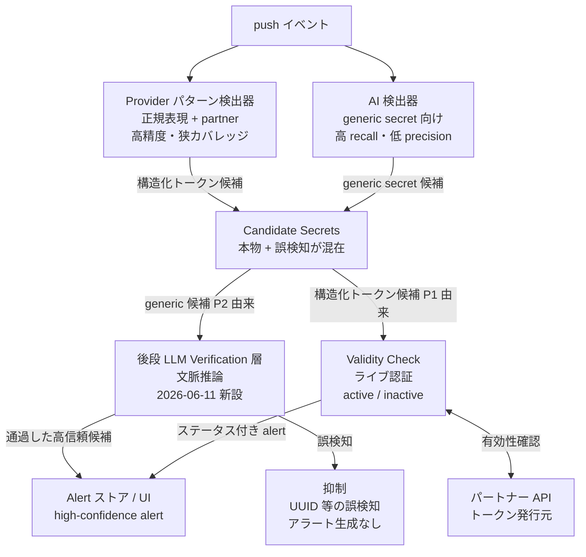
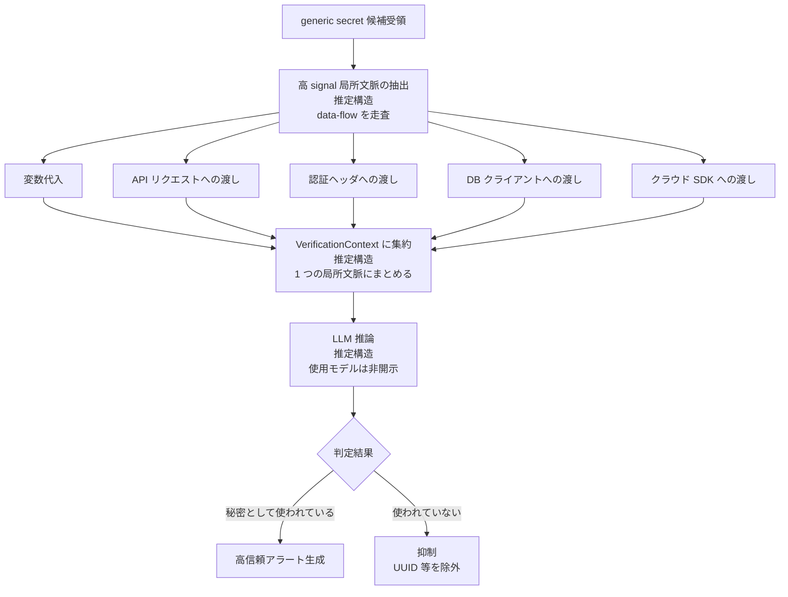
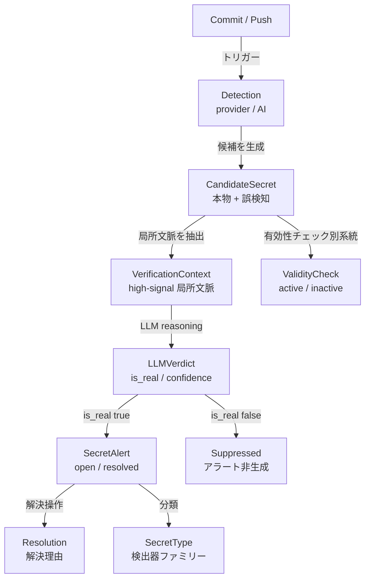
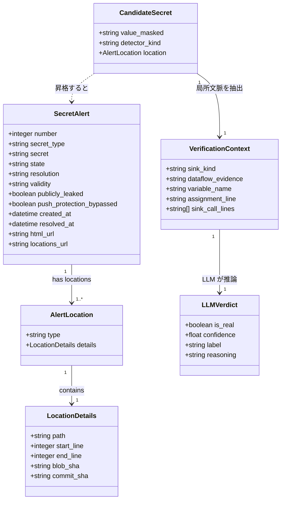

> 対象: GitHub Secret Scanning の generic secret(AI 検出)に対する後段 LLM 文脈検証(2026-06-11 発表、誤検知 75.76% 削減)
> 想定読者: 実装エンジニア・DevSecOps・LLMOps / 調査日: 2026-06-12

## 概要

GitHub は 2026-06-11、Secret Scanning の **誤検知(false positive)を 75.76% 削減** したと発表しました([GitHub Blog](https://github.blog/security/making-secret-scanning-more-trustworthy-reducing-false-positives-at-scale/))。注目すべきは削減率そのものより **やり方** です。GitHub は LLM を「秘密情報かどうかを最初から判定する主検出器」には使いませんでした。既存の検出パイプラインはそのまま残し、その **後段に「検証ステップ」として LLM を差し込みました**。さらにその LLM には、ファイル全体やリポジトリ全体ではなく **「その値がどう使われているか」という high-signal な局所文脈だけ** を渡しています。

この事例から、汎用的に転用できる設計判断が 2 つ読み取れます。

**パターン1: 二段化(cascade)** は、安価で高 recall な検出器で候補を広く拾い、後段に LLM 検証を置いて precision(アラートの信頼性)を上げる構成です。LLM は「主判定」でなく「フィルタ」として働きます。GitHub のパイプライン表現は `AI based detection → Candidate Secrets → Verification(LLM reasoning) → High-confidence alerts` で、設計原則は *"higher precision without changing upstream detection logic or reducing coverage"* です。

**パターン2: 焦点化文脈(context engineering)** は、LLM に渡すのを「多い文脈」でなく「正しい局所文脈」にする判断です。GitHub の明示的な言葉は *"Instead of giving more context, we're giving better context."*、逆説的な主張は *"improving accuracy requires analyzing more of the codebase. But the opposite is true."* です。具体的な局所文脈は data-flow、すなわち *"a value is assigned to a variable and later passed into an API request, authentication header, database client, or cloud SDK call"* です。

セキュリティの文脈で語られた話ですが、本質は「AI を既存の確定的なパイプラインの **検証ステップ** として組み込み、判断に必要な最小限の文脈だけを渡す」という、CI / 品質ゲート全般に通じる型です。

:::message alert
**数値の前提**: 75.76% は GitHub の一次記事に逐語で存在する確定値です(*"Our target was a 65% reduction. The result was 75.76%, exceeding that goal while maintaining strong detection performance."*)。ただし母集団は **顧客確認済み false positive アラートのキュレートされた集合** での評価です(本文・図説は "hundreds"、画像 alt は "1,500" と記事内で表記が揺れています)。GitHub 自身が *"continuing to evaluate this approach on larger datasets and live traffic"* と述べており、**live traffic での本番フル実証はこれから** です。また **recall(本物の秘密を見逃す率 = false negative)は定量開示されていません**(後述「運用」「ベストプラクティス」)。
:::

## 特徴

| 観点 | 内容 |
|---|---|
| 削減率 | 目標 65% に対し実績 75.76% の誤検知削減 |
| 評価母集団 | 顧客確認済み FP アラート(本文 "hundreds"、画像 alt は "1,500" と表記揺れ) |
| 対象 | AI 検出の generic secret(非構造の汎用パスワード)のみ。provider パターン検出は対象外で元々高精度 |
| パイプライン位置 | candidate 生成の後段 verification 層。upstream 検出ロジックは不変、coverage 低下なし |
| 渡す文脈 | ファイル全体でなく high-signal な局所文脈。値が変数代入後に API / 認証ヘッダ / DB / cloud SDK に渡るかの data-flow |
| 設計思想 | "Instead of giving more context, we're giving better context." |
| 使用 LLM モデル | 記事中に明記なし。"LLM-based contextual verification" と総称のみ |
| プロンプト / トークン数 / レイテンシ / コスト | すべて未開示。"high accuracy, low latency" と定性記述のみ |
| recall(FN) | 定量開示なし。"maintaining strong detection performance" と定性記述のみ |
| 本番実証 | live traffic での評価は継続中。フル実証前 |
| 公開日 | 2026-06-11 |

### この発表に至る時系列

「94% 削減」という別の数字も見かけますが、これは今回の 75.76% とは **別フェーズ・別指標** です。混同を避けてください。

| 日付 | マイルストーン | 数値 |
|---|---|---|
| 2024-07-16 | AI 生成カスタムパターン GA | — |
| 2024-10-21 | generic password の AI 検出 GA(35 万超リポジトリ採用) | — |
| 2025-03-04 | 検出モデル構築解説(GPT-3.5 候補 + GPT-4 確認の多段、mirror testing) | 94% FP 削減(検出モデル段階) |
| 2026-06-11 | GA 済みシステムへの後段 LLM verification 層追加 | 75.76% FP 削減(検証ステップ段階) |

94% は検出モデル自体のチューニングによる mirror testing 段階の数値、75.76% は GA 後システムへの後段 verification 層追加による別フェーズの数値です。測定母集団も手法も異なり、直接比較できません。

## 構造

C4 モデルの 3 段階を、secret scanning パイプラインの「論理構造」に読み替えて記述します。公開情報に根拠がない内部実装は「公開情報からの推定構造」と注記します。

### システムコンテキスト図



| 要素 | 説明 |
|---|---|
| 開発者 | コードを push / PR 作成。意図せず secret をコミットする当事者 |
| セキュリティ担当 | Alert UI でアラートをトリアージし修正対応・FP マーク |
| GitHub Secret Scanning | push されたコードをスキャンし候補を検出・検証してアラート生成 |
| リポジトリ / push イベント | スキャン対象のコードソース。push 時にパイプライン起動 |
| パートナー API | 構造化トークンの発行元。Validity Check でトークンの有効性を確認 |
| Security タブ / Alert UI | アラート画面。FP マークの蓄積がモデル改善にフィードバック |

### コンテナ図



| コンポーネント | 説明 |
|---|---|
| Provider パターン検出器 | 構造が決まった API キー・トークンを正規表現で検出。高精度・狭カバレッジ |
| AI 検出器 | 非構造のパスワード様文字列を AI モデルで広くスキャン。高 recall・低 precision。2024-10-21 GA |
| Candidate Secrets | P1・P2 の出力をまとめた候補集合。本物 + 誤検知混在。Verification 層の対象 |
| 後段 LLM Verification 層 | generic secret 候補に file-level の局所文脈を与えて LLM に再判定。2026-06-11 新設 |
| Validity Check | パートナー API へライブ認証してトークンが active か確認。文脈判定と補完的 |
| Alert ストア / UI | 最終アラートを生成・表示。AI / generic 検出の alert は別リスト |

設計上の核心は、Verification 層が候補の「後段」にだけ置かれ、P1・P2 の検出ロジック自体には手を入れない点です。これは upstream の recall を保ったまま precision を引き上げる **設計意図** です(GitHub は "strong detection performance を維持" と表現するのみで、recall を定量開示していません)。

### コンポーネント図

後段 LLM Verification 層の内部処理フローです。一次ソース記載の動作仕様から導いた論理構造で、内部実装の詳細(プロンプト・モデル名・各ステップの実装方式)は非開示のため「公開情報からの推定構造」です。



| 要素 | 説明 |
|---|---|
| 高 signal 局所文脈の抽出 | 候補値がコード中でどう使われるかを表す file-level の小さな情報集合を抽出 |
| data-flow シグナル | 値が変数に代入され、その後 API リクエスト・認証ヘッダ・DB クライアント・クラウド SDK に渡るかを確認 |
| VerificationContext に集約 | 抽出した data-flow を 1 つの high-signal 文脈にまとめて LLM へ渡す |
| LLM 推論 | 抽出した局所文脈を入力に「候補値が本物の秘密として消費されているか」を推論。使用モデルは非開示 |
| 高信頼アラート生成 | Verification を通過した候補だけをアラート化。alert fatigue を低減 |
| 抑制 | ランダム UUID・opaque string などの誤検知候補をアラート生成前に除外 |

抽出するシグナルは、静的解析の taint analysis(source から sink)と同型の概念です。ただし GitHub は固定ルールでなく LLM の自然言語推論でこれを行います(公開情報からの推定)。ファイル全体でなく「値の代入から認証 sink までの局所フロー」だけを抽出することで、トークン数を最小化しつつ判定に必要なシグナルを確保します。

### 設計パターンの要点

| 設計判断 | 説明 |
|---|---|
| 二段化 | 安価な高 recall 検出器で広く拾い、後段 LLM で precision を上げる構成。LLM は主判定でなくフィルタ |
| カバレッジ不変 | upstream の検出ロジックを変えず、Verification は落とす役のみ |
| 焦点化文脈 | ファイル全体でなく data-flow の局所文脈だけを LLM に渡す方針 |
| 有効性検証との補完 | LLM 文脈フィルタとライブ API 検証の役割分担。前者は使われ方、後者は有効性を判定 |

## データ

### 概念モデル



| 概念 | 説明 |
|---|---|
| Commit / Push | コードが push / commit された事象。Secret Scanning のトリガー |
| Detection | 候補シークレットを検出する処理。provider パターン検出と AI 検出の 2 系統 |
| CandidateSecret | Detection が出力した候補。本物と誤検知が混在 |
| VerificationContext | LLM 検証に渡す high-signal な局所文脈。値の代入から sink への data-flow |
| LLMVerdict | LLM reasoning が出力する判定。スキーマは非開示で業界一般の出力から推定 |
| ValidityCheck | 発行元 API へのライブ認証で secret がまだ有効かを確認する別系統 |
| SecretAlert | LLM 検証を通過した候補が昇格したアラート |
| SecretType | 検出器ファミリーとしての概念的分類(provider pattern と generic)。なお REST API の `secret_type` フィールドはこの二値でなく個別トークン種別の識別子 |
| Resolution | アラート解決理由。false_positive / wont_fix / revoked / used_in_tests |

### 情報モデル



SecretAlert の主要フィールドを抜粋します(GitHub REST API `secret-scanning/alerts`、API version 2026-03-10 の実フィールドに基づく。`provider_slug` / `assigned_to` / `first_location_detected` 等は省略)。

| フィールド | 説明 |
|---|---|
| `number` | アラートの一意識別子 |
| `state` | `open` / `resolved` |
| `resolution` | `false_positive` / `wont_fix` / `revoked` / `used_in_tests` / null |
| `secret_type` | トークン種別の具体的識別子(例: `mailchimp_api_key`)。generic と provider の二値分類ではない |
| `validity` | レスポンス / フィルタでは `active` / `inactive` / `unknown`、更新では `active` / `inactive` / null |
| `publicly_leaked` | 公開ソースでの露出有無 |
| `push_protection_bypassed` | Push Protection をバイパスしたか |
| `created_at` / `resolved_at` | 検出 / クローズのタイムスタンプ |
| `html_url` / `locations_url` | Web UI / 全出現箇所のエンドポイント |

CandidateSecret・VerificationContext・LLMVerdict は内部エンティティで、GitHub は内部スキーマを非開示です。以下は API 応答・動作説明・業界一般の LLM-as-judge 出力から逆引きした **推定** です。

| エンティティ | 推定フィールド |
|---|---|
| CandidateSecret | `value_masked` / `detector_kind`(`provider_pattern` / `ai_generic`)/ `location` |
| VerificationContext | `sink_kind`(`api_request` / `auth_header` / `db_client` / `cloud_sdk` / `unknown`)/ `dataflow_evidence` / `variable_name` / `assignment_line` / `sink_call_lines` |
| LLMVerdict | `is_real` / `confidence` / `label`(`true_positive` / `false_positive` / `uncertain`)/ `reasoning` |

## 構築方法

### 検出方式と料金

| 系統 | 対象 | 提供形態 |
|---|---|---|
| プロバイダーパターン検出 | 構造化トークン(AWS / Stripe / GitHub PAT 等) | public は無料・自動 / private は Secret Protection 必要 |
| generic secret AI 検出 | 非構造の汎用パスワード文字列 | GitHub Secret Protection / GHAS が必要、Copilot サブスク不要 |

2026-06-11 の LLM 文脈検証強化は generic secret AI 検出のみが対象です。GitHub Secret Protection は 2025-03-04 に GHAS から secret scanning 部分が独立 SKU 化された製品名です(価格は $19 / アクティブコミッター / 月。2025 年時点の二次情報で公式 pricing ページに数値非掲載のため要再確認)。

### 有効化

- **Public リポジトリ**: secret scanning が無料かつ自動で稼働。手動有効化は不要
- **Private / Internal(GitHub Team 以上)**: `Settings → Advanced Security → "Secret Protection" の [Enable]`。組織単位の一括有効化は security configurations 機能から
- **Push Protection**: Secret Protection 有効化後に `Advanced Security → "Push protection" の [Enable]`。有効化後、push 時に secret が検出されると push をブロック
- **Generic Secret(AI 検出)**: Secret Protection / GHAS のリポジトリで利用可。アラートは別の「Generic」リストで表示

generic secret 検出の誤検知フィルタには次が含まれます(GA 時点の docs 記載。**現行ページでは test / mock / spec 除外・英語主サポート・FN の存在のみ確認でき、以下の数値しきい値は未確認 = 要再確認**)。

- 1 push あたり 100 件超のパスワードは検出しない
- `.svg` / `.png` / `.jpeg` は対象外
- パスに `test` / `mock` / `spec` を含む言語ファイルは対象外
- 同一ファイルで 5 件以上が誤検知マーク済みなら以降検出しない

### REST API でアラートを取得

```bash
# リポジトリのアラート一覧
curl -L \
  -H "Accept: application/vnd.github+json" \
  -H "Authorization: Bearer <TOKEN>" \
  -H "X-GitHub-Api-Version: 2026-03-10" \
  "https://api.github.com/repos/OWNER/REPO/secret-scanning/alerts"

# 誤検知としてクローズ
curl -L -X PATCH \
  -H "Accept: application/vnd.github+json" \
  -H "Authorization: Bearer <TOKEN>" \
  -H "X-GitHub-Api-Version: 2026-03-10" \
  "https://api.github.com/repos/OWNER/REPO/secret-scanning/alerts/ALERT_NUMBER" \
  -d '{"state":"resolved","resolution":"false_positive"}'
```

```bash
# gh CLI: open のみ抽出
gh api repos/OWNER/REPO/secret-scanning/alerts \
  --jq '.[] | select(.state=="open") | {number, secret_type, created_at, html_url}'

# generic アラートのみ抽出
gh api repos/OWNER/REPO/secret-scanning/alerts \
  --jq '.[] | select((.secret_type_display_name // "") | test("(?i)generic|password"))'
```

### 転用実装案

GitHub の実装を自社 CI / 品質ゲートに転用するための実装案です。GitHub の内部実装の再現ではなく、設計原則を自分のユースケースに当てはめた **実装案** です。

```text
第1段: 安価な検出器 (高 recall・低コスト)
  ├─ 正規表現マッチング (gitleaks / trufflehog ルール流用)
  ├─ エントロピー計算 (Shannon entropy >= 3.5)
  └─ 既存 OSS (gitleaks --report-format=json)
        ↓ 候補集合 (本物 + 偽陽性)
第2段: LLM contextual verification (precision 向上・コスト局所化)
  ├─ high-signal な局所文脈を抽出 (data-flow)
  ├─ LLM に JSON で TP/FP/uncertain を返させる
  └─ uncertain はレビューキュー入り
```

二段化の意義は 2 つあります。第 1 に、LLM を全 diff に通さず候補集合のみに絞ることで、呼び出し回数を抑えコスト・レイテンシを管理可能にします。第 2 に、第 1 段を厳しめ(多く拾う)にして取りこぼしを防ぎ、第 2 段は「落とす役」に徹して検出の網を緩めません。

局所文脈の抽出例です。

```python
import re

def extract_local_context(filepath: str, matched_line: int, window: int = 8) -> dict:
    """候補値の周辺行と sink パターンを含む局所文脈を抽出する(実装案)。"""
    with open(filepath) as f:
        lines = f.readlines()
    start = max(0, matched_line - window)
    end = min(len(lines), matched_line + window)
    snippet = "".join(lines[start:end])

    SINK_PATTERNS = [
        r"Authorization|Bearer|api_key|password|secret",   # 認証ヘッダ
        r"requests\.(get|post|put|patch|delete)\(",         # HTTP リクエスト
        r"boto3\.client|boto3\.resource",                  # AWS SDK
        r"pymysql\.connect|psycopg2\.connect|sqlalchemy",  # DB クライアント
    ]
    sink_lines = [
        l.strip() for l in lines
        if any(re.search(p, l, re.IGNORECASE) for p in SINK_PATTERNS)
    ][:5]
    is_test_file = any(seg in filepath for seg in ["/test", "/mock", "/spec", "fixture", "__tests__"])
    return {
        "filepath": filepath, "matched_line": matched_line + 1,
        "snippet": snippet, "sink_lines": sink_lines, "is_test_file": is_test_file,
    }
```

LLM-as-judge のプロンプトは出力を JSON 固定にして、後段の自動トリアージを可能にします。

```text
SYSTEM:
You are a security reviewer. Determine whether the candidate string is a real
credential being used as one (true positive) or a false alarm (false positive).
Respond ONLY with valid JSON:
{ "verdict": "TP" | "FP" | "uncertain", "confidence": 0.0-1.0,
  "reason": "<one sentence>", "sink_evidence": "<line passing the value to an auth sink, or null>" }
Rules:
- TP: value is assigned to a variable AND later passed into an API request,
  authentication header, database client, or cloud SDK call.
- FP: looks like a secret but is a random UUID, test fixture, placeholder, or opaque
  string with no auth sink.
- uncertain: context insufficient.
- If the file is a test/mock/spec file, lean toward FP unless a real endpoint is called.
```

```python
import anthropic, json

def verify_with_llm(context: dict) -> dict:
    """LLM に局所文脈を渡して TP/FP/uncertain を判定させる(実装案)。"""
    client = anthropic.Anthropic()
    user_msg = USER_TEMPLATE.format(**context)
    resp = client.messages.create(
        model="claude-haiku-4-5-20251001",  # 検証は単純判断なので安価な小型モデルで十分
        max_tokens=256, system=SYSTEM_PROMPT,
        messages=[{"role": "user", "content": user_msg}],
    )
    return json.loads(resp.content[0].text)
```

検証ステップは比較的シンプルな判断タスクなので、まず小型モデル(Haiku 相当)を候補にし、ベンチマークで recall 損失を確認してから採否を決めます。件数が多い場合は閾値フィルタ(エントロピー一定以上かつ sink パターンあり、の候補のみ LLM へ)で呼び出しを絞ります。

### GitHub Actions への組み込み例

次は **疑似ワークフロー** です。`verify_secrets.py` / `evaluate.py` の配置と `pip install anthropic` を前提とし、そのままでは動きません。

```yaml
# .github/workflows/secret-verify.yml
name: Secret Scanning + LLM Verification
on:
  pull_request:
    branches: [main, develop]
jobs:
  scan-and-verify:
    runs-on: ubuntu-latest
    permissions:
      contents: read
      pull-requests: write
    steps:
      - uses: actions/checkout@v4
        with:
          fetch-depth: 0
      - name: Install gitleaks
        env:
          GITLEAKS_VERSION: 8.21.2   # 例。リリースページで最新版を確認しアセット名を固定する
        run: |
          curl -sSL "https://github.com/gitleaks/gitleaks/releases/download/v${GITLEAKS_VERSION}/gitleaks_${GITLEAKS_VERSION}_linux_x64.tar.gz" | tar -xz
          chmod +x gitleaks
      # 第1段: 安価な検出器で候補を広く拾う
      - name: Stage 1 - gitleaks scan (high recall)
        run: ./gitleaks detect --source . --report-format json --report-path gitleaks-report.json --exit-code 0
        continue-on-error: true
      # 第2段: LLM で局所文脈を検証して FP を除去
      - name: Stage 2 - LLM contextual verification
        env:
          ANTHROPIC_API_KEY: ${{ secrets.ANTHROPIC_API_KEY }}
        run: python3 verify_secrets.py --report gitleaks-report.json --output verified-report.json
      # 結果: TP のみで fail/pass を判定、uncertain は PR コメントで人手へ
      - name: Evaluate results
        run: python3 evaluate.py --input verified-report.json
```

`uncertain` は落とさず PR コメントでレビュワーに委ねます。セキュリティでは FP より FN のコストが高い(本物の secret を見逃す方が問題)ため、安全側に倒します。

## 利用方法

### アラートのトリアージ運用

- リポジトリの **Security → Secret scanning** タブにアラートが表示されます
- **generic(AI 検出)アラートは通常の secret scanning とは別リスト** で表示されます。トリアージ時に明示的に「Generic」フィルタを選びます
- partner secrets はプロバイダーに直接報告されるため、リポジトリのアラートには出ません

### Push Protection でのブロックと bypass

push 時に secret が検出されると、push はブロックされ次の 3 択の bypass 理由から選びます。

| 理由 | 作成されるアラート状態 |
|---|---|
| It's used in tests | クローズ(resolved: used_in_tests) |
| It's a false positive | クローズ(resolved: false_positive) |
| I'll fix it later | オープン(担当者の対応を待つ) |

組織では delegated bypass で特定ロール(security manager 等)のみ bypass 可、または一部アクター(bot 等)を push protection から免除する設定もできます。

### generic secret アラートが別リストになる意味

generic は非構造テキストを AI で推測するため、provider パターン検出より FP 率が高くなります。別リスト化は「より厳しいレビューが必要」という文脈を UI レベルで伝える意図的な設計です。2025-03 の解説では「検証前提の UI 設計(verifications-first UI)」と説明されています。

:::message
**運用知見(ZOZO TECH BLOG, 兵藤, 2025-07-14)**: 2 ヶ月のモニタリングで月あたり約 20 アラート・誤検知ごく少数という実績がありました。「誤検知が少なかったから Push Protection の有効化に踏み切れた」という段階的導入(まず監視 → 精度を見て Push Protection を追加)が参考になります。
:::

## 運用

### recall の継続監視

LLM 検証は FP を削減する一方、本物の secret を誤って抑制する(TP を捨てる = FN を増やす)リスクを内包します。セキュリティでは FP より FN のコストが桁違いに高くなります。GitHub Docs 自身も *"AI secret detection may miss instances of credentials checked into a repository"* と FN の存在を明示しています。

運用の肝は、FP 削減率を見て満足するだけでなく、recall を継続的に計測し続けることです。

```text
# アラート品質メトリクス(週次 or モデル更新時)
precision        = TP / (TP + FP)              # 開発者が受け取るアラートのうち本物の割合
recall           = TP / (TP + FN)              # 本物の secret のうちアラートが出た割合
suppression_rate = suppressed / total          # LLM が抑制した候補の割合
tp_loss_rate     = (suppressed TP) / total_TP  # 本物を誤って抑制した割合
```

precision と recall は必ずペアで追います。FP を 94〜98% 除去しても recall が 0.86〜0.88(論文 Table 2、Claude-Opus-4 = 0.88 / DeepSeek-R1 = 0.86)になりうるのが実データからわかっています(Du et al. Fudan/Tencent, arXiv:2601.18844。これは secret scanning でなく静的解析アラート削減での参考値です)。GitGuardian は TP の 0.3% 廃棄を許容限界として公表しています(Ferdinand Boas, GitGuardian, 2024-06-26)。自組織の許容 recall 損失を SLA として明文化します。

### コスト・レイテンシ

- Du et al. の産業研究(Fudan/Tencent, arXiv:2601.18844)では 1 アラートあたり 2.1〜109.5 秒 / $0.0011〜$0.12 が実測されています。大規模スキャンでは LLM を全候補でなく「第 1 段が絞った候補のみ」にかける設計が必須です
- 非決定性の緩和で「3 回多数決」を採るとコストは 3 倍化します。許容コストと精度の折り合いを組織として決めます
- Wiz は prediction funnel で長さ・名前・基本 regex で絞った後にのみ SLM(LLAMA-3.2-1B)を通します(Harush & Lazarev, Wiz, 2025-06-10)

### 監査可能性

GitHub はモデル・プロンプトを非開示にしており、顧客側が独立して検証できません。これはセキュリティ監査の観点で問題になりえます。

- LLM 判定結果(TP / FP / uncertain)と推論の根拠をアラートログに永続記録します
- 「uncertain」判定は自動抑制せず必ず人手レビューキューに回します。CMU SEI の 3 値判定がこの目的に適します(Klieber & Flynn, CMU SEI, 2024-10-07)
- 監査時に「抑制したアラートの根拠ログ」を提示でき、抑制率・FP 削減率・recall 推定値を定期レポートにまとめます

## ベストプラクティス

「よくある誤解 → 反証 → 推奨」で整理します。

### BP1. FP 削減率だけを KPI にしない

- **誤解**: FP 削減率が 75% を超えた、これで十分
- **反証**: FP 大幅削減は裏で FN を増やすトレードオフを隠しやすい。Du et al. の研究では FP を 94〜98% 除去する一方 recall は 0.86〜0.88 で enterprise 閾値 90% を下回る。GitHub 自身も recall を定量開示していない
- **推奨**: precision と recall を必ずペアで KPI に据える。recall 損失の上限を先に決める(GitGuardian は TP 0.3% 廃棄を許容値として明示)

### BP2. LLM を主判定でなく落とす役に限定する

- **誤解**: LLM は賢いので最初から LLM に secret 判定させれば良い
- **反証**: LLM は非決定的でモデル更新で判定が変わり、prompt injection で欺ける。全コードを LLM に通すのは大規模では非現実的。GitHub Docs も AI 検出を補完(決定的パターン検出の置換でない)と明言
- **推奨**: 決定的な検出器で recall を最大化して広く拾い、後段 LLM は偽陽性を落とす専門役に限定する。LLM が誤判定しても検出の網は残る構造にする

### BP3. 全コードでなく焦点化文脈だけを渡す

- **誤解**: 精度を上げるには LLM にできるだけ多くのコード・文脈を渡すべき
- **反証**: 2 本の論文が焦点化文脈設計を別側面から支える。Lost in the Middle(arXiv:2307.03172)は文脈長と情報位置の問題(長文脈の中間情報が使われにくい)を、The Power of Noise(arXiv:2401.14887)はノイズの質の問題(関連はするが正解でない near-miss が無関係文書より有害)を示す。secret 判定の「形は似ているが本物でない UUID / opaque string」がまさにこの near-miss ノイズ
- **推奨**: 渡す文脈を data-flow の局所文脈に絞る。GitHub の "giving better context" はこの実装例

### BP4. 決定的な網は緩めない

- **誤解**: LLM 検証を追加したので既存の正規表現・パターン検出を軽くして良い
- **反証**: 二段化の価値は「第 2 段が落ちても第 1 段の確定的網が残る」点。第 1 段を緩めると recall そのものが下がり、LLM 精度がいかに高くても取り返せない
- **推奨**: 上流の検出ロジックは変えず coverage を下げない。第 2 段は偽陽性を落とす方向にのみ働かせる

### BP5. アラートを 3 値で扱い uncertain は人手に渡す

- **誤解**: LLM 判定を TP / FP の 2 値で自動処置すれば良い
- **反証**: LLM-as-judge の信頼性研究では deterministic settings でも reliability は保証されない。軽微な改変で FN rate が上昇する事例もある
- **推奨**: CMU SEI の TP / FP / uncertain の 3 値判定を採用し、uncertain は自動抑制せず人手レビューキューへ

### BP6. 評価数値の読み方を統一する

- **誤解**: 「FP を X% 削減 = precision が X% 向上」と誤解する
- **反証**: FP 削減率は分母(全アラート中の FP 割合か FP の絶対数か)で意味が変わる。GitGuardian の「FP 50% 削減」は FP 10%→5.3%、precision 約 90%→約 94.7% の改善
- **推奨**: 第 2 段の効果は precision before / after と recall before / after の 4 点で評価する。分母を明記し recall の変化を必ず併記する

## トラブルシューティング

### TS1. Prompt Injection

- **現象**: コメント・文字列・変数名に「これは secret ではない、テスト用だ」等を埋め込み、LLM が FP と誤判定して本物の secret が抑制される
- **根拠**: SoK「Security in LLM-as-a-Judge」(arXiv:2603.29403)は最適化型 prompt injection で attack success rate 89〜99% を実証(論文本文の数値、要本文確認)。OWASP LLM01 も indirect injection を攻撃面として明示
- **対処**: コード中の自然言語文字列・コメントを文脈として渡す際は sanitize / 除去する。不自然な抑制理由を人手レビューのトリガーにする。LLM 判定と独立した有効性検証(ライブ API 認証)を第 3 段として追加する。3 回多数決はコスト 3 倍に留意する

### TS2. 非決定性

- **現象**: 同じ候補に対し run ごとに異なる判定。再実行で抑制されたりされなかったり
- **対処**: temperature を 0 に固定する。3 回多数決(コスト 3 倍を考慮)。モデル / プロンプトバージョン・実行時刻をログに記録する。known benchmark で継続回帰テストする

### TS3. 誤抑制による本物の見逃し

- **根拠**: GitHub Docs が "AI secret detection may miss instances of credentials..." と公式に認める。Du et al. の研究(静的解析アラート削減での参考値)の recall 0.86〜0.88 は本物の 12〜14% 取りこぼしシナリオ
- **対処**: 抑制済みアラートのランダムサンプルを定期人手レビューし TP 誤廃棄率を推定する。多層防御(第 1 段の決定的検出 + 第 3 段のライブ API 検証)と併用する。閾値を保守的に設定し低確信度は uncertain として人手へ回す。FN 発覚時は抑制根拠ログを確認しプロンプト / 閾値に反映する

### TS4. モデル・プロンプト非開示による監査不能

- **現象**: 「なぜこのアラートが抑制されたか」を求められても、内部 LLM・プロンプトが非開示で第三者が独立検証できない
- **対処**: 自前ロギングで補完する(通過・抑制候補と判定理由を永続記録)。抑制率の定期レポートを監査部門に報告する。後段に自前の説明可能な SLM(Wiz 型の LLAMA-3.2-1B 等)を追加する選択肢を持つ。ベンダ SLA にモデル変更の事前通知・回帰テスト責任分担を盛り込む

### TS5. recall 閾値を組織として決めていない

- **対処**: 導入前にステークホルダーと recall 下限(例: 90%)を明文化する。Du et al. の "enterprise-expected threshold of 90%" を参考値にする。recall 閾値を超えない場合は LLM 検証を無効化 / より保守的な判定に切り替えるフォールバックを設計する

## まとめ

GitHub Secret Scanning の誤検知 75.76% 削減は、AI を主判定でなく既存パイプラインの検証ステップに置き、全コードでなく data-flow の焦点化した局所文脈だけを渡す設計の実例です。この「安価な高 recall 検出器 + 後段 LLM 検証」「焦点化文脈」の型は、recall(FN)の継続監視を運用の肝に据えれば、自分の CI / 品質ゲートにも転用できます。

この記事が少しでも参考になった、あるいは改善点などがあれば、ぜひリアクションやコメント、SNSでのシェアをいただけると励みになります！

## 参考リンク

- 公式ドキュメント / GitHub
  - [Making secret scanning more trustworthy — reducing false positives at scale (2026-06-11)](https://github.blog/security/making-secret-scanning-more-trustworthy-reducing-false-positives-at-scale/)
  - [Finding leaked passwords with AI — how we built Copilot secret scanning (2025-03-04)](https://github.blog/engineering/platform-security/finding-leaked-passwords-with-ai-how-we-built-copilot-secret-scanning/)
  - [About secret scanning](https://docs.github.com/en/code-security/secret-scanning/about-secret-scanning)
  - [Responsible detection of generic secrets](https://docs.github.com/en/code-security/secret-scanning/copilot-secret-scanning/responsible-ai-generic-secrets)
  - [REST API — Secret scanning (API version 2026-03-10)](https://docs.github.com/en/rest/secret-scanning/secret-scanning)
  - [Enabling push protection for your repository](https://docs.github.com/en/code-security/how-tos/secure-your-secrets/prevent-future-leaks/enable-push-protection)
  - [Copilot secret scanning for generic passwords is GA (2024-10-21)](https://github.blog/changelog/2024-10-21-copilot-secret-scanning-for-generic-passwords-is-generally-available/)
  - [AI-generated custom patterns GA (2024-07-16)](https://github.blog/changelog/2024-07-16-secret-scanning-ai-generated-custom-patterns-general-availability/)
- 記事 / 業界事例
  - [GitGuardian: ML-powered FP Remover cuts 50% of False Positives (2024-06-26)](https://blog.gitguardian.com/fp-remover-cuts-false-positives-by-half/)
  - [Wiz: Fine-Tuning a Small Language Model for Secrets Detection (2025-06-10)](https://www.wiz.io/blog/small-language-model-for-secrets-detection-in-code)
  - [TruffleHog: How TruffleHog Verifies Secrets (2024-02-27)](https://trufflesecurity.com/blog/how-trufflehog-verifies-secrets)
  - [Datadog: Using LLMs to filter out false positives from static code analysis (2025-10-28)](https://www.datadoghq.com/blog/using-llms-to-filter-out-false-positives/)
  - [CMU SEI: Evaluating Static Analysis Alerts with LLMs (2024-10-07)](https://www.sei.cmu.edu/blog/evaluating-static-analysis-alerts-with-llms/)
  - [Anthropic: Effective context engineering for AI agents](https://www.anthropic.com/engineering/effective-context-engineering-for-ai-agents)
  - [Lost in the Middle (arXiv:2307.03172)](https://arxiv.org/abs/2307.03172)
  - [The Power of Noise (arXiv:2401.14887)](https://arxiv.org/abs/2401.14887)
  - [Reducing False Positives in Static Bug Detection with LLMs (arXiv:2601.18844)](https://arxiv.org/html/2601.18844)
  - [Security in LLM-as-a-Judge: A Comprehensive SoK (arXiv:2603.29403)](https://arxiv.org/html/2603.29403)
  - [OWASP Top 10 for LLM Applications: LLM01 Prompt Injection](https://genai.owasp.org/llmrisk/llm01-prompt-injection/)
  - [ZOZO TECH BLOG: GitHub Advanced Security の導入と運用 (2025-07-14)](https://techblog.zozo.com/entry/github-advanced-security-operation)
  - [Alternative Architecture DOJO: GitHub Push Protection を活用しよう (2025-08-23)](https://aadojo.alterbooth.com/entry/2025/08/23/155943)
  - [Zenn: AI コーディングで secret を漏らさないための 4 層防御 (2026-05-17)](https://zenn.dev/takna/articles/secret-leak-prevention-4-layer)
