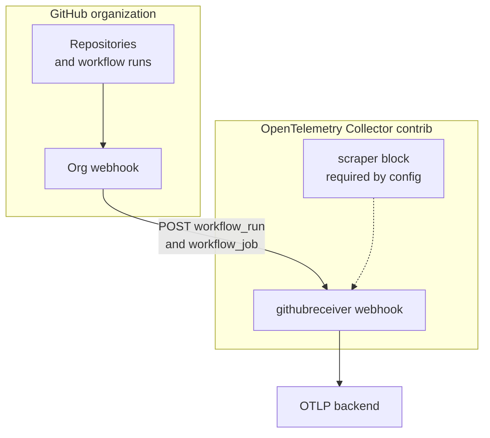
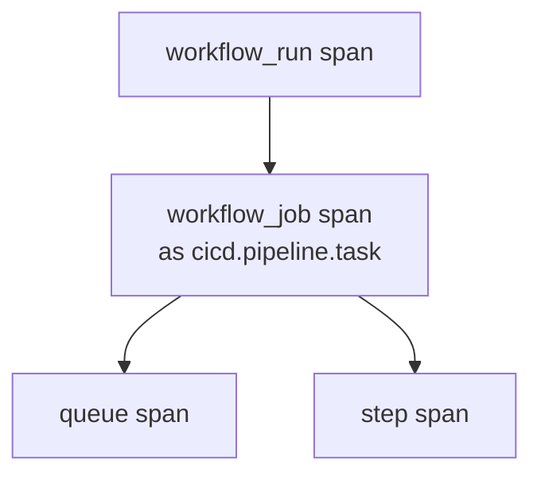

2026-09-08、CNCF Blog に [Distributed tracing for CI pipelines without touching a single workflow file](https://www.cncf.io/blog/2026/09/08/distributed-tracing-for-ci-pipelines-without-touching-a-single-workflow-file/) が公開されました。
著者は George Sims 氏です。
実装者寄稿であり、CNCF の公式仕様ではありません。

GitHub 組織 Webhook が送る `workflow_run` と `workflow_job` を、OpenTelemetry Collector contrib の **githubreceiver** が受け、OTLP トレースに変換します。
組織に Webhook を1本向ければ、配下リポジトリの CI 実行が Collector に届きます。
各リポジトリの workflow YAML に計装ステップを足す必要はありません。

読者が得るものは、収集の外形、span の入れ子と決定論 ID、既存の平均メトリクスとの役割分担、パイロット時の版ピンと欠測対策です。

:::message
寄稿の公開は 2026-09-08、本稿の参照は 2026-09-10 時点です。拘束力のある正本は GitHub Docs と githubreceiver README です。githubreceiver の安定性は alpha（metrics と traces）です。
:::


*この記事の全体像。以下、順に解説します。*

## GitHub組織WebhookによるCIトレース収集とは

GitHub は組織、リポジトリ、GitHub App のいずれでも `workflow_run` と `workflow_job` を購読できます。
組織 Webhook の作成は organization owner です。
Collector 側は contrib 配布の githubreceiver です。
Semantic Conventions は README 記載 1.40.0 です。

同じ receiver は GraphQL / REST の VCS メトリクス scrape も持ちます。
traces パイプラインとは別機能です。
既存の OTLP backend（Tempo、Jaeger、商用 APM など）へ exporter できます。

流れは次です。



webhook 設定は `endpoint` / `path`（既定 `/events`）/ `health_path`（既定 `/health`）/ `secret` / `required_headers` / `service_name` / `include_span_events` です。
endpoint の factory 既定は `localhost:8080` です。
GitHub は payload URL に `localhost` を拒否します。
traces だけ使う場合も、設定バリデーションは scraper ブロックを1つ要求します。
README は dummy で足りると書きます。

公式 README の traces 向け例です。

```yaml
receivers:
    github:
        webhook:
            endpoint: localhost:19418
            path: /events
            health_path: /health
            secret: ${env:SECRET_STRING_VAR}
            service_name: github-actions
            required_headers:
                WAF-Header: "value"
        scrapers:
            scraper:
                github_org: open-telemetry
```

span は workflow_run の下に job があり、job の下に queue と step が並びます。
job は `cicd.pipeline.task` です。
UseCheckRunID は beta で、v0.151.0 から既定 ON です。
job / step / queue の Span ID を `check_run_id` から作ります。
step は raw の `name:` もハッシュに入れます。
`trace_event_handling.go` は queue と step を job の子にします。



ID の入力は README の表です。

| Span | ハッシュ入力 |
|---|---|
| Trace | `sha256("{run_id}{run_attempt}t")` の先頭 32 hex |
| Root | `sha256("{run_id}{run_attempt}s")` の 16–32 hex |
| Job | `sha256("{check_run_id}-j")` の 16–32 hex |
| Step | `sha256("{check_run_id}-{step_name}-s")` の 16–32 hex |
| Queue | `sha256("{check_run_id}-q")` の 16–32 hex |

決定論 step Span ID は、job 内の `name:` 一意を要求します。
GitHub も actionlint も強制しません。
重複時は WARN で同じ Span ID になり、子は最初の発生に付きます。

`service.name` の優先順位は、webhook 設定の `service_name`、Custom Property `service_name`、リポジトリ名、`unknown_service` です。
リポジトリの Custom Properties は `github.repository.custom_properties.*` として resource に載ります。
`service_name` キーは `service.name` に使います。

githubreceiver は `workflow_run` / `workflow_job` の **completed** だけを span 化します。
`in_progress` などは HTTP 204 でスキップします。
GitHub 側は 2xx なので成功扱いです。

GitHub は 10 秒以内の 2xx を要求し、処理はキューしてよい、と Best practices に書きます。
Collector の read/write timeout 上限は 10s で整合します。
factory 既定は `read_timeout=500ms`、`write_timeout=500ms` です。

## 注意点

寄稿は「GitHub の insights は per-repo で、org 横断ビューが無い」と書きます。
GitHub Cloud では 2025-03-14 以降、org Insights の Actions Performance Metrics が GA です。
平均実行時間、平均キュー時間、失敗率を org 横断で見られます。
期間は最長 1 年、Custom は最大 100 日です。
全 Cloud プランが対象です。
githubreceiver の固有価値は平均 UI ではなく、run 単位のトレースとアプリトレースとの相関、既存 OTLP アラートです。

寄稿の収集量は「多くの org ではアプリトレースに対して rounding error」と定性だけです。
span 数やバイトの一次実測は寄稿にありません。
見積もりの方法は、総リポ数を捨て、稼働リポ × run × step です。
`include_span_events: true` は span ごとに typical 5–50KB の raw JSON が乗ります。
既定は false です。

githubreceiver は alpha です。
Collector 公式の alpha は limited non-critical workloads 向けです。
設定破壊は changelog 記載で足り、migration path は必須ではありません。
README の Migration Notes は `organization.name` → `vcs.owner.name` などの属性名破壊を既に記録しています。
Unmaintained は 3 ヶ月で distro から削除されます。

「YAML に触れない」は webhook 収集の外形（workflow / job / step の時間と成否）に限ります。
step 内コマンドの相関は `run-with-telemetry` など別経路で OTLP を出します。
メンテナは Issue [#37873](https://github.com/open-telemetry/opentelemetry-collector-contrib/issues/37873) でその切り分けを明示しています。

待機と実行の分離は、README に queue span の ID がある一方、Issue [#46590](https://github.com/open-telemetry/opentelemetry-collector-contrib/issues/46590)（OPEN、2026-03-03〜）は「現行モデルでは job の実実行時間を直接測れない（引き算が必要）」と残しています。
ARC の fleet メトリクス（`gha_job_startup_duration_seconds` など）は別レイヤーです。
寄稿自身も「両方走れ」と書きます。

CVE-2026-55701 / [GHSA-w5cv-pw74-4rxc](https://github.com/advisories/GHSA-w5cv-pw74-4rxc)（GitHub Advisory、2026-06-18 レビュー。NVD 本文は 2026-09-10 時点未収録）では、`required_headers` が **0.150.0 以下**でリクエスト時に検査されません。
`secret` が空だと HMAC もスキップします。
パッチは **0.151.0** です。
現行 main の `handleReq` は検査します。

GitHub.com は失敗 webhook を自動再配信しません。
応答 10 秒超は失敗です。
UI / API の再配信窓は過去 3 日です。
3 日を超えた欠測は戻りません。
再送ジョブは collector とは別コンポーネントです。
payload 25MB 超は未配信です。
org / repo webhook はイベント種別あたり 20 本です（github.com docs）。

webhook は IPv6 非対応です。
`/meta` は IPv6 レンジを返します。
IPv6 レンジをそのまま allow しても、現状の配信は IPv4 です。

GHES は応答 30 秒、global webhook の配信 API なし、Insights 相当ページは 2026-09-10 時点の公式ページ検索では見つかりませんでした。
receiver の timeout 上限は 10s です。
Cloud 手順をそのままコピーする対象ではありません。

skipped step を failure にマップする Issue [#49769](https://github.com/open-telemetry/opentelemetry-collector-contrib/issues/49769) は OPEN です。
失敗率に skipped を混ぜないでください。

UseCheckRunID ON 時、`check_run_id` 欠落は reject です。
どの GHES / runner 版で欠落が起きるかは、公開一次情報では確定していません。

traces パイプラインだけのとき、dummy scraper が実行時に GraphQL を叩くかはデプロイ構成に依存します。
設定必須と metrics パイプライン有効は別です。
dummy に実 org と PAT を入れると、意図せず scrape が走ることがあります。

## 既存の観測手段とどこが違うか

比較の軸は、YAML 変更、org 横断、粒度、queue と run の分離、成熟度、公開面、運用負荷です。

| 基準 | 組織 Webhook + githubreceiver | GitHub Actions Performance Metrics | YAML 計装（paper2 / krzko） | ARC scale set メトリクス |
|---|---|---|---|---|
| YAML 変更 | 収集そのものは不要。step 名一意と in-step 相関は別 | 不要 | 監視 YAML または各 step の置換 | workflow 不要。Helm metrics が必要 |
| org 横断 | webhook 1本で配下 repo。新規 repo も届く | Cloud で GA。平均 queue / run / 失敗率 | repo ごとの opt-in。列挙漏れが死角 | その scale set の self-hosted だけ |
| 粒度 | run / job / step / queue の span | 平均。step なし。UI（REST 索引に Performance エンドポイントなし、2026-09-10） | paper2 は完了後再構成。krzko は step 内 OTLP | fleet の depth と startup/execution histogram |
| queue vs run | queue span ID あり。exec 直接計測は #46590 OPEN | 平均 queue と平均 run を分離 | paper2 は `queued_duration` と `duration` | `gha_job_startup_duration_seconds` と `gha_job_execution_duration_seconds` |
| 成熟度 | alpha。contrib。設定破壊あり | Cloud GA（2025-03-14）。Enterprise 集計は changelog 時点 preview | paper2 は継続更新。krzko/setup-telemetry は 2024-05 最終 push | GitHub サポートの scale set。サンプル Grafana は非サポート宣言 |
| 公開面 | Collector の HTTPS エンドポイント | GitHub 側 | 主に OTLP 出口。org webhook は不要 | クラスタ内 Prometheus |
| 運用 | secret、WAF、IP 更新、再送スクリプト、版ピン、pager | Insights 権限 | token、API rate、workflow 配布 | Prometheus、listener 再起動で counter リセット |

paper2/github-actions-opentelemetry は約 80 stars（83、2026-09-10）です。
`on.workflow_run` で完了後に API から traces / metrics を送ります。
README は「既存 workflow を改変しない」と書きますが、監視用 YAML はその repo に置きます。

krzko/run-with-telemetry は約 30 stars（35、2026-09-10）です。
githubreceiver の決定論 ID と結合する設計です。
PR #26 は check_run_id 切替で OPEN です。
contrib v0.151.0 未満とは破壊的、と PR が述べます。

ARC（actions/actions-runner-controller）は約 6.5k stars（6487、2026-09-10）です。
現行は `gha_*` です。
レガシー `github_workflow_job_queue_duration_seconds` は旧 actionsmetrics です。

Cloud では「横断ビューが無いから githubreceiver を必須にする」は成り立ちません。
run 単位のトレース、アプリトレースとの相関、既存 OTLP アラートが欲しいときに、組織 Webhook + githubreceiver は YAML 計装より配布コストが低いです。
alpha、欠測、公開面、所有を条件付きで飲む前提です。

「1本立てて採用」は過大です。
Cloud では Insights を正の平均観測にし、githubreceiver はトレース層のオプションとします。
GHES では Insights 欠如が動機になり得ますが、drop-in ではありません。

逆転条件は次です。

- Insights の平均だけで意思決定できるなら、githubreceiver は不要です。
- in-step のコマンド観測が主目的なら、YAML 計装が主で、webhook は親トレースです。
- contrib を latest 追従する運用しか取れないなら、alpha の設定破壊を飲めません。

## パイロットするときの判断基準

評価基準は、YAML 配布コスト、org 横断の欠測、queue と run の分離、公開面、成熟度、所有です。

**GitHub Cloud** では、平均の queue / 失敗率は Insights を正本にします。
githubreceiver は「1 run をトレースとして辿る」「アプリトレースと同じ backend でアラートする」要求があるときだけパイロットします。

パイロット条件です。

1. contrib **0.151.0 以上**をピンする。`webhook.secret` を空にしない。WAF または `required_headers`（0.151.0+）。公開面は GitHub `hooks` CIDR の定期更新を別ジョブにする
2. 10 秒以内に 2xx を返し、変換は非同期にする。org webhook の failed deliveries を 6 時間ごと程度で再送する公式サンプルを別 workflow で回す。3 日を超えた停止は永久欠測と扱う
3. traces だけなら metrics パイプラインに github を載せない。dummy scraper に実 org + PAT を入れない。`include_span_events` は容量見積もりが終わるまで false
4. job 内 step `name:` を一意にする。skipped を失敗率に使わない（#49769 OPEN）
5. ARC を使っているなら fleet メトリクスは残す。githubreceiver で置換しない
6. collector、webhook、再送ジョブ、アラート、版上げの pager を指名してから本番に載せる
7. GHES では、応答 30 秒と receiver 10s 上限、global webhook の配信 API 欠如、Insights 有無を先に検証する

GitHub は 10 秒以内に 2xx を返せば、重い変換をキューしてよい、と書きます。
secret 不正は receiver が HTTP 400 です。
未完了イベントは 204 です。
scraper を有効にした場合、429 / 502–504 はリトライします。
primary GraphQL 枯渇は Issue [#48538](https://github.com/open-telemetry/opentelemetry-collector-contrib/issues/48538) OPEN で、リトライ対象外の報告があります。

認証の境界です。

| 経路 | 必要な権限 |
|---|---|
| org webhook 作成 | organization owner（REST は classic PAT/OAuth の `admin:org_hook`） |
| GitHub App で両イベント購読 | Actions の少なくとも read |
| scraper の PAT | 対象 repo の read。不足時は repository count のみ |
| webhook 改ざん防止 | `webhook.secret`（空だと HMAC スキップ） |

scraper を実際に回す場合、README の collection_interval 既定は 30s、推奨は 300s です。
scraperhelper のコード既定は 1m で、README と不一致です。
GraphQL は PAT で 5,000 points/h、同時 100、concurrency_limit 既定 50 です。

githubreceiver を本番投入して撤退した公開事例は、2026-09-10 時点では見つかりませんでした。
本番の可否は、自組織の欠測許容と pager 所有で決めてください。

## まとめ

組織 Webhook 1本と githubreceiver で、配下リポジトリの CI 実行を OTLP トレースにできます。
各 workflow YAML への計装は、外形の収集には不要です。

Cloud の平均 queue / 失敗率は Insights が正本です。
githubreceiver は run 単位のトレースとアプリトレースとの相関が欲しいときのオプションです。
採用するなら contrib 0.151.0 以上、空でない secret、10 秒以内の 2xx、3 日窓の再送、step 名一意、ARC との併用をセットにします。

この記事が少しでも参考になった、あるいは改善点などがあれば、ぜひリアクションやコメント、SNSでのシェアをいただけると励みになります！

## 参考リンク

1. George Sims, “Distributed tracing for CI pipelines without touching a single workflow file”, CNCF Blog, 2026-09-08. https://www.cncf.io/blog/2026/09/08/distributed-tracing-for-ci-pipelines-without-touching-a-single-workflow-file/
2. OpenTelemetry Collector contrib, githubreceiver README. https://github.com/open-telemetry/opentelemetry-collector-contrib/blob/main/receiver/githubreceiver/README.md
3. githubreceiver documentation.md（メトリクスと UseCheckRunID）. https://github.com/open-telemetry/opentelemetry-collector-contrib/blob/main/receiver/githubreceiver/documentation.md
4. OpenTelemetry Collector, component-stability.md（alpha / unmaintained）. https://github.com/open-telemetry/opentelemetry-collector/blob/main/docs/component-stability.md
5. GitHub Docs, Creating webhooks. https://docs.github.com/en/webhooks/using-webhooks/creating-webhooks
6. GitHub Docs, Best practices for using webhooks（10 秒、IP、secret）. https://docs.github.com/en/webhooks/using-webhooks/best-practices-for-using-webhooks
7. GitHub Docs, Handling failed webhook deliveries / Redelivering webhooks（自動再送なし、3 日）. https://docs.github.com/en/webhooks/using-webhooks/handling-failed-webhook-deliveries
8. GitHub Docs, About webhooks（IPv6 非対応）. https://docs.github.com/en/webhooks/about-webhooks
9. GitHub Docs, Viewing GitHub Actions metrics / About GitHub Actions metrics. https://docs.github.com/en/actions/administering-github-actions/viewing-github-actions-metrics
10. GitHub Changelog, Actions Performance Metrics GA, 2025-03-14. https://github.blog/changelog/2025-03-14-actions-performance-metrics-are-generally-available-and-enterprise-level-metrics-are-in-public-preview/
11. GitHub Advisory GHSA-w5cv-pw74-4rxc / CVE-2026-55701. https://github.com/advisories/GHSA-w5cv-pw74-4rxc
12. Issues（open-telemetry/opentelemetry-collector-contrib）: [#37873](https://github.com/open-telemetry/opentelemetry-collector-contrib/issues/37873) CLOSED。[#44856](https://github.com/open-telemetry/opentelemetry-collector-contrib/issues/44856) OPEN。[#46590](https://github.com/open-telemetry/opentelemetry-collector-contrib/issues/46590) OPEN。[#48538](https://github.com/open-telemetry/opentelemetry-collector-contrib/issues/48538) OPEN。[#49769](https://github.com/open-telemetry/opentelemetry-collector-contrib/issues/49769) OPEN
13. GitHub Docs, ARC metrics. https://docs.github.com/en/actions/how-tos/hosting-your-own-runners/managing-self-hosted-runners-with-actions-runner-controller/deploying-runner-scale-sets-with-actions-runner-controller
14. paper2/github-actions-opentelemetry README. https://github.com/paper2/github-actions-opentelemetry
