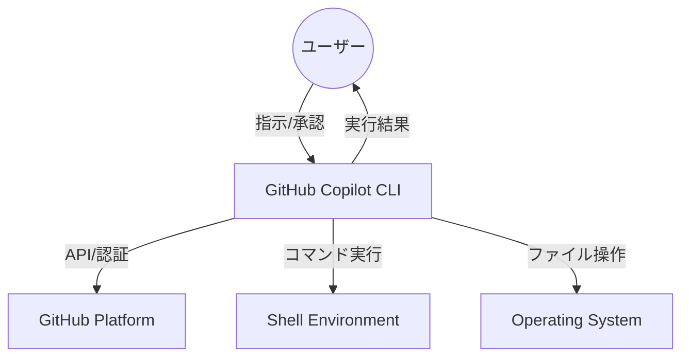
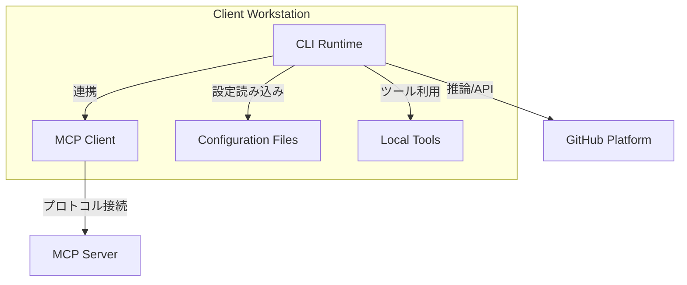
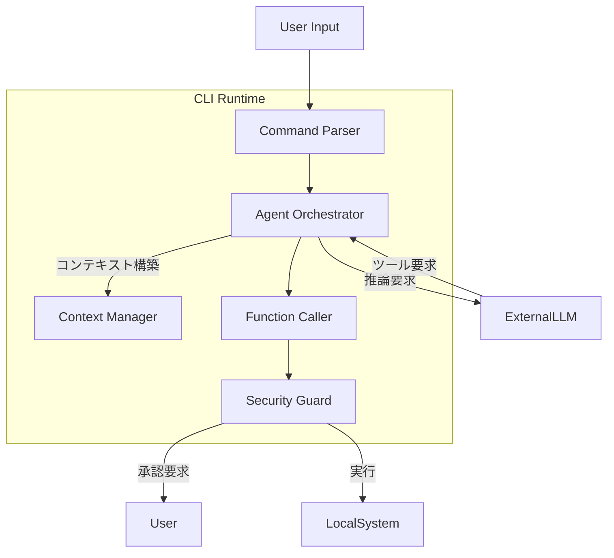
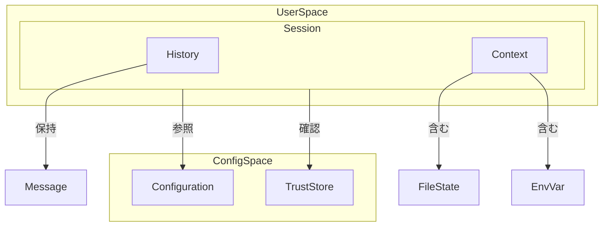
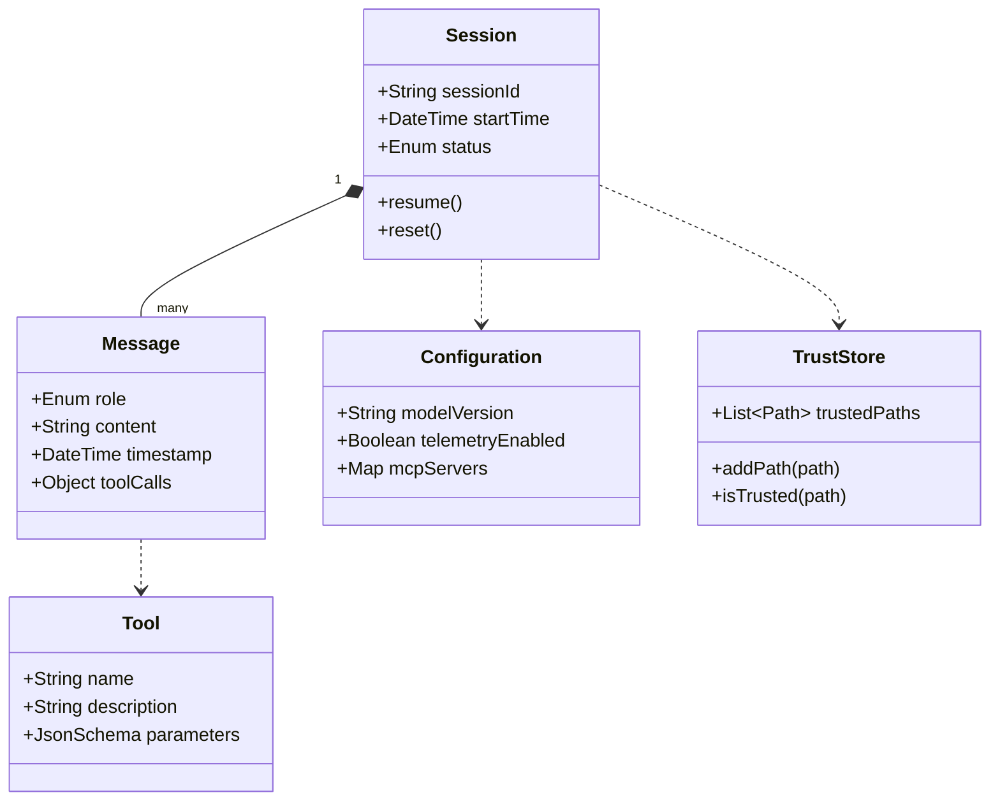

## ■概要
**GitHub Copilot CLI**（パッケージ名: `@github/copilot`）は、ターミナル環境におけるAI支援を「単なるコマンド提案」から「自律的なエージェント」へと進化させた次世代の開発ツールです。

従来の拡張機能（`gh-copilot`）とは一線を画し、**状況認識（Perception）**、**ファイル操作（Action）**、そして**Model Context Protocol（MCP）**による外部ツール連携を備えています。これにより、開発者の曖昧な意図を理解し、複雑なタスクを計画・実行・検証する能力を持ちます。

## ■特徴
- **エージェンティック・ワークフロー**: 状況認識、推論、実行、検証、修正のループ（OODAループ）を自律的に回し、タスクを完結させます。
- **ディープ・コンテキスト統合**: 現在のディレクトリ構造、Gitの差分、ファイル内容を深く読み取り、文脈に即した操作を行います。
- **Model Context Protocol (MCP)**: データベース（SQLite, PostgreSQL）や社内APIなど、外部データソースと標準プロトコルで接続し、CLIの能力を拡張可能です。
- **ガバナンスと安全性**: ディレクトリごとの信頼設定（Directory Trust Model）や、実行前の明示的な承認フローにより、セキュアな運用を担保します。

## ■構造

### ●システムコンテキスト図
GitHub Copilot CLIを取り巻く相互作用の全体像です。



| 要素名                 | 説明                                                                                   |
| :--------------------- | :------------------------------------------------------------------------------------- |
| **ユーザー**           | 開発者。ターミナルを通じて指示を出し、重要な操作（ファイルの書き換え等）を承認します。 |
| **GitHub Copilot CLI** | ユーザーの意図を解釈し、計画立案から実行までを担うAIエージェント。                     |
| **GitHub Platform**    | LLM推論API、認証、およびリポジトリ情報（Issue/PR）へのアクセスを提供します。           |
| **Shell Environment**  | Bash, Zsh, PowerShellなどのシェル。コマンドの実行環境として機能します。                |
| **Operating System**   | ファイルシステムやプロセス管理などのローカルリソースを提供します。                     |

### ●コンテナ図
CLI内部の実行コンテナと外部接続の構成です。



| 要素名                  | 説明                                                                      |
| :---------------------- | :------------------------------------------------------------------------ |
| **CLI Runtime**         | Node.js上で動作するアプリケーション本体。エージェントループを管理します。 |
| **MCP Client**          | 外部MCPサーバーと通信するためのクライアントモジュール。                   |
| **Configuration Files** | `~/.copilot/` 配下の設定および信頼済みパスリスト。                        |
| **MCP Server**          | DBやAPIなどへのアクセスを提供する独立プロセス。                           |

### ●コンポーネント図
CLI Runtime内部の詳細なコンポーネント構成です。



| 要素名                | 説明                                                                                                       |
| :-------------------- | :--------------------------------------------------------------------------------------------------------- |
| **CommandParser**     | ユーザーからの自然言語入力やオプションフラグを解析します。                                                 |
| **ContextManager**    | 作業ディレクトリのファイルや対話履歴を集約し、LLMへのプロンプトを構築します。                              |
| **AgentOrchestrator** | 推論、ツール実行、結果のフィードバックというエージェントループを制御します。                               |
| **FunctionCaller**    | LLMからの要求に基づき、具体的なツール（コマンド実行、ファイル編集など）を呼び出します。                    |
| **SecurityGuard**     | 重要な操作（書き込み、実行）をインターセプトし、ユーザーの承認やディレクトリ信頼設定に基づいて制御します。 |

## ■データ

### ●概念モデル
Copilot CLIが内部で扱う主要な概念とその関係性を示します。



| 要素名            | 説明                                                |
| :---------------- | :-------------------------------------------------- |
| **Session**       | ユーザーとの一連の対話セッション。                  |
| **History**       | 過去の対話（プロンプトと回答）の記録。              |
| **Context**       | LLMに送られる現在の状況（ファイル、環境変数など）。 |
| **Configuration** | ユーザー設定（使用モデル、テレメトリ設定など）。    |
| **TrustStore**    | 信頼済みディレクトリのリスト。                      |

### ●情報モデル
主要なエンティティの属性詳細を示します。



| 要素名            | 説明                                                                                             |
| :---------------- | :----------------------------------------------------------------------------------------------- |
| **Session**       | セッションIDや開始時刻を持ち、対話の状態を管理するための操作（resume, reset）を持ちます。        |
| **Message**       | 役割（User/Assistant）、内容、および必要に応じたツール呼び出しの情報を持ちます。                 |
| **Configuration** | 使用するAIモデルのバージョンや、接続するMCPサーバーの設定（`mcp-config.json`相当）を管理します。 |
| **TrustStore**    | セキュリティ境界を定義するための信頼済みパスの集合です。                                         |
| **Tool**          | エージェントが利用可能な機能（`run_command`, `edit_file`など）の定義です。                       |

## ■構築方法

### ●前提条件の確認
- **Node.js**: バージョン22以上（v22+）が必要です。
- **npm**: バージョン10以上が必要です。
- **サブスクリプション**: GitHub Copilot契約（Individual/Business/Enterprise）が必要です。

### ●インストール
npmを利用してグローバルにインストールします。旧来の`gh extension`ではありません。
```bash
npm install -g @github/copilot
```

### ●認証設定
GitHubアカウントとの紐づけを行います。
```bash
copilot auth login
```
ブラウザ認証フローを経て、デバイスコードを入力することで認証が完了します。

## ■利用方法

### ●基本操作（インタラクティブモード）
対話形式でタスクを進めます。多くのコンテキスト情報を必要とする複雑な依頼に向いています。

```bash
copilot
```

### ●ワンライナー実行（プログラマティックモード）
単一の指示を素早く実行する場合に使用します。
```bash
copilot -p "ローカルの全てのDockerコンテナを停止して削除する"
```

### ●エイリアスの活用
シェル設定（`.bashrc` / `.zshrc`）にエイリアスを追加することで、シームレスに利用できます。
```bash
# Zshの場合の設定例
eval "$(copilot alias -- zsh)"
```
設定後は以下のショートコマンドが利用可能です。
- `?? [質問]`: 一般的なコマンド生成や質問。
- `git? [要件]`: Git操作に特化した提案。
- `gh? [要件]`: GitHub CLI操作の提案。

### ●コンテキスト管理
対話が長引いた場合や、新しいタスクを開始する場合はリセットします。
```bash
# チャット内で実行
/reset
```

## ■運用

### ●アップデート
npmパッケージとして提供されるため、定期的な更新が推奨されます。
```bash
npm update -g @github/copilot
```

### ●セキュリティガバナンス（ディレクトリトラスト）
初回起動時や新しいディレクトリでの作業時に、信頼確認が行われます。
- **推奨**: プロジェクトのルートディレクトリのみを信頼する。
- **非推奨**: ホームディレクトリ（`~`）全体を永続的に信頼する（`.ssh`などへのアクセスリスクがあるため）。

### ●設定ファイルの配置変更 (`XDG_CONFIG_HOME`)
デフォルトでは `~/.copilot` に設定やログが保存されますが、環境変数 `XDG_CONFIG_HOME` を設定することで保存先を変更可能です。ドットファイル管理ツール等でパスを制御したい場合に利用します。

### ●MCPサーバーの追加
`~/.copilot/mcp-config.json` を編集するか、コマンドで追加します。
```bash
# チャット内で実行
/mcp add sqlite --command "npx -y @modelcontextprotocol/server-sqlite"
```

### ● モデルの切り替え (/model)
タスクの難易度や速度要件に応じて、対話中にAIモデルを即座に切り替えられます。
```bash
# チャット内で実行
/model
```
実行すると、現在利用可能なモデル（例: `gpt-4o`, `claude-3.5-sonnet` など）のリストが表示され、矢印キーで選択できます。
- **高速な応答**: 軽いモデル（例: Standardモデル）
- **複雑な推論**: 高性能モデル（例: Sonnet, o1-preview等 ※利用可能な場合）

### ● その他の主要なスラッシュコマンド
チャット内で `/` を入力すると、利用可能なコマンドが補完されます。

| コマンド            | 機能                                           |
| :------------------ | :--------------------------------------------- |
| `/doc`              | コードへのドキュメント（JSDoc等）の追記。      |
| `/fix`              | バグやエラーの修正案提示。                     |
| `/fix-test-failure` | 失敗しているテストケースの特定と修正。         |
| `/tests`            | 新しいテストコードの生成。                     |
| `/explain`          | コードやコマンドの詳細解説。                   |
| `/clear`            | 現在の会話履歴を消去（コンテキストリセット）。 |
| `/help`             | コマンド一覧とヘルプの表示。                   |

#### 高度な操作
| コマンド          | 機能                                                             |
| :---------------- | :--------------------------------------------------------------- |
| `/add-dir [path]` | 信頼済みディレクトリを手動で追加。                               |
| `/cwd [path]`     | CLIセッション内での作業ディレクトリを変更。                      |
| `/delegate`       | GitHub上のエージェントにタスクを委譲（PR作成など ※ベータ機能）。 |

## ■ベストプラクティス

### ●コンテキストの明示
- **具体的であること**: 「動かない」だけでなく、エラーログをパイプで渡すと精度が向上します。
  ```bash
  cat error.log | copilot -p "このエラーの修正方法を教えて"
  ```

### ●ツールの一括承認の制限
- `--allow-all-tools` フラグは、CI/CD環境やサンドボックス内でのみ使用し、日常的な開発環境では使用しないようにします。都度承認（Allow Once）が最も安全です。

### ●エイリアスの常習化
- 思考を中断させないために、`??` や `git?` を日常的に使用し、CLIと対話する癖をつけることで生産性が向上します。

## ■リポジトリ定義とカスタマイズ (.github/)

Copilot CLIは、リポジトリ内の `.github/` ディレクトリにある特定のファイルを読み込み、その振る舞いを調整します。これらを体系的に整備することで、チーム全体でエージェントの品質を標準化できます。

| ファイル名 / パターン                         | 役割                                                                     | 適用スコープ                     |
| :-------------------------------------------- | :----------------------------------------------------------------------- | :------------------------------- |
| **copilot-instructions.md**                   | 全般的な指示、コーディング規約、禁止事項。                               | リポジトリ全体                   |
| **copilot-instructions/**/*.instructions.md** | 特定のファイルやディレクトリに限定した指示。                             | 指定したパス (`applyTo`)         |
| **AGENTS.md**                                 | エージェントのための読み物。アーキテクチャ、技術選定、ワークフロー定義。 | リポジトリまたは配置ディレクトリ |

### ● `copilot-instructions.md` (基本設定)
リポジトリのルート、または `.github/` 配下に配置します。
全セッションで常に読み込まれるため、**「絶対に守るべきルール」**（例：TypeScriptの厳格な型定義、禁止されているライブラリ）を記述します。

### ● パス固有のインストラクション (詳細設定)
`.github/copilot-instructions/` ディレクトリ配下に任意の `.instructions.md` ファイルを作成することで、特定のファイル群に対してのみ指示を適用できます。
ファイル内でYAMLフロントマターのような形式で対象を指定します。

```markdown
# .github/copilot-instructions/react.instructions.md
applyTo:
  - "**/*.tsx"
  - "**/*.ts"

# 指示内容
コンポーネントは関数コンポーネントとして定義し、React.memoによるメモ化を検討してください...
```

### ● `AGENTS.md` (エージェント定義)
人間向けの `README.md` に対し、AIエージェント向けのドキュメントとして `AGENTS.md` が利用されます。
これまでプロンプトで毎回説明していた「プロジェクトの構成」や「テストの実行手順」、「特定のタスクの進め方」を永続化できます。
- **配置**: ルートに置くと全体に適用され、サブディレクトリ（例: `backend/AGENTS.md`）に置くと、そのディレクトリ内での作業時に優先して読み込まれます。
- **内容例**:
  - プロジェクトの概要とゴール
  - 採用しているデザインパターン
  - データベースのスキーマ構造
  - テストおよびデプロイのワークフロー

## ■トラブルシューティング

### ●認証エラー
- **症状**: ログインがループする、またはトークンエラーが出る。
- **対処**: 旧拡張機能（`gh-copilot`）と競合している可能性があります。`gh extension remove github/gh-copilot` で削除し、`~/.config/github-copilot` を確認してください。

### ●ネットワーク/プロキシエラー
- **症状**: `ETIMEDOUT` や証明書エラー。
- **対処**: 環境変数 `HTTP_PROXY`, `HTTPS_PROXY` を設定してください。自己署名証明書の場合は `NODE_EXTRA_CA_CERTS` も必要です。

### ●「Truncated」メッセージ
- **症状**: コンテキストの一部が切り捨てられる。
- **対処**: `/reset` で履歴をクリアするか、`/model` でより大きなコンテキストウィンドウを持つモデルを選択してください。

## ■参考リンク

### 公式ドキュメント・アナウンス
- [GitHub Copilot CLI: How to get started - The GitHub Blog](https://github.blog/ai-and-ml/github-copilot/github-copilot-cli-how-to-get-started/)
- [About GitHub Copilot CLI - GitHub Docs](https://docs.github.com/copilot/concepts/agents/about-copilot-cli)
- [Using GitHub Copilot CLI - GitHub Docs](https://docs.github.com/en/copilot/how-tos/use-copilot-agents/use-copilot-cli)
- [Managing policies and features - GitHub Docs](https://docs.github.com/en/copilot/how-tos/administer-copilot/manage-for-organization/manage-policies)
- [Best practices for using GitHub Copilot](https://docs.github.com/en/copilot/get-started/best-practices)
- [GitHub Copilot Data Pipeline Security](https://resources.github.com/learn/pathways/copilot/essentials/how-github-copilot-handles-data/)

### アーキテクチャ・技術詳細
- [GitHub Copilot CLI: Architecture, Features, and Operational Protocols](https://shubh7.medium.com/github-copilot-cli-architecture-features-and-operational-protocols-f230b8b3789f)
- [GitHub Copilot CLI: Terminal-Native AI with Seamless GitHub Integration](https://medium.com/binbash-inc/github-copilot-cli-terminal-native-ai-with-seamless-github-integration-56be28aa7134)
- [Making Windows Terminal awesome with GitHub Copilot CLI](https://developer.microsoft.com/blog/making-windows-terminal-awesome-with-github-copilot-cli)

### MCP (Model Context Protocol) 関連
- [Use MCP servers in VS Code](https://code.visualstudio.com/docs/copilot/customization/mcp-servers)
- [Configure MCP server access for your organization](https://docs.github.com/en/copilot/how-tos/administer-copilot/manage-mcp-usage/configure-mcp-server-access)
- [Integrate Pieces Model Context Protocol (MCP) with GitHub Copilot](https://docs.pieces.app/products/mcp/github-copilot)
- [Google Gemini CLI MCP Docs](https://github.com/google-gemini/gemini-cli/blob/main/docs/tools/mcp-server.md)

### チュートリアル・活用ガイド
- [GitHub Copilot CLI 101: How to use GitHub Copilot from the command line](https://github.blog/ai-and-ml/github-copilot-cli-101-how-to-use-github-copilot-from-the-command-line/)
- [GitHub Copilot CLI: Comprehensive Tutorial with Hands-On Lab](https://atalupadhyay.wordpress.com/2025/10/27/github-copilot-cli-comprehensive-tutorial-with-hands-on-lab/)
- [Getting Started with GitHub Copilot in the CLI](https://www.thelazyadministrator.com/2024/03/22/getting-started-with-github-copilot-in-the-cli/)
- [Terminal-Native AI with Seamless GitHub Integration](https://lgallardo.com/2025/10/02/github-copilot-cli-terminal-native-ai/)

### トラブルシューティング・議論
- [Troubleshooting network errors for GitHub Copilot](https://docs.github.com/copilot/troubleshooting-github-copilot/troubleshooting-network-errors-for-github-copilot)
- [Network settings for GitHub Copilot](https://docs.github.com/en/copilot/concepts/network-settings)
- [Proxy authentication conflict between GitHub Copilot and GitHub CLI](https://github.com/github/copilot-cli/issues/751)
- [Unclear Context Truncation Behavior in Long Sessions](https://github.com/github/copilot-cli/issues/385)
- [Fully opt out of telemetry and prompt/completion data collection](https://github.com/continuedev/continue/issues/965)
