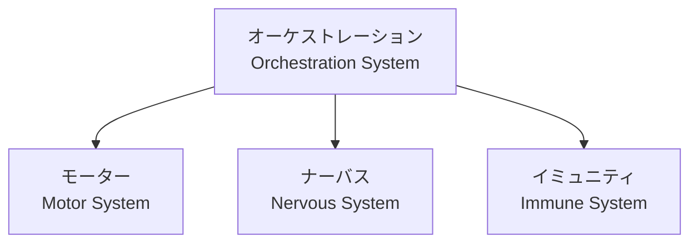
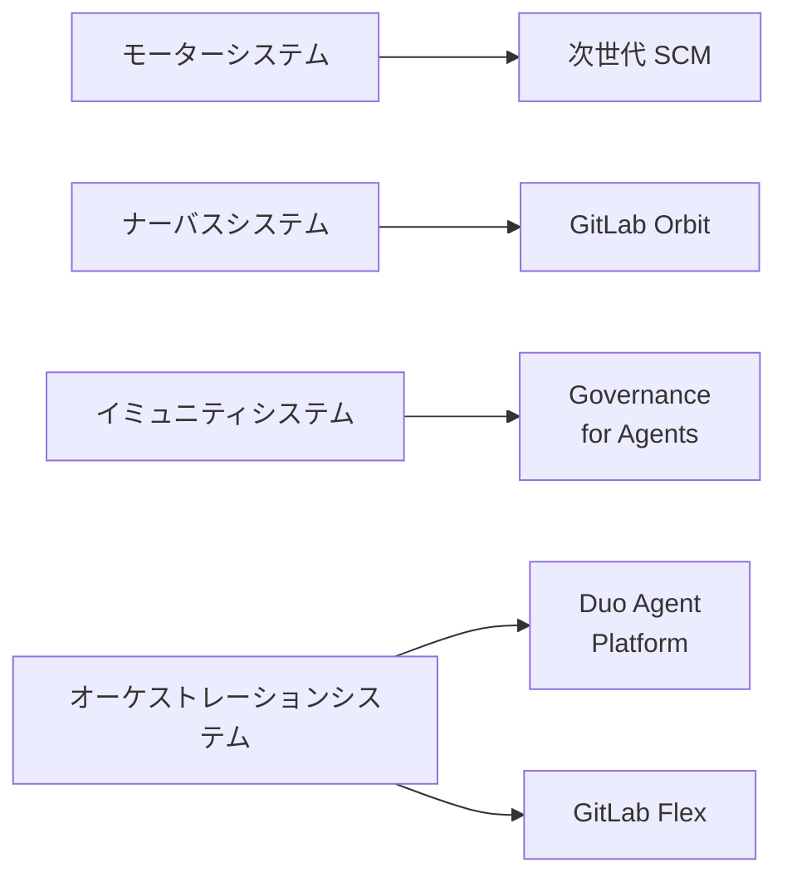
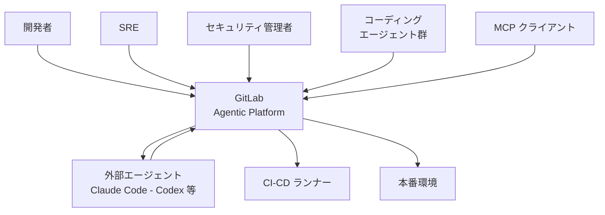
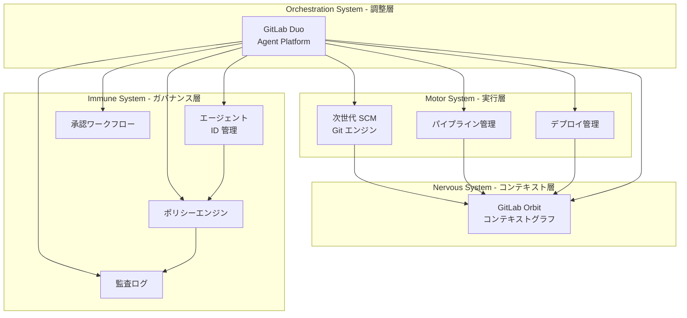
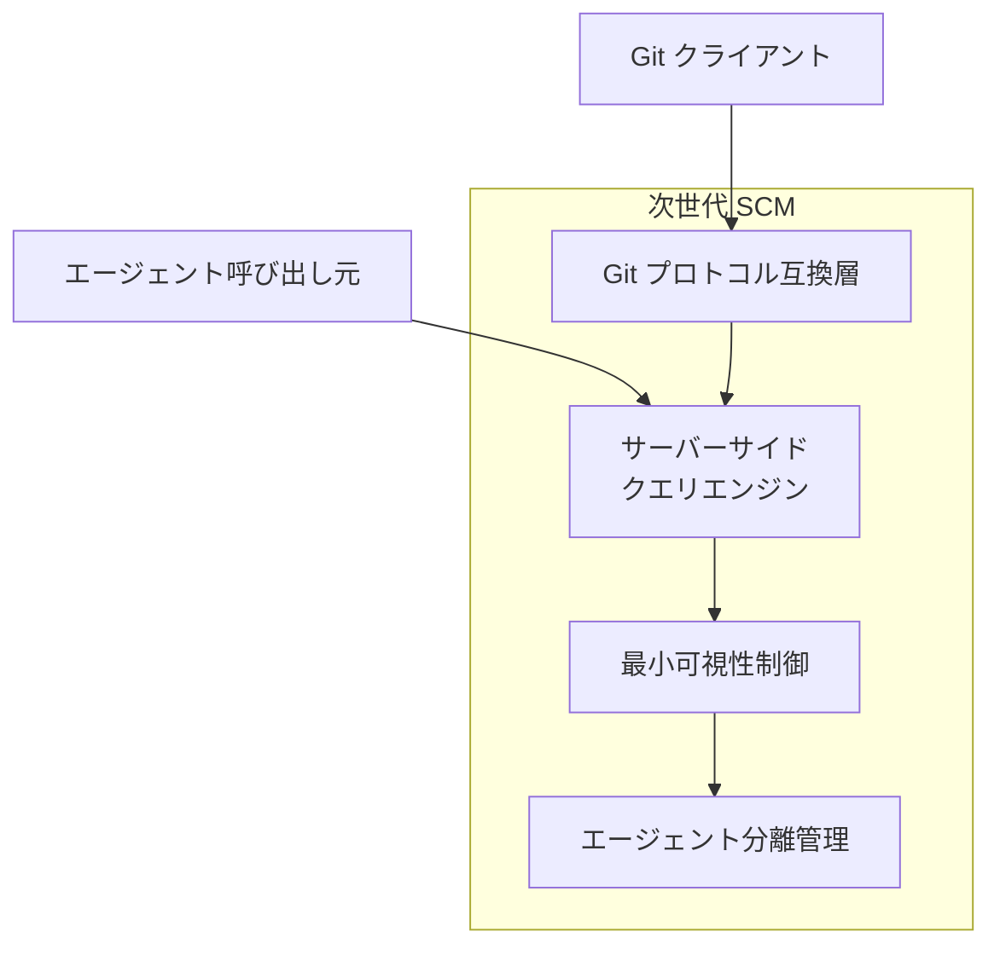
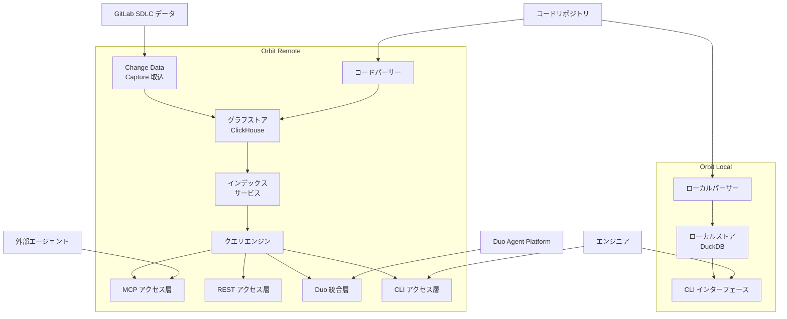
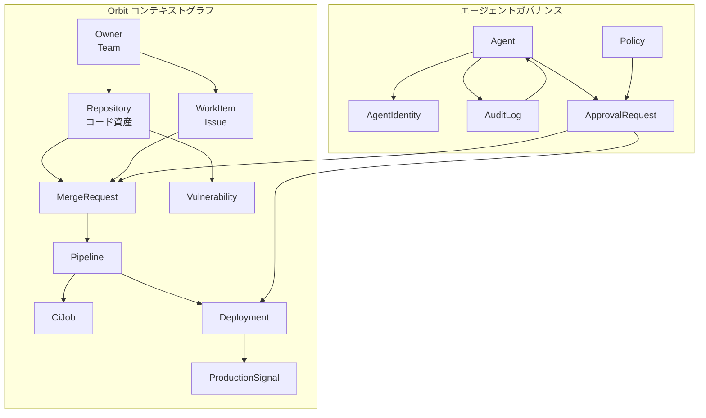
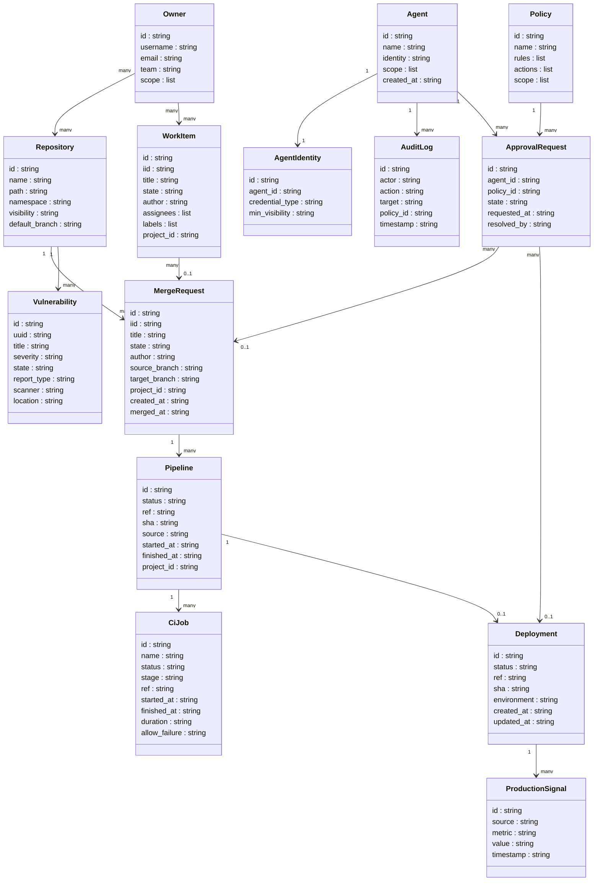
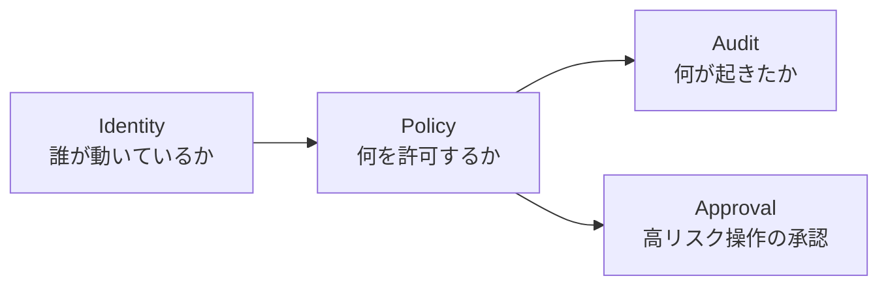
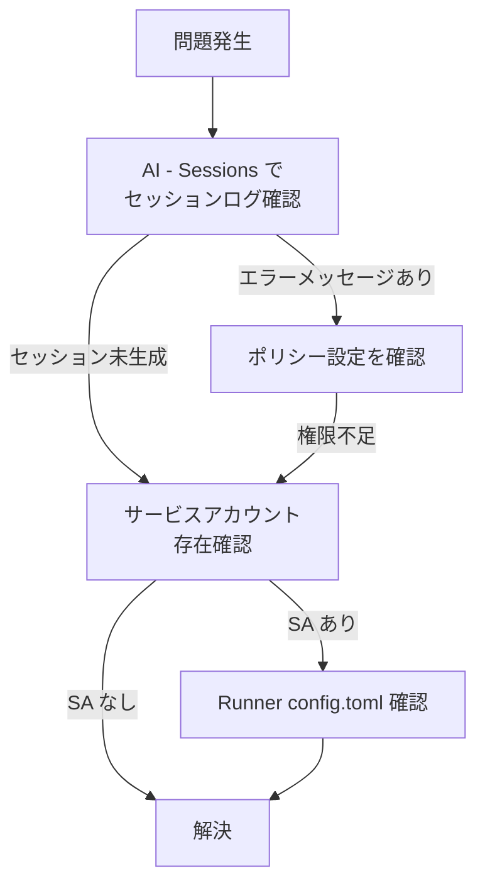

GitLab は 2026 年 6 月 10〜11 日に開催したオンラインイベント **GitLab Transcend** で、エージェント並列実行を前提にした次世代のソフトウェア開発プラットフォームを発表しました。本記事は、その中核である **次世代 SCM**・**GitLab Orbit**・**エージェント向けガバナンス**・**GitLab Duo Agent Platform**・**GitLab Flex** の構造とデータモデルを、公式情報をもとに整理します。

> 調査対象の起点: [GitLab: Built for the agentic engineering era](https://about.gitlab.com/blog/gitlab-transcend-announcements/)（日本語版あり、更新 2026-06-11）。各機能はベータ / GA 段階のため、最新の仕様は公式ドキュメントを確認してください。

## 概要

### なぜ「人間スケールの SCM」がボトルネックになるのか

ソフトウェア開発の主体がエージェントへ移行すると、人間が 1〜数人でリポジトリを操作する前提で設計された従来の Git バックエンドは、3 つの構造的な問題に直面します。

| 問題 | 内容 |
|---|---|
| クローンコスト | 1 ファイルを読むだけでも、エージェントごと・リトライごとにリポジトリ全体をクローンする |
| 並行処理の崩壊 | 数千のエージェントセッションが人間スケールのバックエンドに同時アクセスし、輻輳する |
| 分離の欠如 | エージェントがアカウントとブランチスペースを共有し、干渉と情報漏洩のリスクが生じる |

GitLab はこれらを「IDE やプロンプトの工夫では解けない、基盤の問題」と位置づけ、プラットフォーム全体を再設計しました。

### GitLab が再設計した「living system」とは

GitLab はプラットフォームを 4 つのシステムから成る **living system** として再定義しました。エージェントが知能であるか人間であるかを問わず、4 つすべてのシステムを利用して動作するという設計思想です。



| 要素名 | 説明 |
|---|---|
| モーターシステム | エージェントスケールでの実行を担う。ソースコントロール・パイプライン・デプロイメント |
| ナーバスシステム | エージェントと人間に的確な判断のためのコンテキストを提供する |
| イミュニティシステム | あらゆるアクションにプロアクティブなガバナンスとセキュリティを適用する |
| オーケストレーションシステム | 残り 3 つを統合し、チームとエージェントが計画・実行できるようにする |

### 5 つの発表機能と 4 システムの対応



| 機能 | 担当システム | ステータス |
|---|---|---|
| 次世代 SCM - Next-Generation SCM | モーターシステム | プライベートベータ |
| GitLab Orbit | ナーバスシステム | パブリックベータ |
| Governance for Agents | イミュニティシステム | プライベートベータ |
| GitLab Duo Agent Platform | オーケストレーションシステム | 一般提供 - 2026 年 1 月より |
| GitLab Flex | 購入モデル | 注文受付開始 |

GitLab Flex は購入・ライセンスモデルであり、技術的な Orchestration システムへの直接マッピングではなく便宜上の分類です。


### 関連技術との比較

#### 従来の Git/SCM と次世代 SCM

| 観点 | 従来の Git/SCM - 人間前提 | 次世代 SCM - エージェント前提 |
|---|---|---|
| 実行方式 | クライアントサイドのクローン | サーバーサイドのクエリ |
| スケール特性 | 数人〜数十人のセッションを想定 | 数千のエージェントセッションを並列処理 |
| トークン消費 | リポジトリ全体をコンテキストに展開 | タスクに必要な最小スコープのみ取得 |
| 分離 | アカウント・ブランチスペースを共有 | エージェントごとに最小可視性を強制 |
| ネットワーク | クローン全体を転送 | 必要なデータのみ転送 - 最大 1,000 分の 1 |

#### RAG ベースのコンテキスト供給と GitLab Orbit コンテキストグラフ

| 観点 | RAG - Retrieval-Augmented Generation | GitLab Orbit - コンテキストグラフ |
|---|---|---|
| 実行方式 | ベクトル検索 + 断片的なドキュメント取得 | グラフクエリによる構造化関係データ取得 |
| スケール特性 | ドキュメント粒度の類似度検索 | ノード/エッジ間のリレーション横断クエリ |
| トークン消費 | 文書全体を取得しコンテキストウィンドウを消費 | 要求したデータのみ返却 |
| 得意領域 | 非構造化テキスト検索 | コード・パイプライン・デプロイの因果関係追跡 |

GitLab が公開したコードレビュー精度の比較では、Compare the Market の協力により 79 件の実マージリクエストを検証し、Orbit ベースのコードレビューが約 70% の精度で正確なインラインコメント配置を達成したのに対し、RAG ベースは約 58% にとどまったと報告されています。要点の捕捉率も Orbit が 68%、RAG が 66% でした。GitLab は「RAG はコンテキストなしのアプローチを含む他のすべてのアプローチを下回った」とも述べています。

## 特徴

### 次世代 SCM - モーターシステム

- Git プロトコルとの後方互換性を維持しつつバックエンドを再設計する
- エージェントがサーバーサイドでリポジトリに対しタスクに必要な情報だけをクエリする
- 各エージェントをタスクに必要な最小可視性 (minimum visibility) に制限する
- 数千のエージェントを同一リポジトリに安全にデプロイできる

初期テストでの改善値（いずれも「最大」値）:

| 指標 | 改善値 |
|---|---|
| トークン消費 | 最大 2 分の 1 |
| 処理時間 - wall clock | 最大 50 倍高速 |
| ネットワークトラフィック | 最大 1,000 分の 1 |

### GitLab Orbit - ナーバスシステム

- ソフトウェアライフサイクル全体を単一のグラフにマッピングする — コード・作業アイテム・パイプライン・デプロイ・本番シグナル
- 変更データキャプチャ (Change Data Capture) により ClickHouse へ取り込み、イベント駆動で継続的に更新する
- MCP・REST・GitLab CLI の複数インターフェースで外部エージェントと接続する
- インデックス処理を独立サービスとして動作させ、GitLab インスタンスへ負荷を与えない
- GitLab Duo Agent Platform からはネイティブに呼び出せる

GitLab の初期テストでは、同一タスク・同一モデルの条件 (On the same tasks, with the same model) で Claude Code に Orbit を組み合わせると、応答が最大 11 倍高速、トークン消費は最大 4.5 分の 1、ハルシネーションは最大 45 分の 1 になったと報告されています。

### Governance for Agents - イミュニティシステム

- エージェントのすべてのアクションにアイデンティティ (identity) を付与する
- ポリシー (policy) に基づき実行前の承認ワークフローを適用する
- 入力・推論・ツール呼び出しを監査 (audit) として記録する
- 高リスク操作に承認 (approval) ゲートを設ける

### GitLab Duo Agent Platform - オーケストレーションシステム

- イシュー処理・コードレビュー・パイプライン修正をオーケストレーションする
- チーム固有のルールに基づいたコードレビューを実施する
- パイプライン障害を診断し、コード変更が必要か単純な再実行で足りるかを判別する
- 2026 年 1 月より一般提供 (GA)

### GitLab Flex - 購入モデル

- 年間コミットメント内でシート・AI 使用量・機能を月次調整できる
- 契約修正や新たな調達サイクルなしで機能追加に対応する
- シートと AI 消費量を単一のコミットメントで一元管理する

## 構造

C4 モデルの 3 段階で、プラットフォームの内部構造を図解します。

### システムコンテキスト図



#### アクター

| 要素名 | 説明 |
|---|---|
| 開発者 | コードの作成・レビュー・マージリクエスト操作を行う人間のユーザー |
| SRE | パイプライン・デプロイ・本番シグナルを監視・操作する人間のユーザー |
| セキュリティ管理者 | ポリシー設定・監査ログ確認・エージェントアクション承認を行う人間のユーザー |
| コーディングエージェント群 | GitLab Duo Agent Platform が管理する内部エージェント群 |

#### 外部システム

| 要素名 | 説明 |
|---|---|
| 外部エージェント | Claude Code・OpenAI Codex 等、MCP または REST 経由で接続する外部 AI エージェント |
| CI-CD ランナー | パイプラインジョブを実行する GitLab Runner インスタンス |
| 本番環境 | デプロイ先の本番インフラ。デプロイシグナルを返す |
| MCP クライアント | Model Context Protocol 対応の任意クライアント。Orbit のグラフクエリを呼び出す |

### コンテナ図



#### Motor System

| 要素名 | 説明 |
|---|---|
| 次世代 SCM - Git エンジン | エージェントスケールの並行性向けに再設計された Git バックエンド。Git プロトコル互換を維持しつつサーバーサイドクエリと最小可視性制御を実装する |
| パイプライン管理 | CI-CD パイプラインのトリガー・実行・障害診断を担う。ランナーへジョブを割り当てる |
| デプロイ管理 | 本番環境へのデプロイ操作と状態追跡を担う |

#### Nervous System

| 要素名 | 説明 |
|---|---|
| GitLab Orbit | コード・マージリクエスト・パイプライン・デプロイ・脆弱性・オーナーシップを単一グラフに継続的に保持するコンテキストグラフ |

#### Immune System

| 要素名 | 説明 |
|---|---|
| エージェント ID 管理 | 各エージェントに個別の ID を付与し、操作主体を特定する |
| ポリシーエンジン | エージェントアクションに対してポリシーを評価し、実行可否を決定する |
| 監査ログ | 入力・推論・ツール呼び出しを含む完全な実行コンテキストを記録する |
| 承認ワークフロー | 高リスク操作に対して人間の承認ゲートを設ける |

#### Orchestration System

| 要素名 | 説明 |
|---|---|
| GitLab Duo Agent Platform | Motor・Nervous・Immune の 3 システムを統合し、Issue からマージリクエスト・コードレビュー・パイプライン修正までのワークフローを自動調整する |

### コンポーネント図

#### 次世代 SCM - Motor System



| 要素名 | 説明 |
|---|---|
| Git プロトコル互換層 | 既存の Git クライアントおよびツールとの後方互換を保つ受付インターフェース |
| サーバーサイドクエリエンジン | エージェントが各タスクに必要なデータのみをサーバー側で取得する処理エンジン。フルクローン不要でトークン数・ネットワーク量を削減する |
| 最小可視性制御 | 各エージェントをタスクに必要なスコープのみに限定し、リポジトリ全体への不要なアクセスを遮断する |
| エージェント分離管理 | エージェントごとに独立したブランチスペースとアカウントスコープを割り当て、共有汚染を防ぐ |

#### GitLab Orbit - Nervous System



##### Orbit Remote コンポーネント

| 要素名 | 説明 |
|---|---|
| Change Data Capture 取込 | GitLab インスタンスの SDLC データ変更をキャプチャしグラフへ供給する |
| グラフストア - ClickHouse | プロジェクト・マージリクエスト・パイプライン・脆弱性等の複数ノード型とその関係を保持するストア |
| コードパーサー | ソースコードを取得し、複数言語の定義とクロスファイル参照を抽出してグラフに追加する |
| クエリエンジン | クエリ DSL を受け取り、コンパイラのようにバリデーション・最適化・セキュリティチェックを経て実行するサービス（公開リポジトリは Rust 主体だが、実装言語の一次明記は未確認） |
| インデックスサービス | グラフ構築処理を GitLab インスタンスから独立した別サービスとして実行し、本体への負荷を与えない |
| MCP アクセス層 | 外部エージェントへ MCP ツールを公開するアクセスインターフェース |
| REST アクセス層 | プログラム的なグラフクエリアクセスを提供する REST インターフェース |
| Duo 統合層 | GitLab Duo Agent Platform からのアクセス経路。MCP または REST と同じアクセス層を通り、グラフをネイティブに利用する（Duo 経由の課金扱いは公式ドキュメントで未確認） |
| CLI アクセス層 | `glab` CLI 経由でエンジニアやカスタムツールがグラフをクエリするインターフェース |

##### Orbit Local コンポーネント

| 要素名 | 説明 |
|---|---|
| ローカルパーサー | ローカルリポジトリを解析して定義とクロスファイル参照を抽出する CLI ツール |
| ローカルストア - DuckDB | ローカルに構築したコードグラフを保持するファイルベースのストア。SDLC データは含まない |
| CLI インターフェース | ローカルグラフに対してクエリを実行するコマンドラインインターフェース |

## データ

GitLab Orbit は、ソフトウェアライフサイクル全体のエンティティを単一のグラフへ継続的にマッピングします。GitLab 自身の規模では、5 億ノード（500M）・20 億エッジ（2B）規模のグラフを 45 分以内にインデックスすると報告されています。

なお公式ドキュメントは、Orbit のクエリ結果を「最終インデックスサイクル時点 (point-in-time) の SDLC 状態を反映するもの」と位置づけています。イベント駆動で鮮度を保ちつつも、厳密なトランザクション整合のリアルタイム参照ではない点に注意します。

### 概念モデル

Orbit グラフのノード種別と、エージェントガバナンスのエンティティの所有・参照関係を示します。



#### Orbit グラフのノード

| 要素名 | 説明 |
|---|---|
| Repository | コードを保持するプロジェクト単位のノード |
| WorkItem | Issue を含む作業追跡エンティティ |
| MergeRequest | コード変更のレビュー・マージ要求 |
| Pipeline | CI/CD の実行単位 |
| CiJob | Pipeline 内の個別ジョブ |
| Deployment | 特定環境へのリリース |
| Vulnerability | スキャンで検出されたセキュリティ欠陥 |
| Owner / Team | リポジトリ・Issue の所有者またはチーム |
| ProductionSignal | 本番環境からの観測シグナル（属性は推測 / 一般的構成） |

#### エージェントガバナンスのエンティティ

| 要素名 | 説明 |
|---|---|
| Agent | エージェント実行インスタンス |
| AgentIdentity | エージェントの認証・識別情報 |
| Policy | アクション許可・禁止のルールセット |
| AuditLog | エージェントアクションの監査証跡 |
| ApprovalRequest | ポリシーに基づく承認要求 |

### 情報モデル

主要エンティティの主要属性を示します。GitLab 公式 API ドキュメントで確認できたフィールドを核とし、Orbit 固有の追加属性やガバナンスエンティティの属性は推測を含みます。



#### エンティティ属性の出典区分

| エンティティ | 出典 |
|---|---|
| MergeRequest | GitLab Merge Requests API + Orbit 紹介ブログ |
| Pipeline | GitLab Pipelines API + Orbit 紹介ブログ |
| CiJob | GitLab Jobs API + Orbit 紹介ブログ |
| Deployment | GitLab Deployments API |
| Vulnerability | GitLab Vulnerability Findings API |
| Repository / WorkItem / Owner | GitLab 各 API（一般的構成） |
| ProductionSignal | Orbit 紹介ブログ言及のみ。属性は推測 / 一般的構成 |
| Agent / AgentIdentity | Orbit 紹介ブログ + 推測 / 一般的構成 |
| Policy / AuditLog / ApprovalRequest | Transcend 発表 (identity / policy / audit / approval) + 推測 / 一般的構成 |

### グラフのエッジ種別

Orbit 紹介ブログに掲載されたクエリ例から、以下のエッジ種別が確認できます。

| エッジ種別 | 起点ノード | 終点ノード |
|---|---|---|
| `RAN_IN` | CiJob | Pipeline |
| `FOR` | Pipeline | MergeRequest |

それ以外の関係（Repository → MergeRequest 等）は、GitLab の一般的なデータ構造から導いた構成です。

## 構築方法

### GitLab Orbit パブリックベータへの参加

GitLab Orbit はパブリックベータです。コンテキストグラフを GitLab.com 上に構築する **Orbit Remote** と、ローカルにコードグラフを構築する **Orbit Local** の 2 形態があります。

Orbit Remote の対象ティアは Premium / Ultimate（GitLab.com）です。公式の発表ブログでは「パブリックベータ」ですが、ドキュメント上は Orbit REST API が `Experiment`、glab / MCP / Orbit Local が `Beta` で、いずれも機能フラグ管理かつ本番利用前提ではない点に注意します。申込と有効化の手順は次のとおりです。

1. [GitLab Orbit 製品ページ](https://about.gitlab.com/gitlab-orbit/) の「Request early access」からフォームに記入する
2. GitLab.com にサインインし、対象のトップレベルグループの Owner ロールを確認する
3. 左サイドバーの **Orbit > Configuration** を開く
4. 対象のトップレベルグループの「Enable」トグルをオンにする

初回インデックス処理はグループの規模に応じて時間がかかります。進捗は次のコマンドで確認します。

```bash
glab orbit remote graph-status --full-path your-group
```

### 次世代 SCM / ガバナンスのプライベートベータ申請

次世代 SCM と Governance for Agents はいずれもプライベートベータです。[Early Access & Preview Partner プログラム](https://about.gitlab.com/early-access-preview/) のフォームから申し込みます。対象は、ソリューション評価を担うエンジニアリングリーダー・プラットフォームオーナー・AI 導入を推進するエグゼクティブです。

### GitLab Duo Agent Platform の有効化

GitLab Duo Agent Platform は 2026 年 1 月より一般提供されており、既定でオンです。無効化されている場合は、GitLab.com のグループで次の手順で有効化します。

1. 対象グループの **Settings > GitLab Duo** を開く
2. 「Change configuration」を選択する
3. 「Turn on GitLab Duo Agentic Chat, agents, and flows」を有効にする
4. 「Save changes」をクリックする

Self-Managed では右上の **Admin** エリアから **GitLab Duo** を開き、同じ設定を行います。

### Orbit Local のセットアップ

Orbit Local は `glab` バージョン 1.94 以降を前提とします。ローカル処理のため GitLab Credits を消費しません。

```bash
# glab 経由でバイナリをインストール
glab orbit local --install

# リポジトリをインデックス化
glab orbit local index /path/to/your/repo

# スキーマを確認
glab orbit local schema
```

## 利用方法

### 必須パラメータ一覧

| 操作 | 必須パラメータ | 値の例 |
|---|---|---|
| Orbit Remote REST API | `PRIVATE-TOKEN` ヘッダ または `Authorization: Bearer` | GitLab PAT / OAuth トークン |
| REST POST `/api/v4/orbit/query` | `Content-Type: application/json` + `query` オブジェクト | クエリ DSL JSON |
| MCP 接続 (Claude Code) | `--transport http` + エンドポイント URL | `https://gitlab.com/api/v4/orbit/mcp` |
| AI カタログでのエージェント有効化 | 対象プロジェクトの Maintainer または Owner ロール | — |

### Claude Code を MCP 経由で Orbit に接続する

Claude Code は HTTP トランスポートをネイティブにサポートするため、ラッパー不要で直接接続できます。

```bash
claude mcp add --transport http gitlab-orbit https://gitlab.com/api/v4/orbit/mcp
```

初回のツール呼び出し時にブラウザが開き、GitLab の OAuth 認証が実行されます。事前に `glab auth status` でセッションを確認しておきます。


### Cursor / OpenAI Codex（JSON 設定クライアント）の接続

`mcp-remote` ラッパーを使う設定例です。

```json
{
  "mcpServers": {
    "gitlab-orbit": {
      "command": "npx",
      "args": ["mcp-remote", "https://gitlab.com/api/v4/orbit/mcp"]
    }
  }
}
```

### MCP ツール

接続後に利用できる MCP ツールは 2 つです。

| ツール名 | 役割 | 課金 |
|---|---|---|
| `query_graph` | グラフクエリを実行し型付き結果を返す | 呼び出しごとに GitLab Credits を消費 |
| `get_graph_schema` | ノードタイプ・プロパティ・リレーションシップ型を取得 | 無料 |

### Orbit コンテキストグラフへのクエリ

#### CLI を使う方法

```bash
# スキーマ取得
glab orbit remote schema

# クエリ実行 (ファイルから)
glab orbit remote query query.json

# クエリ実行 (stdin から)
glab orbit remote query - < query.json
```

`glab orbit remote` のサブコマンドは次のとおりです。

| コマンド | 用途 |
|---|---|
| `glab orbit remote status` | クラスタ正常性の確認 |
| `glab orbit remote schema` | グラフのオントロジー取得 |
| `glab orbit remote query` | クエリ実行 |
| `glab orbit remote tools` | MCP ツールマニフェスト取得 |
| `glab orbit remote graph-status` | インデックス進捗の確認 |

#### REST API を使う方法

```bash
# クラスタ正常性
curl -H "PRIVATE-TOKEN: <token>" https://gitlab.com/api/v4/orbit/status

# スキーマ取得
curl -H "PRIVATE-TOKEN: <token>" https://gitlab.com/api/v4/orbit/schema

# MCP ツールマニフェスト取得
curl -H "PRIVATE-TOKEN: <token>" https://gitlab.com/api/v4/orbit/tools

# クエリ実行
curl -X POST https://gitlab.com/api/v4/orbit/query \
  -H "PRIVATE-TOKEN: <token>" \
  -H "Content-Type: application/json" \
  -d @query.json
```

リクエストボディの例（オープン MR が多いプロジェクト上位 10 件）:

```json
{
  "query": {
    "query_type": "aggregation",
    "nodes": [
      {"id": "p", "entity": "Project", "columns": ["name", "full_path"]},
      {"id": "mr", "entity": "MergeRequest", "filters": {"state": "opened"}}
    ],
    "relationships": [{"type": "IN_PROJECT", "from": "mr", "to": "p"}],
    "group_by": [{"kind": "node", "node": "p"}],
    "aggregations": [{"function": "count", "target": "mr", "alias": "open_mrs"}],
    "aggregation_sort": {"column": "open_mrs", "direction": "DESC"},
    "limit": 10
  }
}
```

サポートするクエリタイプ（JSON DSL 内の `query.query_type`）:

| `query_type` | 用途 |
|---|---|
| `search` | フィルタによるエンティティ検索 |
| `traversal` | ノード間のリレーションシップをたどる |
| `aggregation` | 複数ノードの集計・カウント |
| `neighbors` | 接続エンティティの検索 |
| `path_finding` | ノード間の最短パスを探索 |

Orbit 紹介ブログには、パイプライン障害トリアージの例として Cypher 風の DSL も掲載されています。

```text
MATCH (job:CiJob {status: "failed"})-[:RAN_IN]->(pipeline)-[:FOR]->(mr:MergeRequest)
RETURN mr.title, mr.author, pipeline.started_at, mr.project_id
ORDER BY pipeline.started_at DESC LIMIT 20
```

REST API へは上記の JSON DSL 形式で送信します。Cypher 形式の文字列をそのまま API へ送る構文は公式ドキュメントで確認できないため、API 呼び出しには JSON DSL を使います。

エンジニアは GitLab UI のグラフ探索画面から、同じグラフへ直接問い合わせることもできます。


### Orbit Local をクエリする

Orbit Local は DuckDB ベースのため、SQL で問い合わせます。

```bash
# SQL クエリを実行
glab orbit local sql 'SELECT count(*) FROM gl_definition'

# スキーマ確認
glab orbit local schema gl_definition
```

主なテーブルは `gl_definition` / `gl_file` / `gl_directory` / `gl_imported_symbol` / `gl_edge` などです。MCP 対応は将来リリース予定です。

### Duo Agent Platform でエージェントに作業させる

AI カタログからエージェント・フローを有効化します。

1. **Explore > AI Catalog**（または左サイドバーの **GitLab Duo > AI Catalog**）を開く
2. **Agents** または **Flows** タブを選択する
3. 利用するアイテムを選択し **Enable** で対象プロジェクトを指定する（Maintainer または Owner ロールが必要）

すぐに使えるプリビルトフローには次のものがあります。

| フロー名 | 役割 |
|---|---|
| Code Review | マージリクエストを自動レビューしインラインコメントを付与する |
| Fix CI/CD Pipeline | パイプライン失敗ログを解析しフィックスを含む新 MR を作成する |

GitLab マネージドの外部エージェント（Claude Code Agent・Codex Agent）は GitLab 側で認証情報を管理するため追加設定が不要です。サードパーティエージェントをカスタム設定する場合は、プロジェクトの **Settings > CI/CD > Variables** に認証用の変数を追加します。

## 運用

### エージェント identity の管理

エージェントごとに複合 identity (composite identity) が付与されます。サービスアカウントと人間ユーザーのメンバーシップを合成し、長期ワークフローでも「誰が何を行ったか」を追跡します。

| 利用シーン | サービスアカウント名のパターン |
|---|---|
| 外部エージェント | `ai-<agent>-<group>`（公式ドキュメントで確認済み） |
| Flows（ビルトイン） | `duo-<flow-name>-<group>` 形式（推測 / 公式ドキュメント未確認） |

サービスアカウントの Personal Access Token のスコープは `write_repository` / `api` / `ai_features` を必要最小限とします。

### 監査ログの運用

- セッションはすべて **Project > AI > Sessions** に自動記録される。実行ステータス・ステップ詳細・ツール呼び出し・CI/CD ジョブログを参照できる（推論の可視化範囲は Governance 機能の提供状況に依存する）
- クレデンシャル漏洩時は、GitLab の監査証跡からそのクレデンシャルを使用した全ジョブと起動元パイプラインを追跡できる
- Governance for Agents は「何が変更されたか・どのポリシーが許可したか・誰が承認したか」を 1 つのレコードに記録する

### ポリシー適用と違反時の挙動

ガバナンスレイヤーは 4 要素で構成されます。



ポリシーが許可しないアクションは、エージェントが実行する前にブロックされます。人間の承認が必要な操作では、セッションが停止して（GitLab Duo のフローでは `Input Required` のような状態）人間のレビューを待ちます。違反は監査証跡に記録されます。

### approval ワークフロー

- チャットセッションでは高リスク操作に Human-in-the-loop 承認が組み込まれる
- フロー (Flows) はセッションが `Input Required` になると一時停止し、人間の応答後に再開する
- Governance for Agents では、コード変更・依存関係変更・デプロイメント起動など、人間のレビュー速度を超えるリスク操作に承認チェーンを設定できる

### Orbit グラフの鮮度監視

Orbit はイベント駆動エンジンで更新を受け取り、鮮度の高い状態を維持します。

| 指標 | 参考値（GitLab SaaS 規模） |
|---|---|
| 初回インデックス完了時間 | 5 億ノード（500M）/ 20 億エッジ（2B）で 45 分以内 |
| インデックスサービス分離 | GitLab 本体インスタンスへの負荷影響なし |
| 更新トリガー | Change-Data-Capture (ClickHouse) + イベント駆動 |

参考値は GitLab 自社 SaaS 規模の実測であり、セルフマネージドインスタンスでは規模によって異なります。

### 次世代 SCM の最小可視性スコープ運用

- エージェントに付与する権限スコープを明示的に設定し、必要以上の読み取り範囲を与えない
- Orbit の認可は GitLab のプロジェクト権限をそのまま継承するため、UI で見えないものはエージェントにも見えない

### GitLab Flex による月次調整

| 操作 | 方法 |
|---|---|
| seats 増減 | 年間コミットメント内で月次調整（契約変更不要） |
| AI usage 増減 | GitLab Credits の月次再配分 |
| 新機能の追加 | 調達サイクルなしで対象機能を有効化 |

## ベストプラクティス

### エージェントガバナンス設計の 4 軸

| 軸 | 設計判断のポイント |
|---|---|
| Identity | サービスアカウントと人間ユーザーの対応を明確にし、共有アカウントを避ける |
| Policy | 最小権限原則に基づき「許可リスト」で定義する |
| Audit | セッションログの保持期間をコンプライアンス要件に合わせる |
| Approval | デプロイ・依存関係変更など不可逆操作には必ず人間承認を挟む |

### 人間とエージェントの権限分離

- エージェントにはタスク単位の最小スコープを付与する。コードレビューエージェントにはリポジトリ書き込み権限を与えない
- 読み取り専用エージェントと書き込みエージェントをアーキテクチャ上分離し、悪意ある指示の伝播を防ぐ
- サービスアカウントの Personal Access Token を定期ローテーションする

### CI/CD 連携とエージェント設定資産の統制

- **AGENTS.md** をリポジトリルートに置き、チームの規約・ワークフロー・ガードレールをエージェントのコンテキストへ注入する
- Secret Detection / SAST / Dependency Scanning は per-project 設定でなく **グループポリシー** 経由で有効化し、新規リポジトリへの適用漏れを防ぐ
- AGENTS.md / CLAUDE.md 等のエージェント設定ファイルはソースコードとして git 管理し、変更を MR ベースでレビューする。変更履歴が監査証跡の一部になる

### コンテキスト供給を RAG から Orbit グラフへ移す判断基準

| 判断要素 | RAG が適する場合 | Orbit グラフが適する場合 |
|---|---|---|
| データ鮮度 | 静的ドキュメント・スナップショット | 継続更新される SDLC 状態 |
| クエリ対象 | 非構造化テキスト・ドキュメント検索 | コード/MR/パイプライン/デプロイの関係グラフ |
| 外部システム | GitLab 外のナレッジベース | GitLab 内の全ライフサイクルデータ |

Orbit グラフは RAG を置き換えるものではなく、SDLC コンテキストを GitLab ネイティブに供給する専用レイヤーとして位置づけます。外部ドキュメントや社内 Wiki は引き続き RAG で補完します。

## トラブルシューティング

| 症状 | 推定原因 | 対処 |
|---|---|---|
| エージェント並列実行の応答遅延 | 従来の Git クローンベースで並行セッションがバックエンドを圧迫 | 次世代 SCM への移行を検討。現状では同時エージェント数を段階的に増やし負荷を観測する |
| クローンコスト過大 | エージェントがリポジトリ全体をクローンしてから処理している | 次世代 SCM はサーバーサイドクエリで回避。既存環境では shallow clone と sparse checkout を併用する |
| コンテキスト不足によるハルシネーション | エージェントがプロジェクト固有情報を持たない | Orbit グラフでファーストパーティコンテキストを供給する。短期では AGENTS.md に規約を記述する |
| ポリシーブロックで停止 | エージェントアクションが設定ポリシーに抵触 | `AI > Sessions` でブロックされたセッションを確認。ポリシースコープを見直すか承認フローを挟む |
| グラフの陳腐化 | インデックスサービスの遅延または停止 | インデックスサービスと ClickHouse CDC パイプラインのヘルスを確認する |
| フロー画面が表示されない | Duo が無効または権限不足 | グループで Duo を有効化。上位グループで無効→再有効化し設定伝播を待つ |
| セッションが開始しない | push rules がサービスアカウントのコミットを拒否 | 実際のサービスアカウント名（`AI > Agents` / `Sessions` で確認）を author email 許可リストに追加する |
| 外部エージェントが認証エラー | CI/CD 変数の未設定または期限切れ | 認証用変数とトークンスコープ (`write_repository` / `api` / `ai_features`) を確認する |

### セットアップ診断の標準フロー



## まとめ

GitLab Transcend で発表された Agentic Engineering Platform は、エージェント並列実行のボトルネックを「IDE やプロンプト」ではなく **SCM バックエンド・コンテキスト供給・ガバナンス**という基盤レイヤーで解こうとする再設計です。次世代 SCM はサーバーサイドクエリと最小可視性でクローンコストと並行性を、GitLab Orbit はライフサイクルのコンテキストグラフで RAG の限界を、Governance for Agents は identity/policy/audit/approval でエージェント統制を、それぞれ担います。多くがベータ / Experiment 段階のため、導入を検討する際は本記事のアーキテクチャ理解を土台に、必ず最新の公式ドキュメントで仕様とステータスを確認してください。

この記事が少しでも参考になった、あるいは改善点などがあれば、ぜひリアクションやコメント、SNSでのシェアをいただけると励みになります！

## 参考リンク

- GitLab 公式（発表・製品）
  - [GitLab: Built for the agentic engineering era（Transcend 発表ブログ）](https://about.gitlab.com/blog/gitlab-transcend-announcements/)
  - [GitLab Transcend 発表ブログ（日本語版）](https://about.gitlab.com/ja-jp/blog/gitlab-transcend-announcements/)
  - [GitLab Orbit 製品ページ](https://about.gitlab.com/gitlab-orbit/)
  - [Introducing GitLab Orbit（紹介ブログ）](https://about.gitlab.com/blog/introducing-gitlab-orbit/)
  - [GitLab Duo Agent Platform 製品ページ](https://about.gitlab.com/gitlab-duo-agent-platform/)
  - [Early Access & Preview Partner プログラム](https://about.gitlab.com/early-access-preview/)
- GitLab 公式ドキュメント
  - [Orbit ドキュメント（概要）](https://docs.gitlab.com/orbit/)
  - [Orbit Remote セットアップ](https://docs.gitlab.com/orbit/remote/getting-started/)
  - [Orbit Remote: MCP 接続](https://docs.gitlab.com/orbit/remote/access/mcp/)
  - [Orbit Remote: glab CLI](https://docs.gitlab.com/orbit/remote/access/glab/)
  - [Orbit Local セットアップ](https://docs.gitlab.com/orbit/local/getting-started/)
  - [Orbit REST API ドキュメント](https://docs.gitlab.com/api/orbit/)
  - [Duo Agent Platform 有効化・無効化](https://docs.gitlab.com/user/duo_agent_platform/turn_on_off/)
  - [Duo Agent Platform エージェント一覧](https://docs.gitlab.com/user/duo_agent_platform/agents/)
  - [外部エージェント設定](https://docs.gitlab.com/user/duo_agent_platform/agents/external/)
  - [Duo Agent Platform トラブルシューティング](https://docs.gitlab.com/user/duo_agent_platform/troubleshooting/)
  - [Merge Requests API](https://docs.gitlab.com/ee/api/merge_requests.html)
  - [Pipelines API](https://docs.gitlab.com/ee/api/pipelines.html)
  - [Jobs API](https://docs.gitlab.com/ee/api/jobs.html)
  - [Deployments API](https://docs.gitlab.com/ee/api/deployments.html)
  - [Vulnerability Findings API](https://docs.gitlab.com/ee/api/vulnerability_findings.html)
- 記事・プレスリリース
  - [GitLab Announces New Capabilities to Give Enterprises Speed and Control at Agentic Scale（プレスリリース）](https://www.businesswire.com/news/home/20260610038504/en/GitLab-Announces-New-Capabilities-to-Give-Enterprises-Speed-and-Control-at-Agentic-Scale)
  - [GitLab Previews Revamped DevOps Platform for the Agentic AI Era（DevOps.com）](https://devops.com/gitlab-previews-revamped-devops-platform-for-the-agentic-ai-era/)
