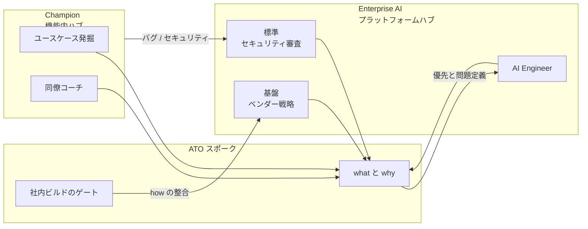

> 想定読者は、社内 AI の統治と普及を同時に進めたい発注側、経営層、情シス、事業部リードです。
> この記事は、GitLab が公開した社内 AI の連邦型体制を、役割境界、決定権、育成、指標、運用リズムに分解します。
> 公開のきっかけは 2026-09-02 の公式ブログです。役割と決定権の詳細は Handbook が厚いです。

*この記事の全体像。以下、順に解説します。*

## この記事で分かること

GitLab は社内 AI を、全面中央集権でも全面分散でもなく、2 つのハブを 1 つのスポークでつなぐ連邦型にしました。

- **Enterprise AI**：基盤ツール、ベンダー戦略、セキュリティ審査
- **AI Transformation Owner（ATO）**：機能別の「何をなぜやるか」
- **Champion**：現場の実験と伝播

コピーすべきなのは、3 役割の境界と、Reach、Depth、Applied value を単独で見ない評価の型です。
コピーしてはいけないのは、ワークショップ直後の 87%、95%、92% と、主要社内コーディングツールの日次インタラクション +22.3% をフルエンシーの因果として扱うことです。

ATO は公式に「権限ではなく影響」です。
作り方と審査は中央に残ります。
中央ボトルネックを消したわけではありません。

## 両極端を捨てた理由

GitLab が検討した対案は、fully centralized と fully decentralized です。
前者は承認遅延とガバナンス迂回を招く、後者は断片化とガードレール不一致を招く、とブログは定性で書いています。
定量の失敗件数は公開されていません。

Handbook は、捨てた理由を 4 つ足します。

- 既存ガバナンスの速度不足
- 機能間の能力格差
- 中央チームの文脈不足
- 個人実験の重複と P1 競合

結果の呼び方は federated です。
中身は「基盤は中央、実験と機能戦略は現場」です。
業界の federated（部門自治）と hybrid（中央基盤＋現場ユースケース）の分類では、後者に近いです。
GitLab ブログは同一記事で hybrid と federated の両方を使います。

CIO の Manu Narayan は、顧客向けの「Speed with Control」と社内の「Speed with Quality」を重ねます。
Chief People Officer の Rob Allen との共著ブログ末尾は、[AI Modernization Assessment](https://about.gitlab.com/assessments/ai-modernization-assessment/) への CTA です。
社内実践であると同時に、リードジェンでもあります。

連邦は妥協案ではありません。
迂回（Shadow）と断片化を同時に減らす設計意図です。
Software AG と TEAM LEWIS の 2024 年調査（米英独各 2,000、計 6,000）は、ナレッジワーカー約半数が非支給 AI を使うと示します。
理由の上位は独立性と未提供ツールであり、「公式が遅い」が主因とは書いていません。

宣言の連邦が、運用では中央 CoE や無統治分散に戻る失敗は、外部実務論にあります。
GitLab 自身も、捨てた 2 案の社内実害は公開していません。

## 3 役割の境界

Enterprise AI は Enterprise Technology 配下の platform hub です。
主要 AI ベンダーと自社製ガバナンス基盤の中央戦略を持ちます。
その他ツールは、このガードレールの上に載ります。
単一機能のユースケースは持ちません。
作り方（how）は持ちます。

ATO は機能に埋め込んだシニアです。
what と why の単一窓口です。
in-function のビルドをゲートします。
公式の位置づけは limited formal authority です。
Handbook の [ATO ページ](https://handbook.gitlab.com/handbook/eta/ai/strategy/hub-and-spoke/ato/) は、「trusted, not by being right」と書きます。
リーダーへの再設計強制、Champion の時間強制、Enterprise AI のキュー並び替えはできません。
最頻失敗は、leader buy-in を飛ばしてプロセス再設計に入ることです。
ATO が橋渡しできないと、「the model breaks」です。

Champion はサブチームあたり 1 人です。
工数は 5〜10% です。
ATO の直属ではありません。
200 人超の機能で ATO が全ユースケースを回せないための reach 拡張です。
根拠は [Operating Rhythm](https://handbook.gitlab.com/handbook/eta/ai/strategy/hub-and-spoke/operating-rhythm/)（2026-08-28）です。

人員の上限もあります。
AI Engineer は ATO 最大 2 人までです。
立ち上げ四半期は 1:1 に近いです。

[Prompts are Process](https://handbook.gitlab.com/handbook/eta/ai/strategy/prompts-are-process/) は、プロンプトをプロセスとして扱います。
所有なしの横展開は accidental strategy です。
姿勢は guided creation です。

ブログの「中央ボトルネック回避」は、what の分散までです。
速度を決める how と審査は中央のまま残ります。
ATO ゲートは第 2 の承認点です。
これは欠点というより、Shadow process を止める意図です。

spoke を機能単位にするかサブ機能単位にするかは、pilot で決める、と Handbook が書きます。
ブログ公開時点でも、internally proven とは言えません。

## ユースケースは機能から上がり、標準は中央から降りる

2 ハブ（Enterprise AI と Champion）を ATO がつなぎます。
バグとセキュリティは Champion から Hub へ直接返します。

決定権の要約です。
詳細は Handbook の表が正本です。

| 決定 | オーナー |
|---|---|
| 機能内ユースケースの優先 | ATO。大きい横断は Exec Sponsor |
| 作り方（技術アプローチとベストプラクティス） | Enterprise AI。ATO と共同 |
| プラットフォームとツール選定 | Enterprise AI |
| セキュリティ、データ、ガバナンス審査 | Enterprise AI（published SLAs と書く。数値は未確認） |
| 機能の成功指標 | 機能自身の業務指標。ATO が動かす。Hub が横断集約 |
| 独自ツールの標準スタック載せ替え | Enterprise AI |
| Champion と IC の社内ビルド | ATO が中央戦略への整合をゲート |
| Champion 選定 | ATO とサブチームマネージャ承認 |
| ATO 採用 | 5 段ループ。Director Enterprise AI と機能 HM の dual gate は、片方拒否で hard no |

## 育成は日常業務の作業単位に結ぶ

育成は Talent Development との共同です。
自己診断「AI Literacy Ladder」と、計画、コードレビュー、壊れたパイプライン修復、セキュリティ修正に紐づくエンジニア経路があります。
Ladder の段階表自体は非公開です。

経路は段階を踏みます。

1. 全社レッスン
2. 機能別
3. エンジニア上級ワークショップと実習ラボ

シニアと新人で支援を分け、自己診断で経路を出します。
Rob Allen の引用は、今のツール操作ではなく、委任と判断の耐久スキルです。

Guiding Principles は Crawl-Walk-Run です。
自律は信頼性で稼ぎます。
citizen development は「数十年約束され、規模では稀」と自注します。

カリキュラムを SDLC の実作業に結ぶ点は、汎用 AI 研修より転用価値が高いです。
判断力を目標に置いているのに、公開 KPI は直後満足度とクリック増です。
原則と測定がずれています。

## 公開数値はフルエンシーの証明に使わない

公開数値はすべて社内自己測定です。
n、対照群、ツール名は非公開です。
独立監査はありません。

| 数値 | 原文の意味 | 使える範囲 |
|---|---|---|
| 87% | 上級 WS 参加者が「すぐに適用できる学びがあった」 | Kirkpatrick Level 1。即時反応 |
| 87%超（別文） | 参加エンジニアが「今後 2 週間以内に使う見込み」 | 質問が 2 つか言い換えか不明 |
| 95% | 別の非技術 WS で 2 週間以内に適用する見込み | 同上。技術者と別サンプル |
| 92% | 当該 WS の AI ツール利用の自信が上がった | 自信は判断力ではない |
| 22.3% | AI Ladders 開始 1 か月後、主要社内 AI コーディングツールの daily interactions が jump | 相関。"saw"。ツール名非公開。日次アクティブ率ではない |

指標は 3 軸です。

- **Reach**：診断とパス完了人数
- **Depth**：パスを継続して進むか
- **Applied value**：WS フィードバックと、プログラム開始と相関する利用増

単独では全体像にならない、と自ら書きます。
採用すべきなのは、3 軸を束ねる型だけです。

Will Thalheimer は、学習者に職務適用や組織成果を尋ねても Kirkpatrick Level 3/4 ではなく Level 1（Reaction）である、と書きます（[LTEM](https://www.worklearning.com/2018/02/14/the-learning-transfer-evaluation-model-ltem/)、2018-02-14）。
GitLab Guiding Principle 1 は、「metric shouldn't be time saved, it's impact amplified (business value metrics)」です。
公開 Applied value はその原則を満たしていません。

自己申告スピードをそのまま信じない根拠もあります。
METR RCT（16 人、246 課題、early-2025 Cursor と Claude 3.5/3.7）では、事前に 24% 速いと予測し、事後も 20% 速くなったと自己評価しました。
実測は 19% 遅いです（[metr.org 2025-07-10](https://metr.org/blog/2025-07-10-early-2025-ai-experienced-os-dev-study) / [arXiv:2507.09089](https://arxiv.org/abs/2507.09089)）。
METR は 2026-02 追試で結果が古くなったと注記します。
ここでの用法は「現在の AI が遅い」ではなく、「自己申告スピードは信頼できない」です。

GitLab 自身の 2026 AI Accountability Report（Harris Poll、n=1,528、6 か国、[2026-06-23 プレス](https://about.gitlab.com/press/releases/2026-06-23-gitlab-research-reveals-organizations-are-generating-ai-code-faster-than-they-can-control-it/)）は、別の緊張を示します。

- 80% がツール導入が政策より速い
- 92% が AI 生成コードのガバナンス課題
- 85% がボトルネックは review/validate

フルエンシー研修がこの Paradox を解いた証拠ではありません。
需要創出でもあります。

## 運用リズムは会議税が高い

Daily は `#ent-ai-ato` の async です。
mandatory standup はありません。

Weekly は ATO Council 60 分 mandatory です。
AI Engineer と ATO は最低週 1 です。

隔週は次です。

- exec sponsor
- Champion 同期 30 分
- function AI office hours 45 分を ATO 必須開催（2026-08-28 追加。Champion 以外の入口）

Monthly は Champion demo です。
Quarterly は QBR 30 分、2〜3 スライドです。

ルーティングは分かれます。
ユースケースは Champion から ATO へ送り、Hub 直送は禁止です。
バグとセキュリティは Champion から Hub へ送ります。

Handbook の worked example では、Champion が週約 6 時間のメール再フォーマットを上げ、1 週間 2 回の反復で Claude skill を role-based plugin に載せ、翌朝全員へ配布します。

会議税は高いです。
GitLab Act 2（2026-05-11）は同時に unnecessary bureaucracy へのゼロトレランスを掲げます。
連邦の儀式とフラット化は緊張関係にあります。

## 中央、完全分散、GitLab 連邦の違い

| 基準 | 中央 CAIO / CoE | 完全分散 / Shadow | GitLab 連邦 |
|---|---|---|---|
| 統制 | CAIO / ステアリングが承認と在庫 | 後追い、または禁止して残る | Enterprise AI が基盤と審査 |
| 戦略 | 中央ポートフォリオ | 部門 KPI | ATO が機能の what/why |
| 育成 | 中央研修 | BYOAI | Ladder と Champion と業務単位パス |
| 指標 | ROI、本番化、承認 SLA | 非公式利用率 | Reach / Depth / Applied（公開は自己申告と利用） |
| 実装の複雑さ | 低い（一本化） | 低い（放置） | 高い（3 層と 1:2 エンジニア） |
| 運用負荷 | 中央キューが詰まる | 監査不能 | ATO Council、office hours、QBR |
| 監査可能性 | 高い（在庫が集中） | 低い | 中央審査は残る。現場プロンプトは ATO 所有が前提 |
| 向く条件 | 在庫ゼロ、高規制、ユースケースが少ない | 実験だけ、データが軽く、失敗が可逆 | 機能差が大きく、Handbook 文化があり、シニア ATO を置ける |
| 不向き | 現場文脈が中央に届かない | 規制、顧客データ、再現性が要る | 中小、権限のない推進担当、兼務だけ |

日本語の公式テンプレは、編成よりゴール循環です。
[AI 事業者ガイドライン 第1.2版](https://www.meti.go.jp/shingikai/mono_info_service/ai_shakai_jisso/pdf/20260331_1.pdf)（2026-03-31）はアジャイルガバナンスです。
[AISI CAIO ガイドブック v1.00](https://aisi.go.jp/assets/pdf/caio-guidebook.pdf)（2026-03-17）は独立 C-suite と、権利と安全に影響する本番の否認権を推奨します。
事業固有の最終判断は事業責任者が保持する、と書きます。

GitLab は機能の what/why を ATO に渡し、how と審査を Enterprise AI に残します。
[NTT 2024-06-07](https://group.ntt/jp/newsrelease/2024/06/07/240607a.html) はリスク連邦であり、イネーブルメント連邦ではありません。
日立は 2023-12-07 プレスで 3 セクターに Chief AI Transformation Officer を置きました。
役職名は近いです。
Champion 工数とフルエンシー指標の公開は、GitLab 側が厚いです。

## 転用で残すものと捨てるもの

3 役割と決定権は、Handbook 一次で再構成できます。
評価は 3 軸を束ねる型だけ採用します。
公開数値はフルエンシーや事業価値の証明に使いません。
how と審査の中央残留と、ATO の権限の弱さを前提に転用します。

支持できる点は次です。

- 捨てた 2 案の失敗モード（迂回と断片化）はブログ一次です
- 決定権表、consume-before-build、Prompts are Process は Handbook 一次です。Shadow process への対策として一貫します
- 育成を SDLC 作業単位に結ぶ設計はブログ一次です。原則 2（retrofit しない）と整合します
- office hours を Champion 以外の入口にした更新（2026-08-28）は、指名 Champion だけに閉じない自己修正です

弱める点は次です。

- how と審査は中央です。ATO ゲートもあります。中央ボトルネック回避は部分的です
- 連邦の最大リスクを「各機能が同じ能力を静かに作り直すこと」と自社が書きます。consume-before-build は規範であり、効果測定ではありません
- ATO は権限なしです。モデルは個人の信頼構築に依存します
- Champion 5〜10% は、McKenna（2026-02）が初期に勧める 10〜15% より低く、維持帯に近いです。保護時間が無いと 3 か月で消える、という失敗モードの対象にはなります（[二次情報](https://www.mckennaagileconsultants.com/blog/ai-champion-model/)）
- 87、95、92 は直後反応です。22.3% は利用回数の相関です
- Handbook 公開からブログまで数か月です。pilot 未完の一般化です
- jobs ページは 2,500+ team members です。Operating Rhythm は 200+ 人機能を前提です。中小への 3 層専任は載りません

確信度は、組織設計の型で高く、成果主張で低いです。
「両極端を避けてフルエンシーが測れた成功事例」としては弱いです。
「役割境界と所有の公開 RACI」としては強いです。

日本企業への転用は、all-remote、Handbook-first、async が前提です。
稟議と部門壁の公開実験は見つかっていません。
Applied value の業務指標も弱いです。
原則は business value ですが、公開は WS とクリックです。

IBM IBV の「中央または hub-and-spoke の CAIO は分散より ROI が 36% 高い」（2025-07）は別調査であり、GitLab モデルの効果ではありません。
ベンダー調査であり、因果ではありません。

転用の可否は止めません。
数値を KPI 目標にすることは止めます。
ATO を「推進担当」として権限なしで置くことは、Handbook 自身の最頻失敗に直結します。

## コピーする設計と逆転条件

1. **役割はコピーする。** Enterprise AI（how とガードレール）と機能オーナー（what と why）と現場 Champion を分けます。戦略まで CAIO 一人に積まないでください。
2. **ATO 相当にはゲートと exec sponsor を付ける。** influence-only のまま日本の決裁文化に落とさないでください。Handbook は権限なしを前提にしますが、転用時はプロセス変更の正式権限を最小限足します。
3. **Champion は 5〜10% を評価とシフトに書く。** 本業の上乗せは burnout 文献と一致します。office hours を Champion 以外の入口にします。
4. **研修は作業単位に結ぶ。** 計画、レビュー、障害、セキュリティです。汎用プロンプト講座で終わらせないでください。
5. **指標は 3 軸を束ねる。** Reach と Depth は完了と継続です。Applied は業務指標（リードタイム、欠陥、手戻り、機能 KPI）です。WS 直後の「使う見込み」と daily interactions は補助信号です。目標値にしないでください。
6. **プロンプトをプロセスとして所有する。** 個人メモの横展開を禁止し、repo、機能、全社のどれかのオーナーを先に決めます。
7. **規模が足りなければ連邦を宣言しない。** ユースケースが少なく規制が厚いなら、先に中央ハブと在庫です。現場実験はガードレールの上だけで許します。

逆転条件は次です。

- ATO が採用できず、兼務の名ばかり推進になる
- Champion の保護時間が取れない
- 中央審査の SLA が無く、現場が迂回する
- 成功指標がトークン、クリック、研修出席だけになる
- 機能数が少なく、ATO Council が儀式化する

直近の次のアクションです。

1. 自組織で「how の単一ハブ」と「機能ごとの what オーナー」が今いるかを 1 枚の RACI にする
2. 公開 AI ツールの在庫と、個人契約（Shadow）を分ける
3. エンジニア向け経路を、自社の計画、レビュー、CI 失敗、脆弱性修正に言い換える
4. KPI 案から「利用率 +N%」「研修満足度 N%」を外し、機能の既存業務指標に接続する
5. 横展開したいプロンプトや skill のオーナーが不在なら、展開を止める

未解決の問いは残ります。

- Literacy Ladder の段階定義と設問
- 22.3% の分母、ツール名、同時期の他施策
- Enterprise AI の SLA 数値
- 社内 ATO と Champion の充足率、実労働時間、離脱
- 機能単位とサブ機能単位の pilot 結果

## まとめ

GitLab の社内 AI 体制は、基盤と審査を中央に残し、機能戦略と普及を現場に渡す連邦型です。
コピーすべきなのは 3 役割の境界と、Reach、Depth、Applied を束ねる評価の型です。
公開されている 87%、95%、92%、+22.3% はフルエンシーや事業価値の証明ではありません。
ATO は権限ではなく影響であり、how と審査の中央残留を前提に転用してください。
規模が足りない組織は、連邦を宣言する前に中央ハブと在庫を先に置いてください。

この記事が少しでも参考になった、あるいは改善点などがあれば、ぜひリアクションやコメント、SNSでのシェアをいただけると励みになります！

## 参考リンク

一次（GitLab）

- [GitLab’s internal playbook to foster AI-fluent technical teams](https://about.gitlab.com/blog/how-gitlab-fosters-ai-fluent-teams/)（EN、datePublished 2026-09-02）
- [GitLab が技術チームの AI 活用を促進する社内プレイブック](https://about.gitlab.com/ja-jp/blog/how-gitlab-fosters-ai-fluent-teams/)（JA、dateModified 2026-09-03）
- [Hub & Spoke & Hub](https://handbook.gitlab.com/handbook/eta/ai/strategy/hub-and-spoke/)
- [ATO](https://handbook.gitlab.com/handbook/eta/ai/strategy/hub-and-spoke/ato/)
- [Operating Rhythm](https://handbook.gitlab.com/handbook/eta/ai/strategy/hub-and-spoke/operating-rhythm/)
- [Guiding Principles](https://handbook.gitlab.com/handbook/eta/ai/strategy/guiding-principles/)
- [Prompts are Process](https://handbook.gitlab.com/handbook/eta/ai/strategy/prompts-are-process/)
- [CIO 就任 IR](https://ir.gitlab.com/news/news-details/2025/GitLab-Appoints-New-Chief-Product-and-Marketing-Officer-and-Chief-Information-Officer/default.aspx)（2025-09-02）
- [2026 AI Accountability Report プレス](https://about.gitlab.com/press/releases/2026-06-23-gitlab-research-reveals-organizations-are-generating-ai-code-faster-than-they-can-control-it/)
- [GitLab survey reveals the AI paradox](https://about.gitlab.com/press/releases/2025-11-10-gitlab-survey-reveals-the-ai-paradox)
- [AI Modernization Assessment](https://about.gitlab.com/assessments/ai-modernization-assessment/)

一次（比較と反証）

- [AI 事業者ガイドライン 第1.2版](https://www.meti.go.jp/shingikai/mono_info_service/ai_shakai_jisso/pdf/20260331_1.pdf)
- [AISI CAIO ガイドブック v1.00](https://aisi.go.jp/assets/pdf/caio-guidebook.pdf)
- [NTT グループの生成 AI ガバナンス](https://group.ntt/jp/newsrelease/2024/06/07/240607a.html)
- [METR early-2025 AI experienced OS developer study](https://metr.org/blog/2025-07-10-early-2025-ai-experienced-os-dev-study)
- [arXiv:2507.09089](https://arxiv.org/abs/2507.09089)
- [The Learning-Transfer Evaluation Model](https://www.worklearning.com/2018/02/14/the-learning-transfer-evaluation-model-ltem/)
- [McKenna: AI Champion Model](https://www.mckennaagileconsultants.com/blog/ai-champion-model/)
