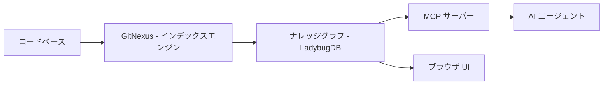
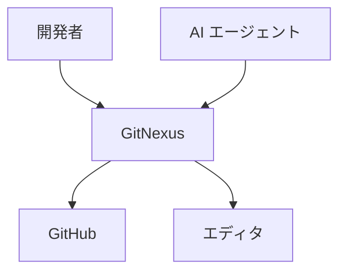
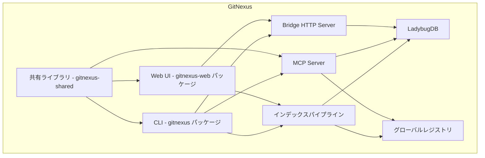
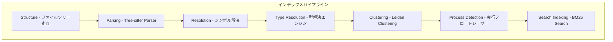
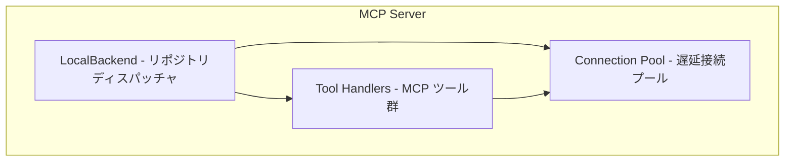
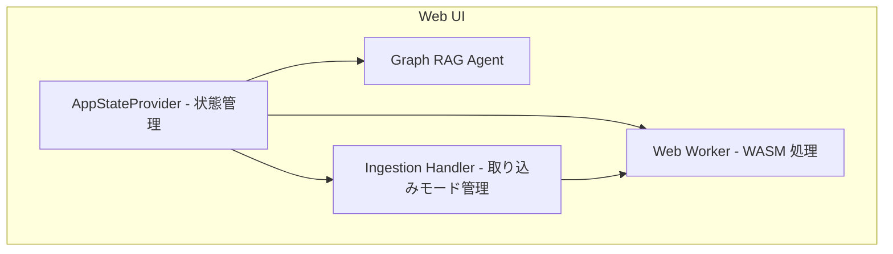
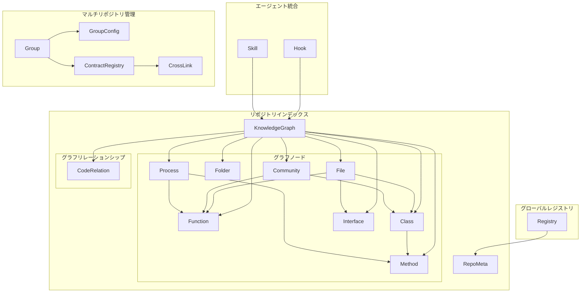

## 概要

GitNexus は、ソースコードからナレッジグラフを構築し、AI エージェントにコードベースの構造的な理解を提供するコードインテリジェンスツールです。ライセンスは PolyForm Noncommercial 1.0.0 で、OSS 版は非商用利用に限られます。

AI コーディングアシスタントは、コードを編集する際に下流の影響範囲を把握できません。GitNexus は、依存関係・コールチェーン・実行フロー・機能クラスターをインデックス時に事前計算します。エージェントは単一のツール呼び出しで、完全な構造コンテキストを取得できます。

:::message
本記事は OSS 版（非商用）の機能を中心に解説しています。Enterprise 版のみの機能（マルチリポジトリグループ操作等）は該当箇所に明記しています。
:::


### この記事の対象読者

- AI コーディングエージェント（Claude Code, Cursor 等）を日常的に利用している開発者
- コードベースの構造理解を自動化したいチームリーダー・アーキテクト
- MCP サーバーの活用事例を探しているエンジニア

### 位置づけ



| 要素名                          | 説明                                                             |
| ------------------------------- | ---------------------------------------------------------------- |
| コードベース                    | 解析対象のソースコードリポジトリ                                 |
| GitNexus - インデックスエンジン | Tree-sitter AST パースと多段解析パイプラインでグラフを構築       |
| ナレッジグラフ - LadybugDB      | 依存関係・コールチェーン・実行フローを格納するグラフデータベース |
| MCP サーバー                    | MCP 経由でエージェントにツールを提供                             |
| AI エージェント                 | Cursor, Claude Code, Windsurf 等の MCP 対応ツール                |
| ブラウザ UI                     | WASM ベースのゼロサーバー Web インターフェース                   |

### 関連技術との関係

| 技術                | 役割                       | GitNexus での使用箇所                             |
| ------------------- | -------------------------- | ------------------------------------------------- |
| Tree-sitter         | AST パーサー               | 関数・クラス・メソッド・インターフェースの抽出    |
| LadybugDB           | グラフデータベース         | ナレッジグラフの永続化（旧称: KuzuDB）            |
| MCP                 | エージェント統合プロトコル | 主要ツール群を stdio 経由で AI エージェントに公開 |
| Leiden アルゴリズム | コミュニティ検出           | シンボルを機能クラスターに自動グルーピング        |
| Tarjan SCC          | 強連結成分分解             | 型解決における循環依存の処理                      |
| BM25 + Semantic     | ハイブリッド検索           | RRF で テキスト検索とセマンティック検索を統合     |
| ONNX / WebGPU       | エンベディング生成         | snowflake-arctic-embed-xs によるコードベクトル化  |

## 特徴

GitNexus の主な特徴は以下のとおりです。

- **ナレッジグラフによる構造化**: コードベースを関数・クラス・モジュール・実行フローのグラフとして表現し、LadybugDB に永続化
- **MCP ネイティブ統合**: query, context, impact, detect_changes, rename, cypher, list_repos 等の MCP ツールを提供し、Cursor / Claude Code / Windsurf から直接利用可能
- **ブラスト半径分析**: 関数変更の影響範囲を confidence スコア付きで上流・下流方向にトレース
- **デュアルデプロイ**: CLI（Node.js + 永続化）とブラウザ UI（WASM + インメモリ）の両方で動作
- **15 言語以上のサポート**: TypeScript, JavaScript, Python, Java, Go, Rust, C, C++, C#, PHP, Swift, Kotlin, Ruby, Dart, COBOL 等を Tree-sitter でパース
- **ハイブリッド検索**: BM25 + セマンティック検索を RRF で統合し、プロセスグルーピング付きで結果を返却
- **マルチリポジトリ対応（Enterprise）**: リポジトリグループ機能でクロスサービスのコールチェーンを横断分析。OSS 版は単一リポジトリ操作が基本
- **Git diff 対応**: ブランチ間の差分から影響を受けるプロセスと関数を特定

### 類似ツールとの比較

| 比較項目           | GitNexus                            | Sourcegraph                 | GitHub Copilot           | Codeium                  | aider                    |
| ------------------ | ----------------------------------- | --------------------------- | ------------------------ | ------------------------ | ------------------------ |
| 実行方式           | ローカル CLI + ブラウザ WASM        | クラウド / オンプレサーバー | クラウド API             | クラウド API             | ローカル CLI             |
| グラフ構築         | 事前計算（インデックス時）          | リアルタイムインデックス    | なし                     | なし                     | なし                     |
| MCP 対応           | ネイティブ対応（複数ツール）        | 非対応                      | 非対応                   | 非対応                   | 非対応                   |
| 言語サポート       | 15 言語以上（Tree-sitter）          | 多言語（独自パーサー）      | 多言語（LLM 依存）       | 多言語（LLM 依存）       | 多言語（LLM 依存）       |
| ブラスト半径分析   | 専用ツール（confidence スコア付き） | 参照検索で代替              | なし                     | なし                     | なし                     |
| アーキテクチャ理解 | グラフ構造として明示化              | コード検索ベース            | LLM の暗黙的パターン認識 | LLM の暗黙的パターン認識 | LLM の暗黙的パターン認識 |
| オフライン利用     | 完全対応                            | 不可（サーバー必須）        | 不可                     | 不可                     | 可能                     |

GitNexus はインデックス時に関係性を事前計算します。Sourcegraph はリアルタイム検索に強みを持ちますが、コールチェーン・実行フローの事前計算グラフは提供していません。GitHub Copilot / Codeium はコンテキストウィンドウベースのパターンマッチングであり、アプローチが異なります。aider は git 操作に特化したコーディングエージェントで、GitNexus とは補完関係にあります。

### ユースケース別推奨

| ユースケース                           | 推奨ツール               | 理由                                             |
| -------------------------------------- | ------------------------ | ------------------------------------------------ |
| AI エージェントの破壊的変更防止        | GitNexus                 | ブラスト半径分析と事前計算グラフで影響範囲を明示 |
| 大規模リポジトリのコード横断検索       | Sourcegraph              | クロスリポジトリ検索と CI 統合に強み             |
| インライン補完・コード生成             | GitHub Copilot / Codeium | IDE 統合の成熟度と補完精度                       |
| LLM 駆動のコード編集・リファクタリング | aider                    | GitNexus との併用でより安全な編集が可能          |
| ゼロインストールのコード探索           | GitNexus Web UI          | ブラウザのみで動作、サーバー不要                 |

## 構造

### システムコンテキスト図



| 要素名          | 説明                                                                 |
| --------------- | -------------------------------------------------------------------- |
| 開発者          | GitNexus を操作してコードベースを分析するユーザー                    |
| AI エージェント | MCP ツール経由でコードインテリジェンスを利用する AI                  |
| GitNexus        | コードベースをナレッジグラフに変換するコードインテリジェンスシステム |
| GitHub          | リポジトリのソース。クローンおよび Git 差分取得に利用                |
| エディタ        | MCP 統合を通じて GitNexus を利用するコードエディタ                   |

### コンテナ図



| 要素名                           | 説明                                                                                      |
| -------------------------------- | ----------------------------------------------------------------------------------------- |
| CLI - gitnexus パッケージ        | コマンドラインインターフェース。インデックス作成と MCP サーバー起動を担当                 |
| MCP Server                       | stdio または HTTP で AI エージェントにツールを公開する MCP サーバー                       |
| Bridge HTTP Server               | CLI でインデックス済みのリポジトリをブラウザ UI に公開する Express HTTP サーバー          |
| Web UI - gitnexus-web パッケージ | WASM ランタイムで動作するブラウザベースのグラフ可視化 UI                                  |
| インデックスパイプライン         | Tree-sitter による AST 解析からグラフ構築までの多段パイプライン                           |
| LadybugDB                        | 組み込みグラフデータベース。CLI はネイティブアダプタ、Web UI は WASM バインディングを使用 |
| グローバルレジストリ             | ~/.gitnexus/registry.json でインデックス済みリポジトリをグローバル管理                    |
| 共有ライブラリ - gitnexus-shared | NodeLabel・RelationshipType 等の型定義を提供する共有パッケージ                            |

### コンポーネント図

#### インデックスパイプライン



| 要素名                                   | 説明                                                                                  |
| ---------------------------------------- | ------------------------------------------------------------------------------------- |
| Structure - ファイルツリー走査           | .gitignore を考慮しながらファイルツリーを走査し、フォルダとファイルの関係をマッピング |
| Parsing - Tree-sitter Parser             | Tree-sitter AST で関数・クラス・メソッド・インターフェースを並列抽出                  |
| Resolution - シンボル解決                | インポート・関数呼び出し・継承・コンストラクタをクロスファイルで解決                  |
| Type Resolution - 型解決エンジン         | Tarjan の SCC アルゴリズムを用いた不動点ループ（最大 10 回）で型を解決                |
| Clustering - Leiden Clustering           | Leiden アルゴリズムで関連シンボルを機能コミュニティにグルーピング                     |
| Process Detection - 実行フロートレーサー | エントリーポイントからコールチェーンをたどり実行フローをトレース                      |
| Search Indexing - BM25 Search            | BM25 全文検索とセマンティック埋め込みによるハイブリッド検索インデックスを構築         |

#### パイプライン各フェーズのデータフロー

| フェーズ          | 入力                               | 処理                                                                            | 出力                                                          |
| ----------------- | ---------------------------------- | ------------------------------------------------------------------------------- | ------------------------------------------------------------- |
| Structure         | リポジトリルートパス               | .gitignore / .gitnexusignore を読み込みファイルツリーを再帰走査                 | Folder / File ノード + CONTAINS エッジ                        |
| Parsing           | ファイルパス一覧                   | Tree-sitter で AST を並列生成、シンボルを抽出                                   | Function / Class / Interface / Method ノード + DEFINES エッジ |
| Resolution        | パース済みシンボル群               | インポート文・関数呼び出し・継承をクロスファイルで名前解決                      | IMPORTS / CALLS / EXTENDS / IMPLEMENTS リレーションシップ     |
| Type Resolution   | 解決済みグラフ                     | Tarjan SCC で循環依存を検出し、不動点ループ（最大 10 回）で型を収束             | 型注釈付きリレーションシップ（confidence スコア付与）         |
| Clustering        | グラフ全体                         | Leiden アルゴリズムで modularity を最大化しコミュニティを検出                   | Community ノード + MEMBER_OF リレーションシップ               |
| Process Detection | コミュニティ付きグラフ             | エントリーポイント（main / handler / route）からコールチェーンを BFS でトレース | Process ノード + STEP_IN_PROCESS リレーションシップ           |
| Search Indexing   | 全シンボルの content / description | BM25 転置インデックス + ONNX エンベディング生成                                 | 検索インデックス（BM25 + ベクトル）                           |

Type Resolution の不動点ループは、Tarjan の強連結成分（SCC）アルゴリズムで循環依存グラフを分解し、各 SCC 内でシンボルの型情報を繰り返し伝播させます。収束条件を満たすまで最大 10 回ループし、型が確定しないシンボルには unknown を割り当てます。

#### MCP Server



| 要素名                                  | 説明                                                                                         |
| --------------------------------------- | -------------------------------------------------------------------------------------------- |
| LocalBackend - リポジトリディスパッチャ | グローバルレジストリからリポジトリを管理し、ツール呼び出しを各リポジトリへディスパッチ       |
| Connection Pool - 遅延接続プール        | リポジトリごとに LadybugDB 接続を遅延生成し、5 分アイドルで evict する接続管理コンポーネント |
| Tool Handlers - MCP ツール群            | query・context・impact・detect_changes・rename・cypher の各 MCP ツール実装                   |

#### Web UI



| 要素名                                 | 説明                                                                                             |
| -------------------------------------- | ------------------------------------------------------------------------------------------------ |
| AppStateProvider - 状態管理            | React Context でビューモード・グラフデータ・ノード選択を一元管理                                 |
| Web Worker - WASM 処理                 | Comlink RPC で Tree-sitter WASM と LadybugDB WASM を実行し、CPU 集約処理をメインスレッドから分離 |
| Graph RAG Agent                        | LangChain ReAct パターンで Cypher クエリとセマンティック検索を組み合わせる AI エージェント       |
| Ingestion Handler - 取り込みモード管理 | ZIP アップロード・GitHub クローン・Bridge Server 接続の 3 モードを管理                           |

## データ

### 概念モデル



#### グローバルレジストリ

| 要素名   | 説明                                                                                    |
| -------- | --------------------------------------------------------------------------------------- |
| Registry | 全インデックス済みリポジトリを管理するグローバルレジストリ（~/.gitnexus/registry.json） |

#### リポジトリインデックス

| 要素名         | 説明                                                             |
| -------------- | ---------------------------------------------------------------- |
| RepoMeta       | リポジトリごとのインデックスメタデータ（.gitnexus/meta.json）    |
| KnowledgeGraph | リポジトリのナレッジグラフ全体。ノードとリレーションシップを保持 |

#### グラフノード

| 要素名    | 説明                                          |
| --------- | --------------------------------------------- |
| File      | ソースコードファイル                          |
| Folder    | ディレクトリ                                  |
| Function  | 関数およびアロー関数                          |
| Class     | クラス定義                                    |
| Interface | インターフェース・型定義                      |
| Method    | クラスメソッド                                |
| Community | Leiden アルゴリズムで自動検出された機能エリア |
| Process   | エントリーポイントからトレースした実行フロー  |

実装上はこれら 8 種に加え、Route, Tool, Section, CodeElement, Struct, Enum, Trait, Impl, TypeAlias 等の追加ノード型が定義されています。

#### グラフリレーションシップ

| 要素名       | 説明                                                                    |
| ------------ | ----------------------------------------------------------------------- |
| CodeRelation | 全リレーションシップを格納する単一テーブル。type プロパティで種別を区別 |

#### 主要リレーションシップの接続許容型

| リレーション    | 始点ノード型            | 終点ノード型               |
| --------------- | ----------------------- | -------------------------- |
| CONTAINS        | Folder                  | Folder, File               |
| DEFINES         | File                    | Function, Class, Interface |
| HAS_METHOD      | Class                   | Method                     |
| CALLS           | Function, Method        | Function, Method           |
| IMPORTS         | File                    | File                       |
| EXTENDS         | Class                   | Class, Interface           |
| IMPLEMENTS      | Class                   | Interface                  |
| MEMBER_OF       | Function, Class, Method | Community                  |
| STEP_IN_PROCESS | Function, Method        | Process                    |

実装上はこれら 9 種に加え、HAS_PROPERTY, ACCESSES, OVERRIDES, HANDLES_ROUTE, FETCHES, HANDLES_TOOL, ENTRY_POINT_OF 等の追加リレーション型が定義されています。

GraphRelationship の主要プロパティは以下のとおりです。

| プロパティ | 型     | 説明                                                                |
| ---------- | ------ | ------------------------------------------------------------------- |
| confidence | number | リレーションの信頼度。直接呼び出し = 1.0、推移的依存 = 0.x          |
| reason     | string | リレーション検出の根拠（例: "import statement", "call expression"） |
| step       | number | STEP_IN_PROCESS 専用。プロセス内の実行順序（1-indexed）             |

#### エージェント統合（エディタ設定、グラフ外）

| 要素名 | 説明                                                                    |
| ------ | ----------------------------------------------------------------------- |
| Skill  | エージェントの操作ガイドを定義する SKILL.md ファイル                    |
| Hook   | PreToolUse / PostToolUse タイミングでグラフ操作をトリガーするフック定義 |

Skill と Hook はナレッジグラフの永続データではありません。エディタ統合の外部設定ファイルです。

#### マルチリポジトリ管理（Enterprise 機能）

| 要素名           | 説明                                                         |
| ---------------- | ------------------------------------------------------------ |
| Group            | 複数リポジトリをまとめるサービスグループ                     |
| GroupConfig      | グループの設定（リポジトリ一覧・検出ルール・マッチング設定） |
| ContractRegistry | グループ内のサービス間契約を管理するレジストリ               |
| CrossLink        | リポジトリをまたぐシンボル間の依存リンク                     |

これらのエンティティは Enterprise 版に含まれる機能です。OSS 版の永続スキーマには含まれていない可能性があります。

### 情報モデル

```mermaid
classDiagram
    class Registry {
        entries : map
    }

    class RegistryEntry {
        name : string
        path : string
        storagePath : string
        indexedAt : string
        lastCommit : string
        stats : RepoStats
    }

    class RepoMeta {
        repoPath : string
        lastCommit : string
        indexedAt : string
        stats : RepoStats
    }

    class RepoStats {
        files : number
        nodes : number
        edges : number
        communities : number
        processes : number
        embeddings : number
    }

    class GraphNode {
        id : string
        label : NodeLabel
        properties : NodeProperties
    }

    class NodeLabel {
        <<enumeration>>
        File
        Folder
        Function
        Class
        Interface
        Method
        Community
        Process
    }

    class NodeProperties {
        name : string
        filePath : string
        startLine : number
        endLine : number
        language : string
        isExported : boolean
        description : string
        content : string
    }

    class File {
        id : string
        name : string
        filePath : string
        content : string
    }

    class Folder {
        id : string
        name : string
        filePath : string
    }

    class Function {
        id : string
        name : string
        filePath : string
        startLine : number
        endLine : number
        isExported : boolean
        content : string
        description : string
    }

    class Class {
        id : string
        name : string
        filePath : string
        startLine : number
        endLine : number
        isExported : boolean
        content : string
        description : string
    }

    class Interface {
        id : string
        name : string
        filePath : string
        startLine : number
        endLine : number
        isExported : boolean
        content : string
        description : string
    }

    class Method {
        id : string
        name : string
        filePath : string
        startLine : number
        endLine : number
        isExported : boolean
        content : string
        description : string
        parameterCount : number
        returnType : string
    }

    class Community {
        id : string
        label : string
        heuristicLabel : string
        keywords : list
        description : string
        enrichedBy : string
        cohesion : number
        symbolCount : number
    }

    class Process {
        id : string
        label : string
        heuristicLabel : string
        processType : string
        stepCount : number
        communities : list
        entryPointId : string
        terminalId : string
    }

    class GraphRelationship {
        id : string
        sourceId : string
        targetId : string
        type : RelationshipType
        confidence : number
        reason : string
        step : number
    }

    class RelationshipType {
        <<enumeration>>
        CONTAINS
        DEFINES
        CALLS
        IMPORTS
        EXTENDS
        IMPLEMENTS
        HAS_METHOD
        MEMBER_OF
        STEP_IN_PROCESS
    }

    class Skill {
        name : string
        description : string
        filePath : string
    }

    class Hook {
        event : string
        matcher : string
        command : string
        timeout : number
        statusMessage : string
    }

    class GroupConfig {
        version : number
        name : string
        description : string
        repos : map
        links : list
        packages : map
    }

    class ContractRegistry {
        version : number
        generatedAt : string
        repoSnapshots : map
        missingRepos : list
        contracts : list
        crossLinks : list
    }

    class CrossLink {
        from : CrossLinkEndpoint
        to : CrossLinkEndpoint
        type : string
        contractId : string
        matchType : string
        confidence : number
    }

    class CrossLinkEndpoint {
        repo : string
        service : string
        symbolUid : string
    }

    Registry "1" --> "many" RegistryEntry : entries
    RegistryEntry "1" --> "0..1" RepoStats : stats
    RepoMeta "1" --> "0..1" RepoStats : stats
    GraphNode "1" --> "1" NodeLabel : label
    GraphNode "1" --> "1" NodeProperties : properties
    GraphRelationship "1" --> "1" RelationshipType : type
    CrossLink "1" --> "1" CrossLinkEndpoint : from
    CrossLink "1" --> "1" CrossLinkEndpoint : to
    ContractRegistry "1" --> "many" CrossLink : crossLinks
    GroupConfig "1" --> "many" ContractRegistry : manages
```



## 構築方法

### 前提条件

| 項目                   | 要件                         |
| ---------------------- | ---------------------------- |
| Node.js                | 20 以上                      |
| パッケージマネージャー | npm                          |
| 対象リポジトリ         | Git で管理されたコードベース |

### インストール方法

#### グローバルインストール

```bash
npm install -g gitnexus
```

インストール後、`gitnexus` コマンドが利用できます。

#### npx による実行（インストール不要）

```bash
npx gitnexus analyze
```

最新版をインストールせずに実行します。

#### Web UI（ブラウザのみ、インストール不要）

- URL: https://gitnexus.vercel.app
- ZIP ファイルをドラッグ＆ドロップするか、GitHub リポジトリ URL を入力します
- ブラウザ内の WASM で完結するため、ローカルへのインストールは不要です

### バージョン確認

```bash
gitnexus --version
```

### 初期セットアップ（エディタ統合）

```bash
gitnexus setup
```

- 実行は一回のみ必要です
- インストール済みのエディタを自動検出し、MCP 設定を書き込みます
- Claude Code では MCP サーバー・スキル・フック（PreToolUse / PostToolUse）が設定されます

### デプロイモードの比較

| 項目       | CLI モード                  | Web モード         |
| ---------- | --------------------------- | ------------------ |
| ランタイム | Node.js 20 以上             | ブラウザ           |
| ストレージ | 永続（.gitnexus/）          | セッション内メモリ |
| 用途       | AI エージェントとの日常開発 | クイック探索・デモ |

## 利用方法

### 主要コマンドの必須パラメータ

| コマンド                | パラメータ | 必須 | 説明                                                 |
| ----------------------- | ---------- | ---- | ---------------------------------------------------- |
| `gitnexus analyze`      | path       | 任意 | 対象リポジトリのパス（省略時はカレントディレクトリ） |
| `gitnexus wiki`         | path       | 任意 | ドキュメント生成対象のリポジトリパス                 |
| `gitnexus group create` | name       | 必須 | グループ名                                           |
| `gitnexus group sync`   | name       | 必須 | グループ名                                           |
| `gitnexus group query`  | name, q    | 必須 | グループ名と検索クエリ                               |

### リポジトリのインデックス操作

#### インデックス作成

```bash
gitnexus analyze [path]
```

- .gitignore と .gitnexusignore を尊重してファイルツリーを走査します
- Tree-sitter AST で 15 以上の言語をパースします
- AGENTS.md と CLAUDE.md をリポジトリルートに生成します
- インデックスデータは .gitnexus/ に保存されます
- グローバルレジストリ ~/.gitnexus/registry.json に登録されます

オプション:

| オプション        | 説明                                                         |
| ----------------- | ------------------------------------------------------------ |
| --force           | 強制的に再インデックスを実行                                 |
| --skills          | コミュニティ固有スキルファイルを生成                         |
| --embeddings      | セマンティック検索用エンベディングを有効化（処理が遅くなる） |
| --skip-embeddings | エンベディング生成をスキップして高速化                       |

#### インデックス一覧表示

```bash
gitnexus list
```

#### インデックス状態確認

```bash
gitnexus status
```

#### インデックス削除

```bash
gitnexus clean
```

### MCP サーバー操作

#### MCP サーバー起動（stdio）

```bash
gitnexus mcp
```

AI エージェントが stdio 経由でグラフインテリジェンスにアクセスします。

#### HTTP サーバー起動（Web UI 用）

```bash
gitnexus serve
gitnexus serve --port 4747
```

### エディタ別の MCP 設定

#### Claude Code

```bash
claude mcp add gitnexus -- npx -y gitnexus@latest mcp

# Windows の場合
claude mcp add gitnexus -- cmd /c npx -y gitnexus@latest mcp
```

#### Cursor

設定ファイル: ~/.cursor/mcp.json

```json
{
  "mcpServers": {
    "gitnexus": {
      "command": "npx",
      "args": ["-y", "gitnexus@latest", "mcp"]
    }
  }
}
```

#### Codex

```bash
codex mcp add gitnexus -- npx -y gitnexus@latest mcp
```

TOML 形式（~/.codex/config.toml）での設定も可能です:

```toml
[mcp_servers.gitnexus]
command = "npx"
args = ["-y", "gitnexus@latest", "mcp"]
```

#### OpenCode

設定ファイル: ~/.config/opencode/config.json

```json
{
  "mcp": {
    "gitnexus": {
      "command": "npx",
      "args": ["-y", "gitnexus@latest", "mcp"]
    }
  }
}
```

### エディタ別のサポート範囲

| エディタ    | MCP | スキル | フック |
| ----------- | --- | ------ | ------ |
| Claude Code | o   | o      | o      |
| Cursor      | o   | o      | -      |
| Codex       | o   | o      | -      |
| Windsurf    | o   | -      | -      |
| OpenCode    | o   | o      | -      |

### MCP ツール仕様

#### query（ハイブリッド検索）

| パラメータ      | 型      | 必須 | デフォルト | 説明                             |
| --------------- | ------- | ---- | ---------- | -------------------------------- |
| query           | string  | 必須 | -          | 検索クエリ                       |
| task_context    | string  | 任意 | -          | 現在のタスクコンテキスト         |
| goal            | string  | 任意 | -          | 検索の目的                       |
| limit           | number  | 任意 | 10         | 返却件数上限                     |
| max_symbols     | number  | 任意 | 10         | 返却シンボル数上限               |
| include_content | boolean | 任意 | false      | シンボルのソースコードを含めるか |
| repo            | string  | 任意 | -          | リポジトリ名（複数リポ時は必須） |

#### context（360 度シンボルビュー）

| パラメータ      | 型      | 必須 | 説明                                           |
| --------------- | ------- | ---- | ---------------------------------------------- |
| name            | string  | 任意 | シンボル名（name または uid のいずれかで指定） |
| uid             | string  | 任意 | シンボルの一意識別子                           |
| file_path       | string  | 任意 | ファイルパスによるフィルタ                     |
| include_content | boolean | 任意 | シンボルのソースコードを含めるか               |
| repo            | string  | 任意 | リポジトリ名                                   |

呼び出し元・呼び出し先・所属コミュニティ・参加プロセスを一覧で返します。

#### impact（ブラスト半径分析）

| パラメータ    | 型      | 必須 | デフォルト | 説明                              |
| ------------- | ------- | ---- | ---------- | --------------------------------- |
| target        | string  | 必須 | -          | 分析対象のシンボル名              |
| direction     | string  | 必須 | -          | 分析方向（upstream / downstream） |
| maxDepth      | number  | 任意 | 3          | 最大探索深度                      |
| minConfidence | number  | 任意 | 0.7        | 最小信頼度閾値（0.0 - 1.0）       |
| includeTests  | boolean | 任意 | false      | テストファイルを含めるか          |
| relationTypes | list    | 任意 | 全種別     | フィルタするリレーション型        |
| repo          | string  | 任意 | -          | リポジトリ名                      |

レスポンスは深度（depth）でグルーピングされます。

| 深度    | 説明                                                              |
| ------- | ----------------------------------------------------------------- |
| depth 1 | 直接の呼び出し元/呼び出し先。変更により破壊される可能性が最も高い |
| depth 2 | 1 段階隔てた間接的な依存                                          |
| depth 3 | 2 段階以上隔てた推移的依存                                        |

各リレーションシップの confidence 値は、解決段階で付与されたスコアがそのまま伝播します。minConfidence パラメータで閾値を設定し、低信頼度の依存をフィルタできます。

#### detect_changes（Git-diff 影響分析）

| パラメータ | 型     | 必須 | 説明                                              |
| ---------- | ------ | ---- | ------------------------------------------------- |
| scope      | string | 任意 | 比較スコープ（unstaged / staged / all / compare） |
| base_ref   | string | 任意 | 比較ベースブランチ（デフォルト: main）            |
| repo       | string | 任意 | リポジトリ名                                      |

#### rename（マルチファイルリネーム）

| パラメータ  | 型      | 必須 | 説明                      |
| ----------- | ------- | ---- | ------------------------- |
| symbol_name | string  | 必須 | リネーム対象のシンボル名  |
| new_name    | string  | 必須 | 新しい名前                |
| dry_run     | boolean | 任意 | true でプレビューのみ実行 |
| repo        | string  | 任意 | リポジトリ名              |

レスポンス例:

```
status: success
files_affected: 5
total_edits: 8
graph_edits: 6     (high confidence)
text_search_edits: 2  (review carefully)
```

グラフベースの編集（high confidence）とテキスト検索ベースの編集（要レビュー）を区別して返します。

#### cypher（生グラフクエリ）

| パラメータ | 型     | 必須 | 説明                                                                |
| ---------- | ------ | ---- | ------------------------------------------------------------------- |
| query      | string | 必須 | Cypher クエリ（読み取り専用。CREATE / DELETE / SET / MERGE は拒否） |
| repo       | string | 任意 | リポジトリ名                                                        |

レスポンス例:

```json
{
  "markdown": "| name | file | confidence |\n| --- | --- | --- |\n| handleLogin | src/api/auth.ts | 0.9 |",
  "row_count": 2
}
```

代表的なクエリ例:

```cypher
-- 関数の呼び出し元を検索
MATCH (caller)-[r:CodeRelation {type: 'CALLS'}]->(f:Function {name: "validateUser"})
RETURN caller.name AS name, caller.filePath AS file, r.confidence AS confidence
ORDER BY r.confidence DESC

-- コミュニティのメンバーを表示
MATCH (s)-[:CodeRelation {type: 'MEMBER_OF'}]->(c:Community)
WHERE c.heuristicLabel = "Authentication"
RETURN s.name AS symbol, labels(s)[0] AS type, s.filePath AS file
LIMIT 20

-- プロセスのステップをトレース
MATCH (s)-[r:CodeRelation {type: 'STEP_IN_PROCESS'}]->(p:Process)
WHERE p.heuristicLabel = "LoginFlow"
RETURN s.name AS symbol, r.step AS step, s.filePath AS file
ORDER BY r.step
```

#### list_repos（リポジトリ一覧）

パラメータはありません。グローバルレジストリに登録された全リポジトリの名前・パス・最終インデックス日時・統計情報を返します。

### 検索・分析操作

#### ハイブリッド検索

```bash
gitnexus query "authentication"
```

BM25 + セマンティック + RRF の複合検索を実行します。

#### シンボルの 360 度ビュー

```bash
gitnexus context login
```

指定シンボルの定義・呼び出し元・呼び出し先を一覧表示します。

#### ブラスト半径分析

```bash
gitnexus impact updateUser
```

指定シンボルを変更した場合の影響範囲を解析します。

MCP ツール経由の場合:

```javascript
gitnexus_impact({
  target: "validateUser",
  direction: "upstream",
  minConfidence: 0.8,
  maxDepth: 3
});
```

**実務活用シナリオ:**

1. **PR マージ前の影響確認**: `gitnexus_impact` で影響を受ける関数一覧を取得し、PR 説明に記載
2. **リファクタリング前の範囲見積もり**: downstream 方向で下流の依存を把握し、テスト対象を特定
3. **テストカバレッジの確認**: includeTests: true を指定し、影響を受ける関数に対応するテストの有無を確認

#### Git 差分による影響分析

Git 差分の影響分析は MCP ツール経由で利用します（CLI サブコマンドとしては提供されていません）:

```javascript
gitnexus_detect_changes({ scope: "compare", base_ref: "main" });
```

### マルチリポジトリグループ操作（Enterprise）

マルチリポジトリのグループ操作は Enterprise 版の機能です。OSS 版の CLI には group サブコマンドは含まれていません。

Enterprise 版では以下の操作が提供されます。

- グループ作成・リポジトリ追加
- グループ間のコントラクト抽出（group sync）
- グループ横断検索（group query）

group sync の内部処理（Enterprise）:

1. グループ内の各リポジトリのインデックスを読み込む
2. GroupConfig.links に定義されたシンボルパターンでクロスリポジトリマッチングを実行
3. マッチしたシンボル間に CrossLink を生成し、ContractRegistry に登録
4. リポジトリ間の API コントラクト（呼び出し関係）が可視化される

### ドキュメント生成

```bash
gitnexus wiki [path]
gitnexus wiki --model <model>
gitnexus wiki --base-url <url>
```

### MCP リソース（AI エージェント向け）

| リソース URI                     | 内容                           |
| -------------------------------- | ------------------------------ |
| gitnexus://repos                 | インデックス済みリポジトリ一覧 |
| gitnexus://repo/{name}/context   | コードベース統計               |
| gitnexus://repo/{name}/clusters  | 機能クラスター                 |
| gitnexus://repo/{name}/processes | 実行フロー                     |
| gitnexus://repo/{name}/schema    | グラフスキーマ                 |

### 設定ファイル

#### .gitnexusignore

リポジトリルートに配置します。.gitignore と同じ書式でインデックス対象外ファイルを指定します。

```
node_modules/
dist/
*.min.js
```

#### 大規模リポジトリのヒープ拡張

```bash
NODE_OPTIONS="--max-old-space-size=8192" gitnexus analyze
```

### 生成ファイルの役割

| ファイル・ディレクトリ    | 生成者           | 説明                                                   |
| ------------------------- | ---------------- | ------------------------------------------------------ |
| AGENTS.md                 | gitnexus analyze | エージェント向けコンテキストとツール説明               |
| CLAUDE.md                 | gitnexus analyze | Claude Code 向けの統合ガイダンス                       |
| .gitnexus/                | gitnexus analyze | ローカルのナレッジグラフインデックス（gitignore 推奨） |
| .gitnexus/meta.json       | gitnexus analyze | インデックス統計とコミット情報                         |
| ~/.gitnexus/registry.json | gitnexus analyze | グローバルリポジトリレジストリ                         |

## 運用

### インデックス更新

コードを変更した後、インデックスは自動更新されません。以下のコマンドで手動更新します。

```bash
# 通常の増分再解析
gitnexus analyze

# 強制フルリビルド
gitnexus analyze --force

# 埋め込み生成あり（セマンティック検索を維持する場合）
gitnexus analyze --embeddings
```

埋め込みの状態は .gitnexus/meta.json の stats.embeddings フィールドで確認できます。--embeddings を省略すると既存の埋め込みが削除されます。

### インデックス鮮度チェック

```bash
gitnexus status
gitnexus list
```

gitnexus status はリポジトリ名・インデックス日時・インデックス時コミット SHA・現在のコミット SHA・ステータス（fresh / stale）を出力します。

### マルチリポジトリ管理

グローバルレジストリ（~/.gitnexus/registry.json）が全インデックス済みリポジトリを管理します。単一の MCP サーバーで複数のプロジェクトを提供できます。

グループ操作（group create, group add, group sync, group status）は Enterprise 版の機能です。OSS 版では個別リポジトリのインデックス管理（analyze, list, status, clean）が利用できます。

### ログ確認・詳細出力

```bash
gitnexus analyze --verbose
NODE_ENV=development gitnexus analyze
```

### MCP サーバーライフサイクル

| フェーズ       | 動作                                             |
| -------------- | ------------------------------------------------ |
| 起動           | グローバルレジストリから登録済みリポジトリを検出 |
| ツール呼び出し | 接続プールから LadybugDB 接続をチェックアウト    |
| アイドル       | 5 分間未使用の接続を自動退避                     |
| 終了           | 実行中のツール呼び出しを完了後、全接続をクローズ |

HTTP ブリッジモードのセッションは 30 分間非アクティブで自動タイムアウトします。5 分ごとに期限切れセッションのクリーンアップが実行されます。

## ベストプラクティス

### CI/CD 連携

Claude Code では PreToolUse フックと PostToolUse フックが自動設定されます。

- PreToolUse: grep / glob / bash の全呼び出しにグラフコンテキストを付加
- PostToolUse: git commit / git merge 後にインデックスを自動再構築

gitnexus setup が Claude Code に自動設定するフック定義（.claude/settings.json）:

```json
{
  "hooks": {
    "PreToolUse": [
      {
        "matcher": "Grep|Glob|Bash",
        "command": "node \"~/.claude/hooks/gitnexus/gitnexus-hook.cjs\"",
        "timeout": 10000,
        "statusMessage": "Enriching with graph context..."
      }
    ],
    "PostToolUse": [
      {
        "matcher": "git_commit|git_merge",
        "command": "gitnexus analyze --skip-embeddings --skip-agents-md",
        "timeout": 60000,
        "statusMessage": "Reindexing after commit..."
      }
    ]
  }
}
```

matcher のツール名は大文字始まり（Grep, Glob, Bash）です。コマンドは gitnexus-hook.cjs スクリプトを経由して実行されます。

gitnexus setup が生成するスキルファイル（.claude/skills/gitnexus-*.md）は、AI エージェントがナレッジグラフを活用するためのガイドを提供します。4 種類のスキルが自動インストールされます。

- **gitnexus-explore**: 未知のコードベースをグラフ経由で探索する手順
- **gitnexus-debug**: コールチェーンを辿ってバグの原因を特定する手順
- **gitnexus-impact-analysis**: 変更前にブラスト半径を確認する手順
- **gitnexus-refactor**: 依存グラフを参照して安全にリファクタリングする手順

CI パイプラインへの組み込み:

```bash
git clone <repo-url>
gitnexus analyze --skip-embeddings --skip-agents-md
gitnexus mcp
```

--skip-agents-md を指定すると、カスタマイズ済みの AGENTS.md / CLAUDE.md を上書きしません。

コミット前の変更影響確認:

```javascript
gitnexus_detect_changes({ scope: "compare", base_ref: "main" })
gitnexus_impact({ target: "symbolName", direction: "upstream" })
```

### 大規模リポジトリ対応

```bash
gitnexus analyze --skip-embeddings
NODE_OPTIONS="--max-old-space-size=16384" gitnexus analyze
```

.gitnexusignore で不要なディレクトリを除外します。Web UI のブラウザメモリ制限（約 5000 ファイル）を超えるリポジトリには Bridge Mode を使います。

```bash
gitnexus serve
```

### セキュリティ

| 項目                     | 内容                                                                      |
| ------------------------ | ------------------------------------------------------------------------- |
| 書き込みクエリのブロック | CREATE / DELETE / SET / MERGE を isWriteQuery で検出・拒否                |
| CORS 制限                | localhost・RFC1918 プライベートネットワーク・gitnexus.vercel.app のみ許可 |
| コード外部送信なし       | CLI モードはすべてローカル処理。Web UI はブラウザ WASM 内で完結           |
| ライセンス               | PolyForm Noncommercial 1.0.0。商用利用には別途ライセンスが必要            |

### インデックス管理

```bash
gitnexus clean
gitnexus clean --all --force
npx kuzu .gitnexus/lbug
```

## トラブルシューティング

### 頻出エラーと解決手順

| 症状                                                   | 原因                                                       | 対処                                                            |
| ------------------------------------------------------ | ---------------------------------------------------------- | --------------------------------------------------------------- |
| JavaScript heap out of memory                          | 大規模リポジトリ（10,000+ ファイル）でデフォルトヒープ超過 | NODE_OPTIONS="--max-old-space-size=16384" gitnexus analyze      |
| Index is stale                                         | 最終インデックス以降に新しいコミットが存在                 | gitnexus analyze または gitnexus analyze --force                |
| Error parsing file / Tree-sitter parse failed          | ミニファイ済みコード・10MB 超ファイル・構文エラー          | .gitnexusignore で対象ファイルを除外し再インデックス            |
| KuzuDB initialization failed / Database file corrupted | 電源断・ディスクエラー・権限不足                           | gitnexus clean && gitnexus analyze                              |
| Failed to download snowflake-arctic-embed-xs           | ネットワーク未接続・ファイアウォール                       | gitnexus analyze（埋め込みなし）または手動配置                  |
| エディタで MCP ツールが利用不可                        | グローバルインストール未実施・設定ファイル不正             | エディタ再起動 → gitnexus setup を再実行                        |
| Repository not indexed                                 | リポジトリが未インデックス                                 | gitnexus analyze を実行し ~/.gitnexus/registry.json を確認      |
| インデックスに 10 分以上かかる                         | HDD 使用・大ファイル・埋め込み有効                         | --skip-embeddings を指定・不要ファイルを除外・SSD を使用        |
| Web UI からサーバーに接続不可                          | gitnexus serve が未起動 / CORS 制限                        | gitnexus serve を起動しオリジンが許可リストに含まれることを確認 |
| 接続プール枯渇                                         | 1 リポジトリあたりの接続上限（8）に到達                    | 後続クエリはキューで待機。接続上限の設定変更を検討              |

### 診断コマンド一覧

```bash
gitnexus status
gitnexus list
gitnexus clean
gitnexus clean --all --force
NODE_ENV=development gitnexus analyze
npx kuzu .gitnexus/lbug
cat ~/.gitnexus/registry.json
ls -la .gitnexus/
```

## まとめ

GitNexus は、ソースコードからナレッジグラフを事前構築し、AI エージェントが構造的なコード理解に基づいて安全に変更を加えられるようにするツールです。MCP ネイティブ統合・ブラスト半径分析・ハイブリッド検索といった機能により、コーディングエージェントの「影響範囲を把握できない」課題を解決します。

この記事が少しでも参考になった、あるいは改善点などがあれば、ぜひリアクションやコメント、SNSでのシェアをいただけると励みになります！

## 参考リンク

- 公式ドキュメント
  - [GitNexus README.md](https://github.com/abhigyanpatwari/GitNexus/blob/main/README.md)
  - [GitNexus CLAUDE.md](https://github.com/abhigyanpatwari/GitNexus/blob/main/CLAUDE.md)
  - [GitNexus Troubleshooting - Mintlify](https://www.mintlify.com/abhigyanpatwari/GitNexus/advanced/troubleshooting)
- GitHub
  - [GitHub - abhigyanpatwari/GitNexus](https://github.com/abhigyanpatwari/GitNexus)
- 記事
  - [abhigyanpatwari/GitNexus | DeepWiki](https://deepwiki.com/abhigyanpatwari/GitNexus)
  - [GitNexus Data Model - DeepWiki](https://deepwiki.com/abhigyanpatwari/GitNexus/2-data-model)
  - [GitNexus Operations and Configuration - DeepWiki](https://deepwiki.com/abhigyanpatwari/GitNexus/5-operations-and-configuration)
  - [GitNexus Turns Your Codebase Into a Knowledge Graph](https://topaiproduct.com/2026/02/22/gitnexus-turns-your-codebase-into-a-knowledge-graph-and-your-ai-agent-will-thank-you/)
  - [GitNexus: The Zero-Server Code Intelligence Engine - Big Hat Group](https://www.bighatgroup.com/blog/gitnexus-zero-server-code-intelligence-ai-development/)
